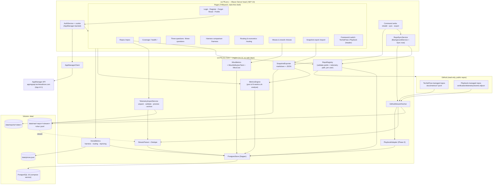
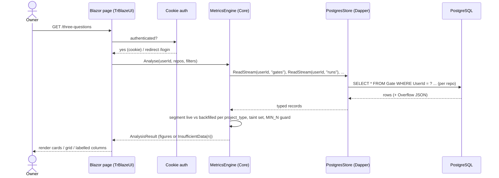
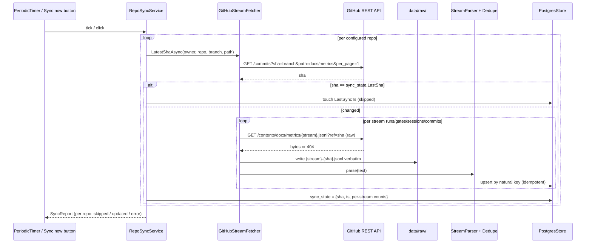
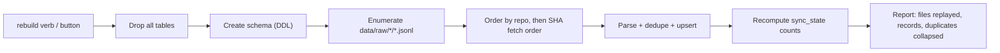
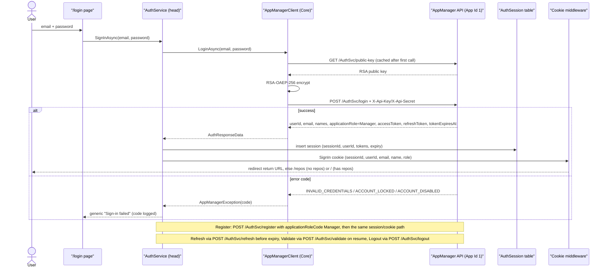
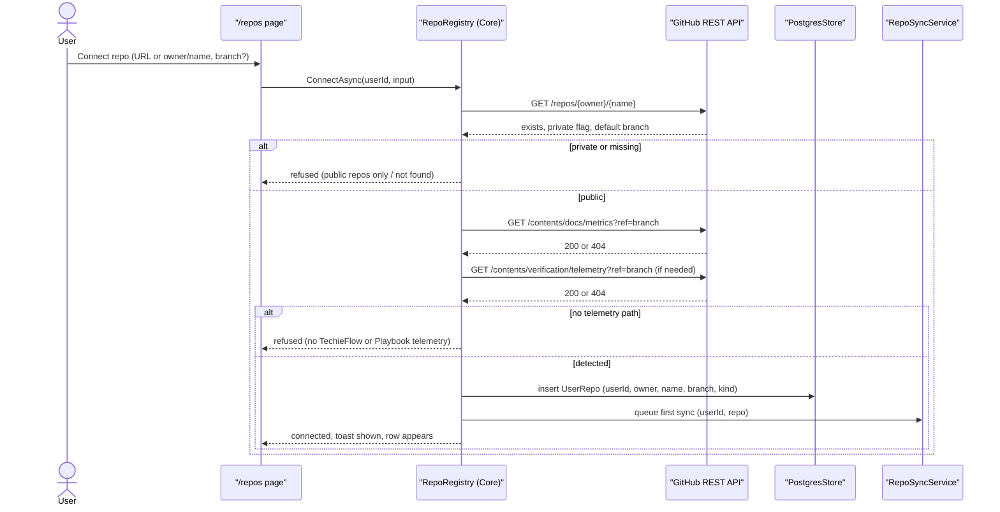
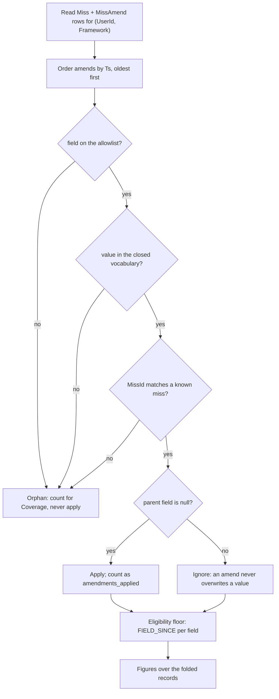
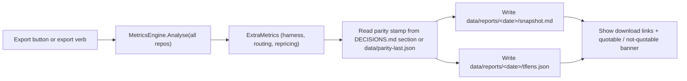
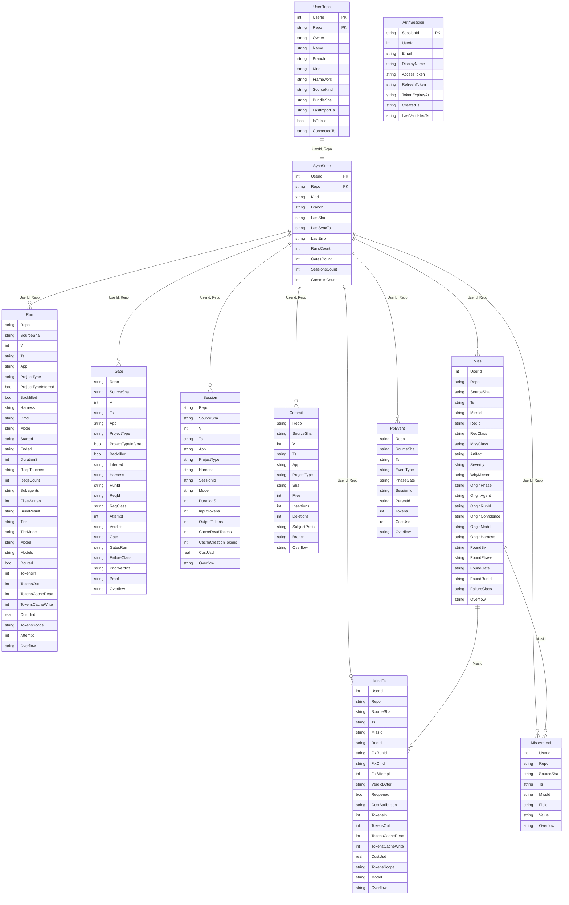
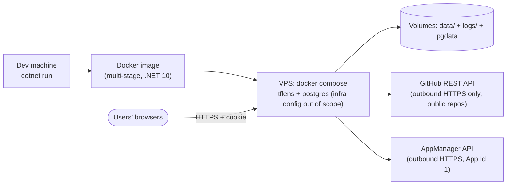

# TfLens — Architecture

**Last updated:** 2026-08-28
**Status:** Target (greenfield) — amended 2026-08-26: AppManager identity (no local users), per-user public-repo management, GitHub SSO deferred to Phase 2, dark-first collapsible shell; round 2 same day: PostgreSQL replaces SQLite (ADR-015), Framework as a provenance axis with the full Playbook report set in Phase 3 (ADR-016), harness columns claude-code/opencode/codex (ADR-017); **amended 2026-08-28: miss telemetry and rework economics — a fifth stream carrying three record kinds on one file (ADR-018), apportioned cost as a distinct result type (ADR-019), amendments folded at read time and never at ingest (ADR-020); round 2 same day: imported telemetry for private/corporate repos, folded into the Repos screen as a second mode — origin displayed but never pooled on (ADR-021), the uploaded bundle's sha256 standing where a commit SHA does (ADR-022)**

<!-- AGENT-ONLY AUTHORING NOTES — never render as visible text.
  DEPTH MANDATE: human document; every non-trivial module gets prose; every significant runtime
  flow beyond the primary path gets its own diagram.
  MERMAID MANDATE: html-render-shell.md §5.5 — quote every label, never use `end` as a node id.
-->

## Table of Contents

1. [Tech stack](#tech-stack)
2. [Component map](#component-map)
3. [Data flow — primary path](#data-flow-primary-path)
4. [Module responsibilities](#module-responsibilities)
5. [Runtime flows beyond the primary path](#runtime-flows-beyond-the-primary-path)
6. [Data model](#data-model)
7. [Metrics engine — parity with tf-metrics.sh](#metrics-engine-parity-with-tf-metrics-sh)
8. [Cross-cutting concerns](#cross-cutting-concerns)
9. [Deployment architecture](#deployment-architecture)
10. [Architectural decisions (ADR-style log)](#architectural-decisions-adr-style-log)
11. [Target architecture (brownfield only — if enhancement changes structure)](#target-architecture-brownfield-only-if-enhancement-changes-structure)
12. [Open questions / risks](#open-questions-risks)
13. [Sources harvested](#sources-harvested)

## 1. Tech stack

| Layer | Choice | Version | Notes |
|-------|--------|---------|-------|
| Runtime | .NET | 10 (LTS) | SDK 10.0.302 present on the dev machine. The brief asks for "current LTS"; .NET 10 is the LTS line as of 2026-08. |
| UI | Blazor Server (Interactive Server render mode) + TrBlazeUI | TrBlazeUI.Components 1.0.7 / Primitives 1.0.3 | Single web head `src/TfLens`. Dogfoods TrBlazeUI where it fits (shell, nav, cards, grid, badges, alerts, dialogs). |
| Data access | Dapper + Npgsql | latest stable | Owner decision (kickoff: Dapper; round-2 amendment 2026-08-26: PostgreSQL instead of SQLite). Hand-written idempotent DDL script `database/001-schema.sql` applied at startup; no migration framework — the store is disposable and rebuilt from `data/raw/`. |
| DB | **PostgreSQL 16** | compose service `postgres` | One table per stream + `SyncState`, `UserRepo`, `AuthSession`, Playbook tables. PascalCase quoted identifiers per Coding Standards. Never the source of truth — raw JSONL is (ADR-015). |
| GitHub access | `HttpClient` against the GitHub REST API (`/repos/{owner}/{repo}`, `/commits`, `/contents`) | — | **Public repos only** (this release); optional server PAT raises the rate limit. No Octokit dependency (ADR-004). |
| Identity | **AppManager** (`https://appmgrapi.techierathore.com`, API v1.4, Application Id 1) via `AppManagerClient` | v1.4 | Login / register / forgot / reset / refresh / validate / logout / profile / change-password. `X-Api-Key`/`X-Api-Secret` from env. RSA-OAEP-256 password encryption with the cached public key. Every user = `Manager`. No licence/feature/payment calls (ADR-011). |
| Auth (session) | ASP.NET Core cookie authentication issued by TfLens after AppManager success | — | Cookie carries userId/email/name/role; AppManager access + refresh tokens kept server-side per session (`AuthSession` table) and refreshed before expiry. GitHub SSO deferred to Phase 2 (ADR-012). |
| Logging | Serilog, rolling file sink under `logs/` + console | — | Standing TechieFlow NFR; wired first in `Program.cs`. |
| Background work | `BackgroundService` (`RepoSyncService`) with `PeriodicTimer` | — | Poll interval from config; manual "Sync now" triggers the same code path. |
| Tests | xUnit + fixture JSONL under `tests/TfLens.Core.Tests/Fixtures/` | — | Parity fixtures mirror real stream shapes; metrics engine tested without the web host. |
| Parity tooling | `tools/parity-compare.py` (Python 3, stdlib only) | — | Same runtime as `tf-metrics.sh`; key-by-key JSON compare. |
| Container | Docker (Linux), volume-mounted `data/` + `logs/` | — | Infra/VPS config is supplied separately and out of scope. |
| Vector store / RAG | none | — | No AI features in TfLens. |

## 2. Component map



Two projects, one head. `TfLens.Core` holds everything that must be testable and parity-checked without a browser: the AppManager client, the repo registry, fetching, parsing, dedupe, storage, the metrics engine, and the exporter. `TfLens` is the only executable: it hosts Blazor Server, the background sync, the AppManager-backed cookie auth, and the three command verbs (`rebuild`, `sync`, `export`) so that a Docker `exec` or a parity run never needs a second image (ADR-005). Every store read and every engine call takes a `UserId` — isolation is a parameter, not a filter someone remembers to add (ADR-013).

## 3. Data flow — primary path

The primary path is "owner opens a report page". Every figure on every page is computed at request time from the stream tables; nothing derived is stored.



The engine never receives a "pool everything" option: `Analyse` returns a structure keyed `live[project_type]`, `backfilled[project_type]`, `pooled` — the same shape as `tf-metrics.sh --rollup --json` — so a page cannot even ask for a merged first-pass rate (§7).

## 4. Module responsibilities

| Module | Responsibility | Depends on |
|--------|----------------|------------|
| `src/TfLens` | Blazor Server head: pages, dark-first collapsible shell, `AuthService` (cookie ↔ AppManager tokens), `RepoSyncService`, command verbs, Serilog wiring, `prices.json` editor | TfLens.Core, TrBlazeUI |
| `src/TfLens.Core/AppManager` | `AppManagerClient` — public-key cache + RSA-OAEP-256 encrypt, login / register (`Manager`) / forgot / reset / refresh / validate / logout / profile / change-password; typed error codes | HttpClient |
| `src/TfLens.Core/Repos` | `RepoRegistry` — per-user `UserRepo` CRUD; **Fetch-via-API** connect validation (exists, public, telemetry path, kind detection); remove = purge rows + raw, identical for both source kinds; demo seed for `TfLensDemo` | HttpClient, Storage |
| `src/TfLens.Core/Import` | `TelemetryImportService` — **Import-metric-files** mode: extension/size gate, safe zip extraction, stream-name recognition, bundle sha256, dry-run **preview**, then archive-verbatim and hand off to the *same* `StreamParser`. Refuses a precomputed rollup. No parse logic of its own | Storage, Parsing |
| `src/TfLens.Core/GitHub` | `GitHubStreamFetcher` — latest-SHA-touching-path lookup, whole-file fetch, raw archive to `data/raw/<userId>/` | HttpClient |
| `src/TfLens.Core/Parsing` | `StreamParser` — JSONL → typed records, schema-v check, overflow capture, **per-`kind` dispatch inside the `misses` stream**; `Dedupe` — natural-key rules per stream and per miss record kind | (none) |
| `src/TfLens.Core/Storage` | `PostgresStore` — DDL, Dapper CRUD, `sync_state`, idempotent upsert, `Rebuild()` | Dapper, Npgsql |
| `src/TfLens.Core/Metrics` | `MetricsEngine` — the `analyse()` port; `ExtraMetrics` — harness comparison, routing drift, counterfactual repricing; **`MissMetrics` — miss figures, read-time amendment folding, the eligibility floor; `MissAttributionTaint`; `MissCost`**; `InsufficientData` type | Storage |
| `src/TfLens.Core/Export` | `SnapshotExporter` — markdown + machine-readable JSON (`tflens.json`) to `data/reports/<date>/` | Metrics |
| `src/TfLens.Core/Playbook` | `PlaybookAdapter` — `events.ndjson` → `PbEvent` table; phase totals; `parentID` split (Phase 3) | Storage |
| `tests/TfLens.Core.Tests` | xUnit: parser, dedupe, engine (fixture-driven, incl. provenance-separation tests) | TfLens.Core |
| `tools/parity-compare.py` | Key-by-key compare of `reference.json` (tf-metrics.sh) vs `tflens.json`; non-zero exit on any diff | Python 3 |

**`AppManagerClient`** (added 2026-08-26). A thin typed client over the AppManager v1.4 REST surface, following the guide's reference implementation (`obj`/`a`/`v` naming). It sends `X-Api-Key` / `X-Api-Secret` (from `TfLensAppManagerApiKey` / `TfLensAppManagerApiSecret`) on every call so the server resolves Application Id 1; fetches and caches `GET /AuthSvc/public-key`; RSA-OAEP-256-encrypts every password field (`encryptedPassword`, `encryptedNewPassword`, `encryptedCurrentPassword`); and maps the documented error codes (`INVALID_CREDENTIALS`, `ACCOUNT_LOCKED`, `ACCOUNT_DISABLED`, `EXPIRED_REFRESH_TOKEN`, `DECRYPTION_FAILED`, `NO_APP_ACCESS`, …) to a typed `AppManagerException`. `RegisterAsync` always passes `applicationRoleCode: "Manager"`. It never calls LicenseSvc, FeatureSvc, PaymentSvc or IssueSvc.

**`AuthService` (head)** (added 2026-08-26). Owns the session: on login/register success it stores the AppManager access/refresh tokens and expiry in the `AuthSession` table keyed by a random session id, issues the TfLens cookie (claims: session id, AppManager `userId`, email, display name, role `Manager`), refreshes the access token through `/AuthSvc/refresh` when within five minutes of `tokenExpiresAt` (rotating the stored refresh token), validates a resumed cookie once per hour through `/AuthSvc/validate`, and on sign-out calls `/AuthSvc/logout` with the refresh token and deletes the session row. Tokens never reach the browser.

**`RepoRegistry`** (added 2026-08-26). The per-user repo list. `ConnectAsync(userId, input)` parses a GitHub URL or `owner/name`, calls `GET /repos/{owner}/{name}` (must exist, `private == false`, else refused), resolves the branch (default branch unless specified), probes `GET /repos/{o}/{n}/contents/docs/metrics?ref=branch` then `.../verification/telemetry` to detect the kind, and saves the `UserRepo` row; the first sync is queued immediately. `RemoveAsync` deletes the user's rows in every stream table and `SyncState` for that repo and removes `data/raw/<userId>/<owner>__<name>/`. Duplicate `owner/name` per user is rejected; different users may connect the same repo. At first start the `DemoSeedRepos` configuration is connected to `TfLensDemo` through the same path.

**`TelemetryImportService`** (added 2026-08-28). The second way a source's data arrives, and deliberately the *thinner* of the two: it does everything up to the point where the existing pipeline takes over, and nothing after. `PreviewAsync(userId, upload)` gates on extension (`.zip`/`.jsonl`/`.ndjson`) and size (25 MB, checked before a byte is read), extracts a zip **safely** (entry-count and uncompressed-size limits against archive bombs; no absolute paths, no `..` segments, no symlinks; extraction confined to `data/raw/<userId>/`), recognises entries by stream file name (`runs|gates|sessions|commits|misses.jsonl`, `events.ndjson`), computes the **bundle sha256**, and runs the ordinary parser in **dry-run** to report records per stream, date range, invalid lines and unknown field names. Nothing is written. `CommitAsync` then archives the recognised bytes verbatim under `data/raw/<userId>/<source>/<stream>-<bundleSha>.jsonl` and calls the same `StreamParser` + `Dedupe` + `UpsertAsync` the fetcher calls — so a re-import collapses on the natural keys and cannot double-count, and a parser fix improves imported and fetched data at once. It **refuses a precomputed rollup** (a `tflens.json`, a `--rollup --json` output, an exported snapshot) with a message naming what to upload instead: TfLens computes every figure from raw records at request time (ADR-007), and accepting conclusions instead of evidence would put a plausible wrong number one upload away. Nothing in an upload is executed, rendered as HTML, or written outside the user's own archive directory.

**`GitHubStreamFetcher`.** For each connected repo (of every user in the poller; of the signed-in user on Sync now) it asks the REST API for the newest commit touching the telemetry path on the configured branch (`GET /repos/{o}/{r}/commits?sha={branch}&path=docs/metrics&per_page=1`). If that SHA equals `sync_state.LastSha`, the repo is skipped — no file traffic at all. Otherwise it fetches each stream file at that exact SHA (`GET /repos/{o}/{r}/contents/docs/metrics/{stream}.jsonl?ref={sha}` with `Accept: application/vnd.github.raw`), writes the bytes verbatim to `data/raw/{owner}__{repo}/{stream}-{sha}.jsonl` **before** parsing, and only then hands the text to the parser. A 404 on a stream file is a legitimate "stream absent" (recorded as zero records), not an error. The fetcher is structurally read-only: it holds no write scopes, and no code path issues anything but GET.

**`StreamParser` + `Dedupe`.** Line-by-line `System.Text.Json` parse; a malformed line is counted and skipped (mirrors `read_stream` in the reference, which logs and skips). Known fields map to typed columns named exactly as SCHEMA.md; any property not in the known set for that stream (or any record with `v > 1`) is preserved in the `Overflow` JSON column. The dedupe keys are the natural identities the brief fixes: `commits` on `sha` (per repo — two repos may share a short sha), `sessions` keep-highest-`output_tokens`-then-latest-`ts` per `session_id`, `runs` on `ts+app+cmd`, `gates` on `ts+app+req_id+run_id`. Re-parsing the same raw file is therefore a no-op.

`misses` (added 2026-08-28) is the first stream whose records do **not** all have the same shape, and it is the one genuinely structural change this amendment makes to the parser: `AddRecord` stops being a 1:1 switch on `StreamKind` and dispatches on the record's own `kind` **within** the `Misses` case — `miss` → `MissRecord`, `miss-fix` → `MissFixRecord`, `miss-amend` → `MissAmendRecord`, anything else `InvalidLines++` and skip. An unknown `kind` in a stream TfLens *does* know is the same class of event as a malformed line, so it is counted and skipped, never thrown. Dedupe follows suit: `miss` on `(UserId, Repo, MissId)` earliest-wins (a miss is opened once), `miss-fix` on `(UserId, Repo, MissId, FixRunId)` latest-wins, `miss-amend` on `(UserId, Repo, MissId, Field, Ts)` earliest-wins. None of the three needs the `merge=union` handling `commits` needs — misses are events on one machine and cannot be independently reconstructed elsewhere. `IsDocumented` is keyed on stream, and `misses` has three field vocabularies: it takes their **union** for Coverage's "fields observed that SCHEMA.md does not document" report, because a `miss-fix`-only field seen on a `miss` record is not worth a separate report and would only produce noise.

**`PostgresStore`** (SQLite → PostgreSQL, 2026-08-26). Owns the schema script (§6), opens one `NpgsqlConnection` per unit of work (pooled by Npgsql), and exposes stream reads per user and repo plus `SyncState`. Every identifier is PascalCase and double-quoted in SQL (`"Gate"."ReqId"`) so the Coding Standards' naming survives Postgres's lower-casing. Upserts use `INSERT … ON CONFLICT DO NOTHING` against the unique indexes that encode the dedupe keys. `Rebuild()` truncates every stream table, re-applies the schema script, and replays every file under `data/raw/` in `(user, repo, sha-fetch-order)` — the raw archive is the rebuild source, never the API. **Framework** is stored on `UserRepo.Framework` (`techieflow` | `playbook`, set at connect time from the telemetry path) and every engine read takes `(UserId, Framework)`, so a figure cannot pool across frameworks any more than across users (ADR-016).

**`MetricsEngine`.** A field-for-field port of `analyse()` in `tf-metrics.sh` (§7). Its public result type has no "total" slot: figures live under `Live[projectType]`, `Backfilled[projectType]`, and `Pooled`. Any figure with fewer than `MinN = 3` supporting records is an `InsufficientData(n)` value, which the UI renders as text, never as a number.

**`ExtraMetrics`.** The metrics the reference does not compute — per-harness volumes/tokens/verdict mix (dollars only for `harness == "opencode"`), routing drift (`routed:false`, `tier_model` vs `model`), tokens by model, and counterfactual repricing from `data/prices.json` (labelled *estimate* everywhere). These have no parity oracle and are spot-checked by hand against raw JSONL once (BRD §9 F-PARITY).

**`MissMetrics` + the two provenance guards (added 2026-08-28).** The miss engine reads `Miss`, `MissFix` and `MissAmend` for `(UserId, Framework)` and does four things in order. **(1) Fold**: apply every `MissAmend` to its parent, oldest first, filling a `null` and never overwriting a non-`null` value — the null-check is re-applied here rather than trusted, because TfLens ingests archived files from many machines and a merged stream can carry an amend and a later-written value in either order; only fields on the allowlist (`WhyMissed` today) with values inside their closed vocabulary are applied, and anything else is an orphan, counted for Coverage and never applied. **(2) Floor**: `FIELD_SINCE = { "why_missed": 2026-08-28 }` sits beside the existing `LATE_GATES` table and, ideally, in the same code path — a miss written before the field existed leaves that field's denominator and is reported separately. **(3) Taint**: `MissAttributionTaint` is a sibling of `TaintSet` and excludes `OriginConfidence != "linked"` records from every per-phase, per-model and per-agent figure; like `TaintSet` it is both **applied and displayed**. **(4) Shape**: every figure returns a `Figure`, and every token/cost figure returns `MissCost(Figure Sole, Figure Apportioned, int NoneCount)` — a page binding it cannot render one blended number because no such property exists. `AnalysisResult` gains a `Misses` section; `AnalysisCacheInvalidator` invalidates on a `misses` sync exactly as it does for the other four streams.

**`SnapshotExporter`.** Writes `data/reports/<yyyy-MM-dd>/snapshot.md` (human) and `tflens.json` (machine, same key layout as `tf-metrics.sh --rollup --json` plus an `extras` object) — the diffable numbers for the plan's Numbers table and B3, with the parity stamp (last passing run date + dataset SHAs) embedded.

**`PlaybookAdapter` (Phase 3).** Separate tables (`PbEvent`, `PbSyncState`), separate page. Phase-gates (`phase_gate`) and TechieFlow assertion-gates (`gate`) never share a column or chart (SCHEMA.md §11). Built as schema-discovery: the first task is to parse the real `events.ndjson` and record the observed field names in DECISIONS.md before any chart exists.

## 5. Runtime flows beyond the primary path

### 5.1 Repo sync (background + Sync now)



Errors are per-repo and non-fatal: a 401/403/404/network failure is written to that repo's `sync_state.LastError` and surfaced on the Coverage page; the other repos still sync. Nothing is ever written back to any repository.

### 5.2 Rebuild from raw



### 5.3 Login via AppManager (amended 2026-08-26)



### 5.5 Connect a repo (added 2026-08-26)



### 5.6 Miss amendments — folded at read time, never at ingest (added 2026-08-28)

`miss-amend` records are **stored, not collapsed**. Folding is a read-time operation over the stored rows, so `RebuildAsync` replays and re-derives them exactly like every other figure, and a reader that ignores amend records entirely still sees nothing false — only less.



The null-check is re-applied here rather than assumed: TfLens ingests archived files from many machines, and a merged stream can carry an amend and a later-written value in either order. Trusting the producer to have enforced it would make the invariant depend on arrival order, which is precisely the class of bug this product exists to avoid.

### 5.7 Import metric files — the second mode of the Add-source dialog (added 2026-08-28)

The path a private or corporate repo's telemetry takes. Note where it **joins** the existing pipeline: at the archive, exactly where the fetcher hands off — everything downstream is shared.

```mermaid
sequenceDiagram
  actor U as User
  participant P as "/repos — Add source (mode: Import)"
  participant I as "TelemetryImportService (Core)"
  participant Raw as "data/raw/&lt;userId&gt;/&lt;source&gt;/"
  participant Pa as "StreamParser + Dedupe (shared)"
  participant S as "PostgresStore"
  U->>P: name the source, pick framework, drop a .zip / .jsonl
  P->>I: PreviewAsync(userId, upload)
  I->>I: extension + size gate, then safe extraction
  alt refused
    I-->>P: "rollup or snapshot, not raw streams" / "unsafe archive" / "nothing recognised"
    P-->>U: message naming what to upload instead; NOTHING written
  else recognised
    I->>I: bundle sha256; dry-run parse
    I-->>P: preview: records per stream, date range, invalid lines, unknown fields, sha256
    U->>P: review, then press Import
    P->>I: CommitAsync
    I->>Raw: write bytes VERBATIM as &lt;stream&gt;-&lt;bundleSha&gt;.jsonl
    I->>Pa: parse the same text with the same parser
    Pa->>S: upsert by natural key (idempotent — a re-import collapses)
    I-->>P: records added, duplicates collapsed, per stream
    P-->>U: toast; row appears with SourceKind = import
  end
```

The source row carries `SourceKind = "import"`, so the poller skips it, its row action is **Re-import** rather than Sync, and Coverage reads its staleness as days-since-import. Nothing else in the system branches on it.

### 5.4 Weekly snapshot export



## 6. Data model

PostgreSQL 16 (amended 2026-08-26; three miss tables added 2026-08-28). One table per stream — except `misses`, whose three record kinds get three tables — columns named exactly as SCHEMA.md fields (PascalCase per Coding Standards maps 1:1 — `req_id` → `ReqId`, etc., always double-quoted in SQL; the JSON→column mapping table lives in `StreamParser`). `Overflow` is a `jsonb` column. Every stream table carries `UserId` (amended 2026-08-26 — the AppManager user who connected the repo), `Repo` (owner/name), `SourceSha`, and `Overflow` (JSON text of unknown fields). Identity tables: `UserRepo` (the per-user source list) and `AuthSession` (server-side AppManager tokens per cookie session). `UserRepo.SourceKind` (`api` | `import`, added 2026-08-28) is the **only** structural trace of how a source's data arrives; `BundleSha` and `LastImportTs` are populated for imported sources and `null` for fetched ones, and `LastSha` is the reverse. No stream table carries the distinction, because no figure segments on it (ADR-021). TfLens stores **no user profile and no password** — the AppManager `userId` is the only user key.



Every stream table also carries `UserId` (omitted from the boxes above for brevity). Unique indexes implement the dedupe keys per user: `UcCommitUserRepoSha (UserId, Repo, Sha)`, `UcRunIdentity (UserId, Repo, Ts, App, Cmd)`, `UcGateIdentity (UserId, Repo, Ts, App, ReqId, RunId)`; sessions are collapsed in the parser (keep max `OutputTokens`, tie → latest `Ts`) and stored with `UcSessionUserRepoId (UserId, Repo, SessionId)`. The miss tables (added 2026-08-28) follow the same house style — every identifier double-quoted, `UserId` a real column and part of every unique index (ADR-013), `CREATE TABLE IF NOT EXISTS` so `database/001-schema.sql` stays idempotent at every startup with no migration framework:

```sql
-- unique keys (the dedupe rules, encoded)
CREATE UNIQUE INDEX IF NOT EXISTS "UxMiss"      ON "Miss"      ("UserId","Repo","MissId");
CREATE UNIQUE INDEX IF NOT EXISTS "UxMissFix"   ON "MissFix"   ("UserId","Repo","MissId","FixRunId");
CREATE UNIQUE INDEX IF NOT EXISTS "UxMissAmend" ON "MissAmend" ("UserId","Repo","MissId","Field","Ts");
-- read paths
CREATE INDEX IF NOT EXISTS "IxMissUserRepo"    ON "Miss"      ("UserId","Repo");
CREATE INDEX IF NOT EXISTS "IxMissOriginModel" ON "Miss"      ("UserId","OriginModel");
CREATE INDEX IF NOT EXISTS "IxMissFixUserRepo" ON "MissFix"   ("UserId","Repo");
CREATE INDEX IF NOT EXISTS "IxMissFixMissId"   ON "MissFix"   ("UserId","MissId");
CREATE INDEX IF NOT EXISTS "IxMissAmendMissId" ON "MissAmend" ("UserId","MissId");
```

`ITelemetryStore` gains `ReadMissesAsync`, `ReadMissFixesAsync` and `ReadMissAmendsAsync` mirroring `ReadGatesAsync`'s signature; `UpsertAsync` handles the three new `ParseResult` collections; and **`DeleteRepoDataAsync` must purge all three** — missing one leaves orphaned rows that reappear in every figure, which is the worst class of bug in a product whose promise is correct numbers. `SyncState` gains a `misses` row per repo, so Coverage's per-repo stream table goes from four rows to five. `AuthSession` token columns are encrypted at rest with ASP.NET Data Protection. `PbEvent` columns are provisional until the real file is parsed (Phase 3 schema-discovery). Nullable-vs-absent is preserved: an absent optional field is stored as `NULL`, never `0` (SCHEMA.md §2.5).

## 7. Metrics engine — parity with tf-metrics.sh

The reference script is the specification. The port keeps its names so a diff reads naturally:

| tf-metrics.sh | TfLens.Core | Rule carried |
|---|---|---|
| `read_stream` | `PostgresStore.ReadStream` | invalid lines skipped and counted |
| `dedupe_commits` | `Dedupe.Commits` | per repo, first wins, count collapsed |
| `seg()` | `Segment.ByProjectType` | `project_type_inferred` → `unclassified`, never `app` |
| `tainted = {req_id of any backfilled}` | `TaintSet` | excluded from live first-pass; listed on screen |
| `first_pass_rate` | `FirstPassRate` | `attempt==1 && verdict==Verified` ÷ distinct eligible `req_id`; `MinN` guard |
| `gate_distribution` | `GateDistribution` | over `verdict ∉ {Verified, Done (pre-existing)}`; `escaped` its own row; `unattributed` bucket |
| `late_gate_coverage` | `LateGateCoverage` | `LATE_GATES = { perf: 2026-08-10 }`; `ran` = `gates_run` contains; `caught` beside it |
| `escape_rate` | `EscapeRate` | REQs with `gate=="escaped"` ÷ REQs with any failure; `MinN` |
| pooled block | `Pooled` | rework ratio, batch median, throughput median (REQs/hour, 2 dp), tokens total (sessions in+out), tokens per Verified (1 dp), cadence, `cost_usd: null` |
| `pct()` | `Pct` | `"—"` when denominator 0; `%.0f%%` otherwise |
| `MIN_N = 3` | `MetricsEngine.MinN` | constant, no configuration key |
| `LATE_GATES = { perf: … }` | `LateGateCoverage` | *(and, 2026-08-28)* `FIELD_SINCE = { why_missed: 2026-08-28 }` — same table, same code path, applied to an optional field instead of a gate |
| misses block: `open_misses` / `wont_fix` | `MissMetrics.Open` / `.Declined` | two predicates that deliberately disagree; `deferred` stays open, `wont-fix` never folds in |
| misses block: `why_missed{}` / `why_missed_n` | `MissMetrics.FailedPractice` | denominator is records carrying the field, surfaced as `n of N assessed` |
| misses block: `attributed_n` / `attribution_excluded` | `MissAttributionTaint` | `linked` only; applied **and** displayed, like `TaintSet` |
| misses block: `cost_sole_n` / `cost_shared_n` / `cost_unattributable_n` | `MissCost` | three keys, never collapsed into one blended figure |

Three guarantees are enforced by type, not by discipline: (1) `AnalysisResult` has no member that could hold a cross-`project_type` or cross-provenance rate; (2) `Figure` is a discriminated union of `Value` / `InsufficientData(n)` / `NotApplicable` — a page binding a `Figure` cannot print a number for an `InsufficientData` case; and (3) *(2026-08-28)* `MissCost` exposes `Sole`, `Apportioned` and `NoneCount` and nothing else, so a page cannot render a blended measured-plus-apportioned cost — there is no property to bind. The technique is the same each time: **make the wrong number unrepresentable rather than forbidden** (ADR-007, ADR-019). A unit test asserts the engine output on the fixture set equals a checked-in `reference.json` produced by the script.

## 8. Cross-cutting concerns

- **Logging** — Serilog, `WriteTo.File("logs/tflens-.log", rollingInterval: Day, retainedFileCountLimit: 14)` + console, wired before the host builds; `ILogger<T>` in app code; sync outcomes logged per repo (IDs and counts only — never file contents).
- **Error handling** — per-repo sync errors captured to `sync_state.LastError` and rendered on Coverage; Blazor error boundary on each page; unhandled exceptions → `Log.Fatal` at the head boundary.
- **Auth** — AppManager-backed (ADR-011): cookie auth for every page and the export endpoint; `/login`, `/register`, `/forgot-password`, `/reset-password`, `/healthz` are the only anonymous routes; antiforgery on every form; AppManager tokens server-side only. Every user is `Manager`; no licence checks anywhere.
- **Uploads** (added 2026-08-28) — the Import-metric-files mode is the **only** inbound path and is authenticated, per-user, and bounded before anything is read: extension allow-list (`.zip`/`.jsonl`/`.ndjson`), 25 MB cap, entry-count and uncompressed-size limits, no absolute/`..`/symlink archive entries, extraction confined to `data/raw/<userId>/`. Nothing uploaded is executed or rendered as HTML; the preview reads it and reports, then the user decides. There is no unauthenticated endpoint and no machine-to-machine ingest API.
- **Secrets** — AppManager key/secret and the optional PAT from environment / user-secrets via the PascalCase env-var provider (`TfLensAppManagerApiKey`, `TfLensAppManagerApiSecret`, `TfLensGitHubToken`). Never in `appsettings.json`, never in the repo, never logged.
- **Tenant isolation** — `UserId` is a required parameter of every `PostgresStore` read/write, every engine call, the raw-archive path and the reports path (ADR-013); an integration test signs in two users and asserts neither can see the other's repos or figures.
- **Theme** — dark by default (ADR-014): `<html class="dark">` unless the user's persisted preference says light; toggle in the header.
- **Privacy** — TfLens stores and shows only what the streams carry (SCHEMA.md §9). The overflow column is displayed nowhere; it exists for rebuild fidelity and the "unknown fields" report.
- **Caching** — `AnalysisResult` memoised per `(sync version, filter)` in `IMemoryCache`; invalidated on every completed sync or rebuild.
- **Health** — `/healthz` reports DB reachable + last successful sync age; no metrics exposed there.
- **Telemetry** — none outbound. TfLens itself is a TechieFlow-managed repo, so its own `docs/metrics/` streams are emitted by the framework as usual (and it may read them like any other repo).

## 9. Deployment architecture



Two containers via `docker-compose.yml` (amended 2026-08-26): `tflens` (single process) and `postgres` (PostgreSQL 16, its data directory on a named volume, not exposed outside the compose network). TfLens's own persistent state is `data/` (`raw/<userId>/`, `reports/<userId>/`, `prices.json`) and `logs/`. The image never contains the AppManager secret, the connection string or the PAT; they arrive as environment variables (`TfLensDbConnection` points at the `postgres` service). No inbound endpoint exists other than the authenticated UI, the anonymous auth pages and `/healthz`.

## 10. Architectural decisions (ADR-style log)

- **ADR-001 — Blazor Server with TrBlazeUI as the only UI head.** Reason: the brief fixes Blazor Server; dogfooding TrBlazeUI is an explicit goal; a single-user dashboard has no WASM/offline need.
- **ADR-002 — SQLite via Dapper + Microsoft.Data.Sqlite, hand-written DDL, no migrations.** Reason: owner choice at kickoff; the store is disposable (rebuilt from `data/raw/`), so migrations add ceremony without value and the overflow JSON column stays an explicit `TEXT` column.
- **ADR-003 — No vector store / RAG.** Reason: TfLens has no AI features.
- **ADR-004 — Raw `HttpClient` against the GitHub REST API, not Octokit.** Reason: three GET calls per repo; a typed SDK adds a dependency and hides the `Accept: application/vnd.github.raw` header the whole-file fetch relies on.
- **ADR-005 — One executable (`src/TfLens`) hosting web + background sync + command verbs (`rebuild`, `sync`, `export`).** Reason: 1–2 day timebox and one Docker image; the verbs run via `dotnet TfLens.dll rebuild` / `docker exec`, and share the `TfLens.Core` engine so parity runs use exactly the code the pages use.
- **ADR-006 — `TfLens.Core` is UI-free and web-free.** Reason: the engine must be unit-testable against fixture JSONL and driven by the CLI verbs without a browser; it also keeps the parity surface (engine output) identical between the export and the pages.
- **ADR-007 — Provenance rules are encoded in the result type (`AnalysisResult` has no total slot; `Figure` carries `InsufficientData`).** Reason: the brief demands "no flag to disable"; a shape that cannot express the forbidden number is stronger than a check.
- **ADR-008 — Parity compare script in Python (`tools/parity-compare.py`).** Reason: it runs where `tf-metrics.sh` runs (Python 3 already required), needs no build, and compares `reference.json` vs `tflens.json` key-by-key.
- **ADR-009 — `data/prices.json` is the only editable input; repricing is labelled *estimate* in every rendering and export.** Reason: SCHEMA.md §4 forbids presenting a rate-card figure as a measurement; the label is part of the contract.
- **ADR-010 — Playbook adapter is separate tables + separate page, built schema-discovery-first.** Reason: SCHEMA.md §11 (`gate` vs `phase_gate` are different axes); no sample file exists yet (kickoff answer), so the adapter's first task is to parse the real file and record the field names.
- **ADR-011 — AppManager is the identity provider; TfLens holds no users and no passwords (2026-08-26).** Reason: owner decision; TfLens is free/open source and multi-user, AppManager already provides registration, login, reset and RSA-encrypted password transport; every user is `Manager` and no licence/feature/payment endpoint is used. Supersedes the single-user PBKDF2 design (BRD-3 retired).
- **ADR-012 — GitHub SSO deferred to Phase 2 (2026-08-26).** Reason: AppManager v1.4 has no external-login or token-exchange endpoint; the only bridge would be a TfLens-held per-user random credential, which the owner declined for this release. Revisit when AppManager offers SSO.
- **ADR-013 — Public GitHub repos only, managed per user in the app; `UserId` is a mandatory parameter everywhere (2026-08-26).** Reason: anyone using the frameworks must be able to connect their repo without the operator editing config; public-only removes per-user token handling from this release; isolation as a parameter (not a filter) is the cheapest way to make a cross-user leak a compile-time absence rather than a runtime oversight.
- **ADR-014 — Dark-first, collapsible icon sidebar, user menu in the header (2026-08-26).** Reason: owner's mockup review; TrBlazeUI's `Sidebar Collapsible` + `SidebarTrigger` + `DropdownMenu` cover it natively.
- **ADR-015 — PostgreSQL 16 via Npgsql + Dapper, superseding ADR-002 (2026-08-26, round 2).** Reason: the app runs in a container where SQLite on volume storage is unreliable (locking, fsync semantics); Dapper stays because the hand-written, parity-auditable SQL is the point. Idempotent schema script at startup instead of a migration framework — the store is still disposable and rebuilt from `data/raw/`.
- **ADR-016 — Framework is a stored, mandatory provenance axis (2026-08-26, round 2).** Reason: the owner will run Playbook-built apps to collect telemetry and wants the full report set for both frameworks; `UserRepo.Framework` is set at connect time from the telemetry path, every engine read takes `(UserId, Framework)`, and the header switch is the only way to change it — the same "shape forbids the merged number" approach as ADR-007/013. The single Playbook page is retired; the `events.ndjson` adapter (Phase 3) feeds the same pages through Playbook-native equivalents.
- **ADR-017 — Harness columns are the detected values `claude-code` / `opencode` / `codex`; `null` is a footnote, never a column and never dropped (2026-08-26, round 2).** Reason: Codex CLI is a real `harness` value in SCHEMA.md and TechieFlow detects it now; undetected records must stay visible (SCHEMA.md §1 "a missing label is merely missing") without pretending to be a fourth harness.

- **ADR-018 — Three record kinds live on one stream (`misses.jsonl`) and in three tables, parsed by a per-record `kind` dispatch (2026-08-28).** Reason: the producer publishes one file because a miss has a *lifecycle* — opened, amended, closed — and splitting it into three files would put a foreign key across three append-only logs that merge independently, which is exactly how a `miss-fix` loses its `miss`. TfLens follows the file, not its own convenience: `StreamKind` stops being 1:1 with a table, `AddRecord` dispatches on the record's own `kind` inside the `Misses` case, and an unknown `kind` is counted-and-skipped like a malformed line (never thrown), because an unknown kind in a stream we *do* know is the same class of event. Three tables rather than one wide nullable table because the three shapes share only the common set, and a single table would make every column of two kinds nullable and every query a discriminator check.
- **ADR-019 — Apportioned cost gets a distinct result type (`MissCost`), not a flag (2026-08-28).** Reason: a fix run that repaired three misses has one token window; dividing by three is arithmetic, not measurement, and the two must never be summed. A boolean like `IsApportioned` alongside one `Cost` property would leave the blended number one careless binding away, and a rule in prose is a rule someone deletes in a refactor. `MissCost(Figure Sole, Figure Apportioned, int NoneCount)` has **no** property that could hold a blend, so the page, the export and parity all carry the split by construction. Same technique as `Figure` and `AnalysisResult` (ADR-007): make the wrong number unrepresentable rather than forbidden.
- **ADR-020 — `miss-amend` records are stored and folded at read time, never collapsed at ingest (2026-08-28).** Reason: folding at ingest would make the stored value depend on the order files happened to arrive — TfLens ingests archived files from many machines, and a merged stream can legitimately carry an amend and a later-written value in either order. Storing the amend rows and folding on read keeps `RebuildAsync` re-deriving identical values from `data/raw/`, keeps the raw archive the only source of truth (ADR-015), and lets the invariant ("an amend may fill a `null`, never overwrite one") be re-checked by TfLens rather than trusted to the producer. The cost is one extra table and a fold on every read; the memoised `AnalysisResult` absorbs it.

- **ADR-021 — Source origin (`api` vs `import`) is a displayed attribute, never a pooling axis (2026-08-28).** Reason: TfLens's existing walls — live/backfilled, `project_type`, framework, user — exist because mixing across them produces a figure that looks normal and is wrong. Origin is not that kind of boundary: a record's `backfilled`, `project_type`, `harness` and `origin_confidence` fields mean exactly the same thing whether the line arrived over HTTPS or off a desktop, because how a file was *delivered* is not a property of what it *records*. Segmenting on it would split every figure on every page into two smaller halves, many of them below `MinN`, and buy nothing. So it is shown everywhere it could matter (row badge, Coverage column, `source_kind` in the export) and divides nothing — the same discipline as the taint counts, which are applied *and* displayed but never used to partition a report. The residual risk — an imported bundle could have been hand-edited — is handled by visibility, not by a wall, and deliberately not by a signature the frameworks do not produce.
- **ADR-022 — An imported source's dataset identity is the bundle's sha256, standing exactly where a fetched source's commit SHA stands (2026-08-28).** Reason: BRD §13 pins a parity run to a dataset, and an uploaded zip has no commit to name. A content hash is the natural substitute and is strictly stronger for the purpose: the reference script is run over the *identical archived bytes* rather than over a fresh clone the operator hopes matches. It also gives the raw archive a stable, collision-resistant filename component (`<stream>-<bundleSha>.jsonl`), so re-importing the same bundle overwrites its own file rather than accumulating copies, while re-importing a *changed* bundle lands beside it and replays in order — the same shape the SHA-named fetched files already have. `UserRepo` therefore carries `LastSha` **or** `BundleSha`, never both.

## 11. Target architecture (brownfield only — if enhancement changes structure)

Not applicable — greenfield; §2 is the target.

## 12. Open questions / risks

- **Schema v=2 arrival.** Unknown fields land in `Overflow` and are listed on the Coverage page ("fields observed that SCHEMA.md doesn't document"), but a *renamed* or *re-typed* known field would silently fall into the overflow and drop out of the metrics. First thing that breaks: any figure depending on the renamed field, with no error. Mitigation: a per-sync "unknown fields" report + a hard warning when `v > 1` is seen.
- **Playbook `events.ndjson` shape is unknown** — `PbEvent` columns are provisional (ADR-010).
- **GitHub rate limits / PAT expiry.** A fine-grained PAT has a maximum lifetime; expiry shows up as 401s on the Coverage page. Poll interval defaults to 15 minutes; 5 repos × 5 calls is far below the 5,000/hour authenticated limit.
- **Reference drift.** `tf-metrics.sh` can change (it is part of the framework and is refreshed by `update-framework.sh`). The parity procedure re-runs after every parser change *in TfLens*, but a reference change also invalidates the last parity stamp — record the script's own hash in the parity entry.
- **Short-SHA collision across repos** is handled (dedupe per user and repo); duplicate `owner/name` per user is rejected at connect time.
- **AppManager availability** is now on the sign-in path. Sessions keep working on their server-side refresh token until it expires; there is deliberately no local fallback.
- **GitHub unauthenticated rate limit** (60 requests/hour per IP) with many users and no server PAT: the SHA-skip keeps steady state at one request per repo per poll, but connect-time validation costs 2–3 requests; the optional PAT lifts this to 5,000/hour.
- **AppManager password rules and error codes** are taken from the v1.4 guide; the client must be re-checked against `api-migration-notes` on the next AppManager release.
- **Playbook-native "three questions"** map `phase_gate` values to first-pass / catch / escape analogues — the mapping is provisional until the real `events.ndjson` is parsed (Phase 3) and must be written into DECISIONS.md before any Playbook figure is exported.
- **The `project_type` reclassification split** (2026-08-28). Every greenfield repo is born `docs` — at scaffold time there is no `src/` — and the producer now upgrades it to `app` on refresh, but **already-written records keep `project_type:"docs"`**, because streams are append-only and corrections happen at read time. Since §6 forbids pooling across `project_type`, one project legitimately appears under two segments with no visible reason, and silently looks like two projects. TfLens hits this first because TfLens *caused* it (it was classified `docs` while carrying 225 gate records). Coverage must detect the disagreement between a repo's current classification and its own records and state it in words, describing each segment as a *period* of the project (BRD-127).
- **`escapes_missing_why` is a data-quality figure, not a quality one.** An escape arriving with no `WhyMissed` is the most valuable record in the stream arriving incomplete. It belongs on Coverage, never on the `/misses` KPI row, where it would read as a defect count.
- **An imported bundle is user-supplied**, and TfLens does not attempt to detect tampering — the frameworks emit no signature, and asking them to is out of scope (BRD §1: TfLens never asks a framework to change). The mitigation is visibility (ADR-021), not verification. Worth revisiting if the frameworks ever sign their streams.
- **Import is the first inbound write surface** in a product whose §3 previously promised none. It is bounded in code rather than by convention (extension, size, safe extraction, confined path, no execution — BRD-139) and the out-of-scope line was narrowed in the BRD rather than quietly broken. A future ask for an *automated* push endpoint should be treated as a genuinely new decision, not as an extension of this one.
- **Postgres in the parity loop:** `tf-metrics.sh` reads files, TfLens reads Postgres; the parity procedure pins the dataset by SHA, so the store is irrelevant to the comparison — but a `rebuild` must precede every parity run to rule out stale rows.

## 13. Sources harvested

- `docs/TfLens-Project-Brief.md` (v2) — concept, phases, constraints, parity procedure, definition of done. Superseded by this document + the BRD; archived to `docs/OldDocs/`.
- `.tfcore/telemetry/SCHEMA.md` (schema v=1) — field names, enums, provenance rules.
- `.tfcore/telemetry/tf-metrics.sh` — reference implementation of every reporting rule (the parity oracle).
- `docs/ravi-90day-positioning-plan-v2.4.2.md` — A-V / A0′ / B1 / B3 context only; stays in `docs/` (independently authoritative).
- `docs/AppManager-api-usage-guide.md` (v1.4) — identity integration (amendment 2026-08-26); stays in `docs/` (independently authoritative).
- Owner requirement, 2026-08-28 (round 2) — imported telemetry for private/corporate repositories, folded into the Repos screen as a second mode of one dialog.
- `docs/Miss-Telemetry-TfLens.md` + `docs/Miss-Telemetry-TechieFlow.md` (2026-08-28) — the miss stream's design record and the shipped producer's contract; source of the F-MISS amendment. Both stay in `docs/` (independently authoritative).
- `.tfcore/telemetry/SCHEMA.md` §5.5 (2026-08-28) — the three miss record kinds, the `why_missed` vocabulary, the `cost_attribution` and `origin_confidence` derivation rules.
