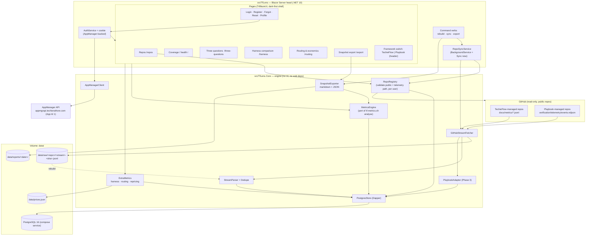
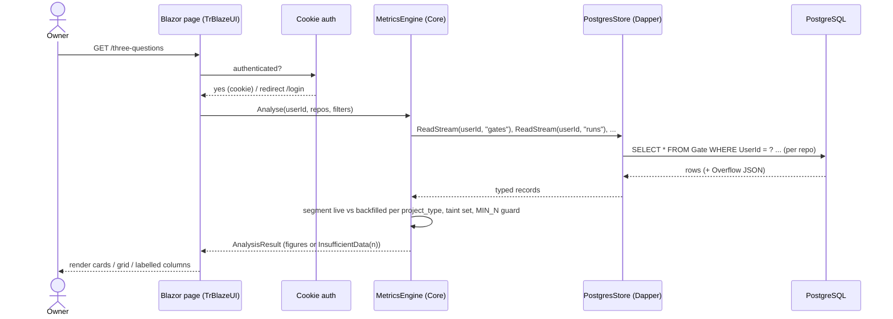
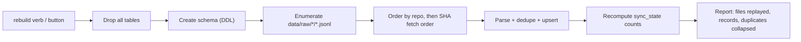
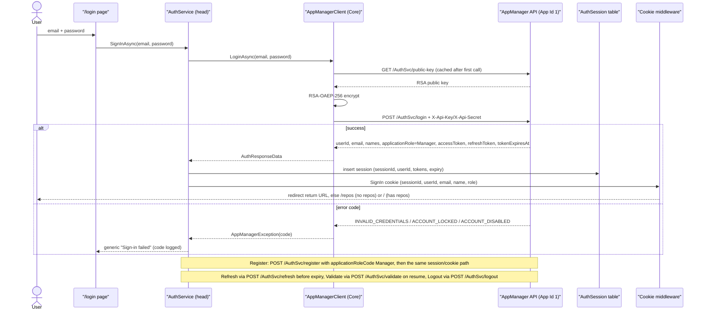
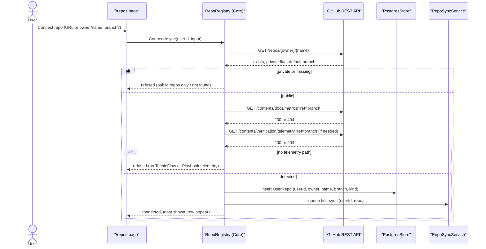
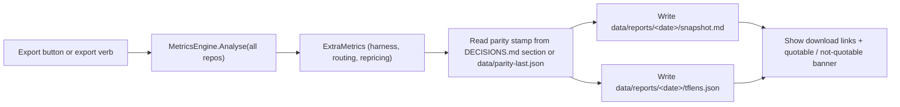
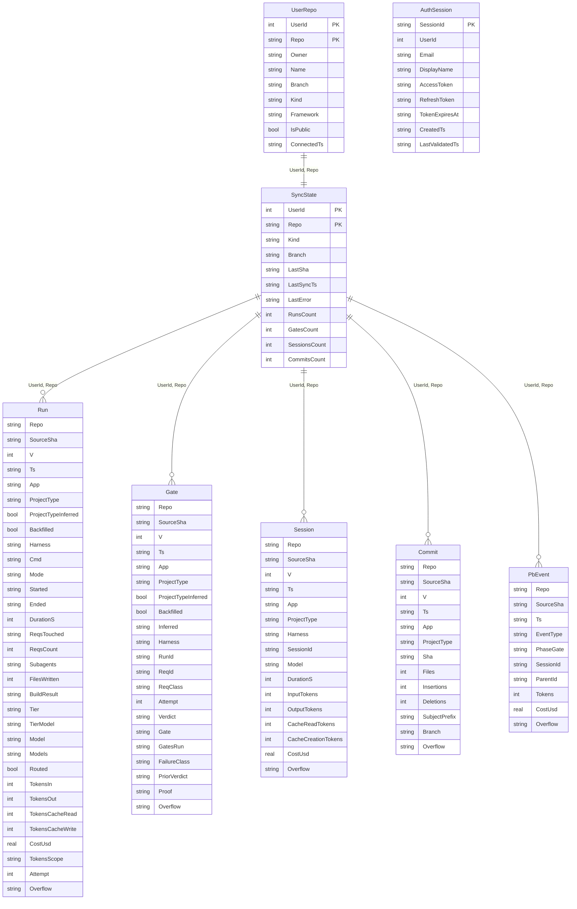

# TfLens — Architecture

**Last updated:** 2026-08-26
**Status:** Target (greenfield) — amended 2026-08-26: AppManager identity (no local users), per-user public-repo management, GitHub SSO deferred to Phase 2, dark-first collapsible shell; round 2 same day: PostgreSQL replaces SQLite (ADR-015), Framework as a provenance axis with the full Playbook report set in Phase 3 (ADR-016), harness columns claude-code/opencode/codex (ADR-017)

<!-- AGENT-ONLY AUTHORING NOTES — never render as visible text.
  DEPTH MANDATE: human document; every non-trivial module gets prose; every significant runtime
  flow beyond the primary path gets its own diagram.
  MERMAID MANDATE: html-render-shell.md §5.5 — quote every label, never use `end` as a node id.
-->

## Table of Contents

1. [Tech stack](#tech-stack)
2. [Component map](#component-map)
3. [Data flow — primary path](#data-flow-primary-path)
4. [Module responsibilities](#module-responsibilities)
5. [Runtime flows beyond the primary path](#runtime-flows-beyond-the-primary-path)
6. [Data model](#data-model)
7. [Metrics engine — parity with tf-metrics.sh](#metrics-engine-parity-with-tf-metrics-sh)
8. [Cross-cutting concerns](#cross-cutting-concerns)
9. [Deployment architecture](#deployment-architecture)
10. [Architectural decisions (ADR-style log)](#architectural-decisions-adr-style-log)
11. [Target architecture (brownfield only — if enhancement changes structure)](#target-architecture-brownfield-only-if-enhancement-changes-structure)
12. [Open questions / risks](#open-questions-risks)
13. [Sources harvested](#sources-harvested)

## 1. Tech stack

| Layer | Choice | Version | Notes |
|-------|--------|---------|-------|
| Runtime | .NET | 10 (LTS) | SDK 10.0.302 present on the dev machine. The brief asks for "current LTS"; .NET 10 is the LTS line as of 2026-08. |
| UI | Blazor Server (Interactive Server render mode) + TrBlazeUI | TrBlazeUI.Components 1.0.7 / Primitives 1.0.3 | Single web head `src/TfLens`. Dogfoods TrBlazeUI where it fits (shell, nav, cards, grid, badges, alerts, dialogs). |
| Data access | Dapper + Npgsql | latest stable | Owner decision (kickoff: Dapper; round-2 amendment 2026-08-26: PostgreSQL instead of SQLite). Hand-written idempotent DDL script `database/001-schema.sql` applied at startup; no migration framework — the store is disposable and rebuilt from `data/raw/`. |
| DB | **PostgreSQL 16** | compose service `postgres` | One table per stream + `SyncState`, `UserRepo`, `AuthSession`, Playbook tables. PascalCase quoted identifiers per Coding Standards. Never the source of truth — raw JSONL is (ADR-015). |
| GitHub access | `HttpClient` against the GitHub REST API (`/repos/{owner}/{repo}`, `/commits`, `/contents`) | — | **Public repos only** (this release); optional server PAT raises the rate limit. No Octokit dependency (ADR-004). |
| Identity | **AppManager** (`https://appmgrapi.techierathore.com`, API v1.4, Application Id 1) via `AppManagerClient` | v1.4 | Login / register / forgot / reset / refresh / validate / logout / profile / change-password. `X-Api-Key`/`X-Api-Secret` from env. RSA-OAEP-256 password encryption with the cached public key. Every user = `Manager`. No licence/feature/payment calls (ADR-011). |
| Auth (session) | ASP.NET Core cookie authentication issued by TfLens after AppManager success | — | Cookie carries userId/email/name/role; AppManager access + refresh tokens kept server-side per session (`AuthSession` table) and refreshed before expiry. GitHub SSO deferred to Phase 2 (ADR-012). |
| Logging | Serilog, rolling file sink under `logs/` + console | — | Standing TechieFlow NFR; wired first in `Program.cs`. |
| Background work | `BackgroundService` (`RepoSyncService`) with `PeriodicTimer` | — | Poll interval from config; manual "Sync now" triggers the same code path. |
| Tests | xUnit + fixture JSONL under `tests/TfLens.Core.Tests/Fixtures/` | — | Parity fixtures mirror real stream shapes; metrics engine tested without the web host. |
| Parity tooling | `tools/parity-compare.py` (Python 3, stdlib only) | — | Same runtime as `tf-metrics.sh`; key-by-key JSON compare. |
| Container | Docker (Linux), volume-mounted `data/` + `logs/` | — | Infra/VPS config is supplied separately and out of scope. |
| Vector store / RAG | none | — | No AI features in TfLens. |

## 2. Component map

Two projects, one head. `TfLens.Core` holds everything that must be testable and parity-checked without a browser: the AppManager client, the repo registry, fetching, parsing, dedupe, storage, the metrics engine, and the exporter. `TfLens` is the only executable: it hosts Blazor Server, the background sync, the AppManager-backed cookie auth, and the three command verbs (`rebuild`, `sync`, `export`) so that a Docker `exec` or a parity run never needs a second image (ADR-005). Every store read and every engine call takes a `UserId` — isolation is a parameter, not a filter someone remembers to add (ADR-013).

## 3. Data flow — primary path

The primary path is "owner opens a report page". Every figure on every page is computed at request time from the stream tables; nothing derived is stored.

The engine never receives a "pool everything" option: `Analyse` returns a structure keyed `live[project_type]`, `backfilled[project_type]`, `pooled` — the same shape as `tf-metrics.sh --rollup --json` — so a page cannot even ask for a merged first-pass rate (§7).

## 4. Module responsibilities

| Module | Responsibility | Depends on |
|--------|----------------|------------|
| `src/TfLens` | Blazor Server head: pages, dark-first collapsible shell, `AuthService` (cookie ↔ AppManager tokens), `RepoSyncService`, command verbs, Serilog wiring, `prices.json` editor | TfLens.Core, TrBlazeUI |
| `src/TfLens.Core/AppManager` | `AppManagerClient` — public-key cache + RSA-OAEP-256 encrypt, login / register (`Manager`) / forgot / reset / refresh / validate / logout / profile / change-password; typed error codes | HttpClient |
| `src/TfLens.Core/Repos` | `RepoRegistry` — per-user `UserRepo` CRUD; connect validation (exists, public, telemetry path, kind detection); remove = purge rows + raw; demo seed for `TfLensDemo` | HttpClient, Storage |
| `src/TfLens.Core/GitHub` | `GitHubStreamFetcher` — latest-SHA-touching-path lookup, whole-file fetch, raw archive to `data/raw/<userId>/` | HttpClient |
| `src/TfLens.Core/Parsing` | `StreamParser` — JSONL → typed records, schema-v check, overflow capture; `Dedupe` — natural-key rules per stream | (none) |
| `src/TfLens.Core/Storage` | `PostgresStore` — DDL, Dapper CRUD, `sync_state`, idempotent upsert, `Rebuild()` | Dapper, Npgsql |
| `src/TfLens.Core/Metrics` | `MetricsEngine` — the `analyse()` port; `ExtraMetrics` — harness comparison, routing drift, counterfactual repricing; `InsufficientData` type | Storage |
| `src/TfLens.Core/Export` | `SnapshotExporter` — markdown + machine-readable JSON (`tflens.json`) to `data/reports/<date>/` | Metrics |
| `src/TfLens.Core/Playbook` | `PlaybookAdapter` — `events.ndjson` → `PbEvent` table; phase totals; `parentID` split (Phase 3) | Storage |
| `tests/TfLens.Core.Tests` | xUnit: parser, dedupe, engine (fixture-driven, incl. provenance-separation tests) | TfLens.Core |
| `tools/parity-compare.py` | Key-by-key compare of `reference.json` (tf-metrics.sh) vs `tflens.json`; non-zero exit on any diff | Python 3 |

**`AppManagerClient`** (added 2026-08-26). A thin typed client over the AppManager v1.4 REST surface, following the guide's reference implementation (`obj`/`a`/`v` naming). It sends `X-Api-Key` / `X-Api-Secret` (from `TfLensAppManagerApiKey` / `TfLensAppManagerApiSecret`) on every call so the server resolves Application Id 1; fetches and caches `GET /AuthSvc/public-key`; RSA-OAEP-256-encrypts every password field (`encryptedPassword`, `encryptedNewPassword`, `encryptedCurrentPassword`); and maps the documented error codes (`INVALID_CREDENTIALS`, `ACCOUNT_LOCKED`, `ACCOUNT_DISABLED`, `EXPIRED_REFRESH_TOKEN`, `DECRYPTION_FAILED`, `NO_APP_ACCESS`, …) to a typed `AppManagerException`. `RegisterAsync` always passes `applicationRoleCode: "Manager"`. It never calls LicenseSvc, FeatureSvc, PaymentSvc or IssueSvc.

**`AuthService` (head)** (added 2026-08-26). Owns the session: on login/register success it stores the AppManager access/refresh tokens and expiry in the `AuthSession` table keyed by a random session id, issues the TfLens cookie (claims: session id, AppManager `userId`, email, display name, role `Manager`), refreshes the access token through `/AuthSvc/refresh` when within five minutes of `tokenExpiresAt` (rotating the stored refresh token), validates a resumed cookie once per hour through `/AuthSvc/validate`, and on sign-out calls `/AuthSvc/logout` with the refresh token and deletes the session row. Tokens never reach the browser.

**`RepoRegistry`** (added 2026-08-26). The per-user repo list. `ConnectAsync(userId, input)` parses a GitHub URL or `owner/name`, calls `GET /repos/{owner}/{name}` (must exist, `private == false`, else refused), resolves the branch (default branch unless specified), probes `GET /repos/{o}/{n}/contents/docs/metrics?ref=branch` then `.../verification/telemetry` to detect the kind, and saves the `UserRepo` row; the first sync is queued immediately. `RemoveAsync` deletes the user's rows in every stream table and `SyncState` for that repo and removes `data/raw/<userId>/<owner>__<name>/`. Duplicate `owner/name` per user is rejected; different users may connect the same repo. At first start the `DemoSeedRepos` configuration is connected to `TfLensDemo` through the same path.

**`GitHubStreamFetcher`.** For each connected repo (of every user in the poller; of the signed-in user on Sync now) it asks the REST API for the newest commit touching the telemetry path on the configured branch (`GET /repos/{o}/{r}/commits?sha={branch}&path=docs/metrics&per_page=1`). If that SHA equals `sync_state.LastSha`, the repo is skipped — no file traffic at all. Otherwise it fetches each stream file at that exact SHA (`GET /repos/{o}/{r}/contents/docs/metrics/{stream}.jsonl?ref={sha}` with `Accept: application/vnd.github.raw`), writes the bytes verbatim to `data/raw/{owner}__{repo}/{stream}-{sha}.jsonl` **before** parsing, and only then hands the text to the parser. A 404 on a stream file is a legitimate "stream absent" (recorded as zero records), not an error. The fetcher is structurally read-only: it holds no write scopes, and no code path issues anything but GET.

**`StreamParser` + `Dedupe`.** Line-by-line `System.Text.Json` parse; a malformed line is counted and skipped (mirrors `read_stream` in the reference, which logs and skips). Known fields map to typed columns named exactly as SCHEMA.md; any property not in the known set for that stream (or any record with `v > 1`) is preserved in the `Overflow` JSON column. The dedupe keys are the natural identities the brief fixes: `commits` on `sha` (per repo — two repos may share a short sha), `sessions` keep-highest-`output_tokens`-then-latest-`ts` per `session_id`, `runs` on `ts+app+cmd`, `gates` on `ts+app+req_id+run_id`. Re-parsing the same raw file is therefore a no-op.

**`PostgresStore`** (SQLite → PostgreSQL, 2026-08-26). Owns the schema script (§6), opens one `NpgsqlConnection` per unit of work (pooled by Npgsql), and exposes stream reads per user and repo plus `SyncState`. Every identifier is PascalCase and double-quoted in SQL (`"Gate"."ReqId"`) so the Coding Standards' naming survives Postgres's lower-casing. Upserts use `INSERT … ON CONFLICT DO NOTHING` against the unique indexes that encode the dedupe keys. `Rebuild()` truncates every stream table, re-applies the schema script, and replays every file under `data/raw/` in `(user, repo, sha-fetch-order)` — the raw archive is the rebuild source, never the API. **Framework** is stored on `UserRepo.Framework` (`techieflow` | `playbook`, set at connect time from the telemetry path) and every engine read takes `(UserId, Framework)`, so a figure cannot pool across frameworks any more than across users (ADR-016).

**`MetricsEngine`.** A field-for-field port of `analyse()` in `tf-metrics.sh` (§7). Its public result type has no "total" slot: figures live under `Live[projectType]`, `Backfilled[projectType]`, and `Pooled`. Any figure with fewer than `MinN = 3` supporting records is an `InsufficientData(n)` value, which the UI renders as text, never as a number.

**`ExtraMetrics`.** The metrics the reference does not compute — per-harness volumes/tokens/verdict mix (dollars only for `harness == "opencode"`), routing drift (`routed:false`, `tier_model` vs `model`), tokens by model, and counterfactual repricing from `data/prices.json` (labelled *estimate* everywhere). These have no parity oracle and are spot-checked by hand against raw JSONL once (BRD §9 F-PARITY).

**`SnapshotExporter`.** Writes `data/reports/<yyyy-MM-dd>/snapshot.md` (human) and `tflens.json` (machine, same key layout as `tf-metrics.sh --rollup --json` plus an `extras` object) — the diffable numbers for the plan's Numbers table and B3, with the parity stamp (last passing run date + dataset SHAs) embedded.

**`PlaybookAdapter` (Phase 3).** Separate tables (`PbEvent`, `PbSyncState`), separate page. Phase-gates (`phase_gate`) and TechieFlow assertion-gates (`gate`) never share a column or chart (SCHEMA.md §11). Built as schema-discovery: the first task is to parse the real `events.ndjson` and record the observed field names in DECISIONS.md before any chart exists.

## 5. Runtime flows beyond the primary path

### 5.1 Repo sync (background + Sync now)

```mermaid
sequenceDiagram
  participant T as PeriodicTimer / Sync now button
  participant SS as RepoSyncService
  participant F as GitHubStreamFetcher
  participant GH as GitHub REST API
  participant Raw as data/raw/
  participant P as StreamParser + Dedupe
  participant S as PostgresStore
  T->>SS: tick / click
  loop per configured repo
    SS->>F: LatestShaAsync(owner, repo, branch, path)
    F->>GH: GET /commits?sha=branch&path=docs/metrics&per_page=1
    GH-->>F: sha
    alt sha == sync_state.LastSha
      SS->>S: touch LastSyncTs (skipped)
    else changed
      loop per stream runs/gates/sessions/commits
        F->>GH: GET /contents/docs/metrics/{stream}.jsonl?ref=sha (raw)
        GH-->>F: bytes or 404
        F->>Raw: write {stream}-{sha}.jsonl verbatim
        F->>P: parse(text)
        P->>S: upsert by natural key (idempotent)
      end
      SS->>S: sync_state = {sha, ts, per-stream counts}
    end
  end
  SS-->>T: SyncReport (per repo: skipped / updated / error)
```

Errors are per-repo and non-fatal: a 401/403/404/network failure is written to that repo's `sync_state.LastError` and surfaced on the Coverage page; the other repos still sync. Nothing is ever written back to any repository.

### 5.2 Rebuild from raw

### 5.3 Login via AppManager (amended 2026-08-26)

### 5.5 Connect a repo (added 2026-08-26)

### 5.4 Weekly snapshot export

## 6. Data model

PostgreSQL 16 (amended 2026-08-26). One table per stream, columns named exactly as SCHEMA.md fields (PascalCase per Coding Standards maps 1:1 — `req_id` → `ReqId`, etc., always double-quoted in SQL; the JSON→column mapping table lives in `StreamParser`). `Overflow` is a `jsonb` column. Every stream table carries `UserId` (amended 2026-08-26 — the AppManager user who connected the repo), `Repo` (owner/name), `SourceSha`, and `Overflow` (JSON text of unknown fields). Identity tables: `UserRepo` (the per-user connected-repo list) and `AuthSession` (server-side AppManager tokens per cookie session). TfLens stores **no user profile and no password** — the AppManager `userId` is the only user key.

Every stream table also carries `UserId` (omitted from the boxes above for brevity). Unique indexes implement the dedupe keys per user: `UcCommitUserRepoSha (UserId, Repo, Sha)`, `UcRunIdentity (UserId, Repo, Ts, App, Cmd)`, `UcGateIdentity (UserId, Repo, Ts, App, ReqId, RunId)`; sessions are collapsed in the parser (keep max `OutputTokens`, tie → latest `Ts`) and stored with `UcSessionUserRepoId (UserId, Repo, SessionId)`. `AuthSession` token columns are encrypted at rest with ASP.NET Data Protection. `PbEvent` columns are provisional until the real file is parsed (Phase 3 schema-discovery). Nullable-vs-absent is preserved: an absent optional field is stored as `NULL`, never `0` (SCHEMA.md §2.5).

## 7. Metrics engine — parity with tf-metrics.sh

The reference script is the specification. The port keeps its names so a diff reads naturally:

| tf-metrics.sh | TfLens.Core | Rule carried |
|---|---|---|
| `read_stream` | `PostgresStore.ReadStream` | invalid lines skipped and counted |
| `dedupe_commits` | `Dedupe.Commits` | per repo, first wins, count collapsed |
| `seg()` | `Segment.ByProjectType` | `project_type_inferred` → `unclassified`, never `app` |
| `tainted = {req_id of any backfilled}` | `TaintSet` | excluded from live first-pass; listed on screen |
| `first_pass_rate` | `FirstPassRate` | `attempt==1 && verdict==Verified` ÷ distinct eligible `req_id`; `MinN` guard |
| `gate_distribution` | `GateDistribution` | over `verdict ∉ {Verified, Done (pre-existing)}`; `escaped` its own row; `unattributed` bucket |
| `late_gate_coverage` | `LateGateCoverage` | `LATE_GATES = { perf: 2026-08-10 }`; `ran` = `gates_run` contains; `caught` beside it |
| `escape_rate` | `EscapeRate` | REQs with `gate=="escaped"` ÷ REQs with any failure; `MinN` |
| pooled block | `Pooled` | rework ratio, batch median, throughput median (REQs/hour, 2 dp), tokens total (sessions in+out), tokens per Verified (1 dp), cadence, `cost_usd: null` |
| `pct()` | `Pct` | `"—"` when denominator 0; `%.0f%%` otherwise |
| `MIN_N = 3` | `MetricsEngine.MinN` | constant, no configuration key |

Two guarantees are enforced by type, not by discipline: (1) `AnalysisResult` has no member that could hold a cross-`project_type` or cross-provenance rate, and (2) `Figure` is a discriminated union of `Value` / `InsufficientData(n)` / `NotApplicable` — a page binding a `Figure` cannot print a number for an `InsufficientData` case. A unit test asserts the engine output on the fixture set equals a checked-in `reference.json` produced by the script.

## 8. Cross-cutting concerns

- **Logging** — Serilog, `WriteTo.File("logs/tflens-.log", rollingInterval: Day, retainedFileCountLimit: 14)` + console, wired before the host builds; `ILogger<T>` in app code; sync outcomes logged per repo (IDs and counts only — never file contents).
- **Error handling** — per-repo sync errors captured to `sync_state.LastError` and rendered on Coverage; Blazor error boundary on each page; unhandled exceptions → `Log.Fatal` at the head boundary.
- **Auth** — AppManager-backed (ADR-011): cookie auth for every page and the export endpoint; `/login`, `/register`, `/forgot-password`, `/reset-password`, `/healthz` are the only anonymous routes; antiforgery on every form; AppManager tokens server-side only. Every user is `Manager`; no licence checks anywhere.
- **Secrets** — AppManager key/secret and the optional PAT from environment / user-secrets via the PascalCase env-var provider (`TfLensAppManagerApiKey`, `TfLensAppManagerApiSecret`, `TfLensGitHubToken`). Never in `appsettings.json`, never in the repo, never logged.
- **Tenant isolation** — `UserId` is a required parameter of every `PostgresStore` read/write, every engine call, the raw-archive path and the reports path (ADR-013); an integration test signs in two users and asserts neither can see the other's repos or figures.
- **Theme** — dark by default (ADR-014): `<html class="dark">` unless the user's persisted preference says light; toggle in the header.
- **Privacy** — TfLens stores and shows only what the streams carry (SCHEMA.md §9). The overflow column is displayed nowhere; it exists for rebuild fidelity and the "unknown fields" report.
- **Caching** — `AnalysisResult` memoised per `(sync version, filter)` in `IMemoryCache`; invalidated on every completed sync or rebuild.
- **Health** — `/healthz` reports DB reachable + last successful sync age; no metrics exposed there.
- **Telemetry** — none outbound. TfLens itself is a TechieFlow-managed repo, so its own `docs/metrics/` streams are emitted by the framework as usual (and it may read them like any other repo).

## 9. Deployment architecture

Two containers via `docker-compose.yml` (amended 2026-08-26): `tflens` (single process) and `postgres` (PostgreSQL 16, its data directory on a named volume, not exposed outside the compose network). TfLens's own persistent state is `data/` (`raw/<userId>/`, `reports/<userId>/`, `prices.json`) and `logs/`. The image never contains the AppManager secret, the connection string or the PAT; they arrive as environment variables (`TfLensDbConnection` points at the `postgres` service). No inbound endpoint exists other than the authenticated UI, the anonymous auth pages and `/healthz`.

## 10. Architectural decisions (ADR-style log)

- **ADR-001 — Blazor Server with TrBlazeUI as the only UI head.** Reason: the brief fixes Blazor Server; dogfooding TrBlazeUI is an explicit goal; a single-user dashboard has no WASM/offline need.
- **ADR-002 — SQLite via Dapper + Microsoft.Data.Sqlite, hand-written DDL, no migrations.** Reason: owner choice at kickoff; the store is disposable (rebuilt from `data/raw/`), so migrations add ceremony without value and the overflow JSON column stays an explicit `TEXT` column.
- **ADR-003 — No vector store / RAG.** Reason: TfLens has no AI features.
- **ADR-004 — Raw `HttpClient` against the GitHub REST API, not Octokit.** Reason: three GET calls per repo; a typed SDK adds a dependency and hides the `Accept: application/vnd.github.raw` header the whole-file fetch relies on.
- **ADR-005 — One executable (`src/TfLens`) hosting web + background sync + command verbs (`rebuild`, `sync`, `export`).** Reason: 1–2 day timebox and one Docker image; the verbs run via `dotnet TfLens.dll rebuild` / `docker exec`, and share the `TfLens.Core` engine so parity runs use exactly the code the pages use.
- **ADR-006 — `TfLens.Core` is UI-free and web-free.** Reason: the engine must be unit-testable against fixture JSONL and driven by the CLI verbs without a browser; it also keeps the parity surface (engine output) identical between the export and the pages.
- **ADR-007 — Provenance rules are encoded in the result type (`AnalysisResult` has no total slot; `Figure` carries `InsufficientData`).** Reason: the brief demands "no flag to disable"; a shape that cannot express the forbidden number is stronger than a check.
- **ADR-008 — Parity compare script in Python (`tools/parity-compare.py`).** Reason: it runs where `tf-metrics.sh` runs (Python 3 already required), needs no build, and compares `reference.json` vs `tflens.json` key-by-key.
- **ADR-009 — `data/prices.json` is the only editable input; repricing is labelled *estimate* in every rendering and export.** Reason: SCHEMA.md §4 forbids presenting a rate-card figure as a measurement; the label is part of the contract.
- **ADR-010 — Playbook adapter is separate tables + separate page, built schema-discovery-first.** Reason: SCHEMA.md §11 (`gate` vs `phase_gate` are different axes); no sample file exists yet (kickoff answer), so the adapter's first task is to parse the real file and record the field names.
- **ADR-011 — AppManager is the identity provider; TfLens holds no users and no passwords (2026-08-26).** Reason: owner decision; TfLens is free/open source and multi-user, AppManager already provides registration, login, reset and RSA-encrypted password transport; every user is `Manager` and no licence/feature/payment endpoint is used. Supersedes the single-user PBKDF2 design (BRD-3 retired).
- **ADR-012 — GitHub SSO deferred to Phase 2 (2026-08-26).** Reason: AppManager v1.4 has no external-login or token-exchange endpoint; the only bridge would be a TfLens-held per-user random credential, which the owner declined for this release. Revisit when AppManager offers SSO.
- **ADR-013 — Public GitHub repos only, managed per user in the app; `UserId` is a mandatory parameter everywhere (2026-08-26).** Reason: anyone using the frameworks must be able to connect their repo without the operator editing config; public-only removes per-user token handling from this release; isolation as a parameter (not a filter) is the cheapest way to make a cross-user leak a compile-time absence rather than a runtime oversight.
- **ADR-014 — Dark-first, collapsible icon sidebar, user menu in the header (2026-08-26).** Reason: owner's mockup review; TrBlazeUI's `Sidebar Collapsible` + `SidebarTrigger` + `DropdownMenu` cover it natively.
- **ADR-015 — PostgreSQL 16 via Npgsql + Dapper, superseding ADR-002 (2026-08-26, round 2).** Reason: the app runs in a container where SQLite on volume storage is unreliable (locking, fsync semantics); Dapper stays because the hand-written, parity-auditable SQL is the point. Idempotent schema script at startup instead of a migration framework — the store is still disposable and rebuilt from `data/raw/`.
- **ADR-016 — Framework is a stored, mandatory provenance axis (2026-08-26, round 2).** Reason: the owner will run Playbook-built apps to collect telemetry and wants the full report set for both frameworks; `UserRepo.Framework` is set at connect time from the telemetry path, every engine read takes `(UserId, Framework)`, and the header switch is the only way to change it — the same "shape forbids the merged number" approach as ADR-007/013. The single Playbook page is retired; the `events.ndjson` adapter (Phase 3) feeds the same pages through Playbook-native equivalents.
- **ADR-017 — Harness columns are the detected values `claude-code` / `opencode` / `codex`; `null` is a footnote, never a column and never dropped (2026-08-26, round 2).** Reason: Codex CLI is a real `harness` value in SCHEMA.md and TechieFlow detects it now; undetected records must stay visible (SCHEMA.md §1 "a missing label is merely missing") without pretending to be a fourth harness.

## 11. Target architecture (brownfield only — if enhancement changes structure)

Not applicable — greenfield; §2 is the target.

## 12. Open questions / risks

- **Schema v=2 arrival.** Unknown fields land in `Overflow` and are listed on the Coverage page ("fields observed that SCHEMA.md doesn't document"), but a *renamed* or *re-typed* known field would silently fall into the overflow and drop out of the metrics. First thing that breaks: any figure depending on the renamed field, with no error. Mitigation: a per-sync "unknown fields" report + a hard warning when `v > 1` is seen.
- **Playbook `events.ndjson` shape is unknown** — `PbEvent` columns are provisional (ADR-010).
- **GitHub rate limits / PAT expiry.** A fine-grained PAT has a maximum lifetime; expiry shows up as 401s on the Coverage page. Poll interval defaults to 15 minutes; 5 repos × 5 calls is far below the 5,000/hour authenticated limit.
- **Reference drift.** `tf-metrics.sh` can change (it is part of the framework and is refreshed by `update-framework.sh`). The parity procedure re-runs after every parser change *in TfLens*, but a reference change also invalidates the last parity stamp — record the script's own hash in the parity entry.
- **Short-SHA collision across repos** is handled (dedupe per user and repo); duplicate `owner/name` per user is rejected at connect time.
- **AppManager availability** is now on the sign-in path. Sessions keep working on their server-side refresh token until it expires; there is deliberately no local fallback.
- **GitHub unauthenticated rate limit** (60 requests/hour per IP) with many users and no server PAT: the SHA-skip keeps steady state at one request per repo per poll, but connect-time validation costs 2–3 requests; the optional PAT lifts this to 5,000/hour.
- **AppManager password rules and error codes** are taken from the v1.4 guide; the client must be re-checked against `api-migration-notes` on the next AppManager release.
- **Playbook-native "three questions"** map `phase_gate` values to first-pass / catch / escape analogues — the mapping is provisional until the real `events.ndjson` is parsed (Phase 3) and must be written into DECISIONS.md before any Playbook figure is exported.
- **Postgres in the parity loop:** `tf-metrics.sh` reads files, TfLens reads Postgres; the parity procedure pins the dataset by SHA, so the store is irrelevant to the comparison — but a `rebuild` must precede every parity run to rule out stale rows.

## 13. Sources harvested

- `docs/TfLens-Project-Brief.md` (v2) — concept, phases, constraints, parity procedure, definition of done. Superseded by this document + the BRD; archived to `docs/OldDocs/`.
- `.tfcore/telemetry/SCHEMA.md` (schema v=1) — field names, enums, provenance rules.
- `.tfcore/telemetry/tf-metrics.sh` — reference implementation of every reporting rule (the parity oracle).
- `docs/ravi-90day-positioning-plan-v2.4.2.md` — A-V / A0′ / B1 / B3 context only; stays in `docs/` (independently authoritative).
- `docs/AppManager-api-usage-guide.md` (v1.4) — identity integration (amendment 2026-08-26); stays in `docs/` (independently authoritative).
