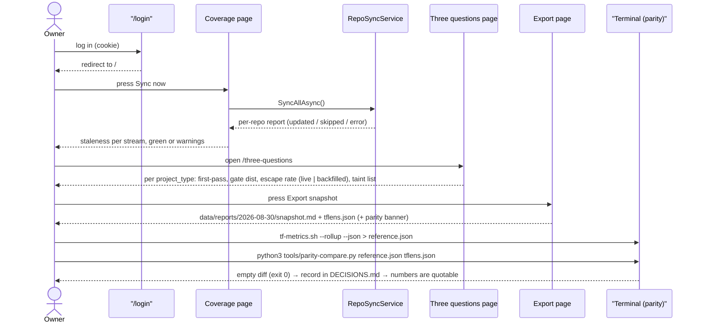
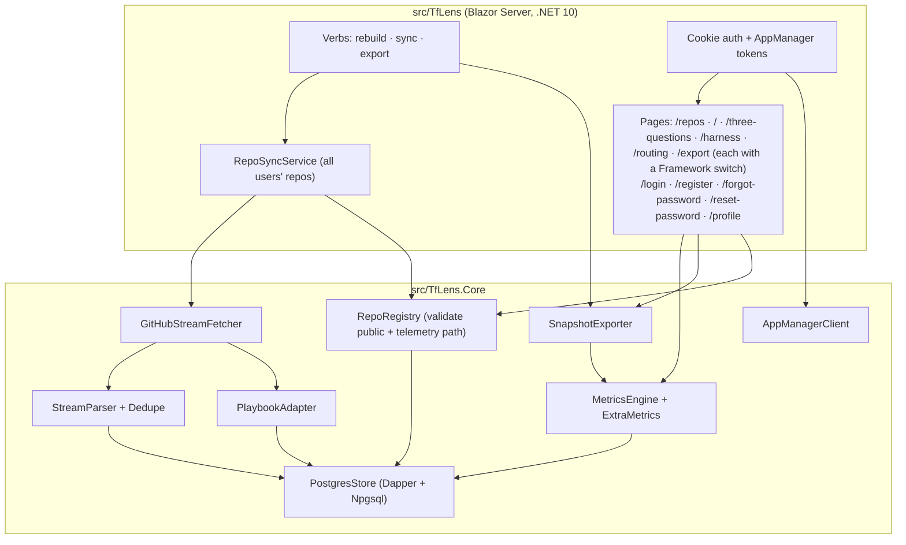
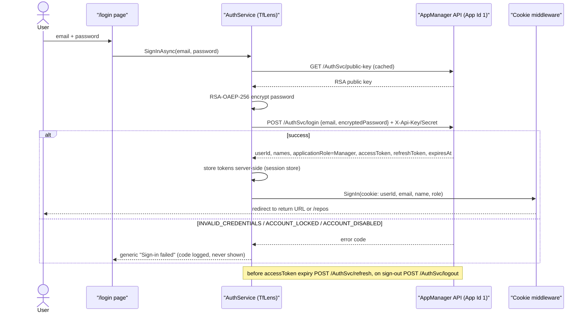
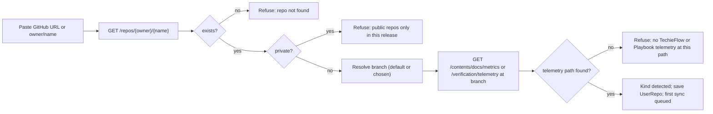
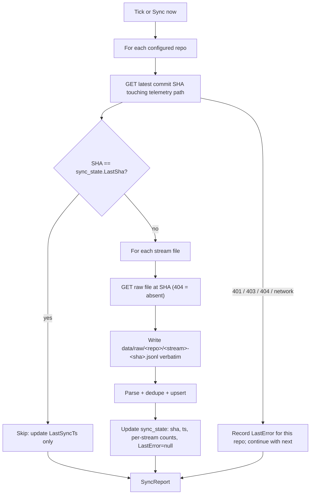
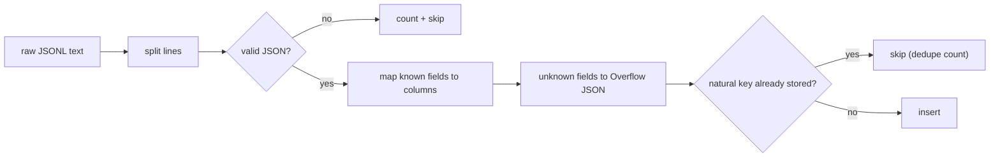
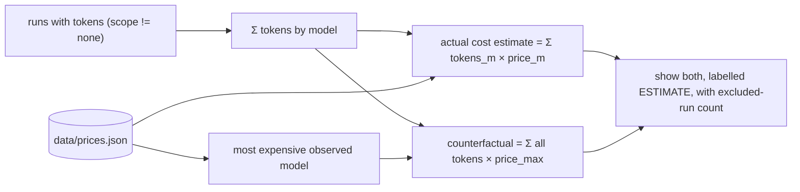
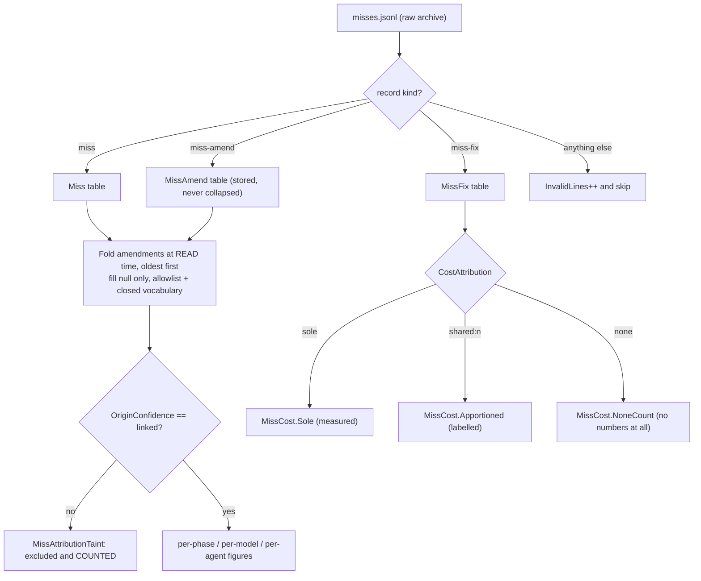
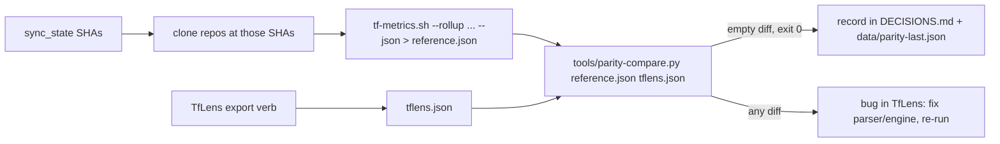
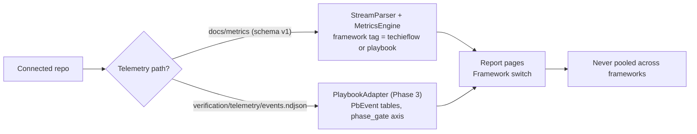

# TfLens — Business Requirements

<!-- AGENT-ONLY AUTHORING NOTES — never render as visible text.
  STABLE IDS: every requirement has a BRD-{N} ID; append-only across revisions.
  DEPTH MANDATE: human document; §9 Feature catalog is the heart; one-liners only in §10.
  MERMAID MANDATE: html-render-shell.md §5.5 — quote every label; never use `end` as a node id.
-->

## Table of Contents

1. [Executive summary](#executive-summary)
2. [Business objectives](#business-objectives)
3. [Scope](#scope)
4. [Development status](#development-status)
5. [Stakeholders / users](#stakeholders-users)
6. [Context diagram](#context-diagram)
7. [User journey — primary use case](#user-journey-primary-use-case)
8. [Component sketch](#component-sketch)
9. [Feature catalog](#feature-catalog)
   - [F-SHELL: App shell and navigation](#f-shell-app-shell-and-navigation)
   - [F-AUTH: AppManager identity — login, registration, sessions](#f-auth-appmanager-identity-login-registration-sessions)
   - [F-REPOS: Source management — fetch public repos, or import metric files](#f-repos-source-management-fetch-public-repos-or-import-metric-files)
   - [Screen inventory — every screen, its feature and its mockup](#screen-inventory-every-screen-its-feature-and-its-mockup)
   - [F-CFG: Configuration and secrets (retired 2026-08-26)](#f-cfg-configuration-and-secrets-retired-2026-08-26)
   - [F-SYNC: Repo puller — background sync and Sync now](#f-sync-repo-puller-background-sync-and-sync-now)
   - [F-RAW: Raw archive and rebuild](#f-raw-raw-archive-and-rebuild)
   - [F-PARSE: Parser to PostgreSQL with dedupe and overflow](#f-parse-parser-to-postgresql-with-dedupe-and-overflow)
   - [F-ENGINE: Metrics engine with provenance rules](#f-engine-metrics-engine-with-provenance-rules)
   - [F-COVER: Coverage / health page](#f-cover-coverage-health-page)
   - [F-3Q: The three questions page](#f-3q-the-three-questions-page)
   - [F-HARN: Harness comparison page](#f-harn-harness-comparison-page)
   - [F-ROUTE: Routing and economics page](#f-route-routing-and-economics-page)
   - [F-MISS: Misses and rework economics](#f-miss-misses-and-rework-economics)
   - [F-EXPORT: Weekly snapshot export](#f-export-weekly-snapshot-export)
   - [F-PARITY: Parity check against tf-metrics.sh](#f-parity-parity-check-against-tf-metrics-sh)
   - [F-FRAMEWORK: Playbook as a first-class framework — the full report set (was F-PB)](#f-framework-playbook-as-a-first-class-framework-the-full-report-set-was-f-pb)
   - [F-OPS: Container, configuration, health, docs and decisions](#f-ops-container-configuration-health-docs-and-decisions)
10. [Functional requirements (BRD ledger)](#functional-requirements-brd-ledger)
11. [Non-functional requirements](#non-functional-requirements)
12. [Constraints & assumptions](#constraints-assumptions)
13. [Parity check — the mandatory acceptance test](#parity-check-the-mandatory-acceptance-test)
14. [Definition of done](#definition-of-done)
15. [Success metrics](#success-metrics)
16. [Risks](#risks)
17. [Glossary](#glossary)

## 1. Executive summary

TfLens is a read-only lens over the development telemetry that **both** of the owner's frameworks — TechieFlow and the AI-First-Playbook — **already emit**. Every TechieFlow-managed repository carries five append-only JSONL streams under `docs/metrics/` (`runs`, `gates`, `sessions`, `commits` and — since 2026-08-28 — `misses`; schema v=1, defined in `.tfcore/telemetry/SCHEMA.md`); Playbook-managed repositories emit `verification/telemetry/events.ndjson` today and will converge on the same schema. Today the only consumer of those streams is a shell script, `tf-metrics.sh --rollup`, which prints a segmented text report. TfLens pulls the streams from GitHub, stores them in PostgreSQL (amended 2026-08-26), and renders the same figures — plus a few the script does not compute — as an authenticated Blazor Server dashboard with a **Framework switch** (TechieFlow | Playbook) on every report page, and a weekly snapshot export whose numbers can be quoted in public writing. The Playbook report set is Phase 3, as is the miss / rework report (F-MISS, amended 2026-08-28).

TfLens is free and open source, and it is **multi-user by design** (amended 2026-08-26): anyone who uses TechieFlow or the Playbook can sign in, connect their own **public** GitHub repos, and see the reports for their data. Identity is delegated to the owner's **AppManager** service (`https://appmgrapi.techierathore.com`, Application Id 1) — TfLens stores no passwords; every user is an AppManager `Manager` for this application and no licensing, feature or payment capability is used. Each user's repos, raw archive, parsed rows and reports are isolated from every other user's.

It builds **no capture layer, no ingestion API, and no per-machine agents**. Capture is the frameworks' job and already works across Claude Code, OpenCode, and (via `harness: null`) anything else that runs the tasks. TfLens never writes to any repository; it reads with a fine-grained, contents-only token.

The name is deliberate: "Analyst" collides with TechieFlow's analyst agent and "TfMetrics" collides with `tf-metrics.sh`. A *lens* changes nothing it looks at. The dangerous failure mode of this product is not a crash but a **plausible wrong number** — a backfilled record leaking into a live rate, a `library` record pooled into an `app` gate distribution — that gets exported, quoted, and cannot be defended. The provenance rules of SCHEMA.md §6 are therefore enforced in code with no switch to disable them, and a mandatory parity test against `tf-metrics.sh` is the acceptance gate (§13).

Plan context (from `docs/ravi-90day-positioning-plan-v2.4.2.md`): TfLens is the A-V verification vehicle — a real side project built through the full TechieFlow phase sequence, funded from side-project hours, never a plan deliverable. Its exported numbers feed the plan's Numbers table, the B1 portability story (harness comparison), and the B3 token-economics post (counterfactual repricing).

## 2. Business objectives

- Turn the existing telemetry into a dashboard the owner can open in a browser, within a 1–2 day timebox, without adding any capture surface to the frameworks.
- Produce **quotable numbers**: a weekly snapshot (markdown + JSON) that never mixes provenances and that has passed an exact parity diff against `tf-metrics.sh --rollup` on the same dataset.
- Make the telemetry's own health visible: a Coverage page that says, per repo, whether a clone has stopped pushing or lacks hooks — before any other figure is trusted.
- Render the B1 story as data (per-harness volumes, tokens, verdict mix, OpenCode-only dollars) and the B3 claim basis (tokens repriced as if every run used the most expensive observed model, labelled *estimate*).
- Serve as the A-V verification build: every TechieFlow phase runs on TfLens itself, gates enforced, so the framework's telemetry records its own dashboard being built.

## 3. Scope

**In scope**

- Pulling `docs/metrics/{runs,gates,sessions,commits,misses}.jsonl` (and, for Playbook repos, `verification/telemetry/events.ndjson`) from the **public** GitHub repos each signed-in user connects on the `/repos` screen, on a poll interval and on demand; raw archive; PostgreSQL store (Dapper); rebuild from raw; per-user data isolation. *(`misses` added 2026-08-28 — F-MISS.)*
- The same report set for both frameworks, selected by a Framework switch and never pooled across frameworks (Playbook set: Phase 3).
- **Two ways to add a source** (amended 2026-08-28, F-IMPORT): **Fetch via API** for public repos, or **Import metric files** — the user uploads the telemetry their framework already writes to disk, so **private and corporate repositories are reachable without TfLens ever holding a credential for them**. Both land in the same tables through the same parser; the Repos screen shows which is which.
- AppManager-backed identity: email/password login, self-registration, forgot/reset password, session cookie with server-side token refresh; every user is `Manager`; demo user `TfLensDemo`.
- Parser with SCHEMA.md-exact columns, JSON overflow for unknown fields, and idempotent dedupe on the streams' natural keys — including the one stream (`misses`) whose records do not all share a shape.
- Six report pages (Coverage, Three questions, Harness comparison, Routing & economics, **Misses & rework**, Snapshot export) computed at request time with the provenance rules enforced structurally. *(Misses & rework added 2026-08-28, Phase 3.)*
- Weekly snapshot export to `data/reports/<date>/` as markdown + JSON.
- Parity tooling: machine-readable export in the reference's key layout, a compare script, and the DECISIONS.md record of each passing run.
- Phase 3: a separate Playbook adapter for `verification/telemetry/events.ndjson` with its own tables and a minimal page.
- Single-user cookie auth; Serilog file logging; Dockerfile; `/healthz`.

**Out of scope (explicit — recorded in the README)**

- Any capture layer, machine-to-machine ingestion API, OTLP endpoint, or per-machine agent. *(Amended 2026-08-28 — narrowed, not removed: the **Import metric files** mode on `/repos` is an authenticated file-picker on a page a human is signed into, and it is the **only** inbound path. Nothing can push data into TfLens automatically, no endpoint accepts an unauthenticated post, and neither framework is asked to grow an export command — the user uploads the files TechieFlow and the Playbook already write to disk. BRD-139 bounds the surface.)*
- Writing anything to any repository, ever.
- VPS / infra configuration (supplied separately).
- Reading a private GitHub repo **over the API** (this release is public-repo-only for fetching; a per-user PAT is a later release). *(Amended 2026-08-28: a private or corporate repo is no longer out of reach — its telemetry is added through **Import metric files** instead, which needs no credential, no network access to the repo, and no change to the repo itself. What stays out of scope is TfLens authenticating to a private repo and pulling from it.)*
- AppManager licensing, subscriptions, feature flags, payments, issues — none are called.
- GitHub SSO — **deferred to Phase 2** (BRD-94): AppManager has no external-login endpoint, so it needs a bridge or an AppManager change first.
- Roles beyond `Manager`; sharing a user's reports with another user.
- Any estimate presented as a measurement: no rate-card dollars anywhere except the explicitly labelled repricing and rework-estimate figures.
- **Any blended rework-cost figure** (amended 2026-08-28): measured (`cost_attribution: sole`) and apportioned (`shared:n`) miss cost are never summed into one number, in the page, the export or parity — see BRD-122, BRD-130.
- **Writing to any telemetry stream**, including `misses.jsonl`: TfLens consumes the miss stream and never emits into it. Recording a miss is TechieFlow's `*log-miss`, not TfLens's job.

## 4. Development status

**Snapshot as of 2026-08-28 (handoff)**, rolled up from the graded `*verify all` run that closed Phase 3 — **140 of 143 requirements `Verified`**. Live, per-requirement status: see `PROJECT-STATUS.md` and the **Requirements Status** table in `docs/TfLens-Checklist.md` (created by `*split-brd`).

| Feature (F-code) | Phase | Status | % | Notes |
|------------------|-------|--------|---|-------|
| F-SHELL: App shell and navigation | 1 | Done | 100 | Collapsible icon sidebar (Repos first), header with Sync now + user menu, dark-first theme. **Seven nav items since 2026-08-28** — *Misses & rework* between *Routing & economics* and *Snapshot export*; the Framework switch now spans six report pages |
| F-AUTH: AppManager identity — login, registration, sessions | 1 (SSO: 2, deferred) | Done | 100 | `/login`, `/register`, `/reset-password`, sessions and sign-out all verified. `REQ-FN-003` forgot/reset: all three acceptance clauses now proven (enumeration-safety, both dead-link codes collapsing to one outcome, token never logged — two real token leaks found and fixed 2026-08-27), but the API-key header supplying the app scope is now exercised: the owner re-provisioned AppManager on 2026-08-28 and both **AM-001** (role code silently ignored) and **AM-002** (`403 NO_APP_ACCESS` on profile) are resolved server-side. `REQ-NFR-012` / BRD-142 add a documented, repeatable account-restore procedure (`provision-test-accounts`) so a rotated password can no longer block the authenticated suite. GitHub SSO deferred (`REQ-FN-012`, N/A) |
| F-REPOS: Source management — fetch public repos, or import metric files | 1 (import mode: 3) | Done | 100 | Fetch-via-API half is Done: list, Connect+Validate, purge and per-user isolation verified. **Import-metric-files mode built and verified 2026-08-28** (BRD-131..BRD-141): mode fork, drop zone, preview-before-commit (writes nothing until Import), bundle sha256 as dataset identity, idempotent re-import, poller skip, rollup refusal, and a bounded upload surface (`REQ-NFR-014`) that is the app's only inbound path. Private and corporate repos are now reachable with no credential and no network route to the repo. `REQ-UI-013` closed 2026-08-27 — Escape now aborts the remove dialog (TrBlazeUI ships no Escape support at all: TR-014, worked around in `Repos.razor.js`); the same fix cured the connect dialog's post-validation Escape |
| F-SYNC: Repo puller — background sync and Sync now | 1 | Done | 100 | `BackgroundService`, SHA-skip and per-repo error isolation all exercised live (2 of 7 repos failed in isolation) |
| F-RAW: Raw archive and rebuild | 1 | Done | 100 | Verified by a real run: 14 raw files replayed → 279 rows, 1 duplicate collapsed, 0 invalid lines |
| F-PARSE: Parser to PostgreSQL with dedupe and overflow | 1 | Done | 100 | One table per stream + `sync_state`; natural-key dedupe; Npgsql + Dapper |
| F-ENGINE: Metrics engine with provenance rules | 2 | Done | 100 | Port of `tf-metrics.sh analyse()`; `Figure` type with `InsufficientData`; fixture parity test green |
| F-COVER: Coverage / health page | 2 | Done | 100 | Landing page; staleness per stream; unknown-fields report. **Extended 2026-08-28**: fifth `misses` stream row, per-repo source badge, bundle-sha identity, days-since-import staleness for imported sources, and the miss data-quality card (escapes-missing-why, orphan counts, reclassification split) |
| F-3Q: The three questions page | 2 | Done | 100 | Per `project_type`, live vs backfilled columns, taint list |
| F-HARN: Harness comparison page | 2 | Done | 100 | claude-code / opencode / codex; OpenCode-only dollars, no cross-harness total. **Corrected 2026-08-27** — the measured figure summed `cost_usd` over *run* records, which never carry it (SCHEMA.md §4 puts it on sessions), so it was structurally null; the earlier `$0.84` came from test pollution in the shared DB. Now $0.04 over 2 OpenCode session records |
| F-ROUTE: Routing and economics page | 2 | Done | 100 | Drift, tokens by model, repricing from `prices.json`, poolables |
| F-MISS: Misses and rework economics | 3 | Done | 100 | Built and verified 2026-08-28. Fifth stream (`misses.jsonl`, three record kinds), three tables, `MissMetrics` + the two provenance guards, the `/misses` page. All 29 miss figures are covered by the BRD §13 parity compare and agree with the oracle key for key. One deliberate divergence is recorded as **D-012 / TF-005** — an unrecorded token count stays unmeasured here, where the reference averages it as zero; latent, since every current dataset carries the field |
| F-EXPORT: Weekly snapshot export | 2 | Done | 100 | Button + `export` verb → markdown + JSON, both written for real |
| F-PARITY: Parity check against tf-metrics.sh | 2 | Done | 100 | `tflens.json` layout and `tools/parity-compare.py` verified both ways. **BRD §13 PASSES — the app's figures are quotable.** Re-run end to end 2026-08-28 at parser **1.2.0** after the framework shipped an oracle that reads the fifth stream (which correctly invalidated the 2026-08-27 stamp and took `/export` to NOT QUOTABLE on its own — the invalidation clause demonstrated in the field): `parity-compare.py` exits **0**, 0 findings, over 29 `misses` keys plus the existing set. Recorded as `DECISIONS.md` **P-003**; `data/parity-last.json` written and `/export` reads **QUOTABLE**. The 2026-08-27 SCHEMA.md §4-vs-§5 session-dedupe contradiction was fixed upstream (TF-001) |
| F-FRAMEWORK: Playbook as a first-class framework — full report set | 3 | Partial | 90 | `events.ndjson` fetch/parse, axis separation and schema-v1 reuse verified, and **all six** report pages now mount the Playbook state — `/misses` joined them on 2026-08-28 and `pb-misses` grades 12 controls clean. **`REQ-FN-067` / `REQ-FN-070` remain `Needs re-verify` on a single external cause**: no connected repository emits `verification/telemetry/events.ndjson`. `techierathore/AI-First-Playbook` publishes neither telemetry path, and the build-harness fixture that once supplied figures was removed on 2026-08-27 as fabricated — grading these `Verified` would mean restoring it. The Playbook axis correctly renders its empty state everywhere. **There is now a way out that does not need the repo to change**: the F-IMPORT mode (BRD-131..BRD-141) accepts an uploaded `verification/telemetry/` bundle, so the owner can supply Playbook telemetry without a credential or a network route to the repository |
| F-OPS: Container, configuration, health, docs and decisions | 1 | Done | 100 | Dockerfile + compose with PostgreSQL 16, settings/secrets, schema script, `/healthz`, README, DECISIONS.md |

**Legend:** **Done** = shipped & working · **In progress** = actively being built · **Partial** = some sub-features done, others pending · **Planned** = not started. (Maps to the checklist's `Done (pre-existing)` / `In Progress` / `PARTIAL` / `Not Started`.)

## 5. Stakeholders / users

TfLens is multi-user (amended 2026-08-26). Every signed-in person is an AppManager `Manager` for Application 1 and sees only their own connected repos. The owner additionally wears the parity, author and ops hats.

| Role | Who | Needs | Key screens |
|------|-----|-------|-------------|
| **User** (any TechieFlow / Playbook user) | Anyone who registers (email/password via AppManager) — e.g. the demo account `TfLensDemo` | Sign in, connect their public repos, see health and the reports for their own data, export their snapshot | `/login`, `/register`, `/repos`, `/`, `/three-questions`, `/harness`, `/routing`, `/export` |
| **Owner** (dashboard user) | The framework author, signed in like any other user | See whether telemetry is healthy, read the three questions per project type, compare harnesses, see routing drift and the repricing estimate, press Sync now | `/`, `/three-questions`, `/harness`, `/routing` |
| **Parity operator** | The same person, at a terminal, before any number is quoted | Run `tf-metrics.sh --rollup --json` on a pinned dataset, export `tflens.json` for the same SHAs, run the compare script, record the pass in DECISIONS.md | `/export`, the `export` verb, `tools/parity-compare.py` |
| **Author** (consumer of the export) | The same person writing the weekly Numbers row, B1, B3 | A snapshot that never mixes provenances, states *estimate* where it estimates, and carries its parity stamp so it is quotable | `/export` output under `data/reports/<date>/` |
| **Ops** | The same person deploying the container | One image, one volume, env-var secrets, a health endpoint, rolling file logs | Dockerfile, `/healthz`, `logs/` |
| **Downstream frameworks** (not users) | TechieFlow, AI-First-Playbook | Nothing — TfLens never writes to them and never asks them to change | — |

Onboarding path (any user): open `/register` (or sign in at `/login`), go to **Repos**, connect a public GitHub repo by URL, press **Sync now**, and read the Coverage page until it is green. Ops path: set the AppManager settings (`TfLensAppManagerApiKey` / `TfLensAppManagerApiSecret`, App Id 1) and optionally `TfLensGitHubToken`, start the container.

## 6. Context diagram

## 7. User journey — primary use case

The weekly loop: sync, check health, read the questions, export, prove parity, quote.

## 8. Component sketch

## 9. Feature catalog

### Screen inventory — every screen, its feature and its mockup

Read this table with `docs/mockups/` open: every screen the app has, the feature that owns it, the requirements it satisfies, and the mockup it must match (the mockups are a click-through — start at `login.html`). The per-screen component map is in `docs/TfLens-UIDesign.md`.

| Screen | Route | Feature | BRD IDs | Mockup |
|--------|-------|---------|---------|--------|
| Login | `/login` | F-AUTH | BRD-1, BRD-2, BRD-90, BRD-94 (deferred) | [login.html](./mockups/login.html) |
| Register | `/register` | F-AUTH | BRD-91, BRD-95 | [register.html](./mockups/register.html) |
| Forgot password | `/forgot-password` | F-AUTH | BRD-92 | [forgot-password.html](./mockups/forgot-password.html) |
| Reset password | `/reset-password` | F-AUTH | BRD-92 | [reset-password.html](./mockups/reset-password.html) |
| Profile | `/profile` | F-AUTH, F-SHELL | BRD-107, BRD-106 | [profile.html](./mockups/profile.html) (user menu shown open) |
| Repos — sources (+ Add source dialog: Fetch via API \| Import metric files; Remove dialog) | `/repos` | F-REPOS | BRD-98..BRD-104, BRD-131..BRD-141 | [repos.html](./mockups/repos.html) |
| Shell: sidebar, header, Framework switch, user menu | (layout) | F-SHELL, F-FRAMEWORK | BRD-4, BRD-5, BRD-6, BRD-105, BRD-106, BRD-108 | visible on every report mockup, e.g. [coverage.html](./mockups/coverage.html) |
| Coverage / health | `/` | F-COVER, F-RAW | BRD-39..BRD-44, BRD-21 | [coverage.html](./mockups/coverage.html) · Playbook state: [playbook.html](./mockups/playbook.html) |
| Three questions | `/three-questions` | F-3Q, F-ENGINE | BRD-45..BRD-50 | [three-questions.html](./mockups/three-questions.html) · Playbook state: [three-questions-playbook.html](./mockups/three-questions-playbook.html) |
| Harness comparison | `/harness` | F-HARN | BRD-51..BRD-55 | [harness.html](./mockups/harness.html) · Playbook state: [harness-playbook.html](./mockups/harness-playbook.html) |
| Routing & economics (+ Edit prices dialog) | `/routing` | F-ROUTE | BRD-56..BRD-62 | [routing.html](./mockups/routing.html) · Playbook state: [routing-playbook.html](./mockups/routing-playbook.html) |
| Misses & rework | `/misses` | F-MISS | BRD-118..BRD-126 | [misses.html](./mockups/misses.html) · Playbook state: [misses-playbook.html](./mockups/misses-playbook.html) |
| Snapshot export | `/export` | F-EXPORT, F-PARITY | BRD-63..BRD-67, BRD-70 | [export.html](./mockups/export.html) · Playbook state: [export-playbook.html](./mockups/export-playbook.html) |
| Health endpoint | `/healthz` | F-OPS | BRD-78 | (no UI) |

### F-SHELL: App shell and navigation

**Personas:** User, Owner · **Phase:** 1 *(amended 2026-08-26: login moved to F-AUTH; collapsible icon sidebar, user menu, dark-first)*

Every page lives inside one TrBlazeUI sidebar shell (`SidebarProvider` + `Sidebar Collapsible` + `SidebarInset`). The sidebar is **collapsible** via `SidebarTrigger` (icon-only rail with tooltips when collapsed) and every item carries a **Lucide icon**; the order is the order a user should work in: **Repos** first (nothing to see until a repo is connected), then Coverage ("every other number is suspect until this page is green"), Three questions, Harness comparison, Routing & economics, **Misses & rework** *(added 2026-08-28, F-MISS)*, Snapshot export (the separate Playbook page was retired 2026-08-26 — see F-FRAMEWORK). The header carries the **Framework switch** (TechieFlow | Playbook, F-FRAMEWORK), the page title, a **Sync now** button with the last-sync badge, the theme toggle, and — on the right — the **signed-in user's name** with a `DropdownMenu` (Profile, Manage repos, Sign out); there is no bare sign-out button. The application **starts in dark mode**; the user's toggle choice is persisted per user.

| Screen | Route | Description | Mockup |
|--------|-------|-------------|--------|
| Shell | (layout) | Collapsible icon sidebar (Repos, Coverage, Three questions, Harness, Routing & economics, Misses & rework, Snapshot export); header: **Framework switch (TechieFlow / Playbook)** · title · Sync now · last-sync badge · theme toggle · user menu | [coverage.html](./mockups/coverage.html) (shell visible on every report mockup) |

**Workflow:**
1. Unauthenticated request to any page → redirect to `/login` with return URL (F-AUTH).
2. **Sync now** in the header runs `SyncAllAsync(userId)` for the signed-in user's repos and shows a toast with the per-repo outcome.
3. User menu → **Sign out** → AppManager `/AuthSvc/logout` → cookie cleared → `/login`.
4. `SidebarTrigger` collapses/expands the sidebar; the state is remembered (`CookieKey`).

**Requirements:** BRD-2, BRD-4, BRD-5, BRD-6, BRD-105, BRD-106, BRD-107, BRD-124

### F-AUTH: AppManager identity — login, registration, sessions

**Personas:** User, Owner · **Phase:** 1 (GitHub SSO: Phase 2, deferred) *(added 2026-08-26)*

TfLens keeps **no user store and no passwords**. Identity is delegated to the owner's AppManager service (`docs/AppManager-api-usage-guide.md`, v1.4): base URL `https://appmgrapi.techierathore.com`, **Application Id 1**, identified on every call by the `X-Api-Key` / `X-Api-Secret` headers (values from configuration only — F-OPS). Passwords are never sent in clear: TfLens fetches and caches `GET /AuthSvc/public-key` and RSA-OAEP-256-encrypts the password client-side before `POST /AuthSvc/login` or `/AuthSvc/register`. Because TfLens is free and open source, no licence, feature, subscription or payment endpoint is ever called, and every registered user is assigned `applicationRoleCode: "Manager"`. On success TfLens issues its own auth cookie (sliding 12 h, HttpOnly, Secure) carrying the AppManager `userId`, email, display name and role; the AppManager access and refresh tokens are held **server-side** per session and refreshed through `POST /AuthSvc/refresh` before expiry; a resumed cookie is checked with `POST /AuthSvc/validate`. A demo account **`TfLensDemo`** (`tflensdemo@techierathore.com`) is registered in AppManager during development and its public demo repos are connected through the Repos screen (no configuration seed — amended 2026-08-26), so testers and first-time visitors can see a populated dashboard.

**GitHub SSO — deferred to Phase 2 (BRD-94).** AppManager exposes no external-login or token-exchange endpoint, so "Continue with GitHub" cannot obtain an AppManager token without a bridge (a TfLens-held random credential per SSO user). The owner chose to defer this until AppManager grows an SSO endpoint; the login screen reserves the button position but does not show it in this release.

| Screen | Route | Description | Mockup |
|--------|-------|-------------|--------|
| Login | `/login` | Email + password; links to Register and Forgot password; generic error on failure; anonymous | [login.html](./mockups/login.html) |
| Register | `/register` | First name, last name, email, password (+ confirm) per AppManager rules (8+, upper, digit, special); creates the user with role Manager; anonymous | [register.html](./mockups/register.html) |
| Forgot password | `/forgot-password` | Email → `/AuthSvc/forgot-password` (always "if that address exists, an email was sent"); anonymous | [forgot-password.html](./mockups/forgot-password.html) |
| Reset password | `/reset-password?token=…` | New password (+ confirm) → `/AuthSvc/reset-password`; anonymous | [reset-password.html](./mockups/reset-password.html) |
| Profile | `/profile` | Read-only AppManager profile (`GET /UserSvc/profile`) + change password (`POST /UserSvc/change-password`) | [profile.html](./mockups/profile.html) |

**Workflow:**
1. `/login`: encrypt → login → cookie → redirect (first sign-in with no repos lands on `/repos`).
2. `/register`: validate password rules locally → encrypt → `register` with `applicationRoleCode: "Manager"` → same cookie issue as login.
3. `/forgot-password` → `forgot-password`; `/reset-password` → `reset-password` (API key header supplies the app scope).
4. Session: refresh tokens server-side before `tokenExpiresAt`; on refresh failure → sign out.
5. Sign out: `logout` with the refresh token (per-app scope) → clear cookie.

**Requirements:** BRD-1, BRD-90, BRD-91, BRD-92, BRD-93, BRD-94 (deferred), BRD-95, BRD-96, BRD-97

### F-REPOS: Source management — fetch public repos, or import metric files

**Personas:** User, Owner · **Phase:** 1 (import mode: Phase 3) *(added 2026-08-26; amended 2026-08-28 — F-IMPORT folded in as a second mode of the same dialog rather than a separate screen, owner decision)*

TfLens is for anyone using the frameworks, so the sources to read are **managed in the app, per user**, not in a config file. The `/repos` screen lists the signed-in user's connected sources (owner/name, branch, kind, **source**, visibility, status, last sync or last import, per-stream record counts) with per-row **Sync** / **Re-import** and **Remove** actions and an **Add source** dialog.

**Two ways in, chosen in the dialog (amended 2026-08-28 — F-IMPORT).** The first step of the dialog is a mode choice, and it is the demarcation the whole feature rests on:

| Mode | For | How the data arrives | Row action | Poller |
|---|---|---|---|---|
| **Fetch via API** | **Public** repos | TfLens calls the GitHub API, validates, and pulls on a schedule (F-SYNC) | **Sync** | polls it |
| **Import metric files** | **Private / corporate** repos — or any repo the user would rather not connect | The user uploads a zip of `docs/metrics/` (or `verification/telemetry/`), or the loose `.jsonl` / `.ndjson` files, exactly as their framework already wrote them to disk | **Re-import** | **skips it** |

An imported source has no remote to poll, so it gets **Re-import**, not a Sync button that would do nothing, and the background poller passes over it rather than waking every fifteen minutes to contact something that isn't there. Everything downstream is identical: one extra column (`SourceKind`) on the source row, the same raw archive, the same parser, the same dedupe, the same engine, the same isolation. **No second code path exists**, because a second path is where a second set of bugs lives.

Why this reaches private repos at all: TfLens never needs the repository — it needs the JSONL files inside it, which the frameworks already write in plain text. Uploading them requires no credential, no network route to a corporate host, no PAT, and no change to the repo. What remains out of scope is TfLens *authenticating to* a private repo and pulling from it (§3).

**An imported source is user-supplied, and TfLens does not pretend otherwise.** A fetched file came from a named commit in a public repo; an uploaded file came off someone's desktop and could in principle have been edited on the way. TfLens does not try to detect that — it makes the origin **visible everywhere** instead: a `Synced` / `Imported` badge on the row, a source column on Coverage, a `source_kind` key in the export. The reader always knows which they are looking at. Connecting takes a GitHub URL or `owner/name` (+ branch, default branch auto-detected) and validates it through the GitHub API before saving: the repo must exist, must be **public** (this release supports public repos only — a private repo is refused with an explicit message), and must contain the telemetry path for its kind on that branch (`docs/metrics/` → `techieflow`, `verification/telemetry/` → `playbook`; the kind is auto-detected and can be overridden). Removing a repo stops its sync and **purges** that user's parsed rows and raw archive for it. All data is scoped by user: `sync_state`, the raw archive (`data/raw/<userId>/<owner>__<name>/`), the stream tables and the analysis cache all carry the `UserId`; a page never shows another user's repos. The same public repo may be connected by several users independently (each gets their own copy — the simplest rule that keeps isolation exact). The `appsettings` repo list is used only to seed the `TfLensDemo` account at first start.

| Screen | Route | Description | Mockup |
|--------|-------|-------------|--------|
| Repos | `/repos` | User's sources grid with a **Source** column (`Synced` / `Imported`); Add source button; per-row Sync **or** Re-import, plus Remove; empty state for a new user | [repos.html](./mockups/repos.html) |
| Add source — **Fetch via API** (dialog) | `/repos` | Mode = Fetch via API: URL or owner/name, branch, kind (auto), Validate → shows public ✓ / telemetry path ✓ / default branch → Connect | [repos.html](./mockups/repos.html) (dialog panel) |
| Add source — **Import metric files** (dialog) | `/repos` | Mode = Import metric files: source name, framework, optional `project_type`; drop zone for a `.zip` / `.jsonl` / `.ndjson`; **preview before commit** (records per stream, date range, invalid lines, unknown fields, bundle sha256) → Import | [repos.html](./mockups/repos.html) (dialog panel) |
| Re-import (dialog) | `/repos` | Same import panel, pre-named to the existing source; states records added vs duplicates collapsed after commit | [repos.html](./mockups/repos.html) (dialog panel) |
| Remove source (dialog) | `/repos` | Confirm; explains that parsed rows + raw archive for this source are purged — identical for fetched and imported | [repos.html](./mockups/repos.html) (dialog panel) |

**Workflow:**
1. New user lands on `/repos` (empty state: "Add your first source" — offering both modes).
2. **Fetch via API:** validate (exists, public, telemetry path) → save → first sync runs → toast.
3. **Import metric files:** name the source → drop the zip or files → TfLens unpacks, validates and **previews** (records per stream, date range, invalid lines, unknown fields, bundle sha256) → the user reviews → Import commits: bytes archived verbatim, then parsed by the same parser → toast states records added and duplicates collapsed.
4. Row **Sync** (fetched) → `SyncRepoAsync(userId, repo)`; row **Re-import** (imported) → the import panel again; row Remove → confirm → purge rows + raw → row disappears.
5. Header Sync now and the background poller iterate every user's **fetched** sources and skip imported ones; errors stay per user and source.

**Requirements:** BRD-98, BRD-99, BRD-100, BRD-101, BRD-102, BRD-103, BRD-104, BRD-131, BRD-132, BRD-133, BRD-134, BRD-135, BRD-136, BRD-138, BRD-139, BRD-140, BRD-141

### F-CFG: Configuration and secrets (retired 2026-08-26)

~~F-CFG~~ — retired in the second amendment. Repos are managed only on the Repos screen (F-REPOS), so there is no repo list and no demo seed in configuration; the remaining infrastructure settings (AppManager connection, database connection, poll interval, optional PAT, `DataRoot`) moved to **F-OPS**. BRD-7 is retired; BRD-8, BRD-9, BRD-10 and BRD-11 now belong to F-OPS. The candidate demo repos (techierathore/TechieFlow, TechieRag, TrBlazeUI, blog, AI-First-Playbook — public ones only) are connected to `TfLensDemo` through the UI during development (BRD-96).

### F-SYNC: Repo puller — background sync and Sync now

**Personas:** Owner (Sync now), Ops (background) · **Phase:** 1

A `BackgroundService` polls every connected repo of every user on the interval; the header button runs the identical code on demand for the signed-in user's repos (amended 2026-08-26: repos come from F-REPOS, not configuration). For each repo it asks GitHub for the latest commit SHA touching the telemetry path (`docs/metrics` for `techieflow`, `verification/telemetry` for `playbook`) on the configured branch. If that SHA equals the one in `sync_state`, the repo is skipped without fetching a byte. Otherwise every stream file is fetched whole at that exact SHA (they are small), written verbatim to the raw archive (F-RAW), and parsed (F-PARSE). A 404 on a stream file means "this stream is absent" and is recorded as zero, not as an error. Errors are per repo: one failing repo never stops the others, and the failure text (status code + short reason, never the token) lands in `sync_state.LastError` for the Coverage page. The puller is structurally read-only — no method exists that issues anything but GET.

**Workflow:**
1. Timer tick (every `PollIntervalMinutes`) or button press.
2. Per repo: SHA lookup → skip or fetch → archive → parse → `sync_state`.
3. Return a `SyncReport` (per repo: `Updated(sha, counts)` / `Skipped` / `Error(reason)`); the UI shows it as a toast and the Coverage page reflects it.
4. Invalidate the cached analysis so pages recompute.

**Requirements:** BRD-12, BRD-13, BRD-14, BRD-15, BRD-16, BRD-17, BRD-18, BRD-112

### F-RAW: Raw archive and rebuild

**Personas:** Ops, Parity operator · **Phase:** 1

The raw archive is the rebuild source and the audit trail. Every fetched file is stored byte-for-byte under `data/raw/<userId>/<owner>__<name>/<stream>-<sha>.jsonl` **before** it is parsed, so a parser bug can never lose data — fix the parser, run `rebuild`, done. `rebuild` (a command verb `dotnet TfLens.dll rebuild`, also a confirm-guarded button on the Coverage page) truncates every stream table in PostgreSQL (amended 2026-08-26), re-applies the schema script, and replays every archived file in repo order and SHA fetch order, then reports files replayed, records stored, and duplicates collapsed per stream. Because parsing is idempotent (F-PARSE), the record counts after a rebuild equal the counts after live syncs.

**Workflow:**
1. `rebuild` requested (verb or button with an "are you sure" dialog).
2. Drop all tables → create DDL → enumerate `data/raw/**/*.jsonl`.
3. Replay in order → recompute `sync_state` counts from the newest SHA per repo.
4. Report; invalidate caches.

**Requirements:** BRD-19, BRD-20, BRD-21, BRD-22, BRD-115

### F-PARSE: Parser to PostgreSQL with dedupe and overflow

**Personas:** Ops, Parity operator · **Phase:** 1

One table per stream (`Run`, `Gate`, `Session`, `Commit`) plus `SyncState` — and, from the 2026-08-28 amendment, three more for the one stream whose records do not all share a shape: `Miss`, `MissFix` and `MissAmend` (F-MISS). Column names follow SCHEMA.md field names exactly (PascalCase form; the mapping table is in the parser and in Architecture §6). A line that is not valid JSON is counted and skipped, exactly as the reference does — and so is a line in `misses.jsonl` whose `kind` the parser does not know. Any property the parser does not know for that stream — and any record with `v > 1` — keeps its unknown properties in a JSON `Overflow` column rather than being dropped; the set of unknown field names seen per repo is reported on the Coverage page ("fields observed that SCHEMA.md doesn't document"). Fields that SCHEMA.md says are "present only when true" or "absent means not captured" are stored as `NULL` when absent, never as `0`/`false`, so downstream can tell "not captured" from "zero".

Dedupe is idempotent on the natural identity of each stream, so re-parsing the same raw file or replaying it during rebuild never double-counts:

| Stream | Identity | Rule |
|--------|----------|------|
| `commits` | `sha` **per repo** | keep first; count collapsed duplicates (expected after union merges — two repos may legitimately share a short sha, hence per repo) |
| `sessions` | `session_id` | OpenCode records are cumulative snapshots: keep the record with the highest `output_tokens`, tie → latest `ts` |
| `runs` | `ts` + `app` + `cmd` | keep first |
| `gates` | `ts` + `app` + `req_id` + `run_id` | keep first |
| `misses` → `miss` | `miss_id` **per repo** | keep **earliest** `ts` — a miss is opened once; a duplicate is a re-parse of the same archived file, not new information *(2026-08-28)* |
| `misses` → `miss-fix` | `miss_id` + `fix_run_id` **per repo** | keep latest `ts` *(2026-08-28)* |
| `misses` → `miss-amend` | `miss_id` + `field` + `ts` **per repo** | keep **earliest** `ts` — amendments are additive and each is a distinct fact *(2026-08-28)* |

Provenance fields are preserved verbatim and typed: `backfilled`, `inferred`, `project_type`, `project_type_inferred`, `harness`. They are what Phase 2 segments on.

**Workflow:**
1. Receive `(repo, stream, sha, text)`.
2. Parse line by line; map; overflow; dedupe against the unique index; insert in one transaction.
3. Return `(inserted, duplicates, invalidLines, unknownFields[])`.

**Requirements:** BRD-23, BRD-24, BRD-25, BRD-26, BRD-27, BRD-28, BRD-29, BRD-113, BRD-114

### F-ENGINE: Metrics engine with provenance rules

**Personas:** Owner (indirectly — every page), Parity operator · **Phase:** 2

The engine is a field-for-field port of `analyse()` in `.tfcore/telemetry/tf-metrics.sh`, the trusted reference. All figures are computed at request time from the stream tables; nothing derived is ever written back into a stream table. The SCHEMA.md §6 provenance rules are enforced by the shape of the result, not by a flag:

- **Live and backfilled never pool.** The result has `Live[projectType]` and `Backfilled[projectType]`; there is no `Total`.
- **First-pass rate, gate catch distribution and escape rate never pool across `project_type`.** Records with `project_type_inferred: true` are segmented as **unclassified**, never silently as `app`.
- **Taint exclusion.** Any `req_id` with even one backfilled record is excluded from the live first-pass rate (its live `attempt` restarts at 1); the excluded IDs are returned as a list for display.
- **Minimum n.** Any metric with fewer than 3 supporting records is `InsufficientData(n)`, a distinct case of the `Figure` type that a page can only render as text.
- **Dollars never pool across harness.** `Pooled.CostUsd` is always `null` (the reference's contract); real dollars appear only in the harness page for `opencode`.
- **Late-added gates** (`perf`, 2026-08-10) report `ran` (records whose `gates_run` contains the gate) and `caught` side by side; their share of the raw distribution is never presented as a catch rate.
- Poolable metrics (rework ratio, batch size median, REQ throughput median in REQs/hour, tokens total, tokens per Verified REQ, commit cadence, duplicates collapsed) follow SCHEMA.md §8 and the reference's rounding (`%.0f%%`, 2 dp throughput, 1 dp tokens per Verified).

A unit test feeds the checked-in fixture streams to the engine and asserts equality with a `reference.json` produced by the script on the same fixtures — the parity test in miniature, run on every build.

**Workflow:**
1. `Analyse(repos, options)` reads streams per repo, dedupes commits per repo.
2. Segments gates: live vs backfilled → by project type (unclassified for inferred).
3. Computes taint set → per-segment figures → late-gate coverage → pooled block.
4. Returns `AnalysisResult` (same key layout as `--rollup --json`) — memoised until the next sync/rebuild.

**Requirements:** BRD-30, BRD-31, BRD-32, BRD-33, BRD-34, BRD-35, BRD-36, BRD-37, BRD-38, BRD-116, BRD-117

### F-COVER: Coverage / health page

**Personas:** Owner · **Phase:** 2

The first report page (after Repos). For each of the signed-in user's repos it shows: kind, last sync time and outcome, last commit SHA (short, linked to GitHub), record counts per stream, live-vs-backfilled gate counts, and **days since the newest record per stream**. A **fetched** repo whose newest `sessions` or `commits` record is stale (older than a configurable threshold, default 7 days) is flagged in words — "this clone isn't pushing or lacks hooks; run `update-framework.sh` on it" — because the hook lives in `.git/`, which never clones, and this is the one telemetry gap the owner cannot see by reading the files. An **imported** source is read differently (amended 2026-08-28, BRD-137): staleness counts **days since import**, the message is *"this source can't refresh itself — re-import to update"*, and the hook diagnosis is not shown, because it would be advice about a clone TfLens cannot see. A snapshot is not unhealthy for being a snapshot. The page also lists, per repo, any fields observed that SCHEMA.md does not document (from the overflow report) and any records with `v > 1`, and hosts the guarded **Rebuild from raw** button. A single summary badge at the top says **GREEN** (all repos synced, nothing stale, no errors) or **CHECK** with the count of warnings. Every other number on the site is suspect until this page is green.

*Amended 2026-08-28 (F-MISS).* The per-repo stream table goes from four rows to **five** (`misses` joins them), and Coverage gains three data-quality facts the miss stream introduces — none of which is a quality figure and none of which belongs on the `/misses` KPI row: **`escapes_missing_why`** (escapes, `found_by ∈ {owner, production}`, arriving with no `why_missed` — the most valuable records in the stream arriving incomplete), the **`project_type` reclassification split** (a repo whose stored records carry a `project_type` its *current* classification disagrees with, which §6 forbids pooling and which would otherwise render silently as two unrelated projects), and the **orphan counts** (a `miss-fix` or `miss-amend` naming no known `miss`). A repo emitting `miss` records with no `miss-fix` records at all is a **warning, not an error** — most likely the fix path is not wired up yet, which is worth saying and not worth failing on.

| Screen | Route | Description | Mockup |
|--------|-------|-------------|--------|
| Coverage / health | `/` | Summary badge; per-repo cards or grid; five-row stream staleness table; unknown fields; escapes-missing-why + reclassification-split + orphan facts; Rebuild button; Framework switch | [coverage.html](./mockups/coverage.html) · Playbook state: [playbook.html](./mockups/playbook.html) |

**Workflow:**
1. Read `sync_state` + per-stream `MAX(ts)` per repo + counts + overflow field names.
2. Compute staleness per stream vs today; apply thresholds; compose warnings.
3. Render; Sync now / Rebuild refresh in place.

**Requirements:** BRD-39, BRD-40, BRD-41, BRD-42, BRD-43, BRD-44, BRD-127

### F-3Q: The three questions page

**Personas:** Owner, Author · **Phase:** 2

The headline page and the B3 evidence base. For each `project_type` present in the data (`app`, `library`, `docs`, `framework`, and `unclassified` for inferred records) it shows the three questions SCHEMA.md §0 exists to answer — **first-pass rate**, **gate catch distribution** (with `escaped` as its own row, never folded into a gate, and `unattributed` where a failure carries no gate), and **escape rate** — computed from **live records only**, with the backfilled figures for the same type in an adjacent, clearly labelled column that is never summed with live. Under each type: records, REQs scored, REQs excluded by backfill taint, and the late-gate coverage lines (`perf gate: ran on n records, caught k → rate | insufficient data (n=…) | not yet run on this data (gate added 2026-08-10)`). The tainted REQ IDs are listed in full in a collapsible panel. Any figure below the minimum n renders as `insufficient data (n=…)`. There is no "all types" tab and no total row — by design.

| Screen | Route | Description | Mockup |
|--------|-------|-------------|--------|
| Three questions | `/three-questions` | One section (or tab) per project_type; live column + labelled backfilled column; taint list; late-gate coverage; Framework switch | [three-questions.html](./mockups/three-questions.html) · Playbook state: [three-questions-playbook.html](./mockups/three-questions-playbook.html) |

**Workflow:**
1. `Analyse()` → iterate `Live` and `Backfilled` keyed by type.
2. Render first-pass, escape rate, distribution table (rows in the reference's `GATE_ORDER`), late-gate coverage.
3. Render the taint list and the standing note: "figures are deliberately not combined across project_type or provenance (SCHEMA.md §6)".

**Requirements:** BRD-45, BRD-46, BRD-47, BRD-48, BRD-49, BRD-50

### F-HARN: Harness comparison page

**Personas:** Owner, Author · **Phase:** 2

The portability page — the B1 story rendered as data. Three columns, one per harness the framework detects (SCHEMA.md §1): **`claude-code` · `opencode` · `codex`** (Codex CLI — amended 2026-08-26; TechieFlow now detects it). Per column: run counts by command, gate records and verdict mix, session counts, token totals (input, output, cache read, cache write, from both `runs` §2.5 fields and `sessions`), tokens per verified REQ. **Real `cost_usd` is shown for OpenCode only**, in its own card labelled "the only measured dollars in the system"; Claude Code and Codex show "not measured (null by design)". Tokens may be compared across harness; dollars may not, and the page never shows a dollar total across harnesses. Records with `harness: null` get **no column** but are never hidden: a footnote row states "*n* records with harness not detected — excluded from the columns above" (owner decision 2026-08-26). The page honours the Framework switch (F-FRAMEWORK). This page has no reference in `tf-metrics.sh`, so it is spot-checked by hand once (F-PARITY).

| Screen | Route | Description | Mockup |
|--------|-------|-------------|--------|
| Harness comparison | `/harness` | Columns claude-code · opencode · codex; "not detected" footnote; tokens chart; OpenCode-only cost card; Framework switch | [harness.html](./mockups/harness.html) · Playbook state: [harness-playbook.html](./mockups/harness-playbook.html) |

**Workflow:**
1. Group `runs`, `gates`, `sessions` by `harness`; count the `null` group separately.
2. Compute volumes, verdict mix, token totals, tokens per Verified; dollars for `opencode` only.
3. Render the three columns + one bar chart (tokens by harness) + the not-detected footnote.

**Requirements:** BRD-51, BRD-52, BRD-53, BRD-54, BRD-55

### F-ROUTE: Routing and economics page

**Personas:** Owner, Author · **Phase:** 2

Three panels. **Routing drift** uses the §2.5 per-run fields: count and list of `routed: false` runs, declared `tier`/`tier_model` versus observed `model` (and `models` when more than one), by command. **Tokens by model** sums run tokens per observed model. **Counterfactual repricing** is the B3 claim basis: total tokens (input, output, cache read, cache write) repriced as if every run had used the most expensive model observed in the data, versus the actual mix, using an editable `data/prices.json` rate card (per model: input/output/cache-read/cache-write USD per million tokens). The figure is labelled **estimate — tokens × rate card, not measured spend** in the UI and in the export; runs with `tokens_scope: none` (no tokens captured) are counted and excluded, and stated. The page also carries the poolable metrics per SCHEMA.md §8 — rework ratio, REQ throughput, batch size, commit cadence — straight from the engine. A small editor (dialog) lets the owner edit `prices.json` in place with validation; the file is the source, the dialog is a convenience.

| Screen | Route | Description | Mockup |
|--------|-------|-------------|--------|
| Routing & economics | `/routing` | Drift table; tokens-by-model chart; repricing cards (estimate); poolable metrics; prices editor dialog; Framework switch | [routing.html](./mockups/routing.html) · Playbook state: [routing-playbook.html](./mockups/routing-playbook.html) |

**Workflow:**
1. Drift: filter runs with `tier_model` and `model`; group by `cmd`; list `routed:false`.
2. Tokens by model: sum §2.5 token fields by `model`.
3. Repricing: load `prices.json`; compute actual-mix and all-at-max; label estimate; show excluded runs.
4. Poolables: from `AnalysisResult.Pooled`.

**Requirements:** BRD-56, BRD-57, BRD-58, BRD-59, BRD-60, BRD-61, BRD-62

### F-MISS: Misses and rework economics

**Personas:** Owner, Author · **Phase:** 3 *(added 2026-08-28 — source: `docs/Miss-Telemetry-TfLens.md`)*

TechieFlow gained a **fifth stream** on 2026-08-28, `docs/metrics/misses.jsonl`, and it is the first stream whose records do not all have the same shape. It carries three record kinds linked by `miss_id`: a **`miss`** (what was missed, which phase/agent/model let it through, who found it), a **`miss-fix`** (the repair run, its outcome, its token and cost window) and a **`miss-amend`** (an append-only way to *complete* a field the `miss` left `null` — it may fill a `null`, and may never overwrite a value, including one an earlier amend set). TfLens pulls it, archives it, parses it, stores it, computes over it and shows it on a sixth report page, under the same provenance discipline it already applies to the four existing streams. The producing side is real, not hypothetical: `tf-metrics.sh --rollup --json` already reports a `misses` block, so every figure here is parity-diffable from the first commit and none ships marked unverified.

**Why this feature gets its own guards.** The product's stated dangerous failure mode is a *plausible wrong number* (§1), and miss data is the most seductive material in the system for producing one, because it invites three specific mistakes that all look like ordinary arithmetic:

1. **Presenting an apportioned cost as a measured one.** A fix run that repaired three misses has **one** token window. Dividing by three is arithmetic, not measurement.
2. **Presenting an inferred attribution as an observed one.** *"This model produces the most misses"* is a career-shaping claim if half the attributions were guessed.
3. **Rendering an optional field's distribution over the whole population.** `why_missed` is optional and `null` means *not assessed*, never a zero in some category; using the miss count as the denominator understates every category at once.

All three are handled the way TfLens already handles live-vs-backfilled: **in the shape of the result type, with no switch to relax it** (ADR-007's technique, applied twice more — ADR-019).

**Two open predicates that deliberately disagree.** The lifecycle splits three ways and TfLens must not reconcile the first two, because they answer different questions:

| Question | Predicate | Where it belongs |
|---|---|---|
| How much work is outstanding? (the backlog the owner reads) | latest `MissFix.VerdictAfter ∉ {Verified, wont-fix}` | the KPI tile **open misses** |
| Is this defect still live? (the producer's collapse check) | latest `VerdictAfter != "Verified"` — **`wont-fix` is still live** | not TfLens's job; it explains the gap |
| Deliberately declined | latest `VerdictAfter == "wont-fix"` | its own tile, never folded into open |

`deferred` is outstanding work and stays **open** in both. `wont-fix` is a decision, not a backlog item — but the next failure on that REQ is still the same defect, which is why the producer's check keeps it live. A reviewer will eventually try to "fix" one of these to match the other; the standing comment in `tf-metrics.sh` and BRD-120 exist to stop that.

| Screen | Route | Description | Mockup |
|--------|-------|-------------|--------|
| Misses & rework | `/misses` | Four bands: KPI row · where misses come from (origin phase × class, beside the failed-practice distribution) · who was running (model + agent, `linked` only, labelled observational) · cost of rework (measured \| apportioned \| unattributable); per-miss detail table with the raw record behind a disclosure; period filter defaulting to **all history**; Framework switch | [misses.html](./mockups/misses.html) · Playbook state: [misses-playbook.html](./mockups/misses-playbook.html) |

**Workflow:**
1. Sync fetches `misses.jsonl` at the pinned SHA, archives it verbatim, and parses it — dispatching on each record's own `kind` **within** the misses stream. An unknown `kind` is counted as an invalid line and skipped, never thrown (the same contract as a malformed line, BRD-25).
2. Storage upserts into `Miss` / `MissFix` / `MissAmend` on their natural keys. Amend rows are **stored, not collapsed** — folding is a read-time operation, so `rebuild` re-derives identical values.
3. `MissMetrics` folds amendments oldest-first (re-applying the null-check while folding — a merged stream from several machines can carry an amend and a later-written value in either order), applies `MissAttributionTaint`, and returns each figure as a `Figure` and each cost as a `MissCost`.
4. `/misses` renders the four bands; Coverage renders the data-quality facts; the export writes the `misses` section; `parity-compare.py` diffs the whole block against the oracle.

**Requirements:** BRD-112, BRD-113, BRD-114, BRD-115, BRD-116, BRD-117, BRD-118, BRD-119, BRD-120, BRD-121, BRD-122, BRD-123, BRD-124, BRD-125, BRD-126, BRD-127, BRD-128, BRD-129, BRD-130

### F-EXPORT: Weekly snapshot export

**Personas:** Author, Parity operator · **Phase:** 2

A button on `/export` and a command verb (`dotnet TfLens.dll export [--date yyyy-MM-dd]`) write two files to `data/reports/<date>/`: `snapshot.md` (human-readable, sectioned exactly like the pages, provenance never mixed in one figure, every estimate labelled) and `tflens.json` (machine-readable; the same key layout as `tf-metrics.sh --rollup --json` — `per_repo`, `tainted_reqs`, `live`, `backfilled`, `pooled` — plus an `extras` object for harness, routing and repricing, and a `parity` object carrying the last recorded parity run). The page lists previous snapshots with download links and shows a **quotable / not quotable** banner: quotable only if the last parity run on record postdates the last parser change (the build stamps a parser version; the parity record stores the version it validated).

| Screen | Route | Description | Mockup |
|--------|-------|-------------|--------|
| Snapshot export | `/export` | Export button; list of past snapshots; quotable banner; parity status; Framework switch (one snapshot per framework) | [export.html](./mockups/export.html) · Playbook state: [export-playbook.html](./mockups/export-playbook.html) |

**Workflow:**
1. Press Export (or run the verb) → `Analyse()` + extras → write markdown + JSON → refresh list.
2. Banner reads `data/parity-last.json` (written by the parity procedure) and compares parser version.

**Requirements:** BRD-63, BRD-64, BRD-65, BRD-66, BRD-67, BRD-128

### F-PARITY: Parity check against tf-metrics.sh

**Personas:** Parity operator · **Phase:** 2

Two independent implementations now compute the same metrics from the same files: `tf-metrics.sh` (trusted; the §6 rules live in its code) and TfLens (new, unproven). Correct implementations must agree exactly; any disagreement is by definition a bug in TfLens, and the script is never changed to match the app. TfLens ships the tooling that makes the check cheap: the `tflens.json` export in the reference's key layout, a `tools/parity-compare.py` script that compares key-by-key (not a text diff — key order and formatting may differ) and exits non-zero on any mismatch, the `sync_state` SHAs so the same dataset can be checked out for the script, and a `data/parity-last.json` + DECISIONS.md entry that records each passing run (date, dataset SHAs, script hash, compare output). The full procedure and the zero-tolerance rule are in §13; the metrics the script does not compute (harness, routing, repricing) have no oracle and are spot-checked by hand against raw JSONL once, recorded the same way.

**Workflow:** see §13 (mandatory acceptance test).

**Requirements:** BRD-68, BRD-69, BRD-70, BRD-71, BRD-72, BRD-129

### F-FRAMEWORK: Playbook as a first-class framework — the full report set (was F-PB)

**Personas:** User, Owner · **Phase:** 3 *(amended 2026-08-26: replaces "F-PB: Playbook adapter and page")*

TfLens is a lens over **both** frameworks. The owner will build applications on the AI-First-Playbook specifically to collect its telemetry, so Playbook data deserves the same reports as TechieFlow data — not a single page. **Framework** is therefore a third provenance axis beside live/backfilled and `project_type`: every report page (Coverage, Three questions, Harness comparison, Routing & economics, **Misses & rework** and Snapshot export) carries a **Framework switch** (TechieFlow | Playbook) in the header, and no figure ever pools across frameworks — the same rule, applied once more. The single `/playbook` page is retired; its content becomes the Playbook state of the report pages.

Two ingestion paths, one set of pages:

1. **Schema v1 streams from a Playbook repo.** SCHEMA.md §11 says the Playbook will emit the same four streams (plus `actor`) when it grows agents. A repo whose telemetry path is `docs/metrics/` flows through the *same* parser, engine and pages automatically, tagged `framework: playbook` at connect time — zero new code beyond the tag and the switch.
2. **`verification/telemetry/events.ndjson`** (phase-start / turn / phase-end events, `parentID` linking sub-agent sessions to a main session). A **separate adapter and separate tables** map events to Playbook-native equivalents: the three questions per **`phase_gate`** (plan review · verify · gap report · post-verification bugs), phase token/cost totals, main-vs-subagent split, routing/tokens by model where present, and the same snapshot export. Playbook process-gates (`phase_gate`) and TechieFlow assertion-gates (`gate`) never share a column or a chart (SCHEMA.md §11). No sample of the file exists at day-1, so this path is built schema-discovery-first: task one parses the real file and records the observed field names in DECISIONS.md before any column or chart is fixed. When the Playbook converges on schema v1, path 2 shrinks to nothing.

Phase order (owner decision 2026-08-26): Phase 3 — after the TechieFlow reports ship and pass parity. Until then the Playbook state of each page shows the "No Playbook data yet" empty state.

| Screen | Route | Description | Mockup |
|--------|-------|-------------|--------|
| Framework switch | (header, every report page) | Segmented control TechieFlow / Playbook; persisted per user; badge with each framework's repo count | [coverage.html](./mockups/coverage.html) (header) |
| Report pages — Playbook state | `/`, `/three-questions`, `/harness`, `/routing`, `/misses`, `/export` | Same layouts as the TechieFlow state; Three questions keyed by `phase_gate`; Coverage shows the `events` stream; empty state until Phase 3 | [playbook.html](./mockups/playbook.html) (Coverage) · [three-questions-playbook.html](./mockups/three-questions-playbook.html) · [harness-playbook.html](./mockups/harness-playbook.html) · [routing-playbook.html](./mockups/routing-playbook.html) · [export-playbook.html](./mockups/export-playbook.html) |

**Workflow:**
1. Connect detects the path → tags the repo `framework` (F-REPOS).
2. Sync archives raw and parses via the matching path.
3. Every page filters by the selected framework; export writes one snapshot per framework.

**Requirements:** BRD-73, BRD-74, BRD-75, BRD-76, BRD-108, BRD-109, BRD-110, BRD-126

### F-OPS: Container, configuration, health, docs and decisions

**Personas:** Ops · **Phase:** 1 *(amended 2026-08-26: absorbs the settings formerly in F-CFG; PostgreSQL)*

A multi-stage Dockerfile produces one image; a `docker-compose.yml` runs it beside a **PostgreSQL 16** service (owner decision 2026-08-26 — SQLite is unreliable on container storage; Dapper stays the data-access layer via Npgsql). Volumes: `data/` (raw archive, reports, `prices.json`), `logs/`, and the Postgres data directory. All settings come from configuration with secrets **only** via the PascalCase env-var provider: `TfLensAppManagerApiKey`, `TfLensAppManagerApiSecret`, `TfLensDbConnection` (required); `TfLensGitHubToken` (optional — raises the GitHub API rate limit for public reads). Non-secret: `TfLensAppManagerBaseUrl` (default `https://appmgrapi.techierathore.com`), `TfLensAppManagerAppId` (default `1`), `PollIntervalMinutes` (default 15), `DataRoot` (default `data/`). Startup validates the configuration, applies the idempotent schema script `database/001-schema.sql`, and refuses to run with a missing secret or an unreachable database, logging a redacted reason. `/healthz` (anonymous) reports database reachability and the age of the last successful sync, nothing else. The README states the out-of-scope list verbatim (§3) and the run/rebuild/export commands. `DECISIONS.md` is created at day-1 build time and records: the storage choice (Dapper + PostgreSQL, superseding SQLite), the dedupe keys, the parser version scheme, anything cut for the timebox, and every parity run.

**Workflow:**
1. `docker compose up` → `postgres` + `tflens`; secrets from the environment.
2. Startup: validate config → apply schema script → start poller + web host.
3. `docker exec <c> dotnet TfLens.dll rebuild|sync|export` for operations.

**Requirements:** BRD-8, BRD-9, BRD-10, BRD-11, BRD-77, BRD-78, BRD-79, BRD-80, BRD-81, BRD-111

## 10. Functional requirements (BRD ledger)

- **BRD-1** — User can sign in at `/login` with their AppManager email and password and is redirected to the requested page (first sign-in with no repos lands on `/repos`). *(F-AUTH — amended 2026-08-26)*
- **BRD-2** — System shall place every page except `/login`, `/register`, `/forgot-password`, `/reset-password` and `/healthz` behind cookie authentication (sliding 12 h, HttpOnly, Secure). *(F-AUTH — amended 2026-08-26)*
- ~~**BRD-3**~~ *(removed 2026-08-26: local PBKDF2 credential store superseded by AppManager — see BRD-90)*
- **BRD-4** — User can sign out from the **user menu** in the header (name → DropdownMenu → Sign out), which calls AppManager `/AuthSvc/logout` and clears the cookie. *(F-SHELL — amended 2026-08-26)*
- **BRD-5** — User can navigate between Repos, Coverage, Three questions, Harness, Routing & economics, **Misses & rework** and Snapshot export via a TrBlazeUI sidebar with a Lucide icon per item, in that order (Playbook page retired — framework is a header switch, BRD-108). *(F-SHELL — amended 2026-08-26 ×2, 2026-08-28: seven items, Misses & rework between Routing and Snapshot export)*
- **BRD-6** — User can press **Sync now** in the header and see the last-sync timestamp and a per-repo outcome toast for their own repos. *(F-SHELL — amended 2026-08-26)*
- ~~**BRD-7**~~ *(removed 2026-08-26: no repo list or demo seed in configuration — repos are managed only on the Repos screen, F-REPOS)*
- **BRD-8** — System shall read the AppManager API key/secret, the database connection string and the optional GitHub PAT only from environment / user-secrets via the PascalCase env-var provider (`TfLensAppManagerApiKey`, `TfLensAppManagerApiSecret`, `TfLensDbConnection`, `TfLensGitHubToken`), never from files in the repo. *(F-OPS — amended 2026-08-26 ×2)*
- **BRD-9** — System shall refuse to start when a required secret is missing or the database is unreachable, logging a redacted reason. *(F-OPS — amended 2026-08-26 ×2)*
- **BRD-10** — System shall never log, display, or export the AppManager secret, the connection string, the PAT, or any AppManager token. *(F-OPS — amended 2026-08-26 ×2)*
- **BRD-11** — Ops can override `DataRoot` (default `data/`) for the raw archive, reports and `prices.json`. *(F-OPS — amended 2026-08-26)*
- **BRD-12** — System shall poll every connected repo of every user on the configured interval via a `BackgroundService`. *(F-SYNC — amended 2026-08-26)*
- **BRD-13** — System shall, per repo, read the latest commit SHA touching the telemetry path on the configured branch and skip the repo when it equals the stored SHA. *(F-SYNC)*
- **BRD-14** — System shall fetch each stream file whole at that exact SHA and treat a 404 as "stream absent" (zero records), not an error. *(F-SYNC)*
- **BRD-15** — System shall isolate errors per repo (401/403/404/network), record a redacted reason in `sync_state.LastError`, and continue with the remaining repos. *(F-SYNC)*
- **BRD-16** — System shall be structurally read-only against GitHub: only GET requests, contents-read scope, no code path that writes to any repository. *(F-SYNC)*
- **BRD-17** — System shall update `sync_state` (per user and repo: last SHA, last sync ts, per-stream record counts, last error) after each repo sync. *(F-SYNC — amended 2026-08-26)*
- **BRD-18** — System shall invalidate cached analysis results after every completed sync or rebuild. *(F-SYNC)*
- **BRD-19** — System shall store every stream file verbatim under `data/raw/<userId>/<source>/<stream>-<sha>.jsonl` before parsing it, where `<sha>` is the commit SHA for a fetched file and the **bundle sha256** for an imported one. *(F-RAW — amended 2026-08-26, 2026-08-28)*
- **BRD-20** — Ops can run `rebuild` (command verb) to truncate the stream tables in PostgreSQL, re-apply the schema script and reparse every archived raw file. *(F-RAW — amended 2026-08-26)*
- **BRD-21** — Owner can trigger the same rebuild from the Coverage page behind a confirmation dialog. *(F-RAW)*
- **BRD-22** — System shall report, after a rebuild, files replayed, records stored and duplicates collapsed per stream, and produce the same counts as live syncing did. *(F-RAW)*
- **BRD-23** — System shall store each stream in its own PostgreSQL table (`Run`, `Gate`, `Session`, `Commit`) plus `SyncState`, via Dapper + Npgsql, with columns named exactly after SCHEMA.md fields (PascalCase, quoted identifiers); the `misses` stream, whose records do not all share a shape, occupies **three** tables (`Miss`, `MissFix`, `MissAmend` — BRD-115). *(F-PARSE — amended 2026-08-26, 2026-08-28)*
- **BRD-24** — System shall keep unknown properties (and all properties of records with `v > 1`) in a JSON `Overflow` column instead of dropping them. *(F-PARSE)*
- **BRD-25** — System shall count and skip lines that are not valid JSON, as the reference does. *(F-PARSE)*
- **BRD-26** — System shall dedupe `commits` on `sha` per repo, keeping the first and counting the collapsed duplicates. *(F-PARSE)*
- **BRD-27** — System shall keep, per `session_id`, only the session record with the highest `output_tokens` (tie: latest `ts`). *(F-PARSE)*
- **BRD-28** — System shall dedupe `runs` on `ts+app+cmd` and `gates` on `ts+app+req_id+run_id` so re-parsing never double-counts. *(F-PARSE)*
- **BRD-29** — System shall preserve `backfilled`, `inferred`, `project_type`, `project_type_inferred`, `harness`, `tokens_scope` and every §2.5 optional field verbatim, storing absent optionals as `NULL` never `0`. *(F-PARSE)*
- **BRD-30** — System shall compute every figure at request time from the stream tables and never write a derived value into a stream table. *(F-ENGINE)*
- **BRD-31** — System shall never pool live and backfilled records for first-pass rate, gate catch distribution or escape rate; backfilled figures appear only in an adjacent labelled column, with no total row and no disabling flag. *(F-ENGINE)*
- **BRD-32** — System shall never pool first-pass rate, gate catch distribution or escape rate across `project_type`, and shall report `project_type_inferred` records as **unclassified**. *(F-ENGINE)*
- **BRD-33** — System shall exclude any REQ with at least one backfilled record from the live first-pass rate and expose the excluded REQ ID list. *(F-ENGINE)*
- **BRD-34** — System shall render any metric with fewer than 3 supporting records as `insufficient data (n=…)`, never as a number, via a `Figure` type that cannot carry a value in that case. *(F-ENGINE)*
- **BRD-35** — System shall never pool `cost_usd` across harness; `Pooled.CostUsd` is always null. *(F-ENGINE)*
- **BRD-36** — System shall report late-added gates (`perf`, since 2026-08-10) as `ran` (records whose `gates_run` contains the gate) beside `caught`, and never present their share of the raw distribution as a catch rate. *(F-ENGINE)*
- **BRD-37** — System shall compute the poolable metrics (rework ratio, batch size median, REQ throughput median in REQs/hour, tokens total, tokens per Verified REQ, commit cadence, duplicates collapsed) with the reference's formulas and rounding. *(F-ENGINE)*
- **BRD-38** — System shall include a unit test that asserts the engine's output on checked-in fixture streams equals a checked-in `reference.json` produced by `tf-metrics.sh` on the same fixtures. *(F-ENGINE)*
- **BRD-39** — User can see, per connected repo of their own, last sync time and outcome, last commit SHA, record counts per stream and live-vs-backfilled gate counts on the Coverage page at `/`. *(F-COVER)*
- **BRD-40** — Owner can see days since the newest record per stream per repo. *(F-COVER)*
- **BRD-41** — System shall flag on screen, in words, any repo whose newest `sessions` or `commits` record is older than the staleness threshold (default 7 days), stating that the clone is not pushing or lacks hooks. *(F-COVER)*
- **BRD-42** — Owner can see per repo the field names observed that SCHEMA.md does not document, and any records with `v > 1`. *(F-COVER)*
- **BRD-43** — System shall show a single GREEN / CHECK summary badge with the warning count at the top of the Coverage page. *(F-COVER)*
- **BRD-44** — System shall show the Coverage page as the landing page after login for a user with at least one connected repo (`/repos` otherwise). *(F-COVER — amended 2026-08-26)*
- **BRD-45** — Owner can see, per `project_type` (including `unclassified`), the live first-pass rate, gate catch distribution and escape rate at `/three-questions`. *(F-3Q)*
- **BRD-46** — System shall show backfilled figures for the same `project_type` in an adjacent column labelled backfilled, never summed with live. *(F-3Q)*
- **BRD-47** — System shall present `escaped` as its own row in the gate catch distribution and `unattributed` for failures without a gate, in the reference's gate order. *(F-3Q)*
- **BRD-48** — Owner can see the full list of REQ IDs excluded by backfill taint. *(F-3Q)*
- **BRD-49** — Owner can see the late-gate coverage line per gate (`ran`, `caught`, rate or insufficient data, or "not yet run on this data (gate added …)"). *(F-3Q)*
- **BRD-50** — System shall show no "all types" view and no total row on the three-questions page, and shall display the SCHEMA.md §6 note explaining why. *(F-3Q)*
- **BRD-51** — User can see per harness — columns **`claude-code`, `opencode`, `codex`** — run counts by command, gate verdict mix, session counts, and token totals at `/harness`. *(F-HARN — amended 2026-08-26)*
- **BRD-52** — Owner can see tokens per verified REQ per harness. *(F-HARN)*
- **BRD-53** — System shall show real `cost_usd` for `opencode` only, labelled as the only measured dollars in the system, and "not measured (null by design)" for Claude Code. *(F-HARN)*
- **BRD-54** — System shall never show a dollar total across harnesses. *(F-HARN)*
- **BRD-55** — System shall never merge `harness: null` records into a named harness and shall disclose them in a footnote row ("*n* records with harness not detected — excluded from the columns above") rather than a column. *(F-HARN — amended 2026-08-26)*
- **BRD-56** — Owner can see routing drift at `/routing`: `routed:false` run count and list, and declared `tier`/`tier_model` versus observed `model`/`models`, by command. *(F-ROUTE)*
- **BRD-57** — Owner can see tokens by observed model (input, output, cache read, cache write). *(F-ROUTE)*
- **BRD-58** — Owner can see the counterfactual repricing figure: all tokens repriced at the most expensive observed model versus the actual mix, from `data/prices.json`. *(F-ROUTE)*
- **BRD-59** — System shall label the repricing figure **estimate — tokens × rate card, not measured spend** everywhere it appears, including the export. *(F-ROUTE)*
- **BRD-60** — System shall exclude runs with `tokens_scope: none` (or no token fields) from repricing and state how many were excluded. *(F-ROUTE)*
- **BRD-61** — Owner can edit `prices.json` (per model: input/output/cache-read/cache-write USD per million tokens) through a validated dialog; the file remains the source of truth. *(F-ROUTE)*
- **BRD-62** — Owner can see the poolable metrics (rework ratio, REQ throughput, batch size, commit cadence) on the routing page. *(F-ROUTE)*
- **BRD-63** — User can press Export on `/export` to write `data/reports/<userId>/<date>/snapshot.md` and `tflens.json` for their own repos. *(F-EXPORT — amended 2026-08-26)*
- **BRD-64** — Ops can run the `export` verb (`dotnet TfLens.dll export [--date]`) to produce the same files headlessly. *(F-EXPORT)*
- **BRD-65** — System shall lay out `tflens.json` with the same keys as `tf-metrics.sh --rollup --json` (`per_repo`, `tainted_reqs`, `live`, `backfilled`, `pooled`) plus `extras` and `parity` objects. *(F-EXPORT)*
- **BRD-66** — System shall never mix provenances in one figure in the snapshot and shall label every estimate in both files. *(F-EXPORT)*
- **BRD-67** — Owner can see past snapshots with download links and a quotable / not-quotable banner based on whether the last parity run postdates the last parser change. *(F-EXPORT)*
- **BRD-68** — System shall stamp a parser version into the build and into every export. *(F-PARITY)*
- **BRD-69** — Parity operator can run `tools/parity-compare.py reference.json tflens.json` and get a key-by-key diff (record counts per stream and backfilled counts, duplicates collapsed, tainted-REQ set, per-type live and backfilled figures, late-gate coverage, every poolable, every insufficient-data marker with its n) with non-zero exit on any mismatch. *(F-PARITY)*
- **BRD-70** — Parity operator can read the dataset identity for the last sync from the export and the Coverage page to pin the reference dataset: the **commit SHA** for a fetched source, the **bundle sha256** for an imported one. *(F-PARITY — amended 2026-08-28, see BRD-134)*
- **BRD-71** — System shall record each passing parity run in `data/parity-last.json` (date, dataset SHAs, script hash, parser version, compare output) and the operator records it in DECISIONS.md. *(F-PARITY)*
- **BRD-72** — Parity operator shall spot-check the metrics without a reference (harness, routing, repricing) by hand against raw JSONL once and record it in DECISIONS.md. *(F-PARITY)*
- **BRD-73** — System shall fetch `verification/telemetry/events.ndjson` (and the joiner output if committed) for Playbook repos that carry it, archive raw, and parse into separate `PbEvent` tables with overflow. *(F-FRAMEWORK — amended 2026-08-26)*
- **BRD-74** — System shall keep Playbook `phase_gate` data in separate tables and charts from TechieFlow `gate` data — never a shared column or chart. *(F-FRAMEWORK)*
- **BRD-75** — User can see, in the Playbook state of the report pages, the Playbook-native three questions per `phase_gate`, phase token/cost totals, the main-vs-subagent split via `parentID`, and routing/tokens where present. *(F-FRAMEWORK — amended 2026-08-26; replaces the single `/playbook` page)*
- **BRD-76** — System shall record the observed `events.ndjson` field names in DECISIONS.md before the adapter's columns are fixed (schema-discovery first). *(F-FRAMEWORK)*
- **BRD-77** — Ops can build one Docker image (multi-stage, .NET 10) and run it with `data/` and `logs/` volumes and env-var secrets. *(F-OPS)*
- **BRD-78** — Ops can call `/healthz` anonymously and get DB reachability plus last-successful-sync age, nothing else. *(F-OPS)*
- **BRD-79** — System shall ship a README that states the out-of-scope list verbatim and the run / rebuild / sync / export commands. *(F-OPS)*
- **BRD-80** — System shall ship `DECISIONS.md` recording the storage choice, dedupe keys, parser version scheme, timebox cuts, and every parity run. *(F-OPS)*
- **BRD-81** — Ops can run `sync` as a command verb for a one-off headless sync. *(F-OPS)*

## 11. Non-functional requirements

- **BRD-82** — Performance: report pages render from the memoised analysis within a second for the expected data volume (tens of thousands of records across ≤10 repos); a full sync of 5 repos completes in under 30 s on a normal connection. Targets:

  | Metric | Target | Notes |
  |--------|--------|-------|
  | Page render (cached analysis) | p95 load ≤ 1500 ms | single user |
  | Cold analysis (after sync) | ≤ 3 s for 50k records | computed once per sync |
  | Sync, 5 repos, unchanged | ≤ 5 s | SHA lookup only |
  | Rebuild, 5 repos × 20 SHAs | ≤ 60 s | replay from raw |

  perf-budget: p95 load <= 1500ms @ concurrency 1

- **BRD-83** — Security: cookie auth on every page (HttpOnly, Secure, SameSite=Lax); antiforgery on forms; secrets only via environment; PAT is fine-grained contents-read; no inbound API; HTTPS terminated by the VPS proxy (out of scope) — the app sets `ForwardedHeaders` accordingly.
- **BRD-84** — Privacy: TfLens displays and stores only what the streams carry (IDs, counts, durations, verdicts, short SHAs); no requirement text, no commit subjects, nothing from `src/`; the `Overflow` column is never rendered, only its field names.
- **BRD-85** — Accessibility & theme: TrBlazeUI components with semantic markup; every figure has a text equivalent (charts are supplementary); `insufficient data` and `estimate` labels are text, not colour alone; keyboard-reachable Sync / Export / Rebuild / user menu; **dark mode is the default** on first visit, light available via the header toggle, choice persisted per user *(amended 2026-08-26)*.
- **BRD-86** — Observability: Serilog file-based logging in the single executable head — rolling file sink under `logs/` (`logs/tflens-.log`, daily, 14 files retained) plus console, wired at startup before the host builds, unhandled exceptions logged at the boundary, `Log.CloseAndFlush()` on exit (see Coding Standards §Logging). Sync outcomes logged per repo with counts and SHAs only.
- **BRD-87** — Reliability: a failing repo never fails a sync; a failing sync never affects served pages (last good analysis stays); the database can be rebuilt from `data/raw/` at any time with identical counts.
- **BRD-88** — Testability: the engine and parser are in `TfLens.Core` with no web dependency; fixture JSONL under `tests/`; Blazor screens use stable `data-testid` ids for Playwright.
- **BRD-89** — Integrity: the provenance rules (BRD-31..36) have no configuration switch, no query parameter and no UI toggle that relaxes them.

### Amendment 2026-08-26 — identity, repo management, shell

- **BRD-90** — User can sign in with email + password via AppManager `POST /AuthSvc/login` (App Id 1, `X-Api-Key`/`X-Api-Secret` headers, password RSA-OAEP-256-encrypted with the cached `/AuthSvc/public-key`); TfLens stores no passwords. *(F-AUTH)*
- **BRD-91** — User can self-register at `/register` via `POST /AuthSvc/register` with `applicationRoleCode: "Manager"`, with the AppManager password rules validated locally first. *(F-AUTH)*
- **BRD-92** — User can request a password reset at `/forgot-password` and complete it at `/reset-password?token=…` via AppManager, with an enumeration-safe message. *(F-AUTH)*
- **BRD-93** — System shall issue its own auth cookie (userId, email, name, role) and hold the AppManager access/refresh tokens server-side, refreshing via `/AuthSvc/refresh` before expiry, validating a resumed cookie via `/AuthSvc/validate`, and calling `/AuthSvc/logout` on sign-out. *(F-AUTH)*
- **BRD-94** — *(Phase 2 — deferred 2026-08-26)* User can sign in with GitHub as SSO, with the user record living in AppManager; blocked until AppManager offers an external-login / token-exchange endpoint (or a TfLens bridge is accepted). Not in this release; login screen shows no GitHub button. *(F-AUTH)*
- **BRD-95** — System shall treat every user as AppManager `Manager` for Application 1 and shall never call LicenseSvc, FeatureSvc, PaymentSvc or IssueSvc. *(F-AUTH)*
- **BRD-96** — System shall have a demo user `TfLensDemo` (`tflensdemo@techierathore.com`) registered in AppManager during development, listed as UsageGuide test user #1, with its public demo repos connected through the Repos screen (no configuration seed). *(F-AUTH — amended 2026-08-26)*
- **BRD-97** — System shall read the AppManager connection from configuration only: `TfLensAppManagerBaseUrl`, `TfLensAppManagerAppId` (1), `TfLensAppManagerApiKey`, `TfLensAppManagerApiSecret`; the key and secret never appear in the repo, logs or UI. *(F-AUTH)*
- **BRD-98** — User can see their connected sources at `/repos` (owner/name, branch, kind, **source** — `Synced` or `Imported` — visibility badge, status, last sync **or** last import, per-stream counts) with per-row Sync **or** Re-import, and Remove. *(F-REPOS — amended 2026-08-28)*
- **BRD-99** — In **Fetch via API** mode, user can connect a repo by GitHub URL or `owner/name` (+ branch); system shall validate through the GitHub API that it exists, is public, and has the telemetry path for its kind, auto-detecting the kind. *(F-REPOS — amended 2026-08-28: this is now one of the dialog's two modes, BRD-131)*
- **BRD-100** — System shall refuse private repos **in Fetch via API mode** with an explicit message that names the alternative — *"private repos can't be fetched; use **Import metric files** to add this repo's telemetry without a credential"* — and shall offer the mode switch inline rather than dead-ending the user; the server PAT is optional and only raises the rate limit. *(F-REPOS — amended 2026-08-28: refusal now has an exit, BRD-131)*
- **BRD-101** — User can remove a connected source after confirmation; system shall stop its sync and purge that user's parsed rows and raw archive for it — identically for a fetched and an imported source. *(F-REPOS — amended 2026-08-28, see BRD-141)*
- **BRD-102** — System shall scope every page, sync, export, cache and stored row to the signed-in user (`UserId` on `sync_state`, stream tables, raw archive path and reports path); no user can see another user's repos or figures. *(F-REPOS)*
- **BRD-103** — System shall sync every user's **fetched** repos in the background poller and only the signed-in user's fetched repos on header Sync now, keeping errors per user and source; **imported sources are skipped by the poller and by Sync now** — they have no remote to contact. *(F-REPOS — amended 2026-08-28)*
- **BRD-104** — System shall reject a duplicate source name for the same user — whichever mode either was added in, so an imported source can never shadow a fetched one — and allow different users to connect the same public repo independently. *(F-REPOS — amended 2026-08-28)*
- **BRD-105** — User can collapse and expand the sidebar (`SidebarTrigger`); collapsed items show icon + tooltip; the state is remembered. *(F-SHELL)*
- **BRD-106** — System shall show the signed-in user's display name in the header with a DropdownMenu (Profile, Manage repos, Sign out). *(F-SHELL)*
- **BRD-107** — User can view their AppManager profile and change their password at `/profile` (`GET /UserSvc/profile`, `POST /UserSvc/change-password`, both passwords RSA-encrypted). *(F-AUTH)*

### Amendment 2026-08-26 (round 2) — both frameworks, Codex, PostgreSQL

- **BRD-108** — User can switch every report page (Coverage, Three questions, Harness, Routing & economics, **Misses & rework**, Snapshot export) between **TechieFlow** and **Playbook** via a header Framework switch; the system shall never pool any figure across frameworks (a third provenance axis, same rule as `project_type`); the choice is persisted per user. *(F-FRAMEWORK, F-SHELL — amended 2026-08-28: the switch now spans six report pages)*
- **BRD-109** — System shall run a Playbook repo that emits schema v1 streams (`docs/metrics/*.jsonl`) through the same parser, engine and pages as TechieFlow repos, tagged `framework: playbook` at connect time. *(F-FRAMEWORK)*
- **BRD-110** — System shall, for `events.ndjson` repos, produce Playbook-native equivalents of the full report set (three questions per `phase_gate`, phase totals, main-vs-subagent split, routing/tokens where present, snapshot export) from separate tables — Phase 3, schema-discovery first. *(F-FRAMEWORK)*
- **BRD-111** — Ops can run TfLens with `docker compose` beside a PostgreSQL 16 service; the system shall apply `database/001-schema.sql` idempotently at startup and read the connection string from `TfLensDbConnection`. *(F-OPS)*

### Amendment 2026-08-28 — miss telemetry and rework economics

*Source: `docs/Miss-Telemetry-TfLens.md` (and its sibling `docs/Miss-Telemetry-TechieFlow.md`, the producing side, which shipped 2026-08-28). All Phase 3. Nothing above is renumbered; BRD-101's purge clause and BRD-17's per-stream counts are generic and already reach the new tables and the fifth stream.*

- **BRD-112** — System shall fetch, archive raw and parse a fifth TechieFlow stream, `docs/metrics/misses.jsonl`, on the same SHA-skip / whole-file / 404-means-absent contract as the other four; a repo that does not emit it produces an empty stream row, never an error, and no coordination window is needed in either deploy order. *(F-MISS, F-SYNC)*
- **BRD-113** — System shall dispatch on each record's own `kind` **within** the `misses` stream — `miss` → `MissRecord`, `miss-fix` → `MissFixRecord`, `miss-amend` → `MissAmendRecord` — and shall count-and-skip any other `kind` as an invalid line, never throwing; a malformed miss record shall never fail a sync. *(F-MISS, F-PARSE)*
- **BRD-114** — System shall dedupe the three kinds on their natural keys per user and repo — `miss` on `(MissId)` keeping the **earliest** `Ts`, `miss-fix` on `(MissId, FixRunId)` keeping the latest, `miss-amend` on `(MissId, Field, Ts)` keeping the earliest — so that re-parsing an archived file or replaying it during rebuild never double-inserts. *(F-MISS, F-PARSE)*
- **BRD-115** — System shall store the stream in three tables (`Miss`, `MissFix`, `MissAmend`) in the existing house style (`UserId` a real column and part of every unique index, `CREATE TABLE IF NOT EXISTS`), and `DeleteRepoDataAsync` shall purge **all three** — a repo removal that leaves rows behind would reappear in every figure. *(F-MISS, F-RAW, F-PARSE)*
- **BRD-116** — System shall fold `miss-amend` records into their parent **at read time, never at ingest** — oldest first, re-applying the null-check while folding (a merged stream can carry an amend and a later-written value in either order), applying only fields on the allowlist with values inside their closed vocabulary. An amend naming no known `miss`, or carrying a field off the allowlist, is an **orphan**: counted and surfaced on Coverage, never applied. `rebuild` shall re-derive identical values. *(F-MISS, F-ENGINE)*
- **BRD-117** — System shall enforce an eligibility floor per optional field (`FIELD_SINCE`, `why_missed` since 2026-08-28) in the same code path as the existing `LATE_GATES` rule: a miss written before the field existed leaves that field's denominator entirely and is reported separately as `why_missed_eligible` / `why_missed_predates_field`. *(F-MISS, F-ENGINE)*
- **BRD-118** — Owner can see, per `project_type` and live-only: miss class distribution, design-miss share (`unspecified-gap` ÷ all), escape share of misses (`FoundBy ∈ {owner, production}` ÷ all), miss rate per origin phase, and median time-to-close. The miss-stream escape share is rendered **beside** the existing `gates`-derived escape rate and never merged into it — escape rate keeps its definition and its source. *(F-MISS)*
- **BRD-119** — Owner can see the **failed-practice distribution** (`WhyMissed`: `missing-checklist-item` · `insufficient-verify-method` · `code-audit-limitation` · `ambiguous-acceptance` · `dependency-not-declared` · `instruction-ignored` · `other`) whose denominator is **records that carry the field**, printed as `n of N misses assessed` on its face; `null` means *not assessed* and shall never be coerced into a bucket. *(F-MISS)*
- **BRD-120** — Owner can see **open misses** (latest `MissFix.VerdictAfter ∉ {Verified, wont-fix}`; `deferred` stays open) and **declined misses** (`wont-fix`) as two separate figures; the system shall never fold `wont-fix` into open, and shall never reconcile this predicate with the producer's collapse check — they ask different questions and agreeing would break one of them. *(F-MISS)*
- **BRD-121** — System shall compute every per-origin-phase, per-origin-model and per-origin-agent figure from `OriginConfidence == "linked"` records only (`MissAttributionTaint`, a sibling of `TaintSet`), and shall display how many misses were excluded and why — an exclusion the reader cannot see is indistinguishable from a bug. *(F-MISS, F-ENGINE)*
- **BRD-122** — System shall return every miss token/cost figure as a result type that carries the attribution split — `MissCost(Figure Sole, Figure Apportioned, int NoneCount)` — so that a page binding it **cannot render a blended number, because no such property exists**. Headline cost-per-miss is computed over `CostAttribution == "sole"` only; `none` (including the deliberate `log-miss --fixed` path that omits `fix_run_id`) is a count, never a divisor. *(F-MISS, F-ENGINE)*
- **BRD-123** — Owner can see the money answer per harness with no new machinery: **measured USD** from `CostUsd` for OpenCode (the only measured dollars in the product), and **tokens as the primary figure** for Claude Code and Codex with USD only via `RateCard`, carrying `RateCard.EstimateLabel` on its face and a `_usd_estimate` key in every export. The estimate tile shall be visually distinct from the measured tile — never the same row, never the same styling. *(F-MISS, F-ROUTE)*
- **BRD-124** — User can open **`/misses` — "Misses & rework"**, a sixth report page and a nav item between Routing and Snapshot export, laid out in four bands: KPI row (open · declined · misses this period · design-miss share · escape share · tokens on rework · measured USD on rework) · **where misses come from** (origin phase × miss class with the excluded-attribution count beneath, beside the failed-practice distribution) · **who was running** (origin model and origin agent, `linked` only, taint count visible, band labelled **observational** in standing copy because miss counts per model are confounded by which model gets the hard work) · **cost of rework** (`MissCost` rendered as shaped). A per-miss detail table (id · REQ · class · severity · origin · found by · status · tokens) puts the raw record behind a disclosure. *(F-MISS)*
- **BRD-125** — The `/misses` page shall default to **all history**, with a period filter that narrows the view but does not gate the first one — miss counts are low-volume and a default period would routinely render `insufficient data (n=…)` on a page whose whole job is to show a trend. *(F-MISS)*
- **BRD-126** — `/misses` shall carry the header Framework switch like every other report page and shall show the `PlaybookEmpty` state on the Playbook axis until the Playbook emits miss data; the switch is rendered, never hidden, for a surface one framework has and the other does not. *(F-MISS, F-FRAMEWORK)*
- **BRD-127** — Owner can see, on Coverage: the per-repo stream table with **five** rows; `escapes_missing_why` (escapes arriving with no `WhyMissed` — a data-quality figure, stated here and never on the `/misses` KPI row); the **`project_type` reclassification split** stated in words whenever a repo's current classification disagrees with its own stored records, each segment described as a *period* of the project rather than as the whole of it; and the orphan `miss-fix` / `miss-amend` counts. A repo emitting misses with no `miss-fix` records at all is a **warning, not an error**. *(F-MISS, F-COVER)*
- **BRD-128** — System shall write a `misses` section into both export files; the attribution split shall survive into the JSON as **three distinct keys**, never collapsed for tidiness, and every rate-card figure's key shall end `_usd_estimate` while measured ones do not. *(F-MISS, F-EXPORT)*
- **BRD-129** — Parity shall cover the miss figures key-for-key against `tf-metrics.sh --rollup --json`'s `misses` block (`misses_total` · `miss_fixes_total` · `orphan_fixes` · `open_misses` · `wont_fix` · `resolved_misses` · `why_missed_n` · `why_missed{}` · `escapes_missing_why` · `why_missed_eligible` · `why_missed_predates_field` · `amendments_applied` · `orphan_amends` · `class_distribution{}` · `found_by{}` · `design_miss_share` · `escape_share` · `attributed_n` · `attribution_excluded` · `by_origin_phase{}` · `by_origin_model{}` · `by_origin_agent{}` · `cost_sole_n` · `cost_shared_n` · `cost_unattributable_n` · `tokens_per_miss_measured` · `tokens_per_miss_apportioned` · `cost_usd_per_miss_measured` · `cost_usd_records`) — the oracle already ships them, so no miss figure ships marked unverified. *(F-MISS, F-PARITY)*
- **BRD-130** — Integrity: the miss invariants shall have no configuration switch, no query parameter and no UI toggle that relaxes them — no blended measured-and-apportioned cost anywhere (page, export or parity); no per-model or per-agent figure computed from `inferred` attributions, and no hidden exclusion count; no `WhyMissed` distribution rendered over all misses; no `wont-fix` folded into open; no rate-card dollars presented as spend; no miss record folded into the existing `gates`-derived escape rate. *(F-MISS — the NFR sibling of BRD-89)*

### Amendment 2026-08-28 (round 2) — imported telemetry: private and corporate repos

*Owner decision the same day: **fold this into the Repos screen** rather than give it a screen of its own, so the two ways of adding a source sit side by side in one dialog and the demarcation is visible in one grid. No new nav item, no new route. All Phase 3.*

- **BRD-131** — User can choose, in the first step of the Add-source dialog on `/repos`, between **Fetch via API** (public repos — the existing path, BRD-99) and **Import metric files** (any repo, including **private and corporate** ones). The mode is a deliberate, visible fork, not a fallback the user discovers after a failure — and BRD-100's refusal of a private repo offers the switch inline. *(F-REPOS)*
- **BRD-132** — System shall record the mode on the source row as `SourceKind` (`api` | `import`) and surface it as a **Source** column on `/repos` (`Synced` / `Imported` badge) — one column, after which every downstream path (per-user isolation, raw archive, parser, dedupe, engine, cache, export) is unchanged and shared. There shall be **no second ingest code path**. *(F-REPOS)*
- **BRD-133** — In import mode, user can upload a `.zip` of a telemetry directory (`docs/metrics/` for TechieFlow, `verification/telemetry/` for the Playbook) **or** loose `.jsonl` / `.ndjson` files, exactly as the frameworks already write them to disk; system shall archive the bytes **verbatim before parsing** them and shall then run the identical parser, dedupe and engine. **Neither framework is asked to add an export command** — TfLens accepts what already exists. *(F-REPOS, F-RAW)*
- **BRD-134** — System shall compute a **sha256 of the uploaded bundle** and use it as that source's dataset identity wherever a fetched source uses its commit SHA — the raw-archive filename, the Coverage row, the export's `per_repo` block, and the dataset the parity operator pins (BRD-70, §13). For an imported source this is *stronger* than a commit SHA: the operator runs `tf-metrics.sh` against the identical bytes rather than re-cloning and trusting the result matched. *(F-REPOS, F-PARITY)*
- **BRD-135** — Re-import shall be idempotent: the streams' natural keys already collapse duplicates (BRD-26..BRD-28, BRD-114), so a user may re-upload the same bundle, or a later superset of it, without double-counting; the system shall report records added and duplicates collapsed per stream, exactly as a rebuild does. An imported source's row action is **Re-import**, never a Sync button that would do nothing. *(F-REPOS)*
- **BRD-136** — System shall **display source origin everywhere and pool on it nowhere**: a `Synced` / `Imported` badge per source on `/repos` and Coverage, and a `source_kind` key in the export's per-repo block. Origin is a property of *delivery*, not of the data — a record's `backfilled`, `project_type`, `harness` and `origin_confidence` fields mean the same thing whichever way the line arrived — so it is **not** a fifth segmentation axis and never divides a figure. This is the same discipline as the taint counts: shown, never hidden, never a divider. *(F-REPOS, F-ENGINE)*
- **BRD-137** — Coverage shall read staleness differently for an imported source: **days since import**, with the words *"this source can't refresh itself — re-import to update"*, so a snapshot never reddens the health badge merely for being a snapshot; the hook/pushing diagnosis (BRD-41) applies only to fetched sources, where it is meaningful. *(F-COVER)*
- **BRD-138** — System shall **preview before it commits**: after unpacking, the dialog shall show records per stream, the date range, invalid lines, unknown field names and the bundle sha256, and shall write nothing until the user presses Import. A malformed or empty bundle is reported in the preview and never partially ingested. *(F-REPOS)*
- **BRD-139** — The upload surface shall be bounded and is the **only** inbound path: authenticated and per-user; `.zip`, `.jsonl` and `.ndjson` only; a size cap (25 MB) enforced before reading; archive extraction safe against path traversal and archive bombs (entry-count and uncompressed-size limits, no absolute or `..` paths, no symlinks); nothing in an upload is ever executed, rendered as HTML, or written outside `data/raw/<userId>/`; there shall be **no unauthenticated endpoint and no machine-to-machine ingest API** (§3). *(F-REPOS, F-OPS)*
- **BRD-140** — System shall **refuse a precomputed rollup** — `tf-metrics.sh --rollup --json` output, a `tflens.json`, or an exported snapshot — with an explicit message naming what to upload instead. TfLens computes every figure at request time from raw records (BRD-30); importing conclusions rather than evidence would let a plausible wrong number in through the front door, which is the one failure this product exists to prevent. *(F-REPOS, F-ENGINE)*
- **BRD-141** — Removing an imported source shall purge its parsed rows in every stream table and its raw archive exactly as BRD-101 does for a fetched one; no import-only cleanup path shall exist. *(F-REPOS)*

### Amendment 2026-08-28 (round 3) — the test accounts are part of the product, not of the tester's memory

- **BRD-142** — The AppManager accounts the automated suite signs in with shall be **provisioned, documented and restorable from inside this repository**, without help from anyone outside it. `docs/TfLens-UsageGuide.md` is the single source for those credentials; the system shall ship a repeatable procedure that restores a known-good credential for every account that table names, and a guardrail test shall fail when the suite signs in as an account the guide does not list. Any test that mutates an account's password shall restore it, or provision its own throwaway account rather than touch a shared one. *(F-AUTH, F-OPS)*

  **Why this is a requirement and not a chore.** TfLens holds no user table — identity is a live external service (BRD-90), so the authenticated half of the suite rests on mutable state that nothing in the repository could previously rebuild. On 2026-08-28 that failed exactly as the shape predicts: the accounts were removed on the AppManager side and **seven tests plus every authenticated screen became un-verifiable at once**, with no path back that did not involve a human remembering what the passwords had been. A dependency that can silently invalidate the whole verification surface, and that only a person's memory can restore, is a product defect — recorded as `MISS-TfLens-20260828-02` (`unspecified-gap` / `tests` / `blocker`) and built as `REQ-NFR-012`.

## 12. Constraints & assumptions

- Blazor Server on the current LTS .NET (10); **PostgreSQL 16** (owner decision 2026-08-26 — SQLite is unreliable on container storage); Dapper via Npgsql; TrBlazeUI where it fits (dogfood). Docker Compose on a VPS — infra config supplied separately.
- Timebox 1–2 days; phase order is hard (1 → 2 → 3). Anything cut for time is recorded in DECISIONS.md.
- Schema v=1 as documented in `.tfcore/telemetry/SCHEMA.md` at 2026-08-26, **plus §5.5 (`misses.jsonl`, three record kinds) added 2026-08-28**; `tf-metrics.sh` at the matching date is the reference. A reference change invalidates the last parity stamp (the script hash is recorded).
- Repos are connected only through the Repos screen; the demo repos are connected to `TfLensDemo` by hand during development.
- Playbook report set (F-FRAMEWORK) is Phase 3, after the TechieFlow set ships and passes parity (owner decision 2026-08-26). Miss telemetry (F-MISS) is Phase 3 as well, after the existing Playbook items (owner decision 2026-08-28).
- `origin_model`, `origin_harness`, `origin_confidence` and `cost_attribution` are **emitter-derived, never agent-written** (SCHEMA.md §5.5), and `tf-emit.sh` forces the model/harness to `null` whenever the lookup fails. A non-`linked` record therefore cannot carry a model name at all — BRD-121 filters on a value the producer controls, not on an agent's self-assessment.
- `project_type` can now be `framework` (detected structurally by the producer, written nowhere), and a repo can legitimately span two segments: every greenfield repo is born `docs` and is upgraded to `app` on refresh, while already-written records keep the old value because streams are append-only and corrections happen at read time. TfLens caused this case and must state the split (BRD-127) rather than silently render one project as two.
- No Playbook `events.ndjson` sample exists at day-1; Phase 3 starts with schema discovery.
- A0′ ("logging live, three runs") is satisfied by the frameworks' existing emission, not by TfLens; the only machine-side task is running `update-framework.sh` on each clone so the per-clone hooks exist. TfLens can trail A0′ without blocking it.
- Multi-user (amended 2026-08-26) but single process; the memoised analysis lives in process memory keyed by user; no horizontal scaling.
- Identity is AppManager (App Id 1, API v1.4). AppManager has no SSO endpoint today — GitHub SSO (BRD-94) is deferred to Phase 2.
- Public GitHub repos only **for fetching** in this release; unauthenticated GitHub API limits (60 req/h per IP) apply unless the optional server PAT is set. Private and corporate repos are reached by **importing metric files** instead (BRD-131..BRD-141) — no credential, no network route to the repo, no change to the repo.
- An imported bundle is user-supplied and could in principle be edited before upload. TfLens does not attempt to detect that; it makes origin visible on every surface instead (BRD-136). Detecting tampering would require a signature the frameworks do not produce, and asking them to produce one is out of scope (§1).

## 13. Parity check — the mandatory acceptance test

**Principle:** two independent implementations compute the same metrics from the same files — `tf-metrics.sh` (existing, trusted; SCHEMA.md §6 enforced in its code) and TfLens (new, unproven). Correct implementations must agree exactly. Any disagreement is, by definition, a bug in TfLens. The script is never "fixed" to match the app.

**Why this test exists:** the dangerous failure mode is not a crash — it is a *plausible wrong number*. A pooling bug produces a figure that looks normal, gets exported, and ends up quoted publicly in B3. Once published it cannot be defended. The parity diff is the only cheap way to catch that class of bug.

**Procedure** (run before TfLens's export is used for any weekly Numbers row or any post, and re-run after every parser or engine change):

1. Pick a fixed dataset. For a **fetched** source: clone the repo at the exact commit SHA TfLens's `sync_state` shows for its last sync (also printed in the export's `per_repo`). For an **imported** source (amended 2026-08-28): use the archived bundle itself, identified by its **sha256** — run the reference over `data/raw/<userId>/<source>/` directly. Same data in, or the comparison is meaningless; the imported case is the stronger of the two, because the operator compares the identical bytes instead of re-cloning and trusting the result matched.
2. Run the reference: `bash .tfcore/telemetry/tf-metrics.sh --rollup <repo1> <repo2> ... --json > reference.json`.
3. Run TfLens's export for the same repos: `dotnet TfLens.dll export` → `data/reports/<date>/tflens.json`.
4. Compare, key by key: `python3 tools/parity-compare.py reference.json tflens.json` — it checks per-repo record counts per stream and backfilled counts; commit duplicates collapsed; the tainted-REQ set (identical set of IDs); first-pass rate, gate catch distribution, escape rate per project_type, live and backfilled separately; late-gate coverage (`ran` / `caught` per gate); every poolable metric; every `insufficient data (n=…)` marker — the n must match, and a figure the reference refuses to print TfLens must also refuse to print.
5. **Zero tolerance:** any mismatch fails. Debug TfLens until the diff is empty. The only acceptable permanent differences are metrics TfLens adds that the script does not compute (`extras`) — those have no reference and are spot-checked by hand against raw JSONL once.
6. Record the passing run in DECISIONS.md and `data/parity-last.json`: date, commit SHAs of the dataset, `tf-metrics.sh` hash, TfLens parser version, and the compare script's output. That entry is the licence to trust the export.

**Standing rule after ship:** the weekly snapshot export is only quotable if the last parity run on record postdates the last parser change. The `/export` page shows this as the quotable / not-quotable banner (BRD-67).

## 14. Definition of done

- [ ] All configured repos syncing; Coverage page green with real staleness numbers
- [ ] A private/corporate repo's telemetry reaches the reports through **Import metric files**, with the source shown as `Imported` on `/repos` and Coverage, and its bundle sha256 usable to pin a parity run (F-IMPORT, Phase 3)
- [ ] Three-questions page renders per project_type with live/backfilled separation and the taint-exclusion list visible
- [ ] Harness comparison page shows claude-code vs opencode side by side, with OpenCode-only dollars
- [ ] Counterfactual repricing figure renders from `prices.json`, labelled estimate
- [ ] Weekly snapshot export produces markdown + JSON
- [ ] `/misses` renders all four bands with the taint count, the `n of N assessed` denominator and the three-column cost split visible (F-MISS, Phase 3)
- [ ] The `misses` parity block diffs clean against `tf-metrics.sh --rollup --json` (BRD-129)
- [ ] Parity check (§13) passed with an empty diff, recorded in DECISIONS.md
- [ ] DECISIONS.md records: storage choice, dedupe keys, anything cut for the timebox
- [ ] Finish report delivered: any field observed in real files that SCHEMA.md doesn't document; any place TfLens disagrees with `tf-metrics.sh --rollup` on the same data (must be none); what breaks first when schema v=2 appears

## 15. Success metrics

- Parity diff empty on the first real dataset within the timebox; re-run green after every parser change.
- Coverage page identifies at least one real staleness/hook gap on the live repos (the page proves its worth by finding the gap the files hide).
- Weekly snapshot used for the plan's Numbers table from the first week after ship, with no provenance mix reported in review.
- B1 harness page and B3 repricing figure sourced directly from the export, with the *estimate* label carried into the posts.
- TfLens's own `docs/metrics/` streams show the full TechieFlow phase sequence with gates enforced (A-V evidence).

## 16. Risks

| Risk | Likelihood | Impact | Mitigation |
|------|-----------|--------|------------|
| Plausible wrong number reaches a public post | Medium | High | Provenance rules in the result type (no flag); mandatory parity diff; quotable banner tied to parser version |
| Schema v=2 renames a known field and it silently drops out of a metric | Medium | Medium | Overflow report + `v > 1` warning on Coverage; "what breaks first" section in the finish report |
| Reference script changes after a parity run | Medium | Medium | Script hash recorded in the parity entry; banner shows not-quotable until re-run |
| PAT expiry / rate limit | Low | Low | 401/403 surfaced per repo on Coverage; poll interval 15 min keeps calls far below limits |
| Playbook file shape differs from the brief's description | High | Low | Schema-discovery first; adapter isolated in its own tables/page |
| Timebox pressure erodes Phase 2 pages | Medium | Medium | Phase order hard; cuts recorded in DECISIONS.md; Coverage + Three questions + Export are the minimum |
| TrBlazeUI lacks a control a screen needs (no KPI card, no table primitives) | Medium | Low | Compose from `Card` + Tailwind per the library's documented KPI pattern; log gaps to `docs/TfLens-TrBlazeUI-Feedback.md` |
| AppManager outage blocks all sign-ins | Low | High | Sessions survive on the server-side refresh token until expiry; clear "identity service unavailable" message; no local fallback by design |
| Cross-user data leak through a missed `UserId` filter | Low | High | `UserId` is a mandatory parameter of every store read; integration test signs in two users and asserts isolation |
| A malicious upload escapes the archive directory or exhausts the disk | Low | High | Extension allow-list, 25 MB cap before read, entry-count and uncompressed-size limits, no absolute/`..`/symlink entries, extraction confined to `data/raw/<userId>/`, nothing executed or rendered (BRD-139) |
| An imported bundle was hand-edited before upload | Low | Medium | Not detectable without a signature the frameworks do not produce; origin is displayed on every surface instead (BRD-136) so a reader always knows which figures rest on imported data |
| A user uploads a rollup or snapshot instead of raw streams | Medium | Medium | Refused explicitly with a message naming what to upload (BRD-140); the preview (BRD-138) shows what was actually recognised before anything commits |
| Unauthenticated GitHub rate limit (60/h) with many users | Medium | Medium | Optional server PAT (5,000/h); SHA-skip keeps steady-state to 1 call per repo per poll |
| An apportioned rework cost is quoted as a measured one | Medium | High | `MissCost` has no blended property to bind (BRD-122); the export keeps three distinct keys (BRD-128); parity diffs `cost_sole_n` / `cost_shared_n` / `cost_unattributable_n` separately |
| A per-model miss figure built on guessed attributions drives a bad routing decision | Medium | High | `MissAttributionTaint` filters to `linked` only and the excluded count is on the page (BRD-121); the band carries standing observational copy (BRD-124) |
| The `why_missed` distribution is rendered over all misses and understates every category | Medium | Medium | Denominator is records carrying the field, printed as `n of N assessed` on its face (BRD-119); the eligibility floor excludes pre-2026-08-28 records explicitly (BRD-117); parity checks `why_missed_n` |
| One project appears as two segments after a `docs` → `app` reclassification, with no visible reason | High | Medium | Coverage states the split in words and describes each segment as a period of the project (BRD-127) — TfLens caused this case and hits it first |

## 17. Glossary

- **Stream** — one of the five append-only JSONL files under `docs/metrics/` (`runs`, `gates`, `sessions`, `commits`, `misses`).
- **Source** — a thing TfLens reads telemetry from: a **fetched** public GitHub repo (`SourceKind: api`) or an **imported** bundle of metric files (`SourceKind: import`). Both produce identical rows; only the delivery differs.
- **Bundle sha256** — the content fingerprint of an uploaded bundle; the imported source's dataset identity, standing where a fetched source uses its commit SHA.
- **Live / backfilled** — provenance; backfilled records were reconstructed after the fact and carry `backfilled: true`.
- **Taint** — a REQ that has any backfilled record; excluded from the live first-pass rate.
- **project_type** — `app` | `library` | `docs` | `framework`; `unclassified` when `project_type_inferred: true`.
- **Harness** — `claude-code` | `opencode` | `codex` | `null`; detected by `tf-emit.sh`, never declared.
- **Late gate** — a gate added after the stream started (`perf`, 2026-08-10); reported against `gates_run` coverage.
- **Poolable** — a metric that may be summed across provenances and project types (runs, commits, tokens, cadence).
- **Repricing (estimate)** — tokens × rate card from `prices.json`; never a measurement.
- **Parity** — exact agreement between `tf-metrics.sh --rollup --json` and `tflens.json` on the same dataset.
- **Raw archive** — `data/raw/<repo>/<stream>-<sha>.jsonl`; the rebuild source.
- **REQ-UI-\* / REQ-FN-\* / REQ-RAG-\* / REQ-NFR-\*** — checklist requirement IDs produced by `*split-brd`.
- **TrBlazeUI** — the Blazor component library dogfooded by the UI; **TechieRag** — not used here.
- **Framework** — the provenance axis TechieFlow | Playbook; figures never pool across it.
- **phase_gate** — the Playbook's process-gate axis (plan review · verify · gap report · post-verification bugs), distinct from TechieFlow's assertion `gate`.
- **codex** — the Codex CLI harness value detected by `tf-emit.sh`.
- **AppManager** — the owner's identity/licensing service (`appmgrapi.techierathore.com`); TfLens is Application 1 and uses only AuthSvc + UserSvc.
- **Manager** — the AppManager application role every TfLens user receives.
- **TfLensDemo** — the demo account used for testing and first-visit demos.
- **miss** — a record of what was missed: which REQ, which class of defect, which phase/agent/model let it through, who found it. One defect is one miss however many times it fails (the producer's collapse rule).
- **miss-fix** — the repair record: the fix run, its verdict, and its token/cost window.
- **miss-amend** — an append-only record that *completes* a `miss` field left `null`; it may fill a `null` and may **never** overwrite a value, including one an earlier amend set. Folded at read time, never at ingest.
- **why_missed** — which *practice* failed (`missing-checklist-item` · `insufficient-verify-method` · `code-audit-limitation` · `ambiguous-acceptance` · `dependency-not-declared` · `instruction-ignored` · `other`), as distinct from `miss_class`, which says *what* was missed. Optional; `null` means **not assessed**, never zero.
- **origin_confidence** — `linked` (the origin run resolved to a real `runs.jsonl` record) · `inferred` · `unknown`. Emitter-derived; only `linked` records reach a per-model, per-agent or per-phase figure.
- **cost_attribution** — `sole` (the fix run touched exactly this REQ — a measurement) · `shared:n` (one token window over n REQs — apportioned, never headline) · `none` (no distinct fix run; counted, never divided).
- **Attribution taint** — the miss-stream sibling of backfill taint: records with `origin_confidence != "linked"` are excluded from every per-origin figure, and the excluded count is displayed.
- **Escape share (misses)** — `found_by ∈ {owner, production}` ÷ all misses. A second, adjacent figure to the `gates`-derived **escape rate**, never merged with it.

---
Last updated: 2026-08-28
Last amended: 2026-08-28 (round 3) — **the test accounts are part of the product (BRD-142)**: the AppManager accounts the suite signs in with must be provisioned, documented and restorable from inside the repository, with a guardrail test binding the suite to the UsageGuide table and password-mutating tests required to restore or isolate. Raised by an owner report after the accounts were deleted server-side and took seven tests and every authenticated screen down at once (`MISS-TfLens-20260828-02` → `REQ-NFR-012`). Round 2 (same day) — **imported telemetry (BRD-131..BRD-141)**: the Add-source dialog on `/repos` gains a mode fork — **Fetch via API** (public repos) or **Import metric files** — so **private and corporate repositories are reachable without TfLens holding any credential**; a `SourceKind` column gives the grid a visible `Synced` / `Imported` demarcation; the uploaded bundle's sha256 stands where a commit SHA does, including for parity pinning; origin is displayed everywhere and pools nowhere; imported sources get **Re-import** rather than Sync and are skipped by the poller; the upload surface is bounded (BRD-139) and a precomputed rollup is refused (BRD-140). Two out-of-scope lines were amended rather than quietly broken. Owner decision the same day: folded into the Repos screen, not a separate `/import` route. Round 1 (same day): miss telemetry and rework economics: new feature **F-MISS** (Phase 3) and BRD-112..BRD-130 — a fifth stream `misses.jsonl` with three record kinds on one file, three tables with a full purge, read-time amendment folding, the `why_missed` denominator and its eligibility floor, the two deliberately-disagreeing open predicates, `MissAttributionTaint` (`linked` only, count displayed), `MissCost` as a three-way shape so a blended number is unrepresentable, the sixth report page `/misses`, the Coverage data-quality facts (`escapes_missing_why`, the reclassification split, orphans) and full parity coverage of the producer's `misses` block. BRD-5 / BRD-23 / BRD-108 amended in place (seven nav items · three more tables · the switch spans six report pages); nothing renumbered, nothing removed. Source: `docs/Miss-Telemetry-TfLens.md`. Prior: 2026-08-26 (round 2) — both frameworks get the full report set via a Framework switch (F-FRAMEWORK replaces F-PB, Phase 3); harness columns claude-code/opencode/codex with a null footnote; PostgreSQL replaces SQLite (Dapper stays); F-CFG retired into F-OPS (BRD-7 retired); mockup links added to every screens table + a Screen inventory. Round 1 (same day): AppManager identity (F-AUTH), per-user repo management (F-REPOS), shell rework; BRD-3 retired; GitHub SSO (BRD-94) deferred to Phase 2
Highest BRD ID: BRD-142
Sources harvested: docs/TfLens-Project-Brief.md (v2, superseded → docs/OldDocs/), .tfcore/telemetry/SCHEMA.md (incl. §5.5, 2026-08-28), .tfcore/telemetry/tf-metrics.sh, docs/ravi-90day-positioning-plan-v2.4.2.md (context only), docs/Miss-Telemetry-TfLens.md + docs/Miss-Telemetry-TechieFlow.md (2026-08-28 amendment)
Custom instructions applied: Dapper + PostgreSQL (owner, superseding SQLite); repos managed only in the UI; Phase 3 as schema-discovery (no events.ndjson sample); split-brd deferred until after review
First-pass draft from concept — review and edit. New BRDs may be added (append-only); do not renumber existing IDs.
