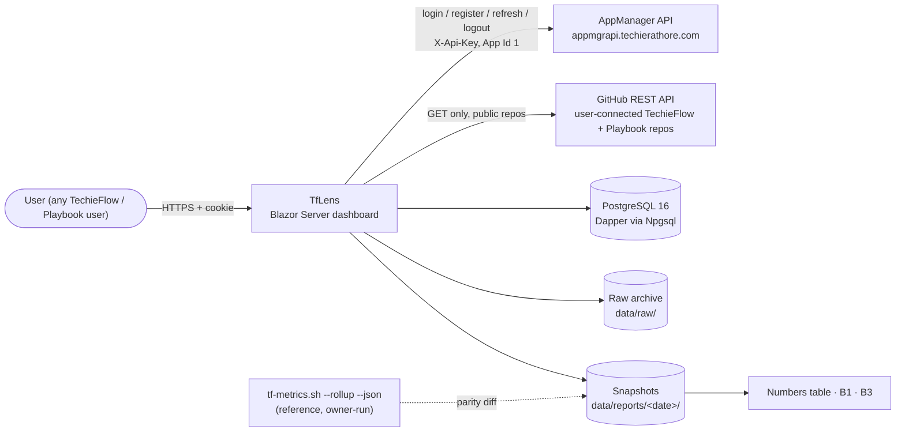
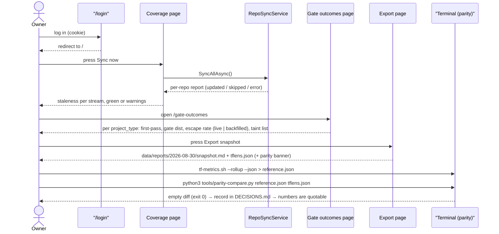
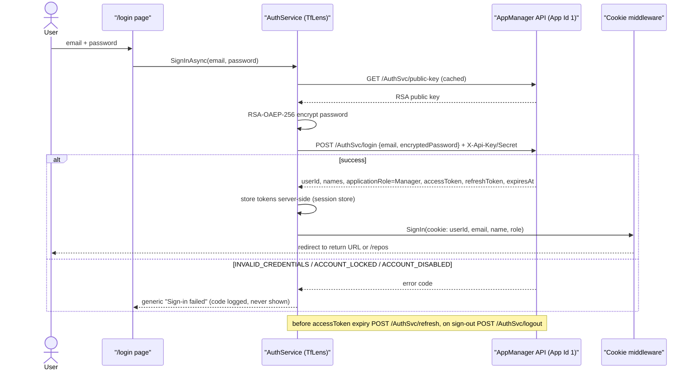
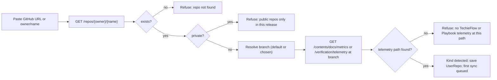
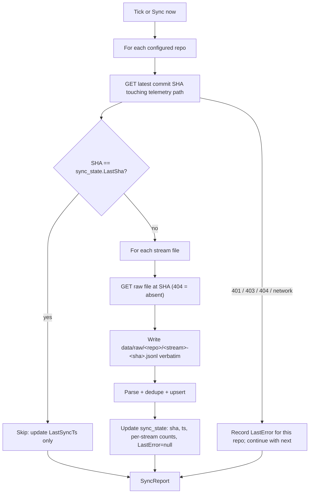
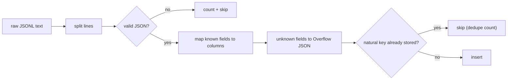

# TfLens — Business Requirements — Phase 1: Foundation

<!-- AGENT-ONLY AUTHORING NOTES — never render as visible text.
  STABLE IDS: every requirement has a BRD-{N} ID; append-only across revisions.
  DEPTH MANDATE: human document; §9 Feature catalog is the heart; one-liners only in §10.
  MERMAID MANDATE: html-render-shell.md §5.5 — quote every label; never use `end` as a node id.
-->

| | |
|---|---|
| App | TfLens |
| Kind | app |
| Size | Large |
| Phase | 1 of 3 |
| Status | Target |
| Stack answer set | Blazor Server · PostgreSQL 16 · Dapper · TrBlazeUI · Docker |
| Date | 2026-09-08 |

**Phase 1 of 3 — identity, sources, sync, storage, ops.** Requirement ids: **BRD-1 to BRD-20, BRD-22 to BRD-29, BRD-77 to BRD-108, BRD-111 to BRD-111, BRD-142 to BRD-142, BRD-144 to BRD-144**.
Other phases: [Phase 2 — Reports](./TfLens-P2-BRD.md) · [Phase 3 — Depth](./TfLens-P3-BRD.md) · the map is [TfLens-Phases.md](./TfLens-Phases.md).

**This document also carries the whole-project context** — the executive summary, objectives, scope, stakeholders, the diagrams, the constraints, the parity procedure, the definition of done, the success metrics and the risks. The later phases point back here for all of it rather than repeating it.

## Table of Contents

1. [Executive summary](#executive-summary)
2. [Business objectives](#business-objectives)
3. [Scope](#scope)
4. [Development status](#development-status)
5. [Stakeholders / users](#stakeholders-users)
6. [Context diagram](#context-diagram)
7. [User journey — primary use case](#user-journey-primary-use-case)
8. [Component sketch](#component-sketch)
9. [Feature catalog](#feature-catalog)
   - [F-SHELL: App shell and navigation](#f-shell-app-shell-and-navigation)
   - [F-AUTH: AppManager identity — login, registration, sessions](#f-auth-appmanager-identity-login-registration-sessions)
   - [F-REPOS: Source management — fetch public repos, or import metric files](#f-repos-source-management-fetch-public-repos-or-import-metric-files)
   - [Screen inventory — every screen, what it is for, and its mockup](#screen-inventory-every-screen-what-it-is-for-and-its-mockup)
     - [What "Gate outcomes" shows — and why it is no longer called "Three questions"](#what-gate-outcomes-shows-and-why-it-is-no-longer-called-three-questions)
   - [F-CFG: Configuration and secrets (retired 2026-08-26)](#f-cfg-configuration-and-secrets-retired-2026-08-26)
   - [F-SYNC: Repo puller — background sync and Sync now](#f-sync-repo-puller-background-sync-and-sync-now)
   - [F-RAW: Raw archive and rebuild](#f-raw-raw-archive-and-rebuild)
   - [F-PARSE: Parser to PostgreSQL with dedupe and overflow](#f-parse-parser-to-postgresql-with-dedupe-and-overflow)
   - [F-ENGINE: Metrics engine with provenance rules](#f-engine-metrics-engine-with-provenance-rules)
   - [F-COVER: Coverage / health page](#f-cover-coverage-health-page)
   - [F-3Q: Gate outcomes page](#f-3q-gate-outcomes-page)
   - [F-HARN: Harness comparison page](#f-harn-harness-comparison-page)
   - [F-ROUTE: Routing and economics page](#f-route-routing-and-economics-page)
   - [F-MISS: Misses and rework economics](#f-miss-misses-and-rework-economics)
   - [F-EFFORT: Phase effort and efficiency — what each phase cost](#f-effort-phase-effort-and-efficiency-what-each-phase-cost)
   - [F-EXPORT: Weekly snapshot export](#f-export-weekly-snapshot-export)
   - [F-PARITY: Parity check against tf-metrics.sh](#f-parity-parity-check-against-tf-metrics-sh)
   - [F-FRAMEWORK: Playbook as a first-class framework — the full report set (was F-PB)](#f-framework-playbook-as-a-first-class-framework-the-full-report-set-was-f-pb)
   - [F-OPS: Container, configuration, health, docs and decisions](#f-ops-container-configuration-health-docs-and-decisions)
10. [Functional requirements (BRD ledger)](#functional-requirements-brd-ledger)
11. [Non-functional requirements](#non-functional-requirements)
12. [Constraints & assumptions](#constraints-assumptions)
13. [Parity check — the mandatory acceptance test](#parity-check-the-mandatory-acceptance-test)
14. [Definition of done](#definition-of-done)
15. [Success metrics](#success-metrics)
16. [Risks](#risks)
17. [Glossary](#glossary)

## 1. Executive summary

TfLens is a read-only lens over the development telemetry that **both** of the owner's frameworks — TechieFlow and the AI-First-Playbook — **already emit**. Every TechieFlow-managed repository carries five append-only JSONL streams under `docs/metrics/` (`runs`, `gates`, `sessions`, `commits` and — since 2026-08-28 — `misses`; schema v=1, defined in `.tfcore/telemetry/SCHEMA.md`); Playbook-managed repositories emit `verification/telemetry/events.ndjson` today and will converge on the same schema. Today the only consumer of those streams is a shell script, `tf-metrics.sh --rollup`, which prints a segmented text report. TfLens pulls the streams from GitHub, stores them in PostgreSQL (amended 2026-08-26), and renders the same figures — plus a few the script does not compute — as an authenticated Blazor Server dashboard with a **Framework switch** (TechieFlow | Playbook) on every report page, and a weekly snapshot export whose numbers can be quoted in public writing. The Playbook report set is Phase 3, as is the miss / rework report (F-MISS, amended 2026-08-28) and the phase-effort report (F-EFFORT, amended 2026-09-01).

**Both frameworks now publish an effort contract** (amended 2026-09-01). TechieFlow's `runs.jsonl` gained three §2.6 fields on 2026-08-31 — `subagent_runs`, `tokens_out_subagents`, `model_tokens_out` — and an oracle mode, `tf-metrics.sh --phases`, that groups every run by `cmd`; the AI-First-Playbook shipped a normalized **schema-2 `phase-metric`** record carrying wall-clock elapsed, observed active time, a full per-model breakdown, stable phase identity and spawned-child counts, alongside a normalized miss export. Together they answer *"what did each phase cost — in time, tokens, models and subagents?"*, and TfLens renders that as a seventh report page, `/effort`. The answer is bounded in three places at once, and **every bound is on screen beside its figure**: a run whose token window was never computed is not a zero, a run whose window never read the subagent transcripts has not reported "no subagents", and a Playbook execution whose window ended at EOF has no duration at all. Reporting any of those as `0` would be the same defect this product exists to prevent, arriving on a third stream.

TfLens is free and open source, and it is **multi-user by design** (amended 2026-08-26): anyone who uses TechieFlow or the Playbook can sign in, connect their own **public** GitHub repos, and see the reports for their data. Identity is delegated to the owner's **AppManager** service (`https://appmgrapi.techierathore.com`, Application Id 1) — TfLens stores no passwords; every user is an AppManager `Manager` for this application and no licensing, feature or payment capability is used. Each user's repos, raw archive, parsed rows and reports are isolated from every other user's.

It builds **no capture layer, no ingestion API, and no per-machine agents**. Capture is the frameworks' job and already works across Claude Code, OpenCode, and (via `harness: null`) anything else that runs the tasks. TfLens never writes to any repository; it reads with a fine-grained, contents-only token.

The name is deliberate: "Analyst" collides with TechieFlow's analyst agent and "TfMetrics" collides with `tf-metrics.sh`. A *lens* changes nothing it looks at. The dangerous failure mode of this product is not a crash but a **plausible wrong number** — a backfilled record leaking into a live rate, a `library` record pooled into an `app` gate distribution — that gets exported, quoted, and cannot be defended. The provenance rules of SCHEMA.md §6 are therefore enforced in code with no switch to disable them, and a mandatory parity test against `tf-metrics.sh` is the acceptance gate (§13).

Plan context (from `docs/ravi-90day-positioning-plan-v2.4.2.md`): TfLens is the A-V verification vehicle — a real side project built through the full TechieFlow phase sequence, funded from side-project hours, never a plan deliverable. Its exported numbers feed the plan's Numbers table, the B1 portability story (harness comparison), and the B3 token-economics post (counterfactual repricing).

## 2. Business objectives

- Turn the existing telemetry into a dashboard the owner can open in a browser, within a 1–2 day timebox, without adding any capture surface to the frameworks.
- Produce **quotable numbers**: a weekly snapshot (markdown + JSON) that never mixes provenances and that has passed an exact parity diff against `tf-metrics.sh --rollup` on the same dataset.
- Make the telemetry's own health visible: a Coverage page that says, per repo, whether a clone has stopped pushing or lacks hooks — before any other figure is trusted.
- Render the B1 story as data (per-harness volumes, tokens, verdict mix, OpenCode-only dollars) and the B3 claim basis (tokens repriced as if every run used the most expensive observed model, labelled *estimate*).
- Serve as the A-V verification build: every TechieFlow phase runs on TfLens itself, gates enforced, so the framework's telemetry records its own dashboard being built.

## 3. Scope

**In scope**

- Pulling `docs/metrics/{runs,gates,sessions,commits,misses}.jsonl` (and, for Playbook repos, `verification/telemetry/events.ndjson`) from the **public** GitHub repos each signed-in user connects on the `/repos` screen, on a poll interval and on demand; raw archive; PostgreSQL store (Dapper); rebuild from raw; per-user data isolation. *(`misses` added 2026-08-28 — F-MISS.)*
- The same report set for both frameworks, selected by a Framework switch and never pooled across frameworks (Playbook set: Phase 3).
- **Two ways to add a source** (amended 2026-08-28, F-IMPORT): **Fetch via API** for public repos, or **Import metric files** — the user uploads the telemetry their framework already writes to disk, so **private and corporate repositories are reachable without TfLens ever holding a credential for them**. Both land in the same tables through the same parser; the Repos screen shows which is which.
- AppManager-backed identity: email/password login, self-registration, forgot/reset password, session cookie with server-side token refresh; every user is `Manager`; demo user `TfLensDemo`.
- Parser with SCHEMA.md-exact columns, JSON overflow for unknown fields, and idempotent dedupe on the streams' natural keys — including the one stream (`misses`) whose records do not all share a shape.
- **Phase-effort telemetry from both frameworks** (amended 2026-09-01, F-EFFORT): TechieFlow's three new `runs.jsonl` §2.6 fields and the `--phases` oracle block; the Playbook's normalized **schema-2 `phase-metric`** NDJSON (delivered through the existing **Import metric files** mode — the exporter reads a transient event file TfLens cannot reach, so its stdout is uploaded like any other bundle) and its normalized miss export. Both land on one page, `/effort`, under the Framework switch.
- Seven report pages (Coverage, Gate outcomes, Harness comparison, Routing & economics, **Misses & rework**, **Phase effort**, Snapshot export) computed at request time with the provenance rules enforced structurally. *(Misses & rework added 2026-08-28; Phase effort added 2026-09-01; both Phase 3.)*
- Weekly snapshot export to `data/reports/<date>/` as markdown + JSON.
- Parity tooling: machine-readable export in the reference's key layout, a compare script, and the DECISIONS.md record of each passing run.
- Phase 3: a separate Playbook adapter for `verification/telemetry/events.ndjson` with its own tables and a minimal page.
- Single-user cookie auth; Serilog file logging; Dockerfile; `/healthz`.

**Out of scope (explicit — recorded in the README)**

- Any capture layer, machine-to-machine ingestion API, OTLP endpoint, or per-machine agent. *(Amended 2026-08-28 — narrowed, not removed: the **Import metric files** mode on `/repos` is an authenticated file-picker on a page a human is signed into, and it is the **only** inbound path. Nothing can push data into TfLens automatically, no endpoint accepts an unauthenticated post, and neither framework is asked to grow an export command — the user uploads the files TechieFlow and the Playbook already write to disk. BRD-139 bounds the surface.)*
- Writing anything to any repository, ever.
- VPS / infra configuration (supplied separately).
- Reading a private GitHub repo **over the API** (this release is public-repo-only for fetching; a per-user PAT is a later release). *(Amended 2026-08-28: a private or corporate repo is no longer out of reach — its telemetry is added through **Import metric files** instead, which needs no credential, no network access to the repo, and no change to the repo itself. What stays out of scope is TfLens authenticating to a private repo and pulling from it.)*
- AppManager licensing, subscriptions, feature flags, payments, issues — none are called.
- GitHub SSO — **deferred to Phase 2** (BRD-94): AppManager has no external-login endpoint, so it needs a bridge or an AppManager change first.
- Roles beyond `Manager`; sharing a user's reports with another user.
- Any estimate presented as a measurement: no rate-card dollars anywhere except the explicitly labelled repricing and rework-estimate figures.
- **Any blended rework-cost figure** (amended 2026-08-28): measured (`cost_attribution: sole`) and apportioned (`shared:n`) miss cost are never summed into one number, in the page, the export or parity — see BRD-122, BRD-130.
- **Writing to any telemetry stream**, including `misses.jsonl`: TfLens consumes the miss stream and never emits into it. Recording a miss is TechieFlow's `*log-miss`, not TfLens's job.
- **Any per-REQ or per-feature effort figure** (added 2026-09-01): the unit of work is **the run**, not the ticket. A `*build-phase` run touching eight REQs has one duration and one token window; dividing it eight ways is arithmetic dressed as measurement — the same distinction `cost_attribution` already draws for misses. Both producers state this as a standing non-goal and neither emits a per-REQ timing field. See BRD-169.
- **Any actor-grouped figure** (added 2026-09-01): the Playbook's records carry an `actor`, and no TfLens surface — page, API, export or parity — groups quality, rework, miss, effort, token, time or cost by it. Both AIFP contracts state this as a hard rule; see BRD-168.
- **Running a framework's exporter.** TfLens does not execute `playbook-telemetry.mjs`, `tf-metrics.sh`, or any framework tooling against a user's repository. It reads what the frameworks have already written, and where that output is transient rather than committed it is **uploaded** through the existing import mode (BRD-153) — no node dependency, no execution surface, no change asked of either framework.

## 4. Development status

Written by the status gate after every build, verify and handoff; not by hand.

**Snapshot as of 2026-09-15.** Live per-requirement status: `PROJECT-STATUS.md` and the Requirements Status table in `docs/TfLens-Checklist.md`.

| Screen | Requirements | Verified | Open | Status |
|---|---|---|---|---|
| UI / Pages | 13 | 12 | 1 | Partial |
| Functional requirements | 46 | 46 | 0 | Done |
| Non-functional | 18 | 15 | 3 | Partial |

## 5. Stakeholders / users

TfLens is multi-user (amended 2026-08-26). Every signed-in person is an AppManager `Manager` for Application 1 and sees only their own connected repos. The owner additionally wears the parity, author and ops hats.

| Role | Who | Needs | Key screens |
|------|-----|-------|-------------|
| **User** (any TechieFlow / Playbook user) | Anyone who registers (email/password via AppManager) — e.g. the demo account `TfLensDemo` | Sign in, connect their public repos, see health and the reports for their own data, export their snapshot | `/login`, `/register`, `/repos`, `/`, `/gate-outcomes`, `/harness`, `/routing`, `/export` |
| **Owner** (dashboard user) | The framework author, signed in like any other user | See whether telemetry is healthy, read the three questions per project type, compare harnesses, see routing drift and the repricing estimate, press Sync now | `/`, `/gate-outcomes`, `/harness`, `/routing` |
| **Parity operator** | The same person, at a terminal, before any number is quoted | Run `tf-metrics.sh --rollup --json` on a pinned dataset, export `tflens.json` for the same SHAs, run the compare script, record the pass in DECISIONS.md | `/export`, the `export` verb, `tools/parity-compare.py` |
| **Author** (consumer of the export) | The same person writing the weekly Numbers row, B1, B3 | A snapshot that never mixes provenances, states *estimate* where it estimates, and carries its parity stamp so it is quotable | `/export` output under `data/reports/<date>/` |
| **Ops** | The same person deploying the container | One image, one volume, env-var secrets, a health endpoint, rolling file logs | Dockerfile, `/healthz`, `logs/` |
| **Downstream frameworks** (not users) | TechieFlow, AI-First-Playbook | Nothing — TfLens never writes to them and never asks them to change | — |

Onboarding path (any user): open `/register` (or sign in at `/login`), go to **Repos**, connect a public GitHub repo by URL, press **Sync now**, and read the Coverage page until it is green. Ops path: set the AppManager settings (`TfLensAppManagerApiKey` / `TfLensAppManagerApiSecret`, App Id 1) and optionally `TfLensGitHubToken`, start the container.

## 6. Context diagram

## 7. User journey — primary use case

The weekly loop: sync, check health, read the questions, export, prove parity, quote.

## 8. Component sketch

## 9. Feature catalog

### Screen inventory — every screen, what it is for, and its mockup

Read this table with `docs/mockups/` open. It lists every screen the app has, **what question that screen exists to answer**, the feature that owns it, the requirements it satisfies — **every ID is a link into the §10/§11 ledger, so you can read the requirement itself without searching** — and the mockup the built screen is graded against. The mockups are a click-through: start at [login.html](./mockups/login.html). The per-screen component map (`region → TrBlazeUI control`) is in `docs/TfLens-UIDesign.md`.

| Screen | Route | Purpose — the question this screen answers | Feature | Requirements *(click an ID to jump to it)* | Mockup |
|--------|-------|--------------------------------------------|---------|---------------------------------------------|--------|
| Repos — sources *(+ Add source dialog: Fetch via API \| Import metric files; Remove dialog)* | `/repos` | **Nothing else on the site works until this does.** Connect the telemetry TfLens will read — either **fetch** a public GitHub repo's streams through the API, or **import** metric files by upload when the repo is private or corporate, or when the producer's output is transient and cannot be fetched on a schedule (the Playbook's phase metrics). Also where a source is removed and every parsed row and raw archive belonging to it is purged. | F-REPOS | [BRD‑98](#brd-98) · [BRD‑99](#brd-99) · [BRD‑100](#brd-100) · [BRD‑101](#brd-101) · [BRD‑102](#brd-102) · [BRD‑103](#brd-103) · [BRD‑104](#brd-104) · [BRD‑131](#brd-131) · [BRD‑132](#brd-132) · [BRD‑133](#brd-133) · [BRD‑134](#brd-134) · [BRD‑135](#brd-135) · [BRD‑136](#brd-136) · [BRD‑137](#brd-137) · [BRD‑138](#brd-138) · [BRD‑139](#brd-139) · [BRD‑140](#brd-140) · [BRD‑141](#brd-141) | [repos.html](./mockups/repos.html) |
| Shell: sidebar, header, Framework switch, user menu | *(layout)* | **Makes “whose data, and which framework?” answerable on every screen.** Carries the eight-item nav in the order a user should work in, the **Framework switch** (TechieFlow \| Playbook) that re-queries the whole page, **Sync now** with the last-sync badge, the theme toggle and the user menu. | F-SHELL, F-FRAMEWORK | [BRD‑4](#brd-4) · [BRD‑5](#brd-5) · [BRD‑6](#brd-6) · [BRD‑105](#brd-105) · [BRD‑106](#brd-106) · [BRD‑108](#brd-108) · [BRD‑151](#brd-151) | visible on every report mockup, e.g. [coverage.html](./mockups/coverage.html) |

#### What “Gate outcomes” shows — and why it is no longer called “Three questions”

This screen renders the questions `.tfcore/telemetry/SCHEMA.md` §0 declares the telemetry exists to answer — the questions the whole system was built for, in order:

| # | Question | Stated as | Answered from |
|---|----------|-----------|---------------|
| 1 | **First-pass rate** | What fraction of REQs reach `Verified` on **attempt 1**? | `gates.jsonl` |
| 2 | **Gate catch distribution** | Of all failures, **which gate caught them**? | `gates.jsonl` |
| 3 | **Escape rate** | What fraction of defects reached **UAT or production** instead of being caught by a gate? | `gates.jsonl` |
| 4 | *Miss attribution and rework cost* — added 2026-08-28 | **What** was missed, **which phase / agent / model** let it through, and **what did fixing it cost**? | `misses.jsonl` → its own screen, `/misses` |

Rows 1–3 share one stream and one unit — a gate record is *a verdict at an instant* — which is why they belong on one screen. **Row 4 was deliberately not added to it.** A miss is a different unit: an object with a lifecycle that can span several runs, and which can exist with **no verify run at all** (that is how design-phase misses become visible for the first time). It also carries its own *escape share*, a different measurement from row 3's *escape rate* — two definitions of one word on one screen is how a report loses its reader. So row 4 got `/misses`, and row 3 kept its definition and its source untouched.

**Renamed 2026-09-01, owner ruling.** Until then this screen was called **“Three questions”** and lived at `/three-questions`. That label named a *count*, not a subject: it was the only item in the sidebar not named for what it shows, and it only resolved for a reader who had already read SCHEMA.md — a document that lives in `.tfcore/`, outside this repository's `docs/`. **Gate outcomes** states both the subject and the source: all three figures come from `gates.jsonl`, which SCHEMA.md calls *the primary stream*. It also reads cleanly against `Misses & rework` beside it, which is the adjacent-but-different question — **gate verdicts** here, **defect lifecycle** there.

Two things the rename deliberately did **not** change:

- **The schema's own wording.** SCHEMA.md §0 still calls these *the three questions*, and that phrase remains correct wherever this BRD, the code comments or the Architecture refer to the **concept**. TfLens renamed its *screen*, not the framework's vocabulary — that vocabulary is not this product's to change.
- **The feature ID.** This feature is still **F-3Q**. Requirement and feature IDs are stable identifiers that other documents, checklist rows and telemetry records point at; renaming one to match a label would break traceability for no gain. Read `F-3Q` as an opaque key, not as an abbreviation of the current title.

| Login | `/login` | **Prove who you are before any figure is shown.** TfLens stores no passwords — identity is delegated to AppManager — and every figure on every other screen is scoped to the signed-in user's own connected repos. | F-AUTH | [BRD‑1](#brd-1) · [BRD‑2](#brd-2) · [BRD‑90](#brd-90) · [BRD‑94](#brd-94) *(GitHub SSO — deferred to Phase 2)* | [login.html](./mockups/login.html) |
| Register | `/register` | **Let a new user in.** TfLens is free and open source, so anyone who uses either framework can create an account and see the reports for their own data; every registrant becomes an AppManager `Manager` and no licence, feature or payment endpoint is ever called. | F-AUTH | [BRD‑91](#brd-91) · [BRD‑95](#brd-95) | [register.html](./mockups/register.html) |
| Forgot password | `/forgot-password` | **Start a password reset without TfLens ever seeing the password.** The request goes to AppManager; TfLens only carries it. | F-AUTH | [BRD‑92](#brd-92) | [forgot-password.html](./mockups/forgot-password.html) |
| Reset password | `/reset-password` | **Finish that reset** from the emailed link, with the new password RSA-encrypted before it leaves the server. | F-AUTH | [BRD‑92](#brd-92) | [reset-password.html](./mockups/reset-password.html) |
| Profile | `/profile` | **The one screen where a user acts on themselves rather than on data** — display name, password, theme preference. | F-AUTH, F-SHELL | [BRD‑106](#brd-106) · [BRD‑107](#brd-107) | [profile.html](./mockups/profile.html) *(user menu shown open)* |
| Health endpoint | `/healthz` | **Liveness for the container and the orchestrator.** Not a user surface. | F-OPS | [BRD‑78](#brd-78) | *(no UI)* |

**Screens of the other phases**, each in its own phase BRD so a screen sits in exactly one place: phase 2 — Coverage / health, Gate outcomes, Harness comparison, Routing & economics, Snapshot export ([TfLens-P2-BRD.md](./TfLens-P2-BRD.md)); phase 3 — Misses & rework, Phase effort, Playbook framework state ([TfLens-P3-BRD.md](./TfLens-P3-BRD.md)).

### F-SHELL: App shell and navigation

**Personas:** User, Owner · **Phase:** 1 *(amended 2026-08-26: login moved to F-AUTH; collapsible icon sidebar, user menu, dark-first)*

Every page lives inside one TrBlazeUI sidebar shell (`SidebarProvider` + `Sidebar Collapsible` + `SidebarInset`). The sidebar is **collapsible** via `SidebarTrigger` (icon-only rail with tooltips when collapsed) and every item carries a **Lucide icon**; the order is the order a user should work in: **Repos** first (nothing to see until a repo is connected), then Coverage ("every other number is suspect until this page is green"), Gate outcomes, Harness comparison, Routing & economics, **Misses & rework** *(added 2026-08-28, F-MISS)*, **Phase effort** *(added 2026-09-01, F-EFFORT)*, Snapshot export (the separate Playbook page was retired 2026-08-26 — see F-FRAMEWORK). *Phase effort* sits after *Misses & rework* deliberately: both are cost lenses, and the reader should meet the quality question before the budget one. The header carries the **Framework switch** (TechieFlow | Playbook, F-FRAMEWORK), the page title, a **Sync now** button with the last-sync badge, the theme toggle, and — on the right — the **signed-in user's name** with a `DropdownMenu` (Profile, Manage repos, Sign out); there is no bare sign-out button. The application **starts in dark mode**; the user's toggle choice is persisted per user.

| Screen | Route | Description | Mockup |
|--------|-------|-------------|--------|
| Shell | (layout) | Collapsible icon sidebar (Repos, Coverage, Gate outcomes, Harness, Routing & economics, Misses & rework, **Phase effort**, Snapshot export); header: **Framework switch (TechieFlow / Playbook)** · title · Sync now · last-sync badge · theme toggle · user menu | [coverage.html](./mockups/coverage.html) (shell visible on every report mockup) |

**Workflow:**
1. Unauthenticated request to any page → redirect to `/login` with return URL (F-AUTH).
2. **Sync now** in the header runs `SyncAllAsync(userId)` for the signed-in user's repos and shows a toast with the per-repo outcome.
3. User menu → **Sign out** → AppManager `/AuthSvc/logout` → cookie cleared → `/login`.
4. `SidebarTrigger` collapses/expands the sidebar; the state is remembered (`CookieKey`).

**Requirements:** BRD-2, BRD-4, BRD-5, BRD-6, BRD-105, BRD-106, BRD-107, BRD-124, BRD-151

### F-AUTH: AppManager identity — login, registration, sessions

**Personas:** User, Owner · **Phase:** 1 (GitHub SSO: Phase 2, deferred) *(added 2026-08-26)*

TfLens keeps **no user store and no passwords**. Identity is delegated to the owner's AppManager service (`docs/AppManager-api-usage-guide.md`, v1.4): base URL `https://appmgrapi.techierathore.com`, **Application Id 1**, identified on every call by the `X-Api-Key` / `X-Api-Secret` headers (values from configuration only — F-OPS). Passwords are never sent in clear: TfLens fetches and caches `GET /AuthSvc/public-key` and RSA-OAEP-256-encrypts the password client-side before `POST /AuthSvc/login` or `/AuthSvc/register`. Because TfLens is free and open source, no licence, feature, subscription or payment endpoint is ever called, and every registered user is assigned `applicationRoleCode: "Manager"`. On success TfLens issues its own auth cookie (sliding 12 h, HttpOnly, Secure) carrying the AppManager `userId`, email, display name and role; the AppManager access and refresh tokens are held **server-side** per session and refreshed through `POST /AuthSvc/refresh` before expiry; a resumed cookie is checked with `POST /AuthSvc/validate`. A demo account **`TfLensDemo`** (`tflensdemo@techierathore.com`) is registered in AppManager during development and its public demo repos are connected through the Repos screen (no configuration seed — amended 2026-08-26), so testers and first-time visitors can see a populated dashboard.

**GitHub SSO — deferred to Phase 2 (BRD-94).** AppManager exposes no external-login or token-exchange endpoint, so "Continue with GitHub" cannot obtain an AppManager token without a bridge (a TfLens-held random credential per SSO user). The owner chose to defer this until AppManager grows an SSO endpoint; the login screen reserves the button position but does not show it in this release.

| Screen | Route | Description | Mockup |
|--------|-------|-------------|--------|
| Login | `/login` | Email + password; links to Register and Forgot password; generic error on failure; anonymous | [login.html](./mockups/login.html) |
| Register | `/register` | First name, last name, email, password (+ confirm) per AppManager rules (8+, upper, digit, special); creates the user with role Manager; anonymous | [register.html](./mockups/register.html) |
| Forgot password | `/forgot-password` | Email → `/AuthSvc/forgot-password` (always "if that address exists, an email was sent"); anonymous | [forgot-password.html](./mockups/forgot-password.html) |
| Reset password | `/reset-password?token=…` | New password (+ confirm) → `/AuthSvc/reset-password`; anonymous | [reset-password.html](./mockups/reset-password.html) |
| Profile | `/profile` | Read-only AppManager profile (`GET /UserSvc/profile`) + change password (`POST /UserSvc/change-password`) | [profile.html](./mockups/profile.html) |

**Workflow:**
1. `/login`: encrypt → login → cookie → redirect (first sign-in with no repos lands on `/repos`).
2. `/register`: validate password rules locally → encrypt → `register` with `applicationRoleCode: "Manager"` → same cookie issue as login.
3. `/forgot-password` → `forgot-password`; `/reset-password` → `reset-password` (API key header supplies the app scope).
4. Session: refresh tokens server-side before `tokenExpiresAt`; on refresh failure → sign out.
5. Sign out: `logout` with the refresh token (per-app scope) → clear cookie.

**Requirements:** BRD-1, BRD-90, BRD-91, BRD-92, BRD-93, BRD-94 (deferred), BRD-95, BRD-96, BRD-97

### F-REPOS: Source management — fetch public repos, or import metric files

**Personas:** User, Owner · **Phase:** 1 (import mode: Phase 3) *(added 2026-08-26; amended 2026-08-28 — F-IMPORT folded in as a second mode of the same dialog rather than a separate screen, owner decision)*

TfLens is for anyone using the frameworks, so the sources to read are **managed in the app, per user**, not in a config file. The `/repos` screen lists the signed-in user's connected sources (owner/name, branch, kind, **source**, visibility, status, last sync or last import, per-stream record counts) with per-row **Sync** / **Re-import** and **Remove** actions and an **Add source** dialog.

**Two ways in, chosen in the dialog (amended 2026-08-28 — F-IMPORT).** The first step of the dialog is a mode choice, and it is the demarcation the whole feature rests on:

| Mode | For | How the data arrives | Row action | Poller |
|---|---|---|---|---|
| **Fetch via API** | **Public** repos | TfLens calls the GitHub API, validates, and pulls on a schedule (F-SYNC) | **Sync** | polls it |
| **Import metric files** | **Private / corporate** repos — or any repo the user would rather not connect | The user uploads a zip of `docs/metrics/` (or `verification/telemetry/`), or the loose `.jsonl` / `.ndjson` files, exactly as their framework already wrote them to disk | **Re-import** | **skips it** |

An imported source has no remote to poll, so it gets **Re-import**, not a Sync button that would do nothing, and the background poller passes over it rather than waking every fifteen minutes to contact something that isn't there. Everything downstream is identical: one extra column (`SourceKind`) on the source row, the same raw archive, the same parser, the same dedupe, the same engine, the same isolation. **No second code path exists**, because a second path is where a second set of bugs lives.

Why this reaches private repos at all: TfLens never needs the repository — it needs the JSONL files inside it, which the frameworks already write in plain text. Uploading them requires no credential, no network route to a corporate host, no PAT, and no change to the repo. What remains out of scope is TfLens *authenticating to* a private repo and pulling from it (§3).

**An imported source is user-supplied, and TfLens does not pretend otherwise.** A fetched file came from a named commit in a public repo; an uploaded file came off someone's desktop and could in principle have been edited on the way. TfLens does not try to detect that — it makes the origin **visible everywhere** instead: a `Synced` / `Imported` badge on the row, a source column on Coverage, a `source_kind` key in the export. The reader always knows which they are looking at. Connecting takes a GitHub URL or `owner/name` (+ branch, default branch auto-detected) and validates it through the GitHub API before saving: the repo must exist, must be **public** (this release supports public repos only — a private repo is refused with an explicit message), and must contain the telemetry path for its kind on that branch (`docs/metrics/` → `techieflow`, `verification/telemetry/` → `playbook`; the kind is auto-detected and can be overridden). Removing a repo stops its sync and **purges** that user's parsed rows and raw archive for it. All data is scoped by user: `sync_state`, the raw archive (`data/raw/<userId>/<owner>__<name>/`), the stream tables and the analysis cache all carry the `UserId`; a page never shows another user's repos. The same public repo may be connected by several users independently (each gets their own copy — the simplest rule that keeps isolation exact). The `appsettings` repo list is used only to seed the `TfLensDemo` account at first start.

| Screen | Route | Description | Mockup |
|--------|-------|-------------|--------|
| Repos | `/repos` | User's sources grid with a **Source** column (`Synced` / `Imported`); Add source button; per-row Sync **or** Re-import, plus Remove; empty state for a new user | [repos.html](./mockups/repos.html) |
| Add source — **Fetch via API** (dialog) | `/repos` | Mode = Fetch via API: URL or owner/name, branch, kind (auto), Validate → shows public ✓ / telemetry path ✓ / default branch → Connect | [repos.html](./mockups/repos.html) (dialog panel) |
| Add source — **Import metric files** (dialog) | `/repos` | Mode = Import metric files: source name, framework, optional `project_type`; drop zone for a `.zip` / `.jsonl` / `.ndjson`; **preview before commit** (records per stream, date range, invalid lines, unknown fields, bundle sha256) → Import | [repos.html](./mockups/repos.html) (dialog panel) |
| Re-import (dialog) | `/repos` | Same import panel, pre-named to the existing source; states records added vs duplicates collapsed after commit | [repos.html](./mockups/repos.html) (dialog panel) |
| Remove source (dialog) | `/repos` | Confirm; explains that parsed rows + raw archive for this source are purged — identical for fetched and imported | [repos.html](./mockups/repos.html) (dialog panel) |

**Workflow:**
1. New user lands on `/repos` (empty state: "Add your first source" — offering both modes).
2. **Fetch via API:** validate (exists, public, telemetry path) → save → first sync runs → toast.
3. **Import metric files:** name the source → drop the zip or files → TfLens unpacks, validates and **previews** (records per stream, date range, invalid lines, unknown fields, bundle sha256) → the user reviews → Import commits: bytes archived verbatim, then parsed by the same parser → toast states records added and duplicates collapsed.
4. Row **Sync** (fetched) → `SyncRepoAsync(userId, repo)`; row **Re-import** (imported) → the import panel again; row Remove → confirm → purge rows + raw → row disappears.
5. Header Sync now and the background poller iterate every user's **fetched** sources and skip imported ones; errors stay per user and source.

**Requirements:** BRD-98, BRD-99, BRD-100, BRD-101, BRD-102, BRD-103, BRD-104, BRD-131, BRD-132, BRD-133, BRD-134, BRD-135, BRD-136, BRD-138, BRD-139, BRD-140, BRD-141, BRD-153

### F-CFG: Configuration and secrets (retired 2026-08-26)

~~F-CFG~~ — retired in the second amendment. Repos are managed only on the Repos screen (F-REPOS), so there is no repo list and no demo seed in configuration; the remaining infrastructure settings (AppManager connection, database connection, poll interval, optional PAT, `DataRoot`) moved to **F-OPS**. BRD-7 is retired; BRD-8, BRD-9, BRD-10 and BRD-11 now belong to F-OPS. The candidate demo repos (techierathore/TechieFlow, TechieRag, TrBlazeUI, blog, AI-First-Playbook — public ones only) are connected to `TfLensDemo` through the UI during development (BRD-96).

### F-SYNC: Repo puller — background sync and Sync now

**Personas:** Owner (Sync now), Ops (background) · **Phase:** 1

A `BackgroundService` polls every connected repo of every user on the interval; the header button runs the identical code on demand for the signed-in user's repos (amended 2026-08-26: repos come from F-REPOS, not configuration). For each repo it asks GitHub for the latest commit SHA touching the telemetry path (`docs/metrics` for `techieflow`, `verification/telemetry` for `playbook`) on the configured branch. If that SHA equals the one in `sync_state`, the repo is skipped without fetching a byte. Otherwise every stream file is fetched whole at that exact SHA (they are small), written verbatim to the raw archive (F-RAW), and parsed (F-PARSE). A 404 on a stream file means "this stream is absent" and is recorded as zero, not as an error. Errors are per repo: one failing repo never stops the others, and the failure text (status code + short reason, never the token) lands in `sync_state.LastError` for the Coverage page. The puller is structurally read-only — no method exists that issues anything but GET.

**Workflow:**
1. Timer tick (every `PollIntervalMinutes`) or button press.
2. Per repo: SHA lookup → skip or fetch → archive → parse → `sync_state`.
3. Return a `SyncReport` (per repo: `Updated(sha, counts)` / `Skipped` / `Error(reason)`); the UI shows it as a toast and the Coverage page reflects it.
4. Invalidate the cached analysis so pages recompute.

**Requirements:** BRD-12, BRD-13, BRD-14, BRD-15, BRD-16, BRD-17, BRD-18, BRD-112

### F-RAW: Raw archive and rebuild

**Personas:** Ops, Parity operator · **Phase:** 1

The raw archive is the rebuild source and the audit trail. Every fetched file is stored byte-for-byte under `data/raw/<userId>/<owner>__<name>/<stream>-<sha>.jsonl` **before** it is parsed, so a parser bug can never lose data — fix the parser, run `rebuild`, done. `rebuild` (a command verb `dotnet TfLens.dll rebuild`, also a confirm-guarded button on the Coverage page) truncates every stream table in PostgreSQL (amended 2026-08-26), re-applies the schema script, and replays every archived file in repo order and SHA fetch order, then reports files replayed, records stored, and duplicates collapsed per stream. Because parsing is idempotent (F-PARSE), the record counts after a rebuild equal the counts after live syncs.

**Workflow:**
1. `rebuild` requested (verb or button with an "are you sure" dialog).
2. Drop all tables → create DDL → enumerate `data/raw/**/*.jsonl`.
3. Replay in order → recompute `sync_state` counts from the newest SHA per repo.
4. Report; invalidate caches.

**Requirements:** BRD-19, BRD-20, BRD-21, BRD-22, BRD-115

### F-PARSE: Parser to PostgreSQL with dedupe and overflow

**Personas:** Ops, Parity operator · **Phase:** 1

One table per stream (`Run`, `Gate`, `Session`, `Commit`) plus `SyncState` — and, from the 2026-08-28 amendment, three more for the one stream whose records do not all share a shape: `Miss`, `MissFix` and `MissAmend` (F-MISS). Column names follow SCHEMA.md field names exactly (PascalCase form; the mapping table is in the parser and in Architecture §6). A line that is not valid JSON is counted and skipped, exactly as the reference does — and so is a line in `misses.jsonl` whose `kind` the parser does not know. Any property the parser does not know for that stream — and any record with `v > 1` — keeps its unknown properties in a JSON `Overflow` column rather than being dropped; the set of unknown field names seen per repo is reported on the Coverage page ("fields observed that SCHEMA.md doesn't document"). Fields that SCHEMA.md says are "present only when true" or "absent means not captured" are stored as `NULL` when absent, never as `0`/`false`, so downstream can tell "not captured" from "zero".

Dedupe is idempotent on the natural identity of each stream, so re-parsing the same raw file or replaying it during rebuild never double-counts:

| Stream | Identity | Rule |
|--------|----------|------|
| `commits` | `sha` **per repo** | keep first; count collapsed duplicates (expected after union merges — two repos may legitimately share a short sha, hence per repo) |
| `sessions` | `session_id` | OpenCode records are cumulative snapshots: keep the record with the highest `output_tokens`, tie → latest `ts` |
| `runs` | `ts` + `app` + `cmd` | keep first |
| `gates` | `ts` + `app` + `req_id` + `run_id` | keep first |
| `misses` → `miss` | `miss_id` **per repo** | keep **earliest** `ts` — a miss is opened once; a duplicate is a re-parse of the same archived file, not new information *(2026-08-28)* |
| `misses` → `miss-fix` | `miss_id` + `fix_run_id` **per repo** | keep latest `ts` *(2026-08-28)* |
| `misses` → `miss-amend` | `miss_id` + `field` + `ts` **per repo** | keep **earliest** `ts` — amendments are additive and each is a distinct fact *(2026-08-28)* |

Provenance fields are preserved verbatim and typed: `backfilled`, `inferred`, `project_type`, `project_type_inferred`, `harness`. They are what Phase 2 segments on.

**Workflow:**
1. Receive `(repo, stream, sha, text)`.
2. Parse line by line; map; overflow; dedupe against the unique index; insert in one transaction.
3. Return `(inserted, duplicates, invalidLines, unknownFields[])`.

**Requirements:** BRD-23, BRD-24, BRD-25, BRD-26, BRD-27, BRD-28, BRD-29, BRD-113, BRD-114, BRD-145, BRD-154, BRD-164, BRD-165

### F-ENGINE: Metrics engine with provenance rules

**Moved to phase 2** on 2026-09-08 — see [TfLens-P2-BRD.md](./TfLens-P2-BRD.md): its screen row in §2 and its requirements in §3 (the phase BRDs dropped their feature catalogs on 2026-09-11). The heading stays here so every inbound link and every reference to this feature still resolves.

### F-COVER: Coverage / health page

**Moved to phase 2** on 2026-09-08 — see [TfLens-P2-BRD.md](./TfLens-P2-BRD.md): its screen row in §2 and its requirements in §3 (the phase BRDs dropped their feature catalogs on 2026-09-11). The heading stays here so every inbound link and every reference to this feature still resolves.

### F-3Q: Gate outcomes page

**Moved to phase 2** on 2026-09-08 — see [TfLens-P2-BRD.md](./TfLens-P2-BRD.md): its screen row in §2 and its requirements in §3 (the phase BRDs dropped their feature catalogs on 2026-09-11). The heading stays here so every inbound link and every reference to this feature still resolves.

### F-HARN: Harness comparison page

**Moved to phase 2** on 2026-09-08 — see [TfLens-P2-BRD.md](./TfLens-P2-BRD.md): its screen row in §2 and its requirements in §3 (the phase BRDs dropped their feature catalogs on 2026-09-11). The heading stays here so every inbound link and every reference to this feature still resolves.

### F-ROUTE: Routing and economics page

**Moved to phase 2** on 2026-09-08 — see [TfLens-P2-BRD.md](./TfLens-P2-BRD.md): its screen row in §2 and its requirements in §3 (the phase BRDs dropped their feature catalogs on 2026-09-11). The heading stays here so every inbound link and every reference to this feature still resolves.

### F-MISS: Misses and rework economics

**Moved to phase 3** on 2026-09-08 — see [TfLens-P3-BRD.md](./TfLens-P3-BRD.md): its screen row in §2 and its requirements in §3 (the phase BRDs dropped their feature catalogs on 2026-09-11). The heading stays here so every inbound link and every reference to this feature still resolves.

### F-EFFORT: Phase effort and efficiency — what each phase cost

**Moved to phase 3** on 2026-09-08 — see [TfLens-P3-BRD.md](./TfLens-P3-BRD.md): its screen row in §2 and its requirements in §3 (the phase BRDs dropped their feature catalogs on 2026-09-11). The heading stays here so every inbound link and every reference to this feature still resolves.

### F-EXPORT: Weekly snapshot export

**Moved to phase 2** on 2026-09-08 — see [TfLens-P2-BRD.md](./TfLens-P2-BRD.md): its screen row in §2 and its requirements in §3 (the phase BRDs dropped their feature catalogs on 2026-09-11). The heading stays here so every inbound link and every reference to this feature still resolves.

### F-PARITY: Parity check against tf-metrics.sh

**Moved to phase 2** on 2026-09-08 — see [TfLens-P2-BRD.md](./TfLens-P2-BRD.md): its screen row in §2 and its requirements in §3 (the phase BRDs dropped their feature catalogs on 2026-09-11). The heading stays here so every inbound link and every reference to this feature still resolves.

### F-FRAMEWORK: Playbook as a first-class framework — the full report set (was F-PB)

**Moved to phase 3** on 2026-09-08 — see [TfLens-P3-BRD.md](./TfLens-P3-BRD.md): its screen row in §2 and its requirements in §3 (the phase BRDs dropped their feature catalogs on 2026-09-11). The heading stays here so every inbound link and every reference to this feature still resolves.

### F-OPS: Container, configuration, health, docs and decisions

**Personas:** Ops · **Phase:** 1 *(amended 2026-08-26: absorbs the settings formerly in F-CFG; PostgreSQL)*

A multi-stage Dockerfile produces one image; a `docker-compose.yml` runs it beside a **PostgreSQL 16** service (owner decision 2026-08-26 — SQLite is unreliable on container storage; Dapper stays the data-access layer via Npgsql). Volumes: `data/` (raw archive, reports, `prices.json`), `logs/`, and the Postgres data directory. All settings come from configuration with secrets **only** via the PascalCase env-var provider: `TfLensAppManagerApiKey`, `TfLensAppManagerApiSecret`, `TfLensDbConnection` (required); `TfLensGitHubToken` (optional — raises the GitHub API rate limit for public reads). Non-secret: `TfLensAppManagerBaseUrl` (default `https://appmgrapi.techierathore.com`), `TfLensAppManagerAppId` (default `1`), `PollIntervalMinutes` (default 15), `DataRoot` (default `data/`). Startup validates the configuration, applies the idempotent schema script `database/001-schema.sql`, and refuses to run with a missing secret or an unreachable database, logging a redacted reason. `/healthz` (anonymous) reports database reachability and the age of the last successful sync, nothing else. The README states the out-of-scope list verbatim (§3) and the run/rebuild/export commands. `DECISIONS.md` is created at day-1 build time and records: the storage choice (Dapper + PostgreSQL, superseding SQLite), the dedupe keys, the parser version scheme, anything cut for the timebox, and every parity run.

**Workflow:**
1. `docker compose up` → `postgres` + `tflens`; secrets from the environment.
2. Startup: validate config → apply schema script → start poller + web host.
3. `docker exec <c> dotnet TfLens.dll rebuild|sync|export` for operations.

**Requirements:** BRD-8, BRD-9, BRD-10, BRD-11, BRD-77, BRD-78, BRD-79, BRD-80, BRD-81, BRD-111, BRD-144

## 10. Functional requirements (BRD ledger)
- **BRD-1** — User can sign in at `/login` with their AppManager email and password and is redirected to the requested page (first sign-in with no repos lands on `/repos`). *(F-AUTH — amended 2026-08-26)*
- **BRD-2** — System shall place every page except `/login`, `/register`, `/forgot-password`, `/reset-password` and `/healthz` behind cookie authentication (sliding 12 h, HttpOnly, Secure). *(F-AUTH — amended 2026-08-26)*
- ~~**BRD-3**~~ *(removed 2026-08-26: local PBKDF2 credential store superseded by AppManager — see BRD-90)*
- **BRD-4** — User can sign out from the **user menu** in the header (name → DropdownMenu → Sign out), which calls AppManager `/AuthSvc/logout` and clears the cookie. *(F-SHELL — amended 2026-08-26)*
- **BRD-5** — User can navigate between Repos, **Price providers**, Coverage, Gate outcomes, Harness, Routing & economics, **Misses & rework**, **Phase effort** and Snapshot export via a TrBlazeUI sidebar with a Lucide icon per item, in that order (Playbook page retired — framework is a header switch, BRD-108). *(F-SHELL — amended 2026-08-26 ×2, 2026-08-28: seven items, Misses & rework between Routing and Snapshot export; 2026-09-01: **eight** items, Phase effort between Misses & rework and Snapshot export; 2026-09-11: **nine** items, Price providers second, under Repos in the Workspace group, BRD-200)*
- **BRD-6** — User can press **Sync now** in the header and see the last-sync timestamp and a per-repo outcome toast for their own repos. *(F-SHELL — amended 2026-08-26)*
- ~~**BRD-7**~~ *(removed 2026-08-26: no repo list or demo seed in configuration — repos are managed only on the Repos screen, F-REPOS)*
- **BRD-8** — System shall read the AppManager API key/secret, the database connection string and the optional GitHub PAT only from environment / user-secrets via the PascalCase env-var provider (`TfLensAppManagerApiKey`, `TfLensAppManagerApiSecret`, `TfLensDbConnection`, `TfLensGitHubToken`), never from files in the repo. *(F-OPS — amended 2026-08-26 ×2)*
- **BRD-9** — System shall refuse to start when a required secret is missing or the database is unreachable, logging a redacted reason. *(F-OPS — amended 2026-08-26 ×2)*
- **BRD-10** — System shall never log, display, or export the AppManager secret, the connection string, the PAT, or any AppManager token. *(F-OPS — amended 2026-08-26 ×2)*
- **BRD-11** — Ops can override `DataRoot` (default `data/`) for the raw archive, reports and `prices.json`. *(F-OPS — amended 2026-08-26)*
- **BRD-12** — System shall poll every connected repo of every user on the configured interval via a `BackgroundService`. *(F-SYNC — amended 2026-08-26)*
- **BRD-13** — System shall, per repo, read the latest commit SHA touching the telemetry path on the configured branch and skip the repo when it equals the stored SHA. *(F-SYNC)*
- **BRD-14** — System shall fetch each stream file whole at that exact SHA and treat a 404 as "stream absent" (zero records), not an error. *(F-SYNC)*
- **BRD-15** — System shall isolate errors per repo (401/403/404/network), record a redacted reason in `sync_state.LastError`, and continue with the remaining repos. *(F-SYNC)*
- **BRD-16** — System shall be structurally read-only against GitHub: only GET requests, contents-read scope, no code path that writes to any repository. *(F-SYNC)*
- **BRD-17** — System shall update `sync_state` (per user and repo: last SHA, last sync ts, per-stream record counts, last error) after each repo sync. *(F-SYNC — amended 2026-08-26)*
- **BRD-18** — System shall invalidate cached analysis results after every completed sync or rebuild. *(F-SYNC)*
- **BRD-19** — System shall store every stream file verbatim under `data/raw/<userId>/<source>/<stream>-<sha>.jsonl` before parsing it, where `<sha>` is the commit SHA for a fetched file and the **bundle sha256** for an imported one. *(F-RAW — amended 2026-08-26, 2026-08-28)*
- **BRD-20** — Ops can run `rebuild` (command verb) to truncate the stream tables in PostgreSQL, re-apply the schema script and reparse every archived raw file. *(F-RAW — amended 2026-08-26)*
- **BRD-22** — System shall report, after a rebuild, files replayed, records stored and duplicates collapsed per stream, and produce the same counts as live syncing did. *(F-RAW)*
- **BRD-23** — System shall store each stream in its own PostgreSQL table (`Run`, `Gate`, `Session`, `Commit`) plus `SyncState`, via Dapper + Npgsql, with columns named exactly after SCHEMA.md fields (PascalCase, quoted identifiers); the `misses` stream, whose records do not all share a shape, occupies **three** tables (`Miss`, `MissFix`, `MissAmend` — BRD-115), and the Playbook's schema-2 phase metrics occupy **three** more (`PbPhaseExecution`, `PbPhaseModelUsage`, `PbPhaseSubagent` — BRD-154). *(F-PARSE — amended 2026-08-26, 2026-08-28, 2026-09-01)*
- **BRD-24** — System shall keep unknown properties (and all properties of records with `v > 1`) in a JSON `Overflow` column instead of dropping them. *(F-PARSE)*
- **BRD-25** — System shall count and skip lines that are not valid JSON, as the reference does. *(F-PARSE)*
- **BRD-26** — System shall dedupe `commits` on `sha` per repo, keeping the first and counting the collapsed duplicates. *(F-PARSE)*
- **BRD-27** — System shall keep, per `session_id`, only the session record with the highest `output_tokens` (tie: latest `ts`). *(F-PARSE)*
- **BRD-28** — System shall dedupe `runs` on `ts+app+cmd` and `gates` on `ts+app+req_id+run_id` so re-parsing never double-counts. *(F-PARSE)*
- **BRD-29** — System shall preserve `backfilled`, `inferred`, `project_type`, `project_type_inferred`, `harness`, `tokens_scope`, every §2.5 optional field and every **§2.6** optional field (`subagent_runs`, `tokens_out_subagents`, `model_tokens_out` — BRD-145) verbatim, storing absent optionals as `NULL` never `0`. The distinction is load-bearing on all three: `null` means *not captured*, and collapsing it to a measured zero is the single defect that most determines whether these pages are trusted. *(F-PARSE — amended 2026-09-01)*
- **BRD-77** — Ops can build one Docker image (multi-stage, .NET 10) and run it with `data/` and `logs/` volumes and env-var secrets. *(F-OPS)*
- **BRD-78** — Ops can call `/healthz` anonymously and get DB reachability plus last-successful-sync age, nothing else. *(F-OPS)*
- **BRD-79** — System shall ship a README that states the out-of-scope list verbatim and the run / rebuild / sync / export commands. *(F-OPS)*
- **BRD-80** — System shall ship `DECISIONS.md` recording the storage choice, dedupe keys, parser version scheme, timebox cuts, and every parity run. *(F-OPS)*
- **BRD-81** — Ops can run `sync` as a command verb for a one-off headless sync. *(F-OPS)*

## 11. Non-functional requirements

  | Metric | Target | Notes |
  |--------|--------|-------|
  | Page render (cached analysis) | p95 load ≤ 1500 ms | single user |
  | Cold analysis (after sync) | ≤ 3 s for 50k records | computed once per sync |
  | Sync, 5 repos, unchanged | ≤ 5 s | SHA lookup only |
  | Rebuild, 5 repos × 20 SHAs | ≤ 60 s | replay from raw |

  perf-budget: p95 load <= 1500ms @ concurrency 1
- **BRD-83** — Security: cookie auth on every page (HttpOnly, Secure, SameSite=Lax); antiforgery on forms; secrets only via environment; PAT is fine-grained contents-read; no inbound API; HTTPS terminated by the VPS proxy (out of scope) — the app sets `ForwardedHeaders` accordingly.

- **BRD-85** — Accessibility & theme: TrBlazeUI components with semantic markup; every figure has a text equivalent (charts are supplementary); `insufficient data` and `estimate` labels are text, not colour alone; keyboard-reachable Sync / Export / Rebuild / user menu; **dark mode is the default** on first visit, light available via the header toggle, choice persisted per user *(amended 2026-08-26)*.
- **BRD-86** — Observability: Serilog file-based logging in the single executable head — rolling file sink under `logs/` (`logs/tflens-.log`, daily, 14 files retained) plus console, wired at startup before the host builds, unhandled exceptions logged at the boundary, `Log.CloseAndFlush()` on exit (see Coding Standards §Logging). Sync outcomes logged per repo with counts and SHAs only.
- **BRD-87** — Reliability: a failing repo never fails a sync; a failing sync never affects served pages (last good analysis stays); the database can be rebuilt from `data/raw/` at any time with identical counts.
- **BRD-88** — Testability: the engine and parser are in `TfLens.Core` with no web dependency; fixture JSONL under `tests/`; Blazor screens use stable `data-testid` ids for Playwright.

### Amendment 2026-08-26 — identity, repo management, shell
- **BRD-90** — User can sign in with email + password via AppManager `POST /AuthSvc/login` (App Id 1, `X-Api-Key`/`X-Api-Secret` headers, password RSA-OAEP-256-encrypted with the cached `/AuthSvc/public-key`); TfLens stores no passwords. *(F-AUTH)*
- **BRD-91** — User can self-register at `/register` via `POST /AuthSvc/register` with `applicationRoleCode: "Manager"`, with the AppManager password rules validated locally first. *(F-AUTH)*
- **BRD-92** — User can request a password reset at `/forgot-password` and complete it at `/reset-password?token=…` via AppManager, with an enumeration-safe message. *(F-AUTH)*
- **BRD-93** — System shall issue its own auth cookie (userId, email, name, role) and hold the AppManager access/refresh tokens server-side, refreshing via `/AuthSvc/refresh` before expiry, validating a resumed cookie via `/AuthSvc/validate`, and calling `/AuthSvc/logout` on sign-out. *(F-AUTH)*
- **BRD-94** — *(Phase 2 — deferred 2026-08-26)* User can sign in with GitHub as SSO, with the user record living in AppManager; blocked until AppManager offers an external-login / token-exchange endpoint (or a TfLens bridge is accepted). Not in this release; login screen shows no GitHub button. *(F-AUTH)*
- **BRD-95** — System shall treat every user as AppManager `Manager` for Application 1 and shall never call LicenseSvc, FeatureSvc, PaymentSvc or IssueSvc. *(F-AUTH)*
- **BRD-96** — System shall have a demo user `TfLensDemo` (`tflensdemo@techierathore.com`) registered in AppManager during development, listed as UsageGuide test user #1, with its public demo repos connected through the Repos screen (no configuration seed). *(F-AUTH — amended 2026-08-26)*
- **BRD-97** — System shall read the AppManager connection from configuration only: `TfLensAppManagerBaseUrl`, `TfLensAppManagerAppId` (1), `TfLensAppManagerApiKey`, `TfLensAppManagerApiSecret`; the key and secret never appear in the repo, logs or UI. *(F-AUTH)*
- **BRD-98** — User can see their connected sources at `/repos` (owner/name, branch, kind, **source** — `Synced` or `Imported` — visibility badge, status, last sync **or** last import, per-stream counts) with per-row Sync **or** Re-import, and Remove. *(F-REPOS — amended 2026-08-28)*
- **BRD-99** — In **Fetch via API** mode, user can connect a repo by GitHub URL or `owner/name` (+ branch); system shall validate through the GitHub API that it exists, is public, and has the telemetry path for its kind, auto-detecting the kind. *(F-REPOS — amended 2026-08-28: this is now one of the dialog's two modes, BRD-131)*
- **BRD-100** — System shall refuse private repos **in Fetch via API mode** with an explicit message that names the alternative — *"private repos can't be fetched; use **Import metric files** to add this repo's telemetry without a credential"* — and shall offer the mode switch inline rather than dead-ending the user; the server PAT is optional and only raises the rate limit. *(F-REPOS — amended 2026-08-28: refusal now has an exit, BRD-131)*
- **BRD-101** — User can remove a connected source after confirmation; system shall stop its sync and purge that user's parsed rows and raw archive for it — identically for a fetched and an imported source. *(F-REPOS — amended 2026-08-28, see BRD-141)*
- **BRD-102** — System shall scope every page, sync, export, cache and stored row to the signed-in user (`UserId` on `sync_state`, stream tables, raw archive path and reports path); no user can see another user's repos or figures. *(F-REPOS)*
- **BRD-103** — System shall sync every user's **fetched** repos in the background poller and only the signed-in user's fetched repos on header Sync now, keeping errors per user and source; **imported sources are skipped by the poller and by Sync now** — they have no remote to contact. *(F-REPOS — amended 2026-08-28)*
- **BRD-104** — System shall reject a duplicate source name for the same user — whichever mode either was added in, so an imported source can never shadow a fetched one — and allow different users to connect the same public repo independently. *(F-REPOS — amended 2026-08-28)*
- **BRD-105** — User can collapse and expand the sidebar (`SidebarTrigger`); collapsed items show icon + tooltip; the state is remembered. *(F-SHELL)*
- **BRD-106** — System shall show the signed-in user's display name in the header with a DropdownMenu (Profile, Manage repos, Sign out). *(F-SHELL)*
- **BRD-107** — User can view their AppManager profile and change their password at `/profile` (`GET /UserSvc/profile`, `POST /UserSvc/change-password`, both passwords RSA-encrypted). *(F-AUTH)*

### Amendment 2026-08-26 (round 2) — both frameworks, Codex, PostgreSQL
- **BRD-108** — User can switch every report page (Coverage, Gate outcomes, Harness, Routing & economics, **Misses & rework**, **Phase effort**, Snapshot export) between **TechieFlow** and **Playbook** via a header Framework switch; the system shall never pool any figure across frameworks (a third provenance axis, same rule as `project_type`); the choice is persisted per user. *(F-FRAMEWORK, F-SHELL — amended 2026-08-28: six report pages; 2026-09-01: the switch now spans **seven**)*
- **BRD-111** — Ops can run TfLens with `docker compose` beside a PostgreSQL 16 service; the system shall apply `database/001-schema.sql` idempotently at startup and read the connection string from `TfLensDbConnection`. *(F-OPS)*

### Amendment 2026-08-28 (round 3) — the test accounts are part of the product, not of the tester's memory
- **BRD-142** — The AppManager accounts the automated suite signs in with shall be **provisioned, documented and restorable from inside this repository**, without help from anyone outside it. `docs/TfLens-UsageGuide.md` is the single source for those credentials; the system shall ship a repeatable procedure that restores a known-good credential for every account that table names, and a guardrail test shall fail when the suite signs in as an account the guide does not list. Any test that mutates an account's password shall restore it, or provision its own throwaway account rather than touch a shared one. *(F-AUTH, F-OPS)*

  **Why this is a requirement and not a tidiness rule.** `source_sha` is what §13 pins a quotable figure to and what `/export` publishes as dataset identity (BRD-70, BRD-134): a row with invented provenance makes an exported number **unreproducible by the person checking it**, which is the precise failure §1 names. On 2026-08-29 the parity re-run found **155 rows** across `Gate`/`Run`/`Session`/`Commit` carrying two `source_sha` values that do not exist in their repositories — both hand-typed sequential hex, seeded straight into the store, bypassing the sync path — and they had inflated one repository's gate count to 34 against 0 upstream. The gate caught it **only because the counts disagreed**. Had the fabricated rows been fewer, the numbers would have looked plausible and been wrong. Recorded as `REQ-NFR-019`.
- **BRD-144** — A built screen shall be graded against its approved mockup, mechanically. For every screen carrying a mockup in `docs/mockups/`, a gate shall compare the built page against that mockup at 1280 and 390 and shall FAIL on a structural difference — a control the mockup renders as a **badge or pill** rendered as plain text, a **missing icon or icon button**, a **semantic colour** that does not match (status green/amber/red, chart series), a **header or row that wraps** where the mockup is single-line, a **table column clipped** out of its container, or a **value cell narrower than its longest unbreakable token** (a formatted number shall never break mid-digit). The gate shall additionally assert that no route's document escapes the app-shell scroll container, shall run inside the verification phase alongside the render-truth and visual-truth gates, shall write its findings into the `gates` stream as `mockup-parity` so a screen cannot reach `Verified` on those two gates alone, and shall report a screen with no mockup as **`⚠ NO-MOCKUP`**, never as a silent pass. *(F-SHELL, F-OPS — applies to every screen in the §9 inventory)*

### Amendment 2026-09-08 (round 2) — seven quality rules the checklist was enforcing without a BRD item

*Every clause below was already being enforced — each was found by the owner or by a build, written as a
`REQ-NFR-` row with full acceptance criteria, and has been graded ever since. What none of them had was a
**requirement in this document**, so each row was inferred from a finding rather than owned by the BRD.
That is the identical gap BRD-143 and BRD-144 were written to close on 2026-08-29, left open for the other
seven rows of the same kind. Appended, not renumbered; all phase 1, because each applies from the first screen.*

- **BRD-182** — A missing front-end asset shall **fail loudly, not degrade silently**: every `<link rel="stylesheet">` and every colocated or packaged JS module the document head declares shall be covered by an automated check asserting a **200 and a non-zero body** against the booted app, so a stylesheet that never arrives cannot render a page as unstyled markup with no error anywhere. *(F-SHELL, F-OPS — owner report 2026-08-28; recorded as `REQ-NFR-015`)*
- **BRD-183** — Build output shall not be tracked as source: `bin/` and `obj/` are ignored, `git ls-files` returns zero paths under either, and a guardrail test asserts it so the rule cannot silently regress. *(F-OPS — owner report 2026-08-28; `REQ-NFR-016`. Generalised by BRD-187, which is the rule this one is an instance of.)*
- **BRD-184** — The Developer Guide shall **open with the screen-by-screen reference** — per screen: what it is for, its controls, and the `control → service → data-access → query` path a developer follows to debug it — with setup and configuration as reference material at the end. A guide written for the reader's rarest task buries the material they open it for. *(F-OPS — owner report 2026-08-28; `REQ-NFR-017`)*
- **BRD-185** — The test suite shall pin **only what this repository owns**: no test asserts the byte-exact content, hash or size of a file under `.tfcore/` or any other externally-managed directory, because those files are rewritten by their own toolchain and the app can neither control nor sensibly follow them. *(F-OPS — found 2026-08-28; `REQ-NFR-018`)*
- **BRD-186** — A scoped-CSS rule that can never match shall be a **build failure, not a silent no-op**: a guardrail test parses every `src/**/*.razor.css`, extracts its class selectors, and asserts each is authored as a literal `class="…"` token in the sibling `.razor` file that scopes it. *(F-SHELL, F-OPS — found 2026-08-30, third occurrence in one day; `REQ-NFR-021`)*
- **BRD-187** — **No per-developer or machine-specific state shall be tracked in version control** — nothing under `.vs/`, `.idea/`, `.vscode/` (bar a deliberately shared `settings.json`), `bin/`, `obj/`, `TestResults/`, `*.user`, `*.suo`, nor any other path holding a per-machine cache. This is the **general rule**; BRD-183 is one instance of it, and stating the instance without the principle is why `.vs/` went untracked for a fortnight. A requirement that lists examples instead of naming the rule will be met exactly as far as its examples reach. *(F-OPS — owner report 2026-09-02; `REQ-NFR-024`)*
- **BRD-188** — Production deployment shall be a **pipeline**, and its one-time human setup documented in exactly one place: a push to `main` builds the image to GHCR under `:latest` and the short commit SHA, deploys it over SSH as the CI account, and **fails the run** if `/healthz` does not answer afterwards; every manual server step lives in one numbered section of the deployment checklist and nowhere else. *(F-OPS — owner report 2026-09-02; `REQ-NFR-025`)*

  **Why these are requirements and not preferences.** Each was found the same way: something broke, the owner reported it, a row was written, and the rule has been graded ever since — but a row whose only provenance is a finding cannot be traced back to an intention, and the next person to touch it has no way to tell a deliberate rule from an accident of history. BRD-187 is the clearest case: BRD-183 named the two directories the owner happened to hit that day, the principle behind it was never written down, and `.vs/` was consequently tracked for two weeks against a checklist that read compliant.

### Requirements held by the other phases

| Phase | Range | Document |
|---|---|---|
| 2 — Reports | BRD-21 to BRD-21, BRD-30 to BRD-72, BRD-143 to BRD-143 | [TfLens-P2-BRD.md](./TfLens-P2-BRD.md) |
| 3 — Depth | BRD-73 to BRD-76, BRD-109 to BRD-110, BRD-112 to BRD-141, BRD-145 to BRD-181 | [TfLens-P3-BRD.md](./TfLens-P3-BRD.md) |

Ids run on across the three phases and are never reused or renumbered, so a range is a statement about which file holds an item and never about when it was written.

## 12. Constraints & assumptions

- Blazor Server on the current LTS .NET (10); **PostgreSQL 16** (owner decision 2026-08-26 — SQLite is unreliable on container storage); Dapper via Npgsql; TrBlazeUI where it fits (dogfood). Docker Compose on a VPS — infra config supplied separately.
- Timebox 1–2 days; phase order is hard (1 → 2 → 3). Anything cut for time is recorded in DECISIONS.md.
- Schema v=1 as documented in `.tfcore/telemetry/SCHEMA.md` at 2026-08-26, **plus §5.5 (`misses.jsonl`, three record kinds) added 2026-08-28**; `tf-metrics.sh` at the matching date is the reference. A reference change invalidates the last parity stamp (the script hash is recorded).
- Repos are connected only through the Repos screen; the demo repos are connected to `TfLensDemo` by hand during development.
- Playbook report set (F-FRAMEWORK) is Phase 3, after the TechieFlow set ships and passes parity (owner decision 2026-08-26). Miss telemetry (F-MISS) is Phase 3 as well, after the existing Playbook items (owner decision 2026-08-28).
- `origin_model`, `origin_harness`, `origin_confidence` and `cost_attribution` are **emitter-derived, never agent-written** (SCHEMA.md §5.5), and `tf-emit.sh` forces the model/harness to `null` whenever the lookup fails. A non-`linked` record therefore cannot carry a model name at all — BRD-121 filters on a value the producer controls, not on an agent's self-assessment.
- `project_type` can now be `framework` (detected structurally by the producer, written nowhere), and a repo can legitimately span two segments: every greenfield repo is born `docs` and is upgraded to `app` on refresh, while already-written records keep the old value because streams are append-only and corrections happen at read time. TfLens caused this case and must state the split (BRD-127) rather than silently render one project as two.
- No Playbook `events.ndjson` sample exists at day-1; Phase 3 starts with schema discovery. **Superseded in part 2026-09-01:** the Playbook now publishes two normalized contracts (schema-2 `phase-metric` and the miss export), so those two record types are specified rather than discovered; discovery remains only for anything the exporter does not normalize.
- **Schema v=1 plus SCHEMA §2.6** (2026-08-31): `runs.jsonl` gained `subagent_runs`, `tokens_out_subagents` and `model_tokens_out`, and `tf-metrics.sh` gained a `--phases` mode whose block also rides inside `--report --json` / `--rollup --json`. The producer change is **additive and backward-compatible** — old records simply lack the three fields and the oracle reports them as `unobserved_predates_field` rather than as zeros; no existing key changed, no backfill was performed, and the streams stayed append-only. **The existing §13 parity gate therefore keeps passing unchanged**, and the new keys join it when `/effort` ships. A reconstructed `subagent_runs` would be a guess, which is why none was written.
- **Fan-out coverage will be thin for weeks.** Only runs recorded after 2026-08-31, under a harness whose window resolves to `tree` scope, carry the fan-out fields. On the framework's own current data that is **1 of 13 runs**. `/effort` must look correct at `observed_n = 1 of 13`, because that is what it will show first — and a page that only looks right once the data is dense is a page nobody trusts in the meantime.
- **The Playbook's phase input is transient by design.** `verification/telemetry/events.ndjson` is rotated by the framework; the exporter is expected to be re-run and its output checkpointed before rotation. TfLens consequently sees an inherently gappy series and shows the last successful checkpoint rather than implying continuity. Event writes are **best-effort**, and no status the producer emits — `token_status`, `cost_status`, `coverage` — is evidence of end-to-end delivery completeness; TfLens reports ingestion and invariant diagnostics and never silently repairs a gap.
- **The Playbook's miss guards are stricter than TechieFlow's, deliberately** (BRD-166). It requires a complete valid source window and a non-null observed model on top of `origin_confidence:"linked"`, and `cost_status:"complete"` on top of `cost_attribution:"sole"`. A future reviewer will notice the asymmetry and try to unify the two; the stricter guard is not an accident and unifying downward would weaken a claim the producer refuses to make.
- **`actor` exists in the Playbook stream and is never a grouping key** (BRD-168). Both AIFP contracts state the prohibition explicitly. It is retained for provenance, not comparison.
- **No canonical cross-phase task identity exists on either side.** A whole-task figure requires a cohort the ingestion job supplies explicitly; a reused `session_id` may span several tasks and is never a valid substitute (BRD-157).
- A0′ ("logging live, three runs") is satisfied by the frameworks' existing emission, not by TfLens; the only machine-side task is running `update-framework.sh` on each clone so the per-clone hooks exist. TfLens can trail A0′ without blocking it.
- Multi-user (amended 2026-08-26) but single process; the memoised analysis lives in process memory keyed by user; no horizontal scaling.
- Identity is AppManager (App Id 1, API v1.4). AppManager has no SSO endpoint today — GitHub SSO (BRD-94) is deferred to Phase 2.
- Public GitHub repos only **for fetching** in this release; unauthenticated GitHub API limits (60 req/h per IP) apply unless the optional server PAT is set. Private and corporate repos are reached by **importing metric files** instead (BRD-131..BRD-141) — no credential, no network route to the repo, no change to the repo.
- **Schema v=1 plus the 2026-09-07 stream changes** (amended 2026-09-08): `misses.jsonl` gained `sort` and `what` on a `miss` record and a fourth kind, `review` (§5.5.9); `gates.jsonl` gained `req_class: "FR"` for the framework grading itself. All are **additive** — no key changed, no backfill was performed, the streams stayed append-only — so the existing §13 parity gate keeps passing unchanged and the new keys join it when the work ships. `.tfcore/telemetry/SCHEMA.md` remains the authority: where `docs/TfLens-Metrics-Update-Prompt.md` and the schema disagree, the schema wins.
- **The two derived fields are derived, not repaired** (BRD-179, BRD-180). `duration_s` and `attempt` are computed at read time from values the record already carries, every time a figure is built, and are never written anywhere — TfLens writes to no stream at all (§3), and `rebuild` re-derives identical values from the raw archive exactly as BRD-116 requires for amendments. Across the estate this covers **10 run records** with no duration that do carry `started` and `ended`, and **80 gate records** with no attempt.
- **`sort` and `what` will be sparse for a long time, and the page must be honest at that sparsity.** The fields began on 2026-09-07; **286 of 359 misses across the estate carry neither**, and on TfLens's own repository every miss record predates them. `/misses` must therefore look correct and read honestly at `0 of 86 sorted` — the same discipline `/effort` needed at `observed_n = 1 of 13`. A page that only makes sense once the data is dense is a page nobody trusts in the meantime. Filling the field in on older records is the owner's editorial call, not TfLens's, and TfLens could not do it in any case.
- **`codex` is retired at the producer, not deleted from history** (BRD-51). The adapter was removed on 2026-09-07; existing records keep rendering and the value is simply absent from new filters. The same shape applies to any harness that is retired later.
- An imported bundle is user-supplied and could in principle be edited before upload. TfLens does not attempt to detect that; it makes origin visible on every surface instead (BRD-136). Detecting tampering would require a signature the frameworks do not produce, and asking them to produce one is out of scope (§1).

## 13. Parity check — the mandatory acceptance test

**Principle:** two independent implementations compute the same metrics from the same files — `tf-metrics.sh` (existing, trusted; SCHEMA.md §6 enforced in its code) and TfLens (new, unproven). Correct implementations must agree exactly. Any disagreement is, by definition, a bug in TfLens. The script is never "fixed" to match the app.

**Why this test exists:** the dangerous failure mode is not a crash — it is a *plausible wrong number*. A pooling bug produces a figure that looks normal, gets exported, and ends up quoted publicly in B3. Once published it cannot be defended. The parity diff is the only cheap way to catch that class of bug.

**Procedure** (run before TfLens's export is used for any weekly Numbers row or any post, and re-run after every parser or engine change):

1. Pick a fixed dataset. For a **fetched** source: clone the repo at the exact commit SHA TfLens's `sync_state` shows for its last sync (also printed in the export's `per_repo`). For an **imported** source (amended 2026-08-28): use the archived bundle itself, identified by its **sha256** — run the reference over `data/raw/<userId>/<source>/` directly. Same data in, or the comparison is meaningless; the imported case is the stronger of the two, because the operator compares the identical bytes instead of re-cloning and trusting the result matched.
2. Run the reference: `bash .tfcore/telemetry/tf-metrics.sh --rollup <repo1> <repo2> ... --json > reference.json`.
3. Run TfLens's export for the same repos: `dotnet TfLens.dll export` → `data/reports/<date>/tflens.json`.
4. Compare, key by key: `python3 tools/parity-compare.py reference.json tflens.json` — it checks per-repo record counts per stream and backfilled counts; commit duplicates collapsed; the tainted-REQ set (identical set of IDs); first-pass rate, gate catch distribution, escape rate per project_type, live and backfilled separately; late-gate coverage (`ran` / `caught` per gate); every poolable metric; every `insufficient data (n=…)` marker — the n must match, and a figure the reference refuses to print TfLens must also refuse to print. It also covers the `misses` block (BRD-129) and, from 2026-09-01, the **`phases`** block (BRD-152) — the latter rides inside `--rollup --json` already, so step 2 needs no new invocation. `share_of_*` and `subagent_share_of_tokens_out` come back as the oracle's own `"87%"` / `"—"` strings and are **diffed as strings**; `tokens_out_per_run`, `duration_s.median`, `spawns_median` and `spawns_max` come back as a real `null` below the `MIN_N` floor, and TfLens must return `null` there too — a `0` on either side is a mismatch, not a rounding difference.
5. **Zero tolerance:** any mismatch fails. Debug TfLens until the diff is empty. The only acceptable permanent differences are metrics TfLens adds that the script does not compute (`extras`) — those have no reference and are spot-checked by hand against raw JSONL once.
6. Record the passing run in DECISIONS.md and `data/parity-last.json`: date, commit SHAs of the dataset, `tf-metrics.sh` hash, TfLens parser version, and the compare script's output. That entry is the licence to trust the export.

**Standing rule after ship:** the weekly snapshot export is only quotable if the last parity run on record postdates the last parser change. The `/export` page shows this as the quotable / not-quotable banner (BRD-67).

**Second standing rule (added 2026-08-29, BRD-143):** a passing diff is not on its own a licence to quote, because the diff only compares TfLens against the reference **over whatever rows are in the store**. Provenance the store never obtained is invisible to it until the counts happen to disagree with upstream — which is how 155 fabricated rows survived until 2026-08-29. The export is therefore quotable only when the parity run passes **and** no row carries a `source_sha` that no `SyncState` row or import bundle accounts for; `/export` refuses `QUOTABLE` on either condition.

**The comparison grows with the fields (added 2026-09-08).** When the `sort`, `what` and `review` work ships, `parity-compare.py` covers the new numbers too: the `sort` distribution **with its eligible denominator and its predates-field count as separate keys**, the amendment-folded count (BRD-176), the `FR`-segmented gate figures kept apart from the application ones (BRD-177), and the **derived counts** for `duration_s` and `attempt` (BRD-179, BRD-180) — a derived total that matches the oracle's while the derived *count* differs is two implementations agreeing by accident. Three of these compare figures TfLens computes wrongly today (BRD-178, BRD-179, BRD-180), so **the first run of the extended diff is expected to fail, and that failure is the point**: it is the same class of defect §13 exists to catch, found the same way. A rate keyed on `req_id` alone and one keyed on `(project, req_id)` differ by roughly twenty points on the framework's own data, which is far too large to mistake for a rounding difference.

**Third standing rule (added 2026-09-01, BRD-152, BRD-163).** The Playbook's phase and miss figures have **no oracle at all** — `tf-metrics.sh` reads TechieFlow streams and knows nothing about schema-2 `phase-metric` rows. They therefore stand where `extras` stands (step 5): spot-checked by hand against the raw NDJSON once, recorded in DECISIONS.md, and **never quoted on the strength of a passing TechieFlow diff**, which says nothing about them. The TechieFlow `phases` block is the opposite case — it has a first-class oracle, so every figure on the TechieFlow axis of `/effort` ships **unverified until BRD-152's compare is green**. A page whose two halves have different evidentiary standing must say so on its face rather than let a reader assume the stronger one.

## 14. Definition of done

- [ ] All configured repos syncing; Coverage page green with real staleness numbers
- [ ] A private/corporate repo's telemetry reaches the reports through **Import metric files**, with the source shown as `Imported` on `/repos` and Coverage, and its bundle sha256 usable to pin a parity run (F-IMPORT, Phase 3)
- [ ] Three-questions page renders per project_type with live/backfilled separation and the taint-exclusion list visible
- [ ] Harness comparison page shows claude-code vs opencode side by side, with OpenCode-only dollars
- [ ] Counterfactual repricing figure renders from `prices.json`, labelled estimate
- [ ] Weekly snapshot export produces markdown + JSON
- [ ] `/misses` renders all four bands with the taint count, the `n of N assessed` denominator and the three-column cost split visible (F-MISS, Phase 3)
- [ ] The `misses` parity block diffs clean against `tf-metrics.sh --rollup --json` (BRD-129)
- [ ] Parity check (§13) passed with an empty diff, recorded in DECISIONS.md
- [ ] No row in any stream table carries a `source_sha` that no sync or import accounts for, and `/export` refuses `QUOTABLE` while one is present (BRD-143)
- [ ] Every screen with a mockup in `docs/mockups/` passes the `mockup-parity` gate at 1280 and 390; screens without one report `⚠ NO-MOCKUP` (BRD-144)
- [ ] `/effort` renders the TechieFlow axis with **every denominator visible beside its figure** — `measured on n of N runs` on each token tile, `Measured` as a table column, and fan-out stated as `observed_n of runs` (correct at `1 of 13`, not only once the data is dense) (F-EFFORT, Phase 3)
- [ ] The `phases` parity block diffs clean against `tf-metrics.sh --rollup --json`, with `null` matching `null` below `MIN_N` and `share_of_*` compared as strings (BRD-152)
- [ ] `/effort` renders the Playbook axis from an imported schema-2 bundle: `contributors / spawned` shown as a pair, an EOF window showing no elapsed value, a partial-coverage execution excluded from comparisons but present in the table, and a mixed-model execution contributing each model's own tokens (BRD-162)
- [ ] A Claude Code repo renders **unsupported** on the Playbook phase surface, never zero (BRD-163); a `zero-unverified` provider cost never appears as `$0` or "free" (BRD-160)
- [ ] `/misses` renders real Playbook figures from an imported miss bundle, with `item_id` / `req_id` and `found_phase_gate` / `found_gate` in **distinct** columns (BRD-165, BRD-167)
- [ ] No surface — page, API, export or parity — can group any figure by `actor` (BRD-168)

*Added 2026-09-08. Each line below is shown against **real estate data**, not a fixture — every project under `/mnt/c/1MyCode` and `/mnt/c/3AIGenCode` carries live streams, and TfLens's own repository carries 161 miss records and 809 gate records.*

- [ ] The `sort` distribution renders in words with its denominator visible as `n of N sorted`, and the records predating the field are stated **separately and as predating it** — never pooled in, never called unsorted (BRD-171, BRD-172)
- [ ] A miss row shows its one-sentence `what` description, and **no requirement text appears anywhere on any page or in any export** (BRD-173, BRD-84)
- [ ] A phase with an owner review shows corrections given, cost to produce and cost to correct, **all three copied from the record**, with "not available" — never `0` — where a figure is absent (BRD-174, BRD-175)
- [ ] A distribution over folded records states how many values were completed by an amendment (BRD-176)
- [ ] Framework requirement verdicts (`req_class: "FR"`) appear in their own segment and in **no** combined application figure (BRD-177)
- [ ] The combined first-pass rate is recomputed keyed on `(project, req_id)`; **if it moves by roughly twenty points, the previous figure was keyed on the id alone** and every cross-project number published before this change was wrong by that margin (BRD-178)
- [ ] A phase's total time and its token total cover the **same set of runs**, and the page states how many durations were derived (BRD-179)
- [ ] A set of gate records that all passed reports a first-pass rate of **100%, not 0%**, and the page states how many attempts were derived (BRD-180)
- [ ] A `rename-page` run and the 37 off-list verdicts in TfLens's own data are **visible and counted**, not filtered away (BRD-181)
- [ ] DECISIONS.md records: storage choice, dedupe keys, anything cut for the timebox
- [ ] Finish report delivered: any field observed in real files that SCHEMA.md doesn't document; any place TfLens disagrees with `tf-metrics.sh --rollup` on the same data (must be none); what breaks first when schema v=2 appears

## 15. Success metrics

- Parity diff empty on the first real dataset within the timebox; re-run green after every parser change.
- Coverage page identifies at least one real staleness/hook gap on the live repos (the page proves its worth by finding the gap the files hide).
- Weekly snapshot used for the plan's Numbers table from the first week after ship, with no provenance mix reported in review.
- B1 harness page and B3 repricing figure sourced directly from the export, with the *estimate* label carried into the posts.
- TfLens's own `docs/metrics/` streams show the full TechieFlow phase sequence with gates enforced (A-V evidence).

## 16. Risks

| Risk | Likelihood | Impact | Mitigation |
|------|-----------|--------|------------|
| Plausible wrong number reaches a public post | Medium | High | Provenance rules in the result type (no flag); mandatory parity diff; quotable banner tied to parser version |
| Schema v=2 renames a known field and it silently drops out of a metric | Medium | Medium | Overflow report + `v > 1` warning on Coverage; "what breaks first" section in the finish report |
| Reference script changes after a parity run | Medium | Medium | Script hash recorded in the parity entry; banner shows not-quotable until re-run |
| PAT expiry / rate limit | Low | Low | 401/403 surfaced per repo on Coverage; poll interval 15 min keeps calls far below limits |
| Playbook file shape differs from the brief's description | High | Low | Schema-discovery first; adapter isolated in its own tables/page |
| Timebox pressure erodes Phase 2 pages | Medium | Medium | Phase order hard; cuts recorded in DECISIONS.md; Coverage + Gate outcomes + Export are the minimum |
| TrBlazeUI lacks a control a screen needs (no KPI card, no table primitives) | Medium | Low | Compose from `Card` + Tailwind per the library's documented KPI pattern; log gaps to `docs/TfLens-TrBlazeUI-Feedback.md` |
| AppManager outage blocks all sign-ins | Low | High | Sessions survive on the server-side refresh token until expiry; clear "identity service unavailable" message; no local fallback by design |
| Cross-user data leak through a missed `UserId` filter | Low | High | `UserId` is a mandatory parameter of every store read; integration test signs in two users and asserts isolation |
| A malicious upload escapes the archive directory or exhausts the disk | Low | High | Extension allow-list, 25 MB cap before read, entry-count and uncompressed-size limits, no absolute/`..`/symlink entries, extraction confined to `data/raw/<userId>/`, nothing executed or rendered (BRD-139) |
| An imported bundle was hand-edited before upload | Low | Medium | Not detectable without a signature the frameworks do not produce; origin is displayed on every surface instead (BRD-136) so a reader always knows which figures rest on imported data |
| A user uploads a rollup or snapshot instead of raw streams | Medium | Medium | Refused explicitly with a message naming what to upload (BRD-140); the preview (BRD-138) shows what was actually recognised before anything commits |
| Unauthenticated GitHub rate limit (60/h) with many users | Medium | Medium | Optional server PAT (5,000/h); SHA-skip keeps steady-state to 1 call per repo per poll |
| An apportioned rework cost is quoted as a measured one | Medium | High | `MissCost` has no blended property to bind (BRD-122); the export keeps three distinct keys (BRD-128); parity diffs `cost_sole_n` / `cost_shared_n` / `cost_unattributable_n` separately |
| A per-model miss figure built on guessed attributions drives a bad routing decision | Medium | High | `MissAttributionTaint` filters to `linked` only and the excluded count is on the page (BRD-121); the band carries standing observational copy (BRD-124) |
| The `why_missed` distribution is rendered over all misses and understates every category | Medium | Medium | Denominator is records carrying the field, printed as `n of N assessed` on its face (BRD-119); the eligibility floor excludes pre-2026-08-28 records explicitly (BRD-117); parity checks `why_missed_n` |
| One project appears as two segments after a `docs` → `app` reclassification, with no visible reason | High | Medium | Coverage states the split in words and describes each segment as a period of the project (BRD-127) — TfLens caused this case and hits it first |
| A `main`-scope run's absent `subagent_runs` is coerced to `0` and a phase reports "no subagents" when the truth is "we did not look" | **High** | High | Fan-out restricted to `tree` scope with `subagent_runs != null`; the exclusion split published two ways; `observed_n of runs` stated **first** and "not observed" rendered where it is zero (BRD-147); parity diffs `unobserved_not_tree` and `unobserved_predates_field` separately |
| An unmeasured token window is averaged in as zero, halving a phase's apparent cost | High | High | Unmeasured runs excluded and counted as `tokens_unmeasured_n`; `measured on n of N runs` on every tile; `Measured` is a table column (BRD-146). This is `TF-005` arriving on a third stream — the defect is known and the error always flatters the framework |
| `/effort` is read as a quality scoreboard and a phase is "optimised" for costing more than another | Medium | Medium | No efficiency framing anywhere on the page; standing copy states it is a budgeting and capacity view; quality stays on `/misses` and `/coverage` (BRD-169) |
| A per-model effort ranking built on the dominant `model` misattributes a mixed-model window and drives a bad routing decision | Medium | High | Per-model figures computed from `model_tokens_out` / `PbPhaseModelUsage` only, never from the dominant label (BRD-150, BRD-158); the band carries standing **observational** copy — which model gets the hard phases is not random |
| A Claude Code repo shows zero phase effort and is read as having spent nothing | Medium | High | Rendered as **unsupported**, never zero — a harness with no normalized producer is a data gap, not a measurement (BRD-163) |
| A `zero-unverified` provider cost is read as "this phase was free" | Medium | Medium | Excluded from measured-cost aggregates and shown with its status and the engine caveat; never `$0`, never "free" (BRD-160) |
| A whole-task total is assembled from a reused `session_id` and silently groups unrelated work | Medium | High | A task cohort requires an explicit ingestion boundary; without one the total renders **unavailable** rather than being inferred (BRD-157) |
| The Playbook's transient event file rotates before a checkpoint and a gap is read as a quiet period | Medium | Medium | Last successful checkpoint shown; absence, EOF and malformed input never become zero-valued runs; ingestion and invariant diagnostics reported rather than repaired (BRD-153, BRD-155) |
| A per-actor figure is added later "just for the team view" | Low | High | Prohibited structurally with no filter or parameter that could produce one (BRD-168); both producer contracts state the rule |

## 17. Glossary

- **The three questions** *(schema concept)* — the canonical questions `.tfcore/telemetry/SCHEMA.md` §0 declares the telemetry exists to answer: **first-pass rate**, **gate catch distribution** and **escape rate**, all three from `gates.jsonl`. They are rendered on the **Gate outcomes** screen (`/gate-outcomes`), which was called *Three questions* until 2026-09-01 — the **schema keeps the phrase**, the screen does not. A **fourth** question (miss attribution and rework cost, added 2026-08-28) is answered by `misses.jsonl` on its own screen, `/misses`, and never renamed or redefined the first three. See [§9](#what-gate-outcomes-shows-and-why-it-is-no-longer-called-three-questions).
- **Escape rate vs escape share** — *escape rate* is question 3, from `gates.jsonl` (`gate: "escaped"`), shown on `/gate-outcomes`. *Escape share* is a miss-stream figure (`found_by ∈ {owner, production}` ÷ all misses), shown on `/misses`. Adjacent, never merged.
- **Stream** — one of the five append-only JSONL files under `docs/metrics/` (`runs`, `gates`, `sessions`, `commits`, `misses`).
- **Source** — a thing TfLens reads telemetry from: a **fetched** public GitHub repo (`SourceKind: api`) or an **imported** bundle of metric files (`SourceKind: import`). Both produce identical rows; only the delivery differs.
- **Bundle sha256** — the content fingerprint of an uploaded bundle; the imported source's dataset identity, standing where a fetched source uses its commit SHA.
- **Live / backfilled** — provenance; backfilled records were reconstructed after the fact and carry `backfilled: true`.
- **Taint** — a REQ that has any backfilled record; excluded from the live first-pass rate.
- **project_type** — `app` | `library` | `docs` | `framework`; `unclassified` when `project_type_inferred: true`.
- **Harness** — `claude-code` | `opencode` | `codex` | `null`; detected by `tf-emit.sh`, never declared.
- **Late gate** — a gate added after the stream started (`perf`, 2026-08-10); reported against `gates_run` coverage.
- **Poolable** — a metric that may be summed across provenances and project types (runs, commits, tokens, cadence).
- **Repricing (estimate)** — tokens × rate card from `prices.json`; never a measurement.
- **Parity** — exact agreement between `tf-metrics.sh --rollup --json` and `tflens.json` on the same dataset.
- **Raw archive** — `data/raw/<repo>/<stream>-<sha>.jsonl`; the rebuild source.
- **REQ-UI-\* / REQ-FN-\* / REQ-RAG-\* / REQ-NFR-\*** — checklist requirement IDs produced by `*split-brd`.
- **TrBlazeUI** — the Blazor component library dogfooded by the UI; **TechieRag** — not used here.
- **Framework** — the provenance axis TechieFlow | Playbook; figures never pool across it.
- **phase_gate** — the Playbook's process-gate axis (plan review · verify · gap report · post-verification bugs), distinct from TechieFlow's assertion `gate`.
- **codex** — the Codex CLI harness value detected by `tf-emit.sh`.
- **AppManager** — the owner's identity/licensing service (`appmgrapi.techierathore.com`); TfLens is Application 1 and uses only AuthSvc + UserSvc.
- **Manager** — the AppManager application role every TfLens user receives.
- **TfLensDemo** — the demo account used for testing and first-visit demos.
- **miss** — a record of what was missed: which REQ, which class of defect, which phase/agent/model let it through, who found it. One defect is one miss however many times it fails (the producer's collapse rule).
- **miss-fix** — the repair record: the fix run, its verdict, and its token/cost window.
- **miss-amend** — an append-only record that *completes* a `miss` field left `null`; it may fill a `null` and may **never** overwrite a value, including one an earlier amend set. Folded at read time, never at ingest.
- **why_missed** — which *practice* failed (`missing-checklist-item` · `insufficient-verify-method` · `code-audit-limitation` · `ambiguous-acceptance` · `dependency-not-declared` · `instruction-ignored` · `other`), as distinct from `miss_class`, which says *what* was missed. Optional; `null` means **not assessed**, never zero.
- **origin_confidence** — `linked` (the origin run resolved to a real `runs.jsonl` record) · `inferred` · `unknown`. Emitter-derived; only `linked` records reach a per-model, per-agent or per-phase figure.
- **cost_attribution** — `sole` (the fix run touched exactly this REQ — a measurement) · `shared:n` (one token window over n REQs — apportioned, never headline) · `none` (no distinct fix run; counted, never divided).
- **Attribution taint** — the miss-stream sibling of backfill taint: records with `origin_confidence != "linked"` are excluded from every per-origin figure, and the excluded count is displayed.
- **Escape share (misses)** — `found_by ∈ {owner, production}` ÷ all misses. A second, adjacent figure to the `gates`-derived **escape rate**, never merged with it.
- **Command phase** — the measured slash command (`build-phase`, `/implement`, `/verify`, …), which may contain several conceptual lifecycle stages. The dimension `/effort` groups by. Distinct from a **conceptual phase**, which the producers cannot separate and TfLens never manufactures by splitting a window.
- **`subagent_runs`** — the count of subagents that actually ran, **counted from the harness's own store**. Distinct from **`subagents`**, the list of agent *kinds* an agent types into its own emit. Where they disagree the measured one is right; both are shown, and the gap is a finding.
- **`tokens_scope`** — how much of the session a run's token window covered: `tree` (main thread **and** subagent transcripts — the only scope from which a fan-out figure may be computed) · `main` · `conversation` · `none`. Never a quality signal; always a bound.
- **Observed (fan-out)** — a run with `tokens_scope == "tree"` **and** a non-null `subagent_runs`. `observed_n` is the denominator of every fan-out figure and is stated before the figure. Its complement splits two ways: **`unobserved_not_tree`** (*we did not look*) and **`unobserved_predates_field`** (*we could not have looked* — written before 2026-08-31).
- **`measured on n of N`** — the standing sub-line on every token tile: `n` is `tokens_measured_n`, `N` the phase's run count. An unmeasured window is excluded, never averaged in as zero.
- **Wall-clock elapsed** — how long a command window stayed open. **Observed active time** — the union of assistant and tool intervals across main and child sessions, overlaps counted once; a lower bound when coverage is `partial`. **Human effort** — time a person spent; not captured by either framework and never inferred from the other two.
- **`phase_execution_id`** — the Playbook's stable per-command identity; the upsert key for a phase row. There is deliberately **no** trustworthy cross-command `task_execution_id`, so a whole-task total needs an explicitly supplied cohort.
- **`contributors / spawned`** — children that produced tokens over children that were launched. The difference is a *zero-token or non-contributing child*, never an inferred failure.
- **`zero-unverified`** — a provider cost of zero reported against non-zero tokens. Excluded from measured-cost aggregates; never rendered as `$0` or "free".
- **Quarantine** — a schema-2 row with `data_quality.valid:false`, a failed invariant, or no finalized assistant turn: kept and shown with its reason, excluded from every numeric aggregate, never silently repaired.
- **`item_id` / `req_id`** — the Playbook's and TechieFlow's names for the requirement axis; normalized to two columns, never merged into one. **`found_phase_gate` / `found_gate`** — the Playbook's **process** gate and TechieFlow's **assertion** gate; two different measurements that never share a column or a chart.
- **`actor`** — a provenance field the Playbook stream carries. Never a grouping key on any TfLens surface (BRD-168).

---
Last updated: 2026-09-01
Last amended: 2026-09-01 — **phase effort and efficiency, from both frameworks (BRD-145..BRD-169)**. New feature **F-EFFORT** (Phase 3) and a seventh report page, `/effort`, fed by three producer contracts that all shipped ahead of this consumer: TechieFlow's `runs.jsonl` §2.6 fields (`subagent_runs`, `tokens_out_subagents`, `model_tokens_out`, 2026-08-31) plus the `--phases` oracle block; the Playbook's schema-2 `phase-metric` record; and the Playbook's normalized miss export. The whole amendment turns on **three denominators that must be on screen beside their figures** — `measured on n of N runs` for tokens, `observed_n of runs` for fan-out (with the exclusion split two ways: *we did not look* vs *we could not have looked*), and `complete` / `active_coverage` / `data_quality.valid` for Playbook durations — because coercing any of them to `0` is `TF-005` arriving on a third stream, and the error always runs in the direction that flatters the framework. Also: wall-clock, observed active time and human effort kept three separate concepts with diagnostic sums never added; **Command phase** labelling with no conceptual-phase allocation and no task cohort inferred from a reused `session_id`; per-model effort from the split, never the dominant label; `contributors / spawned` with recursive children counted exactly once; `zero-unverified` cost never shown as free; Claude Code rendered **unsupported**, never zero; the Playbook's stricter miss guards preserved rather than unified downward; `item_id`/`req_id` and `found_phase_gate`/`found_gate` kept as distinct axes; and two new prohibitions with no switch — **no per-REQ effort view** (BRD-169) and **no actor-grouped reporting anywhere** (BRD-168). Two owner decisions taken at the confirmation gate: the Playbook's transient phase output arrives through the existing **Import metric files** mode with no second ingest path (ADR-023), and Playbook misses **reuse** the three existing miss tables with their axes as distinct nullable columns (ADR-024). BRD-5 / BRD-23 / BRD-29 / BRD-73 / BRD-108 / BRD-110 / BRD-126 amended in place (eight nav items · three more tables · §2.6 fields preserved verbatim · `events.ndjson` is transient and best-effort · the switch spans seven pages · the Playbook is no longer schema-discovery-first · `/misses` Playbook axis is fillable). §13 gains a third standing rule — the Playbook's figures have **no oracle**, so a passing TechieFlow diff says nothing about them. A fourth source, `docs/Miss-Telemetry-TfLens.md`, was re-read and required **no change**: BRD-112..BRD-130 already own every clause of it. Nothing renumbered, nothing removed. Prior: 2026-08-29 — **two gates the product was relying on and had never written down (BRD-143, BRD-144)**. `BRD-143`: stored provenance must be real — every stream row's `source_sha` must be one a sync or import actually recorded, a fixture harness must not be able to write into the application's own store, an orphan-SHA check must make pollution detectable without a network call, and `/export` must refuse `QUOTABLE` while such a row is present. `BRD-144`: a built screen must be graded against its approved mockup mechanically — badge-vs-plain-text, missing icons, wrong semantic colour, unintended wrapping, clipped columns and value cells narrower than their longest unbreakable token all FAIL at 1280 and 390, findings land in the `gates` stream as `mockup-parity`, and a screen with no mockup reports `⚠ NO-MOCKUP` rather than passing silently. Both were appended after the fact: `REQ-NFR-019` and `REQ-NFR-020` had been logged as findings on 2026-08-29 with no owning BRD requirement, and are now owned rather than inferred. §13 gains a second standing rule (a passing diff alone is not a licence to quote), §14 gains two done-criteria, F-PARITY records that §13 currently FAILS, and F-OPS reopens to Partial. Nothing renumbered, nothing removed. Prior: 2026-08-28 (round 3) — **the test accounts are part of the product (BRD-142)**: the AppManager accounts the suite signs in with must be provisioned, documented and restorable from inside the repository, with a guardrail test binding the suite to the UsageGuide table and password-mutating tests required to restore or isolate. Raised by an owner report after the accounts were deleted server-side and took seven tests and every authenticated screen down at once (`MISS-TfLens-20260828-02` → `REQ-NFR-012`). Round 2 (same day) — **imported telemetry (BRD-131..BRD-141)**: the Add-source dialog on `/repos` gains a mode fork — **Fetch via API** (public repos) or **Import metric files** — so **private and corporate repositories are reachable without TfLens holding any credential**; a `SourceKind` column gives the grid a visible `Synced` / `Imported` demarcation; the uploaded bundle's sha256 stands where a commit SHA does, including for parity pinning; origin is displayed everywhere and pools nowhere; imported sources get **Re-import** rather than Sync and are skipped by the poller; the upload surface is bounded (BRD-139) and a precomputed rollup is refused (BRD-140). Two out-of-scope lines were amended rather than quietly broken. Owner decision the same day: folded into the Repos screen, not a separate `/import` route. Round 1 (same day): miss telemetry and rework economics: new feature **F-MISS** (Phase 3) and BRD-112..BRD-130 — a fifth stream `misses.jsonl` with three record kinds on one file, three tables with a full purge, read-time amendment folding, the `why_missed` denominator and its eligibility floor, the two deliberately-disagreeing open predicates, `MissAttributionTaint` (`linked` only, count displayed), `MissCost` as a three-way shape so a blended number is unrepresentable, the sixth report page `/misses`, the Coverage data-quality facts (`escapes_missing_why`, the reclassification split, orphans) and full parity coverage of the producer's `misses` block. BRD-5 / BRD-23 / BRD-108 amended in place (seven nav items · three more tables · the switch spans six report pages); nothing renumbered, nothing removed. Source: `docs/Miss-Telemetry-TfLens.md`. Prior: 2026-08-26 (round 2) — both frameworks get the full report set via a Framework switch (F-FRAMEWORK replaces F-PB, Phase 3); harness columns claude-code/opencode/codex with a null footnote; PostgreSQL replaces SQLite (Dapper stays); F-CFG retired into F-OPS (BRD-7 retired); mockup links added to every screens table + a Screen inventory. Round 1 (same day): AppManager identity (F-AUTH), per-user repo management (F-REPOS), shell rework; BRD-3 retired; GitHub SSO (BRD-94) deferred to Phase 2
Highest BRD ID: BRD-169
Sources harvested: docs/TfLens-Project-Brief.md (v2, superseded → docs/OldDocs/), .tfcore/telemetry/SCHEMA.md (incl. §5.5, 2026-08-28; §2.6, 2026-08-31), .tfcore/telemetry/tf-metrics.sh (incl. `--phases`), docs/ravi-90day-positioning-plan-v2.4.2.md (context only), docs/Miss-Telemetry-TfLens.md + docs/Miss-Telemetry-TechieFlow.md (2026-08-28 amendment; the former re-read 2026-09-01 with no change required), docs/Phase-Effort-Telemetry-TfLens.md + docs/Phase-Efficiency-TfLens-Contract.md + docs/Miss-Telemetry-TfLens-From-AIFP.md (2026-09-01 amendment)
Custom instructions applied: Dapper + PostgreSQL (owner, superseding SQLite); repos managed only in the UI; Phase 3 as schema-discovery (no events.ndjson sample); split-brd deferred until after review
First-pass draft from concept — review and edit. New BRDs may be added (append-only); do not renumber existing IDs.

**Last amended: 2026-09-01** — BRD-147 and BRD-150 corrected against the shipped `tf-metrics.sh` reference script after the F-EFFORT build's parity run (401 figures, 0 diffs) showed the documents describing behaviour the producer does not have. No IDs added, none removed.
