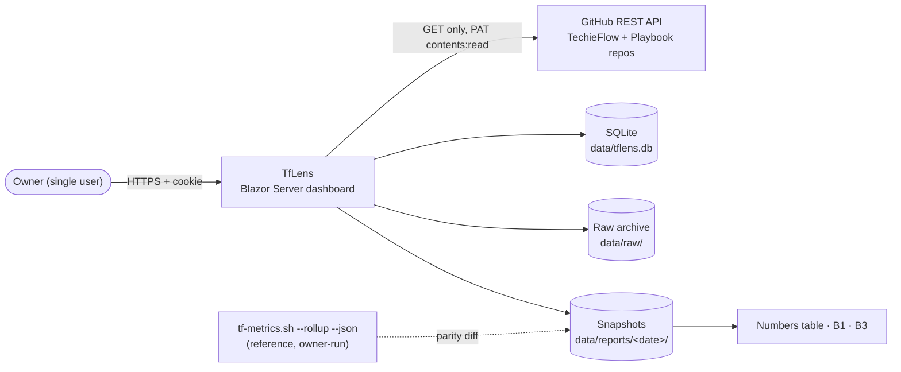
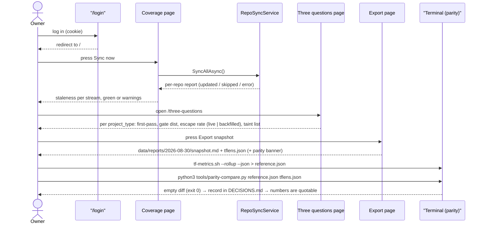
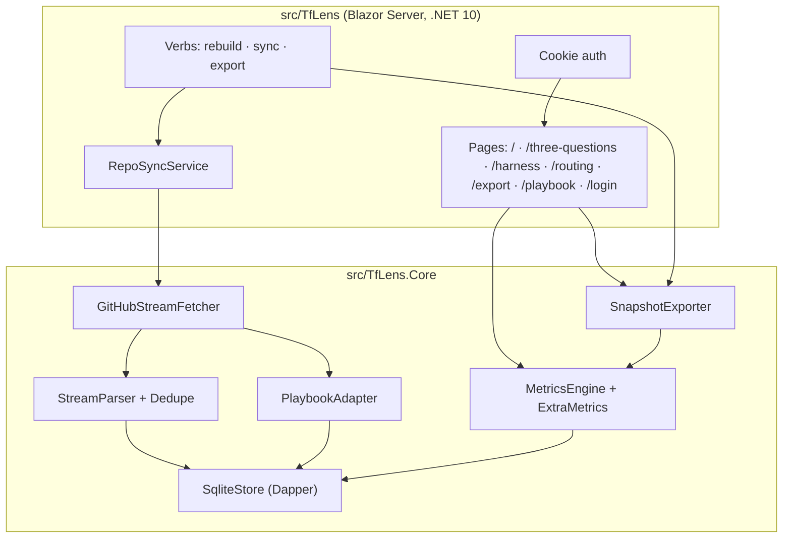
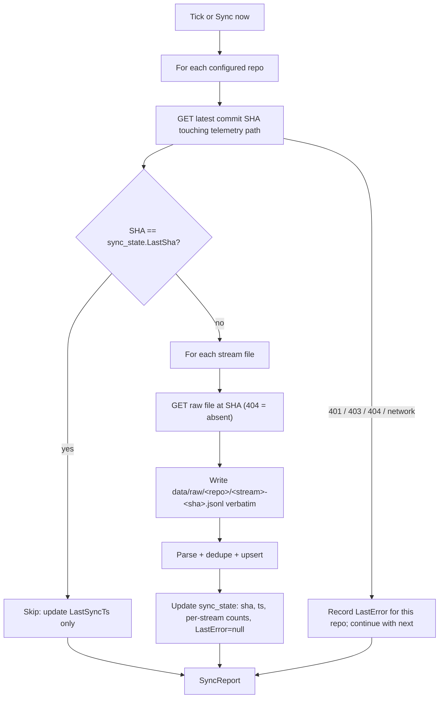
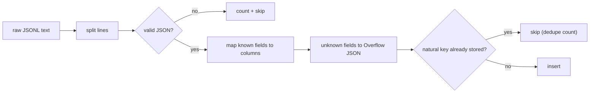
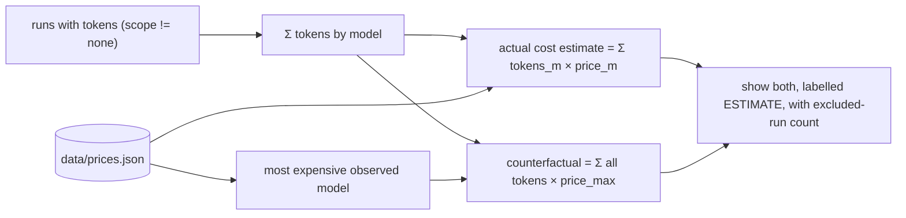
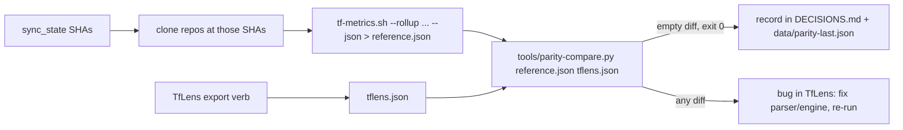

# TfLens — Business Requirements

<!-- AGENT-ONLY AUTHORING NOTES — never render as visible text.
  STABLE IDS: every requirement has a BRD-{N} ID; append-only across revisions.
  DEPTH MANDATE: human document; §9 Feature catalog is the heart; one-liners only in §10.
  MERMAID MANDATE: html-render-shell.md §5.5 — quote every label; never use `end` as a node id.
-->

## Table of Contents

1. [Executive summary](#executive-summary)
2. [Business objectives](#business-objectives)
3. [Scope](#scope)
4. [Development status](#development-status)
5. [Stakeholders / users](#stakeholders-users)
6. [Context diagram](#context-diagram)
7. [User journey — primary use case](#user-journey-primary-use-case)
8. [Component sketch](#component-sketch)
9. [Feature catalog](#feature-catalog)
   - [F-SHELL: App shell, navigation and single-user login](#f-shell-app-shell-navigation-and-single-user-login)
   - [F-CFG: Repo configuration and secrets](#f-cfg-repo-configuration-and-secrets)
   - [F-SYNC: Repo puller — background sync and Sync now](#f-sync-repo-puller-background-sync-and-sync-now)
   - [F-RAW: Raw archive and rebuild](#f-raw-raw-archive-and-rebuild)
   - [F-PARSE: Parser to SQLite with dedupe and overflow](#f-parse-parser-to-sqlite-with-dedupe-and-overflow)
   - [F-ENGINE: Metrics engine with provenance rules](#f-engine-metrics-engine-with-provenance-rules)
   - [F-COVER: Coverage / health page](#f-cover-coverage-health-page)
   - [F-3Q: The three questions page](#f-3q-the-three-questions-page)
   - [F-HARN: Harness comparison page](#f-harn-harness-comparison-page)
   - [F-ROUTE: Routing and economics page](#f-route-routing-and-economics-page)
   - [F-EXPORT: Weekly snapshot export](#f-export-weekly-snapshot-export)
   - [F-PARITY: Parity check against tf-metrics.sh](#f-parity-parity-check-against-tf-metrics-sh)
   - [F-PB: Playbook adapter and page](#f-pb-playbook-adapter-and-page)
   - [F-OPS: Container, health, docs and decisions](#f-ops-container-health-docs-and-decisions)
10. [Functional requirements (BRD ledger)](#functional-requirements-brd-ledger)
11. [Non-functional requirements](#non-functional-requirements)
12. [Constraints & assumptions](#constraints-assumptions)
13. [Parity check — the mandatory acceptance test](#parity-check-the-mandatory-acceptance-test)
14. [Definition of done](#definition-of-done)
15. [Success metrics](#success-metrics)
16. [Risks](#risks)
17. [Glossary](#glossary)

## 1. Executive summary

TfLens is a read-only lens over the development telemetry that TechieFlow and the AI-First-Playbook **already emit**. Every TechieFlow-managed repository carries four append-only JSONL streams under `docs/metrics/` (`runs`, `gates`, `sessions`, `commits`; schema v=1, defined in `.tfcore/telemetry/SCHEMA.md`). Today the only consumer of those streams is a shell script, `tf-metrics.sh --rollup`, which prints a segmented text report. TfLens pulls the streams from GitHub, stores them in SQLite, and renders the same figures — plus a few the script does not compute — as an authenticated Blazor Server dashboard, with a weekly snapshot export whose numbers can be quoted in public writing.

It builds **no capture layer, no ingestion API, and no per-machine agents**. Capture is the frameworks' job and already works across Claude Code, OpenCode, and (via `harness: null`) anything else that runs the tasks. TfLens never writes to any repository; it reads with a fine-grained, contents-only token.

The name is deliberate: "Analyst" collides with TechieFlow's analyst agent and "TfMetrics" collides with `tf-metrics.sh`. A *lens* changes nothing it looks at. The dangerous failure mode of this product is not a crash but a **plausible wrong number** — a backfilled record leaking into a live rate, a `library` record pooled into an `app` gate distribution — that gets exported, quoted, and cannot be defended. The provenance rules of SCHEMA.md §6 are therefore enforced in code with no switch to disable them, and a mandatory parity test against `tf-metrics.sh` is the acceptance gate (§13).

Plan context (from `docs/ravi-90day-positioning-plan-v2.4.2.md`): TfLens is the A-V verification vehicle — a real side project built through the full TechieFlow phase sequence, funded from side-project hours, never a plan deliverable. Its exported numbers feed the plan's Numbers table, the B1 portability story (harness comparison), and the B3 token-economics post (counterfactual repricing).

## 2. Business objectives

- Turn the existing telemetry into a dashboard the owner can open in a browser, within a 1–2 day timebox, without adding any capture surface to the frameworks.
- Produce **quotable numbers**: a weekly snapshot (markdown + JSON) that never mixes provenances and that has passed an exact parity diff against `tf-metrics.sh --rollup` on the same dataset.
- Make the telemetry's own health visible: a Coverage page that says, per repo, whether a clone has stopped pushing or lacks hooks — before any other figure is trusted.
- Render the B1 story as data (per-harness volumes, tokens, verdict mix, OpenCode-only dollars) and the B3 claim basis (tokens repriced as if every run used the most expensive observed model, labelled *estimate*).
- Serve as the A-V verification build: every TechieFlow phase runs on TfLens itself, gates enforced, so the framework's telemetry records its own dashboard being built.

## 3. Scope

**In scope**

- Pulling `docs/metrics/{runs,gates,sessions,commits}.jsonl` from a configured list of GitHub repos (private allowed) on a poll interval and on demand; raw archive; SQLite store; rebuild from raw.
- Parser with SCHEMA.md-exact columns, JSON overflow for unknown fields, and idempotent dedupe on the streams' natural keys.
- Five report pages (Coverage, Three questions, Harness comparison, Routing & economics, Snapshot export) computed at request time with the provenance rules enforced structurally.
- Weekly snapshot export to `data/reports/<date>/` as markdown + JSON.
- Parity tooling: machine-readable export in the reference's key layout, a compare script, and the DECISIONS.md record of each passing run.
- Phase 3: a separate Playbook adapter for `verification/telemetry/events.ndjson` with its own tables and a minimal page.
- Single-user cookie auth; Serilog file logging; Dockerfile; `/healthz`.

**Out of scope (explicit — recorded in the README)**

- Any capture or ingestion endpoint; OTLP; per-machine agents.
- Codex-CLI harness detection (a `tf-emit.sh` change; TfLens already reports `harness: null` honestly).
- Writing anything to any repository, ever.
- VPS / infra configuration (supplied separately).
- Multi-user accounts, roles, or public sharing of the dashboard.
- Any estimate presented as a measurement: no rate-card dollars anywhere except the explicitly labelled repricing figure.

## 4. Development status

**Snapshot as of 2026-08-26.** Live, per-requirement status: see `PROJECT-STATUS.md` and the **Requirements Status** table in `docs/TfLens-Checklist.md` (created by `*split-brd`).

| Feature (F-code) | Phase | Status | % | Notes |
|------------------|-------|--------|---|-------|
| F-SHELL: App shell, navigation and single-user login | 1 | Planned | 0 | Sidebar shell, `/login`, cookie auth, Sync-now button in header |
| F-CFG: Repo configuration and secrets | 1 | Planned | 0 | `appsettings` repo list, PascalCase env provider, PAT/secrets validation |
| F-SYNC: Repo puller — background sync and Sync now | 1 | Planned | 0 | `BackgroundService`, SHA-skip, per-repo error isolation |
| F-RAW: Raw archive and rebuild | 1 | Planned | 0 | `data/raw/<repo>/<stream>-<sha>.jsonl`; `rebuild` verb + button |
| F-PARSE: Parser to SQLite with dedupe and overflow | 1 | Planned | 0 | One table per stream + `sync_state`; natural-key dedupe |
| F-ENGINE: Metrics engine with provenance rules | 2 | Planned | 0 | Port of `tf-metrics.sh analyse()`; `Figure` type with `InsufficientData` |
| F-COVER: Coverage / health page | 2 | Planned | 0 | Landing page; staleness per stream; unknown-fields report |
| F-3Q: The three questions page | 2 | Planned | 0 | Per `project_type`, live vs backfilled columns, taint list |
| F-HARN: Harness comparison page | 2 | Planned | 0 | claude-code / opencode / null; OpenCode-only dollars |
| F-ROUTE: Routing and economics page | 2 | Planned | 0 | Drift, tokens by model, repricing from `prices.json`, poolables |
| F-EXPORT: Weekly snapshot export | 2 | Planned | 0 | Button + `export` verb → markdown + JSON |
| F-PARITY: Parity check against tf-metrics.sh | 2 | Planned | 0 | `tflens.json` layout, `tools/parity-compare.py`, DECISIONS.md stamp |
| F-PB: Playbook adapter and page | 3 | Planned | 0 | Schema-discovery first; separate tables; `phase_gate` never shares `gate` |
| F-OPS: Container, health, docs and decisions | 1 | Planned | 0 | Dockerfile, `/healthz`, README out-of-scope list, DECISIONS.md |

**Legend:** **Done** = shipped & working · **In progress** = actively being built · **Partial** = some sub-features done, others pending · **Planned** = not started. (Maps to the checklist's `Done (pre-existing)` / `In Progress` / `PARTIAL` / `Not Started`.)

## 5. Stakeholders / users

TfLens is a single-user product. The same human wears three hats, and the hats matter because they touch different screens and different guarantees.

| Role | Who | Needs | Key screens |
|------|-----|-------|-------------|
| **Owner** (dashboard user) | The framework author, logged in with the single configured account | See whether telemetry is healthy, read the three questions per project type, compare harnesses, see routing drift and the repricing estimate, press Sync now | `/`, `/three-questions`, `/harness`, `/routing` |
| **Parity operator** | The same person, at a terminal, before any number is quoted | Run `tf-metrics.sh --rollup --json` on a pinned dataset, export `tflens.json` for the same SHAs, run the compare script, record the pass in DECISIONS.md | `/export`, the `export` verb, `tools/parity-compare.py` |
| **Author** (consumer of the export) | The same person writing the weekly Numbers row, B1, B3 | A snapshot that never mixes provenances, states *estimate* where it estimates, and carries its parity stamp so it is quotable | `/export` output under `data/reports/<date>/` |
| **Ops** | The same person deploying the container | One image, one volume, env-var secrets, a health endpoint, rolling file logs | Dockerfile, `/healthz`, `logs/` |
| **Downstream frameworks** (not users) | TechieFlow, AI-First-Playbook | Nothing — TfLens never writes to them and never asks them to change | — |

Onboarding path: set `TfLensAuthUser` / `TfLensAuthPasswordHash` / `TfLensGitHubToken` and the repo list, start the container, log in at `/login`, press **Sync now**, and read the Coverage page until it is green.

## 6. Context diagram

## 7. User journey — primary use case

The weekly loop: sync, check health, read the questions, export, prove parity, quote.

## 8. Component sketch

## 9. Feature catalog

### F-SHELL: App shell, navigation and single-user login

**Personas:** Owner · **Phase:** 1

Every page lives inside one TrBlazeUI sidebar shell (`SidebarProvider` + `Sidebar` + `SidebarInset`) with a fixed header carrying the page title, a **Sync now** button with the last-sync timestamp, and the sign-out action. The sidebar lists the six pages in the order the owner should read them (Coverage first — "every other number is suspect until this page is green"). The dashboard sits entirely behind cookie authentication: one account, credentials from configuration, a PBKDF2 hash rather than a plaintext password, generic failure messages, and a sliding 12-hour cookie. There is no registration, no password reset, no roles.

| Screen | Route | Description |
|--------|-------|-------------|
| Login | `/login` | Username + password form; the only anonymous page besides `/healthz` |
| Shell | (layout) | Sidebar nav (Coverage, Three questions, Harness, Routing & economics, Snapshot export, Playbook), header with Sync now + last sync + sign out |

**Workflow:**
1. Unauthenticated request to any page → redirect to `/login` with return URL.
2. Submit credentials → constant-time verify against the configured PBKDF2 hash → cookie issued → redirect to return URL or `/`.
3. Sign out → cookie cleared → `/login`.
4. **Sync now** in the header runs the same `SyncAllAsync()` the background service runs and shows a toast with the per-repo outcome.

**Requirements:** BRD-1, BRD-2, BRD-3, BRD-4, BRD-5, BRD-6

### F-CFG: Repo configuration and secrets

**Personas:** Ops, Owner · **Phase:** 1

Configuration is the only input TfLens has besides the streams themselves. The repo list lives in `appsettings.json` (and can be overridden by environment): `owner`, `name`, `branch`, `kind` (`techieflow` | `playbook`), plus a global poll interval. Secrets — the GitHub PAT and the auth credentials — come **only** from environment or user-secrets through the PascalCase env-var provider mandated by the Coding Standards (`TfLensGitHubToken`, `TfLensAuthUser`, `TfLensAuthPasswordHash`). Startup validates the configuration and refuses to run with a missing token, a duplicate `owner/name`, or an unknown `kind`, logging the reason without logging the value.

Initial placeholder repo list (kickoff decision 2026-08-26 — owner corrects names in `appsettings.json`):

| owner | name | branch | kind |
|-------|------|--------|------|
| techierathore | TechieFlow | main | techieflow |
| techierathore | TechieRag | main | techieflow |
| techierathore | TrBlazeUI | main | techieflow |
| techierathore | blog | main | techieflow |
| techierathore | AI-First-Playbook | main | playbook |

**Workflow:**
1. Read `Repos[]`, `PollIntervalMinutes` (default 15), `DataRoot` (default `data/`) from configuration.
2. Read secrets from the env provider; never from `appsettings.json`.
3. Validate; on failure log a redacted reason and stop the host (`Log.Fatal`).

**Requirements:** BRD-7, BRD-8, BRD-9, BRD-10, BRD-11

### F-SYNC: Repo puller — background sync and Sync now

**Personas:** Owner (Sync now), Ops (background) · **Phase:** 1

A `BackgroundService` polls every configured repo on the interval; the header button runs the identical code on demand. For each repo it asks GitHub for the latest commit SHA touching the telemetry path (`docs/metrics` for `techieflow`, `verification/telemetry` for `playbook`) on the configured branch. If that SHA equals the one in `sync_state`, the repo is skipped without fetching a byte. Otherwise every stream file is fetched whole at that exact SHA (they are small), written verbatim to the raw archive (F-RAW), and parsed (F-PARSE). A 404 on a stream file means "this stream is absent" and is recorded as zero, not as an error. Errors are per repo: one failing repo never stops the others, and the failure text (status code + short reason, never the token) lands in `sync_state.LastError` for the Coverage page. The puller is structurally read-only — no method exists that issues anything but GET.

**Workflow:**
1. Timer tick (every `PollIntervalMinutes`) or button press.
2. Per repo: SHA lookup → skip or fetch → archive → parse → `sync_state`.
3. Return a `SyncReport` (per repo: `Updated(sha, counts)` / `Skipped` / `Error(reason)`); the UI shows it as a toast and the Coverage page reflects it.
4. Invalidate the cached analysis so pages recompute.

**Requirements:** BRD-12, BRD-13, BRD-14, BRD-15, BRD-16, BRD-17, BRD-18

### F-RAW: Raw archive and rebuild

**Personas:** Ops, Parity operator · **Phase:** 1

The raw archive is the rebuild source and the audit trail. Every fetched file is stored byte-for-byte under `data/raw/<owner>__<name>/<stream>-<sha>.jsonl` **before** it is parsed, so a parser bug can never lose data — fix the parser, run `rebuild`, done. `rebuild` (a command verb `dotnet TfLens.dll rebuild`, also a confirm-guarded button on the Coverage page) drops the SQLite database, recreates the schema, and replays every archived file in repo order and SHA fetch order, then reports files replayed, records stored, and duplicates collapsed per stream. Because parsing is idempotent (F-PARSE), the record counts after a rebuild equal the counts after live syncs.

**Workflow:**
1. `rebuild` requested (verb or button with an "are you sure" dialog).
2. Drop all tables → create DDL → enumerate `data/raw/**/*.jsonl`.
3. Replay in order → recompute `sync_state` counts from the newest SHA per repo.
4. Report; invalidate caches.

**Requirements:** BRD-19, BRD-20, BRD-21, BRD-22

### F-PARSE: Parser to SQLite with dedupe and overflow

**Personas:** Ops, Parity operator · **Phase:** 1

One table per stream (`Run`, `Gate`, `Session`, `Commit`) plus `SyncState`. Column names follow SCHEMA.md field names exactly (PascalCase form; the mapping table is in the parser and in Architecture §6). A line that is not valid JSON is counted and skipped, exactly as the reference does. Any property the parser does not know for that stream — and any record with `v > 1` — keeps its unknown properties in a JSON `Overflow` column rather than being dropped; the set of unknown field names seen per repo is reported on the Coverage page ("fields observed that SCHEMA.md doesn't document"). Fields that SCHEMA.md says are "present only when true" or "absent means not captured" are stored as `NULL` when absent, never as `0`/`false`, so downstream can tell "not captured" from "zero".

Dedupe is idempotent on the natural identity of each stream, so re-parsing the same raw file or replaying it during rebuild never double-counts:

| Stream | Identity | Rule |
|--------|----------|------|
| `commits` | `sha` **per repo** | keep first; count collapsed duplicates (expected after union merges — two repos may legitimately share a short sha, hence per repo) |
| `sessions` | `session_id` | OpenCode records are cumulative snapshots: keep the record with the highest `output_tokens`, tie → latest `ts` |
| `runs` | `ts` + `app` + `cmd` | keep first |
| `gates` | `ts` + `app` + `req_id` + `run_id` | keep first |

Provenance fields are preserved verbatim and typed: `backfilled`, `inferred`, `project_type`, `project_type_inferred`, `harness`. They are what Phase 2 segments on.

**Workflow:**
1. Receive `(repo, stream, sha, text)`.
2. Parse line by line; map; overflow; dedupe against the unique index; insert in one transaction.
3. Return `(inserted, duplicates, invalidLines, unknownFields[])`.

**Requirements:** BRD-23, BRD-24, BRD-25, BRD-26, BRD-27, BRD-28, BRD-29

### F-ENGINE: Metrics engine with provenance rules

**Personas:** Owner (indirectly — every page), Parity operator · **Phase:** 2

The engine is a field-for-field port of `analyse()` in `.tfcore/telemetry/tf-metrics.sh`, the trusted reference. All figures are computed at request time from the stream tables; nothing derived is ever written back into a stream table. The SCHEMA.md §6 provenance rules are enforced by the shape of the result, not by a flag:

- **Live and backfilled never pool.** The result has `Live[projectType]` and `Backfilled[projectType]`; there is no `Total`.
- **First-pass rate, gate catch distribution and escape rate never pool across `project_type`.** Records with `project_type_inferred: true` are segmented as **unclassified**, never silently as `app`.
- **Taint exclusion.** Any `req_id` with even one backfilled record is excluded from the live first-pass rate (its live `attempt` restarts at 1); the excluded IDs are returned as a list for display.
- **Minimum n.** Any metric with fewer than 3 supporting records is `InsufficientData(n)`, a distinct case of the `Figure` type that a page can only render as text.
- **Dollars never pool across harness.** `Pooled.CostUsd` is always `null` (the reference's contract); real dollars appear only in the harness page for `opencode`.
- **Late-added gates** (`perf`, 2026-08-10) report `ran` (records whose `gates_run` contains the gate) and `caught` side by side; their share of the raw distribution is never presented as a catch rate.
- Poolable metrics (rework ratio, batch size median, REQ throughput median in REQs/hour, tokens total, tokens per Verified REQ, commit cadence, duplicates collapsed) follow SCHEMA.md §8 and the reference's rounding (`%.0f%%`, 2 dp throughput, 1 dp tokens per Verified).

A unit test feeds the checked-in fixture streams to the engine and asserts equality with a `reference.json` produced by the script on the same fixtures — the parity test in miniature, run on every build.

**Workflow:**
1. `Analyse(repos, options)` reads streams per repo, dedupes commits per repo.
2. Segments gates: live vs backfilled → by project type (unclassified for inferred).
3. Computes taint set → per-segment figures → late-gate coverage → pooled block.
4. Returns `AnalysisResult` (same key layout as `--rollup --json`) — memoised until the next sync/rebuild.

**Requirements:** BRD-30, BRD-31, BRD-32, BRD-33, BRD-34, BRD-35, BRD-36, BRD-37, BRD-38

### F-COVER: Coverage / health page

**Personas:** Owner · **Phase:** 2

The first page, always. Per repo it shows: kind, last sync time and outcome, last commit SHA (short, linked to GitHub), record counts per stream, live-vs-backfilled gate counts, and **days since the newest record per stream**. A repo whose newest `sessions` or `commits` record is stale (older than a configurable threshold, default 7 days) is flagged in words — "this clone isn't pushing or lacks hooks; run `update-framework.sh` on it" — because the hook lives in `.git/`, which never clones, and this is the one telemetry gap the owner cannot see by reading the files. The page also lists, per repo, any fields observed that SCHEMA.md does not document (from the overflow report) and any records with `v > 1`, and hosts the guarded **Rebuild from raw** button. A single summary badge at the top says **GREEN** (all repos synced, nothing stale, no errors) or **CHECK** with the count of warnings. Every other number on the site is suspect until this page is green.

| Screen | Route | Description |
|--------|-------|-------------|
| Coverage / health | `/` | Summary badge; per-repo cards or grid; staleness; unknown fields; Rebuild button |

**Workflow:**
1. Read `sync_state` + per-stream `MAX(ts)` per repo + counts + overflow field names.
2. Compute staleness per stream vs today; apply thresholds; compose warnings.
3. Render; Sync now / Rebuild refresh in place.

**Requirements:** BRD-39, BRD-40, BRD-41, BRD-42, BRD-43, BRD-44

### F-3Q: The three questions page

**Personas:** Owner, Author · **Phase:** 2

The headline page and the B3 evidence base. For each `project_type` present in the data (`app`, `library`, `docs`, `framework`, and `unclassified` for inferred records) it shows the three questions SCHEMA.md §0 exists to answer — **first-pass rate**, **gate catch distribution** (with `escaped` as its own row, never folded into a gate, and `unattributed` where a failure carries no gate), and **escape rate** — computed from **live records only**, with the backfilled figures for the same type in an adjacent, clearly labelled column that is never summed with live. Under each type: records, REQs scored, REQs excluded by backfill taint, and the late-gate coverage lines (`perf gate: ran on n records, caught k → rate | insufficient data (n=…) | not yet run on this data (gate added 2026-08-10)`). The tainted REQ IDs are listed in full in a collapsible panel. Any figure below the minimum n renders as `insufficient data (n=…)`. There is no "all types" tab and no total row — by design.

| Screen | Route | Description |
|--------|-------|-------------|
| Three questions | `/three-questions` | One section (or tab) per project_type; live column + labelled backfilled column; taint list; late-gate coverage |

**Workflow:**
1. `Analyse()` → iterate `Live` and `Backfilled` keyed by type.
2. Render first-pass, escape rate, distribution table (rows in the reference's `GATE_ORDER`), late-gate coverage.
3. Render the taint list and the standing note: "figures are deliberately not combined across project_type or provenance (SCHEMA.md §6)".

**Requirements:** BRD-45, BRD-46, BRD-47, BRD-48, BRD-49, BRD-50

### F-HARN: Harness comparison page

**Personas:** Owner, Author · **Phase:** 2

The portability page — the B1 story rendered as data. Per harness (`claude-code`, `opencode`, `null`; `codex` appears automatically when the streams start carrying it): run counts by command, gate records and verdict mix, session counts, token totals (input, output, cache read, cache write, from both `runs` §2.5 fields and `sessions`), tokens per verified REQ. **Real `cost_usd` is shown for OpenCode only**, in its own card labelled "the only measured dollars in the system"; Claude Code shows "not measured (null by design)". Tokens may be compared across harness; dollars may not, and the page never shows a dollar total across harnesses. `harness: null` is shown honestly as its own column ("harness not detected"), never merged into either named harness. This page has no reference in `tf-metrics.sh`, so it is spot-checked by hand once (F-PARITY).

| Screen | Route | Description |
|--------|-------|-------------|
| Harness comparison | `/harness` | Side-by-side columns per harness; tokens chart; OpenCode-only cost card |

**Workflow:**
1. Group `runs`, `gates`, `sessions` by `harness` (null kept as its own group).
2. Compute volumes, verdict mix, token totals, tokens per Verified; dollars for `opencode` only.
3. Render columns + one bar chart (tokens by harness).

**Requirements:** BRD-51, BRD-52, BRD-53, BRD-54, BRD-55

### F-ROUTE: Routing and economics page

**Personas:** Owner, Author · **Phase:** 2

Three panels. **Routing drift** uses the §2.5 per-run fields: count and list of `routed: false` runs, declared `tier`/`tier_model` versus observed `model` (and `models` when more than one), by command. **Tokens by model** sums run tokens per observed model. **Counterfactual repricing** is the B3 claim basis: total tokens (input, output, cache read, cache write) repriced as if every run had used the most expensive model observed in the data, versus the actual mix, using an editable `data/prices.json` rate card (per model: input/output/cache-read/cache-write USD per million tokens). The figure is labelled **estimate — tokens × rate card, not measured spend** in the UI and in the export; runs with `tokens_scope: none` (no tokens captured) are counted and excluded, and stated. The page also carries the poolable metrics per SCHEMA.md §8 — rework ratio, REQ throughput, batch size, commit cadence — straight from the engine. A small editor (dialog) lets the owner edit `prices.json` in place with validation; the file is the source, the dialog is a convenience.

| Screen | Route | Description |
|--------|-------|-------------|
| Routing & economics | `/routing` | Drift table; tokens-by-model chart; repricing cards (estimate); poolable metrics; prices editor dialog |

**Workflow:**
1. Drift: filter runs with `tier_model` and `model`; group by `cmd`; list `routed:false`.
2. Tokens by model: sum §2.5 token fields by `model`.
3. Repricing: load `prices.json`; compute actual-mix and all-at-max; label estimate; show excluded runs.
4. Poolables: from `AnalysisResult.Pooled`.

**Requirements:** BRD-56, BRD-57, BRD-58, BRD-59, BRD-60, BRD-61, BRD-62

### F-EXPORT: Weekly snapshot export

**Personas:** Author, Parity operator · **Phase:** 2

A button on `/export` and a command verb (`dotnet TfLens.dll export [--date yyyy-MM-dd]`) write two files to `data/reports/<date>/`: `snapshot.md` (human-readable, sectioned exactly like the pages, provenance never mixed in one figure, every estimate labelled) and `tflens.json` (machine-readable; the same key layout as `tf-metrics.sh --rollup --json` — `per_repo`, `tainted_reqs`, `live`, `backfilled`, `pooled` — plus an `extras` object for harness, routing and repricing, and a `parity` object carrying the last recorded parity run). The page lists previous snapshots with download links and shows a **quotable / not quotable** banner: quotable only if the last parity run on record postdates the last parser change (the build stamps a parser version; the parity record stores the version it validated).

| Screen | Route | Description |
|--------|-------|-------------|
| Snapshot export | `/export` | Export button; list of past snapshots; quotable banner; parity status |

**Workflow:**
1. Press Export (or run the verb) → `Analyse()` + extras → write markdown + JSON → refresh list.
2. Banner reads `data/parity-last.json` (written by the parity procedure) and compares parser version.

**Requirements:** BRD-63, BRD-64, BRD-65, BRD-66, BRD-67

### F-PARITY: Parity check against tf-metrics.sh

**Personas:** Parity operator · **Phase:** 2

Two independent implementations now compute the same metrics from the same files: `tf-metrics.sh` (trusted; the §6 rules live in its code) and TfLens (new, unproven). Correct implementations must agree exactly; any disagreement is by definition a bug in TfLens, and the script is never changed to match the app. TfLens ships the tooling that makes the check cheap: the `tflens.json` export in the reference's key layout, a `tools/parity-compare.py` script that compares key-by-key (not a text diff — key order and formatting may differ) and exits non-zero on any mismatch, the `sync_state` SHAs so the same dataset can be checked out for the script, and a `data/parity-last.json` + DECISIONS.md entry that records each passing run (date, dataset SHAs, script hash, compare output). The full procedure and the zero-tolerance rule are in §13; the metrics the script does not compute (harness, routing, repricing) have no oracle and are spot-checked by hand against raw JSONL once, recorded the same way.

**Workflow:** see §13 (mandatory acceptance test).

**Requirements:** BRD-68, BRD-69, BRD-70, BRD-71, BRD-72

### F-PB: Playbook adapter and page

**Personas:** Owner · **Phase:** 3

Playbook-managed repos emit `verification/telemetry/events.ndjson` (phase-start / turn / phase-end events, with `parentID` linking sub-agent sessions to a main session) — a different shape from schema v1, so it gets a **separate adapter, separate tables, and a separate page**. Playbook process-gates (`phase_gate`) and TechieFlow assertion-gates (`gate`) are different axes (SCHEMA.md §11) and must never share a column or a chart. No sample of the file exists at day-1 (kickoff answer), so the adapter is built schema-discovery-first: task one parses the real file and records the observed field names in DECISIONS.md; only then are the `PbEvent` columns fixed and the minimal page built — phase token/cost totals and a main-vs-subagent split via `parentID`. When the Playbook converges on schema v1 this adapter shrinks; it is deliberately minimal.

| Screen | Route | Description |
|--------|-------|-------------|
| Playbook | `/playbook` | Per-repo phase totals (tokens, cost if present), main vs subagent split; "no Playbook data yet" empty state |

**Workflow:**
1. Sync fetches `events.ndjson` (and the joiner output if committed) for `kind: playbook` repos, archives raw, parses into `PbEvent` with overflow.
2. Page groups by phase and by `parentID` presence.

**Requirements:** BRD-73, BRD-74, BRD-75, BRD-76

### F-OPS: Container, health, docs and decisions

**Personas:** Ops · **Phase:** 1

A multi-stage Dockerfile produces one image; `data/` and `logs/` are volumes; secrets arrive as environment variables. `/healthz` (anonymous) reports database reachability and the age of the last successful sync, nothing else. The README states the out-of-scope list verbatim (§3) and the run/rebuild/export commands. `DECISIONS.md` is created at day-1 build time and records: the storage choice (Dapper + SQLite), the dedupe keys, the parser version scheme, anything cut for the timebox, and every parity run.

**Workflow:**
1. `docker build` → image; `docker run -v data -v logs -e TfLensGitHubToken=…` → container.
2. `docker exec <c> dotnet TfLens.dll rebuild|sync|export` for operations.

**Requirements:** BRD-77, BRD-78, BRD-79, BRD-80, BRD-81

## 10. Functional requirements (BRD ledger)

- **BRD-1** — Owner can sign in at `/login` with the single configured username and password and is redirected to the requested page. *(F-SHELL)*
- **BRD-2** — System shall place every page except `/login` and `/healthz` behind cookie authentication (sliding 12 h, HttpOnly, Secure). *(F-SHELL)*
- **BRD-3** — System shall verify the password against a PBKDF2 hash from configuration using a constant-time comparison and show a generic error on failure. *(F-SHELL)*
- **BRD-4** — Owner can sign out from the header. *(F-SHELL)*
- **BRD-5** — Owner can navigate between Coverage, Three questions, Harness, Routing & economics, Snapshot export and Playbook via a TrBlazeUI sidebar, in that order. *(F-SHELL)*
- **BRD-6** — Owner can press **Sync now** in the header and see the last-sync timestamp and a per-repo outcome toast. *(F-SHELL)*
- **BRD-7** — Ops can configure the repo list `{owner, name, branch, kind: techieflow|playbook}` and the poll interval in `appsettings.json` / environment. *(F-CFG)*
- **BRD-8** — System shall read the GitHub PAT and the auth credentials only from environment / user-secrets via the PascalCase env-var provider (`TfLensGitHubToken`, `TfLensAuthUser`, `TfLensAuthPasswordHash`), never from files in the repo. *(F-CFG)*
- **BRD-9** — System shall refuse to start when the token or credentials are missing, a repo is duplicated, or a `kind` is unknown, logging a redacted reason. *(F-CFG)*
- **BRD-10** — System shall never log, display, or export the PAT or the password hash. *(F-CFG)*
- **BRD-11** — Ops can override `DataRoot` (default `data/`) for the database, raw archive, reports and `prices.json`. *(F-CFG)*
- **BRD-12** — System shall poll every configured repo on the configured interval via a `BackgroundService`. *(F-SYNC)*
- **BRD-13** — System shall, per repo, read the latest commit SHA touching the telemetry path on the configured branch and skip the repo when it equals the stored SHA. *(F-SYNC)*
- **BRD-14** — System shall fetch each stream file whole at that exact SHA and treat a 404 as "stream absent" (zero records), not an error. *(F-SYNC)*
- **BRD-15** — System shall isolate errors per repo (401/403/404/network), record a redacted reason in `sync_state.LastError`, and continue with the remaining repos. *(F-SYNC)*
- **BRD-16** — System shall be structurally read-only against GitHub: only GET requests, contents-read scope, no code path that writes to any repository. *(F-SYNC)*
- **BRD-17** — System shall update `sync_state` (last SHA, last sync ts, per-stream record counts, last error) after each repo sync. *(F-SYNC)*
- **BRD-18** — System shall invalidate cached analysis results after every completed sync or rebuild. *(F-SYNC)*
- **BRD-19** — System shall store every fetched stream file verbatim under `data/raw/<owner>__<name>/<stream>-<sha>.jsonl` before parsing it. *(F-RAW)*
- **BRD-20** — Ops can run `rebuild` (command verb) to drop the SQLite database and reparse every archived raw file. *(F-RAW)*
- **BRD-21** — Owner can trigger the same rebuild from the Coverage page behind a confirmation dialog. *(F-RAW)*
- **BRD-22** — System shall report, after a rebuild, files replayed, records stored and duplicates collapsed per stream, and produce the same counts as live syncing did. *(F-RAW)*
- **BRD-23** — System shall store each stream in its own table (`Run`, `Gate`, `Session`, `Commit`) plus `SyncState`, with columns named exactly after SCHEMA.md fields. *(F-PARSE)*
- **BRD-24** — System shall keep unknown properties (and all properties of records with `v > 1`) in a JSON `Overflow` column instead of dropping them. *(F-PARSE)*
- **BRD-25** — System shall count and skip lines that are not valid JSON, as the reference does. *(F-PARSE)*
- **BRD-26** — System shall dedupe `commits` on `sha` per repo, keeping the first and counting the collapsed duplicates. *(F-PARSE)*
- **BRD-27** — System shall keep, per `session_id`, only the session record with the highest `output_tokens` (tie: latest `ts`). *(F-PARSE)*
- **BRD-28** — System shall dedupe `runs` on `ts+app+cmd` and `gates` on `ts+app+req_id+run_id` so re-parsing never double-counts. *(F-PARSE)*
- **BRD-29** — System shall preserve `backfilled`, `inferred`, `project_type`, `project_type_inferred`, `harness`, `tokens_scope` and every §2.5 optional field verbatim, storing absent optionals as `NULL` never `0`. *(F-PARSE)*
- **BRD-30** — System shall compute every figure at request time from the stream tables and never write a derived value into a stream table. *(F-ENGINE)*
- **BRD-31** — System shall never pool live and backfilled records for first-pass rate, gate catch distribution or escape rate; backfilled figures appear only in an adjacent labelled column, with no total row and no disabling flag. *(F-ENGINE)*
- **BRD-32** — System shall never pool first-pass rate, gate catch distribution or escape rate across `project_type`, and shall report `project_type_inferred` records as **unclassified**. *(F-ENGINE)*
- **BRD-33** — System shall exclude any REQ with at least one backfilled record from the live first-pass rate and expose the excluded REQ ID list. *(F-ENGINE)*
- **BRD-34** — System shall render any metric with fewer than 3 supporting records as `insufficient data (n=…)`, never as a number, via a `Figure` type that cannot carry a value in that case. *(F-ENGINE)*
- **BRD-35** — System shall never pool `cost_usd` across harness; `Pooled.CostUsd` is always null. *(F-ENGINE)*
- **BRD-36** — System shall report late-added gates (`perf`, since 2026-08-10) as `ran` (records whose `gates_run` contains the gate) beside `caught`, and never present their share of the raw distribution as a catch rate. *(F-ENGINE)*
- **BRD-37** — System shall compute the poolable metrics (rework ratio, batch size median, REQ throughput median in REQs/hour, tokens total, tokens per Verified REQ, commit cadence, duplicates collapsed) with the reference's formulas and rounding. *(F-ENGINE)*
- **BRD-38** — System shall include a unit test that asserts the engine's output on checked-in fixture streams equals a checked-in `reference.json` produced by `tf-metrics.sh` on the same fixtures. *(F-ENGINE)*
- **BRD-39** — Owner can see, per repo, last sync time and outcome, last commit SHA, record counts per stream and live-vs-backfilled gate counts on the Coverage page at `/`. *(F-COVER)*
- **BRD-40** — Owner can see days since the newest record per stream per repo. *(F-COVER)*
- **BRD-41** — System shall flag on screen, in words, any repo whose newest `sessions` or `commits` record is older than the staleness threshold (default 7 days), stating that the clone is not pushing or lacks hooks. *(F-COVER)*
- **BRD-42** — Owner can see per repo the field names observed that SCHEMA.md does not document, and any records with `v > 1`. *(F-COVER)*
- **BRD-43** — System shall show a single GREEN / CHECK summary badge with the warning count at the top of the Coverage page. *(F-COVER)*
- **BRD-44** — System shall show the Coverage page as the landing page after login. *(F-COVER)*
- **BRD-45** — Owner can see, per `project_type` (including `unclassified`), the live first-pass rate, gate catch distribution and escape rate at `/three-questions`. *(F-3Q)*
- **BRD-46** — System shall show backfilled figures for the same `project_type` in an adjacent column labelled backfilled, never summed with live. *(F-3Q)*
- **BRD-47** — System shall present `escaped` as its own row in the gate catch distribution and `unattributed` for failures without a gate, in the reference's gate order. *(F-3Q)*
- **BRD-48** — Owner can see the full list of REQ IDs excluded by backfill taint. *(F-3Q)*
- **BRD-49** — Owner can see the late-gate coverage line per gate (`ran`, `caught`, rate or insufficient data, or "not yet run on this data (gate added …)"). *(F-3Q)*
- **BRD-50** — System shall show no "all types" view and no total row on the three-questions page, and shall display the SCHEMA.md §6 note explaining why. *(F-3Q)*
- **BRD-51** — Owner can see per harness (`claude-code`, `opencode`, `null`, and any new value) run counts by command, gate verdict mix, session counts, and token totals at `/harness`. *(F-HARN)*
- **BRD-52** — Owner can see tokens per verified REQ per harness. *(F-HARN)*
- **BRD-53** — System shall show real `cost_usd` for `opencode` only, labelled as the only measured dollars in the system, and "not measured (null by design)" for Claude Code. *(F-HARN)*
- **BRD-54** — System shall never show a dollar total across harnesses. *(F-HARN)*
- **BRD-55** — System shall present `harness: null` as its own "not detected" column, never merged into a named harness. *(F-HARN)*
- **BRD-56** — Owner can see routing drift at `/routing`: `routed:false` run count and list, and declared `tier`/`tier_model` versus observed `model`/`models`, by command. *(F-ROUTE)*
- **BRD-57** — Owner can see tokens by observed model (input, output, cache read, cache write). *(F-ROUTE)*
- **BRD-58** — Owner can see the counterfactual repricing figure: all tokens repriced at the most expensive observed model versus the actual mix, from `data/prices.json`. *(F-ROUTE)*
- **BRD-59** — System shall label the repricing figure **estimate — tokens × rate card, not measured spend** everywhere it appears, including the export. *(F-ROUTE)*
- **BRD-60** — System shall exclude runs with `tokens_scope: none` (or no token fields) from repricing and state how many were excluded. *(F-ROUTE)*
- **BRD-61** — Owner can edit `prices.json` (per model: input/output/cache-read/cache-write USD per million tokens) through a validated dialog; the file remains the source of truth. *(F-ROUTE)*
- **BRD-62** — Owner can see the poolable metrics (rework ratio, REQ throughput, batch size, commit cadence) on the routing page. *(F-ROUTE)*
- **BRD-63** — Owner can press Export on `/export` to write `data/reports/<date>/snapshot.md` and `tflens.json`. *(F-EXPORT)*
- **BRD-64** — Ops can run the `export` verb (`dotnet TfLens.dll export [--date]`) to produce the same files headlessly. *(F-EXPORT)*
- **BRD-65** — System shall lay out `tflens.json` with the same keys as `tf-metrics.sh --rollup --json` (`per_repo`, `tainted_reqs`, `live`, `backfilled`, `pooled`) plus `extras` and `parity` objects. *(F-EXPORT)*
- **BRD-66** — System shall never mix provenances in one figure in the snapshot and shall label every estimate in both files. *(F-EXPORT)*
- **BRD-67** — Owner can see past snapshots with download links and a quotable / not-quotable banner based on whether the last parity run postdates the last parser change. *(F-EXPORT)*
- **BRD-68** — System shall stamp a parser version into the build and into every export. *(F-PARITY)*
- **BRD-69** — Parity operator can run `tools/parity-compare.py reference.json tflens.json` and get a key-by-key diff (record counts per stream and backfilled counts, duplicates collapsed, tainted-REQ set, per-type live and backfilled figures, late-gate coverage, every poolable, every insufficient-data marker with its n) with non-zero exit on any mismatch. *(F-PARITY)*
- **BRD-70** — Parity operator can read the dataset SHAs for the last sync from the export and the Coverage page to pin the reference dataset. *(F-PARITY)*
- **BRD-71** — System shall record each passing parity run in `data/parity-last.json` (date, dataset SHAs, script hash, parser version, compare output) and the operator records it in DECISIONS.md. *(F-PARITY)*
- **BRD-72** — Parity operator shall spot-check the metrics without a reference (harness, routing, repricing) by hand against raw JSONL once and record it in DECISIONS.md. *(F-PARITY)*
- **BRD-73** — System shall fetch `verification/telemetry/events.ndjson` (and the joiner output if committed) for `kind: playbook` repos, archive raw, and parse into separate `PbEvent` tables with overflow. *(F-PB)*
- **BRD-74** — System shall keep Playbook `phase_gate` data in separate tables and charts from TechieFlow `gate` data — never a shared column or chart. *(F-PB)*
- **BRD-75** — Owner can see per Playbook repo the phase token/cost totals and the main-vs-subagent split via `parentID` at `/playbook`. *(F-PB)*
- **BRD-76** — System shall record the observed `events.ndjson` field names in DECISIONS.md before the adapter's columns are fixed (schema-discovery first). *(F-PB)*
- **BRD-77** — Ops can build one Docker image (multi-stage, .NET 10) and run it with `data/` and `logs/` volumes and env-var secrets. *(F-OPS)*
- **BRD-78** — Ops can call `/healthz` anonymously and get DB reachability plus last-successful-sync age, nothing else. *(F-OPS)*
- **BRD-79** — System shall ship a README that states the out-of-scope list verbatim and the run / rebuild / sync / export commands. *(F-OPS)*
- **BRD-80** — System shall ship `DECISIONS.md` recording the storage choice, dedupe keys, parser version scheme, timebox cuts, and every parity run. *(F-OPS)*
- **BRD-81** — Ops can run `sync` as a command verb for a one-off headless sync. *(F-OPS)*

## 11. Non-functional requirements

- **BRD-82** — Performance: report pages render from the memoised analysis within a second for the expected data volume (tens of thousands of records across ≤10 repos); a full sync of 5 repos completes in under 30 s on a normal connection. Targets:

  | Metric | Target | Notes |
  |--------|--------|-------|
  | Page render (cached analysis) | p95 load ≤ 1500 ms | single user |
  | Cold analysis (after sync) | ≤ 3 s for 50k records | computed once per sync |
  | Sync, 5 repos, unchanged | ≤ 5 s | SHA lookup only |
  | Rebuild, 5 repos × 20 SHAs | ≤ 60 s | replay from raw |

  perf-budget: p95 load <= 1500ms @ concurrency 1

- **BRD-83** — Security: cookie auth on every page (HttpOnly, Secure, SameSite=Lax); antiforgery on forms; secrets only via environment; PAT is fine-grained contents-read; no inbound API; HTTPS terminated by the VPS proxy (out of scope) — the app sets `ForwardedHeaders` accordingly.
- **BRD-84** — Privacy: TfLens displays and stores only what the streams carry (IDs, counts, durations, verdicts, short SHAs); no requirement text, no commit subjects, nothing from `src/`; the `Overflow` column is never rendered, only its field names.
- **BRD-85** — Accessibility: TrBlazeUI components with semantic markup; every figure has a text equivalent (charts are supplementary); `insufficient data` and `estimate` labels are text, not colour alone; keyboard-reachable Sync / Export / Rebuild.
- **BRD-86** — Observability: Serilog file-based logging in the single executable head — rolling file sink under `logs/` (`logs/tflens-.log`, daily, 14 files retained) plus console, wired at startup before the host builds, unhandled exceptions logged at the boundary, `Log.CloseAndFlush()` on exit (see Coding Standards §Logging). Sync outcomes logged per repo with counts and SHAs only.
- **BRD-87** — Reliability: a failing repo never fails a sync; a failing sync never affects served pages (last good analysis stays); the database can be rebuilt from `data/raw/` at any time with identical counts.
- **BRD-88** — Testability: the engine and parser are in `TfLens.Core` with no web dependency; fixture JSONL under `tests/`; Blazor screens use stable `data-testid` ids for Playwright.
- **BRD-89** — Integrity: the provenance rules (BRD-31..36) have no configuration switch, no query parameter and no UI toggle that relaxes them.

## 12. Constraints & assumptions

- Blazor Server on the current LTS .NET (10); SQLite; Dapper (owner decision 2026-08-26); TrBlazeUI where it fits (dogfood). Docker on a VPS — infra config supplied separately.
- Timebox 1–2 days; phase order is hard (1 → 2 → 3). Anything cut for time is recorded in DECISIONS.md.
- Schema v=1 as documented in `.tfcore/telemetry/SCHEMA.md` at 2026-08-26; `tf-metrics.sh` at the same date is the reference. A reference change invalidates the last parity stamp (the script hash is recorded).
- The placeholder repo list (§F-CFG) is corrected by the owner before first sync.
- No Playbook `events.ndjson` sample exists at day-1; Phase 3 starts with schema discovery.
- A0′ ("logging live, three runs") is satisfied by the frameworks' existing emission, not by TfLens; the only machine-side task is running `update-framework.sh` on each clone so the per-clone hooks exist. TfLens can trail A0′ without blocking it.
- Single user; no horizontal scaling; the memoised analysis lives in process memory.

## 13. Parity check — the mandatory acceptance test

**Principle:** two independent implementations compute the same metrics from the same files — `tf-metrics.sh` (existing, trusted; SCHEMA.md §6 enforced in its code) and TfLens (new, unproven). Correct implementations must agree exactly. Any disagreement is, by definition, a bug in TfLens. The script is never "fixed" to match the app.

**Why this test exists:** the dangerous failure mode is not a crash — it is a *plausible wrong number*. A pooling bug produces a figure that looks normal, gets exported, and ends up quoted publicly in B3. Once published it cannot be defended. The parity diff is the only cheap way to catch that class of bug.

**Procedure** (run before TfLens's export is used for any weekly Numbers row or any post, and re-run after every parser or engine change):

1. Pick a fixed dataset: clone the same repos TfLens is configured to pull, checked out at the exact commit SHAs TfLens's `sync_state` shows for its last sync (also printed in the export's `per_repo`). Same data in, or the comparison is meaningless.
2. Run the reference: `bash .tfcore/telemetry/tf-metrics.sh --rollup <repo1> <repo2> ... --json > reference.json`.
3. Run TfLens's export for the same repos: `dotnet TfLens.dll export` → `data/reports/<date>/tflens.json`.
4. Compare, key by key: `python3 tools/parity-compare.py reference.json tflens.json` — it checks per-repo record counts per stream and backfilled counts; commit duplicates collapsed; the tainted-REQ set (identical set of IDs); first-pass rate, gate catch distribution, escape rate per project_type, live and backfilled separately; late-gate coverage (`ran` / `caught` per gate); every poolable metric; every `insufficient data (n=…)` marker — the n must match, and a figure the reference refuses to print TfLens must also refuse to print.
5. **Zero tolerance:** any mismatch fails. Debug TfLens until the diff is empty. The only acceptable permanent differences are metrics TfLens adds that the script does not compute (`extras`) — those have no reference and are spot-checked by hand against raw JSONL once.
6. Record the passing run in DECISIONS.md and `data/parity-last.json`: date, commit SHAs of the dataset, `tf-metrics.sh` hash, TfLens parser version, and the compare script's output. That entry is the licence to trust the export.

**Standing rule after ship:** the weekly snapshot export is only quotable if the last parity run on record postdates the last parser change. The `/export` page shows this as the quotable / not-quotable banner (BRD-67).

## 14. Definition of done

- [ ] All configured repos syncing; Coverage page green with real staleness numbers
- [ ] Three-questions page renders per project_type with live/backfilled separation and the taint-exclusion list visible
- [ ] Harness comparison page shows claude-code vs opencode side by side, with OpenCode-only dollars
- [ ] Counterfactual repricing figure renders from `prices.json`, labelled estimate
- [ ] Weekly snapshot export produces markdown + JSON
- [ ] Parity check (§13) passed with an empty diff, recorded in DECISIONS.md
- [ ] DECISIONS.md records: storage choice, dedupe keys, anything cut for the timebox
- [ ] Finish report delivered: any field observed in real files that SCHEMA.md doesn't document; any place TfLens disagrees with `tf-metrics.sh --rollup` on the same data (must be none); what breaks first when schema v=2 appears

## 15. Success metrics

- Parity diff empty on the first real dataset within the timebox; re-run green after every parser change.
- Coverage page identifies at least one real staleness/hook gap on the live repos (the page proves its worth by finding the gap the files hide).
- Weekly snapshot used for the plan's Numbers table from the first week after ship, with no provenance mix reported in review.
- B1 harness page and B3 repricing figure sourced directly from the export, with the *estimate* label carried into the posts.
- TfLens's own `docs/metrics/` streams show the full TechieFlow phase sequence with gates enforced (A-V evidence).

## 16. Risks

| Risk | Likelihood | Impact | Mitigation |
|------|-----------|--------|------------|
| Plausible wrong number reaches a public post | Medium | High | Provenance rules in the result type (no flag); mandatory parity diff; quotable banner tied to parser version |
| Schema v=2 renames a known field and it silently drops out of a metric | Medium | Medium | Overflow report + `v > 1` warning on Coverage; "what breaks first" section in the finish report |
| Reference script changes after a parity run | Medium | Medium | Script hash recorded in the parity entry; banner shows not-quotable until re-run |
| PAT expiry / rate limit | Low | Low | 401/403 surfaced per repo on Coverage; poll interval 15 min keeps calls far below limits |
| Playbook file shape differs from the brief's description | High | Low | Schema-discovery first; adapter isolated in its own tables/page |
| Timebox pressure erodes Phase 2 pages | Medium | Medium | Phase order hard; cuts recorded in DECISIONS.md; Coverage + Three questions + Export are the minimum |
| TrBlazeUI lacks a control a screen needs (no KPI card, no table primitives) | Medium | Low | Compose from `Card` + Tailwind per the library's documented KPI pattern; log gaps to `docs/TfLens-TrBlazeUI-Feedback.md` |

## 17. Glossary

- **Stream** — one of the four append-only JSONL files under `docs/metrics/` (`runs`, `gates`, `sessions`, `commits`).
- **Live / backfilled** — provenance; backfilled records were reconstructed after the fact and carry `backfilled: true`.
- **Taint** — a REQ that has any backfilled record; excluded from the live first-pass rate.
- **project_type** — `app` | `library` | `docs` | `framework`; `unclassified` when `project_type_inferred: true`.
- **Harness** — `claude-code` | `opencode` | `codex` | `null`; detected by `tf-emit.sh`, never declared.
- **Late gate** — a gate added after the stream started (`perf`, 2026-08-10); reported against `gates_run` coverage.
- **Poolable** — a metric that may be summed across provenances and project types (runs, commits, tokens, cadence).
- **Repricing (estimate)** — tokens × rate card from `prices.json`; never a measurement.
- **Parity** — exact agreement between `tf-metrics.sh --rollup --json` and `tflens.json` on the same dataset.
- **Raw archive** — `data/raw/<repo>/<stream>-<sha>.jsonl`; the rebuild source.
- **REQ-UI-\* / REQ-FN-\* / REQ-RAG-\* / REQ-NFR-\*** — checklist requirement IDs produced by `*split-brd`.
- **TrBlazeUI** — the Blazor component library dogfooded by the UI; **TechieRag** — not used here.

---
Last updated: 2026-08-26
Highest BRD ID: BRD-89
Sources harvested: docs/TfLens-Project-Brief.md (v2, superseded → docs/OldDocs/), .tfcore/telemetry/SCHEMA.md, .tfcore/telemetry/tf-metrics.sh, docs/ravi-90day-positioning-plan-v2.4.2.md (context only)
Custom instructions applied: Dapper + Microsoft.Data.Sqlite (owner); placeholder repo list from the plan; Phase 3 as schema-discovery (no events.ndjson sample); split-brd deferred until after review
First-pass draft from concept — review and edit. New BRDs may be added (append-only); do not renumber existing IDs.
