# TfLens Developer Guide — Screen-by-screen reference

This half of the guide is the map a developer follows to get from *"this thing on screen is wrong"* to
*"this method computes it"*. Everything below is the code **as built**, read out of the `.razor` and
service files and verified against the running app at `http://localhost:5014` (headless Chromium,
1440×900, signed in as `tflensdemo@techierathore.com`, AppManager userId `2`). Where the code and
`docs/TfLens-UIDesign.md` disagree, the disagreement is called out — those lines are the ones worth
reading twice.

Screenshots in `docs/devguide-images/` are a point-in-time capture. The dev database is shared, so row
counts in a shot will not match what you see today; the *structure* is what the shot is for.

---

## Contents

- [How to run and drive it](#how-to-run-and-drive-it)
- [Cross-cutting gotchas — read these first](#cross-cutting-gotchas--read-these-first)
- [The shell: `MainLayout`](#the-shell-mainlayout)
- [`/login`](#login)
- [`/register`](#register)
- [`/forgot-password`](#forgot-password)
- [`/reset-password`](#reset-password)
- [`/profile`](#profile)
- [`/repos`](#repos)
- [`/` — Coverage / health](#--coverage--health)
- [`/three-questions`](#three-questions)
- [`/harness`](#harness)
- [`/routing`](#routing)
- [`/export`](#export)
- [The Playbook axis](#the-playbook-axis)
- [Route and file index](#route-and-file-index)

---

## How to run and drive it

```bash
export PATH="$HOME/.dotnet:$PATH"
dotnet run --project src/TfLens          # http://localhost:5014
```

The default launch profile in `src/TfLens/Properties/launchSettings.json` supplies
`TfLensDbConnection` (`Host=localhost;Port=5433;Database=tflens;Username=tflens;Password=tflensdev`),
so no environment setup is needed. PostgreSQL 16 runs as container `tflens-postgres` on `localhost:5433`.

To poke the database directly:

```bash
docker exec tflens-postgres psql -U tflens -d tflens -c '\dt'
```

**Driving it with Playwright.** After clicking `[data-testid="login-submit"]`, do **not** trust
`waitForLoadState('networkidle')` — a live Blazor circuit keeps the network busy and it resolves before
the real form POST navigates. Poll the URL instead:

```js
await p.click('[data-testid="login-submit"]');
for (let i = 0; i < 16; i++) { await p.waitForTimeout(1500); if (!p.url().includes('/login')) break; }
```

Working scripts to copy: `tests/.artifacts/harness/devguide-shots.mjs` (screenshots + per-screen probe),
`devguide-probe2.mjs` (Playbook axis + charts), `final-smoke.mjs`, `visual2.mjs`.

---

## Cross-cutting gotchas — read these first

Every one of these fails **silently**. None of them produces an error, a warning at runtime, or a
failing build.

### 1. `DataTable` truncates to `InitialPageSize` even with `ShowPagination="false"`

`ShowPagination="false"` hides the pager. It does **not** stop the paging. A fixed-row table with no
explicit `InitialPageSize` renders its first **5** rows and drops the rest with no error at all.

Always set `InitialPageSize` above the maximum row count the table can hold:

```razor
<DataTable TData="StreamRow" Data="@vCard.Streams"
           ShowToolbar="false" ShowPagination="false" InitialPageSize="16" />
```

Current values in the codebase — check yours against this list before adding a row:

| File | Table | `InitialPageSize` | Rows it can hold |
|---|---|---|---|
| `Coverage.razor` | `repo-streams-{name}` | 16 | 4 (TechieFlow) / 1 (Playbook) |
| `ThreeQuestions.razor` | `gate-dist-{type}` | 32 | 8 (`GateOrder` 7 + `unattributed`) |
| `Harness.razor` | `harness-table-{harness}` | 50 | 11 |
| `Harness.razor` | `tokens-table` | 50 | 3 |
| `Routing.razor` | `drift-table` | 25 | unbounded (pager on) |
| `Routing.razor` | `model-tokens` | 100 | one per observed model |
| `Routing.razor` | `edit-prices-table` | 100 | rate card + observed-unpriced |
| `ExportSurface.razor` | all four | 512 | SHAs, snapshots, 3 + 7 facts |
| `Repos.razor` | `repos-table` | 10 | unbounded (pager on) |
| **`Profile.razor`** | **`profile-values`** | **not set → 5** | **exactly 5** |

`Profile.razor` is the live trap: `BuildRows()` returns exactly five `ProfileRow`s, which is exactly the
default page size. **Adding a sixth profile field silently drops it** and nothing anywhere reports it.

### 2. `LucideIcon` resolves canonical names only — aliases render an invisible placeholder

`TrBlazeUI.Icons.Lucide` resolves only the canonical Lucide name. The 212 aliases carried in the
package's own `lucide.json` render an **empty placeholder** with no error and no console message.

| Do **not** use (alias) | Use (canonical) |
|---|---|
| `alert-triangle` | `triangle-alert` |
| `check-circle` | `circle-check` |
| `help-circle` | `circle-question-mark` |
| `alert-circle` | `circle-alert` |
| `x-circle` | `circle-x` |

A probe over all twelve routes found **0 blank icons** today, so the codebase is currently clean — this
is the rule that keeps it that way. `ShellNavigation.Items` already uses `circle-question-mark` for
Three questions for exactly this reason.

### 3. Cookie names must not contain `:`

A cookie *name* is an RFC 6265 token, in which `:` is a separator, so **ASP.NET Core silently drops any
request cookie containing one**. The browser stores and sends the colon form quite happily, so the
failure is invisible from the client. Under the original `tflens:theme` a light preference could never
reach the server and `App.razor` rendered dark on every fresh load regardless of what the user chose.

The three preference cookies are therefore hyphenated (`src/TfLens/Services/Ui/ThemeState.cs`):

| Constant | Value |
|---|---|
| `ThemeState.CookieName` | `tflens-theme` |
| `FrameworkState.CookieName` | `tflens-framework` |
| `SidebarPreference.CookieName` | `tflens-sidebar` |

Never reintroduce a colon. The auth cookie is `TfLensAuth` (`Program.cs`).

### 4. `IHttpContextAccessor.HttpContext` is `null` inside an interactive circuit

The circuit outlives the request that created it, so the server genuinely cannot see the request's
cookies once interactivity starts. `ShellPreferences`' constructor seeds from `IHttpContextAccessor`,
which works on the static-rendered host page (`App.razor`) and nowhere else.

Consequences you must respect:

- **Framework preference** is recovered from the browser on the shell's first render via
  `ShellPreferences.SyncFrameworkFromBrowserAsync()` (called from `MainLayout.OnAfterRenderAsync`).
  Without it, selecting Playbook wrote the cookie, the page re-queried correctly, and the next circuit
  read no cookie and silently fell back to TechieFlow.
- **This is why `FrameworkSwitch` deliberately does not `forceReload`.** A full reload starts a new
  circuit with no `HttpContext`, which re-seeded the default and threw the re-query away.
- **Theme** is reconciled the same way via `SyncThemeFromBrowserAsync()`, which asks the DOM whether
  `<html>` carries `dark` rather than reading a cookie.
- **Identity** must come from the cascading `AuthenticationState`, read through
  `ShellIdentity.UserId/Email/DisplayName/Initials` — not from `CurrentUser`, which resolves through
  `IHttpContextAccessor` and is only valid in request-scoped code such as `AuthEndpoints`.

### 5. `MemoryAnalysisCache` is keyed on the `SyncState` version

`CachingMetricsEngine` decorates `MetricsEngine` and keys the memoised `AnalysisResult` on
`$"{userId}|{framework}|{syncVersion}"`, where `syncVersion` is built from each repository's
`LastSha` + `LastSyncTs` off the `"SyncState"` rows (`CachingMetricsEngine.SyncVersionAsync`).

**Seeding rows straight into Postgres without touching `"SyncState"` serves a stale analysis until
restart** (entries also expire after 12h). If you seed test data, either write a `"SyncState"` row too
or call `IAnalysisCache.Invalidate(userId)`.

### 6. `"SyncState"` counters and the stream tables are two different sources of truth

They disagree all the time and nothing reconciles them:

| Reads `"SyncState"` counters | Reads the stream tables directly |
|---|---|
| `/repos` "Records synced" KPI, per-row Records column (`RepoListItem.RecordCount`) | `/` Coverage KPI row and every stream table (`ITelemetryStore.ReadCoverageFactsAsync`) |
| `/export` "Scope" fact and Dataset SHAs (`ExportSurface.ReloadAsync`) | `/three-questions`, `/harness`, `/routing` (`IMetricsEngine`, `IExtraMetrics`) |
| `ShellState.RecordCount`, header last-sync badge | |

Verified live today: `"SyncState"` reports `RunsCount=0, GatesCount=0` for every repo of user 2, while
the tables hold 28 gates / 12 runs / 8 sessions / 10 commits. On screen that reads as **`/repos` "Records
synced 0"** and **`/export` "Scope: 0 records"** beside **`/` "Gate records 28"**. That is not a bug in
either page — it is two sources, and only `RebuildAsync` recomputes the counters (`PostgresStore.cs`,
the `UPDATE "SyncState" AS t SET "RunsCount" = (SELECT COUNT(*) …)` block).

A repository can also have a `"UserRepo"` row and **no** `"SyncState"` row. `Coverage` then shows
`not synced yet`; `/repos` shows status `pending`; `/export` omits it from Dataset SHAs entirely.

### 7. A `Figure` may only ever be rendered through `Components/Shared/FigureText.razor`

`Figure` (`src/TfLens.Core/Contracts/Figure.cs`) is one of three cases — `Value`,
`InsufficientData(n)` below `MetricsConstants.MinN` (= 3), or `NotApplicable`. It deliberately has **no
`Value` accessor that returns a default**: read it with `TryGetValue`, render it with
`FigureText`.

```razor
<FigureText Value="@vLive.FirstPassRate" TestId="@($"live-first-pass-{vType}")" />
```

`FigureText` prints `Value.Display()`, which is the number, `insufficient data (n=…)` in muted italics,
or an em dash. Binding `@Figure.ToString()` or reconstructing a number by hand is how a refusal-to-answer
turns into a flattering zero. `Figure.Value(...)` throws `ArgumentOutOfRangeException` if you try to
build a value with fewer than 3 supporting records, which is the backstop.

### 8. Missing `@using` degrades to a raw unknown element, not a build failure

Razor emits `RZ10012` (a *warning*) and renders `<empty>` / `<typographyh2>` as unstyled unknown tags.
`Repos.razor`'s empty state was invisible for exactly this reason. `Components/_Imports.razor` now
carries both `TrBlazeUI.Components.Empty` and `TrBlazeUI.Components.Typography`.

**Stale comments to ignore:** `Coverage.razor:28` ("TrBlazeUI 2.0.0 ships no Typography components"),
`ThreeQuestions.razor:20` (TR-007, same claim) and `Routing.razor:15-18` ("These namespaces are NOT in
Components/_Imports.razor") all contradict the current `_Imports.razor`. `Repos.razor`, `Harness.razor`,
`Routing.razor` and `Export.razor` use `TypographyH2` successfully; `Coverage.razor` and
`ThreeQuestions.razor` still hand-roll `<h1 class="text-2xl font-semibold">`. Both work — just do not
believe the comments.

### 9. `TabsTrigger` captures no unmatched attributes

You cannot put `data-testid` on a `TabsTrigger`. Every tab in the app puts it on the `<span>` the
trigger wraps; a click on the span still activates the trigger:

```razor
<TabsTrigger Value="drift"><span data-testid="routing-tab-drift">Routing drift</span></TabsTrigger>
```

---

## The shell: `MainLayout`

**File:** `src/TfLens/Components/Layout/MainLayout.razor` · default layout for every route
(`Routes.razor` sets `DefaultLayout="typeof(Layout.MainLayout)"`). The four anonymous auth pages
override it with `@layout AuthLayout`.

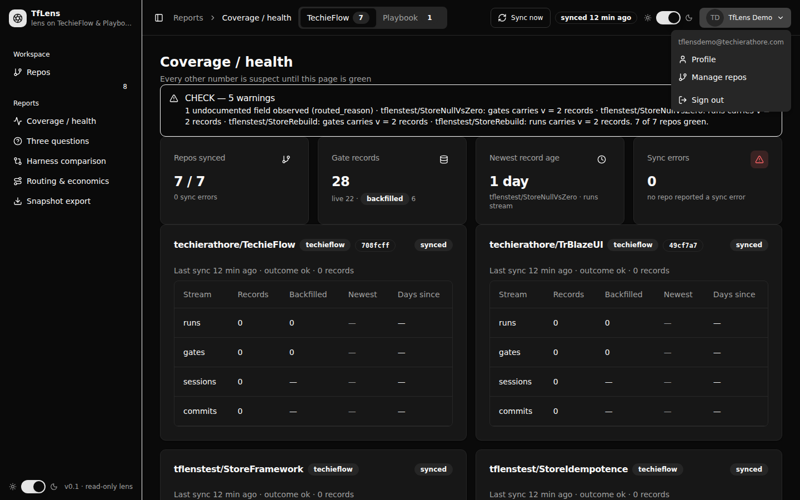

**What it is for.** The collapsible icon sidebar, the header (breadcrumb, Framework switch, Sync now,
theme toggle, user menu) and the page container that every authenticated screen renders inside.

### Control → data path

| Region | Component | `data-testid` | Service call | Behind it |
|---|---|---|---|---|
| Sidebar shell | `SidebarProvider CookieKey="@SidebarPreference.CookieName"` → `Sidebar` | `app-sidebar` | — | `tflens-sidebar` cookie, written by TrBlazeUI |
| Nav items | `SidebarMenuButton` ×6 | `nav-repos`, `nav-coverage`, `nav-three-questions`, `nav-harness`, `nav-routing`, `nav-export` | — | `ShellNavigation.Items` (order, label, Lucide name, section, `HasFrameworkSwitch` all live here) |
| Repo badge | `SidebarMenuBadge` | `nav-repo-count` | `ShellState.RepoCount` | `IRepoRegistry.ListAsync(userId)` → `SELECT * FROM "UserRepo" WHERE "UserId" = @aUserId` |
| Sidebar theme toggle | `ThemeToggle` | `theme-toggle-sidebar` | `ShellPreferences.SetThemeAsync` | JS `tflens.setTheme` → `tflens-theme` cookie + `<html class="dark">` |
| Breadcrumb | `Breadcrumb` in `ShellHeader.razor` | — | `ShellNavigation.Breadcrumb(path)` | static table; `/profile` comes from `ExtraCrumbs` |
| Framework switch | `FrameworkSwitch.razor` (`Tabs` as segmented control) | `framework-switch`, `framework-count-techieflow`, `framework-count-playbook` | `ShellPreferences.SetFrameworkAsync` + `ShellState.RepoCountFor(fw)` | `tflens-framework` cookie; raises `Changed`, which every report page answers by **re-querying** |
| Sync now | `SyncNowButton.razor` | `sync-now` | `IRepoSyncRunner.SyncAsync(userId)` | `RepoSyncRunner` → GitHub GET → `PostgresStore.UpsertAsync` → `WriteSyncStateAsync` |
| Last-sync badge | `Badge` | `last-sync-badge` | `RelativeTime.SyncBadge(ShellState.LastSyncUtc, now)` | max `LastSyncTs` over `"SyncState"` rows with no `LastError` |
| Theme toggle | `ThemeToggle` | `theme-toggle` | as above | — |
| User menu | `UserMenu.razor` (`DropdownMenu`) | `user-menu`, `user-menu-name`, `user-menu-email`, `user-menu-profile`, `user-menu-repos`, `user-menu-signout` | claims via `ShellIdentity` | cascading `AuthenticationState` |
| Toasts | `ToastProvider Position="BottomRight"` | — | `ToastService` | — |

`ShellHeader.ShowsFrameworkSwitch` → `ShellNavigation.ShowsFrameworkSwitch(path)` → the item's
`HasFrameworkSwitch` flag. It is **true on the five report routes only** — not on `/repos`, not on
`/profile`. Verified live.

### States

- **Loading** — `MainLayout.OnParametersSetAsync` awaits the cascading `AuthenticationState`, then
  `ShellState.EnsureLoadedAsync(userId)`. Until it returns, `RepoCount` is 0 and the badge shows `0`.
- **Empty** — `ShellState.Repos = []`. There is no distinct empty rendering; `IsLoaded` exists so a
  consumer *can* tell "no repos" from "not read yet", but the shell does not use it.
- **Error** — `ShellState.RefreshAsync` swallows the exception into `LoadError`, sets both lists empty
  and still raises `Changed`. **`LoadError` is never rendered anywhere.** A store outage looks exactly
  like an empty workspace in the shell.
- **Unauthenticated** — the fallback authorization policy (`AuthRegistration.cs:92`) redirects to
  `/login` before the layout renders.

### Gotchas

- **The repo badge is not framework-filtered.** It is `ShellState.RepoCount` (all repos, both axes),
  while the Framework-switch badges are `RepoCountFor(fw)` and Coverage counts only the selected axis.
  Live today: sidebar `8`, switch `TechieFlow 7` / `Playbook 1`, Coverage "7 repos". All three are
  correct and all three differ. Do not "fix" one to match another without deciding which question the
  badge is answering.
- **Rendering defect:** `SidebarMenuBadge` is a sibling of `SidebarMenuButton` inside `SidebarMenuItem`
  and currently renders on the line *below* the Repos link rather than inline on the row. Visible in
  every screenshot.
- `ShellState` resolves `IRepoRegistry` / `ITelemetryStore` **lazily** through `IServiceProvider`, not by
  constructor injection, so a missing registration degrades to an empty workspace instead of a startup
  failure. That also means a typo'd registration will never throw — it will just show `0`.
- Every subscriber (`MainLayout`, `Coverage`, `Repos`, `Harness`, `ThemeToggle`, `FrameworkSwitch`,
  `SyncNowButton`) implements `IDisposable` and unsubscribes from `ShellState.Changed` /
  `ShellPreferences.Changed`. **Add a subscription without a matching `Dispose` and you leak a handler
  per navigation.**
- **`/signout` is broken.** See [`/profile`](#profile) — it belongs to the user menu but the bug lives
  in `Program.cs` / `AuthEndpoints.cs`.

---

## `/login`

**File:** `src/TfLens/Components/Pages/Auth/Login.razor` · `@page "/login"` ·
`@layout AuthLayout` · `@attribute [AllowAnonymous]` · `@rendermode InteractiveServer`

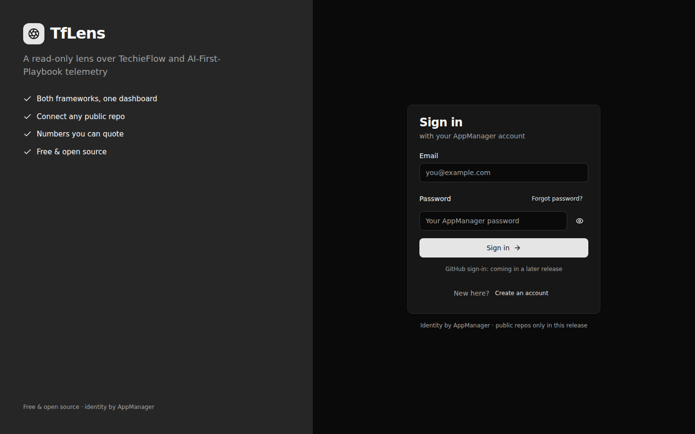

**What it is for.** Sign in with an AppManager account. The credentials are checked *from the circuit*
so a failure keeps what the user typed and costs no page load; a success then posts the same form for
real, because only a genuine HTTP response can carry the auth cookie.

### Control → data path

| Control | Component | `data-testid` | Method | Behind it |
|---|---|---|---|---|
| Brand panel | `AuthLayout.razor` `aside.auth-brand` | `auth-brand-panel` | — | four hard-coded `Benefits` strings |
| Email | `Field` → `Input Type=Email` | `login-email` | `@bind-Value="objEmail"` | — |
| Password | `Input Type=@PasswordInputType` | `login-pass` | `@bind-Value="objPassword"` | — |
| Eye toggle | `Button Variant=Ghost Size=IconSmall` | `login-pass-toggle` | `TogglePasswordVisibility()` | flips `InputType.Text`/`Password`; icons `eye` / `eye-off` |
| Submit | `Button Type=Submit` | `login-submit` | `OnSubmitAsync()` | `IAppManagerClient.LoginAsync(email, pw)` → `POST /AuthSvc/login`, password RSA-OAEP-256 encrypted first |
| Real POST | `AuthForms.razor` (renders nothing) | — | `objForms.SubmitAsync(FormId)` | JS module `AuthForms.razor.js` → native `form.submit()` to `POST /auth/login` |
| Cookie issue | — | — | `AuthEndpoints.LoginAsync` | `AuthService.SignInAsync` → `IAuthSessionStore.CreateAsync` (`"AuthSession"`, tokens Data-Protection-encrypted) → cookie `TfLensAuth` carrying only the session id + display claims |
| Error | `Alert Variant=Danger` | `login-error` | `ApplyFailure(isLocked)` | two strings only |
| Reset confirmation | `Alert Variant=Success` | `login-reset-done` | `?reset=1` query | set by `/auth/reset-password` |
| Links | `Button Variant=Link` | `login-register-link` | — | `/forgot-password`, `/register` |

**The two-phase submit is the thing to understand.** `OnSubmitAsync` calls
`objForms.ReadAsync(FormId)` first (`SyncFromBrowserAsync`) so the rules are judged against what the
browser would actually post rather than a stale binding, then calls `LoginAsync` from the circuit. Only
on success does it hand the *same* form to `SubmitAsync`, and the spinner stays up until the browser
navigates. `AuthEndpoints.LoginAsync` re-validates the antiforgery token and calls AppManager a second
time — the round trip is deliberate, not redundant.

**Landing route** (`AuthEndpoints.LandingUrlAsync`): the local `returnUrl` if present, else `/repos`
when `ReadUserReposAsync` returns nothing, else `/`.

### States

- **Loading** — `objIsSubmitting` disables the button and swaps in `<Spinner>` + "Signing in…".
- **Error** — exactly two messages ever render. `GenericFailure` ("Sign-in failed. Check your email and
  password.") for everything, and `LockedMessage` ("Account locked — try again later") only for
  `AppManagerException.Codes.AccountLocked` (AppManager's 423). The AppManager code is logged and
  **never** reaches the browser — that is BRD-90, anti-enumeration, not a UX choice.
- **Fallback path** — if JS interop is unavailable the endpoint redirects back with `?error=invalid`
  or `?error=locked`, which `OnParametersSet` turns into the same two messages.

### Gotchas

- `AuthForms` **renders nothing**. If `objForms` is null (prerender, disconnected circuit) a *successful*
  credential check produces no cookie; the code logs `"Sign-in succeeded but the form helper was
  unavailable"` and shows the generic failure. A user who "signed in successfully but stayed on the
  login page" is this branch.
- Don't `waitForLoadState('networkidle')` after clicking submit — see
  [How to run and drive it](#how-to-run-and-drive-it).
- `LocalReturnUrl` rejects anything that is not a single-slash-rooted path (`//evil.example`,
  `/\evil.example`) rather than sanitising it. Do not relax that.

### Deviation from `docs/TfLens-UIDesign.md`

The design map specifies `TypographyH2` for the brand wordmark; `AuthLayout.razor` uses a plain
`<span class="auth-wordmark">`. Cosmetic, and the layout also supplies the `--sidebar` / `--alert-*`
design tokens TrBlazeUI 2.0.0 references but never defines (TR-001) — custom properties inherit, so
every control below picks them up. Do not delete `.auth-split` styling assuming it is decoration.

---

## `/register`

**File:** `src/TfLens/Components/Pages/Auth/Register.razor` · `@page "/register"` · `AuthLayout` ·
`[AllowAnonymous]` · `InteractiveServer`

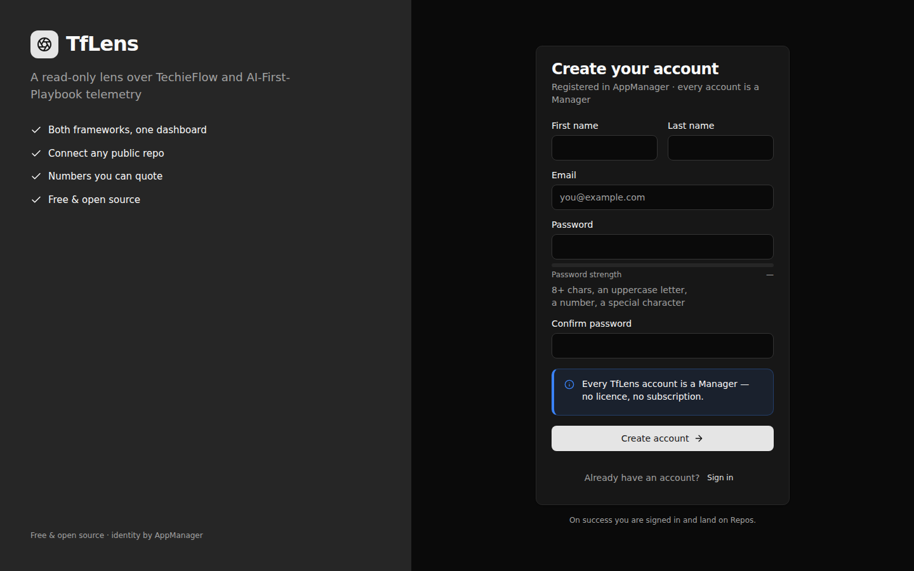

**What it is for.** Create an AppManager account. Every account is a Manager; there is no other role and
no licence.

### Control → data path

| Control | Component | `data-testid` | Method | Behind it |
|---|---|---|---|---|
| First / last name | `Input` in `trblazeui-col-6` | `reg-first`, `reg-last` | binds | — |
| Email | `Input Type=Email` | `reg-email` / error `reg-email-error` | binds | — |
| Password | `Input Type=Password` | `reg-pass` / `reg-pass-error` | binds | — |
| Strength meter | `PasswordStrengthMeter.razor` | `password-strength` | `PasswordRules` score | local `Progress` shim |
| Confirm | `Input Type=Password` | `reg-confirm` / `reg-confirm-error` | binds | — |
| Manager note | `Alert Variant=Info AccentBorder` | `reg-manager-note` | — | always rendered, never conditional |
| Submit | `Button Type=Submit` | `reg-submit` | `OnSubmitAsync()` | local rules → `objForms.SubmitAsync` → `POST /auth/register` |
| Account creation | — | — | `AuthEndpoints.RegisterAsync` | `AuthService.RegisterAsync` → `IAppManagerClient.RegisterAsync` with `applicationRoleCode: "Manager"`, then issues the same session a sign-in would |
| Form error | `Alert Variant=Danger` | `reg-error` | — | `GenericFailure` |

**Rules run locally first.** `PasswordRules.Describe(objPassword)`
(`src/TfLens.Core/AppManager/PasswordRules.cs`) applies every rule AppManager would apply, so a
predictable violation never reaches the API or its log. Confirm mismatch is checked here too. Only a
clean form is posted.

### States

- **Loading** — `objIsSubmitting` → spinner + "Creating account…".
- **Field errors** — `reg-email-error` ("already registered"), `reg-pass-error` (rule text),
  `reg-confirm-error` ("passwords differ"). `Field IsInvalid` drives the red styling.
- **Server refusal** — `AuthEndpoints` redirects back with `?error=duplicate|weak|<other>`;
  `OnParametersSet` maps those onto the same three targets, never onto a raw AppManager code.

### Gotchas

- Unlike `/login`, this page **does not** call AppManager from the circuit. It validates locally and
  posts straight through, so every server-side refusal costs a page load and arrives as a query
  parameter. Do not "optimise" this into a circuit call without also solving the cookie problem.
- `OnParametersSet` bails out early if `objEmailError` or `objFormError` is already set, so a query-string
  error never overwrites a local one on the same render.

### Deviation from `docs/TfLens-UIDesign.md`

§Library gaps says password strength must use TrBlazeUI's `PasswordStrength` control
(`Components/PasswordStrength/`). It does not exist in the installed TrBlazeUI.Components 2.0.0 (TR-003),
so `PasswordStrengthMeter.razor` composes the documented shape from the library's own `Progress` — which
is the fallback the same section names. Delete the shim the moment the library ships the real one.

---

## `/forgot-password`

**File:** `src/TfLens/Components/Pages/Auth/ForgotPassword.razor` · `@page "/forgot-password"` ·
`AuthLayout` · `[AllowAnonymous]` · `InteractiveServer`

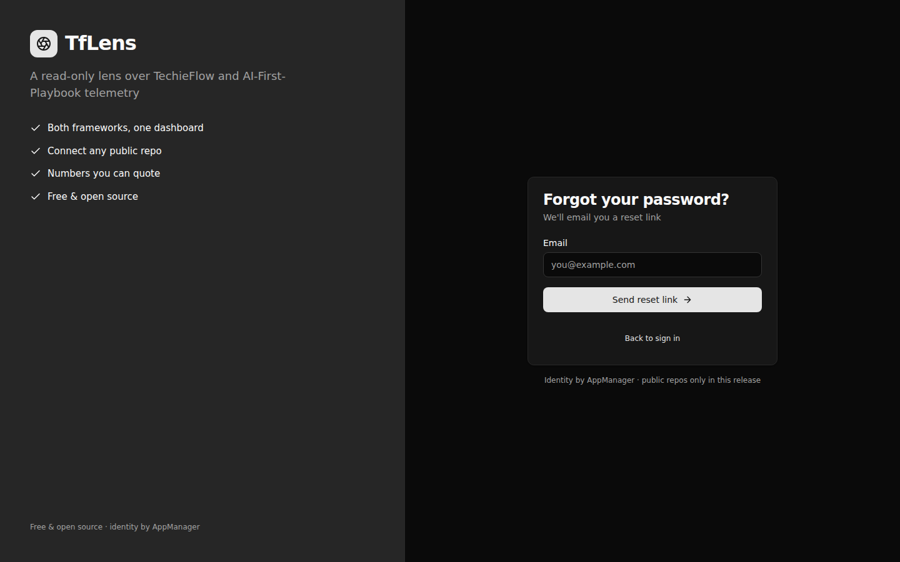

**What it is for.** Ask AppManager to email a reset link. It has exactly one outcome.

### Control → data path

| Control | Component | `data-testid` | Method | Behind it |
|---|---|---|---|---|
| Email | `Input Type=Email` | `forgot-email` | binds | — |
| Submit | `Button Type=Submit` | `forgot-submit` | `OnSubmitAsync()` | `IAppManagerClient.ForgotPasswordAsync(email)` → `POST /AuthSvc/forgot-password` |
| Success | `Alert Variant=Success` **replacing the form** | `forgot-sent` | `objIsSent = true` | — |
| Back link | `Button Variant=Link` | `forgot-back` | — | `/login` |

### States

Loading (spinner + "Sending…"), then **success — always**. `IsSent` is `objIsSent || SentOutcome == "1"`,
where the query parameter covers the non-interactive `POST /auth/forgot-password` path.

There is **no error state**. `OnSubmitAsync` wraps the call in `try/catch`, logs a warning and swallows
it. That is deliberate: surfacing a failure would tell the caller something about the address, which is
the exact leak BRD-92 forbids.

### Gotchas

- **If reset emails stop arriving, this page will still say "Check your inbox".** Diagnose from the
  server log (`logs/tflens-*.log`, `"Forgot-password request could not be delivered to AppManager"`),
  never from the screen. Do not add a visible error path.
- Nothing on this page branches on whether the address exists — no wording, no layout, no code path.

---

## `/reset-password`

**File:** `src/TfLens/Components/Pages/Auth/ResetPassword.razor` · `@page "/reset-password"` ·
`AuthLayout` · `[AllowAnonymous]` · `InteractiveServer`

| Form state (`?token=…`) | Dead-link state (no token) |
|---|---|
| 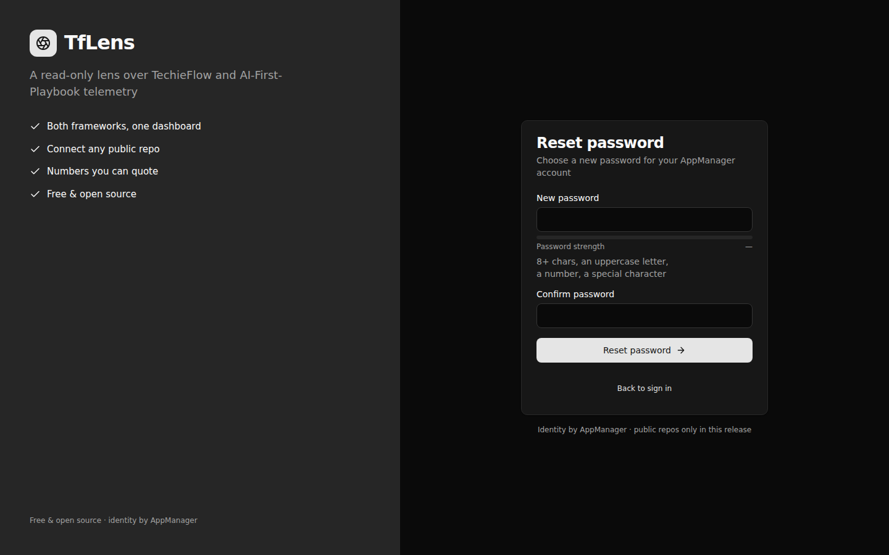 | 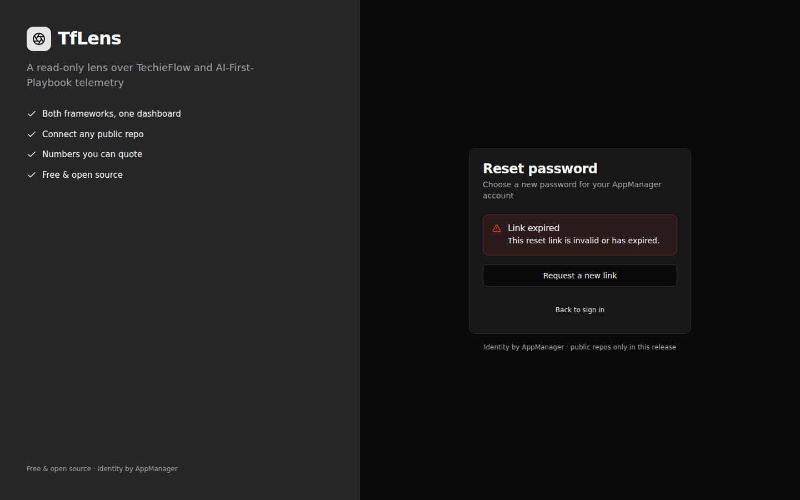 |

**What it is for.** Complete a password reset against the token from the emailed link.

### Control → data path

| Control | Component | `data-testid` | Method | Behind it |
|---|---|---|---|---|
| New password | `Input Type=Password` + `PasswordStrengthMeter` | `reset-pass` / `reset-pass-error` | binds | `PasswordRules.Describe` |
| Confirm | `Input Type=Password` | `reset-confirm` / `reset-confirm-error` | binds | — |
| Submit | `Button Type=Submit` | `reset-submit` | `OnSubmitAsync()` | `IAppManagerClient.ResetPasswordAsync(token, newPassword)` |
| Success | `Alert Variant=Success` + `Button` | `reset-done`, `reset-signin` | `objIsDone = true` | replaces the form |
| Dead link | `Alert Variant=Danger` + `Button Variant=Outline` | `reset-invalid`, `reset-request-new` | `objIsLinkDead = true` | replaces the form |
| Form error | `Alert Variant=Danger` | `reset-error` | — | `GenericFailure` |

### States

Three mutually exclusive card bodies, in this precedence: `objIsDone` → success · `objIsLinkDead` →
dead link · otherwise the form.

`objIsLinkDead` is set by:
- `OnParametersSet` when `Token` is null/whitespace (verified: bare `/reset-password` renders "Link
  expired" immediately, no request made);
- `?error=expired` from the endpoint;
- `AppManagerException.Codes.InvalidResetToken` **or** `AppIdMismatch`.

Those last two deliberately collapse onto one sentence, so a wrong-tenant link is indistinguishable from
a stale one.

### Gotchas

- **The token is never rendered.** Not in a value, not in a hidden input, not in a message. It lives in
  a private `[SupplyParameterFromQuery]` field only. Do not add it to a `data-testid`, a log line, or a
  hidden field "for debugging".
- `InvalidLinkMessage` is one constant used by every dead-link path. If you split it into
  per-cause wording you have reintroduced the tenant-enumeration leak.

---

## `/profile`

**File:** `src/TfLens/Components/Pages/Auth/Profile.razor` · `@page "/profile"` ·
`@attribute [Authorize]` · `InteractiveServer` · `MainLayout` (breadcrumb `Account › Profile`, from
`ShellNavigation.ExtraCrumbs`; **no sidebar item**)

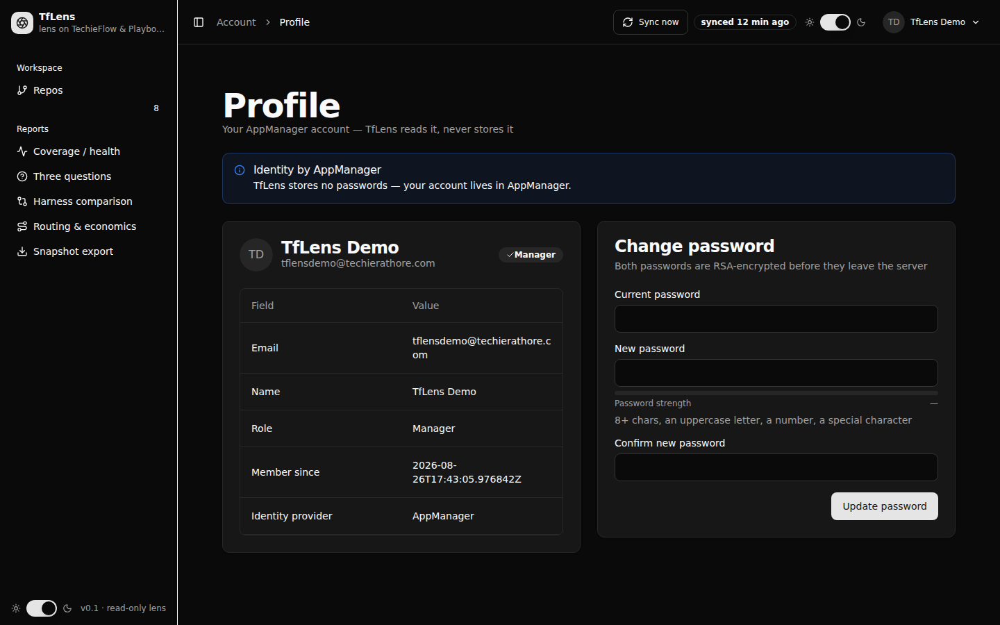

**What it is for.** Show the AppManager account TfLens reads but never stores, and change its password.

### Control → data path

| Region | Component | `data-testid` | Method | Behind it |
|---|---|---|---|---|
| Identity note | `Alert Variant=Info` | `profile-identity-note` | — | always |
| Avatar / name / email | `Avatar` + `CardTitle` + `CardDescription` | `profile-name`, `profile-email` | `AuthService.GetProfileAsync()` | `IAppManagerClient.GetProfileAsync(accessToken)` → `GET /UserSvc/profile` |
| Role badge | `Badge Variant=Secondary` | `profile-role-badge` | `const ManagerRole = "Manager"` | **a constant, not a field** — there is no other role |
| Values table | `DataTable TData=ProfileRow` | `profile-values` | `BuildRows()` | Email · Name · Role · Member since · Identity provider |
| Current password | `Input Type=Password` | `pw-current` / `pw-current-error` | binds | — |
| New password | `Input Type=Password` + `PasswordStrengthMeter` | `pw-new` / `pw-new-error` | binds | `PasswordRules.Describe` |
| Confirm | `Input Type=Password` | `pw-confirm` / `pw-confirm-error` | binds | — |
| Update | `Button Type=Submit` | `pw-submit` | `OnChangePasswordAsync()` | `AuthService.ChangePasswordAsync` → `POST /UserSvc/change-password`, both passwords RSA-encrypted server-side |
| Sign out | `UserMenu.razor` (shell) | `user-menu-signout` | `NavigateTo("/signout", forceLoad: true)` | **see the bug below** |

`DisplayName` / `Email` fall back to `CurrentUser` when AppManager has not answered, so the header of
the card is populated from claims even when the body shows the failure alert.

### States

- **Loading** — `objIsLoading` renders `Skeleton` circles/lines in the header and `profile-skeleton` in
  the body. Set false in `OnInitializedAsync` regardless of outcome.
- **Error** — `objLoadFailed` (i.e. `objProfile is null`) renders `Alert Variant=Warning`
  `profile-unavailable` — "AppManager did not answer. Reload the page to try again." The exception is
  logged as a warning, never shown.
- **Password success** — fields cleared + `ToastService.Success`.
- **Password failure** — `InvalidCurrentPassword` → `pw-current-error`; anything else → `pw-new-error`
  with the rules text; a non-`AppManagerException` → `ToastService.Error`.

### Gotchas

- **The `profile-values` table is one row from silent truncation.** It is the only `DataTable` in the
  app with no `InitialPageSize`, `BuildRows()` returns exactly 5, and the default page size is 5. Add a
  sixth field and it vanishes with no error. Set `InitialPageSize="16"` when you touch this file.
- **`/signout` returns 404 and does not sign the user out.** `UserMenu.OnSignOut` navigates to
  `/signout` with `forceLoad: true`, and `Program.cs:88` sets `aCookie.LogoutPath = "/signout"` — but
  `AuthEndpoints.MapAuthEndpoints` only maps `POST /auth/logout`. There is no `GET /signout` handler
  anywhere. Verified live: `GET /signout` → **404**, and the `TfLensAuth` cookie is **still present**
  afterwards. `/signout` is also absent from `AnonymousRoutes.Paths`. This is the only sign-out control
  in the app, so sign-out is currently non-functional. *(Reported, not fixed — this is a docs task.)*
- `AuthService.SignOutAsync` itself is correct: it calls AppManager's authenticated
  `POST /AuthSvc/logout` **with the bearer token** (a call without it is answered 401 and revokes
  nothing), then deletes the session row and clears the cookie regardless of AppManager's answer
  (BRD-4). Only the route into it is missing.

---

## `/repos`

**File:** `src/TfLens/Components/Pages/Repos.razor` · `@page "/repos"` · authenticated ·
`MainLayout` · breadcrumb `Workspace › Repos` · **no Framework switch**

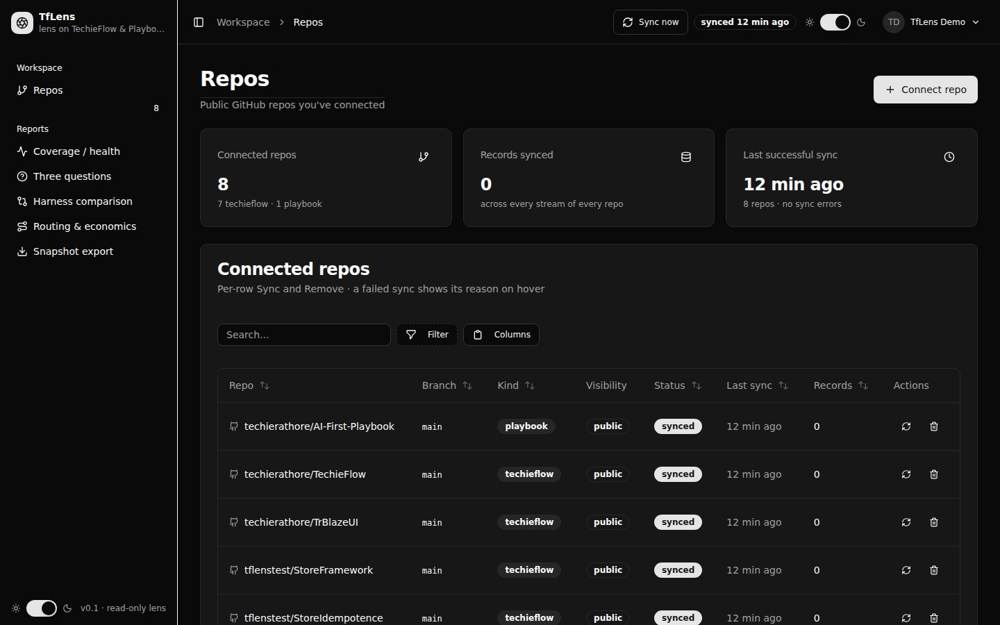

**What it is for.** The only screen that writes. Connect a public GitHub repo, sync one, remove one.

### Injected services

```razor
@inject IRepoListReader objRepoListReader   // == RepoRegistry (ReposRegistration.cs:46)
@inject RepoRegistry    objRepoRegistry     // the CONCRETE class, not IRepoRegistry
@inject IServiceProvider objServices        // IRepoSyncRunner resolved lazily
@inject ShellState objShellState
@inject ToastService objToastService
```

`RepoRegistry` implements both `IRepoRegistry` and `IRepoListReader`, and both interfaces are registered
as the *same* scoped instance. The page injects the concrete type because it needs the four-argument
`ValidateAsync`/`ConnectAsync` overloads that take a `kind` override — `IRepoRegistry` only declares the
three-argument ones.

### Control → data path

| Control | Component | `data-testid` | Method | Behind it |
|---|---|---|---|---|
| Connect repo | `Button` | `connect-repo` | `OpenConnectDialog()` | resets dialog state only |
| KPI: connected | `StatTile` | `kpi-repos` | `objRows.Count` | `RepoRegistry.ListWithCountsAsync(userId)` |
| KPI: records | `StatTile` | `kpi-records` | `objRows.Sum(r => r.RecordCount)` | **`"SyncState"` counters** — see gotcha 6 |
| KPI: last sync | `StatTile` | `kpi-last-sync` | `RelativeTime.Describe(ShellState.LastSyncUtc, now)` | max `LastSyncTs` with no error |
| Grid | `DataTable TData=RepoListItem ShowToolbar ShowPagination InitialPageSize="10"` | `repos-table` | `ListWithCountsAsync` | joins `"UserRepo"` to `"SyncState"` per user |
| Status cell | `Badge` / `Tooltip` | `repo-status-{name}` | `RepoListItem.Status` | `pending` when `Sync is null`, `error` when `LastError is not null`, else `synced`; the tooltip carries the **redacted** `LastError` (`SyncErrorRedactor`) |
| Row sync | `Button Variant=Ghost Size=IconSmall` | `repo-sync-{name}` | `SyncRepoAsync(row)` | `IRepoSyncRunner.SyncRepoAsync(userId, repo)` |
| Row remove | `Button Variant=Ghost Size=IconSmall` | `repo-remove-{name}` | `OpenRemoveDialog(row)` | — |
| Connect input | `Input` | `connect-input` | binds | `RepoInputParser` accepts a URL or `owner/name` |
| Branch | `Input` | `connect-branch` | binds | null → default branch |
| Kind | `Select` | `connect-kind` | binds | `auto` / `techieflow` / `playbook` |
| Validate | `Button Variant=Outline` | `connect-validate` | `ValidateAsync()` | `RepoRegistry.ValidateAsync` → `IGitHubStreamFetcher.GetRepoAsync` + `PathExistsAsync` |
| Validation lines | `CheckLine.razor` ×3 | `connect-validation` | `RepoValidation.Exists/IsPublic/TelemetryPath` | — |
| Connect | `Button` | `connect-submit` | `ConnectAsync()` | `RepoRegistry.ConnectAsync` (re-validates server-side) → `WriteUserRepoAsync` → queued first sync |
| Remove confirm | `AlertDialog` | `remove-title`, `remove-description`, `remove-cancel`, `remove-confirm` | `ConfirmRemoveAsync()` | `RepoRegistry.RemoveAsync` → `ITelemetryStore.DeleteRepoDataAsync` + raw archive under `data/raw/` |
| Empty | `Empty` | `repos-empty`, `repos-empty-connect` | — | — |

**`DeleteRepoDataAsync` removes all three layers**, scoped to `(userId, repo)`: every stream table row
(`"Run"`, `"Gate"`, `"Session"`, `"Commit"`, `"PbEvent"`), the `"SyncState"` row, and the `"UserRepo"`
row itself. `RepoRegistry.RemoveAsync` then removes the raw archive, which the store never touches.
Another user's copy of the same public repository is untouched.

**Connect is enabled only on `RepoValidation.IsConnectable`** — `Exists && IsPublic && TelemetryPath is
not null && !AlreadyConnected`.

### States

- **Loading** — `objIsLoaded == false` renders a `Card` of three `Skeleton` lines.
- **Empty** — `objRows.Count == 0` → `Empty` `repos-empty`.
- **Row syncing** — `objSyncingRepos` (a `HashSet<string>`) swaps the status cell and the row button
  for a `Spinner`.
- **Connect progress** — `connect-progress` with a `Progress` bar; `ConnectAsync` sets 15 → 55, then
  `WaitForFirstSyncAsync` polls `ListWithCountsAsync` **once a second for up to 30 seconds**, walking
  the bar to 95, until `Status != Pending`.
- **Rate limit** — `GitHubRateLimitException` → `Alert Variant=Warning` `connect-rate-limit`, on both
  Validate and Connect. Checked *before* the private/problem alerts, so a rate limit never masquerades
  as a validation failure.
- **Private repo** — `Alert Variant=Warning` `connect-private` with `RepoRegistry.PrivateRepoMessage`.
- **Other refusal** — `Alert` `connect-problem`, `Warning` when `AlreadyConnected`, else `Danger`.

### Gotchas

- **`WaitForFirstSyncAsync` blocks the circuit for up to 30 seconds.** If the first sync overruns,
  `ReportConnectOutcome` toasts "connected — the first sync is still running" rather than an error. A
  connect that "hangs" is this loop.
- `IRepoSyncRunner` is resolved with `GetService`, not `GetRequiredService`. If it is not registered,
  the row Sync button toasts *"Sync is not available in this build."* instead of throwing. Same pattern
  in `SyncNowButton`.
- The `Records` column and `kpi-records` read `"SyncState"` counters. Seeded rows show `0` here while
  Coverage shows the real totals. Not a bug in this page — [gotcha 6](#cross-cutting-gotchas--read-these-first).
- `ReloadAsync` also calls `ShellState.RefreshAsync(userId)`, which is what keeps the sidebar badge and
  the header last-sync badge in step after a connect/remove. Drop that call and the shell goes stale.
- `data-testid="repo-sync-{name}"` uses `UserRepo.Name` (the segment after `/`), not `owner/name`. Two
  connected repos with the same name under different owners collide on that id.

---

## `/` — Coverage / health

**File:** `src/TfLens/Components/Pages/Coverage.razor` · `@page "/"` · authenticated ·
`MainLayout` · breadcrumb `Reports › Coverage / health` · Framework switch **shown**

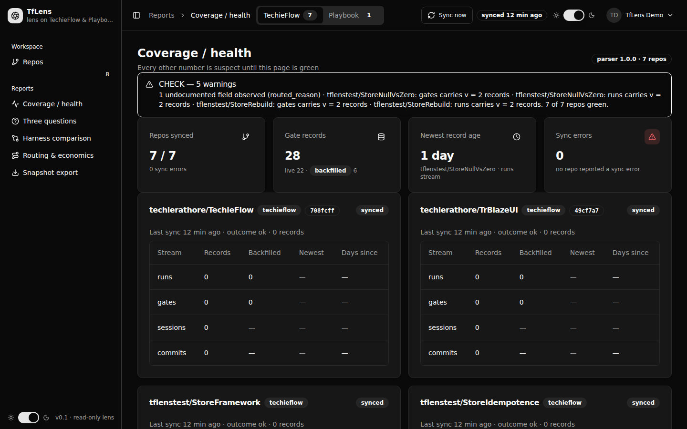

**What it is for.** "Every other number is suspect until this page is green." It reads the sync
bookkeeping *and the stored rows themselves* — never a cached summary — so what it shows is what the
store holds.

### Control → data path

| Region | Component | `data-testid` | Method | Behind it |
|---|---|---|---|---|
| Parser badge | `Badge Variant=Outline` | `coverage-parser` | `ParserVersion.Current`, `objCards.Count` | — |
| Status strip | `Alert Success`/`Warning` | `coverage-status` | `StatusHeadline` / `StatusDetail` ← `BuildWarnings()` | sync errors, stale streams, undocumented fields, `v > 1` records — in that order |
| KPI: repos synced | `StatTile` | `kpi-repos-synced` | `SyncedRepoCount` / `objCards.Count` | cards whose `Sync?.LastError is null` |
| KPI: gate records | `StatTile` | `kpi-gate-records` | `GateRecordTotal`, `GateRecordsLive`, `GateRecordsBackfilled` | `Σ` of each card's `gates` stream row |
| KPI: newest age | `StatTile` | `kpi-newest-age` | `NewestRecord()` → `AgeText` | max `NewestTs` across all shown streams |
| KPI: sync errors | `StatTile` | `kpi-sync-errors` | `SyncErrorCount`, `LastErrorDetail` | `"SyncState"."LastError"` |
| Repo card | `Card` | `repo-card-{name}` | `BuildCard(repo, syncStates)` | one per repo on the **selected framework** |
| SHA badge | `<a>` + `Badge` | `repo-sha-{name}` | `RepoCard.ShortSha` / `CommitUrl` | `LastSha[..7]`, opens `github.com/{repo}/commit/{sha}` |
| Status badge | `Badge` | `repo-state-{name}` | `RepoCard.StatusText` | `sync error` / `N streams stale` / `not synced yet` / `synced` |
| Stream table | `DataTable TData=StreamRow … InitialPageSize="16"` | `repo-streams-{name}` | `BuildRow(repo, stream)` | rows come from `FrameworkNames.Streams(framework)` |
| Stale badge | `Badge Variant=Destructive` | `stale-{name}-{stream}` | `StreamRow.IsStale` | cadence stream **and** `DaysSince >= StalenessDays` |
| Staleness alert | `Alert Warning AccentBorder` | `repo-stale-{name}` | `StalenessMessage(staleStreams)` | names the streams and the configured threshold |
| Per-repo error | `Alert Danger` | `repo-error-{name}` | `Sync.LastError` | redacted at write time |
| Unknown fields | `Collapsible` | `unknown-fields`, `unknown-fields-trigger`, `unknown-group-{key}`, `unknown-fields-none` | `BuildUnknownFields()` | field **names only** |
| Newer-schema alert | `Alert Info` | `schema-version-alert` | `objAboveSchemaV1` | records with `"V" > 1` |
| Rebuild | `Card` + `AlertDialog` | `rebuild-card`, `rebuild`, `rebuild-title`, `rebuild-cancel`, `rebuild-confirm`, `rebuild-progress`, `rebuild-report`, `rebuild-per-stream` | `ConfirmRebuildAsync()` | `ITelemetryStore.RebuildAsync(userId)` |

### The SQL behind the numbers

All of it is `PostgresStore.ReadCoverageFactsAsync`, three `UNION ALL` queries against the stream
tables (**not** `"SyncState"`):

```sql
-- StreamCoverageSql (records, backfilled, newest per repo+stream)
SELECT "Repo", 'runs' AS "Stream", COUNT(*)::int AS "Records",
       COUNT(*) FILTER (WHERE "Backfilled")::int AS "Backfilled", MAX("Ts") AS "NewestTs"
FROM "Run" WHERE "UserId" = @aUserId GROUP BY "Repo"
UNION ALL … "Gate" … "Session" … "Commit" … "PbEvent"
```

- `"Ts"` is ISO-8601 **text**, whose lexical order is its chronological order, so `MAX` is the newest
  record without a cast.
- Only `"Run"` and `"Gate"` carry a `"Backfilled"` column. The other three select a literal `0`, and
  `StreamRow.BackfilledText` renders `—` for them via `CarriesBackfilled` — an em dash, not a zero,
  because the fact was never captured.
- Unknown fields come from `LATERAL jsonb_object_keys("Overflow")`. The store returns **names only,
  already filtered to what SCHEMA.md does not document** — an `Overflow` payload must never reach a
  caller.
- Newer-schema facts come from `MAX("V")::int … WHERE "V" > 1`.

### States

- **Loading** — `objIsLoaded == false` → one `Card` with three `Skeleton` lines.
- **Error** — `ReloadAsync` catches everything into `objLoadError` and renders `Alert Danger`
  `coverage-error` with the raw exception message. Cards, unknown fields and warnings are all cleared.
- **Empty** — `objCards.Count == 0` → `Empty` `coverage-empty`, titled *"No {framework} repos
  connected"* with a **Manage repos** action. Reached when the user has repos but none on the selected
  axis.
- **Redirect** — if `ReadUserReposAsync` returns nothing at all (`objHasAnyRepo == false`),
  `OnParametersSetAsync` navigates to `/repos`. Coverage is the landing route only for a user who has
  something to cover.

### Gotchas

- **`ReadCoverageFactsAsync` is not framework-filtered.** Its SQL has no `"UserRepo"` join — it returns
  facts for every repo of the user. The page narrows them by matching repo name inside `BuildRow`. If
  you add a call site, do the filtering yourself.
- **`StalenessDays` applies to cadence streams only** — `CadenceStreams = [sessions, commits]`. A
  three-month-old `gates` stream is never marked stale. `StalenessDays` comes from
  `TfLensOptions.StalenessDays`, floored at 1.
- **Rebuild is the only destructive control on a read-only lens.** `ConfirmRebuildAsync` drops the
  parsed tables and replays the raw archive; the raw archive and the GitHub repos are untouched. The
  `Progress` bar is **fake** — it is set to 20 before the call and 100 after, with nothing in between.
  A long rebuild looks frozen at 20%.
- Rebuild is also the only path that recomputes the `"SyncState"` counters
  ([gotcha 6](#cross-cutting-gotchas--read-these-first)).
- `OnParametersSetAsync` bails if `objIsLoaded`, so it loads **once** per component instance.
  Re-querying on a framework change is `OnFrameworkChanged`, subscribed to
  `ShellPreferences.Changed`, which compares `objFramework` to `objPreferences.Framework` and calls
  `ReloadAsync`. The figures are re-read on the new axis, never filtered from what is on screen.
- `SidebarMenuBadge` shows all repos; this page's `objCards.Count` shows one axis. They will differ.

### Deviation from `docs/TfLens-UIDesign.md`

The design specifies the first-run empty state as `Empty` **"No sync yet"** with a **Sync now** action.
The code renders `Empty` **"No {framework} repos connected"** with a **Manage repos** action pointing at
`/repos`, and handles "no repos at all" by redirecting instead. The code's answer is the more useful
one — Sync now on zero repos does nothing — but the design doc is stale here.

The design also says loading is `Skeleton` **cards** (plural, mirroring the repo grid); the code renders
one card with three skeleton lines. Every report page uses that same single-card block.

---

## `/three-questions`

**File:** `src/TfLens/Components/Pages/ThreeQuestions.razor` · `@page "/three-questions"` ·
authenticated · `MainLayout` · Framework switch **shown**

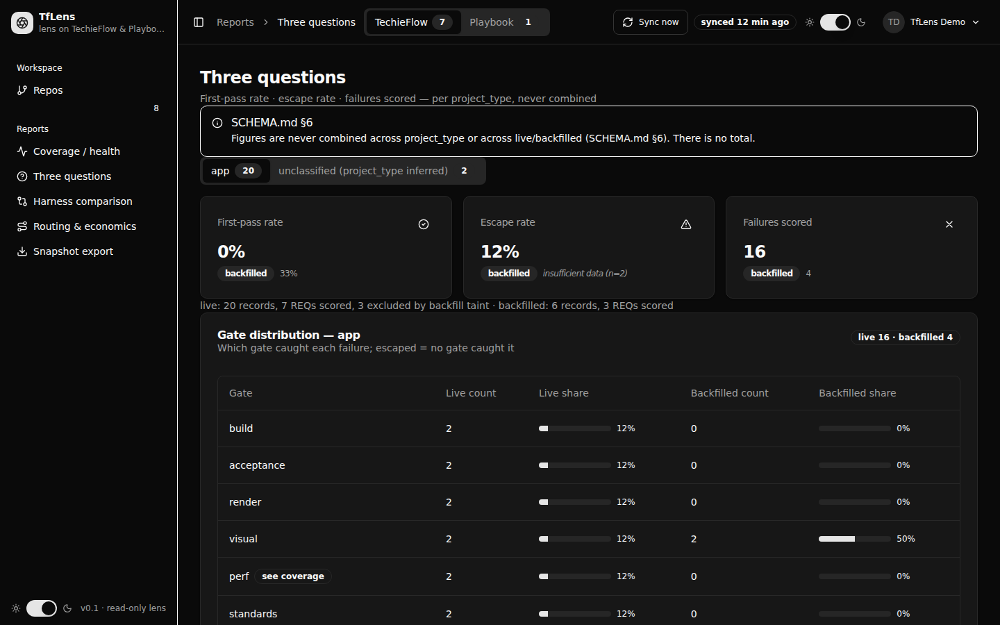

**What it is for.** The page the product exists for: first-pass rate, escape rate and failures scored,
read **one `project_type` at a time**. There is deliberately no "all" tab and no total row.

### Control → data path

Everything on this page comes from a single call:

```csharp
objResult = await objMetricsEngine.AnalyseAsync(objUserId.Value, objFramework);
```

`IMetricsEngine` is registered as `CachingMetricsEngine` wrapping `MetricsEngine`
(`MetricsRegistration.cs`). `MetricsEngine.AnalyseAsync` is the field-for-field port of `analyse()` in
`.tfcore/telemetry/tf-metrics.sh`, in the reference's own stage order:

1. read the streams — `ReadGatesAsync`, `ReadRunsAsync`, `ReadSessionsAsync`, `ReadCommitsAsync`,
   `ReadUserReposAsync`, `ReadPbEventsAsync`, then `DedupeCommits.PerRepo`;
2. per-repo facts — `PerRepoFactsFor`;
3. split provenance and compute the taint set — `TaintSet.FromBackfilled(gates)`;
4. figures per `(provenance, project type)` — `SegmentsFor` → `FiguresFor`;
5. the pooled block — `Pooled.Compute`.

| Region | Component | `data-testid` | Source |
|---|---|---|---|
| Standing note | `Alert Info` | `schema-note` | constant, always rendered |
| Type tabs | `Tabs` / `TabsTrigger` | `type-tabs`, `type-tab-{type}` | `AnalysisResult.ProjectTypes`; badge is `LiveOf(type).Records` |
| First-pass rate | `StatTile` → `FigureText` | `kpi-first-pass-{type}`, `live-first-pass-{type}`, `backfilled-first-pass-{type}` | `SegmentFigures.FirstPassRate` ← `FirstPassRate.Compute(firstPass.Count, reqs.Count)` |
| Escape rate | `StatTile` → `FigureText` | `kpi-escape-{type}`, `live-escape-{type}`, `backfilled-escape-{type}` | `EscapeRate.Compute(escapedReqs.Count, failedReqs.Count)` |
| Failures scored | `StatTile` (plain span) | `kpi-failures-{type}`, `live-failures-{type}`, `backfilled-failures-{type}` | `SegmentFigures.GateDistributionN` — an `int`, not a `Figure` |
| Segment facts | `<p>` | `segment-facts-{type}` | `Records`, `ReqsScored`, `ReqsExcludedBackfillTaint` per provenance |
| Gate distribution | `DataTable … InitialPageSize="32"` | `gate-dist-{type}` | `GateRowsOf(type)` |
| Distribution note | `<p>` | `gate-dist-note-{type}` | `GateDistribution.Note(n)` when a provenance has too few failures |
| Unlisted note | `<p>` | `gate-dist-unlisted-{type}` | `UnlistedNote()` — failures naming a gate outside `GateOrder` |
| Late-gate coverage | `Card` → `FigureText` | `late-gate-{type}`, `late-gate-{type}-{gate}`, `late-gate-rate-{type}-{gate}` | `SegmentFigures.LateGateCoverage` ← `LateGateCoverageCalculator.Compute` |
| Taint list | `Collapsible` | `taint-trigger`, `taint-list` | `AnalysisResult.TaintedReqs` |

**The formulas** (hover text, `MetricsConstants` / SCHEMA.md §8):

- **First-pass rate** — `gates where attempt=1 AND verdict=Verified ÷ distinct req_id`, live-only, per
  `project_type`.
- **Escape rate** — `REQs with a gate="escaped" record ÷ REQs with any failure record`, live-only.
- **Failures scored** — count of gate values across all `verdict != Verified` records.

**The taint rule (REQ-FN-049)** is the one to remember: a REQ with *any* backfilled verdict before its
first live verdict leaves the live **numerator and denominator**. `FiguresFor` filters
`aRecords.Where(r => !aTainted.Contains(r.ReqId))` for the live bucket only, and counts the excluded
distinct REQs into `ReqsExcludedBackfillTaint`.

**`GateRowsOf`** walks `MetricsConstants.GateOrder.Append(Unattributed)` — `build`, `acceptance`,
`render`, `visual`, `perf`, `standards`, `escaped`, `unattributed` = **8 rows** — and looks each gate up
in the live and backfilled distributions independently. The engine *omits* a gate that caught nothing;
the screen shows the whole order so the reader can see a gate caught nothing rather than wonder whether
it ran.

### States

- **Loading** — single `Card` of `Skeleton` lines.
- **Error** — `Alert Danger` `three-questions-error` with the exception message.
- **Empty** — `objTypes.Count == 0` → `Empty` `three-questions-empty`, "No gate records yet".
- **Insufficient data** — any `Figure` below `MinN` = 3 renders `insufficient data (n=…)` through
  `FigureText`. `SmallWhenNoNumber` shrinks it to `text-base font-normal` so a refusal-to-answer is
  never rendered at headline size.

### Gotchas

- **Nothing on this page may be added up.** No total row, no combined column, no cross-type figure.
  `AnalysisResult` cannot express one (ADR-007) and this page adds nothing that would. If a
  stakeholder asks for a total, the answer is no.
- **Backfilled is a labelled secondary line, never added to the live figure.** The badge + value live
  in the `ValueContent` slot rather than the description slot, because `StatTile`'s description slot is
  a `<p>` and a `Badge` renders a `<div>`, which the browser's parser hoists out of a paragraph. Do not
  "tidy" it back into the description slot.
- **`Failures scored` is not a `Figure`.** It is `GateDistributionN`, an `int`, rendered in a plain
  `<span>`. It has no `insufficient data` case by design — a count of failures is always honest.
- **The tab selection is per-circuit, not persisted.** `OnTypeSelectedAsync` sets a field and returns
  `Task.CompletedTask`; nothing is re-queried and nothing is written. Reload the page and you are back
  on the first type. *(The design doc says "tab choice persisted per session" — it is not.)*
- **The formula "tooltips" are plain HTML `title=` attributes**, not TrBlazeUI `Tooltip` components.
  Playwright cannot read them by hovering; read the `title` attribute instead. *(Design doc says
  `Tooltip`.)*
- `unclassified` is relabelled *"unclassified (project_type inferred)"* by `LabelFor`. It is a real
  segment key produced by `Segment.KeyFor`, not a UI placeholder.
- Late-gate coverage reports **live records only** and states `ran` beside `caught` — never a share,
  because a late gate's share of a raw distribution is structurally understated (SCHEMA.md §3.5).
  `MetricsConstants.LateGates` currently holds `perf → 2026-08-10`; keep it in sync with `LATE_GATES`
  in `tf-metrics.sh`.

---

## `/harness`

**File:** `src/TfLens/Components/Pages/Harness.razor` · `@page "/harness"` · authenticated ·
`MainLayout` · Framework switch **shown**

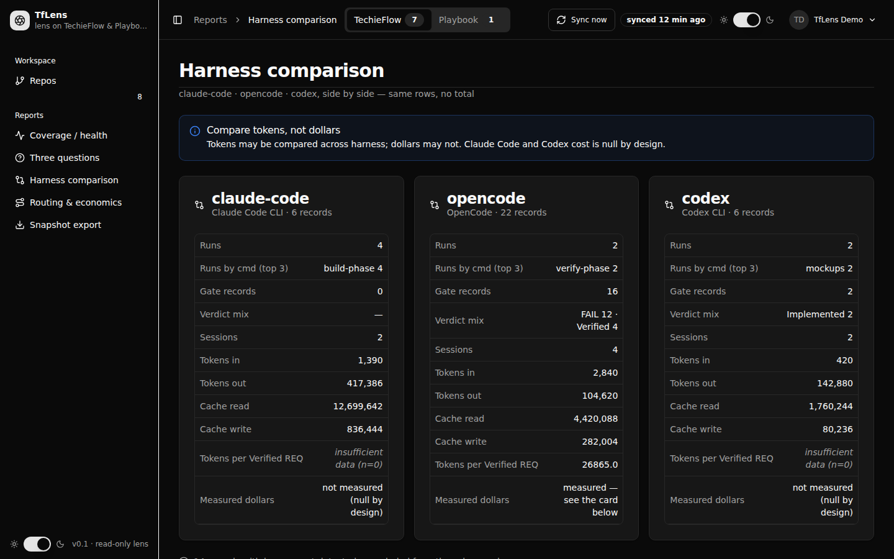
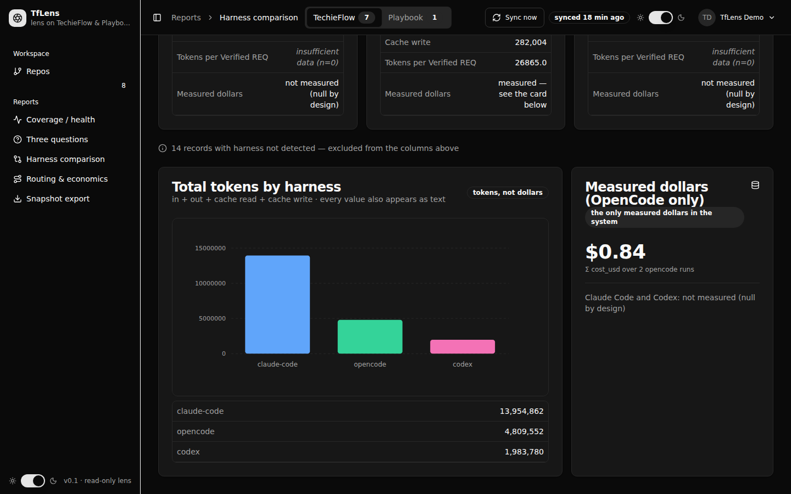

**What it is for.** The three harnesses side by side. The integrity rules *are* the feature.

### Control → data path

One call: `objComparison = await objExtraMetrics.CompareHarnessesAsync(userId, objPreferences.Framework)`
(`src/TfLens.Core/Metrics/ExtraMetrics.cs`).

| Region | Component | `data-testid` | Source |
|---|---|---|---|
| Standing note | `Alert Info` | `harness-note` | constant, never conditional |
| Column | `Card` | `harness-col-{harness}` | `HarnessComparison.Columns`, ordered by `ExtraMetrics.HarnessOrder = ["claude-code","opencode","codex"]` |
| Column rows | `DataTable … InitialPageSize="50"` | `harness-table-{harness}` | `RowsFor(column)` — 11 rows |
| Row values | `FigureText` or plain span | `harness-{h}-runs`, `-cmds`, `-gates`, `-verdicts`, `-sessions`, `-tokens-in`, `-tokens-out`, `-cache-read`, `-cache-write`, `-tokens-per-verified`, `-cost` | `HarnessColumn.*` |
| Not-detected footnote | `div.tflens-footnote` | `harness-null-footnote` | `HarnessComparison.NotDetectedRecords` |
| Tokens chart | `ChartContainer` → `BarChart` + `ApexPointSeries` | `tokens-chart` | `objChartRows` (`HarnessTokenTotal`) |
| Tokens table | `DataTable … InitialPageSize="50"` | `tokens-table`, `tokens-total-{harness}` | `ToTokenRow` = in + out + cache read + cache write |
| OpenCode dollars | `Card` | `opencode-cost`, `opencode-cost-value`, `opencode-cost-basis`, `opencode-cost-note` | `HarnessComparison.OpenCodeCostUsd` ← `MeasuredOpenCodeCost(runs)`, `Σ cost_usd` over `opencode` runs |

**The four rules that shape this file:**

1. **Three columns, always.** `HarnessOrder` is the detected vocabulary of SCHEMA.md §1, not a display
   preference. A harness that emitted nothing still gets a column, rendering `—` throughout
   (`CountText(isEmpty, …)`). A zero would read as *"we measured it and it was nothing"* rather than
   *"there was nothing to measure"*.
2. **`harness: null` is a footnote, never a fourth column and never dropped.** Hidden only at n = 0.
3. **Tokens may be compared across harness; dollars may not.** There is no member on
   `HarnessComparison`, and no markup here, that could hold a cross-harness dollar total. OpenCode is
   the only harness with a measured `cost_usd`; the other two say *"not measured (null by design)"*
   rather than showing a zero. When OpenCode captured no `cost_usd` at all, its row says
   *"no cost_usd captured yet"* so it never contradicts the card below.
4. **Any figure below `MinN` renders through `FigureText`.** Only `Tokens per Verified REQ` carries a
   `Figure`; `ColumnRow.Value` is `null` for every other row, and the cell falls back to the plain span.
   `TokensPerVerified` returns `NotApplicable` when no tokens were captured at all — because zero would
   read as a measurement of nothing rather than an absence of measurement.

### States

- **Loading** — `Card` of `Skeleton` lines.
- **Error** — `Alert Danger` `harness-error`.
- **Empty column** — `IsEmpty(column)` (`Runs == 0 && GateRecords == 0 && Sessions == 0`) → `—` in
  every count cell, and `SubtitleFor` reads *"{Product} · no records"*.
- **Empty chart** — `objTokenRows.All(r => r.Tokens == 0)` → `Empty` `tokens-chart-empty`.
- **No page-level empty state.** With zero records the page still renders three `—` columns. That is
  intentional.

### Gotchas

- **The chart works.** Verified live on TechieFlow: `[data-testid="tokens-chart"]` contains an
  `apexcharts-svg` with 3 bar paths and 3 x-axis labels, and `window.ApexCharts` is a function. See the
  deviation note under [`/routing`](#routing) — `Routing.razor`'s TR-011 comment claiming the ApexCharts
  runtime is never loaded is **stale and wrong**.
- **Cosmetic defect:** the chart's x-axis labels are doubled in the DOM
  (`"claude-codeclaude-code"`), though they paint once. If you assert on axis text, account for it.
- The chart is **supplementary**: TrBlazeUI's chart API carries no axis or label control, so every value
  it draws is also printed as text in `tokens-table` beside it. Never remove the table to "clean up".
- `HarnessTokenTotal` carries exactly two properties because TrBlazeUI 2.0.0's chart types infer the
  category and series from the item type's properties. Adding a third property to that record will
  change what the chart draws.
- `Verdict mix` uses `PairsText(…, int.MaxValue)` — the whole mix, unbounded. `Runs by cmd` takes the
  top 3. Both render `—` when empty.
- This page subscribes to **both** `ShellState.Changed` and `ShellPreferences.Changed` and calls the
  same `ReloadAsync` handler, so a sync *and* a framework change both re-query.

---

## `/routing`

**File:** `src/TfLens/Components/Pages/Routing.razor` (1,188 lines — the largest page) ·
`@page "/routing"` · authenticated · `MainLayout` · Framework switch **shown**

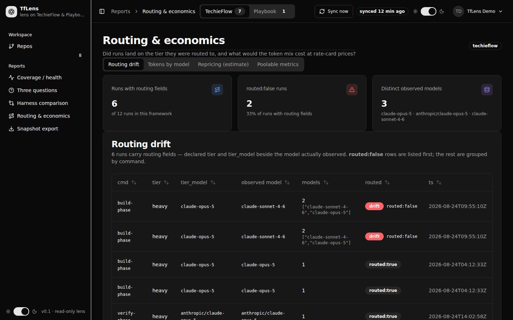

**What it is for.** Did runs land on the tier they were routed to, and what would the token mix cost at
rate-card prices? This is the page the integrity rules bite hardest on.

### Two engine calls

```csharp
objRouting = await objExtraMetrics.AnalyseRoutingAsync(userId, objFramework);
objPooled  = (await objMetricsEngine.AnalyseAsync(userId, objFramework)).Pooled;
```

`AnalyseRoutingAsync` **re-reads `prices.json` every time** (`RateCard.LoadAsync(options.PricesPath)`),
which is what makes the edit dialog's Save show up in the repricing cards without a page reload.

### Tab: Routing drift — `routing-tab-drift` / `routing-panel-drift`

| Region | `data-testid` | Source |
|---|---|---|
| Runs with routing fields | `kpi-routing-fields` | `RoutingAnalysis.RunsWithRoutingFields`; sub-line `of {Pooled.RunsTotal} runs` |
| `routed:false` runs | `kpi-unrouted` | `RoutingAnalysis.UnroutedRuns`; sub-line `MetricsConstants.Pct(unrouted, withFields)` |
| Distinct observed models | `kpi-distinct-models` | `RoutingAnalysis.DistinctModels`; sub-line lists the models themselves |
| Drift table | `drift-table`, `drift-row-count` | `DriftRows` — `routed:false` first (as the service ordered them), then the rest grouped by `cmd`, newest `ts` first |
| Empty | `drift-empty` | "no routing fields captured yet" |

`HasRoutingFields(run)` decides membership. Null string fields render `Missing` (`—`), never a blank
cell. `ModelCount` splits the comma-separated `models` field and shows the raw list below the count when
> 1.

### Tab: Tokens by model — `routing-tab-models` / `routing-panel-models`

| Region | `data-testid` | Source |
|---|---|---|
| Table | `model-tokens` | `RoutingAnalysis.TokensByModel` ← `ExtraMetrics.TokensByModel(runs)`, the four §2.5 token classes summed **per model actually observed, not per tier requested** |
| Bars | `model-tokens-bars` | hand-rolled `div.tflens-bar` with an inline `height:%` |
| Empty | `model-tokens-empty` | — |

### Tab: Repricing (estimate) — `routing-tab-repricing` / `routing-panel-repricing`

| Region | `data-testid` | Source |
|---|---|---|
| Missing prices | `missing-prices` | `RoutingAnalysis.MissingPriceModels` — named, **excluded from both estimates, never priced at zero** |
| Actual mix | `repricing-actual`, `repricing-actual-value`, `repricing-actual-estimate`, `repricing-actual-excluded` | `RoutingAnalysis.ActualMixUsd` |
| Counterfactual | `repricing-max`, `repricing-max-value`, `repricing-max-estimate`, `repricing-max-excluded` | `RoutingAnalysis.AllAtMaxUsd`; title names `MostExpensiveModel` |
| Delta | `repricing-delta`, `repricing-delta-value`, `repricing-delta-share`, `repricing-delta-estimate` | `RoutingAnalysis.DeltaUsd` = max − actual |
| Edit prices | `edit-prices` → dialog `edit-prices-dialog`, `edit-prices-table`, `price-{model}-{input\|output\|cache-read\|cache-write}`, `edit-prices-invalid`, `edit-prices-cancel`, `edit-prices-save` | `RateCard.LoadAsync` / `RateCard.SaveAsync(options.PricesPath, models)` |

**Every money figure on this page is tokens × the operator's rate card, never measured spend.** Each of
the three cards renders `RateCard.EstimateLabel` verbatim beside its number
(*"estimate — tokens × rate card, not measured spend"*). `Reprice` prices exactly the same token base
twice so the difference is meaningful: a run excluded for want of tokens, or a model the card does not
price, is excluded from **both** sides. "Most expensive" is decided by pricing the whole eligible mix at
each priced observed model and taking the largest result — the shape of the workload, not a headline
rate.

`DeltaText` renders a saving as a **negative** (`−$1.89`) because it is money the observed mix did not
reach; a zero delta takes no sign.

### Tab: Poolable metrics — `routing-tab-poolable` / `routing-panel-poolable`

Five `StatTile`s, each rendering a `Figure` through `FigureText`, all from `AnalysisResult.Pooled`
(`Pooled.Compute`):

| Tile | `data-testid` | Field |
|---|---|---|
| Rework ratio | `pooled-rework` / `pooled-rework-value` | `ReworkRatio` — fix-mode runs over build-phase runs |
| Batch size (median) | `pooled-batch` / `pooled-batch-value` | `BatchSizeMedian` |
| REQ throughput | `pooled-throughput` / `pooled-throughput-value` | `ThroughputMedianReqsPerHour` |
| Tokens per Verified | `pooled-tokens-per-verified` / `-value` | `TokensPerVerifiedReq` — all harnesses pooled |
| Commit cadence | `pooled-commit-cadence` / `-value` | `CommitsPerActiveDay`; sub-line states `CommitDuplicatesCollapsed` |

These count *events* rather than score *requirements*, which is why the reference pools them across
harnesses. **`PooledMetrics.CostUsd` is null by design and is deliberately not rendered anywhere** — do
not add it.

### States

- **Loading** — `Card` of `Skeleton` lines.
- **Error** — `Alert Danger AccentBorder` `routing-error`.
- **Not signed in** — `objLoadError = "Sign in to see the routing view."` (the only page that sets a
  load error by hand).
- **Per-tab empty** — `drift-empty`, `model-tokens-empty`. The repricing and poolable tabs have no empty
  state; they render `—` / `insufficient data (n=…)`.
- **Save refusal** — `HasRateErrors` disables Save and shows `edit-prices-invalid`.

### Gotchas

- **A blank rate-card row means "not priced" and is dropped from the file, never saved as zero.**
  `IsRowValid` accepts a wholly blank row *or* four valid rates; a **half-filled row is refused** rather
  than silently completed with zeros. Saving a zero for an unpriced model is the one thing SCHEMA.md §4
  forbids.
- `OnParametersSetAsync` here guards on `objIsLoaded && objLoadedFramework == objFramework` — unlike the
  other report pages, which guard on `objIsLoaded` alone. That is why this page re-queries correctly on
  a framework change even without the `Changed` event firing.
- **`TabsList` needs `.tflens-tabs-scroll`.** Four triggers are wider than a 390 px viewport, and
  without that wrapper the shell's page container scrolls sideways. Same reason the drift table sits in
  `overflow-x-auto`.
- `data-testid="price-{model}-input"` embeds the raw model id, which contains `/` for models like
  `anthropic/claude-opus-5`. Quote your selectors.
- Rate inputs are held as **text**, not `decimal`, so a bad entry can be shown back to the operator.
  `ParseRate` is only called after `IsRowValid` has passed.

### Deviation from `docs/TfLens-UIDesign.md`

**The models tab hand-rolls its bars instead of using `ChartContainer` → `BarChart`.** The comment at
`Routing.razor:308-311` (TR-011) justifies this: *"TrBlazeUI's BarChart renders an empty div in this app
— the ApexCharts runtime the package wraps is never loaded."*

**That claim is no longer true.** `/harness` renders the same `ChartContainer` → `BarChart` +
`ApexPointSeries` and it draws correctly — verified live: 3 `.apexcharts-bar-area` paths, 3 axis labels,
`window.ApexCharts` is a function. So the app now has **two different answers to the same problem**, and
only one of them was ever needed. If you are touching this file, the CSS bars can be replaced with the
`BarChart` the design doc specifies; if you leave them, at least update the comment.

The design doc also specifies two repricing cards; the code renders three (actual, counterfactual,
delta) — the delta got promoted from the separate "Delta" row into the same grid. That is an improvement
and matches the screenshot.

---

## `/export`

**Files:** `src/TfLens/Components/Pages/Export.razor` (`@page "/export"`, ~95 lines — decides *which
state*) and `src/TfLens/Components/Pages/Export/ExportSurface.razor`
(`@namespace TfLens.Components.Pages.ExportParts`, 572 lines — **everything the screen actually does**).
Authenticated · `MainLayout` · Framework switch **shown**.

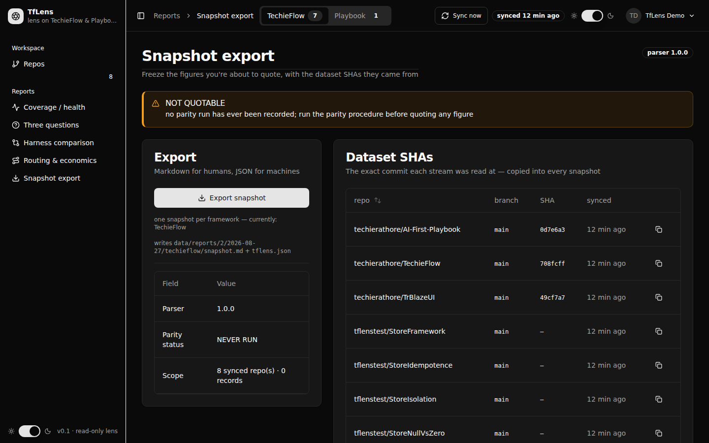

**What it is for.** Where a number stops being a dashboard reading and becomes something someone might
quote — so it is also the page that says whether quoting it is honest.

`Export.razor` renders `<ExportSurface UserId Framework />` for TechieFlow, and the same component
wrapped in `<PlaybookState>` for Playbook. The surface is byte-identical between the two states, which
is the point: they cannot drift apart into two slightly different export screens.

### Control → data path

| Region | Component | `data-testid` | Source |
|---|---|---|---|
| Parser badge | `Badge Variant=Outline` | `export-parser-version` | `ParserVersion.Current` |
| Quotable banner | `Alert Success`/`Warning AccentBorder` | `quotable-banner` | `ParityRecord.StatusFor(parity, ParserVersion.Current)` |
| Export button | `Button` | `export-now` | `ISnapshotExporter.ExportAsync(userId, framework, today)` → `SnapshotExporter` writes `snapshot.md` + `tflens.json` |
| Framework note | `<p>` | `export-framework-note` | `FrameworkLabel` |
| Target folder | `<p>` | `export-target` | `data/reports/{userId}/{yyyy-MM-dd}/{framework}` |
| Export facts | `DataTable … InitialPageSize="512"` | `export-facts` | Parser · Parity status · Scope (`{shaRows.Count} synced repo(s) · {RecordTotal} records`) |
| Dataset SHAs | `DataTable … InitialPageSize="512"` | `dataset-shas`, `dataset-shas-table`, `copy-sha-{slug}`, `dataset-shas-empty` | `ITelemetryStore.ReadSyncStateAsync(userId)` → `SELECT * FROM "SyncState" WHERE "UserId" = @aUserId ORDER BY "Repo"` |
| Copy SHA | `Button Variant=Ghost` | `copy-sha-{slug}` | `IJSRuntime.InvokeAsync<bool>("tflens.copyText", sha)` |
| Past snapshots | `DataTable … InitialPageSize="512"` | `snapshots`, `snapshots-table`, `snapshot-status-{slug}`, `snapshot-md-{slug}`, `snapshot-json-{slug}`, `snapshots-empty` | `ISnapshotExporter.ListAsync(userId)` — read back off the folder tree |
| Download links | `Button Variant=Link` | as above | `ExportEndpoints.DownloadUrl(date, framework, file)` → `GET /api/export/download`, `RequireAuthorization()` |
| Parity card | `Card` | `parity-record`, `parity-facts`, `parity-none`, `parity-output` | `ParityRecord.Read(options.ParityLastPath)` = `data/parity-last.json` |
| Compare output | `CodeBlock.razor` | `parity-output` | `ParityRecord.CompareOutput` |

**The quotable banner is the safety device of the whole product.** It is computed from
`data/parity-last.json` against the build's own parser version, and **there is no code path anywhere in
TfLens that can make it green by any other means**. While no parity run has been recorded, the honest
answer is `NOT QUOTABLE`, and that is what renders.

`BannerReason` distinguishes two facts that are both `NOT QUOTABLE`:

| `objParityStatus` | Reason rendered |
|---|---|
| `QUOTABLE` | "the parity run of {date} covers parser {version}; these figures may be quoted" |
| `NOT QUOTABLE` | "parser changed after the last parity run; re-run the parity procedure" |
| `NEVER RUN` (default) | "no parity run has ever been recorded; run the parity procedure before quoting any figure" |

Claiming the parser changed after a parity run that never happened would be a false statement about the
evidence. `NoParityMessage` draws the same distinction for the card below, and treats a *failed*
recorded run as exactly equal to no run at all.

`BannerLiteral` (`"{status} — {reason}"`) is set as the alert's `title` attribute so the exact wording
is one searchable string in the DOM.

### States

- **Loading** — `objIsLoaded` is guarded by `objLoadedKey == $"{UserId}|{Framework}"`, so a change of
  either re-reads. There is no skeleton on this surface; it renders with empty tables first.
- **Empty** — `dataset-shas-empty` ("no dataset SHAs yet", action → `/repos`) and `snapshots-empty`
  ("no snapshots yet").
- **Parity absent / failed** — `Alert Warning` `parity-none`.
- **Exporting** — `objIsExporting` disables the button and swaps in a `Spinner`; success and failure
  both toast, and `ReloadAsync` runs in `finally`.

### Gotchas

- **`objShaRows` and `objSnapshots` are rebuilt as fresh instances on every reload, never cleared in
  place.** `DataTable` takes its rows as a parameter, and a parameter whose reference has not changed is
  not re-processed — mutating these lists would leave a just-written snapshot invisible until the page
  was navigated away from.
- **The parity stamp is re-read on every load, never cached.** A parity run recorded while the page was
  open must turn the banner green on the next refresh, not on a restart.
- **All four `DataTable`s set `InitialPageSize="512"` deliberately.** Here truncation would be a
  *correctness* failure, not a cosmetic one: a truncated dataset-SHA table describes a dataset the
  snapshot did not actually cover, and the parity card's facts run to seven rows.
- **The Dataset SHAs table and the Scope fact are not framework-filtered.** `ReadSyncStateAsync` takes
  only a user id, so the table lists every repo on **both** axes while the header says TechieFlow.
  Verified live: 8 rows shown under a `TechieFlow 7 / Playbook 1` switch. If that matters for your
  change, filter by joining `"UserRepo"."Framework"` — the store has no framework-scoped overload of
  this read.
- `RecordTotal` sums the `"SyncState"` counters, so it reads `0` on seeded data
  ([gotcha 6](#cross-cutting-gotchas--read-these-first)).
- **There is deliberately no `/playbook` route.** The framework is chosen by the header switch, which
  re-queries every figure on the new axis.
- `CopyShaAsync` depends on `tflens.copyText` in `wwwroot/app.js` and reports a refusal honestly
  ("The browser refused clipboard access") rather than pretending it worked.
- Download links go through an authorized minimal-API endpoint that **derives the reports root from the
  auth cookie** and takes no user id, so one user cannot fetch another's snapshot by editing a query
  string.

### Deviation from `docs/TfLens-UIDesign.md`

- The design's past-snapshots table is `date · parser version · parity status · links`; the code adds a
  **framework** column between date and parser version. Correct — snapshots are per framework.
- The design puts `data-testid="snapshots"` on the table; the code puts it on the wrapping `<div>` and
  the table carries `snapshots-table`. Same pattern for `dataset-shas` / `dataset-shas-table`. Assert on
  the `-table` id.
- The design says the compare output is a `pre`; §Library gaps then says it must be `CodeBlock`. The
  code uses `Components/Pages/Export/CodeBlock.razor`, a local shim reproducing the documented shape
  (titled bar, copy action, monospaced scrolling body) because TrBlazeUI 2.0.0 ships no `CodeBlock`
  (TR-003). Drop it when the library ships the real one.

---

## The Playbook axis

Selecting **Playbook** in the header switch writes `tflens-framework=playbook` and raises
`ShellPreferences.Changed`; every report page answers by re-querying the engine on the new axis
(ADR-016), never by filtering what it already rendered.

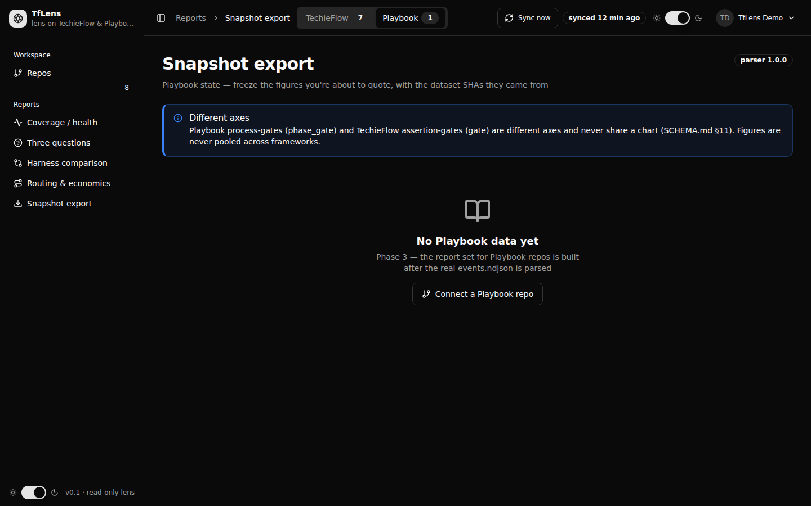

**Shared components** (`src/TfLens/Components/Shared/Playbook/`):

| Component | `data-testid` | Purpose |
|---|---|---|
| `PlaybookState.razor` | — | Loads `IPlaybookReportBuilder.BuildAsync(userId)` and picks the state |
| `PlaybookAxisNote.razor` | `playbook-axis-note` | The standing "Different axes" note (SCHEMA.md §11) |
| `PlaybookEmpty.razor` | `playbook-empty`, `playbook-empty-connect` | The Phase-3 empty state |
| — | `playbook-provisional` | Warning when `PlaybookAnalysis.SchemaStatus != Discovered` |
| `PlaybookPhaseTotals.razor`, `PlaybookAgentSplitPanel.razor`, `PlaybookObservedFields.razor` | — | Built, **not currently referenced by any page** |

`IPlaybookReportBuilder` is a deliberately separate interface from `IMetricsEngine` so a `phase_gate`
result can never be handed to a component expecting a TechieFlow `gate`. `PlaybookState` degrades a
failed read to "no data yet" rather than to a broken report page, keeping `LoadError` on a public
property — **which no page renders.**

### Deviation from `docs/TfLens-UIDesign.md` — the big one

The design says *"Every report page has a Playbook state selected by the header Framework switch"* with
the axis note *always* visible. **Only `/export` wraps its content in `<PlaybookState>`.** Verified live
with the switch on Playbook:

| Route | `playbook-axis-note` | `playbook-empty` | What actually renders |
|---|---|---|---|
| `/export` | ✅ | ✅ | Axis note, then the Phase-3 empty state |
| `/` | ❌ | ❌ | Normal Coverage layout: the one Playbook repo card, `events` stream row, "GREEN — 1 repos synced" |
| `/three-questions` | ❌ | ❌ | Normal layout, `three-questions-empty` ("No gate records yet") |
| `/harness` | ❌ | ❌ | Normal layout, three `—` columns, `tokens-chart-empty` |
| `/routing` | ❌ | ❌ | Normal layout, `drift-empty` |

So on four of five report routes a user on the Playbook axis sees TechieFlow-shaped empty states and
**no axis note at all** — the user-facing half of the `phase_gate` / `gate` separation rule is missing
exactly where a reader is most likely to conflate the two. The `PlaybookPhaseTotals` and
`PlaybookAgentSplitPanel` components the design specifies for the Three questions and Routing Playbook
states exist but are unreferenced.

Coverage on the Playbook axis does behave correctly in one respect: `FrameworkNames.Streams("playbook")`
returns a single `events` stream, so the repo card's table renders one row rather than four.

---

## Route and file index

| Route | File | Layout | Auth | Framework switch |
|---|---|---|---|---|
| `/login` | `Components/Pages/Auth/Login.razor` | `AuthLayout` | `[AllowAnonymous]` | — |
| `/register` | `Components/Pages/Auth/Register.razor` | `AuthLayout` | `[AllowAnonymous]` | — |
| `/forgot-password` | `Components/Pages/Auth/ForgotPassword.razor` | `AuthLayout` | `[AllowAnonymous]` | — |
| `/reset-password` | `Components/Pages/Auth/ResetPassword.razor` | `AuthLayout` | `[AllowAnonymous]` | — |
| `/profile` | `Components/Pages/Auth/Profile.razor` | `MainLayout` | `[Authorize]` | no |
| `/repos` | `Components/Pages/Repos.razor` | `MainLayout` | fallback policy | no |
| `/` | `Components/Pages/Coverage.razor` | `MainLayout` | fallback policy | **yes** |
| `/three-questions` | `Components/Pages/ThreeQuestions.razor` | `MainLayout` | fallback policy | **yes** |
| `/harness` | `Components/Pages/Harness.razor` | `MainLayout` | fallback policy | **yes** |
| `/routing` | `Components/Pages/Routing.razor` | `MainLayout` | fallback policy | **yes** |
| `/export` | `Components/Pages/Export.razor` + `Export/ExportSurface.razor` | `MainLayout` | fallback policy | **yes** |
| `/not-found` | `Components/Pages/NotFound.razor` | `MainLayout` | fallback policy | no |
| `/Error` | `Components/Pages/Error.razor` | — | — | — |

**Authorization is a fallback policy, not a per-route attribute** (`AuthRegistration.cs:92`). A page
added tomorrow is protected because nobody opted it in; the only way to be anonymous is to appear in
`AnonymousRoutes.Paths`:

```
/login  /register  /forgot-password  /reset-password  /healthz
/auth/login  /auth/register  /auth/forgot-password  /auth/reset-password
```

plus the prefixes `/_blazor`, `/_framework`, `/_content`, which the Blazor runtime needs before anybody
has signed in — without them the sign-in form cannot be interactive at all.

**Non-page endpoints:**

| Endpoint | Mapped in | Auth |
|---|---|---|
| `POST /auth/login`, `/auth/register`, `/auth/forgot-password`, `/auth/reset-password` | `AuthEndpoints.cs` | anonymous |
| `POST /auth/logout` | `AuthEndpoints.cs` | authorized |
| `GET /api/export/download` | `ExportEndpoints.cs` | authorized |
| `GET /healthz` | `HealthEndpoint.cs` | anonymous |
| **`GET /signout`** | **nowhere — 404** | — |
