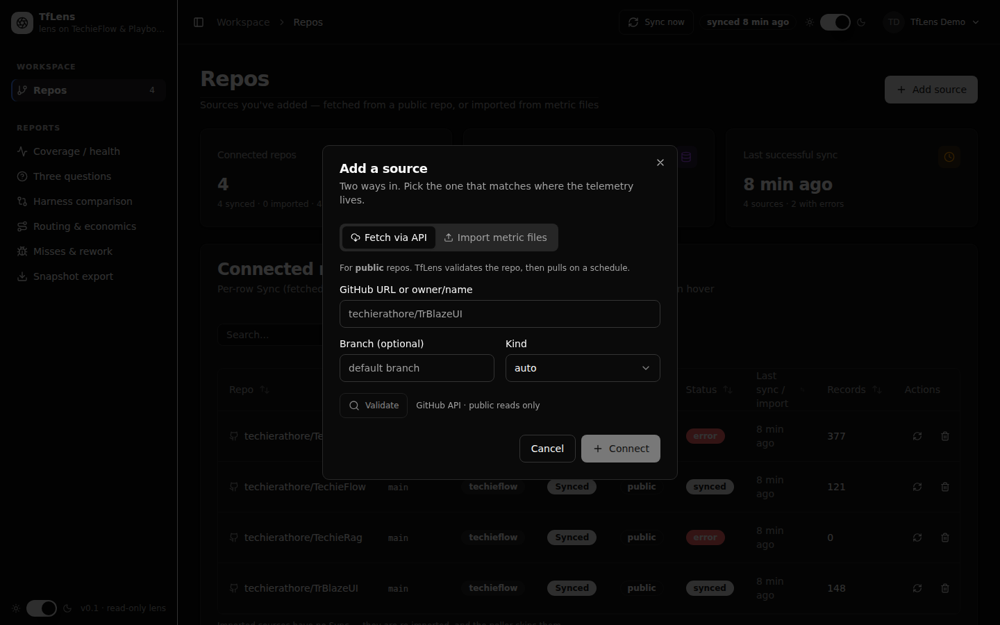
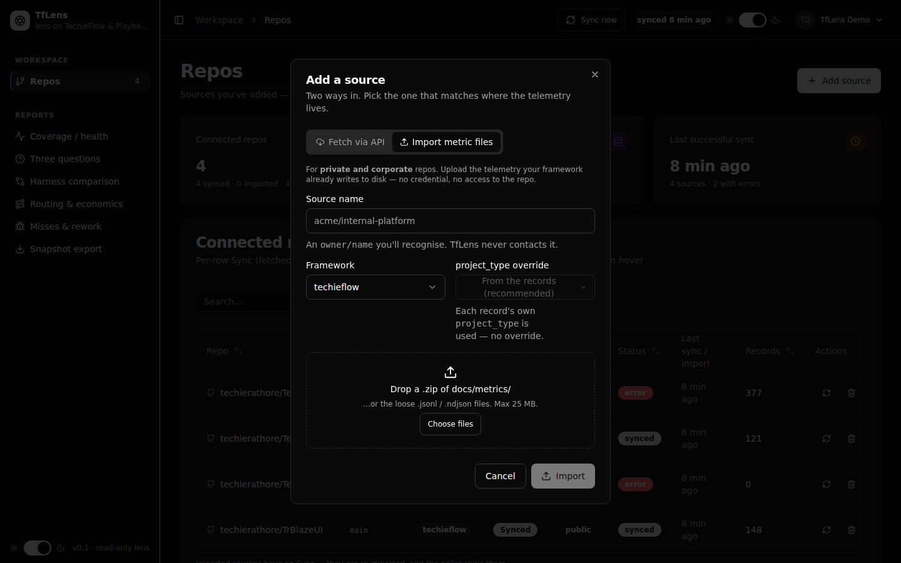
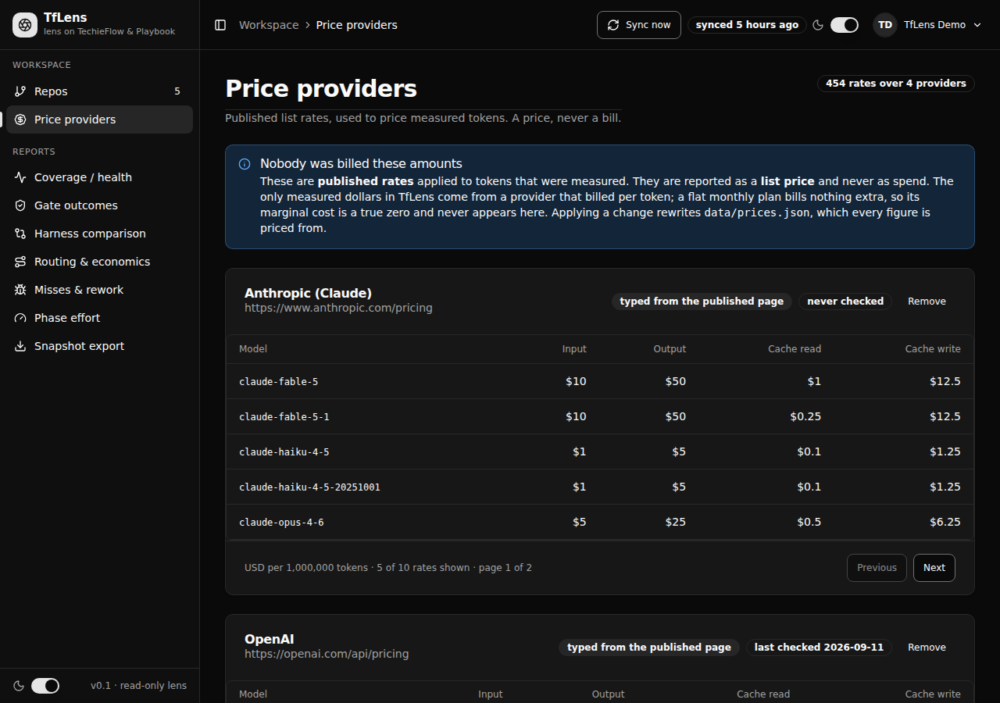
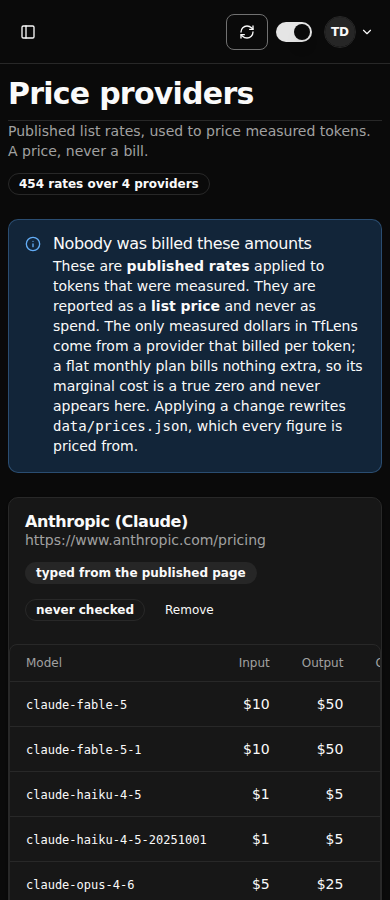
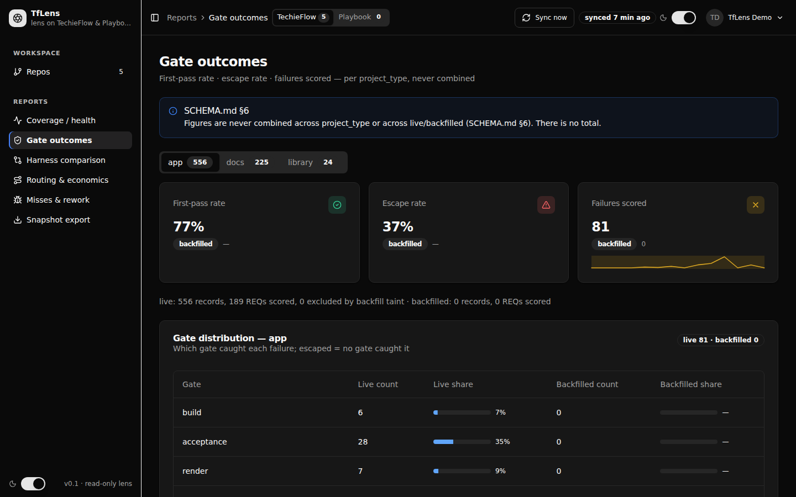
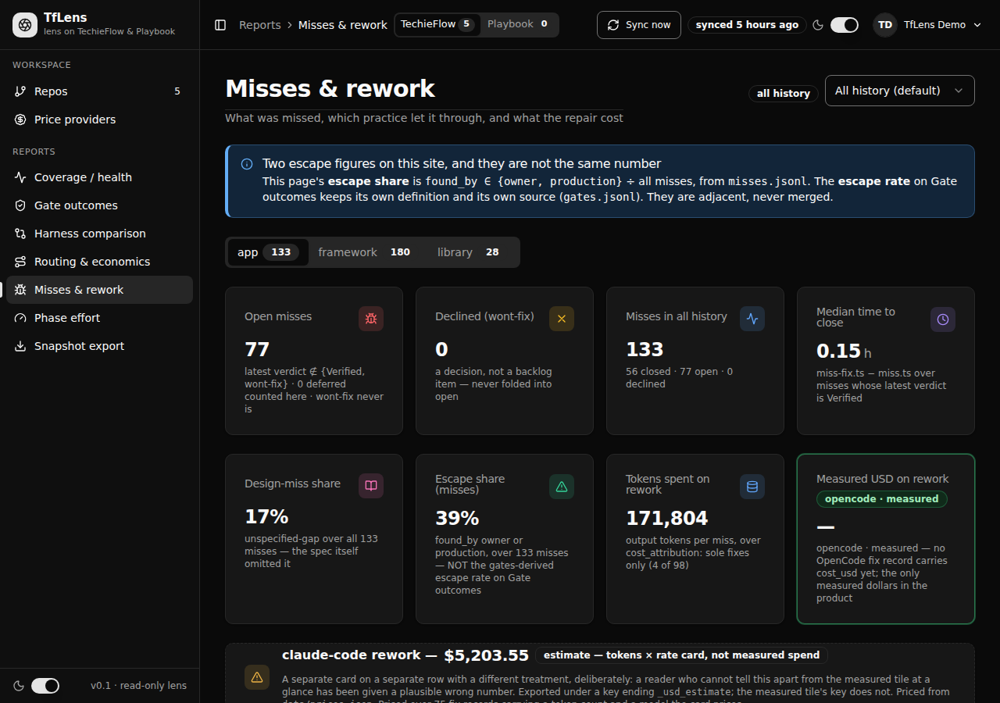
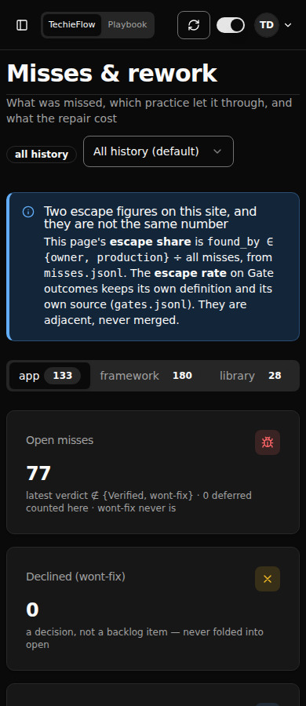
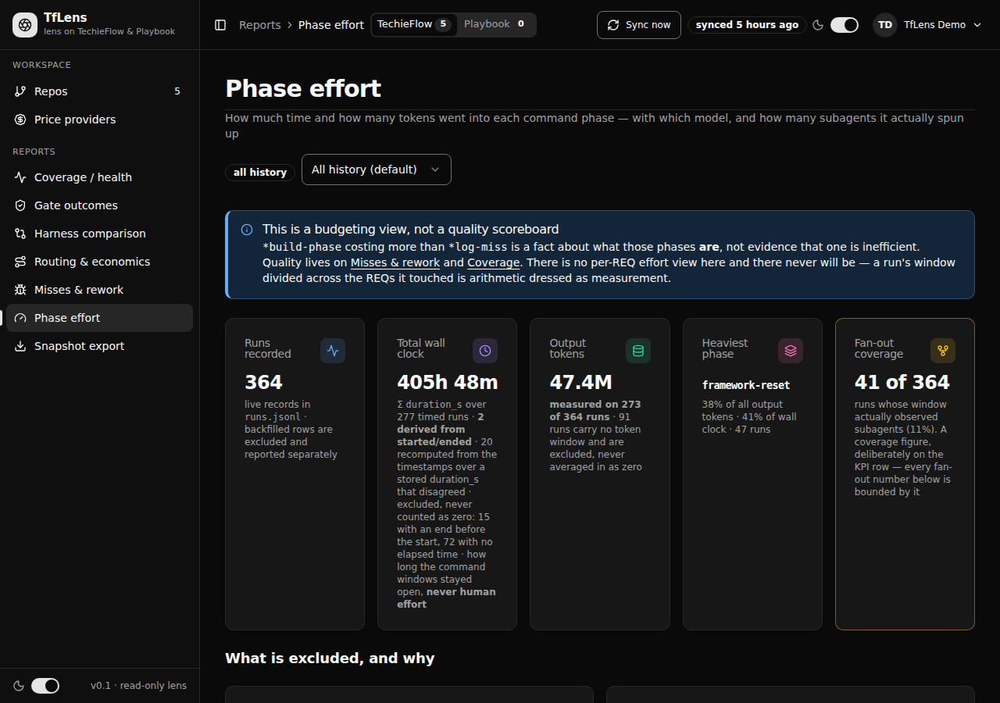
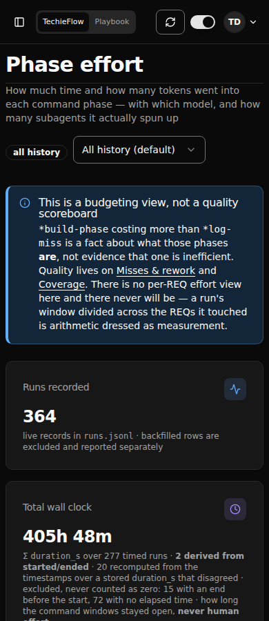

# TfLens Developer Guide — Screen-by-screen reference

This half of the guide is the map a developer follows to get from *"this thing on screen is wrong"* to
*"this method computes it"*. Everything below is the code **as built**, read out of the `.razor` and
service files and verified against the running app at `http://localhost:5014` (headless Chromium,
1440×900, signed in as `tflensdemo@techierathore.com`, AppManager userId `2`). Where the code and
`docs/TfLens-UIDesign.md` disagree, the disagreement is called out — those lines are the ones worth
reading twice.

Screenshots in `docs/devguide-images/` are a point-in-time capture. The dev database is shared, so row
counts in a shot will not match what you see today; the *structure* is what the shot is for.

---

> **Refreshed 2026-09-14 (Phase 3 handoff).** `/misses` was re-read against the code, and `/effort` and `/prices` were added. All three were runtime-observed at 1280 and 390 as `tflensdemo@techierathore.com`, with screenshots in `docs/screenshots/TfLens/`. TfLens now builds on TrBlazeUI 2.0.6, so gotchas 1, 2, 9, 10, 11 and 12 are fixed and their workarounds are gone. Every other section is as verified on 2026-09-02. Two defects found in the refresh were logged on their rows: REQ-UI-050 (the Playbook harness filter does nothing) and REQ-UI-072 (a single missing OpenRouter price is stored as zero). **Both were fixed and re-verified on 2026-09-15**; their entries below say how.

## Runtime-verified 2026-09-02 as `tflensdemo@techierathore.com` (userId 2, Manager)

Observed, not inferred. A full `*verify all` pass drove every screen below on a **Release** build at
`http://localhost:5099` with headless Chromium at **1280×800 and 390×844**, applying the data-render
gate (does every control listed in its *Control → data path* table actually render its data?) and the
visual-truth gate (does the screen look right — no overlap, no clipping, nothing off-canvas, no
horizontal page scroll?). Evidence: `tests/.artifacts/gates/render-visual.json` and the paired
screenshots `tests/.artifacts/gates/{screen}-{1280,390}.png`.

**A third gate now runs beside those two: `mockup-parity` (REQ-NFR-020 / BRD-144).** It grades each
built screen against its approved mockup in `docs/mockups/`, and it is the gate that matters most for
this table, because the two gates above cannot see design drift: a badge rendered as plain text has
text and does not overlap, and a value split mid-token is present and unclipped. Its 2026-08-29 first
run demoted 8 screens with 44 findings. **This run (2026-09-02): 2 PASS / 11 FAIL over 921 comparisons — 22 findings, 9 waived. Two are REAL and NEW (`/effort`, `/misses`); the rest are the adjudicated TF-012 sidebar clip, the owner-reserved auth-route overflow, and nine `/export` artefacts disproved by measurement.**

| Screen | Controls checked | Data render | Looks right | Mockup parity |
|---|---|---|---|---|
| `/login` | 8 | renders ✓ (runtime-confirmed 2026-08-30) | looks-right ✓ | PASS — doc overflow 390 delta **122 → 0** |
| `/register` | 12 | renders ✓ (runtime-confirmed 2026-08-30) | looks-right ✓ | **FAIL** — doc overflow 1280 delta 73, 390 delta 416 (owner-reserved) |
| `/forgot-password` | 4 | renders ✓ (runtime-confirmed 2026-08-30) | looks-right ✓ | PASS — doc overflow 390 delta **14 → 0** |
| `/reset-password` | 11 | renders ✓ (runtime-confirmed 2026-08-30) | looks-right ✓ | **FAIL** — doc overflow 390 delta 166 (owner-reserved) |
| `/profile` | 22 | renders ✓ (runtime-confirmed 2026-08-30) | looks-right ✓ | PASS (1 waiver: `profile-identity-note` — the mockup is wrong, not the app) |
| `/repos` | 35 | renders ✓ (runtime-confirmed 2026-08-30) | looks-right ✓ | PASS — 6 wrap findings cleared |
| `/` — Coverage / health | 58 | renders ✓ (runtime-confirmed 2026-08-30) | looks-right ✓ | PASS — 4 findings cleared |
| `/` — Coverage miss-quality card | 7 | renders ✓ (runtime-confirmed 2026-08-30) | looks-right ✓ | PASS |
| `/gate-outcomes` | 31 | renders ✓ (runtime-confirmed **2026-09-01**) | looks-right ✓ (runtime-confirmed **2026-09-01**, 1280 + 390) | **mockup-parity: CLEAN (2026-09-02)** — the `stat-sparkline` semantic-colour finding is CLOSED (`MISS-TfLens-20260901-03`): the trend line strokes `--chart-1` on the polyline, matching `docs/mockups/gate-outcomes.html:61`. This was the app's only `color` finding anywhere. The gate distribution now renders the reference's ten-gate order with a caveat badge on all three late gates (`REQ-FN-052`). `late-gate-app` icon belongs to `REQ-UI-022`; `app-sidebar` clip is the TF-012 false positive |
| `/harness` | 28 | renders ✓ (runtime-confirmed 2026-08-30) | looks-right ✓ | PASS — 2 findings cleared |
| `/routing` — drift · models · repricing · poolable | 23 · 8 · 19 · 13 | renders ✓ (runtime-confirmed 2026-08-30) | looks-right ✓ | PASS — **20 findings cleared**, the largest per-screen count |
| `/misses` | 105 | renders ✓ (runtime-confirmed **2026-09-02**) | looks-right ✓ (runtime-confirmed **2026-09-02**, 1280 + 390) | **mockup-parity: CLEAN (2026-09-02)** — `clip@390:misses-page` is CLOSED (`REQ-UI-038`, `MISS-TfLens-20260902-03`). Root cause was the `miss-type` tab strip measuring 361px inside a 342px container: content CUT OFF, not pushed out, which is why §4b passed it — that gate checks control boxes against the viewport, not a container's own scrollWidth. Now scrolls inside itself via `::deep [role="tablist"]`, the identical rule `GateOutcomes.razor.css` already carried. Only the `app-sidebar` TF-012 false positive remains |
| `/export` | 30 | renders ✓ (runtime-confirmed **2026-09-02**) | looks-right ✓ (runtime-confirmed **2026-09-02**, 1280 + 390) | **FAIL — all 9 findings are GATE ARTEFACTS, disproved by measurement, no app change indicated.** The app's `snapshots-table` has **6** columns to the mockup's **5** (the `framework` column, BRD-108/ADR-016), and the gate pairs cells positionally; its `wrap` verdicts come from uniform row height (73 vs 48px), while `snapshot.md` measures **one** line at both widths. `badge@export-now-icon` is a 40×40 button, radius 8px, tinted background — it has chrome. Logged under `REQ-NFR-020` |
| `/effort` — Phase effort | 40 (own spec) | renders ✓ (runtime-confirmed **2026-09-02**, via `ui-effort.spec.ts`) | looks-right ✓ (runtime-confirmed **2026-09-02**, 1280 + 390, both framework axes) | **mockup-parity: CLEAN (2026-09-02)** — the `wrap@390` + `token@390` on the per-phase detail is CLOSED (`REQ-UI-048`, `MISS-TfLens-20260902-02`). The mockup states the missing rule outright (`docs/mockups/effort.html:178`: `.tbl td .mono { overflow-wrap: normal; white-space: nowrap }`); the build never carried it, so the By-model column starved and `claude-opus-5` broke mid-token. A THIRD defect on this screen surfaced only after the store was replayed — the fan-out `4.5 · 9` pair wrapped to two lines — because that cell read `—` while the rows carrying `subagent_runs` were stale; fixing the data is what made the layout defect visible. All clear at both widths. NOTE: `/effort` is not in the shared `gates-render-visual` sweep — it carries its own render + visual gate inside `ui-effort.spec.ts`, which is why the shared 22-screen-state total does not include it |
| Playbook axis of all six report pages | 12 each (72) | renders ✓ (runtime-confirmed 2026-08-30) | looks-right ✓ | SKIPPED — empty state, no mockup to grade against |

**Zero** render-empty controls, **zero** render errors, **zero** visual failures and **zero** console
errors across all **22 screen-states / 487 controls** and **44 viewport checks** (2026-09-02).
Asset-integrity: **78 assets over 13 pages, 0 did not arrive, 0 redirects**. Acceptance: Playwright
**95 passed / 3 skipped of 101** and .NET **815/815** on Release (Core 647 / Guardrails 119 /
Integration 49). Perf `REQ-NFR-001`: **p95 load 412.7 ms against a 1500 ms budget @ concurrency 1**,
150 samples, 0 errors / 0 non-200 / 0 redirects.

**The two gates above still cannot see the two defects `mockup-parity` caught on 2026-09-02**, and
both are the TF-008 shape once more: on `/effort` a starved column splits `build-phase` mid-word, and
on `/misses` the per-miss detail is cut off inside its own container. Text that has wrapped is still
present, and a container that clips its own overflow pushes nothing off the viewport — so the
data-render and visual-truth gates pass both, correctly, on the questions they ask.

**Two rendering defects were fixed this run that no gate but `mockup-parity` could see, and both had
the same root cause** — worth knowing because it will recur. Blazor stamps the CSS-isolation scope
attribute **only on elements authored in the owning `.razor` file**; `StatTile` and `Card` render their
own root elements, so a bare `.tflens-measured { … }` rule in `Misses.razor.css` compiled to
`.tflens-measured[b-s2fwlvxw9p]` and **matched nothing**. The measured-USD tile's green ring and the
estimate card's dashed border had both been written on 2026-08-29 and neither was ever painted. The fix
is to anchor such a rule on an element the file *does* author and reach the component through `::deep`.

**One screen is NOT runtime-verified with data: the Playbook axis.** Every Playbook state above was
confirmed as its *empty* state (`playbook-axis-note` + `playbook-empty` + `playbook-empty-connect`,
with no TechieFlow figure leaking across the axis). No connected repository emits `events.ndjson`, so
the populated Playbook surface — the tabbed `pb-phases-*` panels behind `REQ-FN-067` / `REQ-FN-070` —
has never been driven with data and must not be read here as "renders". Its spec skips for want of a
dataset.

Three things a reader should know before trusting a screen here:

- **`/repos`, `/routing` and `/export` are horizontally scrollable at 390 px by design.** Their wide
  tables and the routing tab strip live in `overflow-x-auto` boxes, so controls sit outside the
  viewport and are reached by scrolling *that region*. The page body itself never scrolls sideways.
- ~~**Escape does not dismiss two dialogs.**~~ **Fixed 2026-08-27.** Escape now dismisses both the
  remove-repo `AlertDialog` and the connect-repo `Dialog` (including after a validation result is on
  screen). Root cause was a library gap, not page code: TrBlazeUI 2.0.0's `AlertDialog` ships no Escape
  handling and no `CloseOnEscape`/`Modal` parameter, and — unlike `Dialog` — has no
  `TrBlazeUI.Primitives` counterpart to inherit one from (`TR-014`). Worked around with a capture-phase
  `keydown` module (`Repos.razor.js`) invoking a `[JSInvokable]` dismiss on the page, which closes the
  remove dialog first, else the connect dialog when it is not mid-connect, and defers to an open
  `role="listbox"` so dismissing the Kind select does not close the dialog behind it.
- **The Playbook axis is finished on `/export` only.** *(Stale — superseded 2026-08-27; all five report
  pages now render the Playbook state. See the Playbook section below.)* `playbook-axis-note` /
  `playbook-empty` render
  there and nowhere else; `/`, `/gate-outcomes`, `/harness` and `/routing` re-query on the Playbook
  axis but reuse the TechieFlow surface with no axis note. `pb-phases-*` is not rendered by any page.
  The separation rule itself holds — no `gate-dist-*` table is ever populated on the Playbook axis, so
  `phase_gate` and `gate` never share a table.

---

## Observed 2026-08-28 — the Phase 3 screens

The three screens this build changed were driven again on the same Release build at
`http://localhost:5099`, headless Chromium at **1440×900**, signed in as
`tflensdemo@techierathore.com` (userId 2, Manager). This was a documentation observe pass, not a
`*verify all` run: it records **what rendered**, screen by screen, and each screen's section below
carries its own *Observed* block.

| Screen | `data-testid`s present | Tables (rows) | Blank icons | Page-level horizontal scroll | Console / page errors |
|---|---|---|---|---|---|
| `/misses` | 74 | `miss-origin` 2 · `miss-whymissed-table` 7 · `miss-origin-model-table` 1 · `miss-origin-agent-table` 1 · `miss-detail-table` 4 | 0 | none | none |
| `/repos` | 40 (+10 in the Add-source dialog, +8 in its import mode) | `repos-table` 4 | 0 | none | none |
| `/` — Coverage | 66 | four `repo-streams-*`, **5 rows each** | 0 | none | none |

**The live dataset is small on purpose, and small is not broken.** userId 2 holds **4 misses, 4
miss-fixes and 0 amendments**, all in one `project_type` segment (`framework`). So on `/misses` most
of the money figures legitimately render `—` and one distribution note renders
`insufficient data (n=1)`. That is the product working: an absent measurement is an em dash and a
figure below `MetricsConstants.MinN` is a refusal, never a zero. Before filing a bug against a `—` on
this page, check the record count behind it.

Screenshots refreshed by this pass: `docs/devguide-images/misses.png`, `repos.png`,
`repos-add-source.png`, `repos-import-mode.png`, `coverage.png`. Driver:
`tests/.artifacts/harness/devguide-shots-phase3.mjs`.

---

## Contents

- [How to run and drive it](#how-to-run-and-drive-it)
- [Cross-cutting gotchas — read these first](#cross-cutting-gotchas-read-these-first)
- [The shell: `MainLayout`](#the-shell-mainlayout)
- [`/login`](#login)
- [`/register`](#register)
- [`/forgot-password`](#forgot-password)
- [`/reset-password`](#reset-password)
- [`/profile`](#profile)
- [`/repos`](#repos)
- [`/prices`](#prices)
- [`/` — Coverage / health](#coverage-health)
- [`/gate-outcomes`](#gate-outcomes)
- [`/harness`](#harness)
- [`/routing`](#routing)
- [`/misses`](#misses)
- [`/effort`](#effort)
- [`/export`](#export)
- [The Playbook axis](#the-playbook-axis)
- [Route and file index](#route-and-file-index)

---

## How to run and drive it

```bash
export PATH="$HOME/.dotnet:$PATH"
dotnet run --project src/TfLens          # http://localhost:5014
```

The default launch profile in `src/TfLens/Properties/launchSettings.json` supplies
`TfLensDbConnection` (`Host=localhost;Port=5433;Database=tflens;Username=tflens;Password=tflensdev`),
so no environment setup is needed. PostgreSQL 16 runs as container `tflens-postgres` on `localhost:5433`.

To poke the database directly:

```bash
docker exec tflens-postgres psql -U tflens -d tflens -c '\dt'
```

**Driving it with Playwright.** After clicking `[data-testid="login-submit"]`, do **not** trust
`waitForLoadState('networkidle')` — a live Blazor circuit keeps the network busy and it resolves before
the real form POST navigates. Poll the URL instead:

```js
await p.click('[data-testid="login-submit"]');
for (let i = 0; i < 16; i++) { await p.waitForTimeout(1500); if (!p.url().includes('/login')) break; }
```

Working scripts to copy: `tests/.artifacts/harness/devguide-shots.mjs` (screenshots + per-screen probe),
`devguide-probe2.mjs` (Playbook axis + charts), `final-smoke.mjs`, `visual2.mjs`.

---

## Cross-cutting gotchas — read these first

Every one of these fails **silently**. None of them produces an error, a warning at runtime, or a
failing build.

### 1. `DataTable` truncates to `InitialPageSize` even with `ShowPagination="false"`

**Fixed in TrBlazeUI 2.0.6 (TR-009, closed 2026-09-13).** The workaround this gotcha described is gone from the code. The heading stays so older links still resolve.

### 2. `LucideIcon` resolves canonical names only — aliases render an invisible placeholder

**Fixed in TrBlazeUI 2.0.6 (TR-008, closed 2026-09-13).** The workaround this gotcha described is gone from the code. The heading stays so older links still resolve.

### 3. Cookie names must not contain `:`

A cookie *name* is an RFC 6265 token, in which `:` is a separator, so **ASP.NET Core silently drops any
request cookie containing one**. The browser stores and sends the colon form quite happily, so the
failure is invisible from the client. Under the original `tflens:theme` a light preference could never
reach the server and `App.razor` rendered dark on every fresh load regardless of what the user chose.

The three preference cookies are therefore hyphenated (`src/TfLens/Services/Ui/ThemeState.cs`):

| Constant | Value |
|---|---|
| `ThemeState.CookieName` | `tflens-theme` |
| `FrameworkState.CookieName` | `tflens-framework` |
| `SidebarPreference.CookieName` | `tflens-sidebar` |

Never reintroduce a colon. The auth cookie is `TfLensAuth` (`Program.cs`).

### 4. `IHttpContextAccessor.HttpContext` is `null` inside an interactive circuit

The circuit outlives the request that created it, so the server genuinely cannot see the request's
cookies once interactivity starts. `ShellPreferences`' constructor seeds from `IHttpContextAccessor`,
which works on the static-rendered host page (`App.razor`) and nowhere else.

Consequences you must respect:

- **Framework preference** is recovered from the browser on the shell's first render via
  `ShellPreferences.SyncFrameworkFromBrowserAsync()` (called from `MainLayout.OnAfterRenderAsync`).
  Without it, selecting Playbook wrote the cookie, the page re-queried correctly, and the next circuit
  read no cookie and silently fell back to TechieFlow.
- **This is why `FrameworkSwitch` deliberately does not `forceReload`.** A full reload starts a new
  circuit with no `HttpContext`, which re-seeded the default and threw the re-query away.
- **Theme** is reconciled the same way via `SyncThemeFromBrowserAsync()`, which asks the DOM whether
  `<html>` carries `dark` rather than reading a cookie.
- **Identity** must come from the cascading `AuthenticationState`, read through
  `ShellIdentity.UserId/Email/DisplayName/Initials` — not from `CurrentUser`, which resolves through
  `IHttpContextAccessor` and is only valid in request-scoped code such as `AuthEndpoints`.

### 5. `MemoryAnalysisCache` is keyed on the `SyncState` version

`CachingMetricsEngine` decorates `MetricsEngine` and keys the memoised `AnalysisResult` on
`$"{userId}|{framework}|{syncVersion}"`, where `syncVersion` is built from each repository's
`LastSha` + `LastSyncTs` off the `"SyncState"` rows (`CachingMetricsEngine.SyncVersionAsync`).

**Seeding rows straight into Postgres without touching `"SyncState"` serves a stale analysis until
restart** (entries also expire after 12h). If you seed test data, either write a `"SyncState"` row too
or call `IAnalysisCache.Invalidate(userId)`.

### 6. `"SyncState"` counters and the stream tables are two different sources of truth

They disagree all the time and nothing reconciles them:

| Reads `"SyncState"` counters | Reads the stream tables directly |
|---|---|
| `/repos` "Records synced" KPI, per-row Records column (`RepoListItem.RecordCount`) | `/` Coverage KPI row and every stream table (`ITelemetryStore.ReadCoverageFactsAsync`) |
| `/export` "Scope" fact and Dataset SHAs (`ExportSurface.ReloadAsync`) | `/gate-outcomes`, `/harness`, `/routing` (`IMetricsEngine`, `IExtraMetrics`) |
| `ShellState.RecordCount`, header last-sync badge | |

Verified live today: `"SyncState"` reports `RunsCount=0, GatesCount=0` for every repo of user 2, while
the tables hold 28 gates / 12 runs / 8 sessions / 10 commits. On screen that reads as **`/repos` "Records
synced 0"** and **`/export` "Scope: 0 records"** beside **`/` "Gate records 28"**. That is not a bug in
either page — it is two sources, and only `RebuildAsync` recomputes the counters (`PostgresStore.cs`,
the `UPDATE "SyncState" AS t SET "RunsCount" = (SELECT COUNT(*) …)` block).

A repository can also have a `"UserRepo"` row and **no** `"SyncState"` row. `Coverage` then shows
`not synced yet`; `/repos` shows status `pending`; `/export` omits it from Dataset SHAs entirely.

### 7. A `Figure` may only ever be rendered through `Components/Shared/FigureText.razor`

`Figure` (`src/TfLens.Core/Contracts/Figure.cs`) is one of three cases — `Value`,
`InsufficientData(n)` below `MetricsConstants.MinN` (= 3), or `NotApplicable`. It deliberately has **no
`Value` accessor that returns a default**: read it with `TryGetValue`, render it with
`FigureText`.

```razor
<FigureText Value="@vLive.FirstPassRate" TestId="@($"live-first-pass-{vType}")" />
```

`FigureText` prints `Value.Display()`, which is the number, `insufficient data (n=…)` in muted italics,
or an em dash. Binding `@Figure.ToString()` or reconstructing a number by hand is how a refusal-to-answer
turns into a flattering zero. `Figure.Value(...)` throws `ArgumentOutOfRangeException` if you try to
build a value with fewer than 3 supporting records, which is the backstop.

### 8. Missing `@using` degrades to a raw unknown element, not a build failure

Razor emits `RZ10012` (a *warning*) and renders `<empty>` / `<typographyh2>` as unstyled unknown tags.
`Repos.razor`'s empty state was invisible for exactly this reason. `Components/_Imports.razor` now
carries both `TrBlazeUI.Components.Empty` and `TrBlazeUI.Components.Typography`.

**Stale comments to ignore:** `Coverage.razor:28` ("TrBlazeUI 2.0.0 ships no Typography components"),
`GateOutcomes.razor:20` (TR-007, same claim) and `Routing.razor:15-18` ("These namespaces are NOT in
Components/_Imports.razor") all contradict the current `_Imports.razor`. `Repos.razor`, `Harness.razor`,
`Routing.razor` and `Export.razor` use `TypographyH2` successfully; `Coverage.razor` and
`GateOutcomes.razor` still hand-roll `<h1 class="text-2xl font-semibold">`. Both work — just do not
believe the comments.

### 9. `TabsTrigger` captures no unmatched attributes

**Fixed in TrBlazeUI 2.0.6 (TR-010, closed 2026-09-13).** The workaround this gotcha described is gone from the code. The heading stays so older links still resolve.

### 10. `trblazeui.css`'s spacing/sizing scale has **holes** — `w-20` renders at zero width

**Fixed in TrBlazeUI 2.0.6 (TR-021, closed 2026-09-13).** The workaround this gotcha described is gone from the code. The heading stays so older links still resolve.

### 11. `DialogContent` never scrolls, and the page has to own the scroll itself

**Fixed in TrBlazeUI 2.0.6 (TR-019, closed 2026-09-13).** The workaround this gotcha described is gone from the code. The heading stays so older links still resolve.

### 12. `SelectValue` shows the raw bound value until `SelectContent` has rendered once

**Fixed in TrBlazeUI 2.0.6 (TR-020, closed 2026-09-13).** The workaround this gotcha described is gone from the code. The heading stays so older links still resolve.

### 13. `SourceKind` has **two vocabularies** and they must never be collapsed

The `"UserRepo"."SourceKind"` column stores `api` | `import` (BRD-132). The badge on `/repos` and on
Coverage says **Synced** | **Imported**. These are two different vocabularies for one fact, and both
are deliberate: the stored value is a wire contract (it is also the export's `source_kind` key), the
badge wording is UI copy.

**Always render through `SourceKinds.DisplayName(...)`; never write either literal in markup.**

```razor
<Badge data-testid="@($"repo-source-{vRow.Repo.Name}")">
    @SourceKinds.DisplayName(vRow.Repo.SourceKind)
</Badge>
```

| Helper | Lives in | What it answers |
|---|---|---|
| `SourceKinds.Api` / `.Import` | `Contracts/IdentityRecords.cs` | the stored values, `api` / `import` |
| `SourceKinds.ApiLabel` / `.ImportLabel` | same | the badge words, `Synced` / `Imported` |
| `SourceKinds.DisplayName(kind)` | same | stored → badge; an absent or unrecognised value reads as `Api` |
| `ImportedSourceRules.IsImported` / `.CanSync` | `Import/ImportedSourceRules.cs` | aliases the same constants — the module declares no second vocabulary |

**The two were collapsed once during the 2026-08-28 build** — the stored value was briefly the badge
wording — and had to be undone. That would have made rewording a badge into a schema migration and
changed the export key under a downstream consumer. `tests/TfLens.Guardrails.Tests/SourceKindVocabularyTests.cs`
now pins it (`StoredSourceKindsAreTheBrdVocabulary`, `DisplayLabelsAreDistinctFromTheStoredValues`,
`AnUnknownStoredValueReadsAsFetched`), and `SourceKindIsNeverASegmentTests` pins the other half of
ADR-021: origin is *displayed* everywhere it could matter and **divides no figure**. Nothing in
TfLens branches on `SourceKind` except which sources the poller visits and which value stands as a
source's dataset identity.

---

## The shell: `MainLayout`

**File:** `src/TfLens/Components/Layout/MainLayout.razor` · default layout for every route
(`Routes.razor` sets `DefaultLayout="typeof(Layout.MainLayout)"`). The four anonymous auth pages
override it with `@layout AuthLayout`.


**What it is for.** The collapsible icon sidebar, the header (breadcrumb, Framework switch, Sync now,
theme toggle, user menu) and the page container that every authenticated screen renders inside.

### Control → data path

| Region | Component | `data-testid` | Service call | Behind it |
|---|---|---|---|---|
| Sidebar shell | `SidebarProvider CookieKey="@SidebarPreference.CookieName"` → `Sidebar` | `app-sidebar` | — | `tflens-sidebar` cookie, written by TrBlazeUI |
| Nav items | `SidebarMenuButton` ×7 | `nav-repos`, `nav-coverage`, `nav-gate-outcomes`, `nav-harness`, `nav-routing`, **`nav-misses`**, `nav-export` | — | `ShellNavigation.Items` (order, label, Lucide name, section, `HasFrameworkSwitch` all live here). `/misses` was added 2026-08-28 **between** Routing and Snapshot export, icon `bug` |
| Repo badge | `SidebarMenuBadge` | `nav-repo-count` | `ShellState.RepoCount` | `IRepoRegistry.ListAsync(userId)` → `SELECT * FROM "UserRepo" WHERE "UserId" = @aUserId` |
| Sidebar theme toggle | `ThemeToggle` | `theme-toggle-sidebar` | `ShellPreferences.SetThemeAsync` | JS `tflens.setTheme` → `tflens-theme` cookie + `<html class="dark">` |
| Breadcrumb | `Breadcrumb` in `ShellHeader.razor` | — | `ShellNavigation.Breadcrumb(path)` | static table; `/profile` comes from `ExtraCrumbs` |
| Framework switch | `FrameworkSwitch.razor` (`Tabs` as segmented control) | `framework-switch`, `framework-count-techieflow`, `framework-count-playbook` | `ShellPreferences.SetFrameworkAsync` + `ShellState.RepoCountFor(fw)` | `tflens-framework` cookie; raises `Changed`, which every report page answers by **re-querying** |
| Sync now | `SyncNowButton.razor` | `sync-now` | `IRepoSyncRunner.SyncAsync(userId)` | `RepoSyncRunner` → GitHub GET → `PostgresStore.UpsertAsync` → `WriteSyncStateAsync` |
| Last-sync badge | `Badge` | `last-sync-badge` | `RelativeTime.SyncBadge(ShellState.LastSyncUtc, now)` | max `LastSyncTs` over `"SyncState"` rows with no `LastError` |
| Theme toggle | `ThemeToggle` | `theme-toggle` | as above | — |
| User menu | `UserMenu.razor` (`DropdownMenu`) | `user-menu`, `user-menu-name`, `user-menu-email`, `user-menu-profile`, `user-menu-repos`, `user-menu-signout` | claims via `ShellIdentity` | cascading `AuthenticationState` |
| Toasts | `ToastProvider Position="BottomRight"` | — | `ToastService` | — |

`ShellHeader.ShowsFrameworkSwitch` → `ShellNavigation.ShowsFrameworkSwitch(path)` → the item's
`HasFrameworkSwitch` flag. It is **true on the six report routes only** (`/`, `/gate-outcomes`,
`/harness`, `/routing`, `/misses`, `/export`) — not on `/repos`, not on `/profile`. Verified live;
`/misses` observed carrying `framework-switch` on 2026-08-28.

### States

- **Loading** — `MainLayout.OnParametersSetAsync` awaits the cascading `AuthenticationState`, then
  `ShellState.EnsureLoadedAsync(userId)`. Until it returns, `RepoCount` is 0 and the badge shows `0`.
- **Empty** — `ShellState.Repos = []`. There is no distinct empty rendering; `IsLoaded` exists so a
  consumer *can* tell "no repos" from "not read yet", but the shell does not use it.
- **Error** — `ShellState.RefreshAsync` swallows the exception into `LoadError`, sets both lists empty
  and still raises `Changed`. **`LoadError` is never rendered anywhere.** A store outage looks exactly
  like an empty workspace in the shell.
- **Unauthenticated** — the fallback authorization policy (`AuthRegistration.cs:92`) redirects to
  `/login` before the layout renders.

### Gotchas

- **The repo badge is not framework-filtered.** It is `ShellState.RepoCount` (all repos, both axes),
  while the Framework-switch badges are `RepoCountFor(fw)` and Coverage counts only the selected axis.
  Live today: sidebar `8`, switch `TechieFlow 7` / `Playbook 1`, Coverage "7 repos". All three are
  correct and all three differ. Do not "fix" one to match another without deciding which question the
  badge is answering.
- **Rendering defect:** `SidebarMenuBadge` is a sibling of `SidebarMenuButton` inside `SidebarMenuItem`
  and currently renders on the line *below* the Repos link rather than inline on the row. Visible in
  every screenshot.
- `ShellState` resolves `IRepoRegistry` / `ITelemetryStore` **lazily** through `IServiceProvider`, not by
  constructor injection, so a missing registration degrades to an empty workspace instead of a startup
  failure. That also means a typo'd registration will never throw — it will just show `0`.
- Every subscriber (`MainLayout`, `Coverage`, `Repos`, `Harness`, `ThemeToggle`, `FrameworkSwitch`,
  `SyncNowButton`) implements `IDisposable` and unsubscribes from `ShellState.Changed` /
  `ShellPreferences.Changed`. **Add a subscription without a matching `Dispose` and you leak a handler
  per navigation.**
- **`/signout` is broken.** See [`/profile`](#profile) — it belongs to the user menu but the bug lives
  in `Program.cs` / `AuthEndpoints.cs`.

---

## `/login`

**File:** `src/TfLens/Components/Pages/Auth/Login.razor` · `@page "/login"` ·
`@layout AuthLayout` · `@attribute [AllowAnonymous]` · `@rendermode InteractiveServer`


**What it is for.** Sign in with an AppManager account. The credentials are checked *from the circuit*
so a failure keeps what the user typed and costs no page load; a success then posts the same form for
real, because only a genuine HTTP response can carry the auth cookie.

### Control → data path

| Control | Component | `data-testid` | Method | Behind it |
|---|---|---|---|---|
| Brand panel | `AuthLayout.razor` `aside.auth-brand` | `auth-brand-panel` | — | four hard-coded `Benefits` strings |
| Email | `Field` → `Input Type=Email` | `login-email` | `@bind-Value="objEmail"` | — |
| Password | `Input Type=@PasswordInputType` | `login-pass` | `@bind-Value="objPassword"` | — |
| Eye toggle | `Button Variant=Ghost Size=IconSmall` | `login-pass-toggle` | `TogglePasswordVisibility()` | flips `InputType.Text`/`Password`; icons `eye` / `eye-off` |
| Submit | `Button Type=Submit` | `login-submit` | `OnSubmitAsync()` | `IAppManagerClient.LoginAsync(email, pw)` → `POST /AuthSvc/login`, password RSA-OAEP-256 encrypted first |
| Real POST | `AuthForms.razor` (renders nothing) | — | `objForms.SubmitAsync(FormId)` | JS module `AuthForms.razor.js` → native `form.submit()` to `POST /auth/login` |
| Cookie issue | — | — | `AuthEndpoints.LoginAsync` | `AuthService.SignInAsync` → `IAuthSessionStore.CreateAsync` (`"AuthSession"`, tokens Data-Protection-encrypted) → cookie `TfLensAuth` carrying only the session id + display claims |
| Error | `Alert Variant=Danger` | `login-error` | `ApplyFailure(isLocked)` | two strings only |
| Reset confirmation | `Alert Variant=Success` | `login-reset-done` | `?reset=1` query | set by `/auth/reset-password` |
| Links | `Button Variant=Link` | `login-register-link` | — | `/forgot-password`, `/register` |

**The two-phase submit is the thing to understand.** `OnSubmitAsync` calls
`objForms.ReadAsync(FormId)` first (`SyncFromBrowserAsync`) so the rules are judged against what the
browser would actually post rather than a stale binding, then calls `LoginAsync` from the circuit. Only
on success does it hand the *same* form to `SubmitAsync`, and the spinner stays up until the browser
navigates. `AuthEndpoints.LoginAsync` re-validates the antiforgery token and calls AppManager a second
time — the round trip is deliberate, not redundant.

**Landing route** (`AuthEndpoints.LandingUrlAsync`): the local `returnUrl` if present, else `/repos`
when `ReadUserReposAsync` returns nothing, else `/`.

### States

- **Loading** — `objIsSubmitting` disables the button and swaps in `<Spinner>` + "Signing in…".
- **Error** — exactly two messages ever render. `GenericFailure` ("Sign-in failed. Check your email and
  password.") for everything, and `LockedMessage` ("Account locked — try again later") only for
  `AppManagerException.Codes.AccountLocked` (AppManager's 423). The AppManager code is logged and
  **never** reaches the browser — that is BRD-90, anti-enumeration, not a UX choice.
- **Fallback path** — if JS interop is unavailable the endpoint redirects back with `?error=invalid`
  or `?error=locked`, which `OnParametersSet` turns into the same two messages.

### Gotchas

- `AuthForms` **renders nothing**. If `objForms` is null (prerender, disconnected circuit) a *successful*
  credential check produces no cookie; the code logs `"Sign-in succeeded but the form helper was
  unavailable"` and shows the generic failure. A user who "signed in successfully but stayed on the
  login page" is this branch.
- Don't `waitForLoadState('networkidle')` after clicking submit — see
  [How to run and drive it](#how-to-run-and-drive-it).
- `LocalReturnUrl` rejects anything that is not a single-slash-rooted path (`//evil.example`,
  `/\evil.example`) rather than sanitising it. Do not relax that.

### Deviation from `docs/TfLens-UIDesign.md`

The design map specifies `TypographyH2` for the brand wordmark; `AuthLayout.razor` uses a plain
`<span class="auth-wordmark">`. Cosmetic, and the layout also supplies the `--sidebar` / `--alert-*`
design tokens TrBlazeUI 2.0.0 references but never defines (TR-001) — custom properties inherit, so
every control below picks them up. Do not delete `.auth-split` styling assuming it is decoration.

### Known issues (UAT 2026-08-28) — `REQ-UI-001` — **FIXED 2026-08-28**

- ~~**The whole screen collapses if `TfLens.styles.css` does not load.**~~ **Fixed 2026-08-28.** The
  `.auth-*` rules now live in `src/TfLens/wwwroot/app.css`, served straight from the web root, and
  `AuthLayout.razor.css` is deleted — so the anonymous layout no longer depends on the scoped bundle
  at all. `tests/verify/asset-integrity.spec.ts` serves `/login` with that bundle 404'd and asserts
  the split, the card width and the bullet rows survive. **Do not move these rules back into a
  co-located `.razor.css`.** What follows is the original diagnosis, kept because the *shape* of the
  failure is worth recognising. Every rule that laid this page out lived in
  `AuthLayout.razor.css`, i.e. in the Blazor scoped-CSS bundle. `trblazeui.css` and `app.css` are
  *not* enough: with them alone you get styled inputs and a dark theme laid out as one full-width
  column starting at x=0, which is exactly what the owner reported
  (`docs/uatissuessc/Login.png`). Reproduced pixel-for-pixel by serving `/login` with only that
  bundle 404'd. There is **no console error and no server log line** — the page just looks wrong.
  When triaging any "the page looks unstyled" report, check
  `curl -o /dev/null -w '%{http_code}' <base>/TfLens.styles.css` **first** — or just run
  `npx playwright test tests/verify/asset-integrity.spec.ts`, which now checks every declared
  stylesheet and script on `/login` and on the authenticated shell (REQ-NFR-015).
- Related repo hazard: `bin/` and `obj/` are tracked in git, and
  `bin/Debug/net10.0/TfLens.staticwebassets.runtime.json` carries **machine-absolute** content roots
  (`/mnt/c/…` after a WSL build, `C:\1MyCode\…` after a Windows build). See `REQ-NFR-016`.

---

## `/register`

**File:** `src/TfLens/Components/Pages/Auth/Register.razor` · `@page "/register"` · `AuthLayout` ·
`[AllowAnonymous]` · `InteractiveServer`


**What it is for.** Create an AppManager account. Every account is a Manager; there is no other role and
no licence.

### Control → data path

| Control | Component | `data-testid` | Method | Behind it |
|---|---|---|---|---|
| First / last name | `Input` in `trblazeui-col-6` | `reg-first`, `reg-last` | binds | — |
| Email | `Input Type=Email` | `reg-email` / error `reg-email-error` | binds | — |
| Password | `Input Type=Password` | `reg-pass` / `reg-pass-error` | binds | — |
| Strength meter | `PasswordStrengthMeter.razor` | `password-strength` | `PasswordRules` score | local `Progress` shim |
| Confirm | `Input Type=Password` | `reg-confirm` / `reg-confirm-error` | binds | — |
| Manager note | `Alert Variant=Info AccentBorder` | `reg-manager-note` | — | always rendered, never conditional |
| Submit | `Button Type=Submit` | `reg-submit` | `OnSubmitAsync()` | local rules → `objForms.SubmitAsync` → `POST /auth/register` |
| Account creation | — | — | `AuthEndpoints.RegisterAsync` | `AuthService.RegisterAsync` → `IAppManagerClient.RegisterAsync` with `applicationRoleCode: "Manager"`, then issues the same session a sign-in would |
| Form error | `Alert Variant=Danger` | `reg-error` | — | `GenericFailure` |

**Rules run locally first.** `PasswordRules.Describe(objPassword)`
(`src/TfLens.Core/AppManager/PasswordRules.cs`) applies every rule AppManager would apply, so a
predictable violation never reaches the API or its log. Confirm mismatch is checked here too. Only a
clean form is posted.

### States

- **Loading** — `objIsSubmitting` → spinner + "Creating account…".
- **Field errors** — `reg-email-error` ("already registered"), `reg-pass-error` (rule text),
  `reg-confirm-error` ("passwords differ"). `Field IsInvalid` drives the red styling.
- **Server refusal** — `AuthEndpoints` redirects back with `?error=duplicate|weak|<other>`;
  `OnParametersSet` maps those onto the same three targets, never onto a raw AppManager code.

### Gotchas

- Unlike `/login`, this page **does not** call AppManager from the circuit. It validates locally and
  posts straight through, so every server-side refusal costs a page load and arrives as a query
  parameter. Do not "optimise" this into a circuit call without also solving the cookie problem.
- `OnParametersSet` bails out early if `objEmailError` or `objFormError` is already set, so a query-string
  error never overwrites a local one on the same render.

### Deviation from `docs/TfLens-UIDesign.md`

§Library gaps says password strength must use TrBlazeUI's `PasswordStrength` control
(`Components/PasswordStrength/`). It does not exist in the installed TrBlazeUI.Components 2.0.0 (TR-003),
so `PasswordStrengthMeter.razor` composes the documented shape from the library's own `Progress` — which
is the fallback the same section names. Delete the shim the moment the library ships the real one.

---

## `/forgot-password`

**File:** `src/TfLens/Components/Pages/Auth/ForgotPassword.razor` · `@page "/forgot-password"` ·
`AuthLayout` · `[AllowAnonymous]` · `InteractiveServer`


**What it is for.** Ask AppManager to email a reset link. It has exactly one outcome.

### Control → data path

| Control | Component | `data-testid` | Method | Behind it |
|---|---|---|---|---|
| Email | `Input Type=Email` | `forgot-email` | binds | — |
| Submit | `Button Type=Submit` | `forgot-submit` | `OnSubmitAsync()` | `IAppManagerClient.ForgotPasswordAsync(email)` → `POST /AuthSvc/forgot-password` |
| Success | `Alert Variant=Success` **replacing the form** | `forgot-sent` | `objIsSent = true` | — |
| Back link | `Button Variant=Link` | `forgot-back` | — | `/login` |

### States

Loading (spinner + "Sending…"), then **success — always**. `IsSent` is `objIsSent || SentOutcome == "1"`,
where the query parameter covers the non-interactive `POST /auth/forgot-password` path.

There is **no error state**. `OnSubmitAsync` wraps the call in `try/catch`, logs a warning and swallows
it. That is deliberate: surfacing a failure would tell the caller something about the address, which is
the exact leak BRD-92 forbids.

### Gotchas

- **If reset emails stop arriving, this page will still say "Check your inbox".** Diagnose from the
  server log (`logs/tflens-*.log`, `"Forgot-password request could not be delivered to AppManager"`),
  never from the screen. Do not add a visible error path.
- Nothing on this page branches on whether the address exists — no wording, no layout, no code path.

---

## `/reset-password`

**File:** `src/TfLens/Components/Pages/Auth/ResetPassword.razor` · `@page "/reset-password"` ·
`AuthLayout` · `[AllowAnonymous]` · `InteractiveServer`

| Form state (`?token=…`) | Dead-link state (no token) |
|---|---|
|  |  |

**What it is for.** Complete a password reset against the token from the emailed link.

### Control → data path

| Control | Component | `data-testid` | Method | Behind it |
|---|---|---|---|---|
| New password | `Input Type=Password` + `PasswordStrengthMeter` | `reset-pass` / `reset-pass-error` | binds | `PasswordRules.Describe` |
| Confirm | `Input Type=Password` | `reset-confirm` / `reset-confirm-error` | binds | — |
| Submit | `Button Type=Submit` | `reset-submit` | `OnSubmitAsync()` | `IAppManagerClient.ResetPasswordAsync(token, newPassword)` |
| Success | `Alert Variant=Success` + `Button` | `reset-done`, `reset-signin` | `objIsDone = true` | replaces the form |
| Dead link | `Alert Variant=Danger` + `Button Variant=Outline` | `reset-invalid`, `reset-request-new` | `objIsLinkDead = true` | replaces the form |
| Form error | `Alert Variant=Danger` | `reset-error` | — | `GenericFailure` |

### States

Three mutually exclusive card bodies, in this precedence: `objIsDone` → success · `objIsLinkDead` →
dead link · otherwise the form.

`objIsLinkDead` is set by:
- `OnParametersSet` when `Token` is null/whitespace (verified: bare `/reset-password` renders "Link
  expired" immediately, no request made);
- `?error=expired` from the endpoint;
- `AppManagerException.Codes.InvalidResetToken` **or** `AppIdMismatch`.

Those last two deliberately collapse onto one sentence, so a wrong-tenant link is indistinguishable from
a stale one.

### Gotchas

- **The token is never rendered.** Not in a value, not in a hidden input, not in a message. It lives in
  a private `[SupplyParameterFromQuery]` field only. Do not add it to a `data-testid`, a log line, or a
  hidden field "for debugging".
- `InvalidLinkMessage` is one constant used by every dead-link path. If you split it into
  per-cause wording you have reintroduced the tenant-enumeration leak.

---

## `/profile`

**File:** `src/TfLens/Components/Pages/Auth/Profile.razor` · `@page "/profile"` ·
`@attribute [Authorize]` · `InteractiveServer` · `MainLayout` (breadcrumb `Account › Profile`, from
`ShellNavigation.ExtraCrumbs`; **no sidebar item**)


**What it is for.** Show the AppManager account TfLens reads but never stores, and change its password.

### Control → data path

| Region | Component | `data-testid` | Method | Behind it |
|---|---|---|---|---|
| Identity note | `Alert Variant=Info` | `profile-identity-note` | — | always |
| Avatar / name / email | `Avatar` + `CardTitle` + `CardDescription` | `profile-name`, `profile-email` | `AuthService.GetProfileAsync()` | `IAppManagerClient.GetProfileAsync(accessToken)` → `GET /UserSvc/profile` |
| Role badge | `Badge Variant=Secondary` | `profile-role-badge` | `const ManagerRole = "Manager"` | **a constant, not a field** — there is no other role |
| Values table | `DataTable TData=ProfileRow` | `profile-values` | `BuildRows()` | Email · Name · Role · Member since · Identity provider |
| Current password | `Input Type=Password` | `pw-current` / `pw-current-error` | binds | — |
| New password | `Input Type=Password` + `PasswordStrengthMeter` | `pw-new` / `pw-new-error` | binds | `PasswordRules.Describe` |
| Confirm | `Input Type=Password` | `pw-confirm` / `pw-confirm-error` | binds | — |
| Update | `Button Type=Submit` | `pw-submit` | `OnChangePasswordAsync()` | `AuthService.ChangePasswordAsync` → `POST /UserSvc/change-password`, both passwords RSA-encrypted server-side |
| Sign out | `UserMenu.razor` (shell) | `user-menu-signout` | `NavigateTo("/signout", forceLoad: true)` | **see the bug below** |

`DisplayName` / `Email` fall back to `CurrentUser` when AppManager has not answered, so the header of
the card is populated from claims even when the body shows the failure alert.

### States

- **Loading** — `objIsLoading` renders `Skeleton` circles/lines in the header and `profile-skeleton` in
  the body. Set false in `OnInitializedAsync` regardless of outcome.
- **Error** — `objLoadFailed` (i.e. `objProfile is null`) renders `Alert Variant=Warning`
  `profile-unavailable` — "AppManager did not answer. Reload the page to try again." The exception is
  logged as a warning, never shown.
- **Password success** — fields cleared + `ToastService.Success`.
- **Password failure** — `InvalidCurrentPassword` → `pw-current-error`; anything else → `pw-new-error`
  with the rules text; a non-`AppManagerException` → `ToastService.Error`.

### Gotchas

- **The `profile-values` table is one row from silent truncation.** It is the only `DataTable` in the
  app with no `InitialPageSize`, `BuildRows()` returns exactly 5, and the default page size is 5. Add a
  sixth field and it vanishes with no error. Set `InitialPageSize="16"` when you touch this file.
- **`/signout` returns 404 and does not sign the user out.** `UserMenu.OnSignOut` navigates to
  `/signout` with `forceLoad: true`, and `Program.cs:88` sets `aCookie.LogoutPath = "/signout"` — but
  `AuthEndpoints.MapAuthEndpoints` only maps `POST /auth/logout`. There is no `GET /signout` handler
  anywhere. Verified live: `GET /signout` → **404**, and the `TfLensAuth` cookie is **still present**
  afterwards. `/signout` is also absent from `AnonymousRoutes.Paths`. This is the only sign-out control
  in the app, so sign-out is currently non-functional. *(Reported, not fixed — this is a docs task.)*
- `AuthService.SignOutAsync` itself is correct: it calls AppManager's authenticated
  `POST /AuthSvc/logout` **with the bearer token** (a call without it is answered 401 and revokes
  nothing), then deletes the session row and clears the cookie regardless of AppManager's answer
  (BRD-4). Only the route into it is missing.

---

## `/repos`

**Files:** `src/TfLens/Components/Pages/Repos.razor` (+ `.razor.js`, `.razor.css`) · `@page "/repos"` ·
authenticated · `MainLayout` · breadcrumb `Workspace › Repos` · **no Framework switch**


**What it is for.** The only screen that writes. Add a source, sync one, re-import one, remove one.

**Changed 2026-08-28 (F-IMPORT).** There are now **two ways a source gets into TfLens**, and the page
forks on that from the first press to the last column:

| | *Fetch via API* | *Import metric files* |
|---|---|---|
| How data arrives | TfLens fetches from a public GitHub repo | the user uploads the metric files |
| Stored `SourceKind` | `api` | `import` |
| Source badge | **Synced** | **Imported** |
| Dataset identity | `"SyncState"."LastSha"` (commit SHA) | `"UserRepo"."BundleSha"` (sha256 of the bundle) |
| Row action | Sync (`repo-sync-{name}`) | **Re-import** (`repo-reimport-{name}`) |
| Poller visits it | yes | **never** — `ImportedSourceRules.CanSync` is false |
| Dialog flow | validate, *then* Connect | preview, *then* Import |

The two are one `Dialog` with two panels, not two dialogs. Origin is *delivery*, not data: it is
displayed here, on Coverage and in the export, and it **divides no figure** anywhere (ADR-021, and
`SourceKindIsNeverASegmentTests` pins it). See
[cross-cutting gotcha 13](#sourcekind-has-two-vocabularies-and-they-must-never-be-collapsed) before
you touch either vocabulary.




### Injected services

```razor
@inject IRepoListReader objRepoListReader   // == RepoRegistry (ReposRegistration.cs:46)
@inject RepoRegistry    objRepoRegistry     // the CONCRETE class, not IRepoRegistry
@inject IServiceProvider objServices        // IRepoSyncRunner resolved lazily
@inject ShellState objShellState
@inject ToastService objToastService
```

`RepoRegistry` implements both `IRepoRegistry` and `IRepoListReader`, and both interfaces are registered
as the *same* scoped instance. The page injects the concrete type because it needs the four-argument
`ValidateAsync`/`ConnectAsync` overloads that take a `kind` override — `IRepoRegistry` only declares the
three-argument ones.

### Control → data path

| Control | Component | `data-testid` | Method | Behind it |
|---|---|---|---|---|
| Add source | `Button` | `connect-repo` | `OpenAddSourceDialog(SourceKinds.Api)` | resets **both** panels' state, opens on the API mode |
| KPI: connected | `StatTile` | `kpi-repos` | `objRows.Count` | `RepoRegistry.ListWithCountsAsync(userId)`; the sub-line splits `n synced · n imported · n techieflow · n playbook` |
| KPI: records | `StatTile` | `kpi-records` | `objRows.Sum(r => r.RecordCount)` | **`"SyncState"` counters** — see gotcha 6 |
| KPI: last sync | `StatTile` | `kpi-last-sync` | `RelativeTime.Describe(ShellState.LastSyncUtc, now)` | max `LastSyncTs` with no error |
| Grid | `DataTable TData=RepoListItem ShowToolbar ShowPagination InitialPageSize="10"` | `repos-table` | `ListWithCountsAsync` | joins `"UserRepo"` to `"SyncState"` per user |
| Repo cell | `<a>` or plain span | — | `ImportedSourceRules.IsImported` | a fetched row links to `github.com/{repo}` with a `github` icon; an **imported row is not a link** and carries `hard-drive` — there is no GitHub page to open |
| **Source cell** | `Badge` | `repo-source-{name}` | `SourceKinds.DisplayName(row.Repo.SourceKind)` | **never a literal** — gotcha 13 |
| Status cell | `Badge` / `Tooltip` | `repo-status-{name}` | `RepoListItem.Status` | `pending` when `Sync is null`, `error` when `LastError is not null`, else `synced`; the tooltip carries the **redacted** `LastError` (`SyncErrorRedactor`) |
| Last sync / import | `<span>` | — | `LastActivityText(row)` | one column, two meanings — `LastSyncTs` for a fetched source, `LastImportTs` for an imported one |
| Row sync | `Button Variant=Ghost Size=IconSmall` | `repo-sync-{name}` | `SyncRepoAsync(row)` | **rendered only when `ImportedSourceRules.CanSync(kind)`** → `IRepoSyncRunner.SyncRepoAsync(userId, repo)` |
| Row re-import | `Button Variant=Ghost Size=IconSmall` | `repo-reimport-{name}` | `OpenReimportDialog(row)` | opens the same dialog straight onto the import panel, name and framework pre-filled and locked |
| Row remove | `Button Variant=Ghost Size=IconSmall` | `repo-remove-{name}` | `OpenRemoveDialog(row)` | identical for both source kinds |
| Source note | `<p>` | `repos-source-note` | — | *"Imported sources have no Sync — they are re-imported, and the poller skips them."* |
| Mode fork | `Tabs` → `TabsTrigger` ×2 | `source-mode`, `source-mode-api`, `source-mode-import` | `OnSourceModeChangedAsync` | switching modes calls `ForgetBundleAsync()` + `ResetPreview()` — a staged bundle never survives a mode change |
| — *Fetch via API panel* | `<div>` | `source-panel-api` | | |
| Connect input | `Input` | `connect-input` | binds | `RepoInputParser` accepts a URL or `owner/name` |
| Branch | `Input` | `connect-branch` | binds | null → default branch |
| Kind | `Select` | `connect-kind` | binds | `auto` / `techieflow` / `playbook` |
| Validate | `Button Variant=Outline` | `connect-validate` | `ValidateAsync()` | `RepoRegistry.ValidateAsync` → `IGitHubStreamFetcher.GetRepoAsync` + `PathExistsAsync` |
| Validation lines | `CheckLine.razor` ×3 | `connect-validation` | `RepoValidation.Exists/IsPublic/TelemetryPath` | — |
| **Private-repo exit** | `Alert Warning` + `Button` | `connect-private`, `connect-switch-import` | `SwitchToImportModeAsync()` | **new** — carries `objConnectInput` across into `objImportName` instead of dead-ending (BRD-100) |
| Connect | `Button` | `connect-submit` | `ConnectAsync()` | `RepoRegistry.ConnectAsync` (re-validates server-side) → `WriteUserRepoAsync` → queued first sync |
| — *Import metric files panel* | `<div>` | `source-panel-import` | | |
| Source name | `Input` | `import-name` | binds `objImportName` | `RepoInputParser` again — an imported source still has an `owner/name`; **disabled on a re-import** |
| Framework | `Select` | `import-framework` | binds | drives the expected path hint (`docs/metrics/` vs `verification/telemetry/`) |
| Project type | `Select` | `import-project-type` | — | **disabled by design**: the import service takes no override, so the records keep the type they were written with |
| Drop zone | `div.tflens-drop` + `<input type=file>` | `import-drop`, `import-choose`, `import-chosen` | `Repos.razor.js` `watchImport` / `openFilePicker` | capture-phase `dragover`/`drop` on `document`, because the zone lives inside a portalled dialog Blazor re-renders |
| Previewing | `Spinner` + text | `import-previewing` | `OnBundleSelectedAsync` `[JSInvokable]` | posts to `POST /api/import/preview` |
| Refusal | `Alert Danger` | `import-refusal` | `ImportResponse.Reason` → `RefusalTitle` | one of eight `ImportRefusalReason` values, message rendered verbatim |
| Preview card | `Card` + `DataTable InitialPageSize` | `import-preview`, `import-preview-streams`, `import-preview-summary`, `import-bundle-sha` | `objImportPreview` | per stream: records · date range · invalid lines; the badge is `BundleSha[..8]` |
| Framework mismatch | `Alert Warning` | `import-framework-mismatch` | `FrameworkMismatch(response.Framework)` | the bundle's own streams disagree with the chosen framework |
| Import | `Button` | `import-submit` | `ImportAsync()` | enabled only on `CanImport`; label reads *"Import {n} records"* — it states what pressing it writes |
| Import progress | `Progress` | `import-progress` | `objImportPhase` / `objImportProgress` | 30 → 80 → 100, a three-step estimate, not a measurement |
| Cancel | `Button Variant=Outline` | `add-source-cancel` | `CloseAddSourceDialogAsync()` | also calls `ForgetBundleAsync()` — closing the dialog drops the staged bytes |
| Remove confirm | `AlertDialog` | `remove-title`, `remove-description`, `remove-cancel`, `remove-confirm` | `ConfirmRemoveAsync()` | `RepoRegistry.RemoveAsync` → `ITelemetryStore.DeleteRepoDataAsync` + raw archive under `data/raw/` |
| Empty | `Empty` | `repos-empty`, `repos-empty-connect`, `repos-empty-import` | — | the empty state offers **both** modes |

### The import data path

The bytes **never enter the circuit**. `Repos.razor.js` posts them straight to a minimal-API endpoint
and only the file names and the total size cross into Blazor:

```
Repos.razor.js  postBundle(route, source)      // multipart/form-data, credentials: same-origin
   │                                            // buildStoredZip() bundles loose files client-side
   │                                            // __RequestVerificationToken lifted from the page
   ▼
POST /api/import/preview   ·   POST /api/import/commit      (Services/Import/ImportEndpoints.cs)
   │   .RequireAuthorization() + IAntiforgery.ValidateRequestAsync — both, on both routes
   ▼
TfLens.Core.Import.TelemetryImportService
   ├─ UploadBounds     — extension ∈ {.zip,.jsonl,.ndjson}; ≤ 25 MB; TryConfine() proves every
   │                     written path resolves inside data/raw/<userId>/
   ├─ SafeZipReader    — ≤ 512 entries, ≤ 100 MB expanded, ≤ 50 MB per entry; refuses absolute
   │                     paths, `..` segments and symlinks
   ├─ RollupDetector   — refuses a *computed* file (a rollup/snapshot) rather than raw records
   └─ then the SAME pipeline the fetcher uses:
      StreamParser → Dedupe → ITelemetryStore.UpsertAsync
```

Three things about that pipeline are the point of the design:

1. **Preview writes nothing at all.** `PreviewAsync` runs every gate and parses, then throws the
   result away; `CommitAsync` is the only press that writes. The preview's source name is the
   sentinel `TelemetryImportService.PreviewRepo` (`"(preview)"`).
2. **An imported record is indistinguishable from a fetched one once it is stored.** Same parser,
   same dedupe, same `UpsertAsync`, same tables. There is no `SourceKind` column on any stream table.
3. **The bytes land in the raw archive *before* anything parses them**
   (`data/raw/<userId>/<owner>/<name>/{stream}-{bundleSha}.jsonl`), so a parser exception after that
   point still leaves an archive that Coverage's **Rebuild** can replay.

`CommitAsync` then calls `StampSourceRowAsync`, which is where the source becomes real:

- **it creates the `"UserRepo"` row if there isn't one** — an import is how a private or corporate
  repository becomes a source at all (BRD-131), so it cannot require a prior connect that could never
  succeed. The created row is `SourceKind = import`, `IsPublic = false`, `BundleSha`, `LastImportTs`.
- **it writes the `"SyncState"` counts** — read back **from the stored rows**, not added up from what
  the bundle presented, so re-importing an identical bundle (which legitimately adds zero records)
  still leaves the row showing its true totals.
- **it clears `LastSha` in the same write.** The XOR of REQ-FN-084 spans two tables: `BundleSha` on
  `"UserRepo"`, `LastSha` on `"SyncState"`. A source connected by API and later imported would
  otherwise carry two answers to *"which bytes produced these figures"*, which is exactly the
  ambiguity a parity run exists to remove. `ImportedSourceRules.AssertSingleDatasetIdentity` asserts
  it at the end of the write.

**Every refusal is structural and none has an override** (REQ-NFR-014, REQ-FN-086) — the eight values
of `ImportRefusalReason` are `UnsupportedExtension`, `TooLarge`, `UnsafeArchive`, `PrecomputedRollup`,
`Empty`, `NothingRecognised`, `MixedFrameworks` and `None`. `PrecomputedRollup` is the interesting
one: a file of computed figures is refused *by name and by payload shape* (`RollupDetector`), because
importing somebody's rollup would let a number into TfLens that no record supports.

**`DeleteRepoDataAsync` removes all three layers**, scoped to `(userId, repo)`: every stream table row
(`"Run"`, `"Gate"`, `"Session"`, `"Commit"`, `"PbEvent"`), the `"SyncState"` row, and the `"UserRepo"`
row itself. `RepoRegistry.RemoveAsync` then removes the raw archive, which the store never touches.
Another user's copy of the same public repository is untouched.

**Connect is enabled only on `RepoValidation.IsConnectable`** — `Exists && IsPublic && TelemetryPath is
not null && !AlreadyConnected`.

### States

- **Loading** — `objIsLoaded == false` renders a `Card` of three `Skeleton` lines.
- **Empty** — `objRows.Count == 0` → `Empty` `repos-empty`.
- **Row syncing** — `objSyncingRepos` (a `HashSet<string>`) swaps the status cell and the row button
  for a `Spinner`.
- **Connect progress** — `connect-progress` with a `Progress` bar; `ConnectAsync` sets 15 → 55, then
  `WaitForFirstSyncAsync` polls `ListWithCountsAsync` **once a second for up to 30 seconds**, walking
  the bar to 95, until `Status != Pending`.
- **Rate limit** — `GitHubRateLimitException` → `Alert Variant=Warning` `connect-rate-limit`, on both
  Validate and Connect. Checked *before* the private/problem alerts, so a rate limit never masquerades
  as a validation failure.
- **Private repo** — `Alert Variant=Warning` `connect-private` with `RepoRegistry.PrivateRepoMessage`,
  **and an inline exit**: `connect-switch-import` moves the typed `owner/name` into the import panel.
  This is the one refusal on the page that now offers a way forward instead of dead-ending.
- **Other refusal** — `Alert` `connect-problem`, `Warning` when `AlreadyConnected`, else `Danger`.
- **Import: nothing staged** — the drop zone alone; `import-submit` is disabled (`CanImport` requires a
  preview *and* a name).
- **Import: previewing** — `import-previewing`, spinner; the file picker and drop are disabled.
- **Import: refused** — `import-refusal`, an `Alert Danger` whose title comes from the
  `ImportRefusalReason` and whose body is the service's message verbatim. No preview is shown.
- **Import: previewed** — `import-preview` with the per-stream table, the summary lines and the
  `import-bundle-sha` badge. Nothing has been written yet.
- **Import: committing** — `import-progress`, phase text plus a `Progress`. On success the dialog
  closes and a toast reads *"Imported"* / *"Re-imported"* with records added and duplicates collapsed.
- **Re-import** — the same dialog with `objIsReimport = true`: the title reads *"Re-import a source"*,
  the mode tabs are **not rendered**, and `import-name` is disabled.

### Observed 2026-08-28

Signed in as userId 2 at 1440×900. **40 `data-testid`s on the page**, `repos-table` with 4 rows, 0
blank icons, no page-level horizontal scroll, no console or page errors.

- All four rows are `Synced` (`repo-source-{name}` × 4), so the **Imported** badge and the
  `repo-reimport-{name}` action are documented from the code, not from a live row — this workspace
  has no imported source. KPI sub-line read `4 synced · 0 imported · 4 techieflow · 0 playbook`.
- Column order as rendered: Repo · Branch · Kind · **Source** · Visibility · Status · **Last sync /
  import** · Records · Actions.
- `repos-source-note` rendered.
- Add-source dialog opened: `source-mode`, `source-mode-api`, `source-mode-import`,
  `source-panel-api`, `connect-input`, `connect-branch`, `connect-kind`, `connect-validate`,
  `add-source-cancel`, `connect-submit`.
- Clicking `source-mode-import` swapped the panel: `source-panel-import`, `import-name`,
  `import-framework`, `import-project-type`, `import-drop`, `import-choose`, `add-source-cancel`,
  `import-submit`. The API panel's controls left the DOM entirely — the two panels are `@if`-forked,
  not hidden.
- Not exercised in this pass: an actual upload, the preview table, and any refusal path. Those are
  documented from `TelemetryImportService` / `ImportEndpoints`, not observed.

### Known issues (runtime-observed 2026-08-27)

- ~~**The remove-repo `AlertDialog` ignores Escape.**~~ **Fixed 2026-08-27 (REQ-UI-013, now `Verified`).**
  Escape dismisses the dialog and leaves every row in place; Cancel and the confirm path are unchanged.
  Pinned by `tests/verify/ui-auth-shell.spec.ts`, which Escapes twice in one test so a listener torn
  down after the first press fails the assertion.
- ~~**The connect-repo `Dialog` stops honouring Escape once a validation result is on screen.**~~
  **Fixed 2026-08-27** by the same `Repos.razor.js` handler — the REQ-UI-012 spec's branch log flipped
  from `false` to `true`. Both dialogs share one root cause: `TR-014`, TrBlazeUI's missing Escape
  support. If TrBlazeUI ever ships `CloseOnEscape`, this module is what to delete.
- **The `Actions` column renders no text by design** — the row Sync and Remove controls are icon-only
  buttons. A cell-level "is it blank?" check will report one blank cell per row on `repos-table`; that
  is the Actions column, not a data defect.
- **The demo account carries five `tflenstest/Store*` rows that are not real GitHub repos**, left
  behind by a build-phase store harness. They surface here and on Coverage as repos whose sync fails,
  and they inflate `Connected repos` to 8. They are database pollution, not user data — see the
  checklist's `*verify all` findings.

### 2026-08-28 — Add source and Remove are their own ROUTES now (`REQ-UI-044`)

This screen is the **grid only**. The three write flows moved out:

| Flow | Route | Page |
|---|---|---|
| Add a source | `/repos/add`, `/repos/add/{api\|import}` | `Components/Pages/AddSource.razor` |
| Re-import a source | `/repos/reimport/{Source}` | same page, re-import mode |
| Remove a source | `/repos/remove/{Source}` | `Components/Pages/RemoveSource.razor` |

`{Source}` is `owner/name` escaped once with `Uri.EscapeDataString` by the grid and unescaped once by
the page — the round trip is in `GoToRemove` / `GoToReimport` and the pages' `Source` parameter.

**Why, and what it bought.** They were a `Dialog` and an `AlertDialog` until the owner reported that
deleting or adding a source could leave the whole page dimmed and dead (a mounted `bg-black/80`
backdrop with no panel — `docs/uatissuessc/Repos-delete-issue.png`). Nine reproduction attempts here
could not produce that state, and a construct whose failure mode the harness cannot reproduce is one
the harness cannot sign off either. As routes there is **no backdrop to strand, no portal to miss, no
`body{overflow:hidden}` scroll lock to leak**, and no need for the page-owned Escape handler that only
existed because TrBlazeUI ships none (TR-014) — `Repos.razor.js` is deleted and its import half is
`AddSource.razor.js`. Back and Cancel are both aborts, and every flow has a URL you can paste into a
bug report. **Do not move these back into a dialog** — `UatEscapeTests.SourceFlowsAreRoutesAndNotDialogs`
and the `expectNoOverlay` assertions in `ui-auth-shell.spec.ts` will fail if you do.

Two TrBlazeUI traps cost a 500 on first render of each new page, both in the same family as TR-010:
`BreadcrumbLink` (TR-023) and `Typography*` (TR-013) **throw** on an unrecognised attribute rather
than ignoring it, so a `data-testid` on either is a runtime `InvalidOperationException`. Put the id on
a `<span>` inside. The build will not warn you.

### Known issues (UAT 2026-08-28)

- ~~**The KPI stat cards ship without the mockup's trend sparkline (`REQ-UI-011`).**~~
  **Fixed 2026-08-28.** The Records-synced tile now plots the real `DailySeries` (`ReadDailySeriesAsync`,
  the same source Coverage / Three-questions / Routing already used — `StatTile` supported `Sparkline`
  all along and this page simply never passed one). Measured live: 14 points, labelled
  `gate records per day, last 14 days — techieflow sources only`. **The label names the framework on
  purpose**: the series is one framework's while the tile's headline counts both, and an unlabelled
  line invites the reader to treat it as the headline's trend. `Connected repos` and
  `Last successful sync` deliberately get **no** sparkline — neither has stored history, and a line
  through invented points is the fabrication this product exists to prevent.
  **CORRECTED 2026-08-29 (`MISS-TfLens-20260829-21`, owner mockup-parity UAT).** The sentence above is
  half wrong, and it was wrong in the direction that matters: it claims `Connected repos` has no stored
  history, but every source carries a real `ConnectedTs`, and `BuildConnectedSeries` (`Repos.razor`)
  plots exactly that — when each repo was actually connected, cumulative by day. That tile has had a
  sparkline in the shipped build all along, and it is **not** a fabrication. Only `Last successful sync`
  has genuinely no history (only the latest sync per source is stored), and only that tile goes without.
  The code was right; this note and the matching inline comment were the stale artefacts, and both have
  been corrected. Recorded because a reader trusting this page would have "fixed" working code.
  **Also closed 2026-08-28** *(and REOPENED 2026-08-29 — see `MISS-TfLens-20260829-22`: the width was
  honoured but the placement was not. Measured at 1280x900 the input sat at **x=313, y=482** — left-
  aligned, on its own row below the description — because the header row was `flex-wrap` and the long
  description claimed the full width. Fixed for real on 2026-08-29 with `flex-nowrap` on that row plus
  the magnifier glyph the mockup shows and the build never had.)*: one `Filter repos…` input,
  right-aligned on the card-header row at 240px (`repos-filter`), with the DataTable's own toolbar
  switched off; Kind / Source / Status badges are colour-coded through `tflens-badge-*` tones
  (TrBlazeUI ships no info/success/warning variant — TR-016); Records is right-aligned; repo names are
  semibold. Cell padding was tightened to `0.625rem` so all nine columns fit at 1440 — before that the
  Remove button on every row was **clipped by the card edge**, visible but unpressable, and no
  measurement caught it because the grid had been squeezed to fit and so reported no overflow. Only
  the screenshot showed it. The previous divergence text follows for the record: the
  mockup has one right-aligned `Filter repos…` input on the section-header row, the build has a
  left-aligned `Search…` box plus separate `Filter` and `Columns` buttons on their own row. The
  breadcrumb axis chips (`TechieFlow n` / `Playbook n`) are absent.
- ~~**OWNER-REPORTED, NOT REPRODUCED: "deleting a repo disabled the whole page" and the same on Add
  source.**~~ **Closed 2026-08-28 by removing the construct** — see `REQ-UI-044` above. The failure
  was never reproduced; the overlay it depended on no longer exists, so it cannot recur. What
  follows is the original diagnosis, kept because the *reasoning* is the transferable part.
  (`docs/uatissuessc/Repos-delete-issue.png` — the `bg-black/80` backdrop mounted with no
  dialog panel.) Driven live here across nine variants — open / Cancel / Escape / outside-click /
  **confirmed** delete (rows 4→3, page stayed interactive, 0 console errors), the full
  Validate→Connect add flow, and each of `TfLens.styles.css`, `app.css`, `trblazeui.css`, `portal.js`
  and the server process removed — none reproduce it. Untested variable: **Edge on Windows**; every
  run here was headless Chromium. If you can reproduce it, capture the Network tab and
  `document.querySelector('.trblazeui-portal').children.length` at the moment the page goes dead.
- The checklist Remark on `REQ-UI-013` still carries the superseded 2026-08-27 "Escape does not
  dismiss" finding. Escape **does** dismiss (re-confirmed live 2026-08-28); the fix note above is the
  current truth.

### Gotchas

- **`WaitForFirstSyncAsync` blocks the circuit for up to 30 seconds.** If the first sync overruns,
  `ReportConnectOutcome` toasts "connected — the first sync is still running" rather than an error. A
  connect that "hangs" is this loop.
- `IRepoSyncRunner` is resolved with `GetService`, not `GetRequiredService`. If it is not registered,
  the row Sync button toasts *"Sync is not available in this build."* instead of throwing. Same pattern
  in `SyncNowButton`.
- The `Records` column and `kpi-records` read `"SyncState"` counters. Seeded rows show `0` here while
  Coverage shows the real totals. Not a bug in this page — [gotcha 6](#cross-cutting-gotchas-read-these-first).
- `ReloadAsync` also calls `ShellState.RefreshAsync(userId)`, which is what keeps the sidebar badge and
  the header last-sync badge in step after a connect/remove. Drop that call and the shell goes stale.
- `data-testid="repo-sync-{name}"` uses `UserRepo.Name` (the segment after `/`), not `owner/name`. Two
  connected repos with the same name under different owners collide on that id. The same is true of
  `repo-reimport-{name}` and `repo-source-{name}`.
- **`repo-sync-{name}` and `repo-reimport-{name}` are mutually exclusive.** A row renders exactly one
  of them, chosen by `ImportedSourceRules.CanSync`. A test that asserts a Sync button on every row
  will fail the moment a workspace holds an imported source — and a test that asserts *both* is
  asserting a state the page cannot produce.
- **The `Actions` column now renders one action button plus Remove**, not always two. The
  "is it blank?" note above still holds: they are icon-only.
- **The dialog body scrolls, the dialog does not.** `.tflens-dialog-body` is load-bearing — see
  [cross-cutting gotcha 11](#dialogcontent-never-scrolls-and-the-page-has-to-own-the-scroll-itself).
  Remove it and the import mode's footer goes below the fold at phone height. It also means a geometry
  gate can report a false overlap against the footer for a control scrolled out of view.
- **Closing or switching modes forgets the staged bundle** (`ForgetBundleAsync` → JS `clearBundle`).
  That is deliberate: a bundle staged under *Fetch via API* and committed after a mode switch would be
  imported into a source the user was no longer looking at. If you add a third mode, call it too.
- **The antiforgery token is read out of the page by the JS module**
  (`input[name="__RequestVerificationToken"]`), because the post is a hand-built `fetch`, not a Blazor
  form. Both endpoints call `IAntiforgery.ValidateRequestAsync` and answer an
  `AntiforgeryValidationException` as a refusal. If the token input ever stops being rendered on this
  page, import fails with a refusal that looks like a server problem.
- **`import-project-type` is disabled on purpose.** The import service takes no `project_type`
  override; records keep the type they were written with (SCHEMA.md §0.5). Enabling the control would
  be an offer TfLens cannot honour.
- **An imported row's `IsPublic` is `false` and that is not a private-repo warning.** It records that
  the source is not reachable over the API. Nothing polls it and nothing warns about it.

---

## `/prices`

**File:** `src/TfLens/Components/Pages/Prices.razor` (+ `Prices.razor.css`) · `@page "/prices"` · authenticated
(no `[Authorize]` on the page; the fallback policy at `Services/Auth/AuthRegistration.cs:92` requires a signed-in
user, and `/prices` is not in `Services/Auth/AnonymousRoutes.cs:23-31`) · `MainLayout` (`Components/Routes.razor:3`,
no `@layout` on the page) · Framework switch **not shown** (`Services/Ui/ShellNavigation.cs:65`, last argument
`HasFrameworkSwitch = false`)

Runtime-observed 2026-09-14 at 1280 and 390, signed in as tflensdemo@techierathore.com: renders, no error banner.
REQ-UI-072 Verified the same day, including mockup parity.




**What it is for.** Where every published rate comes from and when it was last checked. Each provider is
labelled as either read from its own endpoint or typed from its published page. It is an **input** screen, not a
report: every change here rewrites `prices.json`, the flat rate card that every money figure in TfLens is priced from.

### Control → data path

One load call: `objProviders = [.. await PriceProviders.LoadAsync(objOptions.Value.PriceProvidersPath)]` followed by
`objClashes = PriceProviders.Clashes(objProviders)` (`Prices.razor:466-467`, `src/TfLens.Core/Metrics/PriceProviders.cs`).
No database is involved. The page reads and writes two JSON files under `DataRoot`: `price-providers.json`
(`TfLensOptions.cs:331`) and `prices.json` (`TfLensOptions.cs:317`).

| Region | Component | `data-testid` | Source |
|---|---|---|---|
| Header count | `Badge Outline` | `prices-model-count` | `CountLabel` (`Prices.razor:430`): Σ `Models.Count` over `objProviders` |
| Standing note | `Alert Info` | `prices-standing-note` | constant text plus `objOptions.Value.PricesPath` (`:57`); always shown |
| Clash reporting | `Alert Warning` | `prices-clashes` | `objClashes` (`:61`) ← `PriceProviders.Clashes` (`PriceProviders.cs:250`); shown only when `Count > 0` |
| Loading | 3× `Card` of `Skeleton` | — | `objIsLoading` (`:74`) |
| Provider card | `Card` | `prices-provider-{id}` | one per `objProviders` entry (`:90-94`), in file order |
| Published-page link | `a.tflens-prices-source` | — | `PriceProvider.SourceUrl` (`:100-107`); "no published page recorded" when blank |
| Kind badge | `Badge Info` / `Badge Secondary` | `prices-kind-{id}` | `IsEndpoint` (`:751`): `Fetch == PriceFetch.Api` → "read from its endpoint", else "typed from the published page" (`:115-124`) |
| Last-checked badge | `Badge Outline` | `prices-checked-{id}` | `CheckedLabel` (`:756`): `LastChecked` or "never checked" |
| Refresh | `Button Outline Small` | `prices-refresh-{id}` | shown only when `IsEndpoint && ApiUrl` is not empty (`:128`); `OnClick` → `RefreshAsync` (`:501`) |
| Remove | `Button Ghost Small` | `prices-remove-{id}` | `OnClick` → `RemoveAsync` (`:604`); no confirmation step |
| No rates yet | `TypographyMuted` | — | `Models.Count == 0` (`:150`); the wording depends on `IsEndpoint` |
| Model filter | `InputGroup` → `InputGroupInput` | `prices-filter-{id}` | shown only when `PriceRatePage.NeedsFilter(count)`, i.e. more than 20 rates (`PriceRatePage.cs:40,80`); `ValueChanged` → `OnFilterChanged` (`:716`), which also resets the page to 0 |
| No filter match | `TypographyMuted.tflens-prices-nomatch` | — | `vPage.Rows.Count == 0` (`:182`) |
| Rate table | `DataTable<PriceProviderModel>` `ShowPagination=false` `Density=Compact` | `prices-table-{id}` | `vPage.Rows` ← `PageFor` (`:705`) ← `PriceRatePage.Of` (`PriceRatePage.cs:88`); columns `Model`, `InputPerMillion`, `OutputPerMillion`, `CacheReadPerMillion`, `CacheWritePerMillion` (`:205-238`), figures through `Usd` (`:779`) |
| Pager | 2× `Button Outline Small` | `prices-page-prev-{id}`, `prices-page-next-{id}` | shown when `HasPager` (more than 5 matches, `PriceRatePage.cs:43`); disabled by `CanGoBack` / `CanGoForward` (`:46,49`); `OnClick` → `GoToPage` (`Prices.razor:725`) |
| Pager caption | `span.tflens-prices-hint` | — | `FooterNote` (`:731`): the unit + `PriceRatePage.Summary` (`PriceRatePage.cs:55`) + for an endpoint provider "a rate the endpoint declines to publish is skipped, never stored as zero" |
| Add provider | `Card` + 3× `Input` + `Button` | `prices-add-provider`, `prices-new-name`, `prices-new-source`, `prices-new-api`, `prices-add` | `objNewName` / `objNewSource` / `objNewApi` (`:284-299`); `OnClick` → `AddAsync` (`:551`) |
| Add or change a rate | `Card` (a form card, **not** a dialog) + `NativeSelect` + 5× `Input` + `Button` | `prices-add-rate`, `prices-rate-provider`, `prices-rate-model`, `prices-rate-in`, `prices-rate-out`, `prices-rate-cr`, `prices-rate-cw`, `prices-save-rate` | the select's options are `objProviders` (`:332-335`), bound to `objRateProvider`; the rates are strings defaulting to `"0"` (`:424-427`); `OnClick` → `SaveRateAsync` (`:630`) |
| Result message | `Alert Info` / `Alert Warning` | `prices-message` | `objMessage` / `objIsMessageProblem` set by `Say` (`:483`); always in the DOM, hidden by `.tflens-prices-message-idle` (`Prices.razor.css:88`) until there is a message; focused in `OnAfterRenderAsync` (`:451-460`) |

**Call chain — load:** `Prices.razor:444 OnInitializedAsync` → `Prices.razor:464 ReloadAsync` →
`PriceProviders.cs:53 LoadAsync` → when the file is absent, `PriceProviders.cs:328 Seed` + `:139 SaveAsync`; otherwise
`:69 File.ReadAllTextAsync` → `:89 Parse` → then `PriceProviders.cs:250 Clashes`. Per card, at render time:
`Prices.razor:705 PageFor` → `PriceRatePage.cs:88 Of`.

**Call chain — refresh:** `Prices.razor:134 OnClick` → `Prices.razor:501 RefreshAsync` → `:539 FetchAsync` →
`:541 IHttpClientFactory.CreateClient` (30 s timeout, `:542`) → `:544 HttpClient.GetStringAsync(ApiUrl)` →
`PriceProviders.cs:275 ReadOpenRouter` (`:383 PerToken` multiplies by 1,000,000; `:304` skips any negative) →
`Prices.razor:515 Replace` → `:473 PersistAsync` → `PriceProviders.cs:139 SaveAsync` (`:202 File.WriteAllTextAsync`
`price-providers.json`) → `PriceProviders.cs:221 ApplyAsync` → `RateCard.cs:163 SaveAsync` (`prices.json`) →
`PriceProviders.cs:250 Clashes`.

**Call chain — add or change a rate:** `Prices.razor:376 OnClick` → `Prices.razor:630 SaveRateAsync` →
`:667 TypedRate` → `:773 TryRate` → `:677 WithRate` → `:690 Replace` → `:473 PersistAsync` → (same writes as refresh) →
`:696 ShowModel` → `PriceRatePage.cs:116 PageOf`.

**Call chain — add provider:** `Prices.razor:306 OnClick` → `Prices.razor:551 AddAsync` → `:762 IdOf` →
`:587 NewProvider` (`Fetch = Api` only when an endpoint was typed, `:596`) → `:473 PersistAsync` → (same writes).

**Call chain — remove provider:** `Prices.razor:143 OnClick` → `Prices.razor:604 RemoveAsync` →
`List.Remove` (`:610`) → `:473 PersistAsync` → (same writes; the removed provider's models drop out of `prices.json`).

### Where to break

| File:line | Function | Watch | Should hold |
|---|---|---|---|
| `src/TfLens.Core/Metrics/PriceProviders.cs:304` | `ReadOpenRouter` | `vIn`, `vOut`, `vCacheRead`, `vCacheWrite` (a `"-1"` arrives as `-1000000`) | the entry hits `continue` and never reaches `vModels` — never stored, never `0` |
| `src/TfLens/Components/Pages/Prices.razor:509` | `RefreshAsync` | `vModels.Count` | at `0` it returns before `Replace` at `:515`; both files are untouched |
| `src/TfLens/Components/Pages/Prices.razor:520` | `RefreshAsync` (catch) | `vError.GetType()` | `HttpRequestException` / `TaskCanceledException` / `JsonException` are all thrown inside `FetchAsync`, before `Replace`, so the stored and shown rates are unchanged and the message ends "unchanged" |
| `src/TfLens.Core/Metrics/PriceProviders.cs:232` | `ApplyAsync` | `vFlat.ContainsKey(vModel.Model)` | the first provider in file order wins; a later duplicate is skipped, never averaged |
| `src/TfLens.Core/Metrics/PriceProviders.cs:257` | `Clashes` | `aGroup.Count()` | every id priced more than once (compared case-insensitively) is listed in `prices-clashes` |
| `src/TfLens/Components/Pages/Prices.razor:641` | `SaveRateAsync` | `TypedRate(vModel)` | `null` for any negative or non-numeric rate; returns before `objIsBusy` is set and before `PersistAsync` |
| `src/TfLens/Services/Ui/PriceRatePage.cs:98` | `Of` | `vIndex`, `vPageCount`, `vMatches.Count` | the index is clamped into range; `Rows.Count` is at most 5 |
| `src/TfLens.Core/Metrics/PriceProviders.cs:59` | `LoadAsync` | `File.Exists(aPath)` | on a first run the four seeded providers are written to disk and returned |

### States

- **Loading** — three `Card`s of `Skeleton` while `objIsLoading` (`:74-88`). `Routes` render `InteractiveServer`
  (`App.razor:27`), so `OnInitializedAsync` (and therefore `LoadAsync`) can run once for the prerender pass and once
  for the circuit.
- **Error** — there is **no page-level error state**. `LoadAsync` turns a malformed or unreadable file into the seed
  (`PriceProviders.cs:73-82`) without saying so. Any other exception from load or from a write is not caught here.
- **Clash** — `Alert Warning` `prices-clashes`, listing the ids.
- **Provider with no rates** — "No rates yet. Refresh to read them from the endpoint." or "…Add a model below."
  (`:150-160`). The seeded OpenRouter provider starts this way (`PriceProviders.cs:376`).
- **Short provider** (5 rates or fewer, unfiltered) — no pager and no count in the caption, because `Summary` is `null`.
- **Long provider** (more than 20 rates) — the filter appears; a filter that matches nothing shows "No model id contains “…”".
- **Busy** — `objIsBusy` disables Refresh, Remove, Add provider and Save rate. It does **not** disable the pager,
  the filter or the form inputs.
- **Outcome** — `prices-message` shows Info on success and Warning when something needs the reader's attention
  (`:385-389`).
- **Empty book** — if every provider is removed, the file stays with an empty `providers` array and is **not**
  re-seeded (`LoadAsync` seeds only when the file is absent). The page then shows no cards and no empty state, the
  badge reads "0 rates over 0 providers", and the provider select has no options.

### Gotchas

- **Two files, one of them derived.** `price-providers.json` holds the rates and where they came from.
  `prices.json` is rebuilt from it on every Add, Remove, Save and successful Refresh (`PersistAsync`, `:473-477`).
  The Routing page's rate editor writes `prices.json` directly (`Routing.razor:1114`), so the next action on
  `/prices` **overwrites** that edit. The two writes are not atomic: if the second one fails, the two files disagree.
- **Refresh assumes the OpenRouter format for every endpoint.** `FetchAsync` always calls `ReadOpenRouter` (`:546`).
  A provider added with any other endpoint gets "returned no rates this reader could understand".
- **Refresh replaces the provider's whole model list** (`aProvider with { Models = vModels }`, `:515`). A rate typed
  by hand onto an endpoint provider is lost on its next refresh.
- **Saving one rate stamps the whole provider as checked today** (`WithRate`, `:684`). The last-checked badge is
  per provider, not per rate.
- **Fixed 2026-09-15:** `ReadOpenRouter` now skips a model when *either* `prompt` or `completion` is unreadable
  (unit test `PriceProviderTests.AModelWithOnlyOnePricePublishedIsSkippedRatherThanZeroed`). As found:
- **A missing price on one side is stored as zero.** `ReadOpenRouter` skips a model only when *both* `prompt` and
  `completion` are unreadable (`:294`), then stores `?? 0m` for any single missing price (`:311-314`). The comment at
  `:268` says an unreadable price is "skipped rather than stored at zero", so the comment and the code disagree. The
  `-1` rule itself (`:304`) is correct.
- **The page changes its in-memory list before writing.** `Replace` (`:515`, `:652`), `Add` (`:572`) and `Remove`
  (`:610`) all run before `PersistAsync`. If a write throws, the page shows a change the files do not hold.
- **`ArgumentOutOfRangeException` is only caught on Refresh** (`:524`). It comes from `SaveAsync` (`PriceProviders.cs:152`)
  when *any* model in the book has a negative rate. `Parse` accepts negatives from a hand-edited file, so the Refresh
  message can blame the provider being refreshed for another provider's rate. Add, Remove and Save have no handler
  for it.
- A malformed `price-providers.json` shows the seed. The next action then **overwrites** the broken file with the seed
  plus that edit.
- Model ids are matched case-insensitively when a rate is upserted (`:681`), when the flat card is built and when
  clashes are found. Provider ids are derived from the name (`IdOf`, `:762`): lower case, with every non-alphanumeric
  character turned into `-`.
- Remove has no confirmation. That matches the mockup, where Remove is a single button (`docs/mockups/prices.html:287`).
- The standing note prints the server-side `PricesPath` (`:57`).
- The page subscribes to neither `ShellState.Changed` nor `ShellPreferences.Changed`, so Sync now and theme or
  framework changes never reload it.
- The design table (`docs/TfLens-P3-UIDesign.md:137`) calls the provider picker a `Select`; the code uses
  `NativeSelect` (`:329`), on purpose (see the comment at `:326-328`).
- Whether `InputGroupInput.ValueChanged` fires on every keystroke or only on change: {unresolved — the 2.0.6
  `TrBlazeUI.Components.xml` documents `ValueChanged` only as "invoked when the input value changes" and names no
  update-timing parameter}.
- Tests: `tests/verify/ui-prices.spec.ts`, `tests/verify/ui-prices-openrouter.spec.ts`,
  `tests/verify/verify-prices.spec.ts`. The failed-refresh test (`verify-prices.spec.ts:335`) adds a probe provider
  whose endpoint is on the reserved `.invalid` domain.

### Defects found

- **REQ-UI-072 · Low · A single missing OpenRouter price is stored as zero** (logged on the row 2026-09-14; **fixed and re-verified 2026-09-15** — `ReadOpenRouter` now skips a model when either price is unreadable). `ReadOpenRouter` skips a model only when both `prompt` and `completion` are unreadable (`PriceProviders.cs:294`) and stores `?? 0m` for either one alone (`:311-314`). REQ-UI-072 says a rate the endpoint does not publish is never coerced to zero, and the method's own comment (`:268`) says the same. **Not affected:** the `-1` rule (`:304`), typed rates, clash reporting and the pager.

---

## `/` — Coverage / health

**File:** `src/TfLens/Components/Pages/Coverage.razor` · `@page "/"` · authenticated ·
`MainLayout` · breadcrumb `Reports › Coverage / health` · Framework switch **shown**


**What it is for.** "Every other number is suspect until this page is green." It reads the sync
bookkeeping *and the stored rows themselves* — never a cached summary — so what it shows is what the
store holds.

### Control → data path

| Region | Component | `data-testid` | Method | Behind it |
|---|---|---|---|---|
| Parser badge | `Badge Variant=Outline` | `coverage-parser` | `ParserVersion.Current`, `objCards.Count` | — |
| Status strip | `Alert Success`/`Warning` | `coverage-status` | `StatusHeadline` / `StatusDetail` ← `BuildWarnings()` | sync errors, stale streams, undocumented fields, `v > 1` records — in that order |
| KPI: repos synced | `StatTile` | `kpi-repos-synced` | `SyncedRepoCount` / `objCards.Count` | cards whose `Sync?.LastError is null` |
| KPI: gate records | `StatTile` | `kpi-gate-records` | `GateRecordTotal`, `GateRecordsLive`, `GateRecordsBackfilled` | `Σ` of each card's `gates` stream row |
| KPI: newest age | `StatTile` | `kpi-newest-age` | `NewestRecord()` → `AgeText` | max `NewestTs` across all shown streams |
| KPI: sync errors | `StatTile` | `kpi-sync-errors` | `SyncErrorCount`, `LastErrorDetail` | `"SyncState"."LastError"` |
| Repo card | `Card` | `repo-card-{name}` | `BuildCard(repo, syncStates)` | one per repo on the **selected framework** |
| **Source badge** | `Badge` | `repo-source-badge-{name}` | `SourceKinds.DisplayName(repo.SourceKind)` | **Synced** / **Imported**; origin is shown here and pools nowhere (BRD-136) |
| SHA badge | `<a>` **or** plain `<span>` + `Badge` | `repo-sha-{name}` | `RepoCard.ShortSha` ← `ImportedSourceRules.DatasetIdentity(Sync?.LastSha, Repo.BundleSha)` | a fetched source shows the commit SHA and **links** to `github.com/{repo}/commit/{sha}`; an imported source shows `sha256 {8 chars}` of the bundle and is **not a link** — there is no commit to open (ADR-022) |
| Status badge | `Badge` | `repo-state-{name}` | `RepoCard.StatusText` | `sync error` / `N streams stale` / `not synced yet` / `imported` / `synced` |
| Stream table | `DataTable TData=StreamRow … InitialPageSize="16"` | `repo-streams-{name}` | `BuildRow(repo, stream, isImported)` | rows come from `FrameworkNames.Streams(framework)` — **five** on TechieFlow since 2026-08-28 |
| Stale badge | `Badge Variant=Destructive` | `stale-{name}-{stream}` | `StreamRow.IsStale` | cadence stream **and** `DaysSince >= StalenessDays` **and not imported** |
| Staleness alert | `Alert Warning AccentBorder` | `repo-stale-{name}` | `StalenessMessage(staleStreams)` | names the streams and the configured threshold; **fetched sources only** |
| **Import-age alert** | `Alert Info AccentBorder` | `repo-import-age-{name}` | `ImportAgeMessage(card)` | replaces the staleness alert on an imported source: *"Imported {n} days ago. This source can't refresh itself — re-import to update."* |
| **No-fixes alert** | `Alert Warning AccentBorder` | `repo-no-fixes-{name}` | `objReposWithoutFixes` | this repo emitted `miss` records and no `miss-fix` record |
| **Reclassified alert** | `Alert Warning AccentBorder` | `repo-reclassified-{name}` | `DeclaredTypesFor(repo)` when `Count > 1` | names both `project_type` segments as **periods** of one project |
| Per-repo error | `Alert Danger` | `repo-error-{name}` | `Sync.LastError` | redacted at write time |
| **Miss data quality** | `Card` | `miss-quality`, `miss-quality-total`, `escapes-missing-why`, `orphan-misses`, `miss-backfilled`, `misses-without-fixes`, `reclassified-summary` | `MissFigures.Compute(...)` over this user's miss streams | counts only — **there is no rate anywhere in this card** |
| Unknown fields | `Collapsible` | `unknown-fields`, `unknown-fields-trigger`, `unknown-group-{key}`, `unknown-fields-none` | `BuildUnknownFields()` | field **names only** |
| Newer-schema alert | `Alert Info` | `schema-version-alert` | `objAboveSchemaV1` | records with `"V" > 1` |
| Rebuild | `Card` + `AlertDialog` | `rebuild-card`, `rebuild`, `rebuild-title`, `rebuild-cancel`, `rebuild-confirm`, `rebuild-progress`, `rebuild-report`, `rebuild-per-stream` | `ConfirmRebuildAsync()` | `ITelemetryStore.RebuildAsync(userId)` |

### The SQL behind the numbers

All of it is `PostgresStore.ReadCoverageFactsAsync`, three `UNION ALL` queries against the stream
tables (**not** `"SyncState"`):

```sql
-- StreamCoverageSql (records, backfilled, newest per repo+stream)
SELECT "Repo", 'runs' AS "Stream", COUNT(*)::int AS "Records",
       COUNT(*) FILTER (WHERE "Backfilled")::int AS "Backfilled", MAX("Ts") AS "NewestTs"
FROM "Run" WHERE "UserId" = @aUserId GROUP BY "Repo"
UNION ALL … "Gate" … "Session" … "Commit" … "PbEvent"
```

- `"Ts"` is ISO-8601 **text**, whose lexical order is its chronological order, so `MAX` is the newest
  record without a cast.
- Only `"Run"` and `"Gate"` carry a `"Backfilled"` column. The other three select a literal `0`, and
  `StreamRow.BackfilledText` renders `—` for them via `CarriesBackfilled` — an em dash, not a zero,
  because the fact was never captured.
- Unknown fields come from `LATERAL jsonb_object_keys("Overflow")`. The store returns **names only,
  already filtered to what SCHEMA.md does not document** — an `Overflow` payload must never reach a
  caller.
- Newer-schema facts come from `MAX("V")::int … WHERE "V" > 1`.
- **The `misses` row is one stream over three tables.** `"Miss"`, `"MissFix"` and `"MissAmend"` are
  `UNION`ed inside the `misses` branch and reported as a **single** row per repository, because
  `misses.jsonl` is one file (ADR-018). Do not "fix" this into three rows — Coverage counts streams as
  the emitter writes them.

### The miss data-quality card

`Coverage.razor` calls `MissFigures.Compute` itself over `ReadMissesAsync` / `ReadMissFixesAsync` /
`ReadMissAmendsAsync` / `ReadRunsAsync` — **the same engine call `/misses` renders**, so this page
cannot report a different number from that one. What it renders is deliberately restricted to
**counts**, and every one of them is a fact about the *records*, not about the work:

| Fact | `data-testid` | Source | Why it is here and not on `/misses` |
|---|---|---|---|
| `n misses · n fixes` | `miss-quality-total` | `MissesTotal`, `MissFixesTotal` | scale of the stream |
| Escapes with no `why_missed` | `escapes-missing-why` | `MissAnalysis.EscapesMissingWhy` | something got past every gate and nobody recorded why — the most valuable record in the stream, arriving incomplete |
| Records that link to nothing | `orphan-misses` | `OrphanFixes` + `OrphanAmends` + `AmendmentsIgnored` | counted rather than dropped: a dropped orphan is a fact nobody can see |
| Backfilled, held out of every miss figure | `miss-backfilled` | `BackfilledMissesExcluded`, `BackfilledMissFixesExcluded` | the third provenance separation, **applied and displayed** |
| Misses recorded, no fixes recorded | `misses-without-fixes` (workspace) · `repo-no-fixes-{name}` (per repo) | `objReposWithoutFixes` | a **telemetry gap, not a defect backlog** — with no fixes every miss reads as open and no time-to-close or rework-cost figure exists at all |
| Reclassification split | `reclassified-summary` (workspace) · `repo-reclassified-{name}` (per repo) | `DeclaredTypesFor(repo)` | a repo appearing under more than one `project_type`; the segments are **never pooled**, so each is described as a *period* of the project |

`EscapesMissingWhy` is bounded by the same eligibility floor the `/misses` distribution uses —
`MetricsConstants.FieldSince["why_missed"] = 2026-08-28`. An escape written before the field existed
had no field to leave empty, so counting it would raise the warning loudest against exactly the
records nobody can now complete.

All of these become **warnings** in the status strip (`BuildWarnings`), in this order: sync failures →
stale streams → misses-without-fixes → escapes-missing-why → orphan records → reclassification →
undocumented fields → `v > 1`. **None of them is an error and none reddens a repo's health badge.**
An incomplete stream is a habit still forming, not a broken system.

### States

- **Loading** — `objIsLoaded == false` → one `Card` with three `Skeleton` lines.
- **Error** — `ReloadAsync` catches everything into `objLoadError` and renders `Alert Danger`
  `coverage-error` with the raw exception message. Cards, unknown fields and warnings are all cleared.
- **Empty** — `objCards.Count == 0` → `Empty` `coverage-empty`, titled *"No {framework} repos
  connected"* with a **Manage repos** action. Reached when the user has repos but none on the selected
  axis.
- **Redirect** — if `ReadUserReposAsync` returns nothing at all (`objHasAnyRepo == false`),
  `OnParametersSetAsync` navigates to `/repos`. Coverage is the landing route only for a user who has
  something to cover.

### Observed 2026-08-28

Signed in as userId 2 at 1440×900. **66 `data-testid`s**, four `repo-streams-*` tables at **5 rows
each**, 0 blank icons, no page-level horizontal scroll, no console or page errors.

- Status strip read `CHECK — 5 warnings`, and the miss warnings appeared in the documented order:
  two sync failures, then `1 escapes carry no why_missed`, then undocumented fields, then `v = 2`.
- `repo-source-badge-{name}` rendered **Synced** on all four cards; no imported source exists in this
  workspace, so the `sha256 …` badge, `repo-import-age-{name}`, `repo-no-fixes-{name}` and
  `repo-reclassified-{name}` are documented from code and were **not** observed rendering.
- The `misses` row rendered on every repo card. Three repos read `misses 0`; `techierathore/TechieFlow`
  read `misses 8 · backfilled 0` — that is the **union of the three tables** (4 misses + 4 fixes + 0
  amendments), not a miss count. `/misses` shows `4` for the same data, and both are right.
- `miss-quality` rendered with `miss-quality-total` = `4 misses · 4 fixes`, `escapes-missing-why` =
  `1 of 4 misses`, `orphan-misses` = `0 records` (0 orphan fixes · 0 orphan amendments · 0 ignored
  amendments), `miss-backfilled` = `0 misses · 0 fix records`. `misses-without-fixes` and
  `reclassified-summary` did **not** render — correctly, since neither condition holds.
- `stat-sparkline` renders on the gate-records KPI (`ReadDailySeriesAsync`).

### Gotchas

- **`ReadCoverageFactsAsync` is not framework-filtered.** Its SQL has no `"UserRepo"` join — it returns
  facts for every repo of the user. The page narrows them by matching repo name inside `BuildRow`. If
  you add a call site, do the filtering yourself.
- **`StalenessDays` applies to cadence streams only** — `CadenceStreams = [sessions, commits]`. A
  three-month-old `gates` stream is never marked stale. `StalenessDays` comes from
  `TfLensOptions.StalenessDays`, floored at 1.
- **Rebuild is the only destructive control on a read-only lens.** `ConfirmRebuildAsync` drops the
  parsed tables and replays the raw archive; the raw archive and the GitHub repos are untouched. The
  `Progress` bar is **fake** — it is set to 20 before the call and 100 after, with nothing in between.
  A long rebuild looks frozen at 20%.
- Rebuild is also the only path that recomputes the `"SyncState"` counters
  ([gotcha 6](#cross-cutting-gotchas-read-these-first)).
- `OnParametersSetAsync` bails if `objIsLoaded`, so it loads **once** per component instance.
  Re-querying on a framework change is `OnFrameworkChanged`, subscribed to
  `ShellPreferences.Changed`, which compares `objFramework` to `objPreferences.Framework` and calls
  `ReloadAsync`. The figures are re-read on the new axis, never filtered from what is on screen.
- `SidebarMenuBadge` shows all repos; this page's `objCards.Count` shows one axis. They will differ.
- **An imported source is never stale and never gets the hook/pushing diagnosis.** `BuildRow` passes
  `isImported` and forces `IsStale = false`; the card renders `repo-import-age-{name}` instead of
  `repo-stale-{name}`. A snapshot is not unhealthy for being a snapshot, and advice about a git hook
  would be advice about a clone TfLens cannot see. Its age reads as **days since import**
  (`LastImportTs`), not days since the newest record.
- **`repo-sha-{name}` is the same test id for two different things.** A fetched source puts it on an
  `<a>` to GitHub; an imported one puts it on a plain `<span>` reading `sha256 …`. A test that asserts
  `href` on that id passes only on fetched sources. Behind both is
  `ImportedSourceRules.DatasetIdentity`, which **throws** if a row ever carries both `LastSha` and
  `BundleSha` — one dataset, one identity (ADR-022).
- **The `misses` stream row is genuinely five-of-five on TechieFlow now.** If you are counting stream
  rows anywhere (`InitialPageSize="16"` still covers it), `FrameworkNames.Streams("techieflow")` is
  `runs · gates · sessions · commits · misses`. Playbook is still the single `events` row.
- **`misses` is a third stream that carries `Backfilled`.** `BuildRow`'s `CarriesBackfilled` is now
  `Runs or Gates or Misses`; `sessions` and `commits` still render `—`. All three miss tables have a
  `"Backfilled"` column and the coverage SQL filters on it. That count is *what was stored*; the
  `miss-backfilled` fact on the data-quality card is *what was held out of every figure*. They are two
  different questions and will not always be the same number.
- **The miss facts are read on the TechieFlow axis only.** The Playbook has no `misses.jsonl` and no
  `project_type` segmentation to be reclassified within, so the whole read is skipped there rather
  than reported as zero — an empty stream and a stream that cannot exist are different facts.

### Deviation from `docs/TfLens-UIDesign.md`

The design specifies the first-run empty state as `Empty` **"No sync yet"** with a **Sync now** action.
The code renders `Empty` **"No {framework} repos connected"** with a **Manage repos** action pointing at
`/repos`, and handles "no repos at all" by redirecting instead. The code's answer is the more useful
one — Sync now on zero repos does nothing — but the design doc is stale here.

The design also says loading is `Skeleton` **cards** (plural, mirroring the repo grid); the code renders
one card with three skeleton lines. Every report page uses that same single-card block.

---

## `/gate-outcomes`

**File:** `src/TfLens/Components/Pages/GateOutcomes.razor` · `@page "/gate-outcomes"` ·
authenticated · `MainLayout` · Framework switch **shown**



> **Runtime-verified 2026-09-01** as `tflensdemo@techierathore.com` against the configured dev database
> (`WinPostgre localhost:5550/tflens`, 8 repos · 111 runs · 827 gates). All **31** controls render their data;
> visual gate clean at 1280 and 390; 0 console errors. Screenshot re-captured this run — it now shows the
> post-rename title (`Gate outcomes`), which the file did not after the `mv`.
>
> **Known issue — CLOSED 2026-09-02 (`REQ-UI-018`).** The KPI `stat-sparkline` used to stroke `currentColor` under `@AccentClass`, so the failures
> tile painted **amber** where `docs/mockups/gate-outcomes.html` and UIDesign §Design system specify `--chart-1`.
> Fixed: the stroke sits on the **polyline** as `var(--chart-1)`, matching the mockup's own cascade position
> (`StatTile.razor.css:44`). Moving the colour onto the `<svg>` via `color:` drew the identical line but left the
> element itself reporting a semantic colour, so the parity gate still saw a difference — same pixels, wrong place
> in the cascade. `color@1280` and `color@390` are both gone; `REQ-UI-018` is `Verified` (`MISS-TfLens-20260901-03`
> closed).

**What it is for.** The page the product exists for: first-pass rate, escape rate and failures scored,
read **one `project_type` at a time**. There is deliberately no "all" tab and no total row.

### Control → data path

Everything on this page comes from a single call:

```csharp
objResult = await objMetricsEngine.AnalyseAsync(objUserId.Value, objFramework);
```

`IMetricsEngine` is registered as `CachingMetricsEngine` wrapping `MetricsEngine`
(`MetricsRegistration.cs`). `MetricsEngine.AnalyseAsync` is the field-for-field port of `analyse()` in
`.tfcore/telemetry/tf-metrics.sh`, in the reference's own stage order:

1. read the streams — `ReadGatesAsync`, `ReadRunsAsync`, `ReadSessionsAsync`, `ReadCommitsAsync`,
   `ReadUserReposAsync`, `ReadPbEventsAsync`, then `DedupeCommits.PerRepo`;
2. per-repo facts — `PerRepoFactsFor`;
3. split provenance and compute the taint set — `TaintSet.FromBackfilled(gates)`;
4. figures per `(provenance, project type)` — `SegmentsFor` → `FiguresFor`;
5. the pooled block — `Pooled.Compute`.

| Region | Component | `data-testid` | Source |
|---|---|---|---|
| Standing note | `Alert Info` | `schema-note` | constant, always rendered |
| Type tabs | `Tabs` / `TabsTrigger` | `type-tabs`, `type-tab-{type}` | `AnalysisResult.ProjectTypes`; badge is `LiveOf(type).Records` |
| First-pass rate | `StatTile` → `FigureText` | `kpi-first-pass-{type}`, `live-first-pass-{type}`, `backfilled-first-pass-{type}` | `SegmentFigures.FirstPassRate` ← `FirstPassRate.Compute(firstPass.Count, reqs.Count)` |
| Escape rate | `StatTile` → `FigureText` | `kpi-escape-{type}`, `live-escape-{type}`, `backfilled-escape-{type}` | `EscapeRate.Compute(escapedReqs.Count, failedReqs.Count)` |
| Failures scored | `StatTile` (plain span) | `kpi-failures-{type}`, `live-failures-{type}`, `backfilled-failures-{type}` | `SegmentFigures.GateDistributionN` — an `int`, not a `Figure` |
| Segment facts | `<p>` | `segment-facts-{type}` | `Records`, `ReqsScored`, `ReqsExcludedBackfillTaint` per provenance |
| Gate distribution | `DataTable … InitialPageSize="32"` | `gate-dist-{type}` | `GateRowsOf(type)` |
| Distribution note | `<p>` | `gate-dist-note-{type}` | `GateDistribution.Note(n)` when a provenance has too few failures |
| Unlisted note | `<p>` | `gate-dist-unlisted-{type}` | `UnlistedNote()` — failures naming a gate outside `GateOrder` |
| Late-gate coverage | `Card` → `FigureText` | `late-gate-{type}`, `late-gate-{type}-{gate}`, `late-gate-rate-{type}-{gate}` | `SegmentFigures.LateGateCoverage` ← `LateGateCoverageCalculator.Compute` |
| Taint list | `Collapsible` | `taint-trigger`, `taint-list` | `AnalysisResult.TaintedReqs` |

**The formulas** (hover text, `MetricsConstants` / SCHEMA.md §8):

- **First-pass rate** — `gates where attempt=1 AND verdict=Verified ÷ distinct req_id`, live-only, per
  `project_type`.
- **Escape rate** — `REQs with a gate="escaped" record ÷ REQs with any failure record`, live-only.
- **Failures scored** — count of gate values across all `verdict != Verified` records.

**The taint rule (REQ-FN-049)** is the one to remember: a REQ with *any* backfilled verdict before its
first live verdict leaves the live **numerator and denominator**. `FiguresFor` filters
`aRecords.Where(r => !aTainted.Contains(r.ReqId))` for the live bucket only, and counts the excluded
distinct REQs into `ReqsExcludedBackfillTaint`.

**`GateRowsOf`** walks `MetricsConstants.GateOrder.Append(Unattributed)` — `build`, `acceptance`,
`render`, `visual`, `perf`, `standards`, `escaped`, `unattributed` = **8 rows** — and looks each gate up
in the live and backfilled distributions independently. The engine *omits* a gate that caught nothing;
the screen shows the whole order so the reader can see a gate caught nothing rather than wonder whether
it ran.

### States

- **Loading** — single `Card` of `Skeleton` lines.
- **Error** — `Alert Danger` `gate-outcomes-error` with the exception message.
- **Empty** — `objTypes.Count == 0` → `Empty` `gate-outcomes-empty`, "No gate records yet".
- **Insufficient data** — any `Figure` below `MinN` = 3 renders `insufficient data (n=…)` through
  `FigureText`. `SmallWhenNoNumber` shrinks it to `text-base font-normal` so a refusal-to-answer is
  never rendered at headline size.

### Gotchas

- **Nothing on this page may be added up.** No total row, no combined column, no cross-type figure.
  `AnalysisResult` cannot express one (ADR-007) and this page adds nothing that would. If a
  stakeholder asks for a total, the answer is no.
- **Backfilled is a labelled secondary line, never added to the live figure.** The badge + value live
  in the `ValueContent` slot rather than the description slot, because `StatTile`'s description slot is
  a `<p>` and a `Badge` renders a `<div>`, which the browser's parser hoists out of a paragraph. Do not
  "tidy" it back into the description slot.
- **`Failures scored` is not a `Figure`.** It is `GateDistributionN`, an `int`, rendered in a plain
  `<span>`. It has no `insufficient data` case by design — a count of failures is always honest.
- **The tab selection is per-circuit, not persisted.** `OnTypeSelectedAsync` sets a field and returns
  `Task.CompletedTask`; nothing is re-queried and nothing is written. Reload the page and you are back
  on the first type. *(The design doc says "tab choice persisted per session" — it is not.)*
- **The formula "tooltips" are plain HTML `title=` attributes**, not TrBlazeUI `Tooltip` components.
  Playwright cannot read them by hovering; read the `title` attribute instead. *(Design doc says
  `Tooltip`.)*
- `unclassified` is relabelled *"unclassified (project_type inferred)"* by `LabelFor`. It is a real
  segment key produced by `Segment.KeyFor`, not a UI placeholder.
- Late-gate coverage reports **live records only** and states `ran` beside `caught` — never a share,
  because a late gate's share of a raw distribution is structurally understated (SCHEMA.md §3.5).
  `MetricsConstants.LateGates` currently holds `perf → 2026-08-10`; keep it in sync with `LATE_GATES`
  in `tf-metrics.sh`.

---

## `/harness`

**File:** `src/TfLens/Components/Pages/Harness.razor` · `@page "/harness"` · authenticated ·
`MainLayout` · Framework switch **shown**


**What it is for.** The three harnesses side by side. The integrity rules *are* the feature.

### Control → data path

One call: `objComparison = await objExtraMetrics.CompareHarnessesAsync(userId, objPreferences.Framework)`
(`src/TfLens.Core/Metrics/ExtraMetrics.cs`).

| Region | Component | `data-testid` | Source |
|---|---|---|---|
| Standing note | `Alert Info` | `harness-note` | constant, never conditional |
| Column | `Card` | `harness-col-{harness}` | `HarnessComparison.Columns`, ordered by `ExtraMetrics.HarnessOrder = ["claude-code","opencode","codex"]` |
| Column rows | `DataTable … InitialPageSize="50"` | `harness-table-{harness}` | `RowsFor(column)` — 11 rows |
| Row values | `FigureText` or plain span | `harness-{h}-runs`, `-cmds`, `-gates`, `-verdicts`, `-sessions`, `-tokens-in`, `-tokens-out`, `-cache-read`, `-cache-write`, `-tokens-per-verified`, `-cost` | `HarnessColumn.*` |
| Not-detected footnote | `div.tflens-footnote` | `harness-null-footnote` | `HarnessComparison.NotDetectedRecords` |
| Tokens chart | `ChartContainer` → `BarChart` + `ApexPointSeries` | `tokens-chart` | `objChartRows` (`HarnessTokenTotal`) |
| ~~Tokens table~~ **REMOVED 2026-09-01** | — | ~~`tokens-table`~~ | The approved design has no such table: it prints each value ABOVE its bar, which is also its answer to a bar too short to see. Removed under `REQ-UI-023` as owner-reported drift; `ui-harness-routing-export.spec.ts:178` asserts its ABSENCE. The totals are graded where they now live — `tokens-chart-values` (the SVG labels plus an off-screen list that keeps them reachable without sight of the graphic). **The render gate's control list kept demanding it until 2026-09-02**, reporting a phantom `RENDER-EMPTY ("table absent")` on every run while a sibling spec asserted the opposite. |
| OpenCode dollars | `Card` | `opencode-cost`, `opencode-cost-value`, `opencode-cost-basis`, `opencode-cost-note` | `HarnessComparison.OpenCodeCostUsd` ← `MeasuredOpenCodeCost(**sessions**)`, `Σ cost_usd` over deduped `opencode` **session** records; count in `OpenCodeCostSessions`. **Corrected 2026-08-27** — it read `runs`, which carry no `cost_usd` at all (SCHEMA.md §4 puts the measurement on the session stream), so the figure was structurally `null` and the caption named the wrong stream. |

**The four rules that shape this file:**

1. **Three columns, always.** `HarnessOrder` is the detected vocabulary of SCHEMA.md §1, not a display
   preference. A harness that emitted nothing still gets a column, rendering `—` throughout
   (`CountText(isEmpty, …)`). A zero would read as *"we measured it and it was nothing"* rather than
   *"there was nothing to measure"*.
2. **`harness: null` is a footnote, never a fourth column and never dropped.** Hidden only at n = 0.
3. **Tokens may be compared across harness; dollars may not.** There is no member on
   `HarnessComparison`, and no markup here, that could hold a cross-harness dollar total. OpenCode is
   the only harness with a measured `cost_usd`; the other two say *"not measured (null by design)"*
   rather than showing a zero. When OpenCode captured no `cost_usd` at all, its row says
   *"no cost_usd captured yet"* so it never contradicts the card below.
4. **Any figure below `MinN` renders through `FigureText`.** Only `Tokens per Verified REQ` carries a
   `Figure`; `ColumnRow.Value` is `null` for every other row, and the cell falls back to the plain span.
   `TokensPerVerified` returns `NotApplicable` when no tokens were captured at all — because zero would
   read as a measurement of nothing rather than an absence of measurement.

### States

- **Loading** — `Card` of `Skeleton` lines.
- **Error** — `Alert Danger` `harness-error`.
- **Empty column** — `IsEmpty(column)` (`Runs == 0 && GateRecords == 0 && Sessions == 0`) → `—` in
  every count cell, and `SubtitleFor` reads *"{Product} · no records"*.
- **Empty chart** — `objTokenRows.All(r => r.Tokens == 0)` → `Empty` `tokens-chart-empty`.
- **No page-level empty state.** With zero records the page still renders three `—` columns. That is
  intentional.

### Gotchas

- **The chart works.** Verified live on TechieFlow: `[data-testid="tokens-chart"]` contains an
  `apexcharts-svg` with 3 bar paths and 3 x-axis labels, and `window.ApexCharts` is a function. See the
  deviation note under [`/routing`](#routing) — `Routing.razor`'s TR-011 comment claiming the ApexCharts
  runtime is never loaded is **stale and wrong**.
- **Cosmetic defect:** the chart's x-axis labels are doubled in the DOM
  (`"claude-codeclaude-code"`), though they paint once. If you assert on axis text, account for it.
- The chart is **supplementary**: TrBlazeUI's chart API carries no axis or label control, so every value
  it draws is also printed as text — since 2026-09-01 in `tokens-chart-values` (SVG labels + an off-screen
  list), no longer in a repeated `tokens-table`. **The rule is unchanged and still binding: never leave a
  charted figure without a text equivalent.** What changed is where the text lives, not whether it exists.
- `HarnessTokenTotal` carries exactly two properties because TrBlazeUI 2.0.0's chart types infer the
  category and series from the item type's properties. Adding a third property to that record will
  change what the chart draws.
- `Verdict mix` uses `PairsText(…, int.MaxValue)` — the whole mix, unbounded. `Runs by cmd` takes the
  top 3. Both render `—` when empty.
- This page subscribes to **both** `ShellState.Changed` and `ShellPreferences.Changed` and calls the
  same `ReloadAsync` handler, so a sync *and* a framework change both re-query.

---

## `/routing`

**File:** `src/TfLens/Components/Pages/Routing.razor` (1,188 lines — the largest page) ·
`@page "/routing"` · authenticated · `MainLayout` · Framework switch **shown**


**What it is for.** Did runs land on the tier they were routed to, and what would the token mix cost at
rate-card prices? This is the page the integrity rules bite hardest on.

### Two engine calls

```csharp
objRouting = await objExtraMetrics.AnalyseRoutingAsync(userId, objFramework);
objPooled  = (await objMetricsEngine.AnalyseAsync(userId, objFramework)).Pooled;
```

`AnalyseRoutingAsync` **re-reads `prices.json` every time** (`RateCard.LoadAsync(options.PricesPath)`),
which is what makes the edit dialog's Save show up in the repricing cards without a page reload.

### Tab: Routing drift — `routing-tab-drift` / `routing-panel-drift`

| Region | `data-testid` | Source |
|---|---|---|
| Runs with routing fields | `kpi-routing-fields` | `RoutingAnalysis.RunsWithRoutingFields`; sub-line `of {Pooled.RunsTotal} runs` |
| `routed:false` runs | `kpi-unrouted` | `RoutingAnalysis.UnroutedRuns`; sub-line `MetricsConstants.Pct(unrouted, withFields)` |
| Distinct observed models | `kpi-distinct-models` | `RoutingAnalysis.DistinctModels`; sub-line lists the models themselves |
| Drift table | `drift-table`, `drift-row-count` | `DriftRows` — `routed:false` first (as the service ordered them), then the rest grouped by `cmd`, newest `ts` first |
| Empty | `drift-empty` | "no routing fields captured yet" |

`HasRoutingFields(run)` decides membership. Null string fields render `Missing` (`—`), never a blank
cell. `ModelCount` splits the comma-separated `models` field and shows the raw list below the count when
> 1.

### Tab: Tokens by model — `routing-tab-models` / `routing-panel-models`

| Region | `data-testid` | Source |
|---|---|---|
| Table | `model-tokens` | `RoutingAnalysis.TokensByModel` ← `ExtraMetrics.TokensByModel(runs)`, the four §2.5 token classes summed **per model actually observed, not per tier requested** |
| Bars | `model-tokens-bars` | hand-rolled `div.tflens-bar` with an inline `height:%` |
| Empty | `model-tokens-empty` | — |

### Tab: Repricing (estimate) — `routing-tab-repricing` / `routing-panel-repricing`

| Region | `data-testid` | Source |
|---|---|---|
| Missing prices | `missing-prices` | `RoutingAnalysis.MissingPriceModels` — named, **excluded from both estimates, never priced at zero** |
| Actual mix | `repricing-actual`, `repricing-actual-value`, `repricing-actual-estimate`, `repricing-actual-excluded` | `RoutingAnalysis.ActualMixUsd` |
| Counterfactual | `repricing-max`, `repricing-max-value`, `repricing-max-estimate`, `repricing-max-excluded` | `RoutingAnalysis.AllAtMaxUsd`; title names `MostExpensiveModel` |
| Delta | `repricing-delta`, `repricing-delta-value`, `repricing-delta-share`, `repricing-delta-estimate` | `RoutingAnalysis.DeltaUsd` = max − actual |
| Edit prices | `edit-prices` → dialog `edit-prices-dialog`, `edit-prices-table`, `price-{model}-{input\|output\|cache-read\|cache-write}`, `edit-prices-invalid`, `edit-prices-cancel`, `edit-prices-save` | `RateCard.LoadAsync` / `RateCard.SaveAsync(options.PricesPath, models)` |

**Every money figure on this page is tokens × the operator's rate card, never measured spend.** Each of
the three cards renders `RateCard.EstimateLabel` verbatim beside its number
(*"estimate — tokens × rate card, not measured spend"*). `Reprice` prices exactly the same token base
twice so the difference is meaningful: a run excluded for want of tokens, or a model the card does not
price, is excluded from **both** sides. "Most expensive" is decided by pricing the whole eligible mix at
each priced observed model and taking the largest result — the shape of the workload, not a headline
rate.

`DeltaText` renders a saving as a **negative** (`−$1.89`) because it is money the observed mix did not
reach; a zero delta takes no sign.

### Tab: Poolable metrics — `routing-tab-poolable` / `routing-panel-poolable`

Five `StatTile`s, each rendering a `Figure` through `FigureText`, all from `AnalysisResult.Pooled`
(`Pooled.Compute`):

| Tile | `data-testid` | Field |
|---|---|---|
| Rework ratio | `pooled-rework` / `pooled-rework-value` | `ReworkRatio` — fix-mode runs over build-phase runs |
| Batch size (median) | `pooled-batch` / `pooled-batch-value` | `BatchSizeMedian` |
| REQ throughput | `pooled-throughput` / `pooled-throughput-value` | `ThroughputMedianReqsPerHour` |
| Tokens per Verified | `pooled-tokens-per-verified` / `-value` | `TokensPerVerifiedReq` — all harnesses pooled |
| Commit cadence | `pooled-commit-cadence` / `-value` | `CommitsPerActiveDay`; sub-line states `CommitDuplicatesCollapsed` |

These count *events* rather than score *requirements*, which is why the reference pools them across
harnesses. **`PooledMetrics.CostUsd` is null by design and is deliberately not rendered anywhere** — do
not add it.

### States

- **Loading** — `Card` of `Skeleton` lines.
- **Error** — `Alert Danger AccentBorder` `routing-error`.
- **Not signed in** — `objLoadError = "Sign in to see the routing view."` (the only page that sets a
  load error by hand).
- **Per-tab empty** — `drift-empty`, `model-tokens-empty`. The repricing and poolable tabs have no empty
  state; they render `—` / `insufficient data (n=…)`.
- **Save refusal** — `HasRateErrors` disables Save and shows `edit-prices-invalid`.

### Gotchas

- **A blank rate-card row means "not priced" and is dropped from the file, never saved as zero.**
  `IsRowValid` accepts a wholly blank row *or* four valid rates; a **half-filled row is refused** rather
  than silently completed with zeros. Saving a zero for an unpriced model is the one thing SCHEMA.md §4
  forbids.
- `OnParametersSetAsync` here guards on `objIsLoaded && objLoadedFramework == objFramework` — unlike the
  other report pages, which guard on `objIsLoaded` alone. That is why this page re-queries correctly on
  a framework change even without the `Changed` event firing.
- **`TabsList` needs `.tflens-tabs-scroll`.** Four triggers are wider than a 390 px viewport, and
  without that wrapper the shell's page container scrolls sideways. Same reason the drift table sits in
  `overflow-x-auto`.
- `data-testid="price-{model}-input"` embeds the raw model id, which contains `/` for models like
  `anthropic/claude-opus-5`. Quote your selectors.
- Rate inputs are held as **text**, not `decimal`, so a bad entry can be shown back to the operator.
  `ParseRate` is only called after `IsRowValid` has passed.

### Deviation from `docs/TfLens-UIDesign.md`

**The models tab hand-rolls its bars instead of using `ChartContainer` → `BarChart`.** The comment at
`Routing.razor:308-311` (TR-011) justifies this: *"TrBlazeUI's BarChart renders an empty div in this app
— the ApexCharts runtime the package wraps is never loaded."*

**That claim is no longer true.** `/harness` renders the same `ChartContainer` → `BarChart` +
`ApexPointSeries` and it draws correctly — verified live: 3 `.apexcharts-bar-area` paths, 3 axis labels,
`window.ApexCharts` is a function. So the app now has **two different answers to the same problem**, and
only one of them was ever needed. If you are touching this file, the CSS bars can be replaced with the
`BarChart` the design doc specifies; if you leave them, at least update the comment.

The design doc also specifies two repricing cards; the code renders three (actual, counterfactual,
delta) — the delta got promoted from the separate "Delta" row into the same grid. That is an improvement
and matches the screenshot.

---

## `/misses`

**File:** `src/TfLens/Components/Pages/Misses.razor` (2,456 lines) + `Misses.razor.css` (286 lines) ·
`@page "/misses"` (line 24) · authenticated · `MainLayout` · breadcrumb `Reports › Misses & rework` ·
Framework switch **shown** · sidebar item `nav-misses` (`ShellNavigation.cs:70`), between Routing & economics
and Phase effort. The Playbook axis renders `Components/Shared/Playbook/PlaybookMissesSurface.razor`
(1,925 lines) instead of the TechieFlow bands.

Runtime-observed 2026-09-14 at 1280 and 390, signed in as tflensdemo@techierathore.com: renders, no error
banner. REQ-UI-035..038 and REQ-UI-051..054 Verified the same day, including mockup parity.




**What it is for.** What was missed, whose gap it was, which practice let it through, what the repair cost,
and what owner reviews cost. It is built on the `misses` stream (BRD-118..BRD-126, BRD-167..BRD-176).

**Read this before you fix anything here.** These look like defects and are not. Each is a rule, and
"correcting" one turns a refusal to answer into a flattering number:

1. **Measured and apportioned rework cost are never blended** (ADR-019). Pinned by
   `MissCostExposesNoPropertyThatCouldHoldABlendedFigure` and `NoMissResultTypeCarriesATotalOrBlendedFigure`
   (`tests/TfLens.Core.Tests/Metrics/MissInvariantTests.cs:32`, `:50`) and `MissCostCarriesTheSplitAndNothingElse`
   (`tests/TfLens.Guardrails.Tests/MissInvariantContractTests.cs:138`).
2. **Per-phase, per-model and per-agent figures count `origin_confidence == "linked"` only**, and the excluded
   count is always printed (`miss-taint-count`, `Misses.razor:410`, rendered even at zero).
3. **Every distribution prints its own denominator on its face**: `n of N misses assessed` for `why_missed`,
   `n of N sorted` for `sort`. Neither is ever read against the miss count.
4. **`wont-fix` is its own tile and never open; `deferred` is open.**
5. **The period filter narrows the record set and re-runs `MissFigures.Compute`.** A narrow window degrades to
   `insufficient data (n=…)` (`Figure.MinN = 3`, `Figure.cs:137`), never to a wrong number.
6. **An absent cost renders `—`, an absent review figure renders `not available`, never `0` or `$0.00`**, and
   every `Figure` goes through `Components/Shared/FigureText.razor` (cross-cutting gotcha 7).

### Control → data path

`LoadAsync` (`Misses.razor:1688`) reads five streams and the rate card once per user and framework.
`Recompute` (`:1737`) then filters every list by period and runs `MissAmendFolder.Fold` and
`MissFigures.Compute`, with no I/O. Reviews are windowed but **never** handed to `Compute` (`:1753-1756`).

| Region | Component | data-testid | Source |
|---|---|---|---|
| Page root | `div.tflens-stack` | `misses-page` | `:45` |
| Period badge | `Badge Outline` | `misses-period-label` | `PeriodLabel` (`:1222`), so the window is stated while the select is closed |
| Period filter | `Select` + `SelectItem Text=` | `misses-period` (on `SelectTrigger`) | `PeriodOptions` (`:1149`): all history (default) / 7 / 30 / 90 → `OnPeriodChangedAsync` (`:1796`) → `Recompute` |
| Standing escape note (TechieFlow) | `Alert Info AccentBorder` | `miss-escape-note` | constant copy (`:81`), BRD-118 |
| Axis note (Playbook) | `PlaybookAxisNote` | `playbook-axis-note` | constant copy (`:75`) |
| Project-type tabs | `Tabs` / `TabsTrigger` | `miss-type`, `miss-type-{type}` | `objResult.ProjectTypes`; badge `SegmentOf(type).Misses` (`:1230`); `OnTypeSelectedAsync` (`:1811`) |
| KPI band wrapper | `div` | `miss-kpis` | `:163` |
| Open misses | `StatTile` | `kpi-open` | `MissSegmentFigures.OpenMisses`; sub-line `OpenDetail` (`:1831`) counts `deferred` via `DeferredCount` (`:2126`) |
| Declined | `StatTile` | `kpi-wontfix` | `WontFix` |
| Misses in window | `StatTile` | `kpi-period` | `Misses`; title `PeriodTileSuffix` (`:1225`); sub-line `MixDetail` (`:1837`) |
| Median time to close | `StatTile` → `FigureText` | `kpi-median-close`, `kpi-median-close-value` | `MedianTimeToCloseHours` |
| Design-miss share | `StatTile` → `FigureText` | `kpi-design-share`, `-value` | `DesignMissShare` (`unspecified-gap` ÷ all misses) |
| Escape share | `StatTile` → `FigureText` | `kpi-escape-share`, `-value` | `EscapeShare` (`found_by ∈ {owner, production}` ÷ all misses) |
| Tokens on rework | `StatTile` → `FigureText` | `kpi-rework-tokens`, `-value` | `Grouped(Cost.TokensPerMissFixed.Sole)` (`:2268`), the measured column only |
| Measured USD | `StatTile Class="tflens-measured"` + `TitleAdornment` | `kpi-rework-usd`, `kpi-rework-usd-measured-badge`, `kpi-rework-usd-value` | `MeasuredUsdDisplay` (`:1868`) ← `OpenCodeRow` (`:1861`) `.MeasuredUsdTotal`, or `—` |
| Rate-card estimate | `Card Class="tflens-estimate"` | `kpi-rework-usd-estimate`, `-value`, `-label`, `kpi-rework-usd-unpriced` | `EstimateUsd` (`:1579`) over `EstimableFixes` (`:2137`, non-OpenCode, `tokens_scope ≠ none`, has tokens) × `RateCard.Find`; `UnpricedModels` (`:1643`); label `RateCard.EstimateLabel` |
| Origin cross-tab | hand-rolled `table.tflens-table` | `miss-origin`, `miss-origin-{phase}`, `miss-origin-unattributed`, `miss-origin-none` | `OriginRows` (`:1292`): `SegmentTaint.Linked` by `OriginPhase` × `MissClass`, plus `Attribution.MissRatePerOriginPhase` for Runs and rate |
| Attribution exclusion | `p` in `CardFooter` | `miss-taint-count` | `SegmentTaint` (`:1281`) `.AttributionExcluded`, `ExcludedBreakdown` (`:2119`), `.Reason` |
| Which practice failed | `DataTable` (pager off) + `Progress w-20` | `miss-whymissed`, `miss-whymissed-denominator`, `miss-whymissed-table`, `miss-whymissed-note`, `miss-whymissed-eligibility` | `PracticeRows` (`:1330`) over `MissAmendFolder.AmendableFields["why_missed"]`; `AssessedLine` (`:1888`); `FailedPracticeNote`; `WhyMissedFooter` (`:1894`) |
| Whose gap was it (REQ-UI-052) | `DataTable` (pager off) + `Progress w-20` | `miss-sort`, `miss-sort-denominator`, `miss-sort-table` | `SortRows` (`:1380`): `MissSorts.All` plus any unrecognised value, worded by `SortVocabulary` (`:1122`); `SortedLine` (`:1930`) = `SortN of SortEligibility.Eligible`; header `SortShareHeader` (`:1936`) |
| Whose-gap footer | three `p` | `miss-sort-predates`, `miss-sort-amended`, `miss-sort-words` | `SortPredatesLine` (`:1949`); `SortAmendedLine` (`:1973`) ← `AmendedValues["sort"]`; constant copy |
| Observational warning | `Alert Warning AccentBorder` | `miss-observational` | constant copy (BRD-124) + `SegmentTaint.AttributedN of Misses` |
| By origin model | `DataTable` (pager off) | `miss-origin-model`, `-table`, `-none`, `miss-origin-model-runs`, `miss-origin-model-rate` | `ModelRows` (`:1451`) ← `Attribution.MissRatePerOriginModel` (misses · runs · per 100 runs) |
| By origin agent | `DataTable` (pager off) | `miss-origin-agent`, `-table`, `-none` | `AgentRows` (`:1457`) ← `Attribution.ByOriginAgent` + dominant class from `SegmentTaint.Linked` |
| Cost band wrapper | `div.tflens-grid` | `miss-cost` | `:699` |
| Cost: measured | `Card` → `FigureText` | `miss-cost-measured`, `miss-cost-sole`, `miss-cost-measured-usd` | `Cost.TokensPerMissFixed.Sole`, `Cost.SoleRecords`, `MeasuredUsdDisplay` |
| Cost: apportioned | `Card` → `FigureText` | `miss-cost-apportioned`, `-value` | `Cost.TokensPerMissFixed.Apportioned`, `Cost.SharedRecords` |
| Cost: unattributable | `Card` | `miss-cost-unattributable`, `miss-cost-none`, `miss-cost-attribution-missing` | `Cost.TokensPerMissFixed.NoneCount`, `Cost.AttributionMissing` |
| No-blend note | `p` | `miss-cost-no-blend` | constant copy (ADR-019) |
| Review note (REQ-UI-054) | `Alert Default` | `miss-review-note` | constant copy (BRD-175) |
| What reviews cost | hand-rolled `table.tflens-table` | `miss-review-cost`, `miss-review-{phase}`, `miss-review-none` | `ReviewRows` (`:1431`) ← `objPeriodReviews` for the segment, ordered by `MissReviewPhases.All`; cells `RenderReviewCost` (`:2052`); `ReviewRow.CorrectionShare` (`:2360`) |
| Review footer | two `p` | `miss-review-notavailable`, `miss-review-phases` | constant copy; `ReviewPhasesLine` (`:2021`) |
| Every miss (card) | `Card` | `miss-detail` | description counts `DetailRows` (`:1481`) |
| Per-miss filter (TR-033) | `InputGroup` + `InputGroupInput Type=Search` | `miss-detail-search` | `objDetailSearch` (`:1202`) → `@bind-SearchText` on the grid (`:962`); searches the `Filterable` columns REQ, Class, Whose gap |
| Per-miss table | `DataTable ShowPagination InitialPageSize="25"` | `miss-detail-table` | `DetailRows` over `SegmentMisses` (`:1260`, folded, newest first) + `LatestFixByMiss` (`:2147`) |
| Miss id link | `Button Link` | `miss-raw-{missId}` | `ShowRaw` (`:1824`) |
| Per-miss sentence (REQ-UI-053) | `div` | `miss-what` | `WhatOf` (`:2081`): the record's `what`, or a statement of its absence |
| What note | `p` | `miss-what-note` | constant copy + `WhatEligibilityLine` (`:1993`) |
| Raw record | `Collapsible` → `CodeBlock` | `miss-raw-trigger`, `miss-raw`, `miss-raw-note` | `RawMissId` (`:1514`), `RawJson` (`:1523`), with `overflow` reduced to field names (SCHEMA.md §9) |
| Playbook axis (REQ-UI-051) | `PlaybookMissesSurface` | `pb-misses-surface` and its own ids (`pb-miss-ingest-note`, `pb-stream-health`, `kpi-closed`, `kpi-reopened`, `kpi-time-to-close*`, `kpi-rework-incidence*`, `miss-found-axes`, `miss-id-axes`, `miss-origin-tier`, `miss-amend-diagnostics`, `pb-miss-detail-search`, …) | the window lists `objPeriodMisses/Fixes/Amends/Runs` (`:120-123`) → `PlaybookMissNormalizer.Read` |

**Call chain (misses):** `Misses.LoadAsync` (`Misses.razor:1702`) → `ITelemetryStore.ReadMissesAsync`
(`src/TfLens.Core/Abstractions/Interfaces.cs:333`) → `PostgresStore.ReadMissesAsync`
(`src/TfLens.Core/Storage/PostgresStore.cs:279`) → `ReadStreamAsync<MissRecord>("Miss")` (`PostgresStore.cs:868`).

**Call chain (fixes):** `Misses.razor:1703` → `Interfaces.cs:352` → `PostgresStore.cs:284` → `ReadStreamAsync("MissFix")` (`:868`).

**Call chain (amends):** `Misses.razor:1704` → `Interfaces.cs:371` → `PostgresStore.cs:289` → `ReadStreamAsync("MissAmend")` (`:868`).

**Call chain (reviews):** `Misses.razor:1705` → `Interfaces.cs:393` → `PostgresStore.cs:294` → `ReadStreamAsync("MissReview")` (`:868`).

**Call chain (runs):** `Misses.razor:1707` → `Interfaces.cs:271` → `PostgresStore.cs:259` → `ReadStreamAsync("Run")` (`:868`),
then `RunVoid.Apply` (`src/TfLens.Core/Metrics/RunVoid.cs:49`) drops voided runs.

**Call chain (rate card):** `Misses.razor:1710` → `RateCard.LoadAsync` (`src/TfLens.Core/Metrics/RateCard.cs:93`). This reads a file (`TfLensOptions.PricesPath`), not the database.

**Call chain (recompute, no I/O):** `Misses.Recompute` (`Misses.razor:1758`) → `MissAmendFolder.Fold`
(`src/TfLens.Core/Metrics/MissAmendFolder.cs:133`); `Misses.razor:1759` → `MissFigures.Compute`
(`src/TfLens.Core/Metrics/MissFigures.cs:103`) → `MissAttributionTaint.Partition` (`MissFigures.cs:327` →
`src/TfLens.Core/Metrics/MissAttributionTaint.cs:54`).

**Call chain (Playbook):** `Misses.razor:120` → `PlaybookMissesSurface.OnParametersSet` (`PlaybookMissesSurface.razor:1440`)
→ `PlaybookMissNormalizer.Read` (`src/TfLens.Core/Playbook/PlaybookMissNormalizer.cs:254`). The same five store reads
feed it. It gets no extra query.

All five reads share one SQL shape: `SELECT s.* FROM "{table}" s INNER JOIN "UserRepo" u … WHERE s."UserId" = @aUserId
AND u."Framework" = @aFramework ORDER BY s."Ts"` (`PostgresStore.cs:871-877`).

### Where to break

| File:line | Function | Watch | Should hold |
|---|---|---|---|
| `Misses.razor:1707` | `LoadAsync` | `objAllMisses.Count`, `objAllFixes.Count`, `objAllReviews.Count`, `objAllRuns.Count` | Counts match the rows for this user and framework; runs already exclude voided ones |
| `Misses.razor:1759` | `Recompute` | `vMisses.Count`, `objFold.Misses.Count`, `objResult.MissesTotal`, `objResult.ProjectTypes` | The period only removes records; with "all" the counts equal the `objAll*` counts |
| `Misses.razor:1761` | `Recompute` | `objSelectedType` | Always a key of `objResult.Live`, otherwise every band reads `EmptySegment` (`:1234`) |
| `MissAttributionTaint.cs:54` | `Partition` | `Linked.Count`, `ExcludedByConfidence` | `AttributedN + AttributionExcluded == segment Misses`; an absent value buckets as `not-recorded`, never `unknown` |
| `MissFigures.cs:252` | `Compute` (segment) | `SortN`, `SortEligibility.Eligible`, `SortUnrecognised` | `SortN ≤ Eligible`; shares on `miss-sort-table` are over `SortN`, never over `Misses` |
| `MissFigures.cs:410` | `MoneyFor` | `Sole`, `Apportioned`, `NoneCount`, `AttributionMissing` | Three separate figures plus a fourth count; `AttributionMissing` is never folded into `NoneCount` |
| `Misses.razor:1431` | `ReviewRows` | `objPeriodReviews.Count` vs rows | One row per stored review; no review ever appears in `objResult` |
| `PlaybookMissesSurface.razor:1444` | `OnParametersSet` | `objReport.Misses.Count` | `0` shows `PlaybookEmpty`; otherwise the populated surface |

### States

- **Loading:** `!objIsLoaded` (`:93`) shows one `Card` of three `Skeleton` lines. The header, the period filter and
  the escape note or axis note are above that branch, so they render while loading.
- **Not signed in:** `OnParametersSetAsync` (`:1663-1676`) marks the page loaded without reading anything. The
  empty result then shows the TechieFlow empty state (or, on Playbook, the surface with empty lists).
- **Error:** `Alert Danger AccentBorder` `misses-error` (`:107`). It is checked **before** the Playbook branch.
  The `LoadAsync` catch (`:1715-1720`) resets `objResult` and `objFold` to `Empty`.
- **Playbook:** `PlaybookMissesSurface`. With no Playbook records (`MissCount == 0`,
  `PlaybookMissesSurface.razor:54`) it shows `PlaybookEmpty`, `misses-playbook-plan` and
  `misses-playbook-zero-note`. A zero there means **absence, not a good score**.
- **Empty (TechieFlow):** `objResult.MissesTotal == 0` (`:125`) shows `Empty` `misses-empty` with
  `misses-empty-connect` → `/repos`.
- **Empty inside a band:** `miss-origin-none`, `miss-origin-model-none`, `miss-origin-agent-none`,
  `miss-review-none`. All are stated as an absence of attribution or records, not a zero.
- **Insufficient data:** a `Figure` below `MinN` renders `insufficient data (n=…)` through `FigureText`, shrunk by
  `SmallWhenNoNumber` (`:2253`). The failed-practice distribution adds `miss-whymissed-note`.
- **Absent:** `Missing = "—"` (`:1101`) for costs and strings; `NotAvailable = "not available"` (`:1110`) for review cells.

### Gotchas

- **Do not add a blended cost figure, even for the export.** The three reflection tests above fail it, and the page
  states the rule on itself in `miss-cost-no-blend`.
- **Reviews are a fourth record kind and are never a miss** (BRD-174). They are windowed by period and filtered by
  segment, and are read only by the review band. Do not pass them to `MissFigures.Compute`.
- **Two field floors are hard-coded in page copy.** `FieldSince` (`Figure.cs:242-251`) holds `why_missed = 2026-08-28` and
  `sort = what = 2026-09-07`, and `IsEligibleForField` (`LateGateCoverageCalculator.cs:158`) reads it. But
  `WhatEligibilityLine` (`:2001`) and `WhatOf` (`:2090`) repeat the `what` date as literal text. If the floor
  moves, update both strings.
- **`SegmentTaint` and `DetailRows` are computed properties.** They re-filter on every access, and one render reads
  them many times (the cross-tab, the agent card, the header count, the grid, `RawMissId`, `RawJson`). That keeps
  the rule in one place. If thousands of misses make it slow, memoise per (period, type); do not copy the predicate
  into the view.
- **`LinkKey` is spelled differently in the page and the engine.** The page's is `$"{aRepo}{aMissId}"` (`:2169`);
  the engine's is `aRepo + " " + aMissId` (`MissFigures.cs:745`). Each is consistent internally and nothing joins
  across them, but they are not interchangeable.
- **A record whose `ts` cannot be parsed stays in every window** (`IsInPeriod`, `:1776`).
- **The period and the type tab are not persisted.** A reload returns to *All history*.
  - `Recompute` closes the raw disclosure (`:1766-1767`).
  - A type switch (`:1811`) clears only `objRawMissId`. An open disclosure therefore stays open and shows the new
    segment's first miss.
- **An exception in `Recompute` from the period select is not caught.** Only `LoadAsync` wraps it in a `try`.
- **A sync does not refresh an open page.** The page injects no `ShellState` and subscribes only to
  `ShellPreferences.Changed` (`:1654`, handler `:2274`), which reloads on a framework change. It also reads the store
  directly, so it bypasses `MemoryAnalysisCache`: `/misses` can be fresher than `/gate-outcomes`.
- **The TechieFlow and Playbook surfaces reuse the same test ids** (`miss-kpis`, `kpi-open`, `miss-origin`,
  `miss-cost-*`, `miss-detail-table`, …). Only one renders at a time (`:113`). Assert on `pb-misses-surface` to know
  which axis you are on. Inside the surface, `pb-stream-health` appears twice (`:99`, `:845`), in exclusive branches.
- **The two filter boxes differ.**
  - TechieFlow uses `InputGroupInput` with a search icon and **no debounce**. The comment at `:936-941` accepts that
    because the filter runs in memory.
  - Playbook uses a plain `Input` with `DebounceMilliseconds="150"` (`PlaybookMissesSurface.razor:918`).
  - The page comment cites "TR-039" for the missing debounce, but TR-039 in `docs/TfLens-TrBlazeUI-Feedback.md:1588`
    is the ApexChart dispose entry. `{unresolved — no feedback entry found for InputGroupInput debounce}`.
- **Do not pass `Class` to `StatGroup`** (`:164-170`). It replaces its root class instead of merging, which knocks out
  `trblazeui-grid`.
- **Scoped CSS does not reach a child component's root element.** That is why the dashed estimate border is written
  as `.tflens-stack ::deep .tflens-estimate` (`Misses.razor.css:215`), the measured ring as
  `.tflens-kpi-row ::deep .tflens-measured` (`:233`), and why the accent chips are re-declared locally (`:250-272`).
- **The origin cross-tab and the review table are hand-rolled `<table>`s** (`:344-346`, `:847-849`). `miss_class` has
  no closed vocabulary, and review cells must be able to read `not available`. Every other table is a `DataTable`.
- **`MissFigures.cs` is reported as `data` by `file`,** so a plain `grep` skips it silently. Use `grep -a`.
- **The rework-token mean divides by the fix records that carry a count.** The reference script counts a missing
  count as zero. This deliberate divergence is `DECISIONS.md:734` (D-012 / TF-005), so do not "fix" it to match the
  reference.
- **Library version:** `TfLens.csproj:18-19` pins TrBlazeUI 2.0.6. Comments on this page and in
  `Misses.razor.css:3` still say "2.1.0-ci.10", the build the measurements were taken on; `csproj:14-17` records
  that 2.0.6 closes TR-001..TR-038. The 2.0.0 workarounds are gone:
  - no `DisplayTextSelector` on the period `Select` (TR-020 closed)
  - no `@if` guard around `CollapsibleContent` (`:1074`, TR-018 closed)
  - `Progress` is back to `w-20` (`:456`, `:514`, TR-021 closed)
  - the display-only `DataTable`s set no inflated `InitialPageSize` (TR-009 closed)
  - test ids now sit directly on `Tabs` and `TabsTrigger` (TR-010 closed)

### Defects found

None.

---

## `/effort`

**File:** `src/TfLens/Components/Pages/Effort.razor` (1,884 lines, plus `Effort.razor.css`, 610 lines) ·
`@page "/effort"` (`Effort.razor:27`) · authenticated (fallback policy `Services/Auth/AuthRegistration.cs:92`;
`/effort` is not in `AnonymousRoutes.cs:23-31`) · `MainLayout` (`Routes.razor:3`, `DefaultLayout`) ·
Framework switch **shown** (`Services/Ui/ShellNavigation.cs:71`, `HasFrameworkSwitch: true`)

Runtime-observed 2026-09-14 at 1280 and 390, signed in as tflensdemo@techierathore.com: renders, no error banner. All rows REQ-UI-045..049 Verified the same day, including mockup parity.




**What it is for.** A budgeting view: how much wall clock and how many tokens each command phase used, on
which model, and how many subagents it actually started. Every figure carries its own denominator. The
page is explicitly not a quality scoreboard.

### Control → data path

One store read on the TechieFlow axis:
`objAllRuns = RunVoid.Apply(await objStore.ReadRunsAsync(objUserId.Value, objPreferences.Framework)).Kept`
(`Effort.razor:1368`). Everything else is computed in memory by `objPhases = PhaseMetrics.Compute(vRuns)`
(`Effort.razor:1398`). On the Playbook axis the page hands off to `PlaybookEffortSurface`, which makes its
own two reads (`PlaybookEffortSurface.razor:1618`, `:1622`).

| Region | Component | `data-testid` | Source |
|---|---|---|---|
| Page root | `div.tflens-stack.tflens-effort` | `effort-page` | constant (`:43`) |
| Subtitle | `TypographyMuted` | — | `Subtitle` (`:1013`), changes with the axis |
| Period badge | `Badge Outline` | `effort-period-label` | `PeriodLabel` → `Period.Badge` (`:1031`) |
| Period filter | `Select TValue="string"` → `SelectTrigger` | `effort-period` | `PeriodOptions` (`:971`): all / 7 / 30 / 90; `ValueChanged="OnPeriodChangedAsync"` (`:1436`) |
| Budget note | `Alert Info AccentBorder` | `effort-budget-note` | constant, never conditional (`:74`) |
| KPI row | page grid `grid-cols-1 md:grid-cols-2 lg:grid-cols-5` | `effort-kpis` | wraps the five tiles (`:142`) |
| KPI · Runs recorded | `StatTile` | `kpi-runs` | `objPhases.RunsLive` |
| KPI · Total wall clock | `StatTile` | `kpi-wallclock`, `kpi-wallclock-derived`, `kpi-wallclock-recomputed`, `kpi-wallclock-excluded` | `DurationSecondsTotal`; sub-line `TimedRuns` (`:1040`), `DerivedDurationsNote` (`:1058`), `RecomputedDurationsNote` (`:1067`), `ExcludedDurationsNote` (`:1076`) |
| KPI · Output tokens | `StatTile` | `kpi-tokens-out`, `kpi-tokens-measured` | `TokensOutTotal`; `measured on {TokensMeasuredRuns} of {RunsLive} runs` (`:1034`, `:1037`) |
| KPI · Heaviest phase | `StatTile` + `ValueContent` | `kpi-heaviest`, `kpi-heaviest-cmd` | `Heaviest` = `objPhases.Phases[0]` (`:1081`); size class `HeaviestCmdFitClass` (`:1113`); `HeaviestSummary` (`:1124`) |
| KPI · Fan-out coverage | `StatTile Class="tflens-kpi-accent"` | `kpi-fanout-coverage` | `FanoutObservedN of RunsLive` (`:203`) |
| Denominator band | grid | `effort-denominators` | wraps the two cards below (`:217`) |
| Token window card | `Card` → `DataTable<ScopeRow>` | `effort-token-window`, `effort-scope-table`, `scope-{tree\|conversation\|main\|none\|absent}` | `ScopeRows` (`:1151`) ← `objPhases.ScopeCoverage`; unknown scopes appended, not dropped (`:1169`) |
| Fan-out observation card | `Card` → `Badge Warning` + `DataTable<ExclusionRow> ShowHeader="false"` | `effort-fanout-exclusions`, `effort-observed-badge`, `effort-fanout-table`, `fanout-{observed\|not-tree\|predates-field}` | `ExclusionRows` (`:1186`): `FanoutObservedN`, Σ `UnobservedNotTree`, Σ `UnobservedPredatesField` |
| Phase table | `Card` → `DataTable<PhaseTableRow>` | `effort-phases`, `effort-phase-table`, `phase-cmd-{key}`, `phase-share-{key}`, `phase-measured-{key}`, `phase-fanout-{key}` | `PhaseTableRows` (`:1224`), engine order (heaviest output first); `{key}` = `KeyOf(cmd)` (`:1461`) |
| Per-phase detail | `Card` → `Collapsible` → `CollapsibleTrigger` | `effort-phase-detail`, `effort-detail-{key}`, `effort-detail-trigger-{key}` | `objPhases.Phases`; open set `objOpenPhases`, toggled by `OnPhaseToggled` (`:1446`) |
| Detail · 1 Time | plain `div` quad | `time-total-{key}` | `PhaseTotalText` (`:1661`), `Duration.MedianSeconds`, `Duration.MaxSeconds`, `ShareOfDuration`, `TimedRunsNote` (`:1587`) |
| Detail · 2 Tokens | `Badge` + raw `table` + `FigureText` | `tokens-measured-{key}`, `tokens-mean-{key}` | `TokensMeasuredN of Runs`; `Tokens.Out/In/CacheRead/CacheWrite` via `TokenTotalText` (`:1483`); mean `Grouped(TokensOutPerRun.Tokens)` (`:1098`) |
| Detail · 3 By model | raw `table` + `Progress` | `models-none-{key}` (only when `Models.Count == 0`) | `vRow.Models`; `ModelSourceNote` (`:1620`) |
| Detail · 4 Fan-out | `Alert Warning` + raw `table` | `fanout-alert-{key}`, `spawns-total-{key}`, `fanout-none-{key}` | `vRow.Fanout` (`IsObserved` decides table vs `fanout-none`); `DeclaredVersusMeasured` (`:1524`) |
| Routing card | `Card` → `DataTable<RoutingRow>` | `effort-routing`, `effort-routing-table`, `routing-{routed\|drifted\|unknown}`, `routing-count-{outcome}` | `RoutingRows` (`:1240`), Σ `Routing.Routed/Drifted/Unknown`; share over `RoutingTotal` (`:1144`) |
| Routing · By command phase | `Collapsible @bind-Open="objIsRoutingByPhaseOpen"` | `effort-routing-byphase-trigger`, `effort-routing-byphase` | per-phase `Routing.*` (`:827-835`); closed by default (`:999`) |
| Measured spend card | `Card` → `DataTable<CostRow>` | `effort-cost`, `effort-cost-table`, `cost-{harness}` | `CostRows` (`:1270`) ← Σ `Harnesses` + Σ `CostUsdByHarness` per harness, never pooled |
| Actor note | `p.tflens-actor-note` | `effort-actor-note` | constant (`:931`) |
| Playbook axis note | `PlaybookAxisNote` → `Alert Info` | `playbook-axis-note` | constant (`PlaybookAxisNote.razor:10`) |
| Playbook filters | `Select` × 12 + `Button Ghost` | `pb-effort-filters`, `pb-effort-filter-{key}`, `pb-effort-filter-reset`, `pb-effort-filter-scope` | `Filters` (`PlaybookEffortSurface.razor:1331`); only `repository` re-queries (`:1650`) |
| Playbook summary tiles | `StatGroup Columns="4"` | `pb-effort-summary`, `pb-effort-tile-*`, `pb-cost-measured` | `objReport` (`PlaybookPhaseReport`) |
| Playbook estimate / timing | `Card`, `Alert Warning` | `pb-cost-estimate`, `pb-effort-timing-note` | `objReport` (`:234`, `:262`) |
| Playbook charts | 4 × `Card` | `pb-effort-charts`, `pb-chart-tokens`, `pb-chart-duration`, `pb-chart-fanout`, `pb-chart-cost` | `objReport` (`:293-447`) |
| Playbook tables | `DataTable` × 3 | `pb-effort-tables`, `pb-effort-command-phases`, `pb-effort-active-table`, `pb-effort-model-mix` | `objReport` (`:463-673`) |
| Playbook executions | `DataTable<PbExecutionRow>` + `Collapsible` detail | `pb-effort-executions`, `pb-executions-table`, `pb-execution-open-{id}`, `pb-execution-detail`, `pb-detail-models`, `pb-detail-subagents`, `pb-detail-quality` | `FilteredExecutions` (`:1393`) ← `Matches` (`:1708`) |
| Playbook states card | `Card` → `DataTable<StateRow>` | `pb-effort-states`, `pb-effort-state-active`, `pb-effort-states-table` | `PlaybookEffortSurface.razor:1035` {unresolved — the enclosing branch condition around `:1019-1035` was not read} |

**Call chain (TechieFlow load):** `Effort.razor:1325 OnParametersSetAsync` (user id from
`Services/Ui/ShellIdentity.cs:22`) → `Effort.razor:1354 LoadAsync` → `ITelemetryStore.ReadRunsAsync`
(`TfLens.Core/Abstractions/Interfaces.cs:271`) → `TfLens.Core/Storage/PostgresStore.cs:259 ReadRunsAsync` →
`PostgresStore.cs:868 ReadStreamAsync<RunRecord>("Run", …)` — SQL at `:871-878`:
`SELECT s.* FROM "Run" s INNER JOIN "UserRepo" u … WHERE s."UserId" = @aUserId AND u."Framework" = @aFramework … ORDER BY s."Ts"`
→ back in the page, `TfLens.Core/Metrics/RunVoid.cs:49 Apply(...).Kept` → `Effort.razor:1390 Recompute` →
`TfLens.Core/Metrics/PhaseMetrics.cs:108 Compute(IReadOnlyList<RunRecord>)` → `RunDuration.cs:152 Derive` →
`PhaseMetrics.cs:133 Compute(DerivedDurations)`.

**Call chain (period filter):** `Effort.razor:1436 OnPeriodChangedAsync` → `:1390 Recompute` → `:1416 IsInPeriod`
→ `PhaseMetrics.cs:108 Compute`. No database hop.

**Call chain (Playbook report):** `PlaybookEffortSurface.razor:1583 OnParametersSetAsync` → `:1608 ReloadAsync` →
`:1622 IPlaybookReportBuilder.BuildPhaseReportAsync` (`TfLens.Core/Abstractions/PlaybookAbstractions.cs:73`) →
`TfLens.Core/Playbook/PlaybookReportBuilder.cs:51` → `TfLens.Core/Playbook/PlaybookPhaseEffort.cs:34 ReadAsync`
(`aHarness` passed as `null`) → `PostgresStore.cs:191 ReadPhaseExecutionsAsync` (`"PbPhaseExecution"`, `:195`),
`:205 ReadPhaseModelUsagesAsync` (`"PbPhaseModelUsage"`, `:209`), `:219 ReadPhaseSubagentsAsync`
(`"PbPhaseSubagent"`, `:223`), each through `:246 ReadPhaseAsync<T>` → `PlaybookPhaseReport.cs:77 Build`.

**Call chain (Playbook repository list):** `PlaybookEffortSurface.razor:1618 IRepoListReader.ListWithCountsAsync`
(`TfLens.Core/Repos/IRepoListReader.cs:21`) → `TfLens.Core/Repos/RepoRegistry.cs:74` →
`PostgresStore.cs:403 ReadUserReposAsync` and `PostgresStore.cs:377 ReadSyncStateAsync`.

### Where to break

| File:line | Function | Watch | Should hold |
|---|---|---|---|
| `Effort.razor:1344` | `OnParametersSetAsync` | `objLoadedFramework`, `objPreferences.Framework` | The store is re-read only when the two differ; `OnShellChanged` (`:1780`) nulls the first to force a read |
| `PostgresStore.cs:871` | `ReadStreamAsync<RunRecord>` | `aUserId`, `aFramework`, `aRepo` | `aUserId` is always set; `aFramework` is `techieflow` on this branch; `aRepo` is `null` |
| `Effort.razor:1368` | `LoadAsync` | `objAllRuns.Count` against the raw read | Voided runs and the `run-void` records themselves are gone (REQ-FN-140) |
| `Effort.razor:1398` | `Recompute` | `vRuns.Count`, `objPhases.RunsLive`, `objPhases.Phases[0].Cmd` | `RunsLive ≤ vRuns.Count` (backfilled rows are dropped at `PhaseMetrics.cs:141`); `Phases[0]` has the largest measured output |
| `PhaseMetrics.cs:143` | `Compute(DerivedDurations)` | `vLive.Count` | Zero live runs returns `PhaseEffortAnalysis.Empty`, and the page shows `effort-empty` |
| `Effort.razor:1483` | `TokenTotalText` | `aRow.TokensMeasuredN` | `0` measured runs prints `—`, never `0` |
| `Effort.razor:1292` | `CostRows` getter | `vHasCost`, `vCost.Records` | A harness with no `cost_usd` keeps its row and reads `—`, never `$0.00` |
| `PlaybookEffortSurface.razor:1622` | `ReloadAsync` | `vRepo`, `objReport.Harness.IsSupported`, `objReport.Executions.Count` | `all` becomes `null`; unsupported shows the banner, not zeros |

### States

- **Loading.** A `Card` holding three `Skeleton` lines (`Effort.razor:102-113`). The Playbook surface has its own
  copy (`PlaybookEffortSurface.razor:42-53`).
- **Error.** `Alert Danger` `effort-error` shows the exception message (`:116`). `objAllRuns` is reset to empty
  and `Recompute` still runs (`:1373-1377`). On the Playbook axis the error is `pb-effort-error` (`PlaybookEffortSurface.razor:56`).
- **Empty.** `Empty` `effort-empty` when `objPhases.RunsLive == 0` (`:122`). With all history selected it says
  nothing has been imported. With a window selected it names the window and suggests widening it
  (`EmptyDescription`, `:1020`). A signed-in user with no user-id claim also lands here, because
  `objIsLoaded` is set with no read (`:1337-1341`). The header, period filter and budget note render in every state.
- **Playbook axis.** `IsPlaybook` (`:1010`) replaces all five bands with `PlaybookAxisNote` + `PlaybookEffortSurface`
  (`:88-101`). The surface's own states: `pb-effort-unsupported` when `!Harness.IsSupported` (`:109`), which
  hides every figure rather than showing zeros; `pb-effort-empty` when `Executions.Count == 0` (`:128`); and
  `pb-effort-no-eligible` inside the executions card (`:738`). The filters card renders in every loaded state (`:64-67`).
- **Period narrowing.** Runs are filtered in memory by `Ts` against `UtcNow - days` (`:1392-1396`), and the engine
  runs again over the smaller set. The database is not queried again. A timestamp that cannot be parsed is
  **kept**, not dropped (`:1423-1430`). Open phases that leave the window are removed, and if none stay open the
  new heaviest phase opens (`:1402-1407`).

### Gotchas

- **The denominator sits beside every figure.** Token tiles and bands print `measured on n of N runs` as visible
  text (`:178`, `:553`), never as a tooltip. The phase table's `Measured` is a column (`:449`). If you add a token
  figure, add its `n of N` next to it.
- **Never show 0 for something unmeasured.** Token totals print `—` when `TokensMeasuredN == 0` (`:1483`). Fan-out
  prints `not observed`, never `0 subagents` (`:1495`, `:1501`). `PercentText` prints `—` when the denominator is
  0 (`:1771`). Watch out: `Percent` returns `0` for the bar in the same case (`:1759`), so the bar is empty
  while its label reads `—`.
- **`DurationText` returns `"0s"` for ≤ 0** (`:1683`). Per-phase calls are guarded by `TimedN == 0 → —`
  (`:1662`), but the KPI tile calls it directly (`:158`). With no timed runs the tile reads `0s`, and the
  sub-line beside it says `over 0 timed runs`.
- **Share strings belong to the engine.** `ShareOfDuration` is rendered exactly as received (BRD-152). `Share of
  output` goes through `PhaseShare.OfMeasuredOutput` (`:1141`), which shows `—` where the export keeps `"0%"`. Do not
  reformat either one in Razor.
- **`drifted` is `BadgeVariant.Info`** (`:1251`), never Destructive. `unknown` gets its own row. No routing policy is enforced.
- **Dollars are never pooled or estimated.** `PhaseMetrics.Compute` is called with no rate card (`:1398`). The `?`
  harness keeps its row, labelled `harness not detected` (`:1879-1882`).
- **Five tiles means no `StatGroup`.** Its 12-column grid splits five tiles 4 + 1, so the row uses the page's own
  grid (`:136-142`). The heaviest-phase command stays on one line through a size container
  (`Effort.razor.css:87-89`) and length-based fit classes (`:1113`, css `:92-108`).
- **TrBlazeUI quirks relied on here:** `CollapsibleTrigger` renders a button that shrinks to its content, so it
  needs `Class="w-full text-left"` (TR-030, `:494-496`). `DataTable ShowHeader="false"` keeps column metadata but
  drops the header row (TR-012, `:303-311`). `DataTableColumnAlign.End` applies to the header and every body cell
  (TR-031, `:249-253`). `CardHeader` accepts a caller display class (TR-015). `Empty` and `Typography` need explicit
  `@using` lines, otherwise they render as unknown tags with only a warning (`:30-34`).
- **CSS isolation and `::deep`.** A class passed to a child component's root (`Badge`, `Alert`, `CardFooter`,
  `StatTile`'s `Card`) carries that component's scope attribute, not this page's, so a plain rule never matches.
  Reach it through `::deep` from an element this page owns (`Effort.razor.css:130-141`, `:69`). Colours for
  `Progress` indicators follow the same rule (`.tflens-bar ::deep .tflens-fill-*`, css `:350-367`).
- **The Playbook surface is not wrapped in `PlaybookState`** (`:90-98`). Phase rows come from the `PbPhase*` tables,
  not from `PbEvent`, so gating on event count would hide a populated screen and the unsupported banner.
- **The TechieFlow read also runs on the Playbook axis.** `OnParametersSetAsync` never checks `IsPlaybook`
  (`:1344-1347`), so a `"Run"` read with framework `playbook` happens and its result is not shown.
- **After a sync, the Playbook surface is not refreshed (found by reading the code).** `Effort.OnShellChanged`
  (`:1778`) re-reads runs and calls `StateHasChanged`. The surface's guard `objIsLoaded && objLoadedUserId ==
  UserId` then returns early (`PlaybookEffortSurface.razor:1591`), so a Sync Now on the Playbook axis leaves the old
  report on screen until you navigate away or switch frameworks. Not confirmed at runtime.
- **Only the Playbook `repository` filter queries again.** The other filters narrow the executions table only;
  the summary tiles keep the engine's cohorts (`FilterScopeNote`, `PlaybookEffortSurface.razor:1143`).
- **Without an auth state the skeleton never clears.** If `AuthenticationStateTask` is `null`,
  `OnParametersSetAsync` returns before `objIsLoaded` is set (`:1327-1330`), so the skeleton never clears.
  `AddCascadingAuthenticationState` supplies it in practice.

### Defects found

- **Fixed 2026-09-15 (`*fix-issues`, re-verified).** Each `PhaseExecutionView` now carries `Harness` (from the
  record's `SourceHarness`, `PlaybookPhaseReport.ViewOf`), and `Matches` calls `MatchesHarness`, which compares it
  with `PhaseExecutionView.RanOn` ignoring letter case. Unit test
  `PlaybookPhaseAdapterTests.EveryExecutionRowCarriesItsHarnessForTheFilter`. The note below is the defect as found.
- **REQ-UI-050 · Low · The Playbook "harness" filter does nothing** (logged on the row 2026-09-14, `Needs re-verify`). `PlaybookEffortSurface.razor:1358` builds a
  `harness` select whose options are the real normalized harnesses. The value is never read: `Matches`
  (`:1708-1715`) checks command-phase, project-type, verdict, completeness, coverage, fan-out and period, and
  `ReloadAsync` (`:1620-1624`) passes only the repository. Choosing a harness changes no row. The on-screen
  scope note (`:1143-1147`) admits that tier and tokens scope "select nothing yet", but it does not mention
  harness. **Not affected:** every TechieFlow band on `/effort`, the Playbook summary tiles and charts (they
  never followed row filters), and the other Playbook filters. `tier` and `tokens-scope` offer only their "All"
  option, so they cannot be set to a value that is then ignored.

---

## `/export`

**Files:** `src/TfLens/Components/Pages/Export.razor` (`@page "/export"`, ~95 lines — decides *which
state*) and `src/TfLens/Components/Pages/Export/ExportSurface.razor`
(`@namespace TfLens.Components.Pages.ExportParts`, 572 lines — **everything the screen actually does**).
Authenticated · `MainLayout` · Framework switch **shown**.


**What it is for.** Where a number stops being a dashboard reading and becomes something someone might
quote — so it is also the page that says whether quoting it is honest.

`Export.razor` renders `<ExportSurface UserId Framework />` for TechieFlow, and the same component
wrapped in `<PlaybookState>` for Playbook. The surface is byte-identical between the two states, which
is the point: they cannot drift apart into two slightly different export screens.

### Control → data path

| Region | Component | `data-testid` | Source |
|---|---|---|---|
| Parser badge | `Badge Variant=Outline` | `export-parser-version` | `ParserVersion.Current` |
| Quotable banner | `Alert Success`/`Warning AccentBorder` | `quotable-banner` | `ParityRecord.StatusFor(parity, ParserVersion.Current)` |
| Export button | `Button` | `export-now` | `ISnapshotExporter.ExportAsync(userId, framework, today)` → `SnapshotExporter` writes `snapshot.md` + `tflens.json` |
| Framework note | `<p>` | `export-framework-note` | `FrameworkLabel` |
| Target folder | `<p>` | `export-target` | `data/reports/{userId}/{yyyy-MM-dd}/{framework}` |
| Export facts | `DataTable … InitialPageSize="512"` | `export-facts` | Parser · Parity status · Scope (`{shaRows.Count} synced repo(s) · {RecordTotal} records`) |
| Dataset SHAs | `DataTable … InitialPageSize="512"` | `dataset-shas`, `dataset-shas-table`, `copy-sha-{slug}`, `dataset-shas-empty` | `ITelemetryStore.ReadSyncStateAsync(userId)` → `SELECT * FROM "SyncState" WHERE "UserId" = @aUserId ORDER BY "Repo"` |
| Copy SHA | `Button Variant=Ghost` | `copy-sha-{slug}` | `IJSRuntime.InvokeAsync<bool>("tflens.copyText", sha)` |
| Past snapshots | `DataTable … InitialPageSize="512"` | `snapshots`, `snapshots-table`, `snapshot-status-{slug}`, `snapshot-md-{slug}`, `snapshot-json-{slug}`, `snapshots-empty` | `ISnapshotExporter.ListAsync(userId)` — read back off the folder tree |
| Download links | `Button Variant=Link` | as above | `ExportEndpoints.DownloadUrl(date, framework, file)` → `GET /api/export/download`, `RequireAuthorization()` |
| Parity card | `Card` | `parity-record`, `parity-facts`, `parity-none`, `parity-output` | `ParityRecord.Read(options.ParityLastPath)` = `data/parity-last.json` |
| Compare output | `CodeBlock.razor` | `parity-output` | `ParityRecord.CompareOutput` |

**The quotable banner is the safety device of the whole product.** It is computed from
`data/parity-last.json` against the build's own parser version, and **there is no code path anywhere in
TfLens that can make it green by any other means**. While no parity run has been recorded, the honest
answer is `NOT QUOTABLE`, and that is what renders.

`BannerReason` distinguishes two facts that are both `NOT QUOTABLE`:

| `objParityStatus` | Reason rendered |
|---|---|
| `QUOTABLE` | "the parity run of {date} covers parser {version}; these figures may be quoted" |
| `NOT QUOTABLE` | "parser changed after the last parity run; re-run the parity procedure" |
| `NEVER RUN` (default) | "no parity run has ever been recorded; run the parity procedure before quoting any figure" |

Claiming the parser changed after a parity run that never happened would be a false statement about the
evidence. `NoParityMessage` draws the same distinction for the card below, and treats a *failed*
recorded run as exactly equal to no run at all.

`BannerLiteral` (`"{status} — {reason}"`) is set as the alert's `title` attribute so the exact wording
is one searchable string in the DOM.

### States

- **Loading** — `objIsLoaded` is guarded by `objLoadedKey == $"{UserId}|{Framework}"`, so a change of
  either re-reads. There is no skeleton on this surface; it renders with empty tables first.
- **Empty** — `dataset-shas-empty` ("no dataset SHAs yet", action → `/repos`) and `snapshots-empty`
  ("no snapshots yet").
- **Parity absent / failed** — `Alert Warning` `parity-none`.
- **Exporting** — `objIsExporting` disables the button and swaps in a `Spinner`; success and failure
  both toast, and `ReloadAsync` runs in `finally`.

### Gotchas

- **`objShaRows` and `objSnapshots` are rebuilt as fresh instances on every reload, never cleared in
  place.** `DataTable` takes its rows as a parameter, and a parameter whose reference has not changed is
  not re-processed — mutating these lists would leave a just-written snapshot invisible until the page
  was navigated away from.
- **The parity stamp is re-read on every load, never cached.** A parity run recorded while the page was
  open must turn the banner green on the next refresh, not on a restart.
- **All four `DataTable`s set `InitialPageSize="512"` deliberately.** Here truncation would be a
  *correctness* failure, not a cosmetic one: a truncated dataset-SHA table describes a dataset the
  snapshot did not actually cover, and the parity card's facts run to seven rows.
- **The Dataset SHAs table and the Scope fact are not framework-filtered.** `ReadSyncStateAsync` takes
  only a user id, so the table lists every repo on **both** axes while the header says TechieFlow.
  Verified live: 8 rows shown under a `TechieFlow 7 / Playbook 1` switch. If that matters for your
  change, filter by joining `"UserRepo"."Framework"` — the store has no framework-scoped overload of
  this read.
- `RecordTotal` sums the `"SyncState"` counters, so it reads `0` on seeded data
  ([gotcha 6](#cross-cutting-gotchas-read-these-first)).
- **There is deliberately no `/playbook` route.** The framework is chosen by the header switch, which
  re-queries every figure on the new axis.
- `CopyShaAsync` depends on `tflens.copyText` in `wwwroot/app.js` and reports a refusal honestly
  ("The browser refused clipboard access") rather than pretending it worked.
- Download links go through an authorized minimal-API endpoint that **derives the reports root from the
  auth cookie** and takes no user id, so one user cannot fetch another's snapshot by editing a query
  string.

### Deviation from `docs/TfLens-UIDesign.md`

- The design's past-snapshots table is `date · parser version · parity status · links`; the code adds a
  **framework** column between date and parser version. Correct — snapshots are per framework.
- The design puts `data-testid="snapshots"` on the table; the code puts it on the wrapping `<div>` and
  the table carries `snapshots-table`. Same pattern for `dataset-shas` / `dataset-shas-table`. Assert on
  the `-table` id.
- The design says the compare output is a `pre`; §Library gaps then says it must be `CodeBlock`. The
  code uses `Components/Pages/Export/CodeBlock.razor`, a local shim reproducing the documented shape
  (titled bar, copy action, monospaced scrolling body) because TrBlazeUI 2.0.0 ships no `CodeBlock`
  (TR-003). Drop it when the library ships the real one.

---

## The Playbook axis

Selecting **Playbook** in the header switch writes `tflens-framework=playbook` and raises
`ShellPreferences.Changed`; every report page answers by re-querying the engine on the new axis
(ADR-016), never by filtering what it already rendered.

> **Runtime-verified 2026-08-27 — fully wired.** *(Supersedes the earlier "partially wired" note from
> the same day, which recorded the state before REQ-UI-034 / REQ-FN-067 / REQ-FN-070 were built.)*
> Driving the switch to Playbook and visiting all five report pages: **every one** renders
> `playbook-axis-note` and real figures rather than the empty state — `/` the `events` stream card plus
> the observed-fields collapsible, `/gate-outcomes` `pb-phases-all` and `pb-phases-/build-phase` with
> a tab per process gate, `/harness` `pb-model-tokens` + `pb-measured-cost` + `pb-phases-harness`,
> `/routing` its three panels including `pb-agent-split`, and `/export` the export surface. The
> **separation rule still holds**: no `gate-dist-*` table is populated while the Playbook axis is
> selected, so `phase_gate` and `gate` never share a table or chart. Switching back to TechieFlow
> restores the TechieFlow surface on all five. Render + visual gates clean at 1280 and 390.
>
> **Two things are deliberately NOT rendered, and say so on screen rather than inventing a number.**
> `/harness` shows `pb-harness-unavailable` instead of the mockup's three harness columns, because
> `events.ndjson` carries **no harness field** (see `PlaybookWireFields`, read off the Playbook's own
> emitter source) — there is no dimension to group by. `/routing` omits the mockup's counterfactual
> repricing tab, because repricing is a rate card applied by the metrics engine and
> `PlaybookAnalysis` exposes no repriced figure; pricing `TokensByModel` in the view would produce a
> dollar amount with no engine behind it. Both would require a new member on `IPlaybookReportBuilder`.
>
> **The three questions themselves render `—` on every gate.** Not a bug: `events.ndjson` carries no
> verdict field, so first-pass rate / catch share / escape rate are `NotApplicable` with the reason
> printed beside them (`DECISIONS.md` S-001). They will populate only when the joiner output lands.
> Note also that the archived `events-*.jsonl` in `data/raw/` is a **build-harness fixture**, not a
> captured run — 9 identical sessions, no `parentID` anywhere — which is why `SchemaStatus` stays
> `EmitterSourceDerived` and every Playbook figure carries the `playbook-provisional` caveat.

**`/misses` is the sixth report route and has a Playbook state of its own** (added 2026-08-28). It
renders `PlaybookAxisNote` when the axis is Playbook and non-empty, and `PlaybookEmpty` plus
`misses-playbook-plan` / `misses-playbook-zero-note` when it is empty — which today it always is,
because `events.ndjson` carries no miss records. The plan card describes the same four bands rather
than hiding the page: the switch changes the data, never the layout or the rules (BRD-126). It also
says on its face that a zero there is **absence, not a good score**. Not driven in the 2026-08-28
observe pass.


**Shared components** (`src/TfLens/Components/Shared/Playbook/`):

| Component | `data-testid` | Purpose |
|---|---|---|
| `PlaybookState.razor` | — | Loads `IPlaybookReportBuilder.BuildAsync(userId)` and picks the state |
| `PlaybookAxisNote.razor` | `playbook-axis-note` | The standing "Different axes" note (SCHEMA.md §11) |
| `PlaybookEmpty.razor` | `playbook-empty`, `playbook-empty-connect` | The Phase-3 empty state |
| — | `playbook-provisional` | Warning when `PlaybookAnalysis.SchemaStatus != Discovered` |
| `PlaybookPhaseTotals.razor`, `PlaybookAgentSplitPanel.razor`, `PlaybookObservedFields.razor` | — | Built, **not currently referenced by any page** |

`IPlaybookReportBuilder` is a deliberately separate interface from `IMetricsEngine` so a `phase_gate`
result can never be handed to a component expecting a TechieFlow `gate`. `PlaybookState` degrades a
failed read to "no data yet" rather than to a broken report page, keeping `LoadError` on a public
property — **which no page renders.**

### Deviation from `docs/TfLens-UIDesign.md` — the big one

The design says *"Every report page has a Playbook state selected by the header Framework switch"* with
the axis note *always* visible. **Only `/export` wraps its content in `<PlaybookState>`.** Verified live
with the switch on Playbook:

| Route | `playbook-axis-note` | `playbook-empty` | What actually renders |
|---|---|---|---|
| `/export` | ✅ | ✅ | Axis note, then the Phase-3 empty state |
| `/` | ❌ | ❌ | Normal Coverage layout: the one Playbook repo card, `events` stream row, "GREEN — 1 repos synced" |
| `/gate-outcomes` | ❌ | ❌ | Normal layout, `gate-outcomes-empty` ("No gate records yet") |
| `/harness` | ❌ | ❌ | Normal layout, three `—` columns, `tokens-chart-empty` |
| `/routing` | ❌ | ❌ | Normal layout, `drift-empty` |

So on four of five report routes a user on the Playbook axis sees TechieFlow-shaped empty states and
**no axis note at all** — the user-facing half of the `phase_gate` / `gate` separation rule is missing
exactly where a reader is most likely to conflate the two. The `PlaybookPhaseTotals` and
`PlaybookAgentSplitPanel` components the design specifies for the Gate outcomes and Routing Playbook
states exist but are unreferenced.

Coverage on the Playbook axis does behave correctly in one respect: `FrameworkNames.Streams("playbook")`
returns a single `events` stream, so the repo card's table renders one row rather than four.

---

## Route and file index

| Route | File | Layout | Auth | Framework switch |
|---|---|---|---|---|
| `/login` | `Components/Pages/Auth/Login.razor` | `AuthLayout` | `[AllowAnonymous]` | — |
| `/register` | `Components/Pages/Auth/Register.razor` | `AuthLayout` | `[AllowAnonymous]` | — |
| `/forgot-password` | `Components/Pages/Auth/ForgotPassword.razor` | `AuthLayout` | `[AllowAnonymous]` | — |
| `/reset-password` | `Components/Pages/Auth/ResetPassword.razor` | `AuthLayout` | `[AllowAnonymous]` | — |
| `/profile` | `Components/Pages/Auth/Profile.razor` | `MainLayout` | `[Authorize]` | no |
| `/repos` | `Components/Pages/Repos.razor` | `MainLayout` | fallback policy | no |
| `/prices` | `Components/Pages/Prices.razor` | `MainLayout` | fallback policy | no |
| `/` | `Components/Pages/Coverage.razor` | `MainLayout` | fallback policy | **yes** |
| `/gate-outcomes` | `Components/Pages/GateOutcomes.razor` | `MainLayout` | fallback policy | **yes** |
| `/harness` | `Components/Pages/Harness.razor` | `MainLayout` | fallback policy | **yes** |
| `/routing` | `Components/Pages/Routing.razor` | `MainLayout` | fallback policy | **yes** |
| `/misses` | `Components/Pages/Misses.razor` | `MainLayout` | fallback policy | **yes** |
| `/effort` | `Components/Pages/Effort.razor` + `Shared/Playbook/PlaybookEffortSurface.razor` | `MainLayout` | fallback policy | **yes** |
| `/export` | `Components/Pages/Export.razor` + `Export/ExportSurface.razor` | `MainLayout` | fallback policy | **yes** |
| `/not-found` | `Components/Pages/NotFound.razor` | `MainLayout` | fallback policy | no |
| `/Error` | `Components/Pages/Error.razor` | — | — | — |

**Authorization is a fallback policy, not a per-route attribute** (`AuthRegistration.cs:92`). A page
added tomorrow is protected because nobody opted it in; the only way to be anonymous is to appear in
`AnonymousRoutes.Paths`:

```
/login  /register  /forgot-password  /reset-password  /healthz
/auth/login  /auth/register  /auth/forgot-password  /auth/reset-password
```

plus the prefixes `/_blazor`, `/_framework`, `/_content`, which the Blazor runtime needs before anybody
has signed in — without them the sign-in form cannot be interactive at all.

**Non-page endpoints:**

| Endpoint | Mapped in | Auth |
|---|---|---|
| `POST /auth/login`, `/auth/register`, `/auth/forgot-password`, `/auth/reset-password` | `AuthEndpoints.cs` | anonymous |
| `POST /auth/logout` | `AuthEndpoints.cs` | authorized |
| `GET /api/export/download` | `ExportEndpoints.cs` | authorized |
| **`POST /api/import/preview`** | **`Services/Import/ImportEndpoints.cs`** | **authorized + antiforgery** |
| **`POST /api/import/commit`** | **`Services/Import/ImportEndpoints.cs`** | **authorized + antiforgery** |
| `GET /healthz` | `HealthEndpoint.cs` | anonymous |
| **`GET /signout`** | **nowhere — 404** | — |

---

## Known issues — mockup parity (owner UAT, 2026-08-29) — **OPEN**

The owner compared every screen in `docs/mockups/` against the running app and found structural drift
on **13 of the 14 comparable screens**, against a checklist that read 145 `Verified`. Evidence:
`tests/.artifacts/mockup-parity/` (`mock-<screen>.png` beside `app-<screen>.png`, both 1280x900).
Nothing in `src/` was changed by the triage that recorded these — see `*fix-issues`.

**Why every gate passed anyway (`REQ-NFR-020`).** The §4a data-render gate asks *does the control show
data?* and the §4b visual-truth gate asks *do controls overlap or leave the viewport?* Neither asks
*does this screen match its approved design*. A badge rendered as plain text has text and does not
overlap; a header that wraps to two rows does not overlap; a 71px value column that splits
`2,287,975,139` across three lines does not overlap; a missing icon is nothing to measure. All pass.

| Screen | REQ | Symptom | Kind |
|---|---|---|---|
| all six report routes | `REQ-UI-010` | Header wraps to two rows — **105px** vs the mockup's single **64px** row. `ShellHeader` is `flex min-h-16 flex-wrap` and the Framework switch overflows 1280px, dropping Sync now / synced badge / theme toggle / user menu to a second line. | layout |
| `/routing` | `REQ-UI-006` | Document escapes the shell scroll container: `scrollHeight` **2607px** against a 900px viewport, leaving ~1,700px of blank void with the shell repainted at the bottom. `.tflens-page` (`MainLayout.razor:89`) is the `overflow-auto` scroller but is `position: static`, so TrBlazeUI's `position:absolute` `sr-only` pagination labels anchor to `main.relative` and escape it. | layout |
| `/harness` | `REQ-UI-023` | Every value cell is **71px** wide: `Cache read` `2,287,975,139` breaks across **3 lines mid-number**, `Runs by cmd` takes 10 lines, `Verdict mix` 14. `Verdict mix` also renders as a raw text dump instead of the mockup's pass-share bar + `78% pass`; the three harness icon tiles lost their tinted backgrounds. | layout |
| `/` | `REQ-UI-014` | Two status badges per repo card (`Synced` + `synced`) where the mockup has one green pill; the `Days since` column is in the DOM but clipped off the card edge; 3 of 4 KPI cards render no sparkline, and the one that does is violet against the mockup's blue. | layout |
| `/profile` | `REQ-UI-005` | `Member since` renders the raw ISO instant `2026-08-28T10:48:58.00636Z`; the change-password caption says passwords are encrypted **"before they leave the server"** where the mockup says **"browser"** — RSA-OAEP is client-side, so the shipped wording misstates the security property; `Role` and `Identity provider` lost their badges and captions; the identity email wraps mid-word. | data/logic + layout |
| `/gate-outcomes` | `REQ-UI-018` | KPI status-icon colours wrong (first-pass violet not green, escape green not amber); Live/Backfilled share bars lost their blue/violet fills; the type tab strip is shrink-to-fit, not full-width. | layout |
| `/export` | `REQ-UI-032`, `REQ-UI-033` | The `Export` card-header download icon button is missing; `Parity status` renders as plain text instead of a coloured status pill; the KV table adds a `Field \| Value` header row the mockup does not have. | layout |
| `/misses` | `REQ-UI-036` | The `Measured USD on rework` tile lost the green ring and the inline `opencode · measured` badge that mark it as the only *measured* dollar figure — exactly the distinction the mockup's own note says a reader must not lose. | layout |
| `/repos` | `REQ-UI-011` | `Filter repos...` moved to its own left-aligned row (mockup right-aligns it on the heading row) and lost its magnifier icon; sparkline colours inconsistent between tiles. | layout |
| `/login` `/register` `/forgot-password` `/reset-password` | `REQ-UI-001`–`004`, `REQ-UI-009` | No leading mail/lock icon in any field; the password reveal button sits outside the input; no card footer divider; footer links not underlined; **the theme toggle is absent from the auth layout entirely** (the mockups place it bottom-left). | layout |

**Not defects.** The Framework switch works (`tflens-framework` cookie flips and the tab activates —
an earlier harness used the wrong cookie name). The four Playbook-axis mockups are **not comparable**:
no connected repository emits `events.ndjson`, so the Playbook axis has 0 repos and renders its empty
state — the documented owner blocker, not drift.

### Update 2026-09-01 (`*fix-issues`) — `/harness`, `/export` and `/gate-outcomes` are closed

`mockup-parity` **39 findings → 18**, and every finding on `REQ-UI-022`/`023`/`024`/`025`/`032`/`033`'s
own controls is gone. Evidence: `tests/.artifacts/gates/mockup-parity.json`, screenshots under
`tests/.artifacts/harness-fix/`.

| Screen | What changed | Observed after |
|---|---|---|
| `/harness` | The tokens chart drops ApexCharts' defaults for the design's own composition: no y axis, no gridlines, no plot frame, one compact label above each bar. `BarChart` cannot express any of that (**TR-028**), so `ApexChart` — the component it wraps — is used directly for its `Options`. The `Harness \| Total tokens` table is removed; the design has none, and the labels it existed to substitute for now exist. Card titles at the design's 16px. | 1 finding, the `app-sidebar clip@1280` that fires on all ten screens (TF-012). Bar labels measured `3.2B` · `814k` · `18.5M`; y-axis label count **0**. |
| `/harness` kv tables | The table runs edge to edge on the mockup's `card-c flush`, 40/60 split, 16px cell padding — the value cell went **142px → 185px** against the design's 184px at the same 1280 viewport. `insufficient data (n=0)` holds one line at both widths. | No `wrap` finding on `harness-opencode-tokens-per-verified` at either width. |
| `/export` | Dataset identity is held whole: SHA, branch, repo slug and sync age are `nowrap` and the SHA column carries a `min-width`. Long paths and commands carry `<wbr>` at their separators (new `PathText`), and `overflow-wrap: anywhere` — which breaks at the first character that will not fit — is replaced by `break-word`. The header chip is the design's blue `chart-1`. | 17 findings → 8, and **every `token` finding is gone**. |
| `/gate-outcomes` | The *Late-gate coverage* card header carries the mockup's clock chip again; the `live records only` Badge that stood in its place moved into the description rather than being dropped. | No finding on `REQ-UI-022`'s elements. |

**Two classes of finding on `/export` are adjudicated and were deliberately NOT acted on.** (1) `badge`
on `export-now-icon`: the mockup's decorative `.chip` is a real icon `Button` here, and the extractor's
`isBadge()` returns false for anything `INTERACTIVE` — the *colour* half of that pair was real and is
fixed. (2) Five `snapshots-table` wraps: the mockup's five columns are
`date \| parser version \| parity status \| snapshot.md \| tflens.json` and the app's six add
`framework`, so app `td[3]`/`td[4]` pair against the design's `td[4]`/`td[5]` — a column offset, verified
by reading both tables, not a wrap.

**A gate bug was fixed in the same pass (`REQ-NFR-020`).** `_mockup-parity.ts`'s `tokenFit` read
`textContent`, which skips `<wbr>` — the one element whose entire purpose is to mark a legal break — so
it went on reporting a mid-token break on a path that no longer breaks. It now walks the subtree and
treats `<wbr>` as whitespace, as the browser does.

### Update 2026-09-01 — static assets are content-fingerprinted (`REQ-NFR-015`)

`Program.cs` calls `MapStaticAssets().AllowAnonymous()` in place of `UseStaticFiles()`, and `App.razor`
routes **every** stylesheet and script through `Assets[...]`. `UseStaticFiles` sent no `Cache-Control`
at all, so a browser reused its pre-rebuild copy heuristically — the cause of the unstyled `/login`
(2026-08-28) and of `/harness` rendering as three full-width stacked tables with raw `Metric \| Value`
headers (2026-08-30), both while the server answered every asset correctly. **When debugging a "the CSS
is wrong" report, check the asset URL carries its `?v=` fingerprint before looking at the stylesheet.**

`.AllowAnonymous()` is load-bearing: `MapStaticAssets` registers endpoints, which inherit BRD-2's
fallback authorization policy, so without it an anonymous visitor's request for
`AuthForms.<hash>.razor.js` 302s to `/login` and the sign-in form's JS module never imports.

### Update 2026-09-01 — a dead scoped-CSS rule now fails the build (`REQ-NFR-021`)

`tests/TfLens.Guardrails.Tests/ScopedCssTests.cs` fails the build on two things: a malformed
`*.razor.css` (unbalanced comment or brace), and a rule whose pre-`::deep` selector targets a class the
colocated `.razor` never writes. **When you add a rule to `X.razor.css`, the element it targets must be
authored in `X.razor`.** A class you pass as `Class="…"` to a *child* component lands on that child's
root, which carries the child's scope attribute — the rule will not match, and this check cannot see it
because the name is in the markup. Wrap the child in an element you own and reach in with `::deep`.
For a class something else applies (framework JS, for instance), declare it:
`/* REQ-NFR-021 external: name-one, name-two */`.
