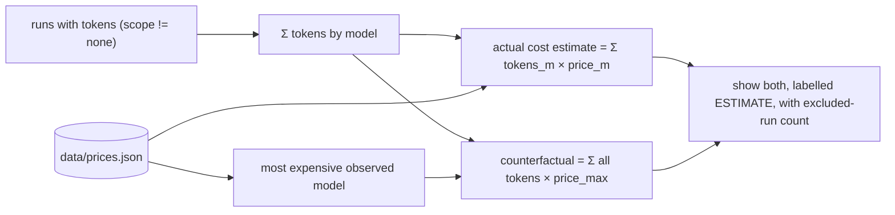
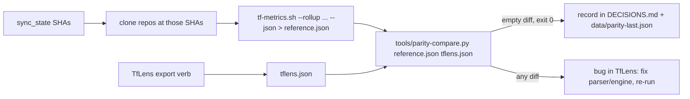

# TfLens — Business Requirements — Phase 2: Reports

| | |
|---|---|
| App | TfLens |
| Kind | app |
| Size | Large |
| Phase | 2 of 3 |
| Status | Target |
| Stack answer set | Blazor Server · PostgreSQL 16 · Dapper · TrBlazeUI · Docker |
| Date | 2026-09-08 |

**Phase 2 of 3 — engine, the four report pages, export, parity.** Requirement ids: **BRD-21 to BRD-21, BRD-30 to BRD-72, BRD-143 to BRD-143**. Ids run on across the three phases and are never reused or renumbered.

Other phases: [Phase 1 — Foundation](./TfLens-BRD.md) · [Phase 3 — Depth](./TfLens-P3-BRD.md) · The map is [TfLens-Phases.md](./TfLens-Phases.md).

**The whole-project context lives in phase 1 and is not repeated here:** the executive summary, business objectives, scope and out-of-scope list, stakeholders, the context and component diagrams, the constraints, the parity procedure (§13), the success metrics and the risks. This document holds what belongs to this phase: its screens, its features and its requirements.

## 1. Summary

TfLens reads the telemetry the frameworks already emit and turns it into figures. Phase 1 got the
records into the store; **this phase is where they become numbers, and therefore where a wrong number
first becomes possible.** The metrics engine, the four report pages built on it — Coverage, Gate
outcomes, Harness comparison, Routing & economics — the weekly snapshot export, and the parity check
that is the licence to quote any of it.

The product's stated dangerous failure mode is not a crash but a **plausible wrong number** that gets
exported and cannot be defended. Every provenance rule in SCHEMA.md §6 is enforced here, in the shape
of the result types rather than as a check someone remembers to run, and the parity diff against
`tf-metrics.sh` is the acceptance gate.

## 2. Development status

Written by the status gate after every build, verify and handoff; not by hand.

**Snapshot as of 2026-09-08.** Live per-requirement status: `PROJECT-STATUS.md` and the Requirements Status table in `docs/TfLens-P2-Checklist.md`.

| Screen | Requirements | Verified | Open | Status |
|---|---|---|---|---|
| UI / Pages | 20 | 18 | 2 | Partial |
| Functional requirements | 20 | 19 | 1 | Partial |
| Non-functional | 4 | 3 | 1 | Partial |

## 3. Screens and flow

| Screen | Route | What it answers | Feature | Requirements | Mockup |
|---|---|---|---|---|---|
| Coverage / health | `/` | **Is the telemetry itself trustworthy right now?** Per repo: whether a clone has stopped pushing, whether hooks are missing, which streams carry records and how fresh they are. It is the **landing page on purpose** — *every other number on this site is suspect until this page is green* — and it is where amendment, orphan and provenance diagnostics surface instead of being silently applied. | F-COVER, F-RAW | [BRD‑21](#brd-21) · [BRD‑39](#brd-39) · [BRD‑40](#brd-40) · [BRD‑41](#brd-41) · [BRD‑42](#brd-42) · [BRD‑43](#brd-43) · [BRD‑44](#brd-44) · [BRD‑127](#brd-127) · [BRD‑181](#brd-181) | [coverage.html](./mockups/coverage.html) · Playbook state: [playbook.html](./mockups/playbook.html) |
| Gate outcomes | `/gate-outcomes` | **The headline page — and the name is a direct reference, not a slogan.** It renders *the three questions the telemetry schema exists to answer* (`.tfcore/telemetry/SCHEMA.md` §0), per `project_type`: **(1) first-pass rate** — what fraction of REQs reach `Verified` on attempt 1; **(2) gate catch distribution** — of all failures, which gate caught them; **(3) escape rate** — what fraction of defects reached UAT or production instead of being caught by a gate. Live and backfilled figures sit side by side and are **never summed**; there is no “all types” tab and no total row, by design. See the callout below. | F-3Q, F-ENGINE | [BRD‑45](#brd-45) · [BRD‑46](#brd-46) · [BRD‑47](#brd-47) · [BRD‑48](#brd-48) · [BRD‑49](#brd-49) · [BRD‑50](#brd-50) | [gate-outcomes.html](./mockups/gate-outcomes.html) · Playbook state: [gate-outcomes-playbook.html](./mockups/gate-outcomes-playbook.html) |
| Harness comparison | `/harness` | **Does the framework behave the same whichever tool runs it?** One column per harness (`claude-code` · `opencode` · `codex`): run volumes by command, verdict mix, session counts, token totals. Tokens may be compared across harnesses; **dollars may not** — only OpenCode reports measured cost, and the page never shows a dollar total across harnesses. | F-HARN | [BRD‑51](#brd-51) · [BRD‑52](#brd-52) · [BRD‑53](#brd-53) · [BRD‑54](#brd-54) · [BRD‑55](#brd-55) | [harness.html](./mockups/harness.html) · Playbook state: [harness-playbook.html](./mockups/harness-playbook.html) |
| Routing & economics | `/routing` | **Carries the Edit-prices dialog. Did runs land on the model they were routed to, and what would the mix have cost?** Routing drift (declared `tier`/`tier_model` vs the model actually observed), tokens by model, and the counterfactual repricing — everything repriced as if every run had used the most expensive model observed — always labelled **estimate — tokens × rate card, not measured spend**. | F-ROUTE | [BRD‑56](#brd-56) · [BRD‑57](#brd-57) · [BRD‑58](#brd-58) · [BRD‑59](#brd-59) · [BRD‑60](#brd-60) · [BRD‑61](#brd-61) · [BRD‑62](#brd-62) | [routing.html](./mockups/routing.html) · Playbook state: [routing-playbook.html](./mockups/routing-playbook.html) |
| Snapshot export | `/export` | **Turn the figures into something quotable.** Writes a dated markdown + JSON snapshot and marks it **QUOTABLE** only while parity against `tf-metrics.sh` still holds and no row carries provenance nobody obtained — because the dangerous failure of this product is not a crash, it is a plausible wrong number that gets published and cannot be defended. | F-EXPORT, F-PARITY | [BRD‑63](#brd-63) · [BRD‑64](#brd-64) · [BRD‑65](#brd-65) · [BRD‑66](#brd-66) · [BRD‑67](#brd-67) · [BRD‑70](#brd-70) | [export.html](./mockups/export.html) · Playbook state: [export-playbook.html](./mockups/export-playbook.html) |

## 4. Feature catalog

### F-ENGINE: Metrics engine with provenance rules

**Personas:** Owner (indirectly — every page), Parity operator · **Phase:** 2

The engine is a field-for-field port of `analyse()` in `.tfcore/telemetry/tf-metrics.sh`, the trusted reference. All figures are computed at request time from the stream tables; nothing derived is ever written back into a stream table. The SCHEMA.md §6 provenance rules are enforced by the shape of the result, not by a flag:

- **Live and backfilled never pool.** The result has `Live[projectType]` and `Backfilled[projectType]`; there is no `Total`.
- **First-pass rate, gate catch distribution and escape rate never pool across `project_type`.** Records with `project_type_inferred: true` are segmented as **unclassified**, never silently as `app`.
- **Taint exclusion.** Any `req_id` with even one backfilled record is excluded from the live first-pass rate (its live `attempt` restarts at 1); the excluded IDs are returned as a list for display.
- **Minimum n.** Any metric with fewer than 3 supporting records is `InsufficientData(n)`, a distinct case of the `Figure` type that a page can only render as text.
- **Dollars never pool across harness.** `Pooled.CostUsd` is always `null` (the reference's contract); real dollars appear only in the harness page for `opencode`.
- **Late-added gates** (`perf`, 2026-08-10) report `ran` (records whose `gates_run` contains the gate) and `caught` side by side; their share of the raw distribution is never presented as a catch rate.
- Poolable metrics (rework ratio, batch size median, REQ throughput median in REQs/hour, tokens total, tokens per Verified REQ, commit cadence, duplicates collapsed) follow SCHEMA.md §8 and the reference's rounding (`%.0f%%`, 2 dp throughput, 1 dp tokens per Verified).

A unit test feeds the checked-in fixture streams to the engine and asserts equality with a `reference.json` produced by the script on the same fixtures — the parity test in miniature, run on every build.

**Workflow:**
1. `Analyse(repos, options)` reads streams per repo, dedupes commits per repo.
2. Segments gates: live vs backfilled → by project type (unclassified for inferred).
3. Computes taint set → per-segment figures → late-gate coverage → pooled block.
4. Returns `AnalysisResult` (same key layout as `--rollup --json`) — memoised until the next sync/rebuild.

**Requirements:** BRD-30, BRD-31, BRD-32, BRD-33, BRD-34, BRD-35, BRD-36, BRD-37, BRD-38, BRD-116, BRD-117, BRD-146, BRD-147, BRD-148, BRD-155, BRD-156, BRD-158, BRD-161, BRD-166, BRD-168, BRD-169

### F-COVER: Coverage / health page

**Personas:** Owner · **Phase:** 2

The first report page (after Repos). For each of the signed-in user's repos it shows: kind, last sync time and outcome, last commit SHA (short, linked to GitHub), record counts per stream, live-vs-backfilled gate counts, and **days since the newest record per stream**. A **fetched** repo whose newest `sessions` or `commits` record is stale (older than a configurable threshold, default 7 days) is flagged in words — "this clone isn't pushing or lacks hooks; run `update-framework.sh` on it" — because the hook lives in `.git/`, which never clones, and this is the one telemetry gap the owner cannot see by reading the files. An **imported** source is read differently (amended 2026-08-28, BRD-137): staleness counts **days since import**, the message is *"this source can't refresh itself — re-import to update"*, and the hook diagnosis is not shown, because it would be advice about a clone TfLens cannot see. A snapshot is not unhealthy for being a snapshot. The page also lists, per repo, any fields observed that SCHEMA.md does not document (from the overflow report) and any records with `v > 1`, and hosts the guarded **Rebuild from raw** button. A single summary badge at the top says **GREEN** (all repos synced, nothing stale, no errors) or **CHECK** with the count of warnings. Every other number on the site is suspect until this page is green.

*Amended 2026-09-08.* Coverage gains four more data-quality facts, all of them counts and none of them a health failure: how many misses lack **`sort`** and how many lack **`what`**, each against that repo's *eligible* misses (the fields began on 2026-09-07, so a repo whose records all predate them is not unhealthy — TfLens's own repository is exactly that case); and how many **`duration_s`** and **`attempt`** values the reader **derived** rather than read (BRD-179, BRD-180) — a derived figure is legitimate and must still be visible as derived. The unrecognised-value list (BRD-181) sits beside the existing unknown-fields list for the same reason: a value TfLens does not know is a finding to show, never a row to drop.

*Amended 2026-08-28 (F-MISS).* The per-repo stream table goes from four rows to **five** (`misses` joins them), and Coverage gains three data-quality facts the miss stream introduces — none of which is a quality figure and none of which belongs on the `/misses` KPI row: **`escapes_missing_why`** (escapes, `found_by ∈ {owner, production}`, arriving with no `why_missed` — the most valuable records in the stream arriving incomplete), the **`project_type` reclassification split** (a repo whose stored records carry a `project_type` its *current* classification disagrees with, which §6 forbids pooling and which would otherwise render silently as two unrelated projects), and the **orphan counts** (a `miss-fix` or `miss-amend` naming no known `miss`). A repo emitting `miss` records with no `miss-fix` records at all is a **warning, not an error** — most likely the fix path is not wired up yet, which is worth saying and not worth failing on.

| Screen | Route | Description | Mockup |
|--------|-------|-------------|--------|
| Coverage / health | `/` | Summary badge; per-repo cards or grid; five-row stream staleness table; unknown fields **and unrecognised values in an open vocabulary — shown, never filtered away**; escapes-missing-why + reclassification-split + orphan facts; **`sort`-missing and `what`-missing counts against eligible misses**; **derived-`duration_s` and derived-`attempt` counts**; Rebuild button; Framework switch | [coverage.html](./mockups/coverage.html) · Playbook state: [playbook.html](./mockups/playbook.html) |

**Workflow:**
1. Read `sync_state` + per-stream `MAX(ts)` per repo + counts + overflow field names.
2. Compute staleness per stream vs today; apply thresholds; compose warnings.
3. Render; Sync now / Rebuild refresh in place.

**Requirements:** BRD-39, BRD-40, BRD-41, BRD-42, BRD-43, BRD-44, BRD-127

### F-3Q: Gate outcomes page

**Personas:** Owner, Author · **Phase:** 2

*(Renamed from **“Three questions”** on 2026-09-01 by owner ruling; route `/three-questions` → `/gate-outcomes`. The feature keeps the ID **F-3Q** for traceability — see [§9](#what-gate-outcomes-shows-and-why-it-is-no-longer-called-three-questions).)* This screen renders the three questions `.tfcore/telemetry/SCHEMA.md` §0 says the telemetry exists to answer. The three are: **(1) first-pass rate** — what fraction of REQs reach `Verified` on attempt 1; **(2) gate catch distribution** — of all failures, which gate caught them; **(3) escape rate** — what fraction of defects reached UAT or production instead of being caught by a gate. All three come from `gates.jsonl`, the primary stream, which is why they share one screen. The schema's fourth question (miss attribution and rework cost) is answered on `/misses` and deliberately not added here.

The headline page and the B3 evidence base. For each `project_type` present in the data (`app`, `library`, `docs`, `framework`, and `unclassified` for inferred records) it shows the three questions SCHEMA.md §0 exists to answer — **first-pass rate**, **gate catch distribution** (with `escaped` as its own row, never folded into a gate, and `unattributed` where a failure carries no gate), and **escape rate** — computed from **live records only**, with the backfilled figures for the same type in an adjacent, clearly labelled column that is never summed with live. Under each type: records, REQs scored, REQs excluded by backfill taint, and the late-gate coverage lines (`perf gate: ran on n records, caught k → rate | insufficient data (n=…) | not yet run on this data (gate added 2026-08-10)`). The tainted REQ IDs are listed in full in a collapsible panel. Any figure below the minimum n renders as `insufficient data (n=…)`. There is no "all types" tab and no total row — by design.

| Screen | Route | Description | Mockup |
|--------|-------|-------------|--------|
| Gate outcomes | `/gate-outcomes` | One section (or tab) per project_type; live column + labelled backfilled column; taint list; late-gate coverage; Framework switch | [gate-outcomes.html](./mockups/gate-outcomes.html) · Playbook state: [gate-outcomes-playbook.html](./mockups/gate-outcomes-playbook.html) |

**Workflow:**
1. `Analyse()` → iterate `Live` and `Backfilled` keyed by type.
2. Render first-pass, escape rate, distribution table (rows in the reference's `GATE_ORDER`), late-gate coverage.
3. Render the taint list and the standing note: "figures are deliberately not combined across project_type or provenance (SCHEMA.md §6)".

**Requirements:** BRD-45, BRD-46, BRD-47, BRD-48, BRD-49, BRD-50

### F-HARN: Harness comparison page

**Personas:** Owner, Author · **Phase:** 2

The portability page — the B1 story rendered as data. Three columns, one per harness the framework detects (SCHEMA.md §1): **`claude-code` · `opencode` · `codex`** (Codex CLI — amended 2026-08-26; TechieFlow now detects it). Per column: run counts by command, gate records and verdict mix, session counts, token totals (input, output, cache read, cache write, from both `runs` §2.5 fields and `sessions`), tokens per verified REQ. **Real `cost_usd` is shown for OpenCode only**, in its own card labelled "the only measured dollars in the system"; Claude Code and Codex show "not measured (null by design)". Tokens may be compared across harness; dollars may not, and the page never shows a dollar total across harnesses. Records with `harness: null` get **no column** but are never hidden: a footnote row states "*n* records with harness not detected — excluded from the columns above" (owner decision 2026-08-26). The page honours the Framework switch (F-FRAMEWORK). This page has no reference in `tf-metrics.sh`, so it is spot-checked by hand once (F-PARITY).

| Screen | Route | Description | Mockup |
|--------|-------|-------------|--------|
| Harness comparison | `/harness` | Columns claude-code · opencode · codex; "not detected" footnote; tokens chart; OpenCode-only cost card; Framework switch | [harness.html](./mockups/harness.html) · Playbook state: [harness-playbook.html](./mockups/harness-playbook.html) |

**Workflow:**
1. Group `runs`, `gates`, `sessions` by `harness`; count the `null` group separately.
2. Compute volumes, verdict mix, token totals, tokens per Verified; dollars for `opencode` only.
3. Render the three columns + one bar chart (tokens by harness) + the not-detected footnote.

**Requirements:** BRD-51, BRD-52, BRD-53, BRD-54, BRD-55

### F-ROUTE: Routing and economics page

**Personas:** Owner, Author · **Phase:** 2

Three panels. **Routing drift** uses the §2.5 per-run fields: count and list of `routed: false` runs, declared `tier`/`tier_model` versus observed `model` (and `models` when more than one), by command. **Tokens by model** sums run tokens per observed model. **Counterfactual repricing** is the B3 claim basis: total tokens (input, output, cache read, cache write) repriced as if every run had used the most expensive model observed in the data, versus the actual mix, using an editable `data/prices.json` rate card (per model: input/output/cache-read/cache-write USD per million tokens). The figure is labelled **estimate — tokens × rate card, not measured spend** in the UI and in the export; runs with `tokens_scope: none` (no tokens captured) are counted and excluded, and stated. The page also carries the poolable metrics per SCHEMA.md §8 — rework ratio, REQ throughput, batch size, commit cadence — straight from the engine. A small editor (dialog) lets the owner edit `prices.json` in place with validation; the file is the source, the dialog is a convenience.

| Screen | Route | Description | Mockup |
|--------|-------|-------------|--------|
| Routing & economics | `/routing` | Drift table; tokens-by-model chart; repricing cards (estimate); poolable metrics; prices editor dialog; Framework switch | [routing.html](./mockups/routing.html) · Playbook state: [routing-playbook.html](./mockups/routing-playbook.html) |

**Workflow:**
1. Drift: filter runs with `tier_model` and `model`; group by `cmd`; list `routed:false`.
2. Tokens by model: sum §2.5 token fields by `model`.
3. Repricing: load `prices.json`; compute actual-mix and all-at-max; label estimate; show excluded runs.
4. Poolables: from `AnalysisResult.Pooled`.

**Requirements:** BRD-56, BRD-57, BRD-58, BRD-59, BRD-60, BRD-61, BRD-62

### F-EXPORT: Weekly snapshot export

**Personas:** Author, Parity operator · **Phase:** 2

A button on `/export` and a command verb (`dotnet TfLens.dll export [--date yyyy-MM-dd]`) write two files to `data/reports/<date>/`: `snapshot.md` (human-readable, sectioned exactly like the pages, provenance never mixed in one figure, every estimate labelled) and `tflens.json` (machine-readable; the same key layout as `tf-metrics.sh --rollup --json` — `per_repo`, `tainted_reqs`, `live`, `backfilled`, `pooled` — plus an `extras` object for harness, routing and repricing, and a `parity` object carrying the last recorded parity run). The page lists previous snapshots with download links and shows a **quotable / not quotable** banner: quotable only if the last parity run on record postdates the last parser change (the build stamps a parser version; the parity record stores the version it validated).

| Screen | Route | Description | Mockup |
|--------|-------|-------------|--------|
| Snapshot export | `/export` | Export button; list of past snapshots; quotable banner; parity status; Framework switch (one snapshot per framework) | [export.html](./mockups/export.html) · Playbook state: [export-playbook.html](./mockups/export-playbook.html) |

**Workflow:**
1. Press Export (or run the verb) → `Analyse()` + extras → write markdown + JSON → refresh list.
2. Banner reads `data/parity-last.json` (written by the parity procedure) and compares parser version.

**Requirements:** BRD-63, BRD-64, BRD-65, BRD-66, BRD-67, BRD-128, BRD-160

### F-PARITY: Parity check against tf-metrics.sh

**Personas:** Parity operator · **Phase:** 2

Two independent implementations now compute the same metrics from the same files: `tf-metrics.sh` (trusted; the §6 rules live in its code) and TfLens (new, unproven). Correct implementations must agree exactly; any disagreement is by definition a bug in TfLens, and the script is never changed to match the app. TfLens ships the tooling that makes the check cheap: the `tflens.json` export in the reference's key layout, a `tools/parity-compare.py` script that compares key-by-key (not a text diff — key order and formatting may differ) and exits non-zero on any mismatch, the `sync_state` SHAs so the same dataset can be checked out for the script, and a `data/parity-last.json` + DECISIONS.md entry that records each passing run (date, dataset SHAs, script hash, compare output). The full procedure and the zero-tolerance rule are in §13; the metrics the script does not compute (harness, routing, repricing) have no oracle and are spot-checked by hand against raw JSONL once, recorded the same way.

**Workflow:** see §13 (mandatory acceptance test).

**Requirements:** BRD-68, BRD-69, BRD-70, BRD-71, BRD-72, BRD-129, BRD-143, BRD-152

## 5. Requirements

- **BRD-21** — Owner can trigger the same rebuild from the Coverage page behind a confirmation dialog. *(F-RAW)*
- **BRD-30** — System shall compute every figure at request time from the stream tables and never write a derived value into a stream table. *(F-ENGINE)*
- **BRD-31** — System shall never pool live and backfilled records for first-pass rate, gate catch distribution or escape rate; backfilled figures appear only in an adjacent labelled column, with no total row and no disabling flag. *(F-ENGINE)*
- **BRD-32** — System shall never pool first-pass rate, gate catch distribution or escape rate across `project_type`, and shall report `project_type_inferred` records as **unclassified**. *(F-ENGINE)*
- **BRD-33** — System shall exclude any REQ with at least one backfilled record from the live first-pass rate and expose the excluded REQ ID list. *(F-ENGINE)*
- **BRD-34** — System shall render any metric with fewer than 3 supporting records as `insufficient data (n=…)`, never as a number, via a `Figure` type that cannot carry a value in that case. *(F-ENGINE)*
- **BRD-35** — System shall never pool `cost_usd` across harness; `Pooled.CostUsd` is always null. *(F-ENGINE)*
- **BRD-36** — System shall report late-added gates (`perf`, since 2026-08-10) as `ran` (records whose `gates_run` contains the gate) beside `caught`, and never present their share of the raw distribution as a catch rate. *(F-ENGINE)*
- **BRD-37** — System shall compute the poolable metrics (rework ratio, batch size median, REQ throughput median in REQs/hour, tokens total, tokens per Verified REQ, commit cadence, duplicates collapsed) with the reference's formulas and rounding. *(F-ENGINE)*
- **BRD-38** — System shall include a unit test that asserts the engine's output on checked-in fixture streams equals a checked-in `reference.json` produced by `tf-metrics.sh` on the same fixtures. *(F-ENGINE)*
- **BRD-39** — User can see, per connected repo of their own, last sync time and outcome, last commit SHA, record counts per stream and live-vs-backfilled gate counts on the Coverage page at `/`. *(F-COVER)*
- **BRD-40** — Owner can see days since the newest record per stream per repo. *(F-COVER)*
- **BRD-41** — System shall flag on screen, in words, any repo whose newest `sessions` or `commits` record is older than the staleness threshold (default 7 days), stating that the clone is not pushing or lacks hooks. *(F-COVER)*
- **BRD-42** — Owner can see per repo the field names observed that SCHEMA.md does not document, and any records with `v > 1`. *(F-COVER)*
- **BRD-43** — System shall show a single GREEN / CHECK summary badge with the warning count at the top of the Coverage page. *(F-COVER)*
- **BRD-44** — System shall show the Coverage page as the landing page after login for a user with at least one connected repo (`/repos` otherwise). *(F-COVER — amended 2026-08-26)*
- **BRD-45** — Owner can see, per `project_type` (including `unclassified`), the live first-pass rate, gate catch distribution and escape rate at `/gate-outcomes`. *(F-3Q)*
- **BRD-46** — System shall show backfilled figures for the same `project_type` in an adjacent column labelled backfilled, never summed with live. *(F-3Q)*
- **BRD-47** — System shall present `escaped` as its own row in the gate catch distribution and `unattributed` for failures without a gate, in the reference's gate order. *(F-3Q)*
- **BRD-48** — Owner can see the full list of REQ IDs excluded by backfill taint. *(F-3Q)*
- **BRD-49** — Owner can see the late-gate coverage line per gate (`ran`, `caught`, rate or insufficient data, or "not yet run on this data (gate added …)"). *(F-3Q)*
- **BRD-50** — System shall show no "all types" view and no total row on the gate-outcomes page, and shall display the SCHEMA.md §6 note explaining why. *(F-3Q)*
- **BRD-51** — User can see per harness — columns **`claude-code`, `opencode`, `codex`** — run counts by command, gate verdict mix, session counts, and token totals at `/harness`. **Amended 2026-09-08:** `codex` is **retired at the producer** — the Codex adapter was removed from the framework on 2026-09-07 and nothing writes that value any more. Existing `codex` records stay valid and shall keep rendering with their own column; the value shall **not** be offered in any new filter, picker or legend built after this date. A retired harness is a column with no new rows, never a reason to drop the rows it has. *(F-HARN — amended 2026-08-26, 2026-09-08)*
- **BRD-52** — Owner can see tokens per verified REQ per harness. *(F-HARN)*
- **BRD-53** — System shall show real `cost_usd` for `opencode` only, labelled as the only measured dollars in the system, and "not measured (null by design)" for Claude Code. *(F-HARN)*
- **BRD-54** — System shall never show a dollar total across harnesses. *(F-HARN)*
- **BRD-55** — System shall never merge `harness: null` records into a named harness and shall disclose them in a footnote row ("*n* records with harness not detected — excluded from the columns above") rather than a column. *(F-HARN — amended 2026-08-26)*
- **BRD-56** — Owner can see routing drift at `/routing`: `routed:false` run count and list, and declared `tier`/`tier_model` versus observed `model`/`models`, by command. *(F-ROUTE)*
- **BRD-57** — Owner can see tokens by observed model (input, output, cache read, cache write). *(F-ROUTE)*
- **BRD-58** — Owner can see the counterfactual repricing figure: all tokens repriced at the most expensive observed model versus the actual mix, from `data/prices.json`. *(F-ROUTE)*
- **BRD-59** — System shall label the repricing figure **estimate — tokens × rate card, not measured spend** everywhere it appears, including the export. *(F-ROUTE)*
- **BRD-60** — System shall exclude runs with `tokens_scope: none` (or no token fields) from repricing and state how many were excluded. *(F-ROUTE)*
- **BRD-61** — Owner can edit `prices.json` (per model: input/output/cache-read/cache-write USD per million tokens) through a validated dialog; the file remains the source of truth. *(F-ROUTE)*
- **BRD-62** — Owner can see the poolable metrics (rework ratio, REQ throughput, batch size, commit cadence) on the routing page. *(F-ROUTE)*
- **BRD-63** — User can press Export on `/export` to write `data/reports/<userId>/<date>/snapshot.md` and `tflens.json` for their own repos. *(F-EXPORT — amended 2026-08-26)*
- **BRD-64** — Ops can run the `export` verb (`dotnet TfLens.dll export [--date]`) to produce the same files headlessly. *(F-EXPORT)*
- **BRD-65** — System shall lay out `tflens.json` with the same keys as `tf-metrics.sh --rollup --json` (`per_repo`, `tainted_reqs`, `live`, `backfilled`, `pooled`) plus `extras` and `parity` objects. *(F-EXPORT)*
- **BRD-66** — System shall never mix provenances in one figure in the snapshot and shall label every estimate in both files. *(F-EXPORT)*
- **BRD-67** — Owner can see past snapshots with download links and a quotable / not-quotable banner based on whether the last parity run postdates the last parser change. *(F-EXPORT)*
- **BRD-68** — System shall stamp a parser version into the build and into every export. *(F-PARITY)*
- **BRD-69** — Parity operator can run `tools/parity-compare.py reference.json tflens.json` and get a key-by-key diff (record counts per stream and backfilled counts, duplicates collapsed, tainted-REQ set, per-type live and backfilled figures, late-gate coverage, every poolable, every insufficient-data marker with its n) with non-zero exit on any mismatch. *(F-PARITY)*
- **BRD-70** — Parity operator can read the dataset identity for the last sync from the export and the Coverage page to pin the reference dataset: the **commit SHA** for a fetched source, the **bundle sha256** for an imported one. *(F-PARITY — amended 2026-08-28, see BRD-134)*
- **BRD-71** — System shall record each passing parity run in `data/parity-last.json` (date, dataset SHAs, script hash, parser version, compare output) and the operator records it in DECISIONS.md. *(F-PARITY)*
- **BRD-72** — Parity operator shall spot-check the metrics without a reference (harness, routing, repricing) by hand against raw JSONL once and record it in DECISIONS.md. *(F-PARITY)*

  **Why this is a requirement and not a chore.** TfLens holds no user table — identity is a live external service (BRD-90), so the authenticated half of the suite rests on mutable state that nothing in the repository could previously rebuild. On 2026-08-28 that failed exactly as the shape predicts: the accounts were removed on the AppManager side and **seven tests plus every authenticated screen became un-verifiable at once**, with no path back that did not involve a human remembering what the passwords had been. A dependency that can silently invalidate the whole verification surface, and that only a person's memory can restore, is a product defect — recorded as `MISS-TfLens-20260828-02` (`unspecified-gap` / `tests` / `blocker`) and built as `REQ-NFR-012`.

### Amendment 2026-08-29 — two gates the product was relying on and had never written down

Both clauses below were already being *enforced by hand* — the first by the parity operator noticing that a count disagreed with upstream, the second by the owner opening the mockups beside the running app. Neither was a requirement, so neither had a gate, and on 2026-08-29 both failed in the same session against a checklist that read 145 `Verified`. They are appended here so the checklist rows built for them (`REQ-NFR-019`, `REQ-NFR-020`) are **owned by the BRD rather than inferred from a finding**.
- **BRD-143** — Stored provenance shall be real: every row in every stream table shall carry a `source_sha` that a sync or an import actually recorded, and no path shall write a row with provenance nobody obtained. A seeding or fixture harness shall not write into the application's own store, or shall write only under a user id the application's own queries exclude, so demo data can never reach a published figure. The system shall ship a check that reports any `source_sha` present in the store which no `SyncState` row or import bundle accounts for — detectable without a network call and without hand-comparing counts against GitHub — and `/export` shall refuse to mark a snapshot **QUOTABLE** while such a row is present, for the same reason it refuses when the reference script has changed (BRD-67, §13). *(F-PARITY, F-PARSE, F-RAW, F-EXPORT)*

**Cross-cutting non-functional requirements that this phase owns** (moved here 2026-09-08 with the phase split, because the checklist rows that own them are this phase's):
- **BRD-82** — Performance: report pages render from the memoised analysis within a second for the expected data volume (tens of thousands of records across ≤10 repos); a full sync of 5 repos completes in under 30 s on a normal connection. Targets:
- **BRD-84** — Privacy: TfLens displays and stores only what the streams carry (IDs, counts, durations, verdicts, short SHAs); no requirement text, no commit subjects, nothing from `src/`; the `Overflow` column is never rendered, only its field names.
- **BRD-89** — Integrity: the provenance rules (BRD-31..36) have no configuration switch, no query parameter and no UI toggle that relaxes them.

## 6. Where the rest lives

| What | Where |
|---|---|
| Executive summary, objectives, scope, stakeholders, diagrams | [phase 1 BRD](./TfLens-BRD.md) §1–§8 |
| Constraints and assumptions | [phase 1 BRD](./TfLens-BRD.md) §12 |
| Parity check — the mandatory acceptance test | [phase 1 BRD](./TfLens-BRD.md) §13 |
| Definition of done, success metrics, risks, glossary | [phase 1 BRD](./TfLens-BRD.md) §14–§17 |
| Architecture, decisions log, data model | [TfLens-Architecture.md](./TfLens-Architecture.md) (not phased) |
| This phase's work list | [TfLens-P2-Checklist.md](./TfLens-P2-Checklist.md) |
| This phase's screens, control by control | [TfLens-P2-UIDesign.md](./TfLens-P2-UIDesign.md) |
