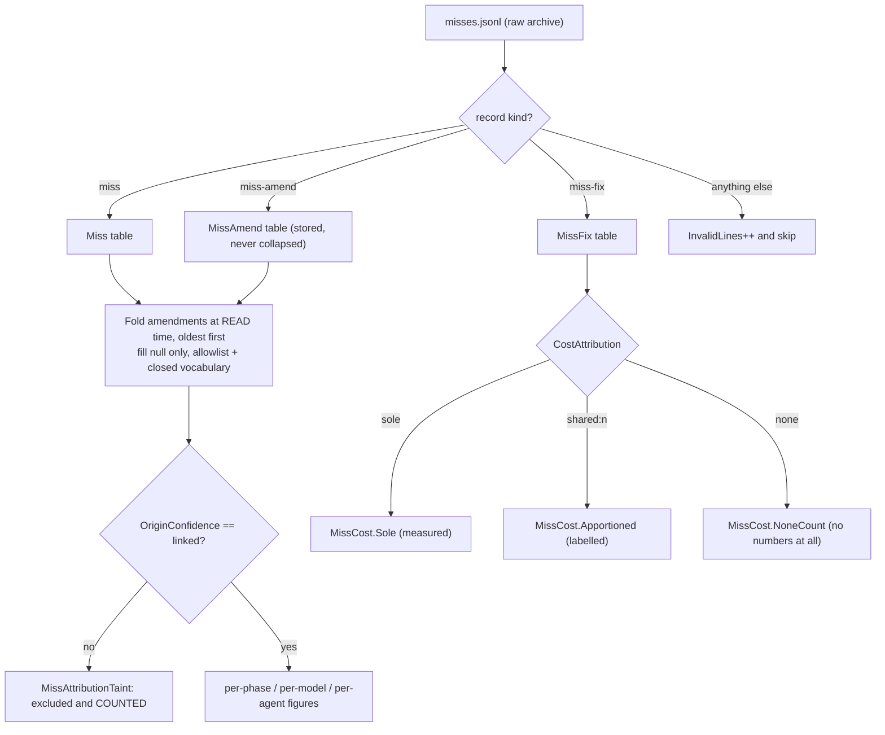
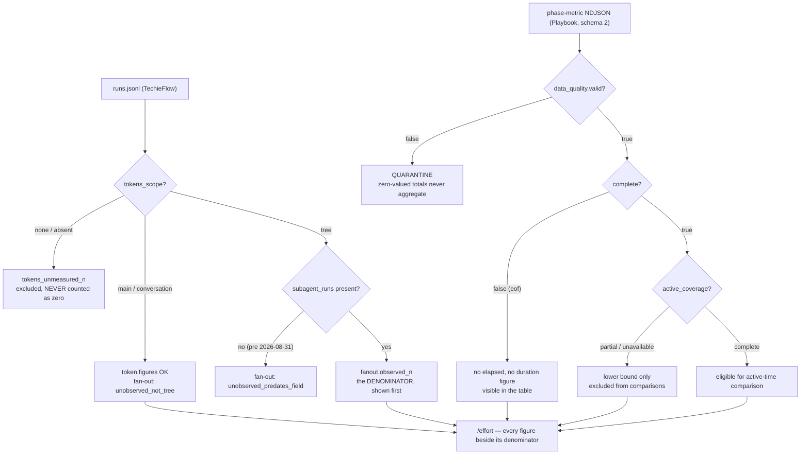
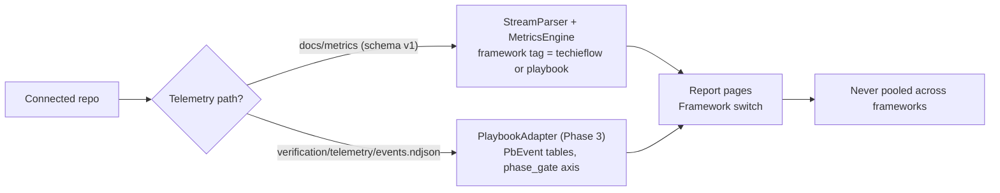

# TfLens — Business Requirements — Phase 3: Depth

| | |
|---|---|
| App | TfLens |
| Kind | app |
| Size | Large |
| Phase | 3 of 3 |
| Status | Target |
| Stack answer set | Blazor Server · PostgreSQL 16 · Dapper · TrBlazeUI · Docker |
| Date | 2026-09-08 |

**Phase 3 of 3 — misses, phase effort, the Playbook axis, imported sources.** Requirement ids: **BRD-73 to BRD-76, BRD-109 to BRD-110, BRD-112 to BRD-141, BRD-145 to BRD-181**. Ids run on across the three phases and are never reused or renumbered.

Other phases: [Phase 1 — Foundation](./TfLens-BRD.md) · [Phase 2 — Reports](./TfLens-P2-BRD.md) · The map is [TfLens-Phases.md](./TfLens-Phases.md).

**The whole-project context lives in phase 1 and is not repeated here:** the executive summary, business objectives, scope and out-of-scope list, stakeholders, the context and component diagrams, the constraints, the parity procedure (§13), the success metrics and the risks. This document holds what belongs to this phase: its screens, its features and its requirements.

## 1. Summary

Everything added after the first report set shipped, and the largest of the three phases. The miss
and rework economics page; the phase-effort page fed by two different producers; the Playbook axis of
every report; imported telemetry, which is how a private or corporate repository reaches TfLens
without it ever holding a credential; and the 2026-09-07 stream fields that answer **whose gap a miss
was** rather than only what broke.

One rule runs through all of it, arriving under a different name each time: **an unmeasured thing is
unmeasured, not zero.** `tokens_scope: "none"`, a fan-out window that never looked, an EOF-truncated
Playbook execution, a `sort` field that did not exist when the record was written — each is absence,
and each is reported as absence with its denominator beside it.

## 2. Development status

Written by the status gate after every build, verify and handoff; not by hand.

**Snapshot as of 2026-09-09.** Live per-requirement status: `PROJECT-STATUS.md` and the Requirements Status table in `docs/TfLens-P3-Checklist.md`.

| Screen | Requirements | Verified | Open | Status |
|---|---|---|---|---|
| UI / Pages | 12 | 10 | 2 | Partial |
| Functional requirements | 50 | 48 | 2 | Partial |
| Non-functional | 11 | 11 | 0 | Done |

## 3. Screens and flow

| Screen | Route | What it answers | Feature | Requirements | Mockup |
|---|---|---|---|---|---|
| Misses & rework | `/misses` | **What was missed, which practice let it through, and what did the repair cost?** This is the schema's **fourth** question (added 2026-08-28) and it is deliberately its **own page rather than a fourth band on Gate outcomes** — the three questions are canon and a well-understood surface, and adding to them would dilute it. Its *escape share* is a different measurement from Gate outcomes' *escape rate* and the two are never merged. | F-MISS | [BRD‑118](#brd-118) · [BRD‑119](#brd-119) · [BRD‑120](#brd-120) · [BRD‑121](#brd-121) · [BRD‑122](#brd-122) · [BRD‑123](#brd-123) · [BRD‑124](#brd-124) · [BRD‑125](#brd-125) · [BRD‑126](#brd-126) · [BRD‑167](#brd-167) · [BRD‑171](#brd-171) · [BRD‑172](#brd-172) · [BRD‑173](#brd-173) · [BRD‑175](#brd-175) · [BRD‑176](#brd-176) | [misses.html](./mockups/misses.html) · Playbook state: [misses-playbook.html](./mockups/misses-playbook.html) |
| Phase effort | `/effort` | **What did each phase cost — in time, tokens, models and subagents?** A **budgeting and capacity** view, never a quality scoreboard: `*build-phase` costing more than `*log-miss` is a fact about what those phases *are*. Quality lives on `/misses` and Coverage. Every figure carries its own denominator on screen, because a run whose token window was never computed is not a run that spent nothing. | F-EFFORT | [BRD‑146](#brd-146) · [BRD‑147](#brd-147) · [BRD‑148](#brd-148) · [BRD‑149](#brd-149) · [BRD‑150](#brd-150) · [BRD‑151](#brd-151) | [effort.html](./mockups/effort.html) |
| Playbook framework state of the report pages | `/effort` | **Phase efficiency — the same question, answered from the Playbook's own producer.** Normalized schema-2 phase metrics with stricter bounds of their own: incomplete (`eof`) windows carry no duration, partial active-time coverage renders as an explicit lower bound, and a harness with no normalized producer reads *unsupported*, never zero. | F-EFFORT, F-FRAMEWORK | [BRD‑156](#brd-156) · [BRD‑157](#brd-157) · [BRD‑158](#brd-158) · [BRD‑159](#brd-159) · [BRD‑160](#brd-160) · [BRD‑161](#brd-161) · [BRD‑162](#brd-162) · [BRD‑163](#brd-163) | [effort-playbook.html](./mockups/effort-playbook.html) |

## 4. Feature catalog

### F-MISS: Misses and rework economics

**Personas:** Owner, Author · **Phase:** 3 *(added 2026-08-28 — source: `docs/Miss-Telemetry-TfLens.md`)*

TechieFlow gained a **fifth stream** on 2026-08-28, `docs/metrics/misses.jsonl`, and it is the first stream whose records do not all have the same shape. It carries three record kinds linked by `miss_id`: a **`miss`** (what was missed, which phase/agent/model let it through, who found it), a **`miss-fix`** (the repair run, its outcome, its token and cost window) and a **`miss-amend`** (an append-only way to *complete* a field the `miss` left `null` — it may fill a `null`, and may never overwrite a value, including one an earlier amend set). TfLens pulls it, archives it, parses it, stores it, computes over it and shows it on a sixth report page, under the same provenance discipline it already applies to the four existing streams. The producing side is real, not hypothetical: `tf-metrics.sh --rollup --json` already reports a `misses` block, so every figure here is parity-diffable from the first commit and none ships marked unverified.

**Why this feature gets its own guards.** The product's stated dangerous failure mode is a *plausible wrong number* (§1), and miss data is the most seductive material in the system for producing one, because it invites three specific mistakes that all look like ordinary arithmetic:

1. **Presenting an apportioned cost as a measured one.** A fix run that repaired three misses has **one** token window. Dividing by three is arithmetic, not measurement.
2. **Presenting an inferred attribution as an observed one.** *"This model produces the most misses"* is a career-shaping claim if half the attributions were guessed.
3. **Rendering an optional field's distribution over the whole population.** `why_missed` is optional and `null` means *not assessed*, never a zero in some category; using the miss count as the denominator understates every category at once.

All three are handled the way TfLens already handles live-vs-backfilled: **in the shape of the result type, with no switch to relax it** (ADR-007's technique, applied twice more — ADR-019).

**Two open predicates that deliberately disagree.** The lifecycle splits three ways and TfLens must not reconcile the first two, because they answer different questions:

| Question | Predicate | Where it belongs |
|---|---|---|
| How much work is outstanding? (the backlog the owner reads) | latest `MissFix.VerdictAfter ∉ {Verified, wont-fix}` | the KPI tile **open misses** |
| Is this defect still live? (the producer's collapse check) | latest `VerdictAfter != "Verified"` — **`wont-fix` is still live** | not TfLens's job; it explains the gap |
| Deliberately declined | latest `VerdictAfter == "wont-fix"` | its own tile, never folded into open |

`deferred` is outstanding work and stays **open** in both. `wont-fix` is a decision, not a backlog item — but the next failure on that REQ is still the same defect, which is why the producer's check keeps it live. A reviewer will eventually try to "fix" one of these to match the other; the standing comment in `tf-metrics.sh` and BRD-120 exist to stop that.

*Amended 2026-09-08 (the `sort` / `what` / `review` fields).* The stream gained two fields and a **fourth record kind** on 2026-09-07, and together they change what this page is for. `miss_class` says **what broke**; the new **`sort`** says **whose gap it was** — the project's own specification, something the framework never said anywhere, a check that existed and was too weak, or a rule that was written down and ignored — and each of those four has a **different fixed remedy**. On the framework's own 126 misses roughly half sorted `weak-check`: the dominant failure is not a missing rule but a weak check, which no class-only chart can show. The page therefore carries the two distributions **side by side and never merged** (BRD-171), written out in words rather than as raw values. **`what`** puts the owner's own sentence on the row (BRD-173), because a miss identified only by a class and a date is unrecognisable a month later. The fourth kind, **`review`**, is not a miss at all and is never counted as one (BRD-174) — it prices what an owner review cost, which is the only record anywhere in the streams that puts a number on a **specification** defect. The honest denominator is the whole difficulty: both fields arrived after most of the records did — **286 of 359 misses across the estate carry no `sort`** — and those records are reported as **predating the field, never as unsorted** (BRD-172).

| Screen | Route | Description | Mockup |
|--------|-------|-------------|--------|
| Misses & rework | `/misses` | Four bands: KPI row · where misses come from (origin phase × class, **beside the `sort` distribution — whose gap it was — in words, with its `n of N sorted` denominator**, and beside the failed-practice distribution) · who was running (model + agent, `linked` only, labelled observational) · cost of rework (measured \| apportioned \| unattributable) **and what reviews cost, per review phase, copied never computed**; per-miss detail table **carrying the one-sentence `what` description** with the raw record behind a disclosure; period filter defaulting to **all history**; Framework switch | [misses.html](./mockups/misses.html) · Playbook state: [misses-playbook.html](./mockups/misses-playbook.html) |

**Workflow:**
1. Sync fetches `misses.jsonl` at the pinned SHA, archives it verbatim, and parses it — dispatching on each record's own `kind` **within** the misses stream. An unknown `kind` is counted as an invalid line and skipped, never thrown (the same contract as a malformed line, BRD-25).
2. Storage upserts into `Miss` / `MissFix` / `MissAmend` on their natural keys. Amend rows are **stored, not collapsed** — folding is a read-time operation, so `rebuild` re-derives identical values.
3. `MissMetrics` folds amendments oldest-first (re-applying the null-check while folding — a merged stream from several machines can carry an amend and a later-written value in either order), applies `MissAttributionTaint`, and returns each figure as a `Figure` and each cost as a `MissCost`.
4. `/misses` renders the four bands; Coverage renders the data-quality facts; the export writes the `misses` section; `parity-compare.py` diffs the whole block against the oracle.

**Requirements:** BRD-112, BRD-113, BRD-114, BRD-115, BRD-116, BRD-117, BRD-118, BRD-119, BRD-120, BRD-121, BRD-122, BRD-123, BRD-124, BRD-125, BRD-126, BRD-127, BRD-128, BRD-129, BRD-130, BRD-164, BRD-165, BRD-166, BRD-167, BRD-170, BRD-171, BRD-172, BRD-173, BRD-174, BRD-175, BRD-176

### F-EFFORT: Phase effort and efficiency — what each phase cost

**Personas:** Owner, Author, Ops (capacity) · **Phase:** 3 *(added 2026-09-01 — sources: `docs/Phase-Effort-Telemetry-TfLens.md` (TechieFlow), `docs/Phase-Efficiency-TfLens-Contract.md` and `docs/Miss-Telemetry-TfLens-From-AIFP.md` (AI-First-Playbook))*

The owner's question is one sentence: **"how much effort, time and tokens went into each phase — with which model, for how long, and how many subagents did it spin up?"** Both frameworks now answer it, and both shipped their producer before this consumer existed, so nothing here is speculative.

**What was already there, and what genuinely was not.** On the TechieFlow side, most of the answer had been in `runs.jsonl` since the stream started: `cmd` is the phase, `started`/`ended`/`duration_s` the time, the §2.5 fields the tokens and the model, `harness` the harness, `mode`/`attempt` the build-vs-rework split. What was missing was **an aggregation** — nothing grouped by `cmd` — plus three fields that were self-reported or not represented at all, shipped 2026-08-31 as SCHEMA §2.6:

| Field | Type | Why it had to exist |
|---|---|---|
| `subagent_runs` | `int?` | *"How many subagents did it spin?"* had **no honest answer**. `subagents` is a list of agent *kinds* the agent types into its own emit — it carries no count when the same kind is spawned four times, and nothing checked it against reality. `subagent_runs` is **counted from the harness's own store** |
| `tokens_out_subagents` | `int?` | The share of the window the children actually consumed; `tokens_out − tokens_out_subagents` is the main thread's own |
| `model_tokens_out` | `Dictionary<string,long>?` | The per-model **split**, not just the winner's name |

`subagents` stays alongside `subagent_runs` because they answer different questions — *which kinds were invoked* (only the agent knows) versus *how many actually ran* (only the harness knows) — and **where they disagree the measured one is right**. The gap between them is itself a finding about how accurately tasks self-report, so the page shows both (BRD-149).

The model split matters more than the model name. A run that spent 90% of its output on one model and 10% on another, and a run that split evenly, are different facts about cost and about routing; `model` (dominant) and `models` (the set) cannot tell them apart, so **any per-model effort figure built on `model` alone silently attributes the whole window to the winner** (BRD-150). The Playbook states the identical rule from the other side: never group a mixed-model execution solely under its dominant model (BRD-158).

**The three denominators — the whole feature rests on these.** Every figure on this page is bounded, and the bound is **on screen next to the figure**, never in a tooltip. This is the same discipline `/misses` applies to `n of N assessed`, for the same reason: *an exclusion the reader cannot see is indistinguishable from a bug.*

| Bound | Excludes | Renders as |
|---|---|---|
| **Token window** (BRD-146) | runs with `tokens_scope: "none"` or no scope — no token numbers exist for them | `measured on n of N runs` on every token tile |
| **Fan-out observation** (BRD-147) | runs whose window was not `tree` scope, split **two ways**: `unobserved_not_tree` (*we did not look*) and `unobserved_predates_field` (*we could not have looked* — written before 2026-08-31) | `observed_n of runs` **first**, numbers second; `observed_n == 0` reads **"not observed"** |
| **Playbook completeness** (BRD-155, BRD-161) | `complete:false` / EOF windows from duration figures; `active_coverage != "complete"` from active-time comparisons; `data_quality.valid:false` from every numeric aggregate | `n of N eligible` beneath each card; incomplete rows stay visible in the table |

The fan-out bound is the one most likely to be got wrong, **and it fails silently**. A `main`-scope window never read the subagent transcripts at all, so `subagent_runs` is absent — and a consumer that coerces that to `0` reports *"this phase spawns no subagents"* when the truth is *"we did not look."* Pooling the two produces a confident fan-out average largely composed of runs that could not have seen a subagent. On today's framework data the honest headline is **1 of 13 runs observed**, which is why the KPI row carries fan-out **coverage** rather than a fan-out average.

**Three timing concepts that must never substitute for one another** (BRD-156), from the Playbook contract:

| Concept | What it means | Summable? |
|---|---|---|
| **Wall-clock elapsed** | how long the command window stayed open | across non-overlapping executions |
| **Observed active time** | the **union** of assistant-message and tool intervals across main and child sessions; overlapping and nested work counted **once** | across non-overlapping executions |
| **Human effort** | time a person spent reading, deciding, waiting, reviewing | **never captured, never inferred** |

`assistant_elapsed_ms` and `tool_elapsed_ms` are diagnostic sums that legitimately overlap — an assistant envelope can contain tool execution — so the producer unions the intervals and TfLens **never adds the components**. Observed active time is busy wall time and is never labelled human effort, CPU time, utilization or additive compute.

**Command phase, not conceptual phase** (BRD-157). The Playbook's `phase` field is the slash command, and one command can contain several lifecycle stages — `/implement` covers build *and* self-review, `/verify` covers verify *and* the results gate. TfLens labels the dimension **Command phase** and never splits one window between conceptual phases by token proportion. The same producer has **no trustworthy cross-command task identity**, so a whole-task total requires an explicit cohort (repository + checklist + the exact execution IDs or time boundary) supplied by ingestion; a reused `session_id` is **not** sufficient, because one session may execute several tasks, and inferring a cohort from it would group unrelated work under a confident total.

| Screen | Route | Description | Mockup |
|--------|-------|-------------|--------|
| Phase effort (TechieFlow) | `/effort` | KPI row (runs · wall clock · output tokens with `measured on n of N` · heaviest phase · **fan-out coverage**) · phase table one row per `cmd` sorted by output share, with `Measured` as a **column** · expandable per-phase detail (Time · Tokens with mean beside median · By model · Fan-out with the declared-vs-measured line) · routing band · Framework switch | [effort.html](./mockups/effort.html) |
| Phase efficiency (Playbook) | `/effort` | Summary cards (completed phases · median & p90 wall clock · complete-coverage active time with `n of N eligible` · five-part token breakdown · measured cost, with rate-card estimates on a **separate** card · `contributors / spawned` · data-quality cards) · charts · execution table with expandable per-model usage, subagent tree and data-quality explanations · filters · empty & unsupported states | [effort-playbook.html](./mockups/effort-playbook.html) |

**What this page is not.** Effort per phase is a **budgeting and capacity** view, not a quality scoreboard — quality lives on `/misses` and `/coverage`. `*build-phase` costing more than `*log-miss` is a fact about what those phases *are*, not evidence that one is inefficient, and the page must not frame it as such (BRD-169). Nor is there a per-REQ effort view, per-subagent detail, or an estimated dollar anywhere on it.

**Workflow:**
1. **TechieFlow:** the ordinary sync fetches `runs.jsonl` at the pinned SHA; the parser stores the three §2.6 fields as **nullable** (BRD-145) and an unrecognised producer field goes to `Overflow`, never to `InvalidLines` — §2.5 added fields in August, §2.6 added more, and it will happen again.
2. **Playbook:** the user runs the framework's own exporter and uploads its stdout through **Import metric files** (BRD-153); `TelemetryImportService` recognises the two new entries, archives the bytes verbatim, and hands them to the same parser — no second ingest path (BRD-132).
3. `PhaseMetrics` groups TechieFlow runs by `cmd` and applies the three denominators; the Playbook adapter validates the §3.1 invariants, quarantines invalid rows, and aggregates `phase_model_usage` for anything per-model.
4. `/effort` renders both axes behind the Framework switch; the export writes an `effort` section; `parity-compare.py` diffs the whole `phases` block against the oracle (BRD-152).

**Requirements:** BRD-145, BRD-146, BRD-147, BRD-148, BRD-149, BRD-150, BRD-151, BRD-152, BRD-153, BRD-154, BRD-155, BRD-156, BRD-157, BRD-158, BRD-159, BRD-160, BRD-161, BRD-162, BRD-163, BRD-168, BRD-169

### F-FRAMEWORK: Playbook as a first-class framework — the full report set (was F-PB)

**Personas:** User, Owner · **Phase:** 3 *(amended 2026-08-26: replaces "F-PB: Playbook adapter and page")*

TfLens is a lens over **both** frameworks. The owner will build applications on the AI-First-Playbook specifically to collect its telemetry, so Playbook data deserves the same reports as TechieFlow data — not a single page. **Framework** is therefore a third provenance axis beside live/backfilled and `project_type`: every report page (Coverage, Gate outcomes, Harness comparison, Routing & economics, **Misses & rework**, **Phase effort** and Snapshot export) carries a **Framework switch** (TechieFlow | Playbook) in the header, and no figure ever pools across frameworks — the same rule, applied once more. The single `/playbook` page is retired; its content becomes the Playbook state of the report pages.

*Amended 2026-09-01.* The Playbook is **no longer a schema-discovery problem**. It now publishes two normalized producer contracts — a schema-2 `phase-metric` record (`docs/Phase-Efficiency-TfLens-Contract.md`) and a normalized miss export (`docs/Miss-Telemetry-TfLens-From-AIFP.md`) — both emitted as NDJSON on the exporter's **stdout**, with diagnostics on stderr. That changes what path 2 below actually is, and it changes what the Playbook axis of `/misses` shows: real figures where the Playbook emits them, not a blanket empty state (BRD-167). What does **not** change is the axis separation: Playbook `item_id` and TechieFlow `req_id` are two names for the requirement axis, and Playbook process `found_phase_gate` and TechieFlow assertion `found_gate` are two genuinely different measurements — neither pair ever shares a column or a chart (BRD-165), for the same reason `phase_gate` and `gate` never have.

Two ingestion paths, one set of pages:

1. **Schema v1 streams from a Playbook repo.** SCHEMA.md §11 says the Playbook will emit the same four streams (plus `actor`) when it grows agents. A repo whose telemetry path is `docs/metrics/` flows through the *same* parser, engine and pages automatically, tagged `framework: playbook` at connect time — zero new code beyond the tag and the switch.
2. **The Playbook's own normalized exports** (rewritten 2026-09-01). `verification/telemetry/events.ndjson` is **transient and rotates** — it is the exporter's input, not TfLens's. What TfLens consumes is the exporter's normalized stdout: schema-2 `phase-metric` rows (→ three tables, `PbPhaseExecution` / `PbPhaseModelUsage` / `PbPhaseSubagent`, BRD-154) and normalized `miss` / `miss-fix` / `miss-amend` rows (→ the **existing** three miss tables, with the Playbook axes as their own nullable columns, BRD-164). Because the file rotates, TfLens cannot fetch it on a schedule and must not ask the Playbook to commit it, so it arrives through **Import metric files** (BRD-153) — the mode that already exists for exactly this shape of problem. Playbook-native equivalents still cover the three questions per **`phase_gate`** (plan review · verify · gap report · post-verification bugs), phase token/cost totals, main-vs-subagent split and routing/tokens by model. Playbook process-gates (`phase_gate`) and TechieFlow assertion-gates (`gate`) never share a column or a chart (SCHEMA.md §11). Schema discovery is **satisfied for these two record types** — the contracts document every field — and remains open only for anything the exporter does not yet normalize. When the Playbook converges on schema v1, path 2 shrinks to nothing.

Phase order (owner decision 2026-08-26): Phase 3 — after the TechieFlow reports ship and pass parity. Until then the Playbook state of each page shows the "No Playbook data yet" empty state.

| Screen | Route | Description | Mockup |
|--------|-------|-------------|--------|
| Framework switch | (header, every report page) | Segmented control TechieFlow / Playbook; persisted per user; badge with each framework's repo count | [coverage.html](./mockups/coverage.html) (header) |
| Report pages — Playbook state | `/`, `/gate-outcomes`, `/harness`, `/routing`, `/misses`, `/effort`, `/export` | Same layouts as the TechieFlow state; Gate outcomes keyed by `phase_gate`; Coverage shows the imported Playbook streams; `/misses` and `/effort` render real figures where the Playbook emits them (BRD-162, BRD-167), empty state elsewhere | [playbook.html](./mockups/playbook.html) (Coverage) · [gate-outcomes-playbook.html](./mockups/gate-outcomes-playbook.html) · [harness-playbook.html](./mockups/harness-playbook.html) · [routing-playbook.html](./mockups/routing-playbook.html) · [misses-playbook.html](./mockups/misses-playbook.html) · [effort-playbook.html](./mockups/effort-playbook.html) · [export-playbook.html](./mockups/export-playbook.html) |

**Workflow:**
1. Connect detects the path → tags the repo `framework` (F-REPOS).
2. Sync archives raw and parses via the matching path.
3. Every page filters by the selected framework; export writes one snapshot per framework.

**Requirements:** BRD-73, BRD-74, BRD-75, BRD-76, BRD-108, BRD-109, BRD-110, BRD-126, BRD-153, BRD-162, BRD-163, BRD-165, BRD-167

## 5. Requirements

- **BRD-73** — System shall fetch `verification/telemetry/events.ndjson` (and the joiner output if committed) for Playbook repos that carry it, archive raw, and parse into separate `PbEvent` tables with overflow. **Amended 2026-09-01:** `events.ndjson` is the Playbook exporter's **transient** input — it rotates by design and is frequently absent — so it is a best-effort fetch, never a required one, and its absence is never an error nor a zero-valued run. The Playbook's durable, normalized inputs are the exporter's stdout (schema-2 `phase-metric` rows, BRD-153) and its committed `misses.ndjson`, and TfLens never runs the exporter itself. *(F-FRAMEWORK — amended 2026-08-26, 2026-09-01)*
- **BRD-74** — System shall keep Playbook `phase_gate` data in separate tables and charts from TechieFlow `gate` data — never a shared column or chart. *(F-FRAMEWORK)*
- **BRD-75** — User can see, in the Playbook state of the report pages, the Playbook-native three questions per `phase_gate`, phase token/cost totals, the main-vs-subagent split via `parentID`, and routing/tokens where present. *(F-FRAMEWORK — amended 2026-08-26; replaces the single `/playbook` page)*
- **BRD-76** — System shall record the observed `events.ndjson` field names in DECISIONS.md before the adapter's columns are fixed (schema-discovery first). *(F-FRAMEWORK)*
- **BRD-109** — System shall run a Playbook repo that emits schema v1 streams (`docs/metrics/*.jsonl`) through the same parser, engine and pages as TechieFlow repos, tagged `framework: playbook` at connect time. *(F-FRAMEWORK)*
- **BRD-110** — System shall produce Playbook-native equivalents of the full report set (three questions per `phase_gate`, phase totals, main-vs-subagent split, routing/tokens where present, snapshot export) from separate tables — Phase 3. **Amended 2026-09-01:** this is **no longer schema-discovery-first** for the two record types the Playbook now normalizes — schema-2 `phase-metric` (BRD-153..BRD-163) and the miss export (BRD-164..BRD-167) have published field lists, invariants and reporting guards, so their columns are fixed from the contract rather than from a first parse. Schema discovery, and its DECISIONS.md record (BRD-76), remain required only for anything the exporter does not yet normalize. *(F-FRAMEWORK — amended 2026-09-01)*

### Amendment 2026-08-28 — miss telemetry and rework economics

*Source: `docs/Miss-Telemetry-TfLens.md` (and its sibling `docs/Miss-Telemetry-TechieFlow.md`, the producing side, which shipped 2026-08-28). All Phase 3. Nothing above is renumbered; BRD-101's purge clause and BRD-17's per-stream counts are generic and already reach the new tables and the fifth stream.*
- **BRD-112** — System shall fetch, archive raw and parse a fifth TechieFlow stream, `docs/metrics/misses.jsonl`, on the same SHA-skip / whole-file / 404-means-absent contract as the other four; a repo that does not emit it produces an empty stream row, never an error, and no coordination window is needed in either deploy order. *(F-MISS, F-SYNC)*
- **BRD-113** — System shall dispatch on each record's own `kind` **within** the `misses` stream — `miss` → `MissRecord`, `miss-fix` → `MissFixRecord`, `miss-amend` → `MissAmendRecord`, **`review` → `MissReviewRecord`** (SCHEMA §5.5.9, added 2026-09-07) — and shall count-and-skip any other `kind` as an invalid line, never throwing; a malformed miss record shall never fail a sync. **Amended 2026-09-08:** a `review` record is a **fourth kind, not a miss** — it shall never be counted, charted or filtered as one, and it shall never fall through to `InvalidLines`, which is what an unamended dispatch would do to every review record in the stream. *(F-MISS, F-PARSE)*
- **BRD-114** — System shall dedupe the three kinds on their natural keys per user and repo — `miss` on `(MissId)` keeping the **earliest** `Ts`, `miss-fix` on `(MissId, FixRunId)` keeping the latest, `miss-amend` on `(MissId, Field, Ts)` keeping the earliest — so that re-parsing an archived file or replaying it during rebuild never double-inserts. **Amended 2026-09-08:** `review` dedupes on **`(ReviewPhase, ProducedRunId)`** keeping the earliest `Ts` — the run whose output was reviewed is the one thing a review record cannot be written twice about, and re-reading an archived file must not double-count a phase's corrections or double-charge its cost. *(F-MISS, F-PARSE)*
- **BRD-115** — System shall store the stream in **four** tables (`Miss`, `MissFix`, `MissAmend`, **`MissReview`**) in the existing house style (`UserId` a real column and part of every unique index, `CREATE TABLE IF NOT EXISTS`), and `DeleteRepoDataAsync` shall purge **all four** — a repo removal that leaves rows behind would reappear in every figure. **Amended 2026-09-08:** `MissReview` carries the review phase (`day1-review`, `build-review`, `verify-review`, `handoff-review`), the corrections count, the two run ids the record names, and the two cost figures **as the emitter copied them**; it is a sibling of the other three and not a column on `Miss`, because a review is about a phase's output and not about any one miss. *(F-MISS, F-RAW, F-PARSE)*
- **BRD-116** — System shall fold `miss-amend` records into their parent **at read time, never at ingest** — oldest first, re-applying the null-check while folding (a merged stream can carry an amend and a later-written value in either order), applying only fields on the allowlist with values inside their closed vocabulary. An amend naming no known `miss`, or carrying a field off the allowlist, is an **orphan**: counted and surfaced on Coverage, never applied. `rebuild` shall re-derive identical values. **Amended 2026-09-08:** the allowlist gains the two fields added on 2026-09-07 — **`sort`** (closed vocabulary: `spec`, `unsaid`, `weak-check`, `ignored`) and **`what`** (free prose, no vocabulary to close, so validated only as non-empty text). Most amendments in the estate today complete `sort` on records written before the field existed, which is exactly the case this clause was written for; an amend carrying a `sort` value outside the four is an orphan like any other and is never coerced to the nearest one. *(F-MISS, F-ENGINE)*
- **BRD-117** — System shall enforce an eligibility floor per optional field (`FIELD_SINCE`, `why_missed` since 2026-08-28, **`sort` and `what` since 2026-09-07**) in the same code path as the existing `LATE_GATES` rule: a miss written before the field existed leaves that field's denominator entirely and is reported separately as `<field>_eligible` / `<field>_predates_field`. **Amended 2026-09-08:** registering `sort` and `what` in `FIELD_SINCE` is what makes BRD-172's honest denominator automatic rather than hand-written — the floor is declared once, in data, and every figure built on either field inherits it. *(F-MISS, F-ENGINE)*
- **BRD-118** — Owner can see, per `project_type` and live-only: miss class distribution, design-miss share (`unspecified-gap` ÷ all), escape share of misses (`FoundBy ∈ {owner, production}` ÷ all), miss rate per origin phase, and median time-to-close. The miss-stream escape share is rendered **beside** the existing `gates`-derived escape rate and never merged into it — escape rate keeps its definition and its source. *(F-MISS)*
- **BRD-119** — Owner can see the **failed-practice distribution** (`WhyMissed`: `missing-checklist-item` · `insufficient-verify-method` · `code-audit-limitation` · `ambiguous-acceptance` · `dependency-not-declared` · `instruction-ignored` · `other`) whose denominator is **records that carry the field**, printed as `n of N misses assessed` on its face; `null` means *not assessed* and shall never be coerced into a bucket. *(F-MISS)*
- **BRD-120** — Owner can see **open misses** (latest `MissFix.VerdictAfter ∉ {Verified, wont-fix}`; `deferred` stays open) and **declined misses** (`wont-fix`) as two separate figures; the system shall never fold `wont-fix` into open, and shall never reconcile this predicate with the producer's collapse check — they ask different questions and agreeing would break one of them. *(F-MISS)*
- **BRD-121** — System shall compute every per-origin-phase, per-origin-model and per-origin-agent figure from `OriginConfidence == "linked"` records only (`MissAttributionTaint`, a sibling of `TaintSet`), and shall display how many misses were excluded and why — an exclusion the reader cannot see is indistinguishable from a bug. *(F-MISS, F-ENGINE)*
- **BRD-122** — System shall return every miss token/cost figure as a result type that carries the attribution split — `MissCost(Figure Sole, Figure Apportioned, int NoneCount)` — so that a page binding it **cannot render a blended number, because no such property exists**. Headline cost-per-miss is computed over `CostAttribution == "sole"` only; `none` (including the deliberate `log-miss --fixed` path that omits `fix_run_id`) is a count, never a divisor. *(F-MISS, F-ENGINE)*
- **BRD-123** — Owner can see the money answer per harness with no new machinery: **measured USD** from `CostUsd` for OpenCode (the only measured dollars in the product), and **tokens as the primary figure** for Claude Code and Codex with USD only via `RateCard`, carrying `RateCard.EstimateLabel` on its face and a `_usd_estimate` key in every export. The estimate tile shall be visually distinct from the measured tile — never the same row, never the same styling. *(F-MISS, F-ROUTE)*
- **BRD-124** — User can open **`/misses` — "Misses & rework"**, a sixth report page and a nav item between Routing and Snapshot export, laid out in four bands: KPI row (open · declined · misses this period · design-miss share · escape share · tokens on rework · measured USD on rework) · **where misses come from** (origin phase × miss class with the excluded-attribution count beneath, beside the failed-practice distribution) · **who was running** (origin model and origin agent, `linked` only, taint count visible, band labelled **observational** in standing copy because miss counts per model are confounded by which model gets the hard work) · **cost of rework** (`MissCost` rendered as shaped). A per-miss detail table (id · REQ · class · severity · origin · found by · status · tokens) puts the raw record behind a disclosure. *(F-MISS)*
- **BRD-125** — The `/misses` page shall default to **all history**, with a period filter that narrows the view but does not gate the first one — miss counts are low-volume and a default period would routinely render `insufficient data (n=…)` on a page whose whole job is to show a trend. *(F-MISS)*
- **BRD-126** — `/misses` shall carry the header Framework switch like every other report page and shall show the `PlaybookEmpty` state on the Playbook axis until the Playbook emits miss data; the switch is rendered, never hidden, for a surface one framework has and the other does not. **Amended 2026-09-01:** the Playbook *does* now emit miss data, so the empty state is no longer the permanent condition of that axis — it is what shows when no Playbook miss records have been imported for the signed-in user. Where they have, the axis renders real figures (BRD-167). *(F-MISS, F-FRAMEWORK — amended 2026-09-01)*
- **BRD-127** — Owner can see, on Coverage: the per-repo stream table with **five** rows; `escapes_missing_why` (escapes arriving with no `WhyMissed` — a data-quality figure, stated here and never on the `/misses` KPI row); the **`project_type` reclassification split** stated in words whenever a repo's current classification disagrees with its own stored records, each segment described as a *period* of the project rather than as the whole of it; and the orphan `miss-fix` / `miss-amend` counts. A repo emitting misses with no `miss-fix` records at all is a **warning, not an error**. **Amended 2026-09-08:** Coverage gains **two field-completeness counts** — misses carrying no `sort` and misses carrying no `what` — each stated per repo **as a count against that repo's eligible misses**, never as a health failure. Both are large today and will stay large: across the estate **286 of 359 misses carry no `sort`**, and on TfLens's own repository the figure is every record it has. That is a field arriving after the records did, which is why the count belongs on the data-quality page beside the other provenance facts and **never on the `/misses` KPI row**. *(F-MISS, F-COVER)*
- **BRD-128** — System shall write a `misses` section into both export files; the attribution split shall survive into the JSON as **three distinct keys**, never collapsed for tidiness, and every rate-card figure's key shall end `_usd_estimate` while measured ones do not. *(F-MISS, F-EXPORT)*
- **BRD-129** — Parity shall cover the miss figures key-for-key against `tf-metrics.sh --rollup --json`'s `misses` block (`misses_total` · `miss_fixes_total` · `orphan_fixes` · `open_misses` · `wont_fix` · `resolved_misses` · `why_missed_n` · `why_missed{}` · `escapes_missing_why` · `why_missed_eligible` · `why_missed_predates_field` · `amendments_applied` · `orphan_amends` · `class_distribution{}` · `found_by{}` · `design_miss_share` · `escape_share` · `attributed_n` · `attribution_excluded` · `by_origin_phase{}` · `by_origin_model{}` · `by_origin_agent{}` · `cost_sole_n` · `cost_shared_n` · `cost_unattributable_n` · `tokens_per_miss_measured` · `tokens_per_miss_apportioned` · `cost_usd_per_miss_measured` · `cost_usd_records`) — the oracle already ships them, so no miss figure ships marked unverified. *(F-MISS, F-PARITY)*
- **BRD-130** — Integrity: the miss invariants shall have no configuration switch, no query parameter and no UI toggle that relaxes them — no blended measured-and-apportioned cost anywhere (page, export or parity); no per-model or per-agent figure computed from `inferred` attributions, and no hidden exclusion count; no `WhyMissed` distribution rendered over all misses; no `wont-fix` folded into open; no rate-card dollars presented as spend; no miss record folded into the existing `gates`-derived escape rate. *(F-MISS — the NFR sibling of BRD-89)*

### Amendment 2026-08-28 (round 2) — imported telemetry: private and corporate repos

*Owner decision the same day: **fold this into the Repos screen** rather than give it a screen of its own, so the two ways of adding a source sit side by side in one dialog and the demarcation is visible in one grid. No new nav item, no new route. All Phase 3.*
- **BRD-131** — User can choose, in the first step of the Add-source dialog on `/repos`, between **Fetch via API** (public repos — the existing path, BRD-99) and **Import metric files** (any repo, including **private and corporate** ones). The mode is a deliberate, visible fork, not a fallback the user discovers after a failure — and BRD-100's refusal of a private repo offers the switch inline. *(F-REPOS)*
- **BRD-132** — System shall record the mode on the source row as `SourceKind` (`api` | `import`) and surface it as a **Source** column on `/repos` (`Synced` / `Imported` badge) — one column, after which every downstream path (per-user isolation, raw archive, parser, dedupe, engine, cache, export) is unchanged and shared. There shall be **no second ingest code path**. *(F-REPOS)*
- **BRD-133** — In import mode, user can upload a `.zip` of a telemetry directory (`docs/metrics/` for TechieFlow, `verification/telemetry/` for the Playbook) **or** loose `.jsonl` / `.ndjson` files, exactly as the frameworks already write them to disk; system shall archive the bytes **verbatim before parsing** them and shall then run the identical parser, dedupe and engine. **Neither framework is asked to add an export command** — TfLens accepts what already exists. *(F-REPOS, F-RAW)*
- **BRD-134** — System shall compute a **sha256 of the uploaded bundle** and use it as that source's dataset identity wherever a fetched source uses its commit SHA — the raw-archive filename, the Coverage row, the export's `per_repo` block, and the dataset the parity operator pins (BRD-70, §13). For an imported source this is *stronger* than a commit SHA: the operator runs `tf-metrics.sh` against the identical bytes rather than re-cloning and trusting the result matched. *(F-REPOS, F-PARITY)*
- **BRD-135** — Re-import shall be idempotent: the streams' natural keys already collapse duplicates (BRD-26..BRD-28, BRD-114), so a user may re-upload the same bundle, or a later superset of it, without double-counting; the system shall report records added and duplicates collapsed per stream, exactly as a rebuild does. An imported source's row action is **Re-import**, never a Sync button that would do nothing. *(F-REPOS)*
- **BRD-136** — System shall **display source origin everywhere and pool on it nowhere**: a `Synced` / `Imported` badge per source on `/repos` and Coverage, and a `source_kind` key in the export's per-repo block. Origin is a property of *delivery*, not of the data — a record's `backfilled`, `project_type`, `harness` and `origin_confidence` fields mean the same thing whichever way the line arrived — so it is **not** a fifth segmentation axis and never divides a figure. This is the same discipline as the taint counts: shown, never hidden, never a divider. *(F-REPOS, F-ENGINE)*
- **BRD-137** — Coverage shall read staleness differently for an imported source: **days since import**, with the words *"this source can't refresh itself — re-import to update"*, so a snapshot never reddens the health badge merely for being a snapshot; the hook/pushing diagnosis (BRD-41) applies only to fetched sources, where it is meaningful. *(F-COVER)*
- **BRD-138** — System shall **preview before it commits**: after unpacking, the dialog shall show records per stream, the date range, invalid lines, unknown field names and the bundle sha256, and shall write nothing until the user presses Import. A malformed or empty bundle is reported in the preview and never partially ingested. *(F-REPOS)*
- **BRD-139** — The upload surface shall be bounded and is the **only** inbound path: authenticated and per-user; `.zip`, `.jsonl` and `.ndjson` only; a size cap (25 MB) enforced before reading; archive extraction safe against path traversal and archive bombs (entry-count and uncompressed-size limits, no absolute or `..` paths, no symlinks); nothing in an upload is ever executed, rendered as HTML, or written outside `data/raw/<userId>/`; there shall be **no unauthenticated endpoint and no machine-to-machine ingest API** (§3). *(F-REPOS, F-OPS)*
- **BRD-140** — System shall **refuse a precomputed rollup** — `tf-metrics.sh --rollup --json` output, a `tflens.json`, or an exported snapshot — with an explicit message naming what to upload instead. TfLens computes every figure at request time from raw records (BRD-30); importing conclusions rather than evidence would let a plausible wrong number in through the front door, which is the one failure this product exists to prevent. *(F-REPOS, F-ENGINE)*
- **BRD-141** — Removing an imported source shall purge its parsed rows in every stream table and its raw archive exactly as BRD-101 does for a fetched one; no import-only cleanup path shall exist. *(F-REPOS)*

  **Why this is a requirement and not a preference.** On 2026-08-29 the owner compared all 18 mockups against the running app and found structural drift on **13 of the 14 comparable screens**, against a checklist that read 145 `Verified`. Every one of those screens had passed acceptance, the data-render gate and the visual-truth gate — because **no gate compared a built screen to its approved design**. Render-truth asks *does the control show data?*; visual-truth asks *do controls overlap or leave the viewport?* A badge rendered as plain text has text and does not overlap; a header that wraps to two rows does not overlap; a 71px value column that splits `2,287,975,139` across three lines does not overlap; a missing icon is nothing to measure. All of them pass, and all of them are wrong. The gate set measured **liveness, not fidelity** — the same shape as the asset-integrity gap found one day earlier (BRD-140's sibling, `REQ-NFR-015`). Recorded as `REQ-NFR-020`; raised upstream against the framework as `TF-008`.

### Amendment 2026-09-01 — phase effort and efficiency, from both frameworks

*Sources: `docs/Phase-Effort-Telemetry-TfLens.md` (TechieFlow — producer shipped 2026-08-31: `runs.jsonl` §2.6 plus the `--phases` oracle), `docs/Phase-Efficiency-TfLens-Contract.md` (AI-First-Playbook — schema-2 `phase-metric`, producer implemented) and `docs/Miss-Telemetry-TfLens-From-AIFP.md` (AI-First-Playbook — normalized miss export, producer implemented). A fourth source, `docs/Miss-Telemetry-TfLens.md`, was re-read during this amendment and required **no change**: every clause of it is already owned by BRD-112..BRD-130.*

*All Phase 3. New feature **F-EFFORT**. Nothing is renumbered and nothing is removed; BRD-5 / BRD-23 / BRD-29 / BRD-73 / BRD-108 / BRD-110 / BRD-126 are amended in place. Two owner decisions were taken at the confirmation gate and are recorded as ADR-023 and ADR-024.*

**The three producers agree on one rule, and it is the rule this whole amendment is built around.** TechieFlow says *an unmeasured thing is unmeasured, not zero, and not passed*; the Playbook says *never treat file absence, EOF, malformed input, or an unsupported harness as a zero-valued run*. It is the same sentence, and it is the seventh appearance of a rule TfLens already enforces under six other names — `PERF-UNMEASURED`, `MOCKUP-UNGRADEABLE`, `⚠ STATIC-ONLY`, `origin_confidence != "linked"`, `cost_attribution != "sole"`, `project_type_inferred`. Every requirement below is an instance of it.

**A — TechieFlow phase effort**
- **BRD-145** — System shall parse and store the three SCHEMA §2.6 fields added to `runs.jsonl` on 2026-08-31 — `subagent_runs` (`int?`), `tokens_out_subagents` (`int?`) and `model_tokens_out` (`Dictionary<string,long>?`) — as **nullable by design**, storing the raw rows and never collapsing them at ingest so that `RebuildAsync` re-derives every figure from the stream alone; and a `runs` record carrying a field TfLens does not know shall go to `Overflow` and **never** increment `InvalidLines` — the producer added fields in August (§2.5) and again now (§2.6) and will again. *(F-EFFORT, F-PARSE)*
- **BRD-146** — System shall exclude from every token figure any run whose token window could not be computed (`tokens_scope: "none"`, or no scope), count them as `tokens_unmeasured_n`, and **never average them in as zero**; every token tile shall carry **`measured on n of N runs`** as visible text, not a tooltip, and `tokens_out_per_run` shall be `null` — rendered *insufficient data (n=…)*, never `0` — below the `MIN_N = 3` floor. *(F-EFFORT, F-ENGINE)*

  **Why this clause names a specific defect.** This is precisely `TF-005`, the divergence TfLens itself reported against the framework on the miss stream: `or 0` cannot tell an absent field from a measured zero, and **the error always runs in the direction that flatters the framework**. The same mistake on the phase stream would report `*log-miss` costing half what it does on a repo where four of nine runs happen to be unmeasured — and the current data has exactly that shape.
- **BRD-147** — System shall restrict every fan-out figure to records with `tokens_scope == "tree"` **and** `subagent_runs != null`, and shall publish the exclusion **two ways because they are two different facts**: `unobserved_not_tree` (the window was `main` / `conversation` / `none` — *we did not look*) and `unobserved_predates_field` (tree-scope with **no `subagent_runs` value at all** — *we could not have looked*). Every fan-out band shall state **`observed_n of runs` first and the numbers second**, and shall render **"not observed"** where `observed_n == 0` — never `0 subagents`. *(F-EFFORT, F-ENGINE)*

  **Amended 2026-09-01 (build): `unobserved_predates_field` is a NULL-CHECK, not a date check.** As first
  written this clause said "written before the field existed", which reads as a comparison against
  `2026-08-31`. The shipped reference script does no such comparison — `analyse_phases` counts a run as
  predating the field when its scope is `tree` **and** `subagent_runs` is `None`, and nothing consults the
  run's timestamp. The two agree in practice for the reason BRD-148 gives: the field has been emitted on
  every tree-scope run since 2026-08-31, so a tree-scope run missing it must predate it. But `FIELD_SINCE`
  is **why the inference is sound, not how the count is made**, and TfLens matches the script because BRD §13
  parity is zero-tolerance. Recorded as `MISS-TfLens-20260901-07`.

  **Why this one is called out separately: it fails silently.** A `main`-scope window never read the subagent transcripts at all. Coercing its absent `subagent_runs` to `0` makes a phase report *"spawns no subagents"* when the truth is *"we did not look"*, and pooling the two produces a confident fan-out average largely composed of runs that could not have seen a subagent. Nothing about the resulting number looks wrong.
- **BRD-148** — System shall extend the `FIELD_SINCE` eligibility floor — already carrying `why_missed: 2026-08-28` beside `LATE_GATES`, **in the same table and the same code path** — with `subagent_runs`, `tokens_out_subagents` and `model_tokens_out`, each at `2026-08-31`, so a run written before a field existed leaves that field's denominator entirely and is reported separately rather than counted against it. *(F-EFFORT, F-ENGINE)*
- **BRD-149** — System shall display **both** the declared subagent list (`subagents`, typed by the agent — it knows which *kinds* were invoked) and the measured spawn count (`subagent_runs`, counted from the harness's own store — it knows how many *actually ran*), and shall state in words that the measured figure is authoritative wherever they disagree. The gap between them is a finding about how accurately tasks self-report, not an error to reconcile away. *(F-EFFORT)*
- **BRD-150** — System shall compute every per-model effort figure from `model_tokens_out` (the per-model **split**) **wherever a run carries one**, and shall never attribute a *split-carrying* run's whole window to its dominant `model`; a run carrying **no** split falls back to its dominant `model` label and shall be **counted apart**, so the weaker provenance is visible rather than blended into the stronger. The per-model band shall carry standing copy stating that the ranking is **observational, not causal** — which model gets the hard phases is not random. *(F-EFFORT, F-ENGINE)*

  **Amended 2026-09-01 (build): the fallback is required, not a loophole.** As first written this clause forbade the dominant label outright. The shipped reference script falls back to it when a run has no split (`analyse_phases`: `elif r.get("model")`), and **every record written before 2026-08-31 has no split** — so refusing the fallback would have failed BRD §13 parity across almost the whole corpus, and would have reported those runs as having no model at all rather than a less precisely attributed one. The defect the clause exists to prevent is untouched: a run that *does* carry a split is never filed whole under its winner. TfLens additionally publishes `PhaseModelEffort.RunsFromLabel` so a reader can see how much of a per-model figure rests on the label rather than the split — which the script does not expose and which is the honest addition. Recorded as `MISS-TfLens-20260901-08`.
- **BRD-151** — User can open **`/effort` — "Phase effort"**, a seventh report page and an eighth nav item between *Misses & rework* and *Snapshot export*: a **KPI row** (runs recorded · total wall clock · total output tokens with its measured-on sub-line · heaviest phase by output share · **fan-out coverage** as `Σ observed_n / runs_live`, a coverage figure deliberately on the KPI row rather than buried); a **phase table**, one row per `cmd` sorted by output-token share, in which **`Measured` is a column and not a footnote**; an expandable per-phase detail of four bands in order (Time · Tokens, showing mean **beside** median because a mean far above the median means one long run dominates the phase · By model · Fan-out, `observed_n` stated first, carrying the declared-vs-measured line whenever they disagree); and a **routing band** in which `drifted` is drift made visible and is never styled as a failure, because routing is observed and never enforced. *(F-EFFORT, F-SHELL)*
- **BRD-152** — Parity shall cover the oracle's `phases` block key-for-key (`phases.runs_live` · `phases.tokens_out_total` · `phases.duration_s_total` · `phases.scope_coverage.*` · and per `cmd`: `runs` · `duration_s.{total,median,max,n}` · `share_of_duration` · `tokens.{in,out,cache_read,cache_write}` · `tokens_measured_n` · `tokens_unmeasured_n` · `tokens_out_median` · `tokens_out_per_run` · `share_of_tokens_out` · `models.<model>.{runs,tokens_out}` · `fanout.` → `observed_n`, `unobserved_n`, `unobserved_not_tree`, `unobserved_predates_field`, `spawns_total`, `spawns_median`, `spawns_max`, `runs_with_fanout`, `tokens_out_subagents`, `subagent_share_of_tokens_out` · `routing.{routed,drifted,unknown}` · `cost_usd_by_harness.<harness>.{usd,records}`). The block rides inside `--report --json` / `--rollup --json`, so **no new oracle invocation is needed**; `share_of_*` values are the oracle's own `"87%"` / `"—"` strings and shall be diffed as strings, not reformatted first. *(F-EFFORT, F-PARITY)*

**B — Playbook phase efficiency (schema 2)**
- **BRD-153** — System shall ingest the Playbook's normalized schema-2 `phase-metric` NDJSON through the existing **Import metric files** mode (BRD-133) — the exporter reads a **transient** event file that rotates, so TfLens can neither fetch it on a schedule nor ask the Playbook to commit it, and its stdout is uploaded like any other bundle with the bundle sha256 as dataset identity (BRD-134). There shall be **no second ingest code path** (BRD-132). Rows shall upsert on `(UserId, Repo, PhaseExecutionId)` — re-import is expected, because the exporter emits every currently readable window — and every normalized row shall retain `source_schema`, `source_harness`, importer version, repository identity and import timestamp. **File absence, EOF, malformed input and an unsupported harness shall never be treated as a zero-valued run.** *(F-EFFORT, F-FRAMEWORK, F-REPOS)*
- **BRD-154** — System shall store schema-2 phase data in three tables — `PbPhaseExecution` (identity, phase, window, completion, `end_reason`, dominant model, tier, the five token components and compatibility totals, cost, turns, the three active-time columns and coverage, the data-quality columns, `tokens_scope`, spawned/contributor counts, attempt and verdict snapshots, `project_type`), `PbPhaseModelUsage` (per model: turns, five token components, totals, cost, `cost_status`, `active_ms`) and `PbPhaseSubagent` (child session, parent session, nullable agent type, lifecycle, turns, tokens, cost) — in the existing house style, with 64-bit integers, provider cost as **fixed-precision decimal and never a binary float**, and source nulls preserved. `DeleteRepoDataAsync` shall purge all three. *(F-EFFORT, F-PARSE)*
- **BRD-155** — System shall validate the producer's invariants on ingest (`tokens_in = input + cache_read + cache_write`; `tokens_out = output + reasoning`; `subagents.spawned >= contributors`; `0 <= observed_active_ms <= elapsed_ms` on a complete window; `complete:false` implies `end_reason:"eof"` with null end and elapsed) and shall **quarantine** from every numeric aggregate any row with `data_quality.valid:false`, a failed invariant, or no finalized assistant turn. A schema-2 window with no assistant turn is **invalid or incomplete, not a valid zero-usage run**, and the producer may retain zero-valued compatibility totals on an invalid row — those values shall never enter a figure. Quarantined rows stay visible with their reason; nothing is silently repaired. *(F-EFFORT, F-ENGINE)*
- **BRD-156** — System shall keep **wall-clock elapsed**, **observed active time** and **human effort** as three separate concepts and shall never substitute one for another. Observed active time is the producer's **union** of assistant and tool intervals with overlapping and nested work counted once; `assistant_elapsed_ms` and `tool_elapsed_ms` are diagnostic sums that legitimately overlap and shall **never be added**. Observed active time shall never be labelled human effort, CPU time, utilization or additive compute; `coverage:"partial"` renders as an explicit **lower bound**, `unavailable` as no figure at all. Human effort is not captured and shall never be inferred from wall-clock or agent time. *(F-EFFORT, F-ENGINE)*
- **BRD-157** — System shall label the phase dimension **Command phase**, because the producer's `phase` is the slash command and one command can contain several lifecycle stages (`/implement` covers build and self-review; `/verify` covers verify and the results gate), and shall **never split one command window between conceptual phases by token proportion**. A whole-task total requires a cohort supplied explicitly by ingestion (repository, checklist identity, and the exact phase execution IDs or time boundary); **a reused `session_id` is not sufficient** — one session may execute several tasks — so without an explicit cohort the page shall show phase rows and label the whole-task total **unavailable** rather than silently group unrelated work. *(F-EFFORT)*
- **BRD-158** — System shall compute mixed-model attribution by aggregating `PbPhaseModelUsage` and shall never assign a whole execution's tokens or cost to its dominant `model` for model-efficiency analysis; a model filter shall match **any** `models[]` member, not only the dominant one. *(F-EFFORT, F-ENGINE)*
- **BRD-159** — System shall show subagent fan-out as **`contributors / spawned`** (a spawned child that produced no tokens is still a spawned child), shall render a recursive grandchild beneath its parent while counting it in the phase total **exactly once**, shall **never sum child usage onto phase totals again** because it is already included, shall describe `spawned − contributors` as a *zero-token or non-contributing child* and **never as an inferred failure**, and shall display an absent child agent type as **unavailable** rather than inferring `"unknown"` from a title or a model name. Child token share shall be computed only where the denominator is positive. *(F-EFFORT)*
- **BRD-160** — System shall honour the producer's cost statuses: a `zero-unverified` provider cost (zero dollars reported against non-zero tokens) shall be excluded from every measured-cost aggregate and shall be shown with its status and the engine caveat — **never as "free" and never as a measured `$0`**; a phase whose models do not all report `cost_status:"complete"` is **partial**, not complete; and measured `cost_usd` shall never share a series, a total or an aggregate with a rate-card `_usd_estimate` figure, in the page, the API or the export. *(F-EFFORT, F-EXPORT, F-ROUTE)*
- **BRD-161** — System shall enforce the producer's aggregation cohorts and state each one's `n` and exclusions **beside the figure** rather than in a global footer: duration aggregates from `complete:true` rows only; active-time averages, percentiles, ratios and model comparisons from `complete:true` **and** `active_coverage:"complete"` only; token totals additionally requiring `data_quality.valid:true` and `token_status:"complete"`; measured-cost totals additionally requiring `cost_status:"complete"`. `legacy-unverified` schema-1 rows stay available for drill-down and are excluded from schema-2 comparisons. No status shall be presented as proof of best-effort event-delivery completeness. Any comparative cohort below three records renders `insufficient data (n=…)`. Storage and filtering shall be UTC; only display is localized. *(F-EFFORT, F-ENGINE)*
- **BRD-162** — User can open the **Phase efficiency** view — the Playbook axis of `/effort`, shipped **behind a repository capability check** — carrying: summary cards (completed phases · median and p90 wall clock · complete-window complete-coverage active time with `n of N eligible` beneath it · input/output/reasoning/cache tokens · measured provider cost, with rate-card estimates on a **separate card** labelled `estimate — tokens × rate card` · `contributors / spawned` · incomplete-window and partial-coverage data-quality cards); charts (stacked token trend by command phase · duration distribution excluding incomplete windows and showing the excluded count · active-vs-wall-clock for eligible executions only · model mix by token and turn share · subagent fan-out · cost and token trend with measured and estimated dollars separated); an execution table whose expandable rows show per-model usage and active time, the subagent tree by `session_id` / `parent_id` including zero-token children, and a data-quality explanation for each of EOF, missing active timestamps, unpaired tools, missing tier and the provider-cost caveat; filters (repository, date range, command phase, model, tier, harness, project type, complete/incomplete, active coverage, tokens scope, verdict snapshot, has-subagents); and the five empty and unsupported states. *(F-EFFORT, F-FRAMEWORK)*
- **BRD-163** — System shall render Claude Code phase effort as **"Phase effort telemetry unsupported for this harness"** — **never as zero and never as an empty measured figure** — until a Claude adapter emits the normalized schema; a harness with no normalized producer is a **data gap**, which is a different fact from a harness that ran and spent nothing. *(F-EFFORT, F-HARN, F-FRAMEWORK)*

**C — Playbook misses**
- **BRD-164** — System shall ingest the Playbook's normalized miss export (`miss` · `miss-fix` · `miss-amend`, produced from its committed `verification/telemetry/misses.ndjson`, with amendments folded and exact fix windows joined by the producer) into the **existing** `Miss` / `MissFix` / `MissAmend` tables; shall upsert raw source records by **immutable source-line identity/hash** preserving stream order, rather than on the TechieFlow natural keys; shall **re-fold** valid amendments at read time before computing anything, exactly as BRD-116 requires for the TechieFlow stream; and shall surface orphan and overwrite diagnostics on Coverage rather than applying or discarding them silently. *(F-MISS, F-FRAMEWORK, F-PARSE)*
- **BRD-165** — System shall preserve the two cross-edition axes as **distinct columns and distinct charts, never merged**: the Playbook's `item_id` beside TechieFlow's `req_id`, and the Playbook's **process** `found_phase_gate` beside TechieFlow's **assertion** `found_gate`. The first pair is one axis under two names and normalizes to two columns on one table; the second pair is two genuinely different measurements and shall never share a column or a chart — the same rule, and the same reason, as `phase_gate` versus `gate` (BRD-74). *(F-MISS, F-FRAMEWORK)*
- **BRD-166** — System shall apply the Playbook's reporting guards, which are **stricter than the TechieFlow stream's and shall not be relaxed to match it**: a model or tier attribution requires `origin_confidence:"linked"` **and** a complete valid source window **and** a non-null observed model; a headline fix token or cost figure requires `cost_attribution:"sole"` **and** a complete valid window **and** `data_quality.cost_status:"complete"`, with `shared:<n>` shown separately as apportioned and `none` excluded. An inferred or unknown origin shall **never** be placed in an *"unknown model"* performance bucket — a bucket named for a model is a claim about a model. *(F-MISS, F-ENGINE)*
- **BRD-167** — User can see, on the Playbook axis of `/misses`, real figures wherever the Playbook emits them: lifecycle **opened / closed / reopened / backlog** counts; miss rate by linked origin phase and model; miss class, `why_missed`, design-miss share and escape share; **rework incidence and intensity** and **median and p90 time-to-close**; sole measured repair tokens and cost beside separately-labelled apportioned repair cost; and the attribution exclusions, assessment denominators and amendment/orphan diagnostics that bound all of them. The `PlaybookEmpty` state (BRD-126) is what shows when no Playbook miss records have been imported — no longer the permanent condition of that axis. *(F-MISS, F-FRAMEWORK)*

**D — Cross-cutting integrity**
- **BRD-168** — **No actor-grouped reporting, anywhere.** No TfLens surface — page, API, export or parity — shall group any quality, miss, rework, effort, token, time or cost figure by `actor`. The Playbook's records carry the field (SCHEMA.md §11) and both AIFP contracts state the prohibition as a hard rule; TfLens honours it structurally, with no query parameter, filter or toggle that could produce such a grouping. *(F-EFFORT, F-MISS, F-ENGINE, F-EXPORT — the third NFR sibling of BRD-89 and BRD-130)*

  **Why a producer would forbid a grouping it is perfectly able to emit.** Per-actor development metrics are a measurement whose *existence* changes the thing measured, and the frameworks emit `actor` for provenance — knowing whose machine a record came from — not for comparison. A dashboard that can rank people will be read as ranking people whatever its caption says, and TfLens's whole premise is that a number which cannot be defended should not be renderable.
- **BRD-169** — Integrity: the phase-effort and phase-efficiency invariants shall have **no configuration switch, no query parameter and no UI toggle** that relaxes them — no `0` rendered where the answer is *not measured*; measured and unobserved never pooled, and every exclusion count displayed beside its figure; no estimated dollars on any effort tile, and no dollars ever priced from a rate card and presented as spend; **no per-REQ or per-feature effort view** (a run's window divided across the REQs it touched is arithmetic dressed as measurement — both producers state this as a standing non-goal and neither emits a per-REQ timing field); no per-subagent cost attribution, which the transcripts do not carry; and no *"phase X costs more than phase Y, therefore X is inefficient"* framing — `*build-phase` costing more than `*log-miss` is a fact about what those phases **are**. Effort per phase is a **budgeting and capacity** view; quality lives on `/misses` and `/coverage`. *(F-EFFORT — the NFR sibling of BRD-89, BRD-130 and BRD-168)*

### Amendment 2026-09-08 — whose gap it was, and three sums TfLens is getting wrong

*Source: `docs/TfLens-Metrics-Update-Prompt.md`, checked against `.tfcore/telemetry/SCHEMA.md` and against live data across the estate. Nothing is renumbered and nothing is removed; BRD-51, BRD-113, BRD-114, BRD-115, BRD-116, BRD-117 and BRD-127 are amended in place.*

**What changed upstream, and what did not.** Between 2026-08-31 and 2026-09-07 the framework was rewritten and its streams gained fields. **No framework change is needed for any requirement below** — every field named here is already being written into `docs/metrics/*.jsonl` in every project. What is missing is a reader. That makes this amendment unusual: it is almost entirely arithmetic and vocabulary, and it adds no screen.

**The half of it that is not new fields is the more valuable half.** BRD-178, BRD-179 and BRD-180 are three sums TfLens is doing *today*, and each is wrong in the same direction — it flatters the number. Each was a real defect in the framework's own report before it was found and fixed there, and the framework's own figures moved by a wide margin on each: a combined first-pass rate of **72% → 48%**, a reset's total time of **16h49m → 55h57m**, a first-pass rate of **0% → 100%** on twelve verdicts that all passed. TfLens computes all three the pre-fix way. These are not enhancements; they are corrections, and they are the reason the amendment is worth doing before any new chart.

**The rule this amendment is built around is the one TfLens already has, arriving on its eighth field.** An absent value is *absent*, not zero, not a category and not a failing grade. `sort` did not exist before 2026-09-07, so a record without it predates the question; `duration_s` and `attempt` are absent from records that carry everything needed to work them out, so they are **derived by the reader at read time and never written back** — TfLens does not write to a stream (§3), and deriving a value is not the same as backfilling one. A derived figure is stated with its derived count beside it.

**E — Whose gap was it (the `sort` field)**
- **BRD-170** — System shall parse and store the `sort` field on a `miss` record — the producer's answer to *whose gap was it*, in a **closed four-value vocabulary**: `spec` (the project's own specification did not say it), `unsaid` (the framework never said it anywhere), `weak-check` (a check existed and did not catch it), `ignored` (it was written down and ignored anyway). A value outside those four shall be **stored as it stands, counted and surfaced as unrecognised** — never coerced into the nearest of the four, and never dropped. *(F-MISS, F-PARSE)*
- **BRD-171** — User can see, on `/misses`, the **`sort` distribution beside the existing miss-class distribution** — the two answer different questions and share a band without being merged — with a filter on `sort`, and with each bucket rendered **in words rather than as the raw value**: *"there was a check and it did not catch it"*, not `weak-check`. The raw value means nothing to a reader who has not read SCHEMA.md, and no reader of this page should have to. *(F-MISS)*

  **Why this field is the one worth building for.** Across the framework's own 126 misses, roughly half sorted `weak-check`, a quarter `unsaid` and a quarter `ignored`. That distribution says the dominant failure is not *"nobody wrote the rule"* but *"the check was too weak to catch it"* — a completely different remedy from the one a class-only chart implies. A dashboard showing `miss_class` without `sort` shows **what broke and hides what to do about it**, which is the difference between a report and a diagnosis.
- **BRD-172** — System shall use, as the denominator of every `sort` figure, **only the misses eligible to carry it** (BRD-117's `FIELD_SINCE`, 2026-09-07), shall render it as **`n of N sorted`** wherever the distribution appears, and shall report records written before the field existed **separately and in those words — *predating the field*, never *unsorted*.** The two shall never be pooled, and a `sort` figure shall never be expressed as a percentage of all misses. A record from before the question was asked is not a record that declined to answer it. *(F-MISS, F-ENGINE — the eighth instance of BRD-146's rule)*

**F — What actually happened, in words (the `what` field)**
- **BRD-173** — User can read, on every miss row, the **one-sentence `what` description in the owner's own words**, and System shall treat that sentence as the **only prose permitted to travel** from a stream onto a TfLens surface: requirement text from a checklist shall never be stored, rendered or exported, which BRD-84 already forbids and this clause does not relax. A miss identified only by a class and a date is unrecognisable a month later, and a page nobody can read is not a page anybody checks. *(F-MISS, F-PARSE)*

**G — What a review cost (the `review` record)**
- **BRD-174** — System shall accept `kind: "review"` (SCHEMA §5.5.9) as a **fourth record kind on the misses stream**, parsing and storing it per BRD-113/BRD-114/BRD-115, and shall **never count it as a miss** in any figure, chart, filter or export. Until this ships, every review record in every stream falls into `InvalidLines` and is discarded — a counter of mistakes silently throwing away the records that price them. *(F-MISS, F-PARSE)*
- **BRD-175** — User can see, per review phase (`day1-review`, `build-review`, `verify-review`, `handoff-review`), **how many corrections came back, what it cost to produce the reviewed output, and what applying the corrections cost** — all three **copied from the record**, which the emitter copied from the two runs it names. TfLens shall **never compute, re-derive or apportion** a review cost, and where the record carries no figure the surface shall read **"not available"** and never `0`. *(F-MISS, F-EFFORT)*

  **Why this record matters out of proportion to its size.** It is the only record in any stream that **prices a specification defect**. A dashboard showing build and verify costs but not review costs tells its reader that documents are free — and the owner's own review time is the scarcest input the whole framework consumes.

**H — Three sums that are wrong today**
- **BRD-176** — System shall state, beside any distribution computed over folded records, **how many field values were completed by a `miss-amend`**. A reader who ignores amendments sees nothing false but sees less; a reader who folds them silently cannot tell a field that was answered from one that was answered later. BRD-116 already folds them — this clause requires the count to be **visible**. *(F-MISS, F-ENGINE)*
- **BRD-177** — System shall segregate gate records carrying **`req_class: "FR"`** — the framework grading **itself** against its own requirement lines — from every application figure, and shall never pool them with `UI`, `FN`, `RAG` or `NFR`. A framework rule and an application screen are not the same unit and a rate computed across both measures nothing. They shall appear in their own segment or not at all; the choice to exclude is legitimate, the choice to average is not. *(F-3Q, F-ENGINE — the same boundary as `project_type`, SCHEMA §6)*
- **BRD-178** — System shall key a requirement by **`(project, req_id)`** and never by `req_id` alone, in every rollup, join, distribution, first-pass rate, taint set, export key and parity comparison. Every project emits a `REQ-UI-001`; a rollup keyed on the id alone silently fuses TfLens's with every other project's and reports one requirement where there are many. **The framework's own combined first-pass rate read 72% under this bug and 48% once keyed correctly** — any cross-project figure TfLens publishes today is wrong by roughly that margin. *(F-ENGINE, F-3Q, F-EXPORT, F-PARITY)*
- **BRD-179** — System shall **derive a run's `duration_s` at read time** from `started` and `ended` wherever the record omits it, treating `ts` as `ended` where `ended` is absent too (SCHEMA's own definition), and shall state **how many durations were derived** beside every time figure built on them. A summed `duration_s` that skips these records **counts them as zero time while still counting their tokens** — so a phase's time covers one set of runs and its tokens another. The framework's reset reported **16h49m** under this bug against a true **55h57m**. Across the estate **10 run records carry no duration and do carry `started` and `ended`**, so every one of them is derivable and none needs a guess. The derivation is a **read-time** operation: TfLens writes to no stream (§3) and nothing is backfilled. *(F-ENGINE, F-EFFORT)*
- **BRD-180** — System shall **derive `attempt` at read time** for gate records that omit it — `attempt` is *defined* as one plus the number of prior live records for the same `(project, req_id)`, a count over the stream in order and not a judgement — and shall **never alter a record that carries one**. A record with no `attempt` drops out of the first-pass rate entirely rather than failing it: **the framework's own twelve requirement verdicts, all passing, reported a first-pass rate of 0%.** Across the estate **80 gate records carry no `attempt`**. Like BRD-179 this is derived by the reader and **never backfilled**, and the derived count is stated beside the rate. *(F-ENGINE, F-3Q)*

**I — Never drop what you do not recognise**
- **BRD-181** — System shall **never discard or hide a record because a value is unfamiliar**. Where a vocabulary is open at the producer — `cmd`, gate `verdict`, `harness` — TfLens shall render the unrecognised value **as it stands** and count it, rather than filtering to a known list. The `cmd` vocabulary alone grew by five values on 2026-09-07 (`metrics-report`, `generate-html`, `render-workflow-docs`, `triage-and-fix`, `framework-reset`) and a whitelist would silently hide **27 records that already exist across the estate**; TfLens's own data carries a `rename-page` run and **37 off-list verdicts** (33 `PASS`, 2 `NOT-OBSERVABLE`, 2 `In Progress`) that a strict filter would erase. **Showing an unknown value is a data-quality finding; dropping it is a wrong number** — and this product exists to prevent the second one. *(F-ENGINE, F-PARSE, F-HARN, F-EFFORT)*

## 6. Where the rest lives

| What | Where |
|---|---|
| Executive summary, objectives, scope, stakeholders, diagrams | [phase 1 BRD](./TfLens-BRD.md) §1–§8 |
| Constraints and assumptions | [phase 1 BRD](./TfLens-BRD.md) §12 |
| Parity check — the mandatory acceptance test | [phase 1 BRD](./TfLens-BRD.md) §13 |
| Definition of done, success metrics, risks, glossary | [phase 1 BRD](./TfLens-BRD.md) §14–§17 |
| Architecture, decisions log, data model | [TfLens-Architecture.md](./TfLens-Architecture.md) (not phased) |
| This phase's work list | [TfLens-P3-Checklist.md](./TfLens-P3-Checklist.md) |
| This phase's screens, control by control | [TfLens-P3-UIDesign.md](./TfLens-P3-UIDesign.md) |
