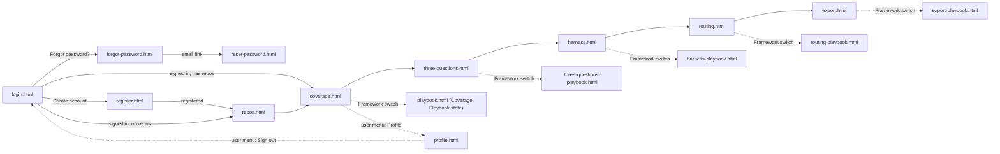

# TfLens — UI Design Spec (Mockups)

> **What this is.** The approved visual design for TfLens, produced at day-1 (greenfield) before any UI is built and **revised 2026-08-26** after the owner's review (AppManager login + registration, per-user repo management, dark-first collapsible shell with icons and a user menu, click-through flow). Each screen has a **rendered mockup** (`docs/mockups/{screen}.html`, styled to look like TrBlazeUI) and a **component map** that ties every region to a real **TrBlazeUI control**, so the build (`/trblazeui`) reproduces it 1:1 and the verifier's visual-truth gate (`verify-phase.md §4b`) can diff the live screen against it. This is a HUMAN document → rendered to HTML. The owner APPROVES it (alongside the BRD + Architecture) before build.

## Table of Contents

1. [How to use](#how-to-use)
2. [Design system (TrBlazeUI)](#design-system-trblazeui)
3. [Click-through flow](#click-through-flow)
4. [Screens](#screens)
   - [Screen: Login (`/login`)](#screen-login-login)
   - [Screen: Register (`/register`)](#screen-register-register)
   - [Screen: Forgot password (`/forgot-password`)](#screen-forgot-password-forgot-password)
   - [Screen: Reset password (`/reset-password`)](#screen-reset-password-reset-password)
   - [Screen: Repos (`/repos`)](#screen-repos-repos)
   - [Screen: Profile (`/profile`)](#screen-profile-profile)
   - [Screen: Coverage / health (`/`)](#screen-coverage-health)
   - [Screen: Three questions (`/three-questions`)](#screen-three-questions-three-questions)
   - [Screen: Harness comparison (`/harness`)](#screen-harness-comparison-harness)
   - [Screen: Routing & economics (`/routing`)](#screen-routing-economics-routing)
   - [Screen: Snapshot export (`/export`)](#screen-snapshot-export-export)
   - [Screen: Playbook framework state of the report pages](#screen-playbook-framework-state-of-the-report-pages)
5. [Library gaps](#library-gaps)

## How to use

- Every screen below links to its rendered mockup in `docs/mockups/`. Open `docs/mockups/login.html` first — the set is a **click-through**: every link and nav item goes to the sibling mockup, so the whole app can be walked from login to export.
- The **Component map** is the build contract: `region → TrBlazeUI control`. Only controls that actually exist in the TrBlazeUI library are used (catalog: `TrBlazeUI-AI-Reference.md`, TrBlazeUI.Components 1.0.7, cross-checked against the GitHub repo `techierathore/TrBlazeUI` at mockup time). If a screen needs something the library lacks, it is flagged in §Library gaps and logged to `docs/TfLens-TrBlazeUI-Feedback.md` at build time.
- To change a screen after approval: run `*mockups TfLens --update` (or `*amend-docs` for a requirement change that adds screens).

## Design system (TrBlazeUI)

- **Source:** TrBlazeUI component library (`TrBlazeUI.Primitives` + `TrBlazeUI.Components` + `TrBlazeUI.Icons.Lucide`; Tailwind v4 utilities; shadcn/ui design language with OKLCH tokens `--background`, `--foreground`, `--card`, `--muted`, `--muted-foreground`, `--primary`, `--border`, `--destructive`, `--alert-success/info/warning/danger`, `--chart-1..5`, `--radius: 0.625rem`, `--sidebar*`).
- **Theme — dark first (BRD-85, ADR-014):** `<html class="dark">` on first visit; the header toggle (`Switch` with sun/moon `LucideIcon`) flips the class and persists the choice per user. Both palettes are TrBlazeUI's own `:root` / `.dark` token sets — nothing custom.
- **Layout shell:** `SidebarProvider` (`DefaultOpen=true`, `HeightClass="h-screen"`, `CookieKey="tflens:sidebar"`) → `Sidebar Collapsible="true"` with `SidebarHeader` (brand mark + "TfLens" + "lens on TechieFlow & Playbook"), `SidebarContent`, `SidebarFooter` (theme `Switch`) and `SidebarRail` → `SidebarInset` holding the header `<header class="flex h-16 items-center gap-3 border-b bg-background px-4">` with `SidebarTrigger`, `Breadcrumb` (section › page), the **Framework switch** — `Tabs` used as a segmented control (`TabsList` + two `TabsTrigger`: "TechieFlow" and "Playbook", each with a `Badge` repo count; `data-testid="framework-switch"`; persisted per user; BRD-108) — spacer, `Button` **Sync now** (`LucideIcon refresh-cw`), `Badge Variant=Outline` "synced 12 min ago", theme toggle, and the **user menu** — `DropdownMenu` whose trigger is `Avatar` (initials) + display name + `LucideIcon chevron-down`, with `DropdownMenuLabel` (email), `DropdownMenuItem` Profile (`user`), Manage repos (`git-branch`), `DropdownMenuSeparator`, Sign out (`log-out`). Page container `
@Body
`. Plus `<ToastProvider Position="BottomRight" />` and `<PortalHost />`.
- **Navigation:** `SidebarGroup` → `SidebarGroupLabel "Workspace"` → `SidebarMenuItem`/`SidebarMenuButton Href Tooltip IsActive` **Repos** (`git-branch`); `SidebarGroupLabel "Reports"` → **Coverage / health** (`activity`), **Three questions** (`help-circle`), **Harness comparison** (`git-compare`), **Routing & economics** (`route`), **Snapshot export** (`download`). (The separate Playbook item was retired 2026-08-26 — the framework is chosen in the header.) Collapsed state shows icon only with `Tooltip` (the `Tooltip` parameter of `SidebarMenuButton`). `SidebarMenuBadge` shows the repo count on Repos.
- **KPI pattern:** TrBlazeUI has no stat card; every KPI is the library's documented composition — `Card` → `CardHeader class="flex flex-row items-center justify-between pb-2"` (`CardTitle class="text-sm font-medium"` + `LucideIcon`) → `CardContent` (`div.text-2xl.font-bold` + `p.text-xs.text-muted-foreground`). Grid `grid gap-4 md:grid-cols-2 lg:grid-cols-4`. A small trend line uses `--chart-1` colour.
- **Figures:** a `Figure` renders as a number, or as the literal text `insufficient data (n=…)` in `text-muted-foreground italic`, or as `—`. Estimates always carry a `Badge Variant=Outline` reading **estimate**. Backfilled columns carry a `Badge Variant=Secondary` reading **backfilled**.
- **Auth pages** (no shell): split layout — left brand panel (`bg-sidebar`, product name, one-line purpose, three bullet benefits with `LucideIcon check`), right a centred `Card` (max-w-sm) holding the form. Same on all four auth screens so they read as one flow.
- **Controls inventory used:** `StatTile`/`StatGroup` (KPI cards — see §Library gaps), `PasswordStrength`, `CodeBlock`, `CenteredPanel`, `SidebarProvider`, `Sidebar`, `SidebarHeader`, `SidebarContent`, `SidebarFooter`, `SidebarRail`, `SidebarGroup`, `SidebarGroupLabel`, `SidebarMenu`, `SidebarMenuItem`, `SidebarMenuButton`, `SidebarMenuBadge`, `SidebarInset`, `SidebarTrigger`, `Breadcrumb` (+ `BreadcrumbList`, `BreadcrumbItem`, `BreadcrumbLink`, `BreadcrumbPage`, `BreadcrumbSeparator`), `DropdownMenu` (+ `DropdownMenuTrigger`, `DropdownMenuContent`, `DropdownMenuLabel`, `DropdownMenuItem`, `DropdownMenuSeparator`), `Avatar` (+ `AvatarFallback`), `Card` (+ `CardHeader`, `CardTitle`, `CardDescription`, `CardContent`, `CardFooter`, `CardAction`), `DataTable` + `DataTableColumn`, `Badge`, `Alert` (+ `AlertTitle`, `AlertDescription`), `Tabs` (+ `TabsList`, `TabsTrigger`, `TabsContent`), `Button`, `Input`, `Label`, `Field` (+ `FieldLabel`, `FieldContent`, `FieldDescription`, `FieldError`), `Select` (+ `SelectTrigger`, `SelectValue`, `SelectContent`, `SelectItem`), `Dialog` (+ `DialogTrigger`, `DialogContent`, `DialogHeader`, `DialogTitle`, `DialogDescription`, `DialogFooter`, `DialogClose`), `AlertDialog` (+ `AlertDialogTrigger`, `AlertDialogContent`, `AlertDialogHeader`, `AlertDialogTitle`, `AlertDialogDescription`, `AlertDialogFooter`, `AlertDialogCancel`, `AlertDialogAction`), `Collapsible` (+ `CollapsibleTrigger`, `CollapsibleContent`), `Progress`, `Tooltip` (+ `TooltipTrigger`, `TooltipContent`), `Skeleton`, `Spinner`, `Empty` (+ `EmptyIcon`, `EmptyTitle`, `EmptyDescription`, `EmptyAction`), `ToastProvider` / `ToastService`, `Switch`, `Separator`, `ChartContainer` + `BarChart`, `LucideIcon`, `TypographyH2`/`TypographyMuted`.

## Click-through flow

Every sidebar item and every user-menu item in every shell mockup links to the corresponding file, so the set is navigable in any order.

## Screens

### Screen: Login (`/login`)

**Mockup:** [docs/mockups/login.html](./mockups/login.html) · **Role(s):** anonymous → User · **BRD:** BRD-1, BRD-2, BRD-90, BRD-94 (deferred) · **REQ:** (assigned by split-brd)

**Layout (one line):** split page — left brand panel, right centred `Card` with email + password, Sign in, links to Register and Forgot password; no GitHub button in this release (position reserved, noted in a muted line).

**Component map:**

| Region | TrBlazeUI control | Shows / binds | States |
|--------|-------------------|---------------|--------|
| Brand panel | `div.bg-sidebar` + `TypographyH2` "TfLens" + `TypographyMuted` + 4× `LucideIcon check` bullets | tagline **"A read-only lens over TechieFlow and AI-First-Playbook telemetry"** · bullets: "Both frameworks, one dashboard" · "Connect any public repo" · "Numbers you can quote" · "Free & open source" | — |
| Card | `Card` → `CardHeader` (`CardTitle` "Sign in", `CardDescription` "with your AppManager account") | — | — |
| Email | `Field` → `FieldLabel` + `Input Type=Email` `data-testid="login-email"` | binds `Email` | required; `IsInvalid` on error |
| Password | `Field` → `FieldLabel` + `Input Type=Password` `data-testid="login-pass"` + `Button Variant=Ghost Size=IconSmall` eye toggle | binds `Password` | required |
| Error | `Alert Variant=Danger` (only after a failed attempt) | "Sign-in failed. Check your email and password." | hidden by default |
| Submit | `Button Type=Submit` full width `data-testid="login-submit"` | "Sign in" | `Disabled` + `Spinner Size=Small` while calling AppManager |
| Links | `Button Variant=Link` ×2 | "Forgot password?" → `/forgot-password` · "Create an account" → `/register` | — |
| SSO note | `TypographyMuted` | "GitHub sign-in: coming in a later release" | — |
| Footer | `TypographyMuted` | "Identity by AppManager · public repos only in this release" | — |

**Notes / interactions:** Enter submits; return URL preserved; on success redirect to return URL, else `/repos` when the user has no repos, else `/`.

**Empty / loading / error:** loading = button spinner; error = generic `Alert`, fields keep values; `ACCOUNT_LOCKED` shows "Account locked — try again later" (the only specific message, per AppManager 423).

### Screen: Register (`/register`)

**Mockup:** [docs/mockups/register.html](./mockups/register.html) · **Role(s):** anonymous → User · **BRD:** BRD-91, BRD-95 · **REQ:** (assigned by split-brd)

**Layout (one line):** same split page; `Card` with first name, last name, email, password, confirm password, Create account; link back to Sign in.

**Component map:**

| Region | TrBlazeUI control | Shows / binds | States |
|--------|-------------------|---------------|--------|
| Names | 2× `Field` → `Input Type=Text` `data-testid="reg-first"` / `"reg-last"` in a 2-col grid | binds FirstName / LastName | required |
| Email | `Field` → `Input Type=Email` `data-testid="reg-email"` | binds Email | required; `FieldError` "already registered" on AppManager duplicate |
| Password | `Field` → `Input Type=Password` `data-testid="reg-pass"` + `FieldDescription` "8+ chars, an uppercase letter, a number, a special character" + `Progress` strength bar | binds Password | `FieldError` per rule violated (local check before the API) |
| Confirm | `Field` → `Input Type=Password` `data-testid="reg-confirm"` | binds Confirm | `FieldError` "passwords differ" |
| Role note | `Alert Variant=Info AccentBorder` | "Every TfLens account is a Manager — no licence, no subscription." | always |
| Submit | `Button Type=Submit` full width `data-testid="reg-submit"` | "Create account" | spinner while calling |
| Link | `Button Variant=Link` | "Already have an account? Sign in" | — |

**Notes / interactions:** on success the user is signed in and lands on `/repos` (empty state).

**Empty / loading / error:** server errors (`VALIDATION_ERROR`, `DECRYPTION_FAILED`) show a generic danger `Alert`; field-level rules are shown inline before submit.

### Screen: Forgot password (`/forgot-password`)

**Mockup:** [docs/mockups/forgot-password.html](./mockups/forgot-password.html) · **Role(s):** anonymous · **BRD:** BRD-92 · **REQ:** (assigned by split-brd)

**Layout (one line):** split page; `Card` with one email field and Send reset link; success state replaces the form.

**Component map:**

| Region | TrBlazeUI control | Shows / binds | States |
|--------|-------------------|---------------|--------|
| Email | `Field` → `Input Type=Email` `data-testid="forgot-email"` | binds Email | required |
| Submit | `Button Type=Submit` full width `data-testid="forgot-submit"` | "Send reset link" | spinner |
| Success | `Alert Variant=Success` replacing the form | "If that address exists, a reset link is on its way." (enumeration-safe) | after submit, always |
| Link | `Button Variant=Link` | "Back to sign in" | — |

**Empty / loading / error:** never reveals whether the email exists.

### Screen: Reset password (`/reset-password`)

**Mockup:** [docs/mockups/reset-password.html](./mockups/reset-password.html) · **Role(s):** anonymous · **BRD:** BRD-92 · **REQ:** (assigned by split-brd)

**Layout (one line):** split page; `Card` with new password + confirm + Reset; token comes from the query string.

**Component map:**

| Region | TrBlazeUI control | Shows / binds | States |
|--------|-------------------|---------------|--------|
| New password | `Field` → `Input Type=Password` `data-testid="reset-pass"` + strength `Progress` | binds Password | rule errors inline |
| Confirm | `Field` → `Input Type=Password` `data-testid="reset-confirm"` | binds Confirm | mismatch error |
| Submit | `Button Type=Submit` `data-testid="reset-submit"` | "Reset password" | spinner |
| Invalid token | `Alert Variant=Danger` replacing the form | "This reset link is invalid or has expired." (`INVALID_RESET_TOKEN` / `APP_ID_MISMATCH`) | when AppManager rejects |
| Success | `Alert Variant=Success` + `Button` "Sign in" | "Password updated." | after success |

### Screen: Repos (`/repos`)

**Mockup:** [docs/mockups/repos.html](./mockups/repos.html) · **Role(s):** User · **BRD:** BRD-98..BRD-104 · **REQ:** (assigned by split-brd)

**Layout (one line):** shell; page header row (title + "Connect repo" primary button); 3 KPI cards (repos, records, last sync); `DataTable` of the user's repos with row actions; Connect dialog and Remove alert dialog; empty state for a new user.

**Component map:**

| Region | TrBlazeUI control | Shows / binds | States |
|--------|-------------------|---------------|--------|
| Header row | `TypographyH2` "Repos" + `TypographyMuted` "Public GitHub repos you've connected" + `Button` **Connect repo** (`LucideIcon plus`) `data-testid="connect-repo"` | — | — |
| KPI row | 3× `Card` (KPI): Connected repos · Records synced · Last successful sync | counts | zero-state |
| Repos grid | `DataTable TData=UserRepoRow ShowToolbar=true ShowPagination=true InitialPageSize=10` `data-testid="repos-table"`; columns: Repo (owner/name + `LucideIcon github` link) · Branch · Kind (`Badge` techieflow / playbook) · Visibility (`Badge Variant=Outline` public) · Status (`Badge` synced / syncing / error) · Last sync · Records · Actions | user's repos | row error → `Tooltip` with LastError |
| Row actions | `Button Variant=Ghost Size=IconSmall` Sync (`refresh-cw`) `data-testid="repo-sync-{name}"` · `Button Variant=Ghost Size=IconSmall` Remove (`trash-2`) `data-testid="repo-remove-{name}"` | — | Sync shows `Spinner` |
| Connect dialog | `Dialog` → `DialogContent` (`DialogTitle` "Connect a public GitHub repo") → `Field` `Input` "GitHub URL or owner/name" `data-testid="connect-input"` · `Field` `Input` "Branch (optional)" · `Field` `Select` Kind (Auto-detect / techieflow / playbook) · `Button Variant=Outline` **Validate** `data-testid="connect-validate"` · validation result list (3× line with `LucideIcon check`/`x`: "Repository exists" · "Public" · "Telemetry path found: docs/metrics (techieflow)") · `DialogFooter` `DialogClose` Cancel + `Button` **Connect** `data-testid="connect-submit"` (enabled only after a green validation) | — | private → `Alert Variant=Warning` "Private repos aren't supported in this release"; no path → `Alert Variant=Danger` |
| Remove dialog | `AlertDialog` (`AlertDialogTitle` "Remove owner/name?", `AlertDialogDescription` "Stops syncing and deletes the parsed rows and raw archive for this repo. Your GitHub repo is untouched.") `AlertDialogAction Variant=Destructive` "Remove" | — | — |
| Empty | `Empty` (`EmptyIcon git-branch`, `EmptyTitle` "No repos connected yet", `EmptyDescription` "Connect a public GitHub repo that carries TechieFlow or Playbook telemetry.", `EmptyAction` → Connect repo) `data-testid="repos-empty"` | — | new user |

**Notes / interactions:** Connect runs the first sync immediately and toasts the outcome; the sidebar Repos badge updates; a second dialog state "Connecting…" shows a `Progress`.

**Empty / loading / error:** covered above; GitHub rate-limit → `Alert Variant=Warning` "GitHub rate limit reached — try again in N minutes".

### Screen: Profile (`/profile`)

**Mockup:** [docs/mockups/profile.html](./mockups/profile.html) · **Role(s):** User · **BRD:** BRD-107, BRD-95 · **REQ:** (assigned by split-brd)

**Layout (one line):** shell; two cards side by side — read-only AppManager profile, and change-password form.

**Component map:**

| Region | TrBlazeUI control | Shows / binds | States |
|--------|-------------------|---------------|--------|
| Profile card | `Card` → `Avatar` (initials) + name · `DataTable ShowToolbar=false ShowPagination=false` key/value: Email · Name · Role (`Badge` Manager) · Member since · Identity provider (AppManager) | `GET /UserSvc/profile` | `Skeleton` while loading |
| Change password | `Card` → 3× `Field` `Input Type=Password` (current, new, confirm) `data-testid="pw-current"`/`"pw-new"`/`"pw-confirm"` + `Button` "Update password" `data-testid="pw-submit"` | `POST /UserSvc/change-password` | `FieldError` `INVALID_CURRENT_PASSWORD` / rules; toast on success |
| Note | `Alert Variant=Info` | "TfLens stores no passwords — your account lives in AppManager." | always |

### Screen: Coverage / health (`/`)

**Mockup:** [docs/mockups/coverage.html](./mockups/coverage.html) · **Role(s):** User, Owner · **BRD:** BRD-39..BRD-44, BRD-21, BRD-6 · **REQ:** (assigned by split-brd)

**Layout (one line):** shell; summary strip (status alert + 4 KPI cards); one `Card` per connected repo in a 2-column grid, each with a stream staleness table and warnings; unknown-fields `Collapsible`; Rebuild-from-raw card at the bottom.

**Component map:**

| Region | TrBlazeUI control | Shows / binds | States |
|--------|-------------------|---------------|--------|
| Status strip | `Alert Variant=Success` "GREEN — 5 repos synced, nothing stale" **or** `Alert Variant=Warning` "CHECK — 2 warnings" `data-testid="coverage-status"` | summary | — |
| KPI row | 4× `Card` (KPI): Repos synced · Gate records (live / backfilled) · Newest record age · Sync errors | counts | zero-state "0" |
| Repo card ×N | `Card` → `CardHeader` (`CardTitle` owner/name, `Badge` kind, `Badge Variant=Outline` short SHA linked) → `CardContent` | last sync, outcome, per-stream table | error state: `Alert Variant=Danger` with LastError text |
| Per-stream table | `DataTable TData=StreamRow ShowToolbar=false ShowPagination=false` `data-testid="repo-streams-{name}"`; columns Stream · Records · Backfilled · Newest · Days since | 4 rows (runs, gates, sessions, commits); a playbook repo shows one `events` row | stale row → `Badge Variant=Destructive` "stale" |
| Staleness warning | `Alert Variant=Warning AccentBorder` | "sessions/commits stale ≥ 7 days — this clone isn't pushing or lacks hooks; run update-framework.sh on it" | only when stale |
| Unknown fields | `Collapsible` → `CollapsibleTrigger` "Fields observed that SCHEMA.md doesn't document (n)" → list of `Badge Variant=Outline` per field grouped by repo/stream; `Alert Variant=Info` if any `v > 1` | field names only | empty: "none" |
| Rebuild | `Card` → `CardTitle` "Rebuild from raw" → `AlertDialog` (`AlertDialogTrigger` `Button Variant=Destructive` "Rebuild…" `data-testid="rebuild"`, `AlertDialogAction` "Drop and reparse") | last rebuild report | `Progress` while replaying |

**Notes / interactions:** Sync now and Rebuild refresh in place; SHA badge opens the GitHub commit; cards stack to one column under `md`; a user with no repos is redirected to `/repos`.

**Empty / loading / error:** first run before any sync → `Empty` ("No sync yet", action Sync now); loading → `Skeleton` cards; per-repo error → danger alert inside that card, others unaffected.

### Screen: Three questions (`/three-questions`)

**Mockup:** [docs/mockups/three-questions.html](./mockups/three-questions.html) · **Role(s):** User, Owner, Author · **BRD:** BRD-45..BRD-50 · **REQ:** (assigned by split-brd)

**Layout (one line):** shell; standing SCHEMA §6 note; `Tabs` — one tab per project_type present (`app`, `library`, `docs`, `framework`, `unclassified`) with **no "all" tab**; inside each tab: 3 KPI cards (live) with the backfilled value beneath as a labelled secondary line, the gate distribution table with live and backfilled columns and a horizontal bar per row, late-gate coverage lines, and the taint list collapsible.

**Component map:**

| Region | TrBlazeUI control | Shows / binds | States |
|--------|-------------------|---------------|--------|
| Standing note | `Alert Variant=Info` | "Figures are never combined across project_type or across live/backfilled (SCHEMA.md §6). There is no total." | always |
| Type tabs | `Tabs DefaultValue="app"` → `TabsList` → `TabsTrigger` per type (label + `Badge` record count) `data-testid="type-tab-{type}"` | — | only types with records appear; `unclassified` labelled "unclassified (project_type inferred)" |
| Question cards | 3× `Card` (KPI): First-pass rate · Escape rate · Failures scored — big live value; secondary line `Badge Variant=Secondary` "backfilled" + value | `Figure` | `insufficient data (n=…)` italic muted text when n < 3 |
| Segment facts | `TypographyMuted` line | "live: 41 records, 17 REQs scored, 3 excluded by backfill taint" | — |
| Gate distribution | `DataTable TData=GateRow ShowToolbar=false ShowPagination=false` `data-testid="gate-dist-{type}"`; columns Gate · Live count · Live share (with `Progress` bar) · Backfilled count · Backfilled share; rows in order build, acceptance, render, visual, perf, standards, **escaped**, unattributed | counts + `%` | `escaped` row has `Badge Variant=Destructive` "no gate caught it"; `perf` row has `Badge Variant=Outline` "see coverage" |
| Late-gate coverage | `Card` → `CardContent` one line per late gate | "perf gate: ran on 6 records, caught 1 → insufficient data (n=6)" / "not yet run on this data (gate added 2026-08-10)" | — |
| Taint list | `Collapsible` → trigger "3 REQs excluded from the live first-pass rate" → `Badge Variant=Outline` per REQ ID `data-testid="taint-list"` | REQ IDs | empty: "none" |

**Notes / interactions:** tab choice persisted per session; every figure has a `Tooltip` with its formula (SCHEMA.md §8 wording).

**Empty / loading / error:** no gate records → `Empty` "No gate records yet — run *verify on a connected repo"; loading → `Skeleton`.

### Screen: Harness comparison (`/harness`)

**Mockup:** [docs/mockups/harness.html](./mockups/harness.html) · **Role(s):** User, Owner, Author · **BRD:** BRD-51..BRD-55 · **REQ:** (assigned by split-brd)

**Layout (one line):** shell; explanatory note; one `Card` column per detected harness side by side (**claude-code · opencode · codex**), each with the same rows; a footnote row for `harness: null`; below, a tokens-by-harness bar chart and the OpenCode-only dollars card. *(amended 2026-08-26: Codex CLI column; null is a footnote, never a column — BRD-51, BRD-55, ADR-017)*

**Component map:**

| Region | TrBlazeUI control | Shows / binds | States |
|--------|-------------------|---------------|--------|
| Note | `Alert Variant=Info` | "Tokens may be compared across harness; dollars may not. Claude Code and Codex cost is null by design." | always |
| Harness columns | `div.grid.gap-4.md:grid-cols-3` → `Card` per harness (`CardTitle` harness name + `LucideIcon`) `data-testid="harness-col-{claude-code|opencode|codex}"` | — | a harness with 0 records still renders with `—` |
| Not-detected footnote | `TypographyMuted` row under the columns `data-testid="harness-null-footnote"` | "*n* records with harness not detected — excluded from the columns above" | hidden when n = 0 |
| Column rows | `DataTable TData=KeyValueRow ShowToolbar=false ShowPagination=false` inside each card: Runs · Runs by cmd (top 3) · Gate records · Verdict mix · Sessions · Tokens in / out / cache read / cache write · Tokens per Verified REQ | values | `insufficient data (n=…)` text |
| Tokens chart | `ChartContainer Class="h-[280px]"` → `BarChart TItem=HarnessTokens XValue=harness YValue=tokens` (`--chart-1..3`) | total tokens per harness | empty: `Empty` "no token data" |
| Dollars | `Card` (`CardTitle` "Measured dollars (OpenCode only)", `Badge Variant=Secondary` "the only measured dollars in the system") → big `$` value + `TypographyMuted` "Claude Code and Codex: not measured (null by design)" `data-testid="opencode-cost"` | Σ `cost_usd` for `opencode` | no OpenCode records → "no OpenCode records yet" |

**Notes / interactions:** no total dollar row anywhere; columns wrap to one per row under `md`.

### Screen: Routing & economics (`/routing`)

**Mockup:** [docs/mockups/routing.html](./mockups/routing.html) · **Role(s):** User, Owner, Author · **BRD:** BRD-56..BRD-62 · **REQ:** (assigned by split-brd)

**Layout (one line):** shell; `Tabs` Routing drift · Tokens by model · Repricing (estimate) · Poolable metrics; the Repricing tab has two big cards (actual mix vs all-at-max) with the estimate badge and an "Edit prices" dialog button.

**Component map:**

| Region | TrBlazeUI control | Shows / binds | States |
|--------|-------------------|---------------|--------|
| Tabs | `Tabs DefaultValue="drift"` → `TabsTrigger` drift / models / repricing / poolable `data-testid="routing-tab-{key}"` | — | — |
| Drift summary | 3× `Card` (KPI): Runs with routing fields · `routed:false` runs · Distinct observed models | counts | — |
| Drift table | `DataTable TData=DriftRow` `data-testid="drift-table"`; columns cmd · tier · tier_model · observed model · models · routed · ts | rows for `routed:false` first | `routed:false` → `Badge Variant=Destructive` "drift"; empty → `Empty` "no routing fields captured yet" |
| Tokens by model | `DataTable TData=ModelTokens` (model · in · out · cache read · cache write · total) + `ChartContainer` → `BarChart` totals | Σ per model | — |
| Repricing cards | 2× `Card`: "Actual mix" and "All runs at most expensive model (`claude-opus-…`)"; each `Badge Variant=Outline` **estimate — tokens × rate card, not measured spend**; big `$` value; `TypographyMuted` "n runs excluded (tokens_scope none)" `data-testid="repricing-actual"` / `"repricing-max"` | computed from `prices.json` | missing price → `Alert Variant=Warning` naming the model |
| Delta | `Card` "Counterfactual delta" | max − actual, `%` | — |
| Edit prices | `Dialog` (`DialogTrigger` `Button Variant=Outline` "Edit prices.json" `data-testid="edit-prices"`) → `DialogContent` with a `DataTable` of editable rows (`Input Type=Number` per cell) + `Button` Save / `DialogClose` Cancel | model · input · output · cache read · cache write USD per 1M | validation `FieldError`; toast on save |
| Poolable metrics | 5× `Card` (KPI): Rework ratio · Batch size (median) · REQ throughput (REQs/hour) · Tokens per Verified · Commit cadence (+ duplicates collapsed) | from engine `Pooled` | `insufficient data (n=…)` |

### Screen: Snapshot export (`/export`)

**Mockup:** [docs/mockups/export.html](./mockups/export.html) · **Role(s):** User, Author, Parity operator · **BRD:** BRD-63, BRD-65, BRD-66, BRD-67, BRD-70 · **REQ:** (assigned by split-brd)

**Layout (one line):** shell; quotable / not-quotable banner; Export card with the button and the dataset SHAs; past snapshots table with download links; parity record card.

**Component map:**

| Region | TrBlazeUI control | Shows / binds | States |
|--------|-------------------|---------------|--------|
| Quotable banner | `Alert Variant=Success` "QUOTABLE — …" **or** `Alert Variant=Warning` "NOT QUOTABLE — parser changed after the last parity run; re-run the parity procedure" `data-testid="quotable-banner"` | parity vs parser version | — |
| Export card | `Card` → `Button` **Export snapshot** (`LucideIcon download`) `data-testid="export-now"` + `TypographyMuted` "writes data/reports/<you>/<date>/snapshot.md + tflens.json" | — | `Spinner`; toast |
| Dataset SHAs | `DataTable ShowToolbar=false ShowPagination=false` (repo · branch · SHA · synced) with copy `Button Size=IconSmall` | from `sync_state` | — |
| Past snapshots | `DataTable TData=SnapshotRow` `data-testid="snapshots"` (date · parser version · parity status · snapshot.md · tflens.json links) | user's folders | empty → `Empty` "no snapshots yet" |
| Parity record | `Card` "Last parity run" → date, dataset SHAs, script hash, parser version, compare output (`pre`) | `data/parity-last.json` | none → `Alert Variant=Warning` |

### Screen: Playbook framework state of the report pages

**Mockup:** [playbook.html](./mockups/playbook.html) (Coverage) · [three-questions-playbook.html](./mockups/three-questions-playbook.html) · [harness-playbook.html](./mockups/harness-playbook.html) · [routing-playbook.html](./mockups/routing-playbook.html) · [export-playbook.html](./mockups/export-playbook.html) — each report page's Playbook pill opens its own Playbook-state mockup · **Role(s):** User, Owner · **BRD:** BRD-73..BRD-76, BRD-108..BRD-110 · **REQ:** (assigned by split-brd) · **Phase 3**

*(amended 2026-08-26: the separate `/playbook` page is retired. Every report page has a Playbook state selected by the header Framework switch; the layouts are identical to the TechieFlow state, only the data and a few labels change. This one mockup documents the pattern on Coverage; the other four pages have their own Playbook-state mockups, linked above.)*

**Layout (one line):** the Coverage layout with the Framework switch showing **Playbook** active; a Playbook info note; repo cards for Playbook repos (stream table shows `events`, or the four v1 streams if the repo has converged); populated state (State A) and the Phase-3 empty state (State B).

**Component map (deltas from the TechieFlow state only):**

| Region | TrBlazeUI control | Shows / binds | States |
|--------|-------------------|---------------|--------|
| Framework switch | header `Tabs` segmented control — **Playbook** trigger active (`Badge` repo count) `data-testid="framework-switch"` | — | persisted per user |
| Note | `Alert Variant=Info` | "Playbook process-gates (phase_gate) and TechieFlow assertion-gates (gate) are different axes and never share a chart (SCHEMA.md §11). Figures are never pooled across frameworks." | always |
| Repo card ×N | `Card` (`CardTitle` owner/name, `Badge` "playbook", `Badge` SHA); stream table row `events` (or v1 streams) | — | — |
| Phase totals (Three questions page, Playbook state) | `DataTable TData=PhaseRow ShowToolbar=false` `data-testid="pb-phases-{name}"` (phase_gate · events · caught · escaped · tokens · cost if present) | keyed by `phase_gate` | cost absent → `—`; n < 3 → `insufficient data (n=…)` |
| Main vs subagent (Routing page, Playbook state) | 2× `StatTile`: Main-session tokens · Sub-agent tokens (via parentID) + `Progress` share bar | split | — |
| Schema discovery (Coverage) | `Collapsible` "Observed fields" → list of `Badge` | field names from overflow | — |
| Empty | `Empty` (`EmptyTitle` "No Playbook data yet", `EmptyDescription` "Phase 3 — the report set for Playbook repos is built after the real events.ndjson is parsed", `EmptyAction` → Connect a Playbook repo) `data-testid="playbook-empty"` | — | default until Phase 3 |

**Notes / interactions:** switching framework re-queries every figure on the page; the export writes one snapshot per framework.

## Library gaps

Cross-check against the live repo `github.com/techierathore/TrBlazeUI` (2026-08-26, mockup rebuild) — every control in the inventory exists there, and the repo is **newer than the 1.0.7 reference doc**. Three gaps listed at day-1 are closed by components the repo already ships; the build MUST use these instead of the workarounds:

- **KPI cards → `StatTile` / `StatGroup`** (`Components/Stat/`). Every "`Card` (KPI)" region in the maps above is built with `StatTile` (title, value, sub-line, icon); the `Card` composition is the fallback only if `StatTile` lacks a needed slot.
- **Password strength → `PasswordStrength`** (`Components/PasswordStrength/`) on Register, Reset password and Profile — not `Progress`.
- **Parity-compare output → `CodeBlock`** on Snapshot export — not a raw `<pre>`.
- **Auth card centring → `CenteredPanel`** for the four auth pages' right column.

Remaining gaps (to be logged as `TR-NNN` in `docs/TfLens-TrBlazeUI-Feedback.md` at build if still true):

- No plain `Table` primitives — small key/value tables use `DataTable` with toolbar and pagination off.
- No theme-toggle component — a `Switch` (with `LucideIcon sun`/`moon`) flips `class="dark"`; dark is the default.
- Chart API documented only as `TItem`/`Items`/`XValue`/`YValue` — no axis/legend control; charts are supplementary, every figure also has a text table.
- The `TrBlazeUI-AI-Reference.md` deployed by NuGet 1.0.7 lags the repo (`StatTile`, `PasswordStrength`, `CodeBlock`, `CenteredPanel`, `Grid`, `Timeline`, `Stepper`, `AnchorNav` are undocumented there) — worth a doc-refresh note to the library team.
