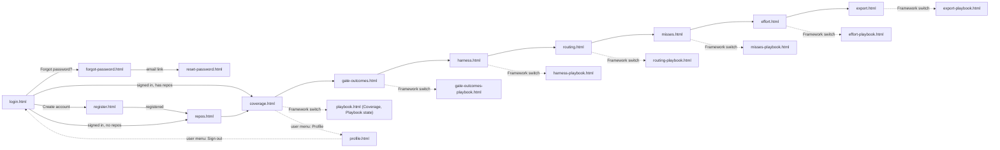

# TfLens — UI Design Spec (Mockups)

> **What this is.** The approved visual design for TfLens, produced at day-1 (greenfield) before any UI is built, **revised 2026-08-26** after the owner's review, **extended 2026-08-28** with the `/misses` screen and its Playbook state (F-MISS), and **extended 2026-09-01** with the `/effort` screen and its Playbook state (F-EFFORT) — which also adds the eighth nav item to the shell and fills in the Playbook axis of `/misses` (AppManager login + registration, per-user repo management, dark-first collapsible shell with icons and a user menu, click-through flow). Each screen has a **rendered mockup** (`docs/mockups/{screen}.html`, styled to look like TrBlazeUI) and a **component map** that ties every region to a real **TrBlazeUI control**, so the build (`/trblazeui`) reproduces it 1:1 and the verifier's visual-truth gate (`verify-phase.md §4b`) can diff the live screen against it. This is a HUMAN document → rendered to HTML. The owner APPROVES it (alongside the BRD + Architecture) before build.

## Table of Contents

1. [How to use](#how-to-use)
2. [Design system (TrBlazeUI)](#design-system-trblazeui)
3. [Click-through flow](#click-through-flow)
4. [Screens](#screens)
   - [Screen: Login (`/login`)](#screen-login-login)
   - [Screen: Register (`/register`)](#screen-register-register)
   - [Screen: Forgot password (`/forgot-password`)](#screen-forgot-password-forgot-password)
   - [Screen: Reset password (`/reset-password`)](#screen-reset-password-reset-password)
   - [Screen: Repos (`/repos`)](#screen-repos-repos)
   - [Screen: Profile (`/profile`)](#screen-profile-profile)
   - [Screen: Coverage / health (`/`)](#screen-coverage-health)
   - [Screen: Gate outcomes (`/gate-outcomes`)](#screen-gate-outcomes-gate-outcomes)
   - [Screen: Harness comparison (`/harness`)](#screen-harness-comparison-harness)
   - [Screen: Routing & economics (`/routing`)](#screen-routing-economics-routing)
   - [Screen: Misses & rework (`/misses`)](#screen-misses-rework-misses)
   - [Screen: Phase effort (`/effort`)](#screen-phase-effort-effort)
   - [Screen: Snapshot export (`/export`)](#screen-snapshot-export-export)
   - [Screen: Playbook framework state of the report pages](#screen-playbook-framework-state-of-the-report-pages)
5. [Library gaps](#library-gaps)

## How to use

- Every screen below links to its rendered mockup in `docs/mockups/`. Open `docs/mockups/login.html` first — the set is a **click-through**: every link and nav item goes to the sibling mockup, so the whole app can be walked from login to export.
- The **Component map** is the build contract: `region → TrBlazeUI control`. Only controls that actually exist in the TrBlazeUI library are used (catalog: `TrBlazeUI-AI-Reference.md`, TrBlazeUI.Components 1.0.7, cross-checked against the GitHub repo `techierathore/TrBlazeUI` at mockup time). If a screen needs something the library lacks, it is flagged in §Library gaps and logged to `docs/TfLens-TrBlazeUI-Feedback.md` at build time.
- To change a screen after approval: run `*mockups TfLens --update` (or `*amend-docs` for a requirement change that adds screens).

## Design system (TrBlazeUI)

- **Source:** TrBlazeUI component library (`TrBlazeUI.Primitives` + `TrBlazeUI.Components` + `TrBlazeUI.Icons.Lucide`; Tailwind v4 utilities; shadcn/ui design language with OKLCH tokens `--background`, `--foreground`, `--card`, `--muted`, `--muted-foreground`, `--primary`, `--border`, `--destructive`, `--alert-success/info/warning/danger`, `--chart-1..5`, `--radius: 0.625rem`, `--sidebar*`).
- **Theme — dark first (BRD-85, ADR-014):** `<html class="dark">` on first visit; the header toggle (`Switch` with sun/moon `LucideIcon`) flips the class and persists the choice per user. Both palettes are TrBlazeUI's own `:root` / `.dark` token sets — nothing custom.
- **Layout shell:** `SidebarProvider` (`DefaultOpen=true`, `HeightClass="h-screen"`, `CookieKey="tflens:sidebar"`) → `Sidebar Collapsible="true"` with `SidebarHeader` (brand mark + "TfLens" + "lens on TechieFlow & Playbook"), `SidebarContent`, `SidebarFooter` (theme `Switch`) and `SidebarRail` → `SidebarInset` holding the header `<header class="flex h-16 items-center gap-3 border-b bg-background px-4">` with `SidebarTrigger`, `Breadcrumb` (section › page), the **Framework switch** — `Tabs` used as a segmented control (`TabsList` + two `TabsTrigger`: "TechieFlow" and "Playbook", each with a `Badge` repo count; `data-testid="framework-switch"`; persisted per user; BRD-108) — spacer, `Button` **Sync now** (`LucideIcon refresh-cw`), `Badge Variant=Outline` "synced 12 min ago", theme toggle, and the **user menu** — `DropdownMenu` whose trigger is `Avatar` (initials) + display name + `LucideIcon chevron-down`, with `DropdownMenuLabel` (email), `DropdownMenuItem` Profile (`user`), Manage repos (`git-branch`), `DropdownMenuSeparator`, Sign out (`log-out`). Page container `
@Body
`. Plus `<ToastProvider Position="BottomRight" />` and `<PortalHost />`.
- **Navigation:** `SidebarGroup` → `SidebarGroupLabel "Workspace"` → `SidebarMenuItem`/`SidebarMenuButton Href Tooltip IsActive` **Repos** (`git-branch`); `SidebarGroupLabel "Reports"` → **Coverage / health** (`activity`), **Gate outcomes** (`shield-check` — renamed from *Three questions* 2026-09-01; a question-mark icon no longer fits the label), **Harness comparison** (`git-compare`), **Routing & economics** (`route`), **Misses & rework** (`bug` — added 2026-08-28), **Phase effort** (`gauge` — added 2026-09-01, BRD-151; it sits between *Misses & rework* and *Snapshot export* deliberately — both are cost lenses, and the reader should meet the quality question before the budget one), **Snapshot export** (`download`). (The separate Playbook item was retired 2026-08-26 — the framework is chosen in the header.) Collapsed state shows icon only with `Tooltip` (the `Tooltip` parameter of `SidebarMenuButton`). `SidebarMenuBadge` shows the repo count on Repos.
- **KPI pattern:** TrBlazeUI has no stat card; every KPI is the library's documented composition — `Card` → `CardHeader class="flex flex-row items-center justify-between pb-2"` (`CardTitle class="text-sm font-medium"` + `LucideIcon`) → `CardContent` (`div.text-2xl.font-bold` + `p.text-xs.text-muted-foreground`). Grid `grid gap-4 md:grid-cols-2 lg:grid-cols-4`. A small trend line uses `--chart-1` colour.
- **Figures:** a `Figure` renders as a number, or as the literal text `insufficient data (n=…)` in `text-muted-foreground italic`, or as `—`. Estimates always carry a `Badge Variant=Outline` reading **estimate**. Backfilled columns carry a `Badge Variant=Secondary` reading **backfilled**.
- **Auth pages** (no shell): split layout — left brand panel (`bg-sidebar`, product name, one-line purpose, three bullet benefits with `LucideIcon check`), right a centred `Card` (max-w-sm) holding the form. Same on all four auth screens so they read as one flow.
- **Controls inventory used:** `StatTile`/`StatGroup` (KPI cards — see §Library gaps), `PasswordStrength`, `CodeBlock`, `CenteredPanel`, `SidebarProvider`, `Sidebar`, `SidebarHeader`, `SidebarContent`, `SidebarFooter`, `SidebarRail`, `SidebarGroup`, `SidebarGroupLabel`, `SidebarMenu`, `SidebarMenuItem`, `SidebarMenuButton`, `SidebarMenuBadge`, `SidebarInset`, `SidebarTrigger`, `Breadcrumb` (+ `BreadcrumbList`, `BreadcrumbItem`, `BreadcrumbLink`, `BreadcrumbPage`, `BreadcrumbSeparator`), `DropdownMenu` (+ `DropdownMenuTrigger`, `DropdownMenuContent`, `DropdownMenuLabel`, `DropdownMenuItem`, `DropdownMenuSeparator`), `Avatar` (+ `AvatarFallback`), `Card` (+ `CardHeader`, `CardTitle`, `CardDescription`, `CardContent`, `CardFooter`, `CardAction`), `DataTable` + `DataTableColumn`, `Badge`, `Alert` (+ `AlertTitle`, `AlertDescription`), `Tabs` (+ `TabsList`, `TabsTrigger`, `TabsContent`), `Button`, `Input`, `Label`, `Field` (+ `FieldLabel`, `FieldContent`, `FieldDescription`, `FieldError`), `Select` (+ `SelectTrigger`, `SelectValue`, `SelectContent`, `SelectItem`), `Dialog` (+ `DialogTrigger`, `DialogContent`, `DialogHeader`, `DialogTitle`, `DialogDescription`, `DialogFooter`, `DialogClose`), `AlertDialog` (+ `AlertDialogTrigger`, `AlertDialogContent`, `AlertDialogHeader`, `AlertDialogTitle`, `AlertDialogDescription`, `AlertDialogFooter`, `AlertDialogCancel`, `AlertDialogAction`), `Collapsible` (+ `CollapsibleTrigger`, `CollapsibleContent`), `Progress`, `Tooltip` (+ `TooltipTrigger`, `TooltipContent`), `Skeleton`, `Spinner`, `Empty` (+ `EmptyIcon`, `EmptyTitle`, `EmptyDescription`, `EmptyAction`), `ToastProvider` / `ToastService`, `Switch`, `Separator`, `ChartContainer` + `BarChart`, `LucideIcon` (incl. `bug` for the Misses nav item and `upload` / `cloud-download` / `hard-drive` for the two source modes, added 2026-08-28; `gauge` for the Phase effort nav item plus `git-fork` / `layers` / `cpu` / `dollar-sign` / `filter` for the effort bands, added 2026-09-01), `TypographyH2`/`TypographyMuted`.
- **Shell revision 2026-09-01 (BRD-144).** The shared mockup stylesheet gained an *overflow-containment* block so wide content scrolls **inside its own container** and never past the app shell: `.card-c.flush` and `.panel` are `overflow-x:auto` at every width, grid/stack children carry `min-width:0`, a `<b>` inside an `Alert` body stays **inline** (only the alert title is a block), badges wrap below 700px, and a `.mono` token inside a table cell is **never** broken mid-token — the table scrolls instead, because a formatted number must not break mid-digit. Every shell mockup now passes a headless check at **1280 and 390** for document overflow, container overflow, broken icon references and JS errors.

## Click-through flow

Every sidebar item and every user-menu item in every shell mockup links to the corresponding file, so the set is navigable in any order.

## Screens

### Screen: Login (`/login`)

**Mockup:** [docs/mockups/login.html](./mockups/login.html) · **Role(s):** anonymous → User · **BRD:** BRD-1, BRD-2, BRD-90, BRD-94 (deferred) · **REQ:** (assigned by split-brd)

**Layout (one line):** split page — left brand panel, right centred `Card` with email + password, Sign in, links to Register and Forgot password; no GitHub button in this release (position reserved, noted in a muted line).

**Component map:**

| Region | TrBlazeUI control | Shows / binds | States |
|--------|-------------------|---------------|--------|
| Brand panel | `div.bg-sidebar` + `TypographyH2` "TfLens" + `TypographyMuted` + 4× `LucideIcon check` bullets | tagline **"A read-only lens over TechieFlow and AI-First-Playbook telemetry"** · bullets: "Both frameworks, one dashboard" · "Connect any public repo" · "Numbers you can quote" · "Free & open source" | — |
| Card | `Card` → `CardHeader` (`CardTitle` "Sign in", `CardDescription` "with your AppManager account") | — | — |
| Email | `Field` → `FieldLabel` + `Input Type=Email` `data-testid="login-email"` | binds `Email` | required; `IsInvalid` on error |
| Password | `Field` → `FieldLabel` + `Input Type=Password` `data-testid="login-pass"` + `Button Variant=Ghost Size=IconSmall` eye toggle | binds `Password` | required |
| Error | `Alert Variant=Danger` (only after a failed attempt) | "Sign-in failed. Check your email and password." | hidden by default |
| Submit | `Button Type=Submit` full width `data-testid="login-submit"` | "Sign in" | `Disabled` + `Spinner Size=Small` while calling AppManager |
| Links | `Button Variant=Link` ×2 | "Forgot password?" → `/forgot-password` · "Create an account" → `/register` | — |
| SSO note | `TypographyMuted` | "GitHub sign-in: coming in a later release" | — |
| Footer | `TypographyMuted` | "Identity by AppManager · public repos only in this release" | — |

**Notes / interactions:** Enter submits; return URL preserved; on success redirect to return URL, else `/repos` when the user has no repos, else `/`.

**Empty / loading / error:** loading = button spinner; error = generic `Alert`, fields keep values; `ACCOUNT_LOCKED` shows "Account locked — try again later" (the only specific message, per AppManager 423).

### Screen: Register (`/register`)

**Mockup:** [docs/mockups/register.html](./mockups/register.html) · **Role(s):** anonymous → User · **BRD:** BRD-91, BRD-95 · **REQ:** (assigned by split-brd)

**Layout (one line):** same split page; `Card` with first name, last name, email, password, confirm password, Create account; link back to Sign in.

**Component map:**

| Region | TrBlazeUI control | Shows / binds | States |
|--------|-------------------|---------------|--------|
| Names | 2× `Field` → `Input Type=Text` `data-testid="reg-first"` / `"reg-last"` in a 2-col grid | binds FirstName / LastName | required |
| Email | `Field` → `Input Type=Email` `data-testid="reg-email"` | binds Email | required; `FieldError` "already registered" on AppManager duplicate |
| Password | `Field` → `Input Type=Password` `data-testid="reg-pass"` + `FieldDescription` "8+ chars, an uppercase letter, a number, a special character" + `Progress` strength bar | binds Password | `FieldError` per rule violated (local check before the API) |
| Confirm | `Field` → `Input Type=Password` `data-testid="reg-confirm"` | binds Confirm | `FieldError` "passwords differ" |
| Role note | `Alert Variant=Info AccentBorder` | "Every TfLens account is a Manager — no licence, no subscription." | always |
| Submit | `Button Type=Submit` full width `data-testid="reg-submit"` | "Create account" | spinner while calling |
| Link | `Button Variant=Link` | "Already have an account? Sign in" | — |

**Notes / interactions:** on success the user is signed in and lands on `/repos` (empty state).

**Empty / loading / error:** server errors (`VALIDATION_ERROR`, `DECRYPTION_FAILED`) show a generic danger `Alert`; field-level rules are shown inline before submit.

### Screen: Forgot password (`/forgot-password`)

**Mockup:** [docs/mockups/forgot-password.html](./mockups/forgot-password.html) · **Role(s):** anonymous · **BRD:** BRD-92 · **REQ:** (assigned by split-brd)

**Layout (one line):** split page; `Card` with one email field and Send reset link; success state replaces the form.

**Component map:**

| Region | TrBlazeUI control | Shows / binds | States |
|--------|-------------------|---------------|--------|
| Email | `Field` → `Input Type=Email` `data-testid="forgot-email"` | binds Email | required |
| Submit | `Button Type=Submit` full width `data-testid="forgot-submit"` | "Send reset link" | spinner |
| Success | `Alert Variant=Success` replacing the form | "If that address exists, a reset link is on its way." (enumeration-safe) | after submit, always |
| Link | `Button Variant=Link` | "Back to sign in" | — |

**Empty / loading / error:** never reveals whether the email exists.

### Screen: Reset password (`/reset-password`)

**Mockup:** [docs/mockups/reset-password.html](./mockups/reset-password.html) · **Role(s):** anonymous · **BRD:** BRD-92 · **REQ:** (assigned by split-brd)

**Layout (one line):** split page; `Card` with new password + confirm + Reset; token comes from the query string.

**Component map:**

| Region | TrBlazeUI control | Shows / binds | States |
|--------|-------------------|---------------|--------|
| New password | `Field` → `Input Type=Password` `data-testid="reset-pass"` + strength `Progress` | binds Password | rule errors inline |
| Confirm | `Field` → `Input Type=Password` `data-testid="reset-confirm"` | binds Confirm | mismatch error |
| Submit | `Button Type=Submit` `data-testid="reset-submit"` | "Reset password" | spinner |
| Invalid token | `Alert Variant=Danger` replacing the form | "This reset link is invalid or has expired." (`INVALID_RESET_TOKEN` / `APP_ID_MISMATCH`) | when AppManager rejects |
| Success | `Alert Variant=Success` + `Button` "Sign in" | "Password updated." | after success |

### Screen: Repos (`/repos`)

**Mockup:** [docs/mockups/repos.html](./mockups/repos.html) · **Role(s):** User · **BRD:** BRD-98..BRD-104, **BRD-131..BRD-141** · **REQ:** REQ-UI-011, REQ-UI-012, REQ-UI-013, **REQ-UI-040, REQ-UI-041** *(amended 2026-08-28 r2 — F-IMPORT folded in here as a second mode rather than a separate `/import` screen, owner decision)*

**Layout (one line):** shell; page header row (title + "Add source" primary button); 3 KPI cards (sources, records, last sync); `DataTable` of the user's sources **with a Source column** and row actions that differ by source kind; a two-mode Add-source dialog (**Fetch via API** | **Import metric files**, the latter with a drop zone and a preview-before-commit), Remove alert dialog; empty state offering both routes.

**Component map:**

| Region | TrBlazeUI control | Shows / binds | States |
|--------|-------------------|---------------|--------|
| Header row | `TypographyH2` "Repos" + `TypographyMuted` "Sources you've added — fetched or imported" + `Button` **Add source** (`LucideIcon plus`) `data-testid="connect-repo"` | — | — |
| KPI row | 3× `Card` (KPI): Connected repos · Records synced · Last successful sync | counts | zero-state |
| Repos grid | `DataTable TData=UserRepoRow ShowToolbar=true ShowPagination=true InitialPageSize=10` `data-testid="repos-table"`; columns: Repo (owner/name + `LucideIcon github` or `hard-drive`) · Branch · Kind (`Badge` techieflow / playbook) · **Source** (`Badge Variant=Info` **Synced** / `Badge Variant=Secondary` **Imported**) `data-testid="repo-source-{name}"` · Visibility (`Badge Variant=Outline` public / private) · Status · Last sync **or** last import · Records · Actions | user's sources | row error → `Tooltip` with LastError · *(Source column added 2026-08-28 r2 — BRD-132)* |
| Row actions | Fetched: `Button Variant=Ghost Size=IconSmall` Sync (`refresh-cw`) `data-testid="repo-sync-{name}"`. **Imported: Re-import (`upload`) `data-testid="repo-reimport-{name}"` — never a disabled Sync, which would be a lie about what the row can do.** Both: Remove (`trash-2`) `data-testid="repo-remove-{name}"` | — | Sync / Re-import show `Spinner` |
| **Mode fork** *(2026-08-28 r2)* | `Dialog` → `DialogContent` (`DialogTitle` "Add a source") → `Tabs DefaultValue="api"` → `TabsList` + 2× `TabsTrigger` **Fetch via API** (`cloud-download`) and **Import metric files** (`upload`) `data-testid="source-mode"` | which of the two paths below is shown | the fork is the **first** thing in the dialog — a deliberate, visible choice, not a fallback discovered after a failure |
| Connect dialog — **Fetch via API** tab | `TabsContent` → `DialogContent` (`DialogTitle` "Connect a public GitHub repo") → `Field` `Input` "GitHub URL or owner/name" `data-testid="connect-input"` · `Field` `Input` "Branch (optional)" · `Field` `Select` Kind (Auto-detect / techieflow / playbook) · `Button Variant=Outline` **Validate** `data-testid="connect-validate"` · validation result list (3× line with `LucideIcon check`/`x`: "Repository exists" · "Public" · "Telemetry path found: docs/metrics (techieflow)") · `DialogFooter` `DialogClose` Cancel + `Button` **Connect** `data-testid="connect-submit"` (enabled only after a green validation) | — | private → `Alert Variant=Warning` "**Private repos can't be fetched — use *Import metric files* to add this repo's telemetry without a credential**" with an inline `Button Variant=Link` that switches the tab (BRD-100, amended); no path → `Alert Variant=Danger` |
| Import dialog — **Import metric files** tab *(2026-08-28 r2)* | `TabsContent` → `Field` `Input` "Source name" (e.g. `acme/internal-app`) `data-testid="import-name"` · `Field` `Select` Framework (TechieFlow / Playbook) · `Field` `Select` `project_type` override (optional) · a drop zone `div` (dashed border, `LucideIcon upload`, "Drop a `.zip` of `docs/metrics/`, or the `.jsonl` files") `data-testid="import-drop"` · `DialogFooter` `DialogClose` Cancel + `Button` **Import** `data-testid="import-submit"` (**enabled only after a preview renders**) | — | refusals render as `Alert Variant=Danger` naming what to upload instead: a precomputed rollup / `tflens.json` / snapshot (BRD-140), an unsafe archive, or nothing recognised |
| Import **preview** (before commit) | `Card` inside the tab `data-testid="import-preview"` → `DataTable ShowToolbar=false ShowPagination=false` (stream · records · date range · invalid lines) + `Badge Variant=Outline` bundle sha256 (short) + a `Collapsible` of unknown field names | the dry-run parse | **nothing is written until Import is pressed** — cancelling leaves zero rows and zero archive files (BRD-138) |
| Remove dialog | `AlertDialog` (`AlertDialogTitle` "Remove owner/name?", `AlertDialogDescription` "Stops syncing and deletes the parsed rows and raw archive for this repo. Your GitHub repo is untouched.") `AlertDialogAction Variant=Destructive` "Remove" | — | — |
| Empty | `Empty` (`EmptyIcon git-branch`, `EmptyTitle` "No sources yet", `EmptyDescription` "Fetch a public GitHub repo, or import the metric files from a private one.", `EmptyAction` → **two** `Button`s, one per mode) `data-testid="repos-empty"` | — | new user — both routes offered from the first screen |

**Notes / interactions:** Connect runs the first sync immediately and toasts the outcome; Import commits after the preview is reviewed and toasts records added / duplicates collapsed per stream; the sidebar Repos badge updates; a second dialog state ("Connecting…" / "Importing…") shows a `Progress`. **The header Sync now and the background poller skip imported sources** — they have no remote to contact (BRD-103).

**Empty / loading / error:** covered above; GitHub rate-limit → `Alert Variant=Warning` "GitHub rate limit reached — try again in N minutes".

### Screen: Profile (`/profile`)

**Mockup:** [docs/mockups/profile.html](./mockups/profile.html) · **Role(s):** User · **BRD:** BRD-107, BRD-95 · **REQ:** (assigned by split-brd)

**Layout (one line):** shell; two cards side by side — read-only AppManager profile, and change-password form.

**Component map:**

| Region | TrBlazeUI control | Shows / binds | States |
|--------|-------------------|---------------|--------|
| Profile card | `Card` → `Avatar` (initials) + name · `DataTable ShowToolbar=false ShowPagination=false` key/value: Email · Name · Role (`Badge` Manager) · Member since · Identity provider (AppManager) | `GET /UserSvc/profile` | `Skeleton` while loading |
| Change password | `Card` → 3× `Field` `Input Type=Password` (current, new, confirm) `data-testid="pw-current"`/`"pw-new"`/`"pw-confirm"` + `Button` "Update password" `data-testid="pw-submit"` | `POST /UserSvc/change-password` | `FieldError` `INVALID_CURRENT_PASSWORD` / rules; toast on success |
| Note | `Alert Variant=Info` | "TfLens stores no passwords — your account lives in AppManager." | always |

### Screen: Coverage / health (`/`)

**Mockup:** [docs/mockups/coverage.html](./mockups/coverage.html) · **Role(s):** User, Owner · **BRD:** BRD-39..BRD-44, BRD-21, BRD-6 · **REQ:** (assigned by split-brd)

**Layout (one line):** shell; summary strip (status alert + 4 KPI cards); one `Card` per connected repo in a 2-column grid, each with a stream staleness table and warnings; unknown-fields `Collapsible`; Rebuild-from-raw card at the bottom.

**Component map:**

| Region | TrBlazeUI control | Shows / binds | States |
|--------|-------------------|---------------|--------|
| Status strip | `Alert Variant=Success` "GREEN — 5 repos synced, nothing stale" **or** `Alert Variant=Warning` "CHECK — 2 warnings" `data-testid="coverage-status"` | summary | — |
| KPI row | 4× `Card` (KPI): Repos synced · Gate records (live / backfilled) · Newest record age · Sync errors | counts | zero-state "0" |
| Repo card ×N | `Card` → `CardHeader` (`CardTitle` owner/name, `Badge` kind, `Badge Variant=Outline` short SHA linked) → `CardContent` | last sync, outcome, per-stream table | error state: `Alert Variant=Danger` with LastError text |
| Per-stream table | `DataTable TData=StreamRow ShowToolbar=false ShowPagination=false` `data-testid="repo-streams-{name}"`; columns Stream · Records · Backfilled · Newest · Days since | **5 rows** (runs, gates, sessions, commits, **misses** — amended 2026-08-28); a playbook repo shows one `events` row | stale row → `Badge Variant=Destructive` "stale" |
| Miss data quality *(2026-08-28)* | `Card` → `DataTable ShowToolbar=false ShowPagination=false` `data-testid="escapes-missing-why"` / `"orphan-misses"`: escapes with no `why_missed` · orphan `miss-fix` · orphan `miss-amend` | counts only | these are **data-quality** facts, not quality figures — they live here and never on the `/misses` KPI row |
| Reclassification split *(2026-08-28)* | `Alert Variant=Warning AccentBorder` `data-testid="reclass-split"` | "This repo is classified `app` today but carries 225 records written as `docs`. §6 forbids pooling across `project_type`, so it appears as two segments — each a *period* of the project, not the whole of it." | only when the current classification disagrees with the stored records |
| Misses without fixes *(2026-08-28)* | `Alert Variant=Warning` | "n misses recorded and no `miss-fix` records at all — the fix path may not be wired up yet." | a **warning, never an error**; the health badge does not fail on it |
| Source badge *(2026-08-28 r2)* | `Badge Variant=Info` **Synced** / `Badge Variant=Secondary` **Imported** on each repo card header `data-testid="repo-source-badge-{name}"` | `UserRepo.SourceKind` | always — origin is shown everywhere and pools nowhere (BRD-136, ADR-021) |
| Staleness warning | `Alert Variant=Warning AccentBorder` | **fetched:** "sessions/commits stale ≥ 7 days — this clone isn't pushing or lacks hooks; run update-framework.sh on it" · **imported** *(2026-08-28 r2)*: "last imported 12 days ago — this source can't refresh itself; re-import to update" | only when stale; the hook diagnosis is **never** shown on an imported source — it would be advice about a clone TfLens cannot see (BRD-137) |
| Unknown fields | `Collapsible` → `CollapsibleTrigger` "Fields observed that SCHEMA.md doesn't document (n)" → list of `Badge Variant=Outline` per field grouped by repo/stream; `Alert Variant=Info` if any `v > 1` | field names only | empty: "none" |
| Rebuild | `Card` → `CardTitle` "Rebuild from raw" → `AlertDialog` (`AlertDialogTrigger` `Button Variant=Destructive` "Rebuild…" `data-testid="rebuild"`, `AlertDialogAction` "Drop and reparse") | last rebuild report | `Progress` while replaying |

**Notes / interactions:** Sync now and Rebuild refresh in place; SHA badge opens the GitHub commit; cards stack to one column under `md`; a user with no repos is redirected to `/repos`.

**Empty / loading / error:** first run before any sync → `Empty` ("No sync yet", action Sync now); loading → `Skeleton` cards; per-repo error → danger alert inside that card, others unaffected.

### Screen: Gate outcomes (`/gate-outcomes`)

**Mockup:** [docs/mockups/gate-outcomes.html](./mockups/gate-outcomes.html) · **Role(s):** User, Owner, Author · **BRD:** BRD-45..BRD-50 · **REQ:** (assigned by split-brd)

**Layout (one line):** shell; standing SCHEMA §6 note; `Tabs` — one tab per project_type present (`app`, `library`, `docs`, `framework`, `unclassified`) with **no "all" tab**; inside each tab: 3 KPI cards (live) with the backfilled value beneath as a labelled secondary line, the gate distribution table with live and backfilled columns and a horizontal bar per row, late-gate coverage lines, and the taint list collapsible.

**Component map:**

| Region | TrBlazeUI control | Shows / binds | States |
|--------|-------------------|---------------|--------|
| Standing note | `Alert Variant=Info` | "Figures are never combined across project_type or across live/backfilled (SCHEMA.md §6). There is no total." | always |
| Type tabs | `Tabs DefaultValue="app"` → `TabsList` → `TabsTrigger` per type (label + `Badge` record count) `data-testid="type-tab-{type}"` | — | only types with records appear; `unclassified` labelled "unclassified (project_type inferred)" |
| Question cards | 3× `Card` (KPI): First-pass rate · Escape rate · Failures scored — big live value; secondary line `Badge Variant=Secondary` "backfilled" + value | `Figure` | `insufficient data (n=…)` italic muted text when n < 3 |
| Segment facts | `TypographyMuted` line | "live: 41 records, 17 REQs scored, 3 excluded by backfill taint" | — |
| Gate distribution | `DataTable TData=GateRow ShowToolbar=false ShowPagination=false` `data-testid="gate-dist-{type}"`; columns Gate · Live count · Live share (with `Progress` bar) · Backfilled count · Backfilled share; rows in order build, acceptance, render, visual, perf, standards, **escaped**, unattributed | counts + `%` | `escaped` row has `Badge Variant=Destructive` "no gate caught it"; `perf` row has `Badge Variant=Outline` "see coverage" |
| Late-gate coverage | `Card` → `CardContent` one line per late gate | "perf gate: ran on 6 records, caught 1 → insufficient data (n=6)" / "not yet run on this data (gate added 2026-08-10)" | — |
| Taint list | `Collapsible` → trigger "3 REQs excluded from the live first-pass rate" → `Badge Variant=Outline` per REQ ID `data-testid="taint-list"` | REQ IDs | empty: "none" |

**Notes / interactions:** tab choice persisted per session; every figure has a `Tooltip` with its formula (SCHEMA.md §8 wording).

**Empty / loading / error:** no gate records → `Empty` "No gate records yet — run *verify on a connected repo"; loading → `Skeleton`.

### Screen: Harness comparison (`/harness`)

**Mockup:** [docs/mockups/harness.html](./mockups/harness.html) · **Role(s):** User, Owner, Author · **BRD:** BRD-51..BRD-55 · **REQ:** (assigned by split-brd)

**Layout (one line):** shell; explanatory note; one `Card` column per detected harness side by side (**claude-code · opencode · codex**), each with the same rows; a footnote row for `harness: null`; below, a tokens-by-harness bar chart and the OpenCode-only dollars card. *(amended 2026-08-26: Codex CLI column; null is a footnote, never a column — BRD-51, BRD-55, ADR-017)*

**Component map:**

| Region | TrBlazeUI control | Shows / binds | States |
|--------|-------------------|---------------|--------|
| Note | `Alert Variant=Info` | "Tokens may be compared across harness; dollars may not. Claude Code and Codex cost is null by design." | always |
| Harness columns | `div.grid.gap-4.md:grid-cols-3` → `Card` per harness (`CardTitle` harness name + `LucideIcon`) `data-testid="harness-col-{claude-code|opencode|codex}"` | — | a harness with 0 records still renders with `—` |
| Not-detected footnote | `TypographyMuted` row under the columns `data-testid="harness-null-footnote"` | "*n* records with harness not detected — excluded from the columns above" | hidden when n = 0 |
| Column rows | `DataTable TData=KeyValueRow ShowToolbar=false ShowPagination=false` inside each card: Runs · Runs by cmd (top 3) · Gate records · Verdict mix · Sessions · Tokens in / out / cache read / cache write · Tokens per Verified REQ | values | `insufficient data (n=…)` text |
| Tokens chart | `ChartContainer Class="h-[280px]"` → `BarChart TItem=HarnessTokens XValue=harness YValue=tokens` (`--chart-1..3`) | total tokens per harness | empty: `Empty` "no token data" |
| Dollars | `Card` (`CardTitle` "Measured dollars (OpenCode only)", `Badge Variant=Secondary` "the only measured dollars in the system") → big `$` value + `TypographyMuted` "Claude Code and Codex: not measured (null by design)" `data-testid="opencode-cost"` | Σ `cost_usd` for `opencode` | no OpenCode records → "no OpenCode records yet" |

**Notes / interactions:** no total dollar row anywhere; columns wrap to one per row under `md`.

### Screen: Routing & economics (`/routing`)

**Mockup:** [docs/mockups/routing.html](./mockups/routing.html) · **Role(s):** User, Owner, Author · **BRD:** BRD-56..BRD-62 · **REQ:** (assigned by split-brd)

**Layout (one line):** shell; `Tabs` Routing drift · Tokens by model · Repricing (estimate) · Poolable metrics; the Repricing tab has two big cards (actual mix vs all-at-max) with the estimate badge and an "Edit prices" dialog button.

**Component map:**

| Region | TrBlazeUI control | Shows / binds | States |
|--------|-------------------|---------------|--------|
| Tabs | `Tabs DefaultValue="drift"` → `TabsTrigger` drift / models / repricing / poolable `data-testid="routing-tab-{key}"` | — | — |
| Drift summary | 3× `Card` (KPI): Runs with routing fields · `routed:false` runs · Distinct observed models | counts | — |
| Drift table | `DataTable TData=DriftRow` `data-testid="drift-table"`; columns cmd · tier · tier_model · observed model · models · routed · ts | rows for `routed:false` first | `routed:false` → `Badge Variant=Destructive` "drift"; empty → `Empty` "no routing fields captured yet" |
| Tokens by model | `DataTable TData=ModelTokens` (model · in · out · cache read · cache write · total) + `ChartContainer` → `BarChart` totals | Σ per model | — |
| Repricing cards | 2× `Card`: "Actual mix" and "All runs at most expensive model (`claude-opus-…`)"; each `Badge Variant=Outline` **estimate — tokens × rate card, not measured spend**; big `$` value; `TypographyMuted` "n runs excluded (tokens_scope none)" `data-testid="repricing-actual"` / `"repricing-max"` | computed from `prices.json` | missing price → `Alert Variant=Warning` naming the model |
| Delta | `Card` "Counterfactual delta" | max − actual, `%` | — |
| Edit prices | `Dialog` (`DialogTrigger` `Button Variant=Outline` "Edit prices.json" `data-testid="edit-prices"`) → `DialogContent` with a `DataTable` of editable rows (`Input Type=Number` per cell) + `Button` Save / `DialogClose` Cancel | model · input · output · cache read · cache write USD per 1M | validation `FieldError`; toast on save |
| Poolable metrics | 5× `Card` (KPI): Rework ratio · Batch size (median) · REQ throughput (REQs/hour) · Tokens per Verified · Commit cadence (+ duplicates collapsed) | from engine `Pooled` | `insufficient data (n=…)` |

### Screen: Misses & rework (`/misses`)

**Mockup:** [docs/mockups/misses.html](./mockups/misses.html) · Playbook state: [docs/mockups/misses-playbook.html](./mockups/misses-playbook.html) · **Role(s):** User, Owner, Author · **BRD:** BRD-118..BRD-126 (feature F-MISS, BRD-112..BRD-130) · **REQ:** REQ-UI-035..REQ-UI-038 · **Phase 3** *(added 2026-08-28)*

**Layout (one line):** shell; page header with a period `Select` defaulting to **All history**; a standing note separating this page's *escape share* from Gate outcomes' *escape rate*; then four bands in the order that answers the owner's question — KPI row (two rows of `StatTile`, plus a visually distinct estimate tile on its own dashed row) · **Where misses come from** (origin phase × miss class, with the excluded-attribution count in the card footer, beside the failed-practice distribution carrying `n of N assessed` on its face) · **Who was running** (a standing observational `Alert Variant=Warning`, then origin model and origin agent side by side) · **Cost of rework** (three cards: measured · apportioned · unattributable) — closing with a per-miss `DataTable` whose raw record sits behind a `Collapsible`.

**Component map:**

| Region | TrBlazeUI control | Shows / binds | States |
|--------|-------------------|---------------|--------|
| Page header + period filter | `TypographyH2` "Misses & rework" + `TypographyMuted` + `Select` (`SelectTrigger`/`SelectItem`: All history · 7 · 30 · 90 days) `data-testid="misses-period"` | the selected window | **defaults to All history** (BRD-125) — a default period would routinely render `insufficient data (n=…)` on a page whose job is to show a trend |
| Escape-vs-escape note | `Alert Variant=Info` | "This page's **escape share** is `found_by ∈ {owner, production}` ÷ all misses, from `misses.jsonl`. The **escape rate** on Gate outcomes keeps its own definition and its own source (`gates.jsonl`). They are adjacent, never merged." | always — two definitions of one word on one page is how a report loses its reader |
| KPI row (band 1) | `StatGroup` → 8× `StatTile` in two `grid gap-4 md:grid-cols-4` rows `data-testid="miss-kpis"`; tiles `kpi-open`, `kpi-wontfix`, misses-this-period, median-time-to-close, `kpi-design-share`, `kpi-escape-share`, `kpi-rework-tokens`, `kpi-rework-usd` | `Figure` each, via `FigureText` | **open and declined are two tiles** — `wont-fix` never inside open, `deferred` always inside it (BRD-120); `insufficient data (n=…)` italic muted when n < 3 |
| Measured-dollars tile | `StatTile` with `Badge Variant=Success` "opencode · measured" and a success-tinted border `data-testid="kpi-rework-usd"` | Σ `CostUsd`, OpenCode records only | "no OpenCode records yet" when empty |
| Rate-card estimate tile | its **own** dashed `Card` on its **own** row, different treatment from every measured tile, `Badge Variant=Outline` **estimate — tokens × rate card, not measured spend** + `RateCard.EstimateLabel` `data-testid="kpi-rework-usd-estimate"` | tokens × `prices.json` for claude-code + codex | BRD-123, decision 6.3: shown by default (the owner's question is a money question) but never the same row and never the same styling as the measured tile |
| Origin phase × miss class (band 2) | `Card` → `DataTable TData=OriginRow ShowToolbar=false ShowPagination=false` `data-testid="miss-origin"`; rows = origin phase (+ an `unattributed` row), columns = miss class | counts | `CardFooter` states **"n of N misses excluded — `origin_confidence ≠ linked`"** `data-testid="miss-taint-count"`, split by `inferred` / `unknown` |
| Failed-practice distribution (band 2) | `Card` (`CardAction` `Badge Variant=Warning` "**28 of 41 misses assessed**") → `DataTable` of the seven `why_missed` values, each with a `Progress` share bar `data-testid="miss-whymissed"` | counts over records **carrying the field** | the `n of N assessed` badge is **on the card face, never a tooltip**; `CardFooter` states how many carry no assessment and how many **predate the field** (BRD-117); a `null` never lands in a bucket, `other` included |
| Observational note (band 3) | `Alert Variant=Warning` — one line of **standing page copy, not a tooltip** | "Miss counts per model and per agent are confounded by which model gets the hard work. Read these as a description of what ran, not as a ranking." | always (BRD-124) |
| By origin model / by origin agent | 2× `Card` → `DataTable` `data-testid="miss-origin-model"` / `"miss-origin-agent"`; model card carries misses · runs · per-100-runs, agent card carries misses · share · dominant class | `linked` records only | `CardAction` `Badge Variant=Outline` "36 linked"; a row under the minimum n renders `insufficient data (n=…)` and never a rate |
| Cost of rework (band 4) | `div.grid.gap-4.md:grid-cols-3` `data-testid="miss-cost"` → 3× `Card`: **Measured** (`cost_attribution: sole`) · **Apportioned** (`shared:n`, `Badge Variant=Warning` "apportioned") · **Unattributable** (`none`) | `MissCost.Sole` / `.Apportioned` / `.NoneCount` | there is **no control on this page that can render one blended number** — `MissCost` exposes no such property (ADR-019); `none` is a count, never a divisor |
| Per-miss detail | `Card` → `DataTable TData=MissRow ShowToolbar=true ShowPagination=true InitialPageSize=25` `data-testid="miss-detail"`; columns Miss · REQ · Class (`Badge Variant=Outline`) · Severity (`Badge` destructive/warning/secondary) · Origin (phase · agent + a `linked`/`inferred`/`unknown` `Badge`) · Found by · Status (`Badge`) · Tokens (+ `sole`/`shared:n` `Badge Variant=Secondary`) | folded records | `InitialPageSize` is set explicitly (TR-009 would otherwise truncate); an unattributable row shows `—`, never `0` |
| Raw record | `Collapsible` → `CollapsibleTrigger` "Raw record — `MISS-…`" → `CodeBlock` | the stored JSON | a folded `why_missed` states that the stored `miss` row still carries `null` — an amend completes a record, never edits it |

**Notes / interactions:** the period filter narrows every band at once and never gates the first view; switching Framework re-queries the whole page; every figure renders through `FigureText` so `insufficient data (n=…)` cannot become a number; charts (if added) load the `dataviz` skill and keep to the existing `--chart-1..5` palette so the page reads as part of the same system.

**Empty / loading / error:** no miss records → `Empty` ("No misses recorded yet — TfLens reads `misses.jsonl`; it never writes one"); loading → `Skeleton` tiles; a repo emitting misses with no `miss-fix` records at all is **not** an error here — Coverage says so as a warning (BRD-127).

**Playbook state** (`misses-playbook.html`) — *rebuilt 2026-09-01 (BRD-164..BRD-167)*: the axis is **populated**, not permanently empty. Identical layout and identical guards, four bands plus two extra cards that exist only because the Playbook carries two axes TechieFlow does not:

| Region (Playbook deltas only) | TrBlazeUI control | Shows / binds | States |
|--------|-------------------|---------------|--------|
| Ingest note | `Alert Variant=Info` | the records come from the Playbook's committed `misses.ndjson`, normalized by its exporter, imported through **Import metric files** into the **same** `Miss`/`MissFix`/`MissAmend` tables — no second ingest path; upsert on the **immutable source-line hash**, not the TechieFlow natural keys | always |
| KPI row | 8× `StatTile` | lifecycle **opened / closed / reopened / backlog** as four separate figures (`kpi-reopened` is its own tile, never folded into open or closed) · design-miss share · escape share · **rework incidence** with intensity beside it · median **and p90** time-to-close | `insufficient data (n=…)` below `MIN_N` |
| Stricter-guard note | `Alert Variant=Warning` | states the three-part guard in words: `origin_confidence: linked` **and** a complete valid source window **and** a non-null observed model; headline cost additionally needs `sole` + `cost_status: complete` | always (BRD-166) — the Playbook's guards are stricter than the TechieFlow stream's and are **not relaxed to match it** |
| Found-axes card | `Card` → `DataTable` `data-testid="miss-found-axes"` | `found_phase_gate` (**process**) and `found_gate` (**assertion**) as **two side-by-side columns**, each with its own counts | never summed, never merged, never one chart (BRD-165) |
| Item-identity card | `Card` → `DataTable` `data-testid="miss-id-axes"` | `item_id` (Playbook) beside `req_id` (TechieFlow) — one axis under two names, two columns on one table | the other edition's column renders `—`, never a filled-in guess |
| By origin model / tier | 2× `Card` → `DataTable` `data-testid="miss-origin-model"` / `"miss-origin-tier"` | 36 eligible of 63 | **there is no `unknown model` row and there never will be** — a bucket named for a model is a claim about a model; the 27 non-qualifying records live in the exclusion line |
| Cost of rework | 3× `Card` | **Measured** (sole + complete + `cost_status: complete`) · **Apportioned** (`shared:n`, its USD carried on a `Badge Variant=Warning`, separately labelled) · **Unattributable** (`none`, a count) | measured and apportioned never share a series, a total or an aggregate |
| Amendment diagnostics | `Card` → `DataTable` `data-testid="miss-amend-diagnostics"` | amendments folded · **orphans** · **overwrite conflicts** · duplicate source lines skipped | surfaced here and on Coverage — never applied or discarded silently (BRD-164) |
| Empty | `Empty` `data-testid="playbook-empty"` | "No Playbook miss data yet" + Connect-a-Playbook-repo | **now a condition, not the permanent shape of this axis** — it shows only when no Playbook miss records have been imported (BRD-126, BRD-167) |

**The Framework switch is rendered, never hidden.** A zero or a dash on the Playbook stream table is absence, not a good score.

### Screen: Phase effort (`/effort`)

**Mockup:** [docs/mockups/effort.html](./mockups/effort.html) · Playbook state: [docs/mockups/effort-playbook.html](./mockups/effort-playbook.html) · **Role(s):** Owner, Author, Ops · **BRD:** BRD-145..BRD-163, BRD-168, BRD-169 (feature F-EFFORT) · **REQ:** (assigned by split-brd) · **Phase 3** *(added 2026-09-01)*

**Layout (one line):** shell; page header with a period `Select` defaulting to **All history**; a standing budgeting-not-scoreboard note; then five bands — KPI row of **five** tiles ending in **fan-out coverage** · *What is excluded, and why* (the token-window and fan-out-observation denominators, side by side) · the **Command phase** table with `Measured` as a column · expandable per-phase detail of four bands in order (Time · Tokens · By model · Fan-out) · Routing, beside measured spend by harness.

**Component map:**

| Region | TrBlazeUI control | Shows / binds | States |
|--------|-------------------|---------------|--------|
| Page header + period filter | `TypographyH2` "Phase effort" + `TypographyMuted` + `Select` `data-testid="effort-period"` | the selected window | **defaults to All history**, for the same reason `/misses` does |
| Budgeting note | `Alert Variant=Info` | "`*build-phase` costing more than `*log-miss` is a fact about what those phases **are**" + links to Misses and Coverage | always (BRD-169) — the page must not frame effort as a quality ranking |
| KPI row | `StatGroup` → 5× `StatTile` in one `grid gap-4 lg:grid-cols-5` `data-testid="effort-kpis"`; tiles `kpi-runs`, `kpi-wallclock`, `kpi-tokens-out`, `kpi-heaviest`, `kpi-fanout-coverage` | runs recorded · Σ `duration_s` · Σ `tokens_out` · heaviest `cmd` by output share · `Σ observed_n / runs_live` | the token tile's sub-line is **`measured on n of N runs`** as visible text (BRD-146); the wall-clock sub-line says *never human effort*; the fan-out tile is a **coverage** figure and carries an accent border — deliberately on the KPI row rather than buried (BRD-151) |
| Token-window denominator | `Card` → `DataTable ShowToolbar=false ShowPagination=false` | one row per `tokens_scope` (`tree` / `conversation` / `main` / `none`-or-absent) | the `none`/absent row is `tokens_unmeasured_n` — excluded, **never averaged in as zero**; `CardFooter` states the `MIN_N = 3` floor |
| Fan-out denominator | `Card` `data-testid="effort-fanout-exclusions"` → `DataTable` with a `Progress` share bar per row | **Observed** (`tokens_scope == "tree"` **and** `subagent_runs != null`) · `unobserved_not_tree` (*we did not look*) · `unobserved_predates_field` (*we could not have looked*) | the two exclusions are **published two ways and never pooled** (BRD-147); `CardFooter` names the `FIELD_SINCE 2026-08-31` floor for the three §2.6 fields, in the same table and code path as `LATE_GATES` (BRD-148) |
| Phase table | `Card` → `DataTable TData=PhaseRow` `data-testid="effort-phases"`, one row per `cmd` sorted by output share | Command phase · Runs · Wall clock · Median · Share of time · Output tokens · Share of output · **Measured** · Fan-out | **`Measured` is a column, not a footnote** (BRD-151); a phase with no observed run reads **`not observed`**, never `0 subagents`; `share_of_*` are the oracle's own strings (`"87%"` / `"—"`) and are not reformatted |
| Phase-table footer | `CardFooter` + `TypographyMuted` | the dimension is the **Command phase**; a window is never split between conceptual phases by token proportion; a **whole-task total is unavailable** without an explicit cohort — a reused session is not one | always (BRD-157) |
| Per-phase detail | `Collapsible` per phase `data-testid="effort-phase-detail"`, one open by default → four `div.panel` bands **in this order** | **1 · Time** (total · median · max · share) · **2 · Tokens** (`measured on n of N` badge on the band label; mean **beside** median) · **3 · By model** (from `model_tokens_out`, with `Progress` share bars) · **4 · Fan-out** (`Alert Variant=Warning` stating **`observed_n of runs` first**, then the numbers) | mean beside median because a mean far above the median means one long run dominates the phase; the model band carries standing copy that the ranking is **observational, not causal** (BRD-150); the fan-out band carries the **declared-vs-measured** line and states in words that the measured figure is authoritative (BRD-149) |
| Routing band | `Card` `data-testid="effort-routing"` → `DataTable` (routed / drifted / unknown) with `Badge` + `Progress` | counts and shares | **`drifted` uses `Badge Variant=Info`, never destructive** — routing is observed, never enforced, and a red pill would assert a rule the framework does not have (BRD-151) |
| Measured spend | `Card` `data-testid="effort-cost"` → `DataTable` (harness · records · measured USD) | `cost_usd_by_harness` | a dash is **"no provider cost recorded"**, never `$0.00` and never "free"; **no rate-card estimate appears anywhere on this page** (BRD-160, BRD-169) — estimates stay on Routing & economics, on their own card |
| Actor note | `TypographyMuted` | "no figure on this page, in the API, in the export or in parity is grouped by `actor`" | always (BRD-168) — there is no parameter, filter or toggle that could produce such a grouping |

**Notes / interactions:** the period filter narrows every band at once; switching Framework re-queries the whole page; every figure renders through `FigureText` so `insufficient data (n=…)` cannot become a number. There is **no per-REQ or per-feature effort view** and no per-subagent cost attribution — both are standing non-goals, stated on the page itself rather than merely omitted.

**Empty / loading / error:** no live runs → `Empty` ("No runs recorded yet"); loading → `Skeleton` tiles; a phase whose runs all lack a token window renders its token cells as `—` with the phase still listed, never dropped.

**Playbook state** (`effort-playbook.html`) — **"Phase efficiency"**, the Playbook axis of the same route (BRD-162):

| Region (Playbook only) | TrBlazeUI control | Shows / binds | States |
|--------|-------------------|---------------|--------|
| Filters | `Card` → 12× `Select` `data-testid="pb-effort-filters"` | repository · date range · command phase · model · tier · harness · project type · complete/incomplete · active coverage · tokens scope · verdict snapshot · has-subagents | a model filter matches **any** `models[]` member, not only the dominant one (BRD-158) |
| Summary cards | 8× `StatTile` `data-testid="pb-effort-summary"` | completed phases · median **and p90** wall clock · complete-coverage active time · `contributors / spawned` · five-part token components · **measured** provider cost · incomplete windows · quarantined | each carries **`n of N eligible` beneath it**, not in a global footer (BRD-161) |
| Rate-card estimate | its **own** dashed `Card` `data-testid="pb-cost-estimate"` with `Badge Variant=Outline` **estimate — tokens × rate card** | tokens × rate card | never the same row, series, total or styling as the measured card; the two cohorts differ and are never subtracted (BRD-160) |
| Timing note | `Alert Variant=Warning` | wall-clock elapsed vs **observed active time** (the producer's *union*, overlapping work counted once) vs **human effort** (never captured, never inferred); `assistant_elapsed_ms` + `tool_elapsed_ms` are **never added** | always (BRD-156) |
| Charts | `ChartContainer` + `BarChart` ×2 `data-testid="pb-effort-charts"`, then 2 full-width `DataTable` cards `data-testid="pb-effort-tables"` | stacked token trend by command phase · duration distribution **with the excluded count on the card face** · active-vs-wall-clock for eligible executions only · model mix by **token share and turn share** as two rankings | `coverage: partial` → explicit **lower bound**; `unavailable` → **no figure**; below `MIN_N` → `insufficient data (n=…)` |
| Execution table | `Card` → `DataTable TData=PbExecutionRow` `data-testid="pb-effort-executions"` | one row per phase execution, upserted on `(user, repo, phase_execution_id)` | an `eof` row shows `—` for elapsed and stays **visible**; a `zero-unverified` cost shows its status, never `$0` as spend; a quarantined row shows its reason |
| Expanded execution | `Collapsible` `data-testid="pb-execution-detail"` → 3× `div.panel` | **per-model usage** (turns, five token components, active, cost) · **subagent tree** by `session_id`/`parent_id` **including zero-token children**, grandchildren nested and counted once · **data quality** for each of EOF, missing active timestamps, unpaired tools, missing tier, provider-cost caveat | child usage is already inside the phase totals and is **never summed on again**; `spawned − contributors` is described as a **zero-token or non-contributing child**, never an inferred failure; an absent child agent type renders **unavailable**, never guessed as `"unknown"` (BRD-159) |
| Unsupported harness | `Alert Variant=Warning` `data-testid="pb-effort-unsupported"` | "**Phase effort telemetry unsupported for this harness** — `claude-code`" | a harness with no normalized producer is a **data gap** — never a zero, never an empty measured figure (BRD-163) |
| Five states | `Card` → `DataTable` (reference) | `NoPlaybookRepo` · `NoBundleImported` · `HarnessUnsupported` · `LegacySchemaOnly` · `NoEligibleRows` | *"nothing here"* has five different causes and the page says which one it is |

### Screen: Snapshot export (`/export`)

**Mockup:** [docs/mockups/export.html](./mockups/export.html) · **Role(s):** User, Author, Parity operator · **BRD:** BRD-63, BRD-65, BRD-66, BRD-67, BRD-70 · **REQ:** (assigned by split-brd)

**Layout (one line):** shell; quotable / not-quotable banner; Export card with the button and the dataset SHAs; past snapshots table with download links; parity record card.

**Component map:**

| Region | TrBlazeUI control | Shows / binds | States |
|--------|-------------------|---------------|--------|
| Quotable banner | `Alert Variant=Success` "QUOTABLE — …" **or** `Alert Variant=Warning` "NOT QUOTABLE — parser changed after the last parity run; re-run the parity procedure" `data-testid="quotable-banner"` | parity vs parser version | — |
| Export card | `Card` → `Button` **Export snapshot** (`LucideIcon download`) `data-testid="export-now"` + `TypographyMuted` "writes data/reports/<you>/<date>/snapshot.md + tflens.json" | — | `Spinner`; toast |
| Dataset SHAs | `DataTable ShowToolbar=false ShowPagination=false` (repo · branch · SHA · synced) with copy `Button Size=IconSmall` | from `sync_state` | — |
| Past snapshots | `DataTable TData=SnapshotRow` `data-testid="snapshots"` (date · parser version · parity status · snapshot.md · tflens.json links) | user's folders | empty → `Empty` "no snapshots yet" |
| Parity record | `Card` "Last parity run" → date, dataset SHAs, script hash, parser version, compare output (`pre`) | `data/parity-last.json` | none → `Alert Variant=Warning` |

### Screen: Playbook framework state of the report pages

**Mockup:** [playbook.html](./mockups/playbook.html) (Coverage) · [gate-outcomes-playbook.html](./mockups/gate-outcomes-playbook.html) · [harness-playbook.html](./mockups/harness-playbook.html) · [routing-playbook.html](./mockups/routing-playbook.html) · [misses-playbook.html](./mockups/misses-playbook.html) · [effort-playbook.html](./mockups/effort-playbook.html) · [export-playbook.html](./mockups/export-playbook.html) — each report page's Playbook pill opens its own Playbook-state mockup · **Role(s):** User, Owner · **BRD:** BRD-73..BRD-76, BRD-108..BRD-110 · **REQ:** (assigned by split-brd) · **Phase 3**

*(amended 2026-08-26: the separate `/playbook` page is retired. Every report page has a Playbook state selected by the header Framework switch; the layouts are identical to the TechieFlow state, only the data and a few labels change. This one mockup documents the pattern on Coverage; the other four pages have their own Playbook-state mockups, linked above.)*

**Layout (one line):** the Coverage layout with the Framework switch showing **Playbook** active; a Playbook info note; repo cards for Playbook repos (stream table shows `events`, or the four v1 streams if the repo has converged); populated state (State A) and the Phase-3 empty state (State B).

**Component map (deltas from the TechieFlow state only):**

| Region | TrBlazeUI control | Shows / binds | States |
|--------|-------------------|---------------|--------|
| Framework switch | header `Tabs` segmented control — **Playbook** trigger active (`Badge` repo count) `data-testid="framework-switch"` | — | persisted per user |
| Note | `Alert Variant=Info` | "Playbook process-gates (phase_gate) and TechieFlow assertion-gates (gate) are different axes and never share a chart (SCHEMA.md §11). Figures are never pooled across frameworks." | always |
| Repo card ×N | `Card` (`CardTitle` owner/name, `Badge` "playbook", `Badge` SHA); stream table row `events` (or v1 streams) | — | — |
| Phase totals (Gate outcomes page, Playbook state) | `DataTable TData=PhaseRow ShowToolbar=false` `data-testid="pb-phases-{name}"` (phase_gate · events · caught · escaped · tokens · cost if present) | keyed by `phase_gate` | cost absent → `—`; n < 3 → `insufficient data (n=…)` |
| Main vs subagent (Routing page, Playbook state) | 2× `StatTile`: Main-session tokens · Sub-agent tokens (via parentID) + `Progress` share bar | split | — |
| Schema discovery (Coverage) | `Collapsible` "Observed fields" → list of `Badge` | field names from overflow | — |
| Empty | `Empty` (`EmptyTitle` "No Playbook data yet", `EmptyDescription` "Phase 3 — the report set for Playbook repos is built after the real events.ndjson is parsed", `EmptyAction` → Connect a Playbook repo) `data-testid="playbook-empty"` | — | default until Phase 3 |

**Notes / interactions:** switching framework re-queries every figure on the page; the export writes one snapshot per framework.

## Library gaps

Cross-check against the live repo `github.com/techierathore/TrBlazeUI` (2026-08-26, mockup rebuild) — every control in the inventory exists there, and the repo is **newer than the 1.0.7 reference doc**. Three gaps listed at day-1 are closed by components the repo already ships; the build MUST use these instead of the workarounds:

- **KPI cards → `StatTile` / `StatGroup`** (`Components/Stat/`). Every "`Card` (KPI)" region in the maps above is built with `StatTile` (title, value, sub-line, icon); the `Card` composition is the fallback only if `StatTile` lacks a needed slot.
- **Password strength → `PasswordStrength`** (`Components/PasswordStrength/`) on Register, Reset password and Profile — not `Progress`.
- **Parity-compare output → `CodeBlock`** on Snapshot export — not a raw `<pre>`.
- **Auth card centring → `CenteredPanel`** for the four auth pages' right column.

Remaining gaps (to be logged as `TR-NNN` in `docs/TfLens-TrBlazeUI-Feedback.md` at build if still true):

- No plain `Table` primitives — small key/value tables use `DataTable` with toolbar and pagination off.
- No theme-toggle component — a `Switch` (with `LucideIcon sun`/`moon`) flips `class="dark"`; dark is the default.

*Added 2026-09-01 (during the `/effort` remock):*

- **No `StatTile` variant for a "coverage" figure.** `kpi-fanout-coverage` reads `9 of 128`, which is a ratio-with-denominator rather than a value-with-sub-line; the mockup composes it as a normal `StatTile` with an accent border. If the build finds `StatTile` cannot carry an accent border, log it as `TR-NNN` rather than dropping the emphasis — the emphasis is the requirement (BRD-151).
- **No banded/expandable-row `DataTable`.** The per-phase detail is a `Collapsible` per row rather than an expanding `DataTable` row; the same applies to the Playbook execution table. This is a composition, not a gap in behaviour, but it means the disclosure state is the page's to manage.
- **Known cosmetic defect, shell-wide (pre-existing, not introduced here).** The header `Breadcrumb` wraps to two lines at 1280 on **every** shell mockup, because it shrinks before the Framework switch and the header controls do. It is uniform across the set, so the set still reads as one app; a `white-space:nowrap` on the crumb was tried and **rejected** — it pushes the whole document into horizontal overflow. The build should solve it by letting the crumb ellipsize (`min-width:0` + `text-overflow`), not by refusing to shrink.
- Chart API documented only as `TItem`/`Items`/`XValue`/`YValue` — no axis/legend control; charts are supplementary, every figure also has a text table.
- The `TrBlazeUI-AI-Reference.md` deployed by NuGet 1.0.7 lags the repo (`StatTile`, `PasswordStrength`, `CodeBlock`, `CenteredPanel`, `Grid`, `Timeline`, `Stepper`, `AnchorNav` are undocumented there) — worth a doc-refresh note to the library team.

---
Last amended: 2026-08-28 — added **Screen: Misses & rework (`/misses`)** and its Playbook state (`docs/mockups/misses.html`, `docs/mockups/misses-playbook.html`), the `bug` nav item in every shell mockup's sidebar (seven items now), and the Coverage deltas the miss stream introduces (five-row stream table, escapes-missing-why, the `project_type` reclassification split, orphan counts, misses-without-fixes as a warning). Source: `docs/Miss-Telemetry-TfLens.md` · BRD F-MISS / BRD-112..BRD-130. Every other screen preserved verbatim.

Last amended: 2026-08-28 (round 2) — the **Repos** screen gains the two-mode Add-source dialog (**Fetch via API** | **Import metric files**), a **Source** column with `Synced` / `Imported` badges, row actions that differ by source kind (Sync vs **Re-import**), a drop zone and a **preview-before-commit** panel; **Coverage** gains the source badge and days-since-import staleness wording. This is what makes private and corporate repositories reachable (BRD-131..BRD-141). Folded into `/repos` rather than given its own `/import` screen — owner decision — so no nav item changed and no other mockup moved. Every other screen preserved verbatim.
