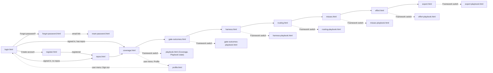

# TfLens — UI Design — Phase 1: Foundation

> **What this is.** The approved visual design for TfLens, produced at day-1 (greenfield) before any UI is built, **revised 2026-08-26** after the owner's review, **extended 2026-08-28** with the `/misses` screen and its Playbook state (F-MISS), and **extended 2026-09-01** with the `/effort` screen and its Playbook state (F-EFFORT) — which also adds the eighth nav item to the shell and fills in the Playbook axis of `/misses` (AppManager login + registration, per-user repo management, dark-first collapsible shell with icons and a user menu, click-through flow). Each screen has a **rendered mockup** (`docs/mockups/{screen}.html`, styled to look like TrBlazeUI) and a **component map** that ties every region to a real **TrBlazeUI control**, so the build (`/trblazeui`) reproduces it 1:1 and the verifier's visual-truth gate (`verify-phase.md §4b`) can diff the live screen against it. This is a HUMAN document → rendered to HTML. The owner APPROVES it (alongside the BRD + Architecture) before build.

| | |
|---|---|
| App | TfLens |
| Kind | app |
| Size | Large |
| Phase | 1 of 3 |
| Date | 2026-09-08 |

**Phase 1 of 3.** This file holds the six foundation screens plus the shared design system, the click-through flow and the library-gap log. Phase 2's five report screens are in [TfLens-P2-UIDesign.md](./TfLens-P2-UIDesign.md); phase 3's three are in [TfLens-P3-UIDesign.md](./TfLens-P3-UIDesign.md).

## Table of Contents

1. [How to use](#how-to-use)
2. [Design system (TrBlazeUI)](#design-system-trblazeui)
3. [Click-through flow](#click-through-flow)
4. [Screens](#screens)
   - [Screen: Login (`/login`)](#screen-login-login)
   - [Screen: Register (`/register`)](#screen-register-register)
   - [Screen: Forgot password (`/forgot-password`)](#screen-forgot-password-forgot-password)
   - [Screen: Reset password (`/reset-password`)](#screen-reset-password-reset-password)
   - [Screen: Repos (`/repos`)](#screen-repos-repos)
   - [Screen: Profile (`/profile`)](#screen-profile-profile)
5. [Library gaps](#library-gaps)

## How to use

- Every screen below links to its rendered mockup in `docs/mockups/`. Open `docs/mockups/login.html` first — the set is a **click-through**: every link and nav item goes to the sibling mockup, so the whole app can be walked from login to export.
- The **Component map** is the build contract: `region → TrBlazeUI control`. Only controls that actually exist in the TrBlazeUI library are used (catalog: `TrBlazeUI-AI-Reference.md`, TrBlazeUI.Components 1.0.7, cross-checked against the GitHub repo `techierathore/TrBlazeUI` at mockup time). If a screen needs something the library lacks, it is flagged in §Library gaps and logged to `docs/TfLens-TrBlazeUI-Feedback.md` at build time.
- To change a screen after approval: run `*mockups TfLens --update` (or `*amend-docs` for a requirement change that adds screens).

## Design system (TrBlazeUI)

- **Source:** TrBlazeUI component library (`TrBlazeUI.Primitives` + `TrBlazeUI.Components` + `TrBlazeUI.Icons.Lucide`; Tailwind v4 utilities; shadcn/ui design language with OKLCH tokens `--background`, `--foreground`, `--card`, `--muted`, `--muted-foreground`, `--primary`, `--border`, `--destructive`, `--alert-success/info/warning/danger`, `--chart-1..5`, `--radius: 0.625rem`, `--sidebar*`).
- **Theme — dark first (BRD-85, ADR-014):** `<html class="dark">` on first visit; the header toggle (`Switch` with sun/moon `LucideIcon`) flips the class and persists the choice per user. Both palettes are TrBlazeUI's own `:root` / `.dark` token sets — nothing custom.
- **Layout shell:** `SidebarProvider` (`DefaultOpen=true`, `HeightClass="h-screen"`, `CookieKey="tflens:sidebar"`) → `Sidebar Collapsible="true"` with `SidebarHeader` (brand mark + "TfLens" + "lens on TechieFlow & Playbook"), `SidebarContent`, `SidebarFooter` (theme `Switch`) and `SidebarRail` → `SidebarInset` holding the header `<header class="flex h-16 items-center gap-3 border-b bg-background px-4">` with `SidebarTrigger`, `Breadcrumb` (section › page), the **Framework switch** — `Tabs` used as a segmented control (`TabsList` + two `TabsTrigger`: "TechieFlow" and "Playbook", each with a `Badge` repo count; `data-testid="framework-switch"`; persisted per user; BRD-108) — spacer, `Button` **Sync now** (`LucideIcon refresh-cw`), `Badge Variant=Outline` "synced 12 min ago", theme toggle, and the **user menu** — `DropdownMenu` whose trigger is `Avatar` (initials) + display name + `LucideIcon chevron-down`, with `DropdownMenuLabel` (email), `DropdownMenuItem` Profile (`user`), Manage repos (`git-branch`), `DropdownMenuSeparator`, Sign out (`log-out`). Page container `
@Body
`. Plus `<ToastProvider Position="BottomRight" />` and `<PortalHost />`.
- **Navigation:** `SidebarGroup` → `SidebarGroupLabel "Workspace"` → `SidebarMenuItem`/`SidebarMenuButton Href Tooltip IsActive` **Repos** (`git-branch`); `SidebarGroupLabel "Reports"` → **Coverage / health** (`activity`), **Gate outcomes** (`shield-check` — renamed from *Three questions* 2026-09-01; a question-mark icon no longer fits the label), **Harness comparison** (`git-compare`), **Routing & economics** (`route`), **Misses & rework** (`bug` — added 2026-08-28), **Phase effort** (`gauge` — added 2026-09-01, BRD-151; it sits between *Misses & rework* and *Snapshot export* deliberately — both are cost lenses, and the reader should meet the quality question before the budget one), **Snapshot export** (`download`). (The separate Playbook item was retired 2026-08-26 — the framework is chosen in the header.) Collapsed state shows icon only with `Tooltip` (the `Tooltip` parameter of `SidebarMenuButton`). `SidebarMenuBadge` shows the repo count on Repos.
- **KPI pattern:** TrBlazeUI has no stat card; every KPI is the library's documented composition — `Card` → `CardHeader class="flex flex-row items-center justify-between pb-2"` (`CardTitle class="text-sm font-medium"` + `LucideIcon`) → `CardContent` (`div.text-2xl.font-bold` + `p.text-xs.text-muted-foreground`). Grid `grid gap-4 md:grid-cols-2 lg:grid-cols-4`. A small trend line uses `--chart-1` colour.
- **Figures:** a `Figure` renders as a number, or as the literal text `insufficient data (n=…)` in `text-muted-foreground italic`, or as `—`. Estimates always carry a `Badge Variant=Outline` reading **estimate**. Backfilled columns carry a `Badge Variant=Secondary` reading **backfilled**.
- **Auth pages** (no shell): split layout — left brand panel (`bg-sidebar`, product name, one-line purpose, three bullet benefits with `LucideIcon check`), right a centred `Card` (max-w-sm) holding the form. Same on all four auth screens so they read as one flow.
- **Controls inventory used:** `StatTile`/`StatGroup` (KPI cards — see §Library gaps), `PasswordStrength`, `CodeBlock`, `CenteredPanel`, `SidebarProvider`, `Sidebar`, `SidebarHeader`, `SidebarContent`, `SidebarFooter`, `SidebarRail`, `SidebarGroup`, `SidebarGroupLabel`, `SidebarMenu`, `SidebarMenuItem`, `SidebarMenuButton`, `SidebarMenuBadge`, `SidebarInset`, `SidebarTrigger`, `Breadcrumb` (+ `BreadcrumbList`, `BreadcrumbItem`, `BreadcrumbLink`, `BreadcrumbPage`, `BreadcrumbSeparator`), `DropdownMenu` (+ `DropdownMenuTrigger`, `DropdownMenuContent`, `DropdownMenuLabel`, `DropdownMenuItem`, `DropdownMenuSeparator`), `Avatar` (+ `AvatarFallback`), `Card` (+ `CardHeader`, `CardTitle`, `CardDescription`, `CardContent`, `CardFooter`, `CardAction`), `DataTable` + `DataTableColumn`, `Badge`, `Alert` (+ `AlertTitle`, `AlertDescription`), `Tabs` (+ `TabsList`, `TabsTrigger`, `TabsContent`), `Button`, `Input`, `Label`, `Field` (+ `FieldLabel`, `FieldContent`, `FieldDescription`, `FieldError`), `Select` (+ `SelectTrigger`, `SelectValue`, `SelectContent`, `SelectItem`), `Dialog` (+ `DialogTrigger`, `DialogContent`, `DialogHeader`, `DialogTitle`, `DialogDescription`, `DialogFooter`, `DialogClose`), `AlertDialog` (+ `AlertDialogTrigger`, `AlertDialogContent`, `AlertDialogHeader`, `AlertDialogTitle`, `AlertDialogDescription`, `AlertDialogFooter`, `AlertDialogCancel`, `AlertDialogAction`), `Collapsible` (+ `CollapsibleTrigger`, `CollapsibleContent`), `Progress`, `Tooltip` (+ `TooltipTrigger`, `TooltipContent`), `Skeleton`, `Spinner`, `Empty` (+ `EmptyIcon`, `EmptyTitle`, `EmptyDescription`, `EmptyAction`), `ToastProvider` / `ToastService`, `Switch`, `Separator`, `ChartContainer` + `BarChart`, `LucideIcon` (incl. `bug` for the Misses nav item and `upload` / `cloud-download` / `hard-drive` for the two source modes, added 2026-08-28; `gauge` for the Phase effort nav item plus `git-fork` / `layers` / `cpu` / `dollar-sign` / `filter` for the effort bands, added 2026-09-01), `TypographyH2`/`TypographyMuted`.
- **Shell revision 2026-09-01 (BRD-144).** The shared mockup stylesheet gained an *overflow-containment* block so wide content scrolls **inside its own container** and never past the app shell: `.card-c.flush` and `.panel` are `overflow-x:auto` at every width, grid/stack children carry `min-width:0`, a `<b>` inside an `Alert` body stays **inline** (only the alert title is a block), badges wrap below 700px, and a `.mono` token inside a table cell is **never** broken mid-token — the table scrolls instead, because a formatted number must not break mid-digit. Every shell mockup now passes a headless check at **1280 and 390** for document overflow, container overflow, broken icon references and JS errors.

## Click-through flow

Every sidebar item and every user-menu item in every shell mockup links to the corresponding file, so the set is navigable in any order.

## Screens

### Screen: Login (`/login`)

**Mockup:** [docs/mockups/login.html](./mockups/login.html) · **Role(s):** anonymous → User · **BRD:** BRD-1, BRD-2, BRD-90, BRD-94 (deferred) · **REQ:** (assigned by split-brd)

**Layout (one line):** split page — left brand panel, right centred `Card` with email + password, Sign in, links to Register and Forgot password; no GitHub button in this release (position reserved, noted in a muted line).

**Component map:**

| Region | TrBlazeUI control | Shows / binds | States |
|--------|-------------------|---------------|--------|
| Brand panel | `div.bg-sidebar` + `TypographyH2` "TfLens" + `TypographyMuted` + 4× `LucideIcon check` bullets | tagline **"A read-only lens over TechieFlow and AI-First-Playbook telemetry"** · bullets: "Both frameworks, one dashboard" · "Connect any public repo" · "Numbers you can quote" · "Free & open source" | — |
| Card | `Card` → `CardHeader` (`CardTitle` "Sign in", `CardDescription` "with your AppManager account") | — | — |
| Email | `Field` → `FieldLabel` + `Input Type=Email` `data-testid="login-email"` | binds `Email` | required; `IsInvalid` on error |
| Password | `Field` → `FieldLabel` + `Input Type=Password` `data-testid="login-pass"` + `Button Variant=Ghost Size=IconSmall` eye toggle | binds `Password` | required |
| Error | `Alert Variant=Danger` (only after a failed attempt) | "Sign-in failed. Check your email and password." | hidden by default |
| Submit | `Button Type=Submit` full width `data-testid="login-submit"` | "Sign in" | `Disabled` + `Spinner Size=Small` while calling AppManager |
| Links | `Button Variant=Link` ×2 | "Forgot password?" → `/forgot-password` · "Create an account" → `/register` | — |
| SSO note | `TypographyMuted` | "GitHub sign-in: coming in a later release" | — |
| Footer | `TypographyMuted` | "Identity by AppManager · public repos only in this release" | — |

**Notes / interactions:** Enter submits; return URL preserved; on success redirect to return URL, else `/repos` when the user has no repos, else `/`.

**Empty / loading / error:** loading = button spinner; error = generic `Alert`, fields keep values; `ACCOUNT_LOCKED` shows "Account locked — try again later" (the only specific message, per AppManager 423).

### Screen: Register (`/register`)

**Mockup:** [docs/mockups/register.html](./mockups/register.html) · **Role(s):** anonymous → User · **BRD:** BRD-91, BRD-95 · **REQ:** (assigned by split-brd)

**Layout (one line):** same split page; `Card` with first name, last name, email, password, confirm password, Create account; link back to Sign in.

**Component map:**

| Region | TrBlazeUI control | Shows / binds | States |
|--------|-------------------|---------------|--------|
| Names | 2× `Field` → `Input Type=Text` `data-testid="reg-first"` / `"reg-last"` in a 2-col grid | binds FirstName / LastName | required |
| Email | `Field` → `Input Type=Email` `data-testid="reg-email"` | binds Email | required; `FieldError` "already registered" on AppManager duplicate |
| Password | `Field` → `Input Type=Password` `data-testid="reg-pass"` + `FieldDescription` "8+ chars, an uppercase letter, a number, a special character" + `Progress` strength bar | binds Password | `FieldError` per rule violated (local check before the API) |
| Confirm | `Field` → `Input Type=Password` `data-testid="reg-confirm"` | binds Confirm | `FieldError` "passwords differ" |
| Role note | `Alert Variant=Info AccentBorder` | "Every TfLens account is a Manager — no licence, no subscription." | always |
| Submit | `Button Type=Submit` full width `data-testid="reg-submit"` | "Create account" | spinner while calling |
| Link | `Button Variant=Link` | "Already have an account? Sign in" | — |

**Notes / interactions:** on success the user is signed in and lands on `/repos` (empty state).

**Empty / loading / error:** server errors (`VALIDATION_ERROR`, `DECRYPTION_FAILED`) show a generic danger `Alert`; field-level rules are shown inline before submit.

### Screen: Forgot password (`/forgot-password`)

**Mockup:** [docs/mockups/forgot-password.html](./mockups/forgot-password.html) · **Role(s):** anonymous · **BRD:** BRD-92 · **REQ:** (assigned by split-brd)

**Layout (one line):** split page; `Card` with one email field and Send reset link; success state replaces the form.

**Component map:**

| Region | TrBlazeUI control | Shows / binds | States |
|--------|-------------------|---------------|--------|
| Email | `Field` → `Input Type=Email` `data-testid="forgot-email"` | binds Email | required |
| Submit | `Button Type=Submit` full width `data-testid="forgot-submit"` | "Send reset link" | spinner |
| Success | `Alert Variant=Success` replacing the form | "If that address exists, a reset link is on its way." (enumeration-safe) | after submit, always |
| Link | `Button Variant=Link` | "Back to sign in" | — |

**Empty / loading / error:** never reveals whether the email exists.

### Screen: Reset password (`/reset-password`)

**Mockup:** [docs/mockups/reset-password.html](./mockups/reset-password.html) · **Role(s):** anonymous · **BRD:** BRD-92 · **REQ:** (assigned by split-brd)

**Layout (one line):** split page; `Card` with new password + confirm + Reset; token comes from the query string.

**Component map:**

| Region | TrBlazeUI control | Shows / binds | States |
|--------|-------------------|---------------|--------|
| New password | `Field` → `Input Type=Password` `data-testid="reset-pass"` + strength `Progress` | binds Password | rule errors inline |
| Confirm | `Field` → `Input Type=Password` `data-testid="reset-confirm"` | binds Confirm | mismatch error |
| Submit | `Button Type=Submit` `data-testid="reset-submit"` | "Reset password" | spinner |
| Invalid token | `Alert Variant=Danger` replacing the form | "This reset link is invalid or has expired." (`INVALID_RESET_TOKEN` / `APP_ID_MISMATCH`) | when AppManager rejects |
| Success | `Alert Variant=Success` + `Button` "Sign in" | "Password updated." | after success |

### Screen: Repos (`/repos`)

**Mockup:** [docs/mockups/repos.html](./mockups/repos.html) · **Role(s):** User · **BRD:** BRD-98..BRD-104, **BRD-131..BRD-141** · **REQ:** REQ-UI-011, REQ-UI-012, REQ-UI-013, **REQ-UI-040, REQ-UI-041** *(amended 2026-08-28 r2 — F-IMPORT folded in here as a second mode rather than a separate `/import` screen, owner decision)*

**Layout (one line):** shell; page header row (title + "Add source" primary button); 3 KPI cards (sources, records, last sync); `DataTable` of the user's sources **with a Source column** and row actions that differ by source kind; a two-mode Add-source dialog (**Fetch via API** | **Import metric files**, the latter with a drop zone and a preview-before-commit), Remove alert dialog; empty state offering both routes.

**Component map:**

| Region | TrBlazeUI control | Shows / binds | States |
|--------|-------------------|---------------|--------|
| Header row | `TypographyH2` "Repos" + `TypographyMuted` "Sources you've added — fetched or imported" + `Button` **Add source** (`LucideIcon plus`) `data-testid="connect-repo"` | — | — |
| KPI row | 3× `Card` (KPI): Connected repos · Records synced · Last successful sync | counts | zero-state |
| Repos grid | `DataTable TData=UserRepoRow ShowToolbar=true ShowPagination=true InitialPageSize=10` `data-testid="repos-table"`; columns: Repo (owner/name + `LucideIcon github` or `hard-drive`) · Branch · Kind (`Badge` techieflow / playbook) · **Source** (`Badge Variant=Info` **Synced** / `Badge Variant=Secondary` **Imported**) `data-testid="repo-source-{name}"` · Visibility (`Badge Variant=Outline` public / private) · Status · Last sync **or** last import · Records · Actions | user's sources | row error → `Tooltip` with LastError · *(Source column added 2026-08-28 r2 — BRD-132)* |
| Row actions | Fetched: `Button Variant=Ghost Size=IconSmall` Sync (`refresh-cw`) `data-testid="repo-sync-{name}"`. **Imported: Re-import (`upload`) `data-testid="repo-reimport-{name}"` — never a disabled Sync, which would be a lie about what the row can do.** Both: Remove (`trash-2`) `data-testid="repo-remove-{name}"` | — | Sync / Re-import show `Spinner` |
| **Mode fork** *(2026-08-28 r2)* | `Dialog` → `DialogContent` (`DialogTitle` "Add a source") → `Tabs DefaultValue="api"` → `TabsList` + 2× `TabsTrigger` **Fetch via API** (`cloud-download`) and **Import metric files** (`upload`) `data-testid="source-mode"` | which of the two paths below is shown | the fork is the **first** thing in the dialog — a deliberate, visible choice, not a fallback discovered after a failure |
| Connect dialog — **Fetch via API** tab | `TabsContent` → `DialogContent` (`DialogTitle` "Connect a public GitHub repo") → `Field` `Input` "GitHub URL or owner/name" `data-testid="connect-input"` · `Field` `Input` "Branch (optional)" · `Field` `Select` Kind (Auto-detect / techieflow / playbook) · `Button Variant=Outline` **Validate** `data-testid="connect-validate"` · validation result list (3× line with `LucideIcon check`/`x`: "Repository exists" · "Public" · "Telemetry path found: docs/metrics (techieflow)") · `DialogFooter` `DialogClose` Cancel + `Button` **Connect** `data-testid="connect-submit"` (enabled only after a green validation) | — | private → `Alert Variant=Warning` "**Private repos can't be fetched — use *Import metric files* to add this repo's telemetry without a credential**" with an inline `Button Variant=Link` that switches the tab (BRD-100, amended); no path → `Alert Variant=Danger` |
| Import dialog — **Import metric files** tab *(2026-08-28 r2)* | `TabsContent` → `Field` `Input` "Source name" (e.g. `acme/internal-app`) `data-testid="import-name"` · `Field` `Select` Framework (TechieFlow / Playbook) · `Field` `Select` `project_type` override (optional) · a drop zone `div` (dashed border, `LucideIcon upload`, "Drop a `.zip` of `docs/metrics/`, or the `.jsonl` files") `data-testid="import-drop"` · `DialogFooter` `DialogClose` Cancel + `Button` **Import** `data-testid="import-submit"` (**enabled only after a preview renders**) | — | refusals render as `Alert Variant=Danger` naming what to upload instead: a precomputed rollup / `tflens.json` / snapshot (BRD-140), an unsafe archive, or nothing recognised |
| Import **preview** (before commit) | `Card` inside the tab `data-testid="import-preview"` → `DataTable ShowToolbar=false ShowPagination=false` (stream · records · date range · invalid lines) + `Badge Variant=Outline` bundle sha256 (short) + a `Collapsible` of unknown field names | the dry-run parse | **nothing is written until Import is pressed** — cancelling leaves zero rows and zero archive files (BRD-138) |
| Remove dialog | `AlertDialog` (`AlertDialogTitle` "Remove owner/name?", `AlertDialogDescription` "Stops syncing and deletes the parsed rows and raw archive for this repo. Your GitHub repo is untouched.") `AlertDialogAction Variant=Destructive` "Remove" | — | — |
| Empty | `Empty` (`EmptyIcon git-branch`, `EmptyTitle` "No sources yet", `EmptyDescription` "Fetch a public GitHub repo, or import the metric files from a private one.", `EmptyAction` → **two** `Button`s, one per mode) `data-testid="repos-empty"` | — | new user — both routes offered from the first screen |

**Notes / interactions:** Connect runs the first sync immediately and toasts the outcome; Import commits after the preview is reviewed and toasts records added / duplicates collapsed per stream; the sidebar Repos badge updates; a second dialog state ("Connecting…" / "Importing…") shows a `Progress`. **The header Sync now and the background poller skip imported sources** — they have no remote to contact (BRD-103).

**Empty / loading / error:** covered above; GitHub rate-limit → `Alert Variant=Warning` "GitHub rate limit reached — try again in N minutes".

### Screen: Profile (`/profile`)

**Mockup:** [docs/mockups/profile.html](./mockups/profile.html) · **Role(s):** User · **BRD:** BRD-107, BRD-95 · **REQ:** (assigned by split-brd)

**Layout (one line):** shell; two cards side by side — read-only AppManager profile, and change-password form.

**Component map:**

| Region | TrBlazeUI control | Shows / binds | States |
|--------|-------------------|---------------|--------|
| Profile card | `Card` → `Avatar` (initials) + name · `DataTable ShowToolbar=false ShowPagination=false` key/value: Email · Name · Role (`Badge` Manager) · Member since · Identity provider (AppManager) | `GET /UserSvc/profile` | `Skeleton` while loading |
| Change password | `Card` → 3× `Field` `Input Type=Password` (current, new, confirm) `data-testid="pw-current"`/`"pw-new"`/`"pw-confirm"` + `Button` "Update password" `data-testid="pw-submit"` | `POST /UserSvc/change-password` | `FieldError` `INVALID_CURRENT_PASSWORD` / rules; toast on success |
| Note | `Alert Variant=Info` | "TfLens stores no passwords — your account lives in AppManager." | always |

**Screens of the other phases:** phase 2 — Coverage / health, Gate outcomes, Harness comparison, Routing & economics, Snapshot export ([TfLens-P2-UIDesign.md](./TfLens-P2-UIDesign.md)); phase 3 — Misses & rework, Phase effort, Playbook framework state ([TfLens-P3-UIDesign.md](./TfLens-P3-UIDesign.md)). A screen sits in exactly one phase.

## Library gaps

Cross-check against the live repo `github.com/techierathore/TrBlazeUI` (2026-08-26, mockup rebuild) — every control in the inventory exists there, and the repo is **newer than the 1.0.7 reference doc**. Three gaps listed at day-1 are closed by components the repo already ships; the build MUST use these instead of the workarounds:

- **KPI cards → `StatTile` / `StatGroup`** (`Components/Stat/`). Every "`Card` (KPI)" region in the maps above is built with `StatTile` (title, value, sub-line, icon); the `Card` composition is the fallback only if `StatTile` lacks a needed slot.
- **Password strength → `PasswordStrength`** (`Components/PasswordStrength/`) on Register, Reset password and Profile — not `Progress`.
- **Parity-compare output → `CodeBlock`** on Snapshot export — not a raw `<pre>`.
- **Auth card centring → `CenteredPanel`** for the four auth pages' right column.

Remaining gaps (to be logged as `TR-NNN` in `docs/TfLens-TrBlazeUI-Feedback.md` at build if still true):

- No plain `Table` primitives — small key/value tables use `DataTable` with toolbar and pagination off.
- No theme-toggle component — a `Switch` (with `LucideIcon sun`/`moon`) flips `class="dark"`; dark is the default.

*Added 2026-09-01 (during the `/effort` remock):*

- **No `StatTile` variant for a "coverage" figure.** `kpi-fanout-coverage` reads `9 of 128`, which is a ratio-with-denominator rather than a value-with-sub-line; the mockup composes it as a normal `StatTile` with an accent border. If the build finds `StatTile` cannot carry an accent border, log it as `TR-NNN` rather than dropping the emphasis — the emphasis is the requirement (BRD-151).
- **No banded/expandable-row `DataTable`.** The per-phase detail is a `Collapsible` per row rather than an expanding `DataTable` row; the same applies to the Playbook execution table. This is a composition, not a gap in behaviour, but it means the disclosure state is the page's to manage.
- **Known cosmetic defect, shell-wide (pre-existing, not introduced here).** The header `Breadcrumb` wraps to two lines at 1280 on **every** shell mockup, because it shrinks before the Framework switch and the header controls do. It is uniform across the set, so the set still reads as one app; a `white-space:nowrap` on the crumb was tried and **rejected** — it pushes the whole document into horizontal overflow. The build should solve it by letting the crumb ellipsize (`min-width:0` + `text-overflow`), not by refusing to shrink.
- Chart API documented only as `TItem`/`Items`/`XValue`/`YValue` — no axis/legend control; charts are supplementary, every figure also has a text table.
- The `TrBlazeUI-AI-Reference.md` deployed by NuGet 1.0.7 lags the repo (`StatTile`, `PasswordStrength`, `CodeBlock`, `CenteredPanel`, `Grid`, `Timeline`, `Stepper`, `AnchorNav` are undocumented there) — worth a doc-refresh note to the library team.

---
Last amended: 2026-08-28 — added **Screen: Misses & rework (`/misses`)** and its Playbook state (`docs/mockups/misses.html`, `docs/mockups/misses-playbook.html`), the `bug` nav item in every shell mockup's sidebar (seven items now), and the Coverage deltas the miss stream introduces (five-row stream table, escapes-missing-why, the `project_type` reclassification split, orphan counts, misses-without-fixes as a warning). Source: `docs/Miss-Telemetry-TfLens.md` · BRD F-MISS / BRD-112..BRD-130. Every other screen preserved verbatim.

Last amended: 2026-08-28 (round 2) — the **Repos** screen gains the two-mode Add-source dialog (**Fetch via API** | **Import metric files**), a **Source** column with `Synced` / `Imported` badges, row actions that differ by source kind (Sync vs **Re-import**), a drop zone and a **preview-before-commit** panel; **Coverage** gains the source badge and days-since-import staleness wording. This is what makes private and corporate repositories reachable (BRD-131..BRD-141). Folded into `/repos` rather than given its own `/import` screen — owner decision — so no nav item changed and no other mockup moved. Every other screen preserved verbatim.
