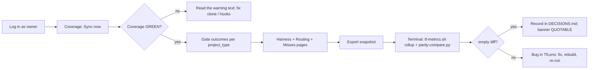

# TfLens — Usage Guide

| | |
|---|---|
| App | TfLens |
| Kind | app |
| Size | Large |
| Date | 2026-09-14 |

## Test users

| # | Username / Email | Password | Role / Permission | Created? | Notes |
|---|------------------|----------|-------------------|----------|-------|
| 1 | `TfLensDemo` — `tflensdemo@techierathore.com` | `TfLensDemo!23` | Manager (every TfLens user) — the demo/test account (BRD-96) | ✅ | AppManager `userId` 2. Login and `GET /UserSvc/profile` return `applicationRole: "Manager"`. If the owner rotates the password, update it here and run the restore command. |
| 2 | `tflenstest2@techierathore.com` | `TfLensTest2!23` | Manager — second user for tenant-isolation tests (BRD-102) | ✅ | AppManager `userId` 3. Returns `applicationRole: "Manager"`. Connects a different public repo; must never see user 1's repos. |
| 3 | *(anonymous)* | — | Unauthenticated visitor — may reach `/login`, `/register`, `/forgot-password`, `/reset-password`, `/healthz` only | n/a | Proves the redirect and the anonymous routes. |

- **Accounts:** AppManager users (Application Id 1), registered through `/register` with role Manager. TfLens has no user table.
- **Created?:** ✅ = exists in AppManager now (verified). ⬜ = planned; create it only after confirming with the owner, never silently.
- **Registry:** `TestAccountRegistry` parses this table; `TestAccountRegistryTests` fails the build if a test signs in with an account not listed here (REQ-NFR-012).
- **Restore the accounts (REQ-NFR-012):**

  ```
  dotnet run --project src/TfLens -- provision-test-accounts
  ```

  Signs in each listed account and registers it with `applicationRoleCode: "Manager"` only if sign-in fails. Idempotent, prints no password, exit 0 = every account usable. On `DUPLICATE_EMAIL`, reset through `/forgot-password` or re-create the account in the AppManager admin UI, then correct this table.
- **Last run:** 2026-08-28, `2 of 2 documented accounts usable`, exit 0. Sign-in re-checked 2026-09-14 at handoff: both accounts sign in through `/login` (headers "TfLens Demo" and "TfLens Test2").
- **Seeding:** none. User 1's five demo repos were connected by hand through Repos.
- **Secrets:** user secrets only (REQ-NFR-011), never `.env` or `appsettings.json`. Template: `src/TfLens/secrets.example.json` (all nine settings). `TfLens:AppManagerApiKey` and `TfLens:AppManagerApiSecret` are required as a pair; password reset fails without them. `TfLens:GitHubToken` is effectively required (unauthenticated GitHub allows 60 requests/hour). `TfLens:DbConnection` falls back to the local Development connection. Fixture mode: `TfLensFixtureRoot=tests/TfLens.Core.Tests/Fixtures`.

## Execution guide

Prerequisites: .NET 10 SDK (10.0.302 or later), PostgreSQL 16 (local or the `postgres` service in `docker-compose.yml`), Python 3, Node 20 + Playwright, Docker.

```
git clone https://github.com/techierathore/TfLens.git && cd TfLens
printf 'TfLensDbPassword=tflensdev\n' > .env
docker compose up -d postgres
dotnet user-secrets set "TfLens:AppManagerApiKey" "<key>" --project src/TfLens
dotnet user-secrets set "TfLens:AppManagerApiSecret" "<secret>" --project src/TfLens
dotnet user-secrets set "TfLens:GitHubToken" "<PAT>" --project src/TfLens
dotnet run --project src/TfLens -c Release --urls http://localhost:5099
curl -s http://localhost:5099/healthz
```

Open http://localhost:5099 and sign in as user 1.

No migration step: the schema is applied from `database/001-schema.sql` at startup. Hosting on the VPS: `docs/TfLens-Deployment-Checklist.md`.

### Deployment (`docker compose`)

Self-contained: the app and its own Postgres container.

```
git clone https://github.com/techierathore/TfLens.git && cd TfLens
cp .env.example .env
docker compose -f docker-compose.yml up -d --build
curl -s http://localhost:8080/healthz
```

Set `TfLensDbPassword`, `TfLensAppManagerApiKey`, `TfLensAppManagerApiSecret` and `TfLensGitHubToken` in `.env` before `up`.

### Command verbs

```
docker exec tflens dotnet TfLens.dll sync [--user <id>]
docker exec tflens dotnet TfLens.dll rebuild [--user <id>]
docker exec tflens dotnet TfLens.dll export --user <id> [--framework techieflow|playbook]
dotnet run --project src/TfLens -- provision-test-accounts
```

`export` requires `--user`; without `--framework` it writes every framework; it always writes today's UTC date.

### Smoke checklist

- [ ] Sign in as user 1 and land on Coverage, in dark mode
- [ ] Connect a public repo through **Add source → Fetch via API** and watch its first sync finish
- [ ] Import a `docs/metrics/` zip through **Add source → Import metric files**, reading the preview before committing it
- [ ] Press **Sync now** and confirm the imported source's counts and timestamps do not move
- [ ] Open **Misses & rework**, narrow the period, and read the three-way cost-of-rework split
- [ ] Open **Gate outcomes** and switch `project_type` tabs; check the catch-distribution lists all ten gates with a caveat badge on `assets`, `mockup-parity` and `perf`
- [ ] Open **Phase effort**, expand `build-phase`, and confirm every figure shows its denominator beside it
- [ ] Open **Price providers**, filter OpenRouter's models and page through a provider's rates
- [ ] Flip the Framework switch to Playbook on a report page and back
- [ ] Export a snapshot and open both files from the new row — the banner reads NOT QUOTABLE by design (see Known limitations)
- [ ] Sign in as user 2 and confirm none of user 1's repos or figures are visible
- [ ] Re-check **Phase effort** and **Misses & rework** at a phone width (390px) — nothing breaks a word mid-token, nothing is cut off inside its own box
- [ ] Sign out from the user menu

## How to test, screen by screen



### Login (`/login`)
- **Sign in as:** user 3 (anonymous), then user 1
- **Steps:** 1) Open `/gate-outcomes` signed out 2) Submit a wrong password 3) Submit user 1's email and password
- **Expected:** step 1 redirects to `/login?returnUrl=…`; step 2 shows "Sign-in failed." and never the AppManager error code; step 3 lands on `/gate-outcomes` with the shell and the header "TfLens Demo"; no GitHub button.
- **Covers:** BRD-1, BRD-2, BRD-90, BRD-93, BRD-94 (absence)

### Register (`/register`)
- **Sign in as:** user 3 (anonymous)
- **Steps:** 1) Open `/register` 2) Submit with password `weak` 3) Submit user 2's details with a valid password
- **Expected:** step 2 shows inline rule errors (8+, uppercase, digit, special) before any API call; step 3 registers with role Manager, signs in and lands on `/repos` with the "No repos connected yet" empty state; an info alert says every account is a Manager.
- **Covers:** BRD-91, BRD-95

### Forgot / reset password (`/forgot-password`, `/reset-password`)
- **Sign in as:** user 3 (anonymous)
- **Steps:** 1) On `/forgot-password` submit user 1's email 2) Submit a non-existent email 3) Open `/reset-password?token=bogus` and submit a valid password 4) (owner) Use a real emailed token
- **Expected:** steps 1 and 2 show the identical success message; step 3 shows "This reset link is invalid or has expired."; step 4 shows "Password updated." with a Sign in button.
- **Covers:** BRD-92

### Profile (`/profile`)
- **Sign in as:** user 1
- **Steps:** 1) User menu → Profile 2) Read the profile card 3) Change password with a wrong current password 4) Change it correctly, then back
- **Expected:** card shows email, name, role badge Manager, member since, identity provider AppManager; step 3 shows "current password is incorrect" under the field; step 4 toasts success twice and the original password still signs in.
- **Covers:** BRD-107, BRD-106

### Shell (sidebar + header)
- **Sign in as:** user 1
- **Steps:** 1) Read the sidebar 2) Collapse, hover, reload 3) Flip **Framework switch** to Playbook, reload; open `/repos` 4) Press **Sync now** 5) Open the user menu 6) Toggle theme, reload 7) Sign out
- **Expected:** nine items (Repos, Price providers; Coverage / health, Gate outcomes, Harness comparison, Routing & economics, Misses & rework, Phase effort, Snapshot export), no `/playbook` item; the switch shows on the seven report routes only; app opens dark; switch, collapsed state and light theme survive reload; Sync now updates "synced N min ago"; the menu shows email, Profile, Manage repos, Sign out, which returns to `/login`.
- **Covers:** BRD-4, BRD-5, BRD-6, BRD-85, BRD-105, BRD-106, BRD-124, BRD-126 (REQ-UI-006, REQ-UI-010)

### Repos (`/repos`)
- **Sign in as:** user 1, then user 2
- **Steps:** 1) Read the table 2) **Add source**, **Fetch via API** `https://github.com/techierathore/TrBlazeUI`, Validate, Connect 3) Try a private repo 4) Try `octocat/Hello-World` 5) Try a listed repo 6) Remove a repo 7) As user 2, open `/repos`
- **Expected:** step 2 shows three green lines (Repository exists · Public · Telemetry path found) and syncs; step 3 refuses "Private repos can't be fetched…" with a **Switch to import →** link; step 4 "Can't connect this repo"; step 5 "Already connected"; step 6 also drops it from Coverage; step 7 shows "No sources yet", none of user 1's repos.
- **Covers:** BRD-98, BRD-99, BRD-100, BRD-101, BRD-102, BRD-104

### Add source → Import metric files (`/repos`)
- **Sign in as:** user 1
- **Steps:** 1) **Add source** → **Import metric files**; name it, pick a framework 2) Drop a `docs/metrics/` `.zip`, read the preview, Cancel 3) Drop `data/reports/<date>/tflens.json` 4) Redo step 2, press **Import** 5) Press **Sync now** 6) Press the row's **Re-import**
- **Expected:** preview reads "Preview — nothing is written yet" with a `sha256 <8 chars>` badge and **Import** disabled until it renders; step 3 refused "That's a computed report, not telemetry"; step 4 toasts `Imported`; its Source badge reads **Imported**, **Re-import** is its only action; step 5 leaves its counts unchanged; step 6 locks name and framework.
- **Covers:** BRD-100, BRD-131, BRD-132, BRD-133, BRD-135, BRD-138, BRD-139, BRD-140 (REQ-UI-040, REQ-UI-041, REQ-FN-082..REQ-FN-087, REQ-NFR-014)

### Price providers (`/prices`)
- **Sign in as:** user 1
- **Steps:** 1) Open **Price providers** 2) Read each provider card 3) On OpenRouter press **Refresh** 4) Filter its models by `claude` 5) Page rates with **Previous** / **Next** 6) Add or change one rate 7) Remove an added provider
- **Expected:** Anthropic, OpenAI, OpenCode Go and OpenRouter show rates, source page and last-checked date; OpenRouter is badged `read from its endpoint`, the others `typed from the published page`; a refresh updates the date, a failed one keeps stored rates; an unpublished rate is skipped, never stored as zero; caption reads `5 of N rates shown · page 1 of M`; a clash between providers is reported, never averaged.
- **Covers:** REQ-UI-072

### Coverage / health (`/`)
- **Sign in as:** user 1
- **Steps:** 1) Land on `/` 2) Read the strip, cards and stream table 3) Find a stale repo 4) Read "Miss stream — data quality" 5) Press **Rebuild…**
- **Expected:** strip reads `GREEN — n repos synced, nothing stale` or `CHECK — n warnings`; cards badge **Synced** (SHA linked) or **Imported** (`sha256 <8 chars>`, no link); techieflow shows five streams (runs, gates, sessions, commits, misses), playbook one (`events`); sessions/commits backfilled reads `—`, not zero; stale fetched repos badge `stale`, imported ones read "This source can't refresh itself — re-import to update."; the miss card has counts, no rate; rebuild counts match.
- **Covers:** BRD-21, BRD-22, BRD-39..BRD-44, BRD-127, BRD-136, BRD-137 (REQ-UI-039, REQ-UI-042)

### Gate outcomes (`/gate-outcomes`)
- **Sign in as:** user 1
- **Steps:** 1) Read the SCHEMA §6 note 2) Switch `project_type` tabs 3) Read cards, gate table, late-gate line 4) Expand the taint list
- **Expected:** no "all" tab, no total row; cards show live plus a "backfilled" line, never a sum; under 3 records reads `insufficient data (n=…)`; the table lists ten gates: build, acceptance, render, assets, visual, mockup-parity, perf, standards, escaped, unattributed; `escaped` badged "no gate caught it", a caveat badge on `assets`, `mockup-parity`, `perf`; perf line reads "ran on N records, caught K → …" or "not yet run"; the taint list shows only backfilled REQ IDs.
- **Covers:** BRD-45, BRD-46, BRD-47, BRD-48, BRD-49, BRD-50, BRD-31..BRD-36 (observed)

### Harness comparison (`/harness`)
- **Sign in as:** user 1
- **Steps:** 1) Read the three columns 2) Compare token rows 3) Read the dollars card 4) Search the page for any `$` total
- **Expected:** columns claude-code / opencode / codex all render (0 records shows `—`); `harness: null` records appear only in the footnote "n records with harness not detected — excluded from the columns above" (hidden when n = 0), never as a column; tokens per Verified REQ per column or `insufficient data`; the dollars card shows the OpenCode sum labelled "the only measured dollars in the system" and "Claude Code and Codex: not measured (null by design)"; no cross-harness dollar total anywhere.
- **Covers:** BRD-51, BRD-52, BRD-53, BRD-54, BRD-55

### Routing & economics (`/routing`)
- **Sign in as:** user 1
- **Steps:** 1) Drift tab: find a `routed:false` row 2) Models tab: read totals 3) Repricing tab: read both cards and the excluded-runs line 4) Press **Edit prices.json**, change one output price, Save 5) Poolable tab: read the five cards
- **Expected:** `routed:false` rows badge "drift"; both repricing cards carry the badge "estimate — tokens × rate card, not measured spend" and name the most expensive observed model; the excluded count matches runs with `tokens_scope: none`; saving recomputes both cards and toasts the file write; a non-numeric price shows a field error and does not save; poolable cards match `tf-metrics.sh --rollup` for the same data.
- **Covers:** BRD-56, BRD-57, BRD-58, BRD-59, BRD-60, BRD-61, BRD-62

### Misses & rework (`/misses`)
- **Sign in as:** user 1
- **Steps:** 1) Open `/misses`, switch `project_type` tabs 2) Read tiles and cards 3) Narrow to Last 7 days 4) Flip to Playbook
- **Expected:** period reads `All history (default)`; page note "Two escape figures on this site, and they are not the same number"; no "all types" tab or total row; `wont-fix` has its own tile, outside the open count; failed-practice denominator reads `n of N misses assessed`; "Who was running" warns "Observational only — this band does not show causation"; "Cost of rework" shows Measured, Apportioned, Unattributable, never blended; `insufficient data (n=…)` below n=3, `—` never `$0.00`; step 3 recomputes every figure; Playbook shows the empty state.
- **Covers:** BRD-118..BRD-126 (REQ-UI-035..REQ-UI-038, REQ-NFR-013)

### Phase effort (`/effort`)
- **Sign in as:** user 1
- **Steps:** 1) Open `/effort`, read the KPI tiles 2) Open **Per-phase detail** for `build-phase` 3) Narrow the period 4) Flip to Playbook and back 5) Repeat step 2 at 390px
- **Expected:** every figure shows its denominator beside it, not a tooltip (`measured on n of N runs`; fan-out states `observed_n of runs` first); bands open Time, Tokens, By model, Fan-out; Tokens shows mean beside median; By model says "observational, not causal"; nothing grouped by actor, no per-REQ view; unmeasured reads `—` or `insufficient data (n=…)`, never `0`; at 390px model ids and `median · max` stay on one line and the panel scrolls within itself.
- **Covers:** BRD-145..BRD-163, BRD-168, BRD-169 (`REQ-UI-045`..`051`)

### Snapshot export (`/export`)
- **Sign in as:** user 1
- **Steps:** 1) Read the banner 2) Press **Export snapshot** 3) Open both files from the new row 4) Copy a SHA from the dataset table
- **Expected:** banner reads **NOT QUOTABLE today** until a parity run is recorded for parser **1.2.0** (see Known limitations), QUOTABLE after; export writes `data/reports/<userId>/<today>/<framework>/snapshot.md` and `tflens.json`; the JSON has top-level keys `per_repo`, `tainted_reqs`, `live`, `backfilled`, `pooled`, `misses`, `extras`, `parity`, each `per_repo` entry carrying `source_kind`; the markdown never mixes live and backfilled figures and labels every estimate; the row appears in past snapshots with the parser version.
- **Covers:** BRD-63, BRD-65, BRD-66, BRD-67, BRD-70

### Parity procedure (terminal — no screen)
- **Sign in as:** n/a (operator at a shell)
- **Steps:** 1) `dotnet TfLens.dll export --user 2 --framework techieflow` 2) Clone the connected repos at the SHAs shown on `/export` 3) `bash .tfcore/telemetry/tf-metrics.sh --rollup <repos…> --json > reference.json` 4) `python3 tools/parity-compare.py reference.json data/reports/<userId>/<date>/techieflow/tflens.json --allow-environment-keys --record src/TfLens/data/parity-last.json --parser-version 1.2.0 --script .tfcore/telemetry/tf-metrics.sh --dataset-sha <owner/name>=<sha> …`
- **Expected:** exit 0 and `0 finding(s)`, allowed differences itemised `ENV-OK` / `ADDED-OK`, `misses` reported `COVERED` over all 29 BRD-129 figures; a deliberate change (delete one backfilled record) exits non-zero naming the key; a passing run writes `data/parity-last.json` (`passed: true`, `parser_version: "1.2.0"`) and `/export` reads QUOTABLE.
- **Covers:** BRD-64, BRD-68, BRD-69, BRD-71, BRD-72

### Playbook framework state (Framework switch → Playbook, every report page)
- **Sign in as:** user 1
- **Steps:** 1) On `/` flip to Playbook 2) Walk `/`, `/gate-outcomes`, `/harness`, `/routing`, `/misses`, `/effort`, `/export` 3) Reload one 4) Flip back to TechieFlow
- **Expected:** the switch shows on all seven report pages; with no `events.ndjson` source each page shows its Playbook note and empty state, never a zero; `/misses` also lists the four planned bands, noting a zero there is absence; the choice persists across navigation and reload; with Playbook data the same layouts render (Gate outcomes keyed by `phase_gate`), the export writes a separate Playbook snapshot and no figure crosses frameworks; without a public repo, import a `verification/telemetry/` bundle.
- **Covers:** BRD-73, BRD-74, BRD-75, BRD-76, BRD-108, BRD-109, BRD-110 (REQ-FN-067, REQ-FN-070)

### Health endpoint (`/healthz`)
- **Sign in as:** user 3 (anonymous)
- **Steps:** 1) `curl -s http://localhost:5099/healthz`
- **Expected:** 200 with DB reachability and last-successful-sync age only; no figures, no repo names beyond a count.
- **Covers:** BRD-78

### Logs (`logs/`)
- **Sign in as:** n/a
- **Steps:** 1) Run the app and sync once 2) Open the newest `logs/tflens-*.log`
- **Expected:** a rolling daily file exists; sync lines carry user id, repo, SHA, counts and status codes only; grep for the AppManager secret, any access/refresh token, any password and any JSON record body finds nothing.
- **Covers:** BRD-10, BRD-86, BRD-97

## Automated tests

```bash
dotnet test TfLens.slnx -c Release -m:1
```

```bash
TFLENS_BASE_URL=http://localhost:5099 npx playwright test
```

Covers: core, guardrail and integration tests (`-m:1`: not parallel-safe), plus browser specs under `tests/verify/` run serially against a running app (narrow with `TF_VERIFY_GREP='REQ-UI-0(3[5-8])\b'`).

## Known limitations

**Phase 3:** 115 of 117 rows in `docs/TfLens-P3-Checklist.md` are `Verified` or `N/A`. **Earlier phases:** 9 rows are not yet `Verified`. None is `Blocked`.

### This release

- `REQ-UI-050` (Needs re-verify, Phase 3) — on the Playbook view of `/effort` the harness filter changes no row (`PlaybookEffortSurface.razor:1358`).
- `REQ-UI-072` (Needs re-verify, Phase 3) — a single missing OpenRouter price is stored as zero (`PriceProviders.cs:294`, `:311-314`).

- `REQ-UI-006` (Implemented, Phase 1) — collapsible icon sidebar and nav order; built, not re-verified.
- `REQ-NFR-020` (Implemented, Phase 1) — grading a built screen against its mockup; built, not re-verified.
- `REQ-NFR-024` (In Progress, Phase 1) — no machine-specific state in version control; the remaining clause is upstream (`TF-014`).
- `REQ-NFR-025` (Implemented, Phase 1) — production deployment pipeline; its image build was repaired 2026-09-14 (`docs/TfLens-TrBlazeUI-2.0.6-Upgrade.md`).
- `REQ-UI-023` (Needs re-verify, Phase 2) — Harness page, three harness columns.
- `REQ-UI-029` (Implemented, Phase 2) — counterfactual repricing cards.
- `REQ-UI-033`, `REQ-FN-063` (Needs re-verify, Phase 2) — `/export` reads NOT QUOTABLE until a parity run postdates the last parser change.
- `REQ-NFR-019` (Implemented, Phase 2) — stored provenance audit.
- The demo account has 0 Playbook repositories, so the Playbook axis is verified in its empty state only (`REQ-UI-050`, `REQ-UI-051`); import a `verification/telemetry/` bundle to drive it with data.
- `REQ-FN-012` (N/A) — GitHub SSO is deferred; `/login` shows no GitHub button.
- `TfLensGitHubToken` is effectively required: unauthenticated GitHub allows 60 requests/hour.
- Run `rebuild --user <id>` after any framework schema addition; a sync alone does not backfill new columns.
- Harness, routing and repricing figures have no reference implementation; spot-checked by hand once (BRD-72).
- A stray `isolation-probe/belongs-to-user-two` row showed in `/export`'s dataset table on 2026-09-02 (owner action: delete that `SyncState` row); not re-checked at this handoff.

### Upstream — TechieFlow (`docs/TfLens-TechieFlow-Feedback.md`)
- `TF-049` (open, minor) — `handoff-phase.md` names `tf-build.sh --print`, which does not exist.
- `TF-050` (open, minor) — `tf-devguide-list.py` lists test screenshot paths as page routes.
- 14 entries fixed upstream and waiting to be re-checked here; 34 closed. Nothing blocks.

### Upstream — AppManager (`docs/TfLens-AppManager-Feedback.md`)
- `AM-001`, `AM-002` — both resolved 2026-08-28; nothing open.

### Upstream — TrBlazeUI (`docs/TfLens-TrBlazeUI-Feedback.md`)
- TfLens builds on TrBlazeUI 2.0.6: 35 entries fixed upstream and closed, `TR-022` merged into `TR-008`.
- `TR-039` (open, minor) — leaving a page with a chart logs an unobserved `JSDisconnectedException` from the chart library; server log only.
- `TR-040` (open, minor) — `InputGroupInput` has no debounce, so the filter boxes on `/misses` and `/prices` re-filter on every keystroke, in memory.
