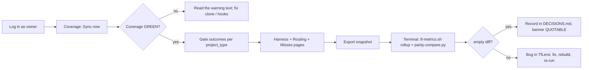

# TfLens — Usage Guide (Test Users · Test Plan · Setup)

> The single source for **how to test and run** this app. Every agent (flow-master self-smoke, the verifier) **and** the human UAT use the SAME test users and the SAME walkthrough listed here — no one invents throwaway accounts (enforced by `.tfcore/tasks/_smoke-test-policy.md`). Keep the Test-users table current: when an account is actually created, flip its `Created?` to ✅.

## Test users (canonical — use THESE for all smoke / verify / UAT)

TfLens has **no user table** — identity is the owner's AppManager service (Application Id 1, `docs/AppManager-api-usage-guide.md`). Test accounts are AppManager users; "creating" one means registering it through `/register` (or `POST /AuthSvc/register`) against the real AppManager with role `Manager` — done during development, only after confirming with the owner. *(amended 2026-08-26)*

| # | Username / Email | Password | Role / Permission | Created? | Notes |
|---|------------------|----------|-------------------|----------|-------|
| 1 | `TfLensDemo` — `tflensdemo@techierathore.com` | `TfLensDemo!23` | Manager (every TfLens user) — the demo/test account (BRD-96) | ✅ | **AppManager `userId` 2.** Re-registered 2026-08-28 on the same email after the owner's AppManager update, so every doc and test that names it stays valid. Login and `GET /UserSvc/profile` both return **`applicationRole: "Manager"`** — the `"User"` substitution recorded here previously was AppManager defect AM-001 and is fixed. Password may be rotated by the owner — update here, then run the restore verb below. |
| 2 | `tflenstest2@techierathore.com` | `TfLensTest2!23` | Manager — second user for tenant-isolation tests (BRD-102) | ✅ | **AppManager `userId` 3.** Re-registered 2026-08-28 alongside user 1. Also returns **`applicationRole: "Manager"`**. Connects a different public repo; must never see user 1's repos. |
| 3 | *(anonymous)* | — | Unauthenticated visitor — may reach `/login`, `/register`, `/forgot-password`, `/reset-password`, `/healthz` only | n/a | Proves the redirect and the anonymous routes. |

- **Created?** — ✅ = the account exists in AppManager now (verified). ⬜ = planned; create it on first build, but **only after confirming with the owner** (see `_smoke-test-policy.md`). Never auto-create silently.
- **To add or confirm an account:** edit this table — it is the registry the whole pipeline reads from. It is read *mechanically*, not just by people: `TestAccountRegistry` parses it, the restore verb below provisions from it, and `TestAccountRegistryTests` fails the build if a test signs in with an account this table does not list (REQ-NFR-012).
- **If the accounts stop working, run the restore procedure (REQ-NFR-012):**

  ```
  dotnet run --project src/TfLens -- provision-test-accounts
  ```

  For every account in the table above it signs in with the recorded password and, only if that fails, registers the account with `applicationRoleCode: "Manager"`; it then reports each account's `userId` and `applicationRole`. It is **idempotent** — an account that already works is left exactly as it is — and it prints no password. Exit code 0 means every documented account can sign in.

  Last run 2026-08-28: `2 of 2 documented accounts usable` — `tflensdemo@techierathore.com` userId 2 `Manager`, `tflenstest2@techierathore.com` userId 3 `Manager`, exit 0.

  One case it cannot repair by itself: if AppManager holds the address but rejects the recorded password (it answers `DUPLICATE_EMAIL` on the re-registration attempt), the verb says so and stops. Reset the password through `/forgot-password`, or delete and re-create the account in the AppManager admin UI, then correct this table.
- **A row removed 2026-08-28:** `tflensrole@techierathore.com` (`userId` 4) existed only as the reproduction case for AppManager defect AM-001. That defect is fixed and the account no longer exists in AppManager, so the row is gone rather than left to fail the restore verb. *(historical note; see `docs/TfLens-AppManager-Feedback.md`)*
- **Seeding:** no database seed; accounts live in AppManager. User 1's four demo repos (`techierathore/TechieBlog`, `TechieFlow`, `TechieRag`, `TrBlazeUI`, all fetched via API) were connected by hand through the Repos screen — there is no configuration seed and no repo list in configuration.
- **Secrets for tests:** local development reads **user secrets** (REQ-NFR-011) — never `.env`, which belongs to `docker compose` and is not opened by `dotnet run` or F5, and never `appsettings.json`, where `ConfigurationHygieneTests` fails the build on a secret. The committed template is `src/TfLens/secrets.example.json`; that template now lists the **complete** configuration surface — all nine settings with their defaults, not just the three secrets (REQ-NFR-011, corrected 2026-08-28 after the owner's UAT report that configuration was spread across four places). `TfLens:DbConnection` need not be set in Development: `TfLensOptions.LocalDevelopmentConnection` (`Host=localhost;Port=5433;Database=tflens;Username=tflens;Password=tflensdev`) is seeded as the **lowest-priority** source, so user secrets and environment variables both override it, and nothing is seeded outside Development.
  - The `TfLens:AppManagerApiKey` / `TfLens:AppManagerApiSecret` pair (env: `TfLensAppManagerApiKey` / `TfLensAppManagerApiSecret`) is **required** — *(corrected 2026-08-27; it was previously recorded as optional)*. Most endpoints do resolve the application from the `applicationId: 1` in the request body, but `/AuthSvc/forgot-password` and `/AuthSvc/reset-password` accept the app scope **only** from the header pair and answer `400 APPLICATION_ID_REQUIRED` without it, so password reset cannot work at all unconfigured. A **half-configured or wrong** pair returns `401 INVALID_API_KEY` on every call, which is why startup refuses a half pair — whole-or-not-at-all (see `DECISIONS.md` D-006).
  - *(corrected 2026-08-28)* The pair is now sent on **`/UserSvc/*` as well as `/AuthSvc/*`** — i.e. on every path the client calls. It used to be withheld from `/UserSvc/*` because `GET /UserSvc/profile` answered `403 NO_APP_ACCESS` whenever an application was resolved; that was AppManager defect **AM-002**, fixed by the owner on 2026-08-28. Measured live the same day: with the pair, `/UserSvc/profile` returns `200` with `applicationRole: "Manager"`; without it, `200` but with `applicationRole` as an **empty string**. Withholding it now costs the application scope for nothing.
  - *(documentation correction 2026-08-28)* `TfLens:GitHubToken` (env: `TfLensGitHubToken`) — **the BRD calls this optional, which is misleading.** It is genuinely optional only for reading a single small public repo. Unauthenticated GitHub is capped at **60 requests/hour**, and a multi-repo sync cannot finish inside that: a four-repo sync exhausts the budget and the run ends in `403` rate-limit errors. Treat the token as **effectively required** for any sync worth running; an authenticated token raises the core limit to 5,000/hour. It remains optional in the sense that TfLens starts and serves without it.
  - Fixture mode `TfLensFixtureRoot=tests/TfLens.Core.Tests/Fixtures` lets the UI be verified without GitHub. Never paste a secret into a doc.

## How to test — screen by screen / menu by menu

One subsection per screen, in navigation order. Each names which test user to log in as.

**The weekly loop under test** (sync → coverage → questions → export → parity):



### Login (`/login`)
- **Purpose:** prove who you are before any figure is shown. TfLens stores no passwords; every figure elsewhere is scoped to the signed-in user's own repos.
- **Log in as:** user 3 (anonymous) first, then user 1
- **Steps:** 1) Open `/gate-outcomes` while signed out → 2) observe redirect to `/login?returnUrl=…` → 3) submit a wrong password → 4) submit `tflensdemo@techierathore.com` / `TfLensDemo!23`
- **Expected:** step 2 redirects; step 3 shows the generic "Sign-in failed." alert (AppManager `INVALID_CREDENTIALS` is logged, never shown); step 4 lands on `/gate-outcomes` (the return URL) with the shell visible and the header showing "TfLens Demo"; no GitHub button is present (deferred)
- **Covers:** BRD-1, BRD-2, BRD-90, BRD-93, BRD-94 (absence)

### Register (`/register`)
- **Purpose:** let a new user in. Free and open source — anyone using either framework can create an account and see the reports for their own data.
- **Log in as:** user 3 (anonymous)
- **Steps:** 1) Open `/register` → 2) submit with password `weak` → 3) submit user 2's details with a valid password → 4) observe the landing page
- **Expected:** step 2 shows inline rule errors (8+, uppercase, digit, special) before any API call; step 3 registers via AppManager with role Manager and signs the user in; step 4 lands on `/repos` with the "No repos connected yet" empty state; the info alert says every account is a Manager
- **Covers:** BRD-91, BRD-95

### Forgot / reset password (`/forgot-password`, `/reset-password`)
- **Purpose:** start and finish an AppManager password reset without TfLens ever seeing the password.
- **Log in as:** user 3 (anonymous)
- **Steps:** 1) Submit user 1's email on `/forgot-password` → 2) submit a non-existent email → 3) open `/reset-password?token=bogus` and submit a valid password → 4) (owner) use a real emailed token
- **Expected:** steps 1 and 2 show the identical enumeration-safe success message; step 3 shows "This reset link is invalid or has expired."; step 4 shows "Password updated." with a Sign in button
- **Covers:** BRD-92

### Profile (`/profile`)
- **Purpose:** the one screen where a user acts on themselves rather than on data — display name, password, theme.
- **Log in as:** user 1
- **Steps:** 1) Open the user menu → Profile → 2) read the profile card → 3) change password with a wrong current password → 4) change it correctly and back again
- **Expected:** card shows email, name, role badge Manager, member since, identity provider AppManager; step 3 shows `FieldError` "current password is incorrect"; step 4 toasts success twice and the user can still sign in with the original password
- **Covers:** BRD-107, BRD-106

### Shell (sidebar + header)
- **Purpose:** make *whose data, and which framework?* answerable on every screen — the nav, the Framework switch, Sync now, the user menu.
- **Log in as:** user 1
- **Steps:** 1) Read the sidebar order and icons → 2) click the sidebar trigger to collapse, hover an item, expand again → 3) click each item → 4) flip the header **Framework switch** to Playbook and back, then open `/repos` and `/profile` → 5) press **Sync now** → 6) open the user menu (name on the right) → 7) toggle the theme → 8) Sign out from the menu
- **Expected:** the sidebar holds **eight** items in the fixed order Repos, Coverage / health, Gate outcomes, Harness comparison, Routing & economics, **Misses & rework**, **Phase effort**, Snapshot export, each with a Lucide icon and no `/playbook` item — the framework is chosen in the header; the Framework switch renders on the **six** report routes (`/`, `/gate-outcomes`, `/harness`, `/routing`, `/misses`, `/export`) and on neither `/repos` nor `/profile`; switching to Playbook shows the Playbook state of the current page and the choice survives a reload; collapsed sidebar shows icons only with tooltips and the state survives a reload; each route renders inside the same shell; Sync now shows a spinner, then one toast per repo and the "synced N min ago" badge updates, leaving every imported source untouched; the user menu shows the email, Profile, Manage repos, Sign out — there is no bare Sign-out button; the app opened in dark mode and the toggle persists light mode across reloads; Sign out calls AppManager logout and returns to `/login`
- **Covers:** BRD-4, BRD-5, BRD-6, BRD-85, BRD-105, BRD-106, BRD-124, BRD-126 (REQ-UI-006, REQ-UI-010)

### Repos (`/repos`)
- **Purpose:** **nothing else on the site works until this does** — connect the telemetry TfLens reads, and purge it on removal.
- **Log in as:** user 1, then user 2
- **Steps:** 1) Read the repos table → 2) **Add source** → **Fetch via API** with `https://github.com/techierathore/TrBlazeUI` → Validate → Connect → 3) try a private repo URL → 4) try a public repo without telemetry (e.g. `octocat/Hello-World`) → 5) try connecting a repo already in the list → 6) Remove a repo and confirm → 7) sign in as user 2 and open `/repos`
- **Expected:** step 1 shows the connected repos with columns Repo · Branch · Kind · **Source** · Visibility · Status · Last sync / import · Records · Actions, and the KPI sub-line counts synced vs imported; step 2 shows the three green validation lines (Repository exists · Public · Telemetry path found), connects, runs the first sync and toasts; step 3 refuses with "Private repos can't be fetched — use Import metric files to add this repo's telemetry without a credential." and offers a **Switch to import →** link inline rather than dead-ending; step 4 refuses under "Can't connect this repo"; step 5 refuses under "Already connected"; step 6 removes the row and the Coverage page no longer shows that repo; step 7 shows the empty state "No sources yet" with both **Fetch via API** and **Import metric files** actions — none of user 1's repos are visible (isolation)
- **Covers:** BRD-98, BRD-99, BRD-100, BRD-101, BRD-102, BRD-104

### Add source → Import metric files (`/repos`)
- **Purpose:** get telemetry in when it cannot be fetched — a private or corporate repo, or a producer whose output is transient (the Playbook's phase metrics).
- **Log in as:** user 1
- **Steps:** 1) **Add source** → **Import metric files** → 2) type a source name and pick a framework → 3) drop a `.zip` of a `docs/metrics/` directory → 4) read the preview, then Cancel → 5) reopen and drop `data/reports/<date>/tflens.json` → 6) redo step 3 and press **Import** → 7) read the new row → 8) press header **Sync now** → 9) press the row's **Re-import** → 10) back on **Fetch via API**, Validate a private repo URL
- **Expected:** the drop zone accepts `.zip` / `.jsonl` / `.ndjson` up to 25 MB and names the directory to zip — `docs/metrics/` for TechieFlow, `verification/telemetry/` for the Playbook; the preview card reads "Preview — nothing is written yet" with a `sha256 <8 chars>` badge and records / date range / invalid lines per stream, and **Import stays disabled until it renders**; cancelling at step 4 leaves zero rows and zero archive files; step 5 is refused with "That's a computed report, not telemetry", naming the telemetry directory to upload instead, and shows no preview; step 6 labels the button `Import N records`, then toasts `Imported` with records added and duplicates collapsed; the new row's Source badge reads **Imported**, its Repo cell is not a GitHub link, its date column reads the import time, and its only action is **Re-import** — there is no Sync control on it at all; step 8 leaves every imported row's counts and timestamps untouched, and pressing a Sync elsewhere on an imported source toasts "This source can't refresh itself — re-import to update."; step 9 opens the same dialog with no mode tabs and the name and framework locked; step 10 refuses with the private-repo message and a **Switch to import →** link that carries the typed `owner/name` into the import panel
- **Covers:** BRD-100, BRD-131, BRD-132, BRD-133, BRD-135, BRD-138, BRD-139, BRD-140 (REQ-UI-040, REQ-UI-041, REQ-FN-082..REQ-FN-087, REQ-NFR-014)

### Coverage / health (`/`)
- **Purpose:** answer *is the telemetry itself trustworthy right now?* It is the landing page on purpose — every other number on the site is suspect until this page is green.
- **Log in as:** user 1
- **Steps:** 1) Land on `/` after login → 2) read the status strip → 3) open each repo card and read its source badge and dataset identity → 4) read the per-stream table → 5) find a stale repo → 6) read the "Miss stream — data quality" card → 7) expand "Fields observed that SCHEMA.md doesn't document" → 8) press **Rebuild…**, confirm
- **Expected:** landing page is Coverage (BRD-44) for a user with at least one connected repo, and a user with none is redirected to `/repos`; strip says `GREEN — n repos synced, nothing stale` or `CHECK — n warnings`; each card shows last sync, outcome and a source badge **Synced** or **Imported**, with the dataset identity rendered accordingly — a fetched source shows the short commit SHA linked to GitHub, an imported one shows `sha256 <8 chars>` and is not a link; the stream table has **five** rows for a techieflow repo (runs, gates, sessions, commits, **misses**) and one row (`events`) for a playbook repo, each with records / backfilled / newest / days-since, and `sessions` / `commits` show `—` under backfilled rather than a zero; a stale **fetched** repo shows "sessions/commits stale ≥ 7 days — this clone isn't pushing or lacks hooks; run update-framework.sh on it" and badges the row `stale`, while an **imported** source never carries that advice and instead reads "Imported N days ago. This source can't refresh itself — re-import to update."; the miss data-quality card states counts only — escapes with no `why_missed`, records that link to nothing, backfilled records held out of every miss figure — and carries no rate anywhere; unknown fields list names only; rebuild reports files replayed / records / duplicates and the counts equal the pre-rebuild counts
- **Covers:** BRD-21, BRD-22, BRD-39, BRD-40, BRD-41, BRD-42, BRD-43, BRD-44, BRD-127, BRD-136, BRD-137 (REQ-UI-039, REQ-UI-042)

### Gate outcomes (`/gate-outcomes`)
- **Purpose:** the headline page. **The name is a reference, not a slogan** — it renders the three questions `.tfcore/telemetry/SCHEMA.md` §0 says the telemetry exists to answer: **(1) first-pass rate** (what fraction of REQs reach `Verified` on attempt 1), **(2) gate catch distribution** (of all failures, which gate caught them), **(3) escape rate** (what fraction reached UAT/production instead of a gate). All three come from `gates.jsonl`, which is why they share one screen. The schema's fourth question — miss attribution and rework cost — is answered on `/misses` instead, deliberately. See BRD §9, *Why one screen is called "Gate outcomes"*.
- **Log in as:** user 1
- **Steps:** 1) Read the SCHEMA §6 note → 2) switch through the `project_type` tabs (one per type observed in the data — `app`, `framework`, `library`, …) → 3) on one tab read the three cards → 4) read the gate distribution table → 5) read the late-gate line → 6) expand the taint list
- **Expected:** there is **no "all" tab and no total row**; each card shows the live value with a "backfilled" secondary line, never a sum; a segment with fewer than 3 records shows the literal `insufficient data (n=…)`; the table lists gates in order build, acceptance, render, visual, perf, standards, escaped, unattributed, with `escaped` badged "no gate caught it" and `perf` badged "see coverage"; the perf line reads "ran on N records, caught K → …" or "not yet run on this data (gate added 2026-08-10)"; the taint list shows exactly the REQ IDs that have a backfilled record
- **Covers:** BRD-45, BRD-46, BRD-47, BRD-48, BRD-49, BRD-50 (and BRD-31..BRD-36 by observation)

### Harness comparison (`/harness`)
- **Purpose:** answer *does the framework behave the same whichever tool runs it?* Tokens may be compared across harnesses; dollars may not.
- **Log in as:** user 1
- **Steps:** 1) Read the three columns → 2) compare token rows → 3) read the dollars card → 4) search the page for any `$` total
- **Expected:** columns claude-code / opencode / codex all render (a harness with 0 records shows `—`); records with `harness: null` appear only as the footnote "n records with harness not detected — excluded from the columns above" (hidden when n = 0), never as a column; tokens per Verified REQ per column or `insufficient data`; the dollars card shows the OpenCode sum labelled "the only measured dollars in the system" and the line "Claude Code and Codex: not measured (null by design)"; there is no cross-harness dollar total anywhere
- **Covers:** BRD-51, BRD-52, BRD-53, BRD-54, BRD-55

### Routing & economics (`/routing`)
- **Purpose:** answer *did runs land on the model they were routed to, and what would the mix have cost?* The repricing is always labelled an estimate, never measured spend.
- **Log in as:** user 1
- **Steps:** 1) Drift tab: find a `routed:false` row → 2) Models tab: read totals → 3) Repricing tab: read both cards and the excluded-runs line → 4) press **Edit prices.json**, change one output price, Save → 5) Poolable tab: read the five cards
- **Expected:** drift rows badge "drift" on `routed:false`; both repricing cards carry the exact badge "estimate — tokens × rate card, not measured spend" and name the most expensive observed model; the excluded count matches runs with `tokens_scope: none`; saving prices recomputes both cards immediately and a toast confirms the file write; a non-numeric price shows a field error and does not save; poolable cards match `tf-metrics.sh --rollup` for the same data (rework ratio, batch size, throughput, tokens per Verified, cadence + duplicates collapsed)
- **Covers:** BRD-56, BRD-57, BRD-58, BRD-59, BRD-60, BRD-61, BRD-62

### Misses & rework (`/misses`)
- **Purpose:** answer *what was missed, which practice let it through, and what did the repair cost?* — the schema's fourth question, on its own screen. Its **escape share** is a different measurement from Gate outcomes' **escape rate** and the two are never merged.
- **Log in as:** user 1
- **Steps:** 1) Open **Misses & rework** from the sidebar → 2) read the period Select and the escape note → 3) switch `project_type` tabs → 4) read the KPI row → 5) read "Where misses come from" and the failed-practice card → 6) read "Who was running" → 7) read "Cost of rework" → 8) open a row's raw record under **Every miss** → 9) narrow the period to Last 7 days → 10) flip the Framework switch to Playbook
- **Expected:** the period trigger reads `All history (default)` on first paint and the badge beside it restates the window; the standing note "Two escape figures on this site, and they are not the same number" is page copy, not a tooltip, and separates this page's miss-stream escape share from the `gates`-derived escape rate on `/gate-outcomes`; there is **no "all types" tab and no total row**; the KPI tiles are Open misses · Declined (wont-fix) · Misses {period} · Median time to close · Design-miss share · Escape share (misses) · Tokens spent on rework · Measured USD on rework, with `wont-fix` in its own tile and never inside the open count while `deferred` is, and any rate-card estimate on a visually distinct tile carrying its estimate label; the origin table shows an always-visible excluded count ("N of M misses excluded…"), rendered even at zero; the failed-practice card's denominator reads `n of N misses assessed` — the records that carry the field, never the miss count — and states separately how many predate `why_missed`; "Who was running" carries the standing warning "Observational only — this band does not show causation" and is computed from `origin_confidence: "linked"` records only with the excluded count on screen; "Cost of rework" renders **three** cards — Measured (`cost_attribution: sole`) · Apportioned (`shared:n`) · Unattributable (`none`) — and there is no blended measured-plus-apportioned number anywhere on the page, in the export or in parity; a figure below n=3 reads `insufficient data (n=…)` and an absent value reads `—`, never `$0.00`; the raw record shows `overflow` field names only; narrowing the period recomputes every figure and closes any open raw record; on Playbook the whole page shows its empty state with the Framework switch still rendered
- **Covers:** BRD-118, BRD-119, BRD-120, BRD-121, BRD-122, BRD-123, BRD-124, BRD-125, BRD-126 (REQ-UI-035..REQ-UI-038, REQ-NFR-013)

### Phase effort (`/effort`)
- **Purpose:** answer *what did each phase cost — in time, tokens, models and subagents?* A **budgeting and capacity** view, never a quality scoreboard: `*build-phase` costing more than `*log-miss` is a fact about what those phases *are*. Quality lives on `/misses` and Coverage.
- **Status:** **not built yet** (F-EFFORT, Phase 3 — `REQ-UI-045`..`051`). Its approved design is `docs/mockups/effort.html` and `docs/mockups/effort-playbook.html`; a test plan is written here when the screen exists, so that this section never describes behaviour nobody can execute.
- **Covers (when built):** BRD-145..BRD-163, BRD-168, BRD-169

### Snapshot export (`/export`)
- **Purpose:** turn the figures into something quotable — marked **QUOTABLE** only while parity holds and provenance is clean.
- **Log in as:** user 1
- **Steps:** 1) Read the banner → 2) press **Export snapshot** → 3) open both files from the new row → 4) copy a SHA from the dataset table
- **Expected:** banner is NOT QUOTABLE until a parity run is recorded for the current parser version, QUOTABLE afterwards — it reads QUOTABLE today, against parser **1.2.0**; export creates `data/reports/<userId>/<today>/<framework>/snapshot.md` and `tflens.json`; the JSON has top-level keys `per_repo`, `tainted_reqs`, `live`, `backfilled`, `pooled`, `misses`, `extras`, `parity`, and each `per_repo` entry carries `source_kind`; the markdown never shows a figure that mixes live and backfilled and labels every estimate; the row appears in the past-snapshots table with the parser version
- **Covers:** BRD-63, BRD-65, BRD-66, BRD-67, BRD-70

### Parity procedure (terminal — no screen)
- **Log in as:** n/a (operator at a shell)
- **Steps:** 1) `dotnet TfLens.dll export --user 2 --framework techieflow` → 2) clone the connected repos at the SHAs shown on `/export` → 3) `bash .tfcore/telemetry/tf-metrics.sh --rollup <repos…> --json > reference.json` → 4) `python3 tools/parity-compare.py reference.json data/reports/<userId>/<date>/techieflow/tflens.json --allow-environment-keys --record src/TfLens/data/parity-last.json --parser-version 1.2.0 --script .tfcore/telemetry/tf-metrics.sh --dataset-sha <owner/name>=<sha> …`
- **Expected:** exit code 0 and `0 finding(s)` with every allowed difference itemised as `ENV-OK` / `ADDED-OK`, and the `misses` block reported `COVERED` over all 29 figures BRD-129 names; introduce a deliberate change (e.g. delete one backfilled record from a local copy) and the script exits non-zero naming the differing key; a passing run writes `data/parity-last.json` (`passed: true`, `parser_version: "1.2.0"`) and the `/export` banner reads QUOTABLE
- **Covers:** BRD-64, BRD-68, BRD-69, BRD-71, BRD-72

### Playbook framework state (Framework switch → Playbook, every report page)
- **Log in as:** user 1
- **Steps:** 1) On `/` flip the Framework switch to Playbook → 2) walk `/`, `/gate-outcomes`, `/harness`, `/routing`, `/misses`, `/effort`, `/export` with Playbook selected → 3) reload one of them → 4) flip back to TechieFlow on each page
- **Expected:** the switch renders on all seven report pages and is never hidden; with no connected repository emitting `events.ndjson` each page shows its own Playbook axis note and empty state rather than a zero, and `/misses` additionally lists the four planned bands with the note that a zero there is absence, not a good score; the choice persists per user across navigation and reload; the same layouts render Playbook data once a Playbook source exists (Gate outcomes keyed by `phase_gate`, phase totals, main-vs-subagent split, observed-fields list), the export writes a separate Playbook snapshot, and no figure from one framework appears under the other; the way to get Playbook data without a public repo is Add source → Import metric files with a `verification/telemetry/` bundle
- **Covers:** BRD-73, BRD-74, BRD-75, BRD-76, BRD-108, BRD-109, BRD-110 (REQ-FN-067, REQ-FN-070)

### Health endpoint (`/healthz`)
- **Purpose:** liveness for the container and the orchestrator. Not a user surface.
- **Log in as:** user 3 (anonymous)
- **Steps:** 1) `curl -s http://localhost:5099/healthz`
- **Expected:** 200 with DB reachability and last-successful-sync age only; no figures, no repo names beyond count
- **Covers:** BRD-78

### Logs (`logs/`)
- **Log in as:** n/a
- **Steps:** 1) run the app, sync once → 2) open the newest `logs/tflens-*.log`
- **Expected:** rolling daily file exists; sync lines carry user id, repo, SHA, counts and status codes only — grep for the AppManager secret, any access/refresh token, any password and for any JSON record body must find nothing
- **Covers:** BRD-10, BRD-86, BRD-97

## Prerequisites
- .NET 10 SDK (10.0.302 or later)
- PostgreSQL 16 (local install, or the `postgres` service in `docker-compose.yml`)
- Python 3 (for `tools/parity-compare.py` and `tf-metrics.sh`)
- Node 20 + Playwright (verifier harness; already provisioned by the framework)
- Docker (deployment only)

## Setup / Deployment steps (runbook — one command per line, in order)

### Local (development, F5 / `dotnet run`)

1. `git clone https://github.com/techierathore/TfLens.git && cd TfLens`
2. `printf 'TfLensDbPassword=tflensdev\n' > .env`
3. `docker compose up -d postgres`
4. `dotnet user-secrets set "TfLens:AppManagerApiKey" "<key>" --project src/TfLens`
5. `dotnet user-secrets set "TfLens:AppManagerApiSecret" "<secret>" --project src/TfLens`
6. `dotnet user-secrets set "TfLens:GitHubToken" "<PAT>" --project src/TfLens`
7. `dotnet run --project src/TfLens -c Release --urls http://localhost:5099`
8. `curl -s http://localhost:5099/healthz`
9. Open `http://localhost:5099` → sign in as user 1 → **Repos** → **Add source** → **Sync now**

`.env` is read by `docker compose` only, for step 3's `TfLensDbPassword`. `tflensdev` is not a free choice — it is the password inside `TfLensOptions.LocalDevelopmentConnection`, the Development fallback the app uses when no connection string is configured; `.env.example` ships that same `tflensdev`, and `UatEscapeTests.ComposePasswordMatchesTheDevelopmentFallback` now pins the two to each other (corrected 2026-08-28 — this line previously said the template shipped `change-me`, which it no longer does). Step 6's PAT is not optional in practice — see Known limitations. The schema is applied from `database/001-schema.sql` at startup; there is no migration step and no repo list in configuration.

### Deployment (`docker compose`)

1. `git clone https://github.com/techierathore/TfLens.git && cd TfLens`
2. `cp .env.example .env`
3. Set `TfLensDbPassword`, `TfLensAppManagerApiKey`, `TfLensAppManagerApiSecret`, `TfLensGitHubToken` in `.env`
4. `docker compose -f docker-compose.yml up -d --build`
5. `curl -s http://localhost:8080/healthz`

### Operations

- `docker exec tflens dotnet TfLens.dll sync [--user <id>]`
- `docker exec tflens dotnet TfLens.dll rebuild [--user <id>]`
- `docker exec tflens dotnet TfLens.dll export --user <id> [--framework techieflow|playbook]`
- `dotnet run --project src/TfLens -- provision-test-accounts`

`export` requires `--user`; with no `--framework` it writes every framework's snapshot. It always writes today's UTC date — there is no `--date`.

## Test (automated)

```bash
dotnet test TfLens.slnx -c Release -m:1
```

630 tests — Core 500, Guardrails 87, Integration 43. `-m:1` matters: the suite is not parallel-safe.

```bash
npx playwright test
```

77 acceptance specs under `tests/verify/`, run serially against a running app at `http://localhost:5099` (override with `TFLENS_BASE_URL`). Boot the app first — the config starts no web server for you. Three specs skip themselves against the owner's live dataset: two need the seeded misses fixture, one needs Playbook data.

## Smoke checklist (quick capability pass)
- [ ] Sign in as user 1 and land on Coverage, in dark mode
- [ ] Connect a public repo through **Add source → Fetch via API** and watch its first sync finish
- [ ] Import a `docs/metrics/` zip through **Add source → Import metric files**, reading the preview before committing it
- [ ] Press **Sync now** and confirm the imported source's counts and timestamps do not move
- [ ] Open **Misses & rework**, narrow the period, and read the three-way cost-of-rework split
- [ ] Open **Gate outcomes** and switch `project_type` tabs
- [ ] Flip the Framework switch to Playbook on a report page and back
- [ ] Export a snapshot and open both files from the new row
- [ ] Sign in as user 2 and confirm none of user 1's repos or figures are visible
- [ ] Sign out from the user menu

## Known limitations

140 of the 143 REQ rows in `docs/TfLens-Checklist.md` are `Verified`; there are **no `Blocked` rows**. The three that are not — `REQ-FN-012`, `REQ-FN-067`, `REQ-FN-070` — open this list.

### This release
- `REQ-FN-067`, `REQ-FN-070` (`Needs re-verify`) — no connected repository emits `events.ndjson`, so the Playbook axis renders its (correct) empty state and the Playbook report data and snapshot cannot be verified end to end. The way in is **Add source → Import metric files** with a `verification/telemetry/` bundle.
- `REQ-FN-012` (`N/A`) — GitHub SSO (BRD-94) is deferred; AppManager has no external-login endpoint, so the login page shows no GitHub button.
- Harness, routing and repricing figures have no reference implementation — spot-checked by hand once (BRD-72), never parity-diffed.
- `TfLensGitHubToken` is optional in the BRD and effectively required in practice: unauthenticated GitHub allows 60 requests/hour, which a four-repo sync exhausts; a PAT raises it to 5,000/hour and grants no extra repository access.
- The rebuild progress bar is an estimate, not a measurement, so a long rebuild reads as stuck at 20%.
- The sidebar repo-count badge is not framework-filtered, so it can legitimately differ from the Framework switch counts and from Coverage's card count.
- Optional, deliberately outside the runbook: `dotnet user-secrets set "TfLens:DbConnection" …` (or `TfLensDbConnection`) to point at your own PostgreSQL, and `TfLensFixtureRoot=tests/TfLens.Core.Tests/Fixtures` to verify the UI without GitHub.

### Upstream — TechieFlow (`docs/TfLens-TechieFlow-Feedback.md`)
- **TF-005 (open)** — `analyse_misses` in `tf-metrics.sh` averages an unrecorded `tokens_out` as zero, understating rework cost. TfLens divides only by the records that carry a count and reports the rest as unmeasured (`DECISIONS.md` **D-012**). Latent, not live: every dataset seen so far carries the field, so parity passes today.
- TF-001, TF-002, TF-003, TF-004 and the first entry filed under TF-005 are fixed upstream and closed.

### Upstream — AppManager (`docs/TfLens-AppManager-Feedback.md`) — both resolved, neither is a limitation
- **AM-001 — resolved 2026-08-28.** `POST /AuthSvc/register` no longer downgrades `applicationRoleCode: "Manager"` to `"User"`.
- **AM-002 — resolved 2026-08-28.** `GET /UserSvc/profile` returns 200 with the API-key pair instead of `403 NO_APP_ACCESS`; TfLens now sends the pair on `/UserSvc/*` too (`DECISIONS.md` D-006, amended).

### Upstream — TrBlazeUI (`docs/TfLens-TrBlazeUI-Feedback.md`)
20 entries, all still true against `TrBlazeUI.Components` 2.0.0 / `TrBlazeUI.Icons.Lucide` 2.0.0; each shipped with a workaround in TfLens. TR-006 and TR-007 were never allocated.
- TR-001 — the stylesheet references `--alert-*` / `--sidebar*` / `--font-*` tokens it never defines, so Alerts render colourless and `bg-sidebar` transparent.
- TR-002 — no responsive variants anywhere in `trblazeui.css`; `trblazeui-col-md-*` is byte-identical to the non-responsive class.
- TR-003 — `PasswordStrength`, `CenteredPanel`, `StatTile`/`StatGroup` and `CodeBlock` are absent from the 2.0.0 package though the design spec mandates them.
- TR-004 — `Alert` / `Button` have no named icon slot combinable with child content; RZ10012 forces a positional first-child convention.
- TR-005 — charts have no `XValue`/`YValue`; the documented API does not compile and categories are inferred by property order.
- TR-008 — Lucide 2.0.0 ships only post-rename names, so `check-circle` / `alert-triangle` / `x-circle` / `help-circle` render nothing silently, and no question glyph exists.
- TR-009 — `DataTable ShowPagination="false"` still truncates to `InitialPageSize`, dropping rows with no pager.
- TR-010 — `TabsList` / `TabsTrigger` / `TabsContent` (and `DialogHeader` / `DialogFooter`) capture no unmatched attributes, so a `data-testid` throws a runtime 500.
- TR-011 — `BarChart` renders an empty div because the ApexCharts runtime is never loaded; a portalled `DialogContent` is stuck at `max-w-lg`.
- TR-012 — `DataTable` has no `ShowHeader` and no plain `Table` primitive ships, so a key/value table cannot be rendered.
- TR-013 — `Typography*` components declare only `ChildContent`/`Class`, so they cannot carry a `data-testid`.
- TR-014 — `AlertDialog` has no Escape handling and no `Modal`/`CloseOnEscape` parameter.
- TR-015 — `CardHeader` is a CSS grid, so a `Class="flex …"` header row cannot be laid out and the package's own KPI-card recipe does not reproduce.
- TR-016 — `BadgeVariant` offers only `Default|Secondary|Destructive|Outline`, so status badges collapse to two colours.
- TR-017 — `Empty` lives in a namespace the reference `_Imports` omits, and emits a literal `<empty>` element with only a warning.
- TR-018 — a closed `CollapsibleContent` keeps children in normal flow, overlapping following content and defeating geometry gates.
- TR-019 — `DialogContent` never scrolls and has no `MaxHeight`/`ScrollBody`, so a tall dialog's footer is unreachable.
- TR-020 — `SelectValue` shows the raw bound key instead of the item label until `SelectContent` has rendered once.
- TR-021 — the spacing/sizing scale has holes (`w-20`, `mt-3`, `my-4`), so a control sized with one collapses to zero width silently.
- TR-022 — `LucideIcon` ignores `lucide.json`'s own `aliases` map, so documented names render an empty box.
