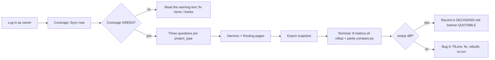

# TfLens — Usage Guide (Test Users · Test Plan · Setup)

> The single source for **how to test and run** this app. Every agent (flow-master self-smoke, the verifier) **and** the human UAT use the SAME test users and the SAME walkthrough listed here — no one invents throwaway accounts (enforced by `.tfcore/tasks/_smoke-test-policy.md`). Keep the Test-users table current: when an account is actually created, flip its `Created?` to ✅.

## Test users (canonical — use THESE for all smoke / verify / UAT)

TfLens is a **single-user** app: there is no user table. The one account is defined by configuration (`TfLensAuthUser` + `TfLensAuthPasswordHash`). "Creating" it means setting those two environment variables for the test environment — done on first build only after confirming with the owner.

| # | Username / Email | Password | Role / Permission | Created? | Notes |
|---|------------------|----------|-------------------|----------|-------|
| 1 | `owner` | `TfLens!Test23` | Owner (the single configured account — all pages) | ⬜ | Planned. Set `TfLensAuthUser=owner` and `TfLensAuthPasswordHash=<PBKDF2 of the password>` in the test env (`dotnet user-secrets` for dev, env vars in Docker). Never commit the hash. |
| 2 | *(anonymous)* | — | Unauthenticated visitor — may reach `/login` and `/healthz` only | n/a | Used to prove the redirect and the anonymous health endpoint. |

- **Created?** — ✅ = the account exists now (verified). ⬜ = planned; create it on first build, but **only after confirming with the owner** (see `_smoke-test-policy.md`). Never auto-create silently.
- **To add or confirm an account:** edit this table — it is the registry the whole pipeline reads from.
- **Seeding:** no database seed — the account is configuration. A helper verb `dotnet TfLens.dll hash-password <pw>` (Phase 1, F-SHELL) prints the PBKDF2 hash to paste into the env.
- **GitHub token for tests:** smoke/verify runs need a real fine-grained read-only PAT in `TfLensGitHubToken` **or** the fixture mode `TfLensFixtureRoot=tests/TfLens.Core.Tests/Fixtures` (Phase 1 adds an in-process fixture fetcher so the UI can be verified without network). Ask the owner which to use; never paste a token into a doc.

## How to test — screen by screen / menu by menu

One subsection per screen, in navigation order. Each names which test user to log in as.

**The weekly loop under test** (sync → coverage → questions → export → parity):



### Login (`/login`)
- **Log in as:** user 2 (anonymous) first, then user 1
- **Steps:** 1) Open `/three-questions` while signed out → 2) observe redirect to `/login?returnUrl=…` → 3) submit a wrong password → 4) submit `owner` / `TfLens!Test23`
- **Expected:** step 2 redirects; step 3 shows the generic "Sign-in failed." alert without saying which field was wrong; step 4 lands on `/three-questions` (the return URL) with the shell visible
- **Covers:** BRD-1, BRD-2, BRD-3

### Shell (sidebar + header)
- **Log in as:** user 1
- **Steps:** 1) Read the sidebar order → 2) click each item → 3) press **Sync now** → 4) press **Sign out**
- **Expected:** order is Coverage / health, Three questions, Harness comparison, Routing & economics, Snapshot export, Playbook; each route renders inside the same shell; Sync now shows a spinner, then one toast per repo (updated / skipped / error) and the "last sync" badge updates; Sign out returns to `/login`
- **Covers:** BRD-4, BRD-5, BRD-6

### Coverage / health (`/`)
- **Log in as:** user 1
- **Steps:** 1) Land on `/` after login → 2) read the status strip → 3) open each repo card → 4) find the stale repo (fixture: TrBlazeUI, sessions 11 days) → 5) expand "Fields observed that SCHEMA.md doesn't document" → 6) press **Rebuild…**, confirm
- **Expected:** landing page is Coverage (BRD-44); strip says GREEN or CHECK with the warning count; each card shows last sync, outcome, short SHA linked to GitHub, and a 4-row stream table with records / backfilled / newest / days-since; the stale repo shows the warning text "sessions/commits stale ≥ 7 days — this clone isn't pushing or lacks hooks; run update-framework.sh on it"; unknown fields list names only (fixture: `routed_reason`); rebuild reports files replayed / records / duplicates and the counts equal the pre-rebuild counts
- **Covers:** BRD-21, BRD-22, BRD-39, BRD-40, BRD-41, BRD-42, BRD-43, BRD-44

### Three questions (`/three-questions`)
- **Log in as:** user 1
- **Steps:** 1) Read the SCHEMA §6 note → 2) switch tabs `app` → `library` → `unclassified` → 3) on `app` read the three cards → 4) read the gate distribution table → 5) read the late-gate line → 6) expand the taint list
- **Expected:** there is **no "all" tab and no total row**; each card shows the live value with a "backfilled" secondary line, never a sum; a segment with fewer than 3 records shows the literal `insufficient data (n=…)`; the table lists gates in order build, acceptance, render, visual, perf, standards, escaped, unattributed, with `escaped` badged "no gate caught it" and `perf` badged "see coverage"; the perf line reads "ran on N records, caught K → …" or "not yet run on this data (gate added 2026-08-10)"; the taint list shows exactly the REQ IDs that have a backfilled record (fixture: REQ-UI-004, REQ-FN-011, REQ-UI-009)
- **Covers:** BRD-45, BRD-46, BRD-47, BRD-48, BRD-49, BRD-50 (and BRD-31..BRD-36 by observation)

### Harness comparison (`/harness`)
- **Log in as:** user 1
- **Steps:** 1) Read the three columns → 2) compare token rows → 3) read the dollars card → 4) search the page for any `$` total
- **Expected:** columns claude-code / opencode / "not detected" all render (a harness with 0 records shows `—`); tokens per Verified REQ per column or `insufficient data`; the dollars card shows the OpenCode sum labelled "the only measured dollars in the system" and the line "Claude Code: not measured (null by design)"; there is no cross-harness dollar total anywhere
- **Covers:** BRD-51, BRD-52, BRD-53, BRD-54, BRD-55

### Routing & economics (`/routing`)
- **Log in as:** user 1
- **Steps:** 1) Drift tab: find a `routed:false` row → 2) Models tab: read totals → 3) Repricing tab: read both cards and the excluded-runs line → 4) press **Edit prices.json**, change one output price, Save → 5) Poolable tab: read the five cards
- **Expected:** drift rows badge "drift" on `routed:false`; both repricing cards carry the exact badge "estimate — tokens × rate card, not measured spend" and name the most expensive observed model; the excluded count matches runs with `tokens_scope: none`; saving prices recomputes both cards immediately and a toast confirms the file write; a non-numeric price shows a field error and does not save; poolable cards match `tf-metrics.sh --rollup` for the same data (rework ratio, batch size, throughput, tokens per Verified, cadence + duplicates collapsed)
- **Covers:** BRD-56, BRD-57, BRD-58, BRD-59, BRD-60, BRD-61, BRD-62

### Snapshot export (`/export`)
- **Log in as:** user 1
- **Steps:** 1) Read the banner → 2) press **Export snapshot** → 3) open both files from the new row → 4) copy a SHA from the dataset table
- **Expected:** banner is NOT QUOTABLE until a parity run is recorded for the current parser version, QUOTABLE afterwards; export creates `data/reports/<today>/snapshot.md` and `tflens.json`; the JSON has top-level keys `per_repo`, `tainted_reqs`, `live`, `backfilled`, `pooled`, `extras`, `parity`; the markdown never shows a figure that mixes live and backfilled and labels every estimate; the row appears in the past-snapshots table with the parser version
- **Covers:** BRD-63, BRD-65, BRD-66, BRD-67, BRD-70

### Parity procedure (terminal — no screen)
- **Log in as:** n/a (operator at a shell)
- **Steps:** 1) `dotnet TfLens.dll export` → 2) clone the configured repos at the SHAs shown on `/export` → 3) `bash .tfcore/telemetry/tf-metrics.sh --rollup <repos…> --json > reference.json` → 4) `python3 tools/parity-compare.py reference.json data/reports/<date>/tflens.json`
- **Expected:** exit code 0 and "0 differences" on matching data; introduce a deliberate change (e.g. delete one backfilled record from a local copy) and the script exits non-zero naming the differing key; a passing run writes `data/parity-last.json` and the `/export` banner flips to QUOTABLE
- **Covers:** BRD-64, BRD-68, BRD-69, BRD-71, BRD-72

### Playbook (`/playbook`)
- **Log in as:** user 1
- **Steps:** 1) Open the page at day-1 (no Playbook data) → 2) after Phase 3, sync a `kind: playbook` repo and reopen
- **Expected:** day-1 shows the info note and the "No Playbook data yet" empty state; after Phase 3, one card per Playbook repo with phase totals, main-vs-subagent cards and the observed-fields list; nothing from this page appears on `/three-questions` and vice versa
- **Covers:** BRD-73, BRD-74, BRD-75, BRD-76

### Health endpoint (`/healthz`)
- **Log in as:** user 2 (anonymous)
- **Steps:** 1) `curl -s http://localhost:5099/healthz`
- **Expected:** 200 with DB reachability and last-successful-sync age only; no figures, no repo names beyond count
- **Covers:** BRD-78

### Logs (`logs/`)
- **Log in as:** n/a
- **Steps:** 1) run the app, sync once → 2) open the newest `logs/tflens-*.log`
- **Expected:** rolling daily file exists; sync lines carry repo, SHA, counts and status codes only — grep for the token value and for any JSON record body must find nothing
- **Covers:** BRD-10, BRD-86

## Prerequisites
- .NET 10 SDK (10.0.302 or later)
- Python 3 (for `tools/parity-compare.py` and `tf-metrics.sh`)
- Node 20 + Playwright (verifier harness; already provisioned by the framework)
- Docker (deployment only)

## Setup / Deployment steps (runbook — one command per line, in order)

Numbered, terse, copy-pasteable. Commands marked *(after Phase 1)* depend on projects that do not exist yet.

1. `git clone <repo> && cd TfLens`
2. `dotnet user-secrets init --project src/TfLens` *(after Phase 1)*
3. `dotnet user-secrets set TfLensGitHubToken <fine-grained PAT, contents:read> --project src/TfLens` *(after Phase 1)*
4. `dotnet user-secrets set TfLensAuthUser owner --project src/TfLens` *(after Phase 1)*
5. `dotnet run --project src/TfLens -- hash-password 'TfLens!Test23'` → paste into `dotnet user-secrets set TfLensAuthPasswordHash <hash> --project src/TfLens` *(after Phase 1)*
6. Edit `src/TfLens/appsettings.json` → `Repos[]` (owner, name, branch, kind) and `PollIntervalMinutes`
7. `dotnet restore`
8. `dotnet build`
9. `dotnet run --project src/TfLens --urls http://localhost:5099`
10. Open `http://localhost:5099` → `/login` → user 1 → press **Sync now**
11. Docker: `docker build -t tflens .` then `docker run -p 8080:8080 -v $PWD/data:/app/data -v $PWD/logs:/app/logs -e TfLensGitHubToken=… -e TfLensAuthUser=… -e TfLensAuthPasswordHash=… tflens` *(after Phase 1)*
12. Operations: `dotnet TfLens.dll rebuild` · `dotnet TfLens.dll sync` · `dotnet TfLens.dll export [--date yyyy-MM-dd]` (or the same via `docker exec`)

## Test (automated)
```bash
dotnet test
```
Playwright specs are added by the verifier under `tests/` from Phase 2 onward; run with `npx playwright test` once present.

## Smoke checklist (quick capability pass)
- [ ] Signed-out visit to `/` redirects to `/login`; user 1 signs in and lands on Coverage
- [ ] Sync now completes with one toast per repo and updates the last-sync badge
- [ ] Coverage shows per-stream days-since and flags the stale fixture repo in words
- [ ] Three questions has no "all" tab; a thin segment prints `insufficient data (n=…)`
- [ ] Harness page shows OpenCode-only dollars and no cross-harness dollar total
- [ ] Routing repricing cards carry the estimate badge; editing prices recomputes
- [ ] Export writes `snapshot.md` + `tflens.json`; banner reflects parity state
- [ ] `parity-compare.py` exits 0 on the reference dataset
- [ ] `/healthz` answers anonymously; `logs/tflens-*.log` contains no token and no record bodies

## Known limitations
- Day-1: no code exists; every step marked *(after Phase 1)* is a roadmap item.
- Phase 3 Playbook adapter is schema-discovery-first — its columns are provisional until the real `events.ndjson` is parsed.
- Harness, routing and repricing figures have no reference implementation; they are spot-checked by hand once (BRD-72), not parity-diffed.
- TrBlazeUI gaps observed at design time (no KPI card, no plain table primitives, no theme toggle) — see `docs/TfLens-UIDesign.md` §Library gaps; logged to `docs/TfLens-TrBlazeUI-Feedback.md` at build if still true.
