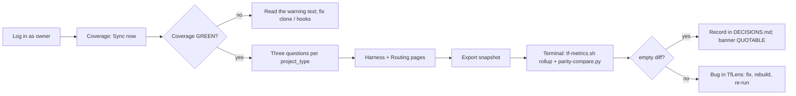

# TfLens — Usage Guide (Test Users · Test Plan · Setup)

> The single source for **how to test and run** this app. Every agent (flow-master self-smoke, the verifier) **and** the human UAT use the SAME test users and the SAME walkthrough listed here — no one invents throwaway accounts (enforced by `.tfcore/tasks/_smoke-test-policy.md`). Keep the Test-users table current: when an account is actually created, flip its `Created?` to ✅.

## Test users (canonical — use THESE for all smoke / verify / UAT)

TfLens has **no user table** — identity is the owner's AppManager service (Application Id 1, `docs/AppManager-api-usage-guide.md`). Test accounts are AppManager users; "creating" one means registering it through `/register` (or `POST /AuthSvc/register`) against the real AppManager with role `Manager` — done during development, only after confirming with the owner. *(amended 2026-08-26)*

| # | Username / Email | Password | Role / Permission | Created? | Notes |
|---|------------------|----------|-------------------|----------|-------|
| 1 | `TfLensDemo` — `tflensdemo@techierathore.com` | `TfLensDemo!23` | Manager (every TfLens user) — the demo/test account (BRD-96) | ⬜ | Registered in AppManager during Phase 1 build; pre-connected to the `DemoSeedRepos` from `appsettings.json`. Password may be rotated by the owner — update here. |
| 2 | `tflenstest2@techierathore.com` | `TfLensTest2!23` | Manager — second user for tenant-isolation tests (BRD-102) | ⬜ | Registered via `/register` during verify; connects a different public repo; must never see user 1's repos. |
| 3 | *(anonymous)* | — | Unauthenticated visitor — may reach `/login`, `/register`, `/forgot-password`, `/reset-password`, `/healthz` only | n/a | Proves the redirect and the anonymous routes. |

- **Created?** — ✅ = the account exists in AppManager now (verified). ⬜ = planned; create it on first build, but **only after confirming with the owner** (see `_smoke-test-policy.md`). Never auto-create silently.
- **To add or confirm an account:** edit this table — it is the registry the whole pipeline reads from.
- **Seeding:** no database seed; accounts live in AppManager. User 1's demo repos are connected by hand through the Repos screen during the Phase 1 build (no configuration seed — amended 2026-08-26).
- **Secrets for tests:** `TfLensAppManagerApiKey` / `TfLensAppManagerApiSecret` / `TfLensDbConnection` must be set (dev: `dotnet user-secrets`; the AppManager pair is in the owner's gitignored `CLAUDE.md` until then). `TfLensGitHubToken` is optional (public repos only). Fixture mode `TfLensFixtureRoot=tests/TfLens.Core.Tests/Fixtures` lets the UI be verified without GitHub. Never paste a secret into a doc.

## How to test — screen by screen / menu by menu

One subsection per screen, in navigation order. Each names which test user to log in as.

**The weekly loop under test** (sync → coverage → questions → export → parity):



### Login (`/login`)
- **Log in as:** user 3 (anonymous) first, then user 1
- **Steps:** 1) Open `/three-questions` while signed out → 2) observe redirect to `/login?returnUrl=…` → 3) submit a wrong password → 4) submit `tflensdemo@techierathore.com` / `TfLensDemo!23`
- **Expected:** step 2 redirects; step 3 shows the generic "Sign-in failed." alert (AppManager `INVALID_CREDENTIALS` is logged, never shown); step 4 lands on `/three-questions` (the return URL) with the shell visible and the header showing "TfLens Demo"; no GitHub button is present (deferred)
- **Covers:** BRD-1, BRD-2, BRD-90, BRD-93, BRD-94 (absence)

### Register (`/register`)
- **Log in as:** user 3 (anonymous)
- **Steps:** 1) Open `/register` → 2) submit with password `weak` → 3) submit user 2's details with a valid password → 4) observe the landing page
- **Expected:** step 2 shows inline rule errors (8+, uppercase, digit, special) before any API call; step 3 registers via AppManager with role Manager and signs the user in; step 4 lands on `/repos` with the "No repos connected yet" empty state; the info alert says every account is a Manager
- **Covers:** BRD-91, BRD-95

### Forgot / reset password (`/forgot-password`, `/reset-password`)
- **Log in as:** user 3 (anonymous)
- **Steps:** 1) Submit user 1's email on `/forgot-password` → 2) submit a non-existent email → 3) open `/reset-password?token=bogus` and submit a valid password → 4) (owner) use a real emailed token
- **Expected:** steps 1 and 2 show the identical enumeration-safe success message; step 3 shows "This reset link is invalid or has expired."; step 4 shows "Password updated." with a Sign in button
- **Covers:** BRD-92

### Profile (`/profile`)
- **Log in as:** user 1
- **Steps:** 1) Open the user menu → Profile → 2) read the profile card → 3) change password with a wrong current password → 4) change it correctly and back again
- **Expected:** card shows email, name, role badge Manager, member since, identity provider AppManager; step 3 shows `FieldError` "current password is incorrect"; step 4 toasts success twice and the user can still sign in with the original password
- **Covers:** BRD-107, BRD-106

### Shell (sidebar + header)
- **Log in as:** user 1
- **Steps:** 1) Read the sidebar order and icons → 2) click the sidebar trigger to collapse, hover an item, expand again → 3) click each item → 4) flip the header **Framework switch** to Playbook and back → 5) press **Sync now** → 6) open the user menu (name on the right) → 7) toggle the theme → 8) Sign out from the menu
- **Expected:** order is Repos, Coverage / health, Three questions, Harness comparison, Routing & economics, Snapshot export, each with a Lucide icon (no Playbook item — it is the Framework switch); switching to Playbook shows the Playbook state of the current page ("No Playbook data yet" until Phase 3) and the choice survives a reload; collapsed sidebar shows icons only with tooltips and the state survives a reload; each route renders inside the same shell; Sync now shows a spinner, then one toast per repo and the "synced N min ago" badge updates; the user menu shows the email, Profile, Manage repos, Sign out — there is no bare Sign-out button; the app opened in dark mode and the toggle persists light mode across reloads; Sign out calls AppManager logout and returns to `/login`
- **Covers:** BRD-4, BRD-5, BRD-6, BRD-85, BRD-105, BRD-106

### Repos (`/repos`)
- **Log in as:** user 1, then user 2
- **Steps:** 1) Read the repos table → 2) Connect repo with `https://github.com/techierathore/TrBlazeUI` → Validate → Connect → 3) try a private repo URL → 4) try a public repo without telemetry (e.g. `octocat/Hello-World`) → 5) try connecting a repo already in the list → 6) Remove a repo and confirm → 7) sign in as user 2 and open `/repos`
- **Expected:** step 1 shows the seeded demo repos with kind/public/status/last sync/records; step 2 shows the three green validation lines, connects, runs the first sync and toasts; step 3 refuses with "Private repos aren't supported in this release"; step 4 refuses with "no TechieFlow or Playbook telemetry"; step 5 refuses as duplicate; step 6 removes the row and the Coverage page no longer shows that repo; step 7 shows the empty state — none of user 1's repos are visible (isolation)
- **Covers:** BRD-98, BRD-99, BRD-100, BRD-101, BRD-102, BRD-104

### Coverage / health (`/`)
- **Log in as:** user 1
- **Steps:** 1) Land on `/` after login → 2) read the status strip → 3) open each repo card → 4) find the stale repo (fixture: TrBlazeUI, sessions 11 days) → 5) expand "Fields observed that SCHEMA.md doesn't document" → 6) press **Rebuild…**, confirm
- **Expected:** landing page is Coverage (BRD-44); strip says GREEN or CHECK with the warning count; each card shows last sync, outcome, short SHA linked to GitHub, and a 4-row stream table with records / backfilled / newest / days-since; the stale repo shows the warning text "sessions/commits stale ≥ 7 days — this clone isn't pushing or lacks hooks; run update-framework.sh on it"; unknown fields list names only (fixture: `routed_reason`); rebuild reports files replayed / records / duplicates and the counts equal the pre-rebuild counts
- **Covers:** BRD-21, BRD-22, BRD-39, BRD-40, BRD-41, BRD-42, BRD-43, BRD-44

### Three questions (`/three-questions`)
- **Log in as:** user 1
- **Steps:** 1) Read the SCHEMA §6 note → 2) switch tabs `app` → `library` → `unclassified` → 3) on `app` read the three cards → 4) read the gate distribution table → 5) read the late-gate line → 6) expand the taint list
- **Expected:** there is **no "all" tab and no total row**; each card shows the live value with a "backfilled" secondary line, never a sum; a segment with fewer than 3 records shows the literal `insufficient data (n=…)`; the table lists gates in order build, acceptance, render, visual, perf, standards, escaped, unattributed, with `escaped` badged "no gate caught it" and `perf` badged "see coverage"; the perf line reads "ran on N records, caught K → …" or "not yet run on this data (gate added 2026-08-10)"; the taint list shows exactly the REQ IDs that have a backfilled record (fixture: REQ-UI-004, REQ-FN-011, REQ-UI-009)
- **Covers:** BRD-45, BRD-46, BRD-47, BRD-48, BRD-49, BRD-50 (and BRD-31..BRD-36 by observation)

### Harness comparison (`/harness`)
- **Log in as:** user 1
- **Steps:** 1) Read the three columns → 2) compare token rows → 3) read the dollars card → 4) search the page for any `$` total
- **Expected:** columns claude-code / opencode / codex all render (a harness with 0 records shows `—`); records with `harness: null` appear only as the footnote "n records with harness not detected — excluded from the columns above" (hidden when n = 0), never as a column; tokens per Verified REQ per column or `insufficient data`; the dollars card shows the OpenCode sum labelled "the only measured dollars in the system" and the line "Claude Code and Codex: not measured (null by design)"; there is no cross-harness dollar total anywhere
- **Covers:** BRD-51, BRD-52, BRD-53, BRD-54, BRD-55

### Routing & economics (`/routing`)
- **Log in as:** user 1
- **Steps:** 1) Drift tab: find a `routed:false` row → 2) Models tab: read totals → 3) Repricing tab: read both cards and the excluded-runs line → 4) press **Edit prices.json**, change one output price, Save → 5) Poolable tab: read the five cards
- **Expected:** drift rows badge "drift" on `routed:false`; both repricing cards carry the exact badge "estimate — tokens × rate card, not measured spend" and name the most expensive observed model; the excluded count matches runs with `tokens_scope: none`; saving prices recomputes both cards immediately and a toast confirms the file write; a non-numeric price shows a field error and does not save; poolable cards match `tf-metrics.sh --rollup` for the same data (rework ratio, batch size, throughput, tokens per Verified, cadence + duplicates collapsed)
- **Covers:** BRD-56, BRD-57, BRD-58, BRD-59, BRD-60, BRD-61, BRD-62

### Snapshot export (`/export`)
- **Log in as:** user 1
- **Steps:** 1) Read the banner → 2) press **Export snapshot** → 3) open both files from the new row → 4) copy a SHA from the dataset table
- **Expected:** banner is NOT QUOTABLE until a parity run is recorded for the current parser version, QUOTABLE afterwards; export creates `data/reports/<today>/snapshot.md` and `tflens.json`; the JSON has top-level keys `per_repo`, `tainted_reqs`, `live`, `backfilled`, `pooled`, `extras`, `parity`; the markdown never shows a figure that mixes live and backfilled and labels every estimate; the row appears in the past-snapshots table with the parser version
- **Covers:** BRD-63, BRD-65, BRD-66, BRD-67, BRD-70

### Parity procedure (terminal — no screen)
- **Log in as:** n/a (operator at a shell)
- **Steps:** 1) `dotnet TfLens.dll export` → 2) clone the configured repos at the SHAs shown on `/export` → 3) `bash .tfcore/telemetry/tf-metrics.sh --rollup <repos…> --json > reference.json` → 4) `python3 tools/parity-compare.py reference.json data/reports/<date>/tflens.json`
- **Expected:** exit code 0 and "0 differences" on matching data; introduce a deliberate change (e.g. delete one backfilled record from a local copy) and the script exits non-zero naming the differing key; a passing run writes `data/parity-last.json` and the `/export` banner flips to QUOTABLE
- **Covers:** BRD-64, BRD-68, BRD-69, BRD-71, BRD-72

### Playbook framework state (Framework switch → Playbook, every report page)
- **Log in as:** user 1
- **Steps:** 1) On `/` flip the Framework switch to Playbook (before Phase 3) → 2) after Phase 3, connect a Playbook repo, sync, and walk `/`, `/three-questions`, `/harness`, `/routing`, `/export` with Playbook selected → 3) flip back to TechieFlow on each page
- **Expected:** before Phase 3 every page shows the info note and the "No Playbook data yet" empty state; after Phase 3 the same layouts render Playbook data (Three questions keyed by `phase_gate`, phase totals, main-vs-subagent split, observed-fields list), the export writes a separate Playbook snapshot, and no figure from one framework appears under the other
- **Covers:** BRD-73, BRD-74, BRD-75, BRD-76, BRD-108, BRD-109, BRD-110

### Health endpoint (`/healthz`)
- **Log in as:** user 3 (anonymous)
- **Steps:** 1) `curl -s http://localhost:5099/healthz`
- **Expected:** 200 with DB reachability and last-successful-sync age only; no figures, no repo names beyond count
- **Covers:** BRD-78

### Logs (`logs/`)
- **Log in as:** n/a
- **Steps:** 1) run the app, sync once → 2) open the newest `logs/tflens-*.log`
- **Expected:** rolling daily file exists; sync lines carry user id, repo, SHA, counts and status codes only — grep for the AppManager secret, any access/refresh token, any password and for any JSON record body must find nothing
- **Covers:** BRD-10, BRD-86, BRD-97

## Prerequisites
- .NET 10 SDK (10.0.302 or later)
- PostgreSQL 16 (local install, or the `postgres` service in `docker-compose.yml`)
- Python 3 (for `tools/parity-compare.py` and `tf-metrics.sh`)
- Node 20 + Playwright (verifier harness; already provisioned by the framework)
- Docker (deployment only)

## Setup / Deployment steps (runbook — one command per line, in order)

Numbered, terse, copy-pasteable. Commands marked *(after Phase 1)* depend on projects that do not exist yet.

1. `git clone <repo> && cd TfLens`
2. `dotnet user-secrets init --project src/TfLens` *(after Phase 1)*
3. `dotnet user-secrets set TfLensAppManagerApiKey <key> --project src/TfLens` *(after Phase 1)*
4. `dotnet user-secrets set TfLensAppManagerApiSecret <secret> --project src/TfLens` *(after Phase 1)*
5. `docker compose up -d postgres` then `dotnet user-secrets set TfLensDbConnection "Host=localhost;Port=5432;Database=tflens;Username=tflens;Password=<pw>" --project src/TfLens` *(after Phase 1)*
5a. `dotnet user-secrets set TfLensGitHubToken <optional PAT for rate-limit headroom> --project src/TfLens` *(optional, after Phase 1)*
6. Edit `src/TfLens/appsettings.json` → `PollIntervalMinutes`, `AppManager:BaseUrl`, `AppManager:AppId` (1) — there is no repo list in configuration
7. `dotnet restore`
8. `dotnet build`
9. `dotnet run --project src/TfLens --urls http://localhost:5099`
10. Open `http://localhost:5099` → `/login` → user 1 (or `/register` for a new account) → **Repos** → Connect a public repo → press **Sync now**
11. Docker: `docker compose up -d` (services `postgres` + `tflens`; env `TfLensAppManagerApiKey`, `TfLensAppManagerApiSecret`, `TfLensDbConnection` [+ `TfLensGitHubToken`] from `.env`, never committed) *(after Phase 1)*
12. Operations: `dotnet TfLens.dll rebuild` · `dotnet TfLens.dll sync` · `dotnet TfLens.dll export [--date yyyy-MM-dd]` (or the same via `docker exec`)

## Test (automated)
```bash
dotnet test
```
Playwright specs are added by the verifier under `tests/` from Phase 2 onward; run with `npx playwright test` once present.

## Smoke checklist (quick capability pass)
- [ ] Signed-out visit to `/` redirects to `/login`; user 1 signs in via AppManager and lands on Coverage; app opens in dark mode
- [ ] A new account registers at `/register` (role Manager) and lands on the empty `/repos`
- [ ] Connect a public repo validates (exists · public · telemetry path) and first-syncs; a private repo is refused
- [ ] User 2 cannot see user 1's repos or figures
- [ ] Sidebar collapses to icons; user menu on the right holds Profile / Manage repos / Sign out
- [ ] Sync now completes with one toast per repo and updates the last-sync badge
- [ ] Coverage shows per-stream days-since and flags the stale fixture repo in words
- [ ] Three questions has no "all" tab; a thin segment prints `insufficient data (n=…)`
- [ ] Harness page shows OpenCode-only dollars and no cross-harness dollar total
- [ ] Routing repricing cards carry the estimate badge; editing prices recomputes
- [ ] Export writes `snapshot.md` + `tflens.json`; banner reflects parity state
- [ ] `parity-compare.py` exits 0 on the reference dataset
- [ ] `/healthz` answers anonymously; `logs/tflens-*.log` contains no token and no record bodies

## Known limitations
- Day-1: no code exists; every step marked *(after Phase 1)* is a roadmap item.
- GitHub SSO (BRD-94) is deferred to Phase 2 — AppManager has no external-login endpoint yet; the login page shows no GitHub button.
- Public GitHub repos only in this release; private repos are refused at connect time.
- Playbook report set (Framework switch → Playbook) is Phase 3; until then it shows the empty state.
- Phase 3 Playbook adapter is schema-discovery-first — its columns are provisional until the real `events.ndjson` is parsed.
- Harness, routing and repricing figures have no reference implementation; they are spot-checked by hand once (BRD-72), not parity-diffed.
- TrBlazeUI gaps observed at design time (no KPI card, no plain table primitives, no theme toggle) — see `docs/TfLens-UIDesign.md` §Library gaps; logged to `docs/TfLens-TrBlazeUI-Feedback.md` at build if still true.
